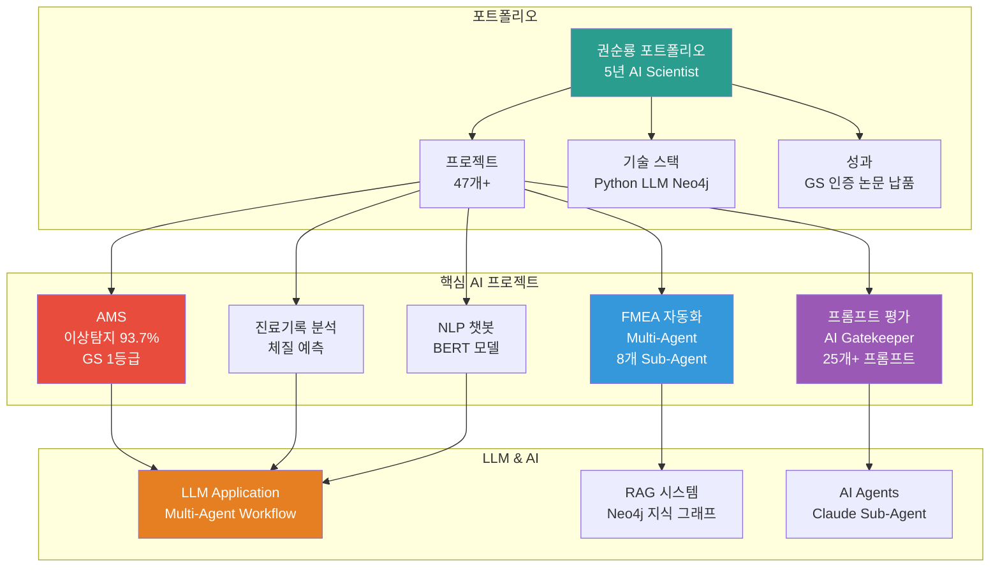
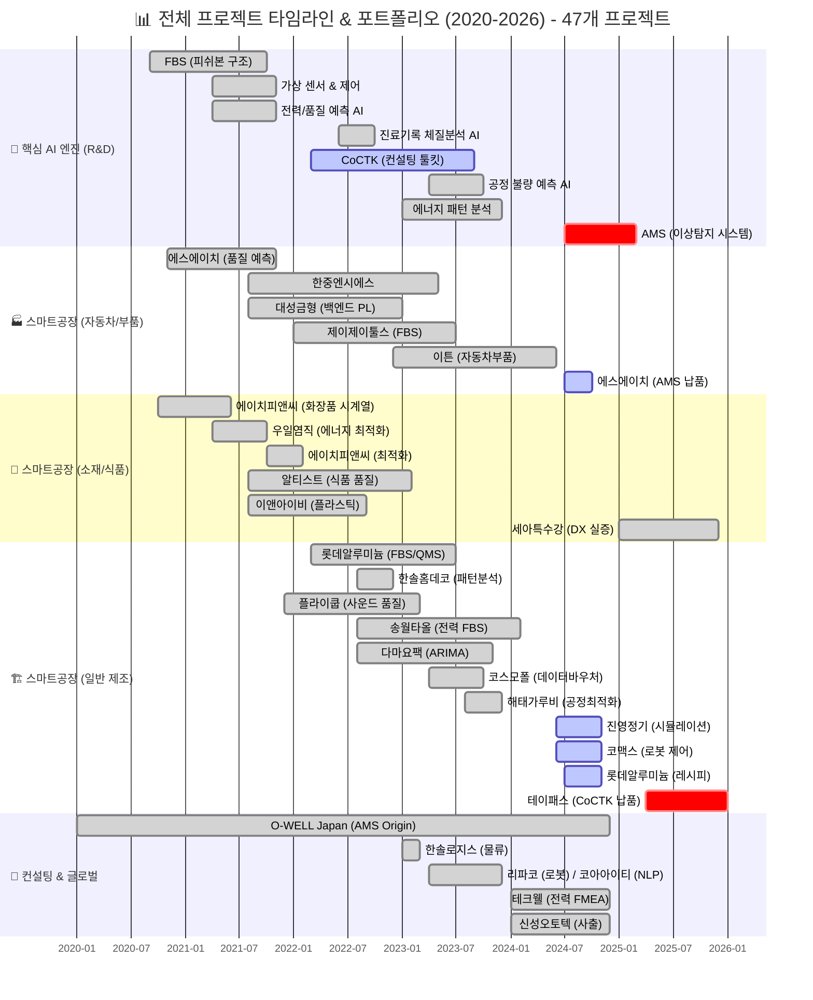
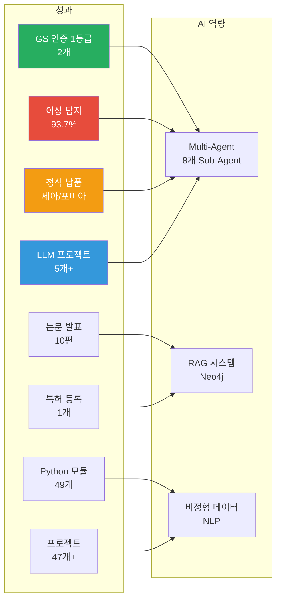
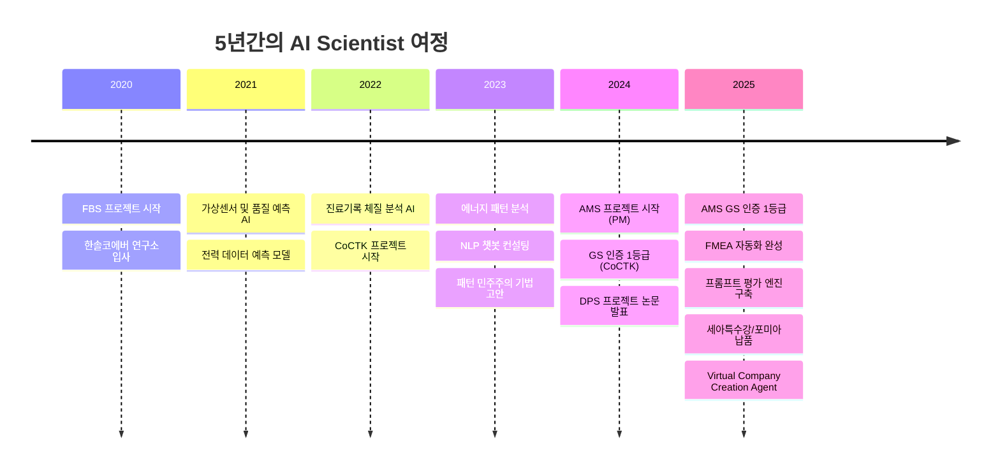
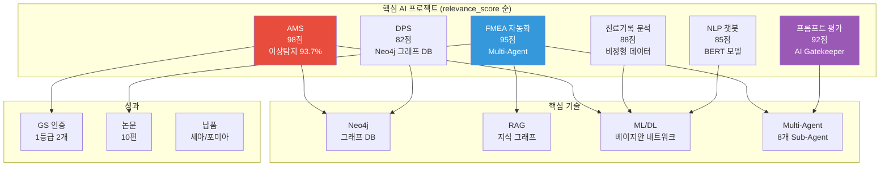
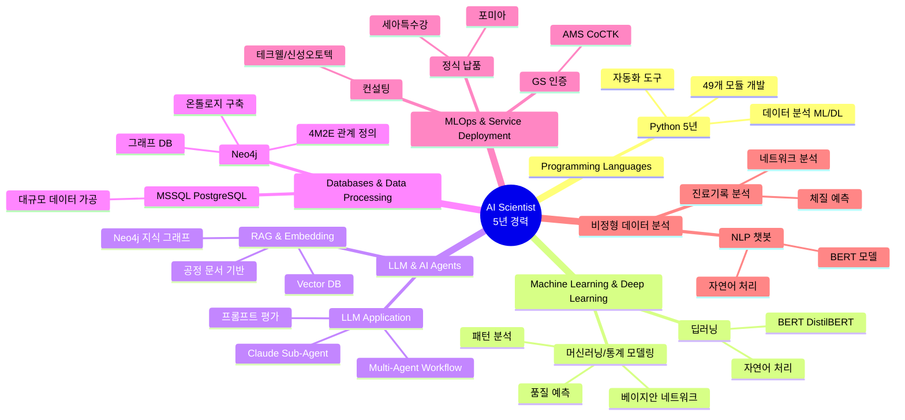

# 권순룡 포트폴리오

> **"모델보다 데이터, 데이터보다 정보, 지식구조를 정리하는 현장친화적 연구원"**

---

## 📌 기본 정보

**이름**: 권순룡  
**GitHub**: https://github.com/moobaek

---

## 📊 포트폴리오 구조 (한눈에 보기)

## 📅 연도별 프로젝트 종합 현황 (2020-2026)

> [!INFO] **총 프로젝트 현황**
> - **AI & Analytics**: 7개 (AMS, CoCTK, FBS 등)
> - **스마트공장 구축**: 23개 (에스에이치아이엔티, 롯데알루미늄 등)
> - **컨설팅**: 8개 (테크웰, 신성오토텍 등)
> - **AI 에이전트**: 9개 (FMEA, PM Agent 등)

---

## 📂 사업/과제 이력 

| 구분 | 사업/프로젝트 | 기간 / 기관 | 역할 | CJ올리브영 연관 포인트 |
|:---|:---|:---|:---|:---|
| 🔴 | AMS (Analysis Management System) | 2024.07~2025.12 / 한국산업기술진흥원 | AI 종합 플랫폼 총괄 PM | 데이터 품질 관리, 이상 탐지, 지표 정합성, 지표 모델링, 파이프라인 운영 |
| 🔴 | DPS (데이터수집시스템) | 2022.03~2024.12 / 중소기업기술정보진흥원 | 데이터 수집·파이프라인 총괄 PM | 대규모 데이터 파이프라인, 데이터 통합, Neo4j 기반 관계 구조 |
| 🔴 | CoCTK (Consulting Tool Kit) | 2022.03~2024.12 / 중소기업기술정보진흥원 | 엔진·화면 설계 총괄 PM | 데이터 전처리, 상관관계 분석, 비용·성과 최적화 지표 설계 |
| 🔴 | Evaluation_Framework | 2024.01~2025.12 / 내부 개발 | 데이터 품질 검증 시스템 개발 | 데이터 품질 점검, 지표 정기 검증, 시스템 단위 QA 체계 |
| 🔴 | pipeline_system_complete | 2023.01~2024.12 / 내부 개발 | 시계열 파이프라인 설계·개발 | 로그·시계열 데이터 수집·검증 파이프라인 경험 |
| 🟠 | 오웰(일본) 자동차 도정 DX | 2023.12~2025.03 / O-WELL | 인과 관계 다이어그램 AI 엔진 PM | 복잡한 행동/상태 로그의 관계 구조 모델링, 글로벌 협업 경험 |
| 🟠 | 포미아 DX 실증센터 분석 플랫폼 | 2025.06~2025.10 / 세아특수강·ISTN에임즈 | 분석 플랫폼 PM 총괄 | 복수 데이터 소스 연동, 분석용 데이터 레이어 설계 |
| 🟠 | 테크웰 AMS 컨설팅 | 2025.03~2025.07 / 포다스 용역 | 데이터 분석 PM | 이해관계자 커뮤니케이션, 현장 컨설팅 경험 |
| 🟡 | 에너지·전력 패턴·가상센서 계열 다수 | 2021~2024 / 한국에너지기술평가원 외 | AI 엔진 개발·PM | 시계열·센서 로그 처리 경험, 다양한 도메인 데이터 분석 폭 |

세부 사업 내용과 역할은 아래 **주요 프로젝트** 섹션과 Git 리포지토리에서 확인 가능합니다.  
참조: https://github.com/moobaek/Testing_AI_agents_for_public_use/blob/main/portfolio/portfolio_docs/02_Projects_Overview.md

---

## 🎯 핵심 성과 대시보드

| 분류 | 지표 | 상세 |
|:---|---:|:---|
| **인증** | GS 1등급 2개 | AMS (PDS 명칭), CoCTK |
| **정확도** | 이상 탐지 93.7% | 베이지안 네트워크 기반 |
| **납품** | 정식 납품 2곳 | 세아특수강, 포미아 |
| **학술** | 논문 발표 10편 | 2020-2025년 지속적 연구 |
| **지식재산** | 특허 등록 1개 | 피쉬본 관리 시스템 |
| **개발** | Python 모듈 49개 | MLS, CoCTK, FBS, RMS, AMS |
| **프로젝트** | 총 47개+ | AI, 플랫폼, 센서, 에너지 등 |
| **LLM** | LLM 프로젝트 5개+ | FMEA, 프롬프트 평가, Virtual Company 등 |

---

## 📅 경력 타임라인 (2020-2025)

---

## 🏆 주요 프로젝트 (47개+)

### 프로젝트 관계도

### 1. AMS (Analysis Management System) - 총괄 PM

**기간**: 2024.07 ~ 2025.03  
**역할**: 총괄 PM  
**발주처**: 한국산업기술진흥원  
**매칭 점수**: 98점

**핵심 성과**:
- ✅ **베이지안 네트워크 기반 이상 탐지 모델 개발**: 이상탐지율 93.7% 달성, 실질적 정확도 60~70%로 투명하게 공개
- ✅ **Neo4j 그래프 DB 활용**: 4M2E 관계 정의, 지식 그래프 플랫폼 구축
- ✅ **GS 인증 1등급 (PDS 명칭)**: 특허 등록, 논문 발표 (2025, 2024)
- ✅ **정식 납품**: 세아특수강, 포미아 DX 실증센터 구축 (PM)
- ✅ **MLOps 실무 경험**: 테크웰/신성오토텍 AMS 컨설팅, PoC → Pilot → 운영 전환 수행
- ✅ **49개 Python 모듈 개발**: MLS, CoCTK, FBS, RMS, AMS 통합 시스템

**기술 스택**: Python, Neo4j, pandas, numpy, scikit-learn, pgmpy, 베이지안 네트워크

**담당 업무 매칭**:
- ✅ 정형·비정형 데이터 기반 머신러닝/딥러닝 모델 설계 및 개발
- ✅ 이상탐지, 분류, 예측, 유사도 분석 등 데이터 기반 분석 모델 개발
- ✅ AI 모델의 실제 업무 적용을 위한 PoC → Pilot → 운영 전환 수행
- ✅ 온톨로지 또는 그래프 데이터베이스 활용 능력
- ✅ AI 모델의 운영(MLOps) 또는 서비스 적용 경험
- ✅ 규제·컴플라이언스 환경에서의 AI 적용 경험

---

### 2. FMEA 자동화 생성 시스템 (Claude Sub-Agent) - Master Orchestrator 설계

**기간**: 2025.06 ~  
**역할**: Master Orchestrator 설계  
**매칭 점수**: 95점

**핵심 성과**:
- ✅ **Claude Sub-Agent 기반 Multi-Agent Workflow**: 8개 독립 Sub-Agent 협업 구조 (R&D Team 3개, Manufacturing Team 3개, QA Team 2개)
- ✅ **코딩 에이전트 역설계 시스템 구조 적용**: 복잡한 FMEA 프로세스를 역으로 분석하여 8개 Sub-Agent로 분해
- ✅ **Neo4j 기반 지식 그래프 RAG**: 공정 관리 문서 기반 FMEA 자동 생성
- ✅ **AIAG & VDA FMEA 표준 기반**: 범용 리스크 분석 시스템
- ✅ **Phase 0~5 자동화 워크플로우**: 컨텍스트 수집 → 범위 정의 → 심층 분석 → 리스크 평가 → 최적화 & 문서 생성 → 지속 개선
- ✅ **논문 발표 (2025)**: 상관/확률 네트워크 최적 경로 정보 기반 FMEA 생성 연구

**기술 스택**: Claude, LLM, RAG, Neo4j, Multi-Agent Architecture, Claude Code Task tool

**담당 업무 매칭**:
- ✅ LLM(대규모 언어모델)을 활용한 업무 자동화 및 지능화 Use Case 설계
- ✅ RAG(Retrieval-Augmented Generation) 기반 AI 서비스 아키텍처 설계
- ✅ Rule-based 방식과 ML/AI 모델의 결합 설계 (Hybrid AI)
- ✅ LLM(OpenAI, Azure OpenAI, 오픈소스 LLM 등) 활용 프로젝트 경험
- ✅ RAG, Embedding, Vector DB 기반 AI 서비스 구현 경험

---

### 3. 프롬프트 평가 엔진 (Claude Sub-Agent) - AI Gatekeeper

**기간**: 2025.06 ~  
**역할**: AI Gatekeeper 설계  
**매칭 점수**: 92점

**핵심 성과**:
- ✅ **전체 프롬프트 전수 평가 시스템**: 25개+ 프롬프트의 품질을 승인/반려하는 완전 자동화 시스템
- ✅ **3가지 핵심 차원 평가**: Quality, Consistency, Cost
- ✅ **17가지 역할별 동적 가중치 시스템**: 각 역할에 맞는 최적화된 평가
- ✅ **병렬 처리 구조**: 4개 메트릭 동시 평가로 효율성 극대화
- ✅ **AI 생성 프롬프트를 다른 AI가 평가**: 이중 검증(Double-Check) 시스템으로 환각 방지
- ✅ **MLOps Priority Matrix**: 실패 영향 기반 가중치 (Structural 40%, Correctness 30%, Relevancy 20%, Tone 10%)
- ✅ **Human-in-the-Loop 8단계 필수 검증 프로세스**: 배치 처리 지원

**기술 스택**: Claude, LLM, Evaluation Framework, 병렬 처리, 구조화된 평가 프레임워크

**담당 업무 매칭**:
- ✅ LLM(대규모 언어모델)을 활용한 업무 자동화 및 지능화 Use Case 설계
- ✅ 모델 성능 평가 지표 정의 및 지속적 개선
- ✅ LLM(OpenAI, Azure OpenAI, 오픈소스 LLM 등) 활용 프로젝트 경험

---

### 4. 진료기록 체질 분석 시스템 - AI 엔진 개발

**기간**: 2022.06 ~ 2022.10  
**역할**: AI 엔진 개발  
**발주처**: 한국데이터산업진흥원  
**매칭 점수**: 88점

**핵심 성과**:
- ✅ **비정형 텍스트를 구조화된 데이터로 변환**: 진료기록 비정형 텍스트를 0/1 바이너리 테이블로 변환
- ✅ **네트워크 분석 및 체질 예측**: 단순 워드클라우드 한계 극복
- ✅ **헬스케어 AI 적용**: 한의원 진료 기록 기반 체질 예측 AI 시스템 개발

**기술 스택**: Python, ML, Network Analysis, NLP

**담당 업무 매칭**:
- ✅ 정형·비정형 데이터 기반 머신러닝/딥러닝 모델 설계 및 개발
- ✅ 비정형 데이터(문서, PDF, 계약서, 로그 등) 분석 경험

---

### 5. 코아아이티 자연어 처리 & 챗봇 컨설팅 - NLP 컨설팅

**기간**: 2023.04 ~ 2023.12  
**역할**: NLP 컨설팅  
**발주처**: 충북과학기술원 주관 산업 디지털 전환 지원체계 구축사업  
**매칭 점수**: 85점

**핵심 성과**:
- ✅ **BERT 기반 자연어 처리 모델 생성**: BertForSequenceClassification, DistilBERT 등 다양한 모델 실험
- ✅ **한약재/건강식품 데이터 분석**: 자연어처리 파이프라인 구축, 효과 및 주의사항 정보 구조화
- ✅ **공정 데이터 자연어 처리**: 공정 기능 추출, 토큰화, 벡터화, DistilBERT 모델 적용

**기술 스택**: BERT, DistilBERT, NLP, Python

**담당 업무 매칭**:
- ✅ 정형·비정형 데이터 기반 머신러닝/딥러닝 모델 설계 및 개발
- ✅ 비정형 데이터(문서, PDF, 계약서, 로그 등) 분석 경험

---

### 6. DPS (데이터수집시스템) - 핵심 아키텍처 설계 및 개발 (PM 수행)

**기간**: 2021 ~ 2024  
**역할**: 핵심 아키텍처 설계 및 개발 (PM 수행)  
**매칭 점수**: 82점

**핵심 성과**:
- ✅ **Neo4j 그래프 DB 활용**: 5층 아키텍처, 4M2E 관계 정의, 온톨로지 기반 관계 분석
- ✅ **마이크로서비스 아키텍처**: Docker 컨테이너 기반, 서버-엣지 하이브리드 인프라 지원
- ✅ **논문 발표 (2024)**: 공장 운영 핵심 요소의 식별 및 최적화를 위한 클러스터링 기법 적용

**기술 스택**: Neo4j, Python, Docker, Kubernetes, Microservices

**담당 업무 매칭**:
- ✅ 온톨로지 또는 그래프 데이터베이스 활용 능력
- ✅ 데이터 엔지니어, 시스템 엔지니어, 도메인 전문가와 협업하여 AI 솔루션 구현

---

### 7. CoCTK (Consulting Tool Kit) - 총괄 PM

**기간**: 2022.03 ~ 2024  
**역할**: 엔진 총괄 설계 및 화면설계 개발 총괄 PM  
**발주처**: 중소기업기술정보진흥원  
**매칭 점수**: 78점

**핵심 성과**:
- ✅ **GS 1등급 취득 (2024)**: 데이터 전처리, 상관관계 분석, 비용 최적화 엔진 개발
- ✅ **논문 발표 (2023)**: 생산공정 에너지 및 설비 상태 데이터 패턴 분석
- ✅ **규제·컴플라이언스 환경 경험**: GS 인증 프로세스 수행

**기술 스택**: Python, pandas, numpy, scikit-learn

**담당 업무 매칭**:
- ✅ 머신러닝/통계 모델링 실무 경험
- ✅ Pandas, NumPy, Scikit-learn 등 데이터 분석 라이브러리 활용 능력
- ✅ 규제·컴플라이언스 환경에서의 AI 적용 경험

---

### 8. 생산공정 에너지 및 설비 상태 데이터 패턴 분석 - 메인 수행

**기간**: 2023  
**역할**: 메인 수행 (초기 백엔드 개발 → 풀스택 개발 및 총괄 PM으로 확장)  
**매칭 점수**: 72점

**핵심 성과**:
- ✅ **계층적 클러스터링(Hierarchical Clustering) 도입**: 설비 상태 데이터 패턴 분석
- ✅ **패턴 민주주의(Pattern Voting) 기법 고안**: AMS의 핵심 알고리즘 모체
- ✅ **라벨링 시스템**: 에너지 효율화 기반 구축

**기술 스택**: Python, ML, Clustering, Pattern Analysis

**담당 업무 매칭**:
- ✅ 이상탐지(Anomaly Detection), 리스크 스코어링, 패턴 분석 경험

---

## 💻 기술 스택 맵

---

## 📚 학술 성과 (10편)

| 발행일 | 논문 제목 | 학술지/학회 | 핵심 성과 및 프로젝트 연계 |
|:---|:---|:---|:---|
| 2025.12 | 분석 상관/확률 네트워크 최적 경로 정보 및 공정 관리 문서 기반 FMEA 생성 연구 | KSFM 2025년도 동계학술대회 | [FMEA 자동화] 상관/확률 네트워크 최적 경로 분석 기반 FMEA 자동 생성 기술 검증 |
| 2025.06 | AI를 활용한 구조와 룰을 활용한 구조-확률 종합 네트워크 및 최적 관리 방안 도출 | 한국유체기계학회 | [AMS] 피쉬본 AI 모델의 학술적 고도화 및 최적 관리 로직 증명 |
| 2024.12 | 공장 운영 핵심 요소의 식별 및 최적화를 위한 클러스터링 기법 적용 | 한국생산제조학회 | [DPS] 공장 운영 데이터의 다차원 분석 및 디지털 트윈 최적화 근거 |
| 2024.12 | 설비 이상상태 기반 최적 공정 데이터 추론 및 위험/안전 관리 최적 자동화 | 한국유체기계학회 | [AMS] 실시간 이상 상태 기반 위험 관리 알고리즘의 유효성 검증 |
| 2024.07 | 전력 데이터를 통한 설비 상태 추론 및 이상 상황 설정 예측 | 한국유체기계학회 | [에너지/센서] 전력 데이터 기반의 설비 예지 보전 기술 실증 |
| 2023.12 | 송풍 설비 변동부하 대응 전력품질 분석 및 에너지 절감 연구 | 한국유체기계학회 | [에너지 최적화] 에너지 20% 절감 실증 솔루션의 핵심 물리 분석 모델 |
| 2023.12 | 압축기 공정에서 데이터 밸런스 문제 해결 및 품질 결과 사전 예측을 위한 AI 시스템 | 한국유체기계학회 | [AI/데이터] 소량의 불량 데이터 극복을 위한 AI 학습 모델 연구 |
| 2023.07 | 생산공정 에너지 및 설비 상태 진단을 위한 AI기반의 전력 사용 패턴 및 SOH분석 | 한국유체기계학회 | [에너지/전력] 설비 건전성(SOH) 진단 및 에너지 효율화 융합 기술 |
| 2022.12 | 자동차 부품 생산 산업을 위한 머신러닝 기반의 품질예측 알고리즘 | 한국생산제조학회 | [AI/제조] 세아베스틸 등 자동차 부품 공정 품질 예측 모델의 기초 |
| 2022.06 | ICT 융복합 기술을 활용한 스마트 공장 및 에너지 절감 솔루션 적용 사례 | 한국유체기계학회 | [Global DX] O-WELL Japan 등 글로벌 스마트 공장 구축 사례의 실증 |

---

## 🤖 LLM 활용 방법

### Agent/MCP/RAG 시스템 상세

#### 1. Multi-Agent Architecture (FMEA 자동화 생성 시스템)

**구조**:
- **8개 독립 Sub-Agent 협업**: R&D Team 3개, Manufacturing Team 3개, QA Team 2개
- **Master Orchestrator**: Claude Code Task tool 기반 전체 프로세스 조율
- **Phase 0~5 자동화 워크플로우**: 컨텍스트 수집 → 범위 정의 → 심층 분석 → 리스크 평가 → 최적화 & 문서 생성 → 지속 개선

**기술적 의의**:
- Python 스크립트 없이 Claude Code 세션 자체가 Orchestrator 역할
- 프롬프트 기반 완전 자동화로 개발 복잡성 감소
- 코딩 에이전트의 역설계 시스템 구조를 FMEA 분석에 적용

**담당 업무 매칭**:
- ✅ LLM(대규모 언어모델)을 활용한 업무 자동화 및 지능화 Use Case 설계
- ✅ Rule-based 방식과 ML/AI 모델의 결합 설계 (Hybrid AI)

---

#### 2. RAG (Retrieval-Augmented Generation) 시스템

**Neo4j 기반 지식 그래프 RAG**:
- **공정 관리 문서 기반 FMEA 생성**: 공정 문서를 파싱하여 Neo4j 그래프 DB에 저장
- **상관/확률 네트워크 최적 경로 분석**: 지식 그래프에서 최적 경로를 찾아 FMEA 자동 생성
- **의미론적 맥락 부여**: 이질적인 데이터 소스를 유기적으로 연결

**기술 스택**:
- Neo4j 그래프 DB
- 4M2E 관계 정의
- 온톨로지 기반 관계 분석

**담당 업무 매칭**:
- ✅ RAG(Retrieval-Augmented Generation) 기반 AI 서비스 아키텍처 설계
- ✅ RAG, Embedding, Vector DB 기반 AI 서비스 구현 경험
- ✅ 온톨로지 또는 그래프 데이터베이스 활용 능력

---

#### 3. 프롬프트 평가 엔진 (AI Gatekeeper)

**평가 프레임워크**:
- **3가지 핵심 차원**: Quality, Consistency, Cost
- **MLOps Priority Matrix**: 실패 영향 기반 가중치 (Structural 40%, Correctness 30%, Relevancy 20%, Tone 10%)
- **17가지 역할별 동적 가중치 시스템**: 각 역할에 맞는 최적화된 평가
- **병렬 처리 구조**: 4개 메트릭 동시 평가로 효율성 극대화

**5단계 평가 프로세스**:
1. **Phase 1: Role Inference** - 역할 추론 (폴더명, 파일명, 내용 기반 가중치 점수)
2. **Phase 2: Metrics Parallel** - 4개 메트릭 병렬 평가
3. **Phase 3: Consolidation** - 평가자 역할(점수 계산) + 개선방향 역할(권장사항)
4. **Phase 4: Report Generation** - 구조화된 JSON 리포트 생성
5. **Phase 5: Translation** - 한국어 번역

**담당 업무 매칭**:
- ✅ 모델 성능 평가 지표 정의 및 지속적 개선
- ✅ LLM(OpenAI, Azure OpenAI, 오픈소스 LLM 등) 활용 프로젝트 경험

---

#### 4. Virtual Company Creation Agent

**구조**:
- **AI 에이전트로만 구성된 가상 기업**: 15 Systems × 15 Sub-Agents = 225개 서브시스템
- **7단계 Chain Workflow**: Foundation → Organization → Agents → System Orchestrator → Protocol → Assembly → Crystallization
- **HQONS (Hyper-Quantum Omni-Net Structure)**: 하이퍼디멘션(HDC), 양자 얽힘-like 통신
- **Dual-Tier AI 아키텍처**: High-Spec AI (추론)와 Low-Spec AI (조회) 분리로 최대 87% 비용 절감

**담당 업무 매칭**:
- ✅ LLM(대규모 언어모델)을 활용한 업무 자동화 및 지능화 Use Case 설계
- ✅ RAG, Embedding, Vector DB 기반 AI 서비스 구현 경험

---

#### 5. 비정형 데이터 분석 (진료기록, NLP)

**진료기록 체질 분석**:
- **비정형 텍스트를 구조화된 데이터로 변환**: 진료기록 비정형 텍스트를 0/1 바이너리 테이블로 변환
- **네트워크 분석 및 체질 예측**: 단순 워드클라우드 한계 극복

**NLP 챗봇 컨설팅**:
- **BERT 기반 자연어 처리 모델**: BertForSequenceClassification, DistilBERT 등 다양한 모델 실험
- **한약재/건강식품 데이터 분석**: 자연어처리 파이프라인 구축
- **공정 데이터 자연어 처리**: 공정 기능 추출, 토큰화, 벡터화

**담당 업무 매칭**:
- ✅ 비정형 데이터(문서, PDF, 계약서, 로그 등) 분석 경험
- ✅ 정형·비정형 데이터 기반 머신러닝/딥러닝 모델 설계 및 개발

---

## 🔗 관련 링크

### GitHub

- **메인 레포지토리**: https://github.com/moobaek/Testing_AI_agents_for_public_use
- **포트폴리오 문서**: https://github.com/moobaek/Testing_AI_agents_for_public_use/tree/main/portfolio/portfolio_docs
- **GitHub 프로필**: https://github.com/moobaek

---

© 2026 권순룡. All Rights Reserved.
