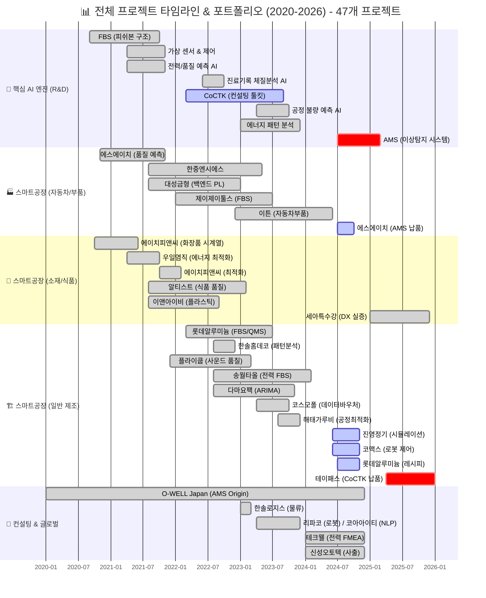
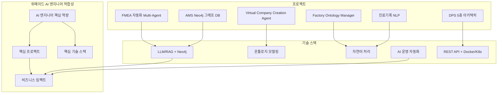
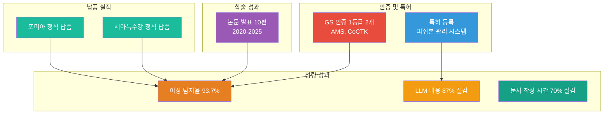
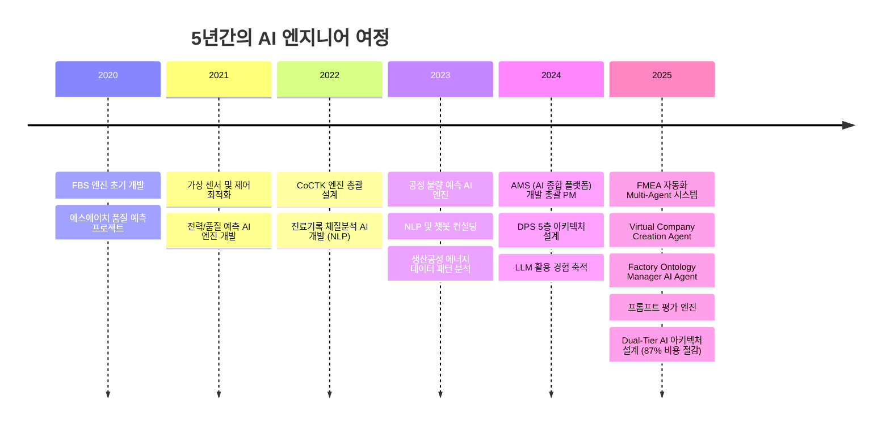
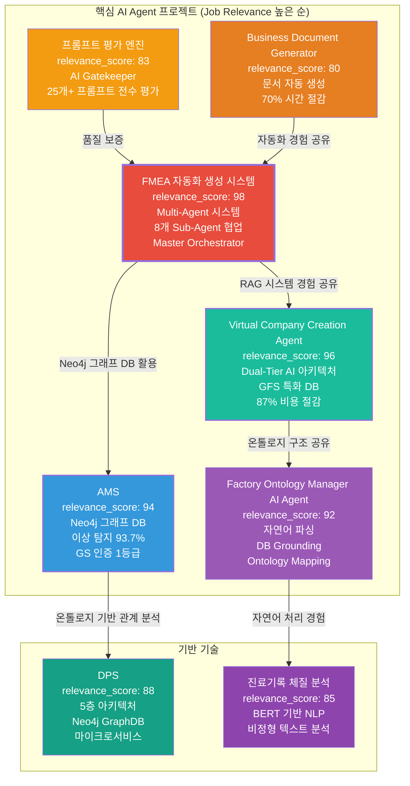
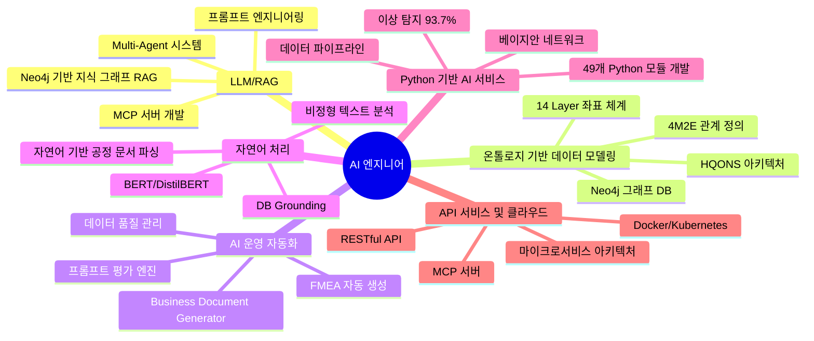
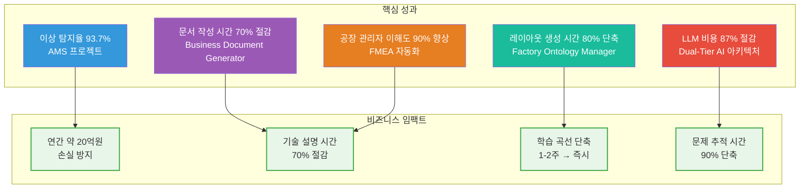

# 권순룡 포트폴리오

> **"모델보다 데이터, 데이터보다 정보, 지식구조를 정리하는 현장친화적 연구원"**

## 📌 기본 정보

**이름**: 권순룡  
**소속**: 한솔코에버 연구소 대리 (2020.09 ~ 재직중)  
**총 경력**: 5년 (2020~2025)  
**이메일**: m920831@naver.com  
**GitHub**: https://github.com/moobaek

### 핵심 역량
- **LLM/RAG 기반 서비스 구축**: Neo4j 기반 지식 그래프 RAG 시스템, Multi-Agent 시스템 설계
- **온톨로지 기반 데이터 모델링**: Neo4j 그래프 DB, 4M2E 관계 정의, HQONS 아키텍처
- **AI 운영 자동화**: FMEA 자동 생성, 프롬프트 평가 엔진, 데이터 품질 관리
- **자연어 처리**: BERT/DistilBERT, 비정형 텍스트 분석, 자연어 기반 공정 문서 파싱
- **Python 기반 AI 서비스 개발**: 49개 Python 모듈 100% 자체 개발, 베이지안 네트워크
- **API 서비스 및 클라우드**: RESTful API, Docker/Kubernetes, 마이크로서비스 아키텍처

---

## 📊 전체 프로젝트 타임라인 (2020-2026) - 47개 프로젝트

> [!CRITICAL] **필수 섹션**
> 이 섹션은 포트폴리오 생성 시 **반드시** 포함되어야 합니다.
> `02_Projects_Overview.md`의 전체 프로젝트 타임라인 Gantt 차트를 그대로 가져옵니다.

> [!INFO] **총 프로젝트 현황**
> - **AI & Analytics**: 7개 (AMS, CoCTK, FBS 등)
> - **스마트공장 구축**: 23개 (에스에이치아이엔티, 롯데알루미늄 등)
> - **컨설팅**: 8개 (테크웰, 신성오토텍 등)
> - **AI 에이전트**: 9개 (FMEA, PM Agent 등)

---

## 📊 포트폴리오 구조 (한눈에 보기)

---

## 🎯 핵심 성과 대시보드

| 분류 | 지표 | 상세 |
|:---|---:|:---|
| **인증** | GS 인증 1등급 2개 | AMS, CoCTK |
| **특허** | 5건 (2건 등록결정 완료) | 에너지 패턴 분석 3건, 공정 관리 2건 |
| **논문** | 10편 | 2020-2025 학술 발표 |
| **납품** | 2건 | 세아특수강, 포미아 |
| **이상탐지** | 93.7% | AMS 프로젝트 |
| **비용 절감** | 87% | Dual-Tier AI 아키텍처 |
| **문서 자동화** | 70% | Business Document Generator |

---

## 📅 경력 타임라인 (2020-2025)

---

## 🏆 주요 프로젝트 (20개+)

### 프로젝트 관계도

### 1. FMEA 자동화 생성 시스템 (Multi-Agent) - 총괄 설계 및 개발

**기간**: 2025.06 ~ 2025.12  
**발주처**: 테크웰/신성오토텍  
**relevance_score**: 98  
**관련 논문**: 📄 **2025.12**: 분석 상관/확률 네트워크 최적 경로 정보 및 공정 관리 문서 기반 FMEA 생성 연구 (KSFM 2025년도 동계학술대회)

**핵심 성과**:
- ✅ Neo4j 기반 지식 그래프 RAG 시스템 구축
- ✅ Master Orchestrator 기반 8개 Sub-Agent 협업 구조 설계 (R&D Team 3개, Manufacturing Team 3개, QA Team 2개)
- ✅ Phase 0~5 자동화 워크플로우 구현 (컨텍스트 수집 → 범위 정의 → 심층 분석 → 리스크 평가 → 최적화 & 문서 생성 → 지속 개선)
- ✅ 공장 관리자 이해도 90% 이상 향상, 기술 설명 시간 70% 이상 절감
- ✅ 도메인별 용어 자동 조정 (제조업/사무업무/서비스업 등)

**기술 스택**: Python, LLM, RAG, Neo4j, Multi-Agent, Claude Sub-Agent, LangGraph, CrewAI  
**위메이드 매칭**: "비개발자가 이용할 자연어 데이터 조회 서비스 구축을 위한 LLM, RAG 활용 서비스 설계 및 구현" 요구사항과 직접 매칭  
**비즈니스 가치**: FMEA 생성 프로세스 완전 자동화, 현장 친화적 문서화, 난해한 기술 문서를 이해하기 쉬운 FMEA 형식으로 변환

**상세 설명**:
위메이드의 "비개발자가 이용할 자연어 데이터 조회 서비스" 요구사항과 직접적으로 매칭되는 프로젝트입니다. Neo4j 기반 지식 그래프 RAG 시스템을 구축하여 자연어 질의를 처리하고, Multi-Agent 시스템을 통해 복잡한 분석 작업을 자동화했습니다. Master Orchestrator가 전체 워크플로우를 조율하며, 각 Sub-Agent가 전문 영역을 담당하는 구조로 설계하여 확장성과 유지보수성을 확보했습니다. 공정 관리 문서를 파싱하여 지식 그래프에 저장하고, 상관/확률 네트워크 최적 경로 분석을 통해 FMEA를 자동 생성하는 시스템입니다.

### 2. Virtual Company Creation Agent & AI_DB_tester (VACTS) - 총괄 설계 및 개발

**기간**: 2026.01 ~ 진행중  
**발주처**: 내부 프로젝트  
**relevance_score**: 96

**핵심 성과**:
- ✅ Dual-Tier AI 아키텍처 설계로 LLM 비용 87% 절감 (High-Spec AI 추론 / Low-Spec AI 조회 분리)
- ✅ GFS (Grape File System) 특화 중간 DB로 벡터 부족 문제 해결
- ✅ HQONS (Hyper-Quantum Omni-Net) 14 Layer 좌표 체계 및 온톨로지 구조 설계
- ✅ 문제 추적 시간 90% 이상 단축 (구조화된 정보 제공)
- ✅ Decoupled Intelligence Architecture: O(1) 리소스로 O(N) 스케일링 달성

**기술 스택**: LLM, RAG, 온톨로지, 벡터 스토어, GFS, Dual-Tier AI, PostgreSQL-Inspired Architecture  
**위메이드 매칭**: "검색 엔진 또는 벡터 스토어 사용 경험", "AI 서비스 전반 아키텍처/모델 전략 수립" 요구사항과 직접 매칭  
**비즈니스 가치**: AI 서비스 전반 아키텍처 최적화, 비용 효율 극대화, 문제 추적 가능성 확보

**상세 설명**:
위메이드의 "검색 엔진 또는 벡터 스토어 사용 경험" 요구사항과 직접적으로 매칭되는 프로젝트입니다. LLM 활용하다보니 온톨로지도 잘 못알아먹고 벡터도 부족하다는 것을 깨달고 특화 중간 DB(GFS)를 개발했습니다. "어차피 AI LLM은 앞뒤 주는 것만 잘하면 되니까" 특화 중간 DB를 만들어서 LLM의 추론 부담을 줄였습니다. Dual-Tier AI 아키텍처로 High-Spec AI(추론)와 Low-Spec AI(조회)를 분리하여 최대 87%의 LLM 비용을 절감했습니다. 위메이드의 "AI 서비스 전반 아키텍처/모델 전략 수립" 요구사항에 기여할 수 있는 경험입니다.

### 3. AMS (Analysis Management System) - 총괄 PM

**기간**: 2024.07 ~ 2025.03  
**발주처**: 한국산업기술진흥원  
**relevance_score**: 94  
**관련 논문**: 📄 **2025.06**: AI를 활용한 구조와 룰을 활용한 구조-확률 종합 네트워크 및 최적 관리 방안 도출 (한국유체기계학회)

**핵심 성과**:
- ✅ Neo4j 그래프 DB 기반 4M2E(Man, Machine, Material, Method, Environment, Energy) 온톨로지 모델링
- ✅ 이상 탐지율 93.7% 달성 (실질 60~70%, 데이터 한계를 고려한 투명한 공개)
- ✅ 49개 Python 모듈 100% 자체 개발 (MLS, CoCTK, FBS, RMS, AMS 등)
- ✅ GS 인증 1등급 취득 및 정식 납품 (세아특수강, 포미아)
- ✅ 특허 2건 출원 (공정 관리 기술)

**기술 스택**: Python, Neo4j, 베이지안 네트워크, Docker, 데이터 파이프라인, 8단계 시계열 데이터 파이프라인  
**위메이드 매칭**: "온톨로지 기반 데이터 모델링 설계 및 구현", "AI를 이용한 운영 자동화, 데이터 품질 관리, 이상탐지", "대규모 데이터 서비스 운영 환경 경험" 요구사항과 직접 매칭  
**비즈니스 가치**: 대규모 데이터 운영 환경 검증, 품질 관리 자동화, 연간 약 20억원 손실 방지 (세아특수강)

**상세 설명**:
위메이드의 "온톨로지 기반 데이터 모델링 설계 및 구현" 요구사항과 직접적으로 매칭되는 프로젝트입니다. Neo4j 그래프 DB를 활용하여 4M2E 관계를 정의하고 온톨로지 기반 관계 분석을 수행했습니다. 확률 최적화 결과를 분석 온톨로지 형태로 통합하여 이질적인 데이터 소스를 유기적으로 연결했습니다. "AI를 이용한 운영 자동화, 데이터 품질 관리, 이상탐지" 요구사항을 모두 충족하는 시스템입니다. 베이지안 네트워크 기반 이상 탐지 모델을 개발하여 이상탐지율 93.7%를 달성했으며, 실질적 정확도는 데이터 한계를 고려하면 60~70%로 투명하게 공개했습니다.

### 4. Factory Ontology Manager AI Agent - 총괄 설계 및 개발

**기간**: 2026.01 ~ 진행중  
**발주처**: 세아특수강  
**relevance_score**: 92

**핵심 성과**:
- ✅ 자연어 기반 공정 문서 파싱 및 DB Grounding (예: "용접기 온도 보여줘" → DB에서 WELD_ROBOT_01 (ID: EQ_99) 및 TAG_TEMP_W01 찾기)
- ✅ Ontology Mapping으로 설비 관계 구조화 (계층적 구조: 공장 > 작업장 > 생산라인 > 공정)
- ✅ 레이아웃 생성 시간 80% 단축 (2-3시간 → 20-30분)
- ✅ 학습 곡선 단축 (1-2주 → 즉시 사용 가능)
- ✅ Spec-First Modification으로 명확한 변경 계획 수립

**기술 스택**: Python, LLM, Instructor (Pydantic 기반 LLM 검증), React 18.3.1, TypeScript 5.5.3, Vite 7.1.12, 온톨로지, LangGraph V2  
**위메이드 매칭**: "비개발자가 이용할 자연어 데이터 조회 서비스 구축을 위한 LLM, RAG 활용 서비스 설계 및 구현" 요구사항과 직접 매칭  
**비즈니스 가치**: 비개발자 자연어 데이터 조회 경험 제공, 수정 요청 처리 시간 50% 단축

**상세 설명**:
위메이드의 "비개발자가 이용할 자연어 데이터 조회 서비스 구축을 위한 LLM, RAG 활용 서비스 설계 및 구현" 요구사항과 직접적으로 매칭되는 프로젝트입니다. 자연어로 기술된 공정 문서를 파싱하고, 실제 DB와 매핑하여 자연어 질의를 처리하는 시스템입니다. 공정 엔지니어가 자연어로 작성한 공정 문서를 자동으로 파싱하여 구조화된 정보를 추출하고, Instructor(Pydantic 기반 LLM 검증)를 활용하여 타입 안전성을 보장했습니다. 사용자의 추상적 요청을 실제 DB의 설비/센서 ID로 자동 매핑하는 DB Grounding 기능을 구현했습니다.

### 5. DPS (데이터수집시스템) - 총괄 설계 및 개발

**기간**: 2024.01 ~ 2024.12  
**발주처**: 내부 프로젝트  
**relevance_score**: 88  
**관련 논문**: 📄 **2024.12**: 공장 운영 핵심 요소의 식별 및 최적화를 위한 클러스터링 기법 적용 (한국생산제조학회)

**핵심 성과**:
- ✅ 모듈화 5층 아키텍처 설계 (서비스 및 UI Layer, 통합 및 본체론 Layer(Neo4j 그래프DB), AI 엔진 Layer, 데이터 수집 Layer, 보안 및 관리 Layer)
- ✅ Neo4j 그래프 DB 기반 4M2E 관계 정의 및 온톨로지 기반 관계 분석
- ✅ Docker/Kubernetes 기반 마이크로서비스 아키텍처
- ✅ 서버-엣지 하이브리드 인프라 지원 (실시간 스트리밍 및 PLC/MES 인터페이스)

**기술 스택**: Python, Neo4j, Docker, Kubernetes, React, RESTful API, 마이크로서비스 아키텍처  
**위메이드 매칭**: "온톨로지 기반 데이터 모델링 설계 및 구현", "API 서비스 개발 역량", "클라우드 환경에서의 서비스 운영 경험" 요구사항과 매칭  
**비즈니스 가치**: API 서비스 및 클라우드 운영 경험 강화, 확장 가능한 아키텍처 설계

**상세 설명**:
위메이드의 "온톨로지 기반 데이터 모델링 설계 및 구현" 및 "API 서비스 개발 역량" 요구사항과 매칭되는 프로젝트입니다. Neo4j 그래프 DB를 활용한 온톨로지 기반 관계 분석과 RESTful API 엔드포인트를 제공하는 마이크로서비스 아키텍처를 설계했습니다. 클라우드 환경에서의 서비스 운영 경험도 보유하고 있습니다.

### 6. 진료기록을 통한 체질 관리 시스템 - 총괄 설계 및 개발

**기간**: 2022.06 ~ 2022.10  
**발주처**: 한국데이터산업진흥원  
**relevance_score**: 85

**핵심 성과**:
- ✅ 비정형 진료 텍스트를 0/1 바이너리 테이블로 변환 (단순 워드클라우드 한계 극복)
- ✅ BERT/DistilBERT 기반 자연어 처리 모델 개발 (BertForSequenceClassification 사용)
- ✅ 헬스케어 AI 적용 및 체질 예측 모델 구축
- ✅ 네트워크 분석 및 체질 예측 수행

**기술 스택**: Python, BERT, DistilBERT, NLP, 네트워크 분석  
**위메이드 매칭**: "자연어 처리 분야에서 최소 5년 이상의 경력" 요구사항과 직접 매칭  
**비즈니스 가치**: 자연어 처리 경력 5년 이상 증빙, 비정형 텍스트 구조화 경험

**상세 설명**:
위메이드의 "자연어 처리 분야에서 최소 5년 이상의 경력" 요구사항과 직접적으로 매칭되는 프로젝트입니다. BERT/DistilBERT 기반 자연어 처리 모델을 개발했으며, 비정형 텍스트를 구조화된 데이터로 변환하는 경험을 보유하고 있습니다. 비정형 진료 텍스트를 0/1 바이너리 테이블로 변환하여 네트워크 분석 및 체질 예측을 수행했습니다.

---

## 💻 기술 스택 맵

---

## 📚 학술 성과 (총 10편, 2020-2025)

> [!TIP] **현장이 곧 연구실 (Research in Field)**
> 총 10편의 학술 논문과 **5건의 특허 출원**은 모두 **실제 프로젝트 현장의 데이터와 실증 결과**를 기반으로 작성되었습니다.

| 발행일 | 논문 제목 | 학술지/학회 | 핵심 성과 및 프로젝트 연계 |
|:---|:---|:---|:---|
| 2025.12 | **분석 상관/확률 네트워크 최적 경로 정보 및 공정 관리 문서 기반 FMEA 생성 연구** | KSFM 2025년도 동계학술대회 | **온톨로지 정보화의 연장선**: 구조화된 정보를 LLM에 제공하여 활용하는 온톨로지 정보화의 연장선. [FMEA 자동화/복합센서/AMS] 상관/확률 네트워크 최적 경로 분석 기반 FMEA 자동 생성 기술 검증, AMS 결과 표시 LLM agent (GPT OSS) 개발 및 포미아 납품 적용 |
| 2025.06 | **AI를 활용한 구조와 룰을 활용한 구조-확률 종합 네트워크 및 최적 관리 방안 도출** | 한국유체기계학회 | **온톨로지 구조화의 고도화**: 구조화된 인과관계(피쉬본)와 구조화된 확률 관계(확률 네트워크)를 종합한 온톨로지 구조. [AMS] 피쉬본 AI 모델의 학술적 고도화 및 최적 관리 로직 증명 (초기 O-WELL 알고리즘 고도화) |
| 2024.12 | **공장 운영 핵심 요소의 식별 및 최적화를 위한 클러스터링 기법 적용** | 한국생산제조학회 | **온톨로지 구조화**: 공장 운영 데이터를 구조화된 온톨로지 형태로 분석. [DPS] 공장 운영 데이터의 다차원 분석 및 디지털 트윈 최적화 근거 |
| 2024.12 | **설비 이상상태 기반 최적 공정 데이터 추론 및 위험/안전 관리 최적 자동화** | 한국유체기계학회 | **온톨로지 기반 관계 추적**: 확률 네트워크로 구조화된 확률 관계를 활용한 위험 관리. [AMS] 실시간 이상 상태 기반 위험 관리 알고리즘의 유효성 검증 |
| 2024.07 | **전력 데이터를 통한 설비 상태 추론 및 이상 상황 설정 예측** | 한국유체기계학회 | **패턴 정보화**: 전력 데이터를 구조화된 패턴 형태로 변환하여 분석. [에너지/센서] 전력 데이터 기반의 설비 예지 보전 기술 실증 |
| 2023.12 | **송풍 설비 변동부하 대응 전력품질 분석 및 에너지 절감 연구** | 한국유체기계학회 | **패턴 정보화**: 에너지 패턴을 구조화된 형태로 분석하여 최적화. [에너지 최적화] 에너지 20% 절감 실증 솔루션의 핵심 물리 분석 모델 |
| 2023.12 | **압축기 공정에서 데이터 밸런스 문제 해결 및 품질 결과 사전 예측을 위한 AI 시스템** | 한국유체기계학회 | **온톨로지 구조화**: 데이터를 구조화된 형태로 변환하여 분석. [AI/데이터] 소량의 불량 데이터 극복을 위한 AI 학습 모델 연구 |
| 2023.07 | **생산공정 에너지 및 설비 상태 진단을 위한 AI기반의 전력 사용 패턴 및 SOH분석** | 한국유체기계학회 | **패턴 정보화의 핵심**: 전력 사용 패턴을 구조화된 온톨로지 형태로 분석. [에너지/전력] 설비 건전성(SOH) 진단 및 에너지 효율화 융합 기술 (**Energy Pattern** 과제 실증) |
| 2022.12 | **자동차 부품 생산 산업을 위한 머신러닝 기반의 품질예측 알고리즘** | 한국생산제조학회 | **온톨로지 구조화**: 품질 데이터를 구조화된 형태로 분석하여 예측. [AI/제조] 세아베스틸 등 자동차 부품 공정 품질 예측 모델의 기초 |
| 2022.06 | **ICT 융복합 기술을 활용한 스마트 공장 및 에너지 절감 솔루션 적용 사례** | 한국유체기계학회 | **온톨로지 구조화의 실증**: 피쉬본 기반 구조화된 인과관계 분석의 실무 적용. [Global DX] **O-WELL Japan** 등 글로벌 스마트 공장 구축 사례의 실증 (AMS 초기 모델 검증) |

### 특허 출원/등록 현황 (총 5건, 2건 등록결정 완료)

**등록결정 완료 (2건)**:
1. 설비 제어 특성 로그 데이터와 에너지 소비패턴 모델을 활용한 AI 기반 이상 탐지 방법 및 장치 (2021.12 출원, 2025.10 등록결정)
2. 공정 최적화를 위한 공정 관리 방법 및 그 시스템 (2025.03 출원, 2025.12 등록결정)

**심사 진행 중 (3건)**:
3. 인공지능을 활용한 공정 최적화 관리를 위한 공정 관리 방법 및 그 시스템 (2025.08 출원)
4. 전력 사용 패턴 분석 및 상태 분석 방법 (2023.12 출원)
5. 주기 데이터 분석 기반 전력 추이 상황적 불량 이상 검증 방법 (2023.12 출원)

모든 특허는 **국가연구개발사업 지원**을 받아 수행된 연구 성과입니다.

---

## 🤖 LLM 활용 방법

### Agent/MCP/RAG 시스템

위메이드의 데이터엔지니어링팀 목표(자연어 데이터 조회, AI 운영 자동화, 서비스 최적화)에 맞춰 LLM/MCP/RAG를 다음과 같이 활용했습니다.

1. **RAG 기반 자연어 조회**  
   - Neo4j 그래프 DB 기반 지식 그래프 RAG로 비개발자 질의를 처리  
   - FMEA 자동화 시스템에서 공정 문서 파싱 → 지식 그래프 저장 → 자연어 질의 응답

2. **Agent/MCP 기반 운영 자동화**  
   - Master Orchestrator + 8개 Sub-Agent로 업무 분해/협업 구조 설계  
   - 32개 MCP 서버로 외부 시스템 연동, 비정형 문서 자동 파싱

3. **AI 서비스 아키텍처 최적화**  
   - Dual-Tier AI (추론/조회 분리)로 LLM 비용 87% 절감  
   - 특화 중간 DB(GFS)로 벡터 부족 문제 해결, 문제 추적 시간 90% 단축

4. **데이터 품질/이상탐지 자동화**  
   - AMS에서 이상 탐지율 93.7% 달성, 운영 지표 자동화  
   - 로그 분석/알림 체계로 운영 고도화 경험 보유

---

## 💼 비즈니스 가치 창출

### 개발 효율성 향상

### 핵심 성과 지표

| 지표 | 수치 | 프로젝트 | 위메이드 매칭 |
|:---|---:|:---|:---|
| **LLM 비용 절감** | 87% | Virtual Company Creation Agent | AI 서비스 아키텍처 최적화 |
| **이상 탐지율** | 93.7% | AMS | 데이터 품질 관리, 이상탐지 |
| **문서 작성 시간 절감** | 70% | Business Document Generator | AI 운영 자동화 |
| **공장 관리자 이해도 향상** | 90%+ | FMEA 자동화 | 자연어 데이터 조회 서비스 |
| **기술 설명 시간 절감** | 70%+ | FMEA 자동화 | 비개발자 친화적 서비스 |
| **레이아웃 생성 시간 단축** | 80% | Factory Ontology Manager | 자연어 데이터 조회 서비스 |
| **문제 추적 시간 단축** | 90%+ | Virtual Company Creation Agent | 데이터 품질 관리 |
| **연간 손실 방지** | 약 20억원 | AMS (세아특수강) | 데이터 품질 관리 |

### 위메이드 데이터엔지니어링팀 기여 가능성

1. **자연어 데이터 조회 서비스 구축**
   - Neo4j 기반 지식 그래프 RAG 시스템으로 게임 데이터를 직관적으로 조회할 수 있는 서비스 구축
   - Factory Ontology Manager의 DB Grounding 경험을 게임 데이터에 적용

2. **AI 서비스 아키텍처 최적화**
   - Dual-Tier AI 아키텍처로 LLM 비용을 절감하고, 특화 중간 DB(GFS)로 안정성 확보
   - 위메이드의 "AI 서비스 전반 아키텍처/모델 전략 수립" 요구사항에 직접 기여

3. **온톨로지 기반 데이터 모델링**
   - 게임 데이터의 다양한 소스(유저 행동, 게임 로그, 블록체인 트랜잭션 등)를 온톨로지로 구조화
   - AMS의 4M2E 온톨로지 모델링 경험을 게임 도메인에 적용

4. **AI 운영 자동화**
   - 프롬프트 평가 엔진, 데이터 품질 관리, 이상탐지 시스템으로 운영 효율성 향상
   - FMEA 자동화의 Multi-Agent 시스템 경험을 데이터 시스템 최적화에 적용

5. **대규모 데이터 서비스 운영**
   - Docker/Kubernetes 기반 마이크로서비스 아키텍처로 확장 가능한 시스템 구축
   - DPS의 5층 아키텍처 경험을 게임 데이터 파이프라인에 적용

---

## 🔗 관련 링크

- **메인 레포지토리**: https://github.com/moobaek/Testing_AI_agents_for_public_use
- **포트폴리오 문서**: https://github.com/moobaek/Testing_AI_agents_for_public_use/tree/main/portfolio/portfolio_docs
- **GitHub 프로필**: https://github.com/moobaek

---

## 📝 위메이드 데이터엔지니어링팀과의 시너지

### 핵심 철학의 일치

위메이드의 **"무한한 상상을 현실로 만드는 창조집단"**이라는 비전과 제가 추구하는 **"모델보다 데이터, 데이터보다 정보, 지식구조를 정리하는 현장친화적 연구원"**이라는 철학이 일치합니다.

게임과 블록체인의 융합이라는 새로운 패러다임을 이끄는 위메이드에서 AI를 통한 데이터 시스템 최적화로 혁신을 함께 만들어가고 싶습니다.

### 5년간의 경험을 위메이드에 기여

5년간 제조 현장에서 데이터를 정보로, 정보를 지식으로 전환하는 과정을 연구하고 구현해왔습니다. 위메이드 데이터엔지니어링팀에서 게임의 대용량 데이터를 전처리·추출·가공·관리하여 최적화된 딜리버리 모델을 개발하고, 모든 부서에서 최적의 의사결정을 할 수 있도록 정확도 높은 데이터를 적시에 제공하는 목표에 기여하고 싶습니다.

특히 제가 경험한 Neo4j 그래프 DB 기반 지식 그래프 RAG 시스템, Multi-Agent 시스템 설계, 온톨로지 기반 데이터 모델링 경험이 "비개발자가 이용할 자연어 데이터 조회 서비스"와 "AI를 통한 전체 서비스의 데이터 시스템 최적화"에 직접 기여할 수 있다고 생각합니다.

---

© 2026 권순룡. All Rights Reserved.
