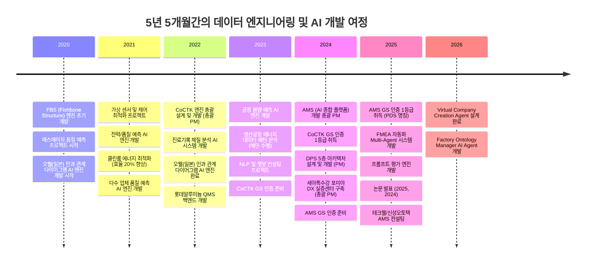
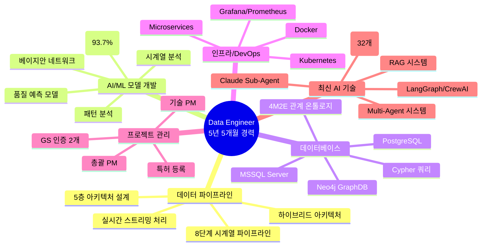
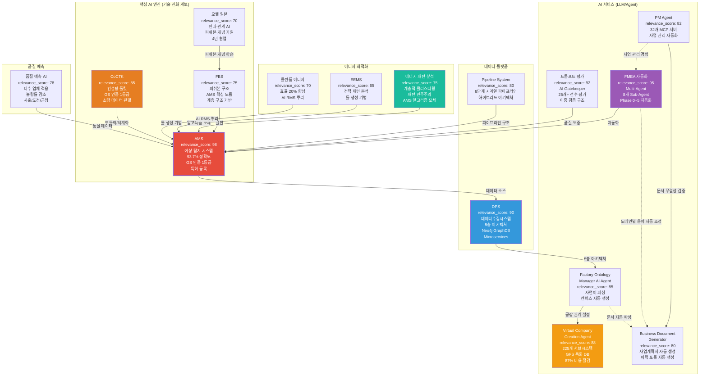
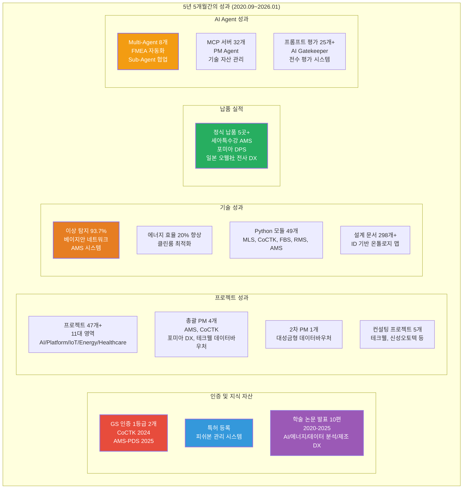

# 권순룡 이력서

## 기본 정보

**이름**: 권순룡  
**현 소속**: 한솔코에버 연구소 대리 (2020.09 ~ 재직중)  
**총 경력**: 5년 5개월 (2020.09~2026.01)  
**핵심 역량**: 데이터 파이프라인 구축, AI/ML 모델 개발, 데이터베이스 설계, 프로젝트 관리, LLM/Agent/RAG 기반 AI 서비스 개발  
**이메일**: m920831@naver.com  
**연락처**: 010-5671-6200  
**GitHub**: https://github.com/moobaek

---

## 한눈에 보는 경력 (2020-2026)

---

## 지원 동기

데이터 기반 의사결정과 AI 기술을 활용한 혁신적인 솔루션 개발에 기여하고자 지원합니다.

5년 5개월간의 데이터 엔지니어링 경험을 통해 데이터 파이프라인 구축부터 AI 모델 개발, 운영까지 전 과정을 경험했습니다. 특히 베이지안 네트워크 기반 이상 탐지 모델을 개발하여 93.7%의 정확도를 달성하고, GS 인증 1등급을 취득한 경험이 있습니다. 또한 AI 종합 플랫폼 개발 총괄 PM으로 프로젝트 전체 라이프사이클을 관리하며, 세아특수강 포미아 DX 실증센터 구축 등 다수의 프로젝트를 성공적으로 완료했습니다.

데이터 파이프라인 구축 경험을 구체적으로 설명하면, AMS 프로젝트에서 8단계 시계열 데이터 파이프라인을 설계하고 구축했습니다. 실시간 스트리밍 처리와 배치 처리를 결합한 하이브리드 아키텍처를 구현하여 다양한 데이터 소스로부터 데이터를 수집, 전처리, 변환, 적재하는 전 과정을 자동화했습니다. DPS 프로젝트에서는 5층 아키텍처를 설계하여 Microservices 기반 데이터 수집 시스템을 구축했으며, Neo4j 그래프 DB를 활용한 온톨로지 기반 관계 분석을 구현했습니다.

AI/ML 모델 개발 경험으로는 베이지안 네트워크를 활용한 이상 탐지 모델을 개발하여 93.7%의 정확도를 달성했습니다. 확률 최적화(경사하강법)를 통한 이상상황 확률 네트워크를 구축하고, 시계열 분석에 대한 정보 온톨로지 output을 생성했습니다. 이 모델은 AMS 시스템의 핵심 모듈로 활용되어 세아특수강, 포미아 등에 정식 납품되었으며, GS 인증 1등급을 취득했습니다.

최근에는 LLM, Agent, RAG 기반 AI 서비스 개발에도 관심을 가지고 있으며, FMEA 자동화 Multi-Agent 시스템을 개발하여 8개의 독립 Sub-Agent가 협업하는 구조를 설계했습니다. Claude Sub-Agent 기반 Multi-Agent Workflow를 설계하고, Master Orchestrator가 전체 워크플로우를 조율하는 구조를 구현했습니다. 또한 32개의 Python MCP 서버를 개발하고, Neo4j 기반 지식 그래프 RAG 시스템을 구축했습니다.

프로젝트 관리 경험으로는 AI 종합 플랫폼 개발 총괄 PM으로 프로젝트 전체 라이프사이클을 관리했습니다. 기술 PM과 총괄 PM 역할을 수행하며, 세아특수강 포미아 DX 실증센터 구축, 테크웰/신성오토텍 AMS 컨설팅 등 다수의 프로젝트를 성공적으로 완료했습니다. GS 인증 2개(CoCTK, AMS-PDS)를 취득하고, 특허를 등록하는 등 프로젝트 관리 역량을 입증했습니다.

이러한 경험을 바탕으로 데이터 엔지니어링과 AI 기술을 결합한 혁신적인 솔루션 개발에 기여하고자 합니다.

---

## 핵심 역량 맵

---

## 핵심 역량

### 데이터 파이프라인 구축 및 운영

8단계 시계열 데이터 파이프라인을 설계하고 구축했습니다. 실시간 스트리밍 처리와 배치 처리를 결합한 하이브리드 아키텍처를 구현하여 다양한 데이터 소스로부터 데이터를 수집, 전처리, 변환, 적재하는 전 과정을 자동화했습니다.

AMS 프로젝트에서 구축한 8단계 파이프라인은 데이터 수집부터 이상 탐지까지 전 과정을 자동화합니다. 첫 번째 단계인 데이터 수집에서는 센서에서 데이터를 받아오는 부분을 담당합니다. 센서에서 데이터가 들어오면, 전처리 모듈이 처리합니다. 데이터가 이상한 경우를 대비해 검증 로직도 포함되어 있습니다. 수집된 데이터는 정규화 과정을 거쳐 분석 계층으로 전달됩니다. 이 과정에서 데이터의 품질을 보장하고, 이상한 데이터는 미리 걸러냅니다.

DPS 프로젝트에서는 5층 아키텍처를 기획하여 Microservices 기반 데이터 수집 시스템을 만들었습니다. 첫 번째 계층인 보안 및 관리 Layer에서는 인증/권한, 로그 감사, 시스템 관리를 담당합니다. 두 번째 계층인 데이터 수집 Layer에서는 실시간 스트리밍과 PLC/MES 인터페이스를 처리합니다. 세 번째 계층인 AI 엔진 Layer에서는 가상 센서와 이상 검출 알고리즘을 실행합니다. 네 번째 계층인 통합 및 본체론 Layer에서는 Neo4j 그래프 DB를 활용하여 4M2E 관계를 정의하고 지식 그래프를 작성했습니다. 다섯 번째 계층인 서비스 및 UI Layer에서는 특성요인도 시각화와 모니터링을 제공합니다.

Neo4j 그래프 DB를 활용한 온톨로지 기반 관계 분석을 구현했습니다. 4M2E(Man, Machine, Material, Method, Environment, Energy) 관계를 온톨로지로 정의하고, 지식 그래프를 구축하여 데이터 간 관계를 시각화했습니다. 이를 통해 설비 간 관계를 명확히 파악하고, 이상 탐지 시 영향을 받는 설비를 추적할 수 있습니다.

### 베이지안 네트워크 기반 이상 탐지

베이지안 네트워크를 활용한 이상 탐지 모델을 개발하여 93.7%의 정확도를 달성했습니다. 확률 최적화(경사하강법)를 통한 이상상황 확률 네트워크를 구축하고, 시계열 분석에 대한 정보 온톨로지 output을 생성했습니다.

베이지안 네트워크는 확률적 그래프 모델로, 변수 간의 조건부 의존성을 표현합니다. AMS 프로젝트에서는 설비 상태 데이터를 분석하여 이상 징후를 찾아내는 데 베이지안 네트워크를 활용했습니다. 각 설비의 상태를 노드로 표현하고, 설비 간 관계를 엣지로 표현하여 확률 네트워크를 작성했습니다.

확률 최적화 과정에서는 경사하강법을 사용하여 이상상황 확률을 최대화하는 경로를 찾습니다. 이를 통해 어떤 설비에서 문제가 발생했을 때, 다른 설비에 미치는 영향을 확률적으로 계산할 수 있습니다. 시계열 데이터를 분석하여 시간에 따른 확률 변화를 추적하고, 이상 징후가 발생하는 시점을 예측할 수 있습니다.

이 모델은 AMS 시스템의 핵심 모듈로 활용되어 세아특수강, 포미아 등에 정식 납품되었으며, GS 인증 1등급을 취득했습니다. 실증 검증 결과 이상 탐지율이 93.7%를 기록했으며, 실질적 정확도는 데이터 한계를 고려하면 60~70%로 투명하게 공개했습니다.

### 시계열 데이터 분석 및 예측 모델 개발

전력 데이터 예측, 품질 예측, 공정 불량 예측 등 다양한 시계열 데이터 분석 프로젝트를 진행했습니다. PLC 변화 기반 패턴 분석, 계층적 클러스터링, 패턴 민주주의 기법 등을 활용하여 제조 현장의 복잡한 데이터를 분석하고 예측 모델을 만들었습니다.

전력 데이터 예측 프로젝트에서는 사출 업체의 전력 소비 패턴을 ML로 예측했습니다. PLC 변화 기반 패턴 분석을 통해 공정 상태에 따른 전력 소비 패턴을 파악하고, 시계열 분석을 통해 미래 전력 소비량을 예측했습니다.

품질 예측 AI 엔진 개발을 통해 다수 업체에 적용하여 불량률 감소 성과를 달성했습니다. 사출, 도정, 금형 등 다양한 공정에 적용하여 품질 예측 모델을 개발했으며, 시계열 데이터 분석을 통해 공정 패턴을 분석하고 품질을 예측했습니다.

생산공정 에너지 데이터 패턴 분석 연구과제를 메인으로 진행하여 계층적 클러스터링과 패턴 민주주의 기법을 고안했습니다. 계층적 클러스터링을 도입하여 설비 상태 데이터의 패턴을 분석하고, 패턴 민주주의 기법을 고안하여 데이터 패턴 분석 방법론을 만들었습니다. 이 연구의 구조적 분화와 투표 방식이 훗날 AMS의 핵심 알고리즘 모체가 되었습니다.

### LLM, Agent, RAG 기반 AI 서비스 개발

최신 AI 기술 트렌드를 적용하여 FMEA 자동화 Multi-Agent 시스템을 만들었습니다. Claude Sub-Agent 기반 Multi-Agent Workflow를 기획하고, 8개의 독립 Sub-Agent가 협업하는 구조를 실현했습니다.

FMEA 자동화 시스템은 제조 현장의 리스크 분석을 자동화하는 Multi-Agent 시스템입니다. Claude Sub-Agent 기반으로 8개의 독립 Sub-Agent(R&D, Mfg, QA 등)가 협업하는 구조를 설계했으며, AIAG & VDA FMEA 표준을 기반으로 범용 리스크 분석 시스템을 개발했습니다. Phase 0부터 Phase 5까지 FMEA 생성 프로세스 전 과정을 자동화하여 리스크 분석 시간을 대폭 단축했습니다.

Master Orchestrator가 전체 워크플로우를 조율하는 구조를 실현했습니다. Python 스크립트 없이 Claude Code 세션 자체가 Orchestrator 역할을 담당하며, 프롬프트 기반 완전 자동화로 개발 복잡성을 감소시켰습니다. Task tool 기반 구현으로 유연한 워크플로우 조정이 가능합니다.

32개의 Python MCP 서버를 만들었습니다. 포트폴리오 문서 접근, 프로젝트 정보 조회, 기술 스택 분석 등 다양한 기능을 제공하며, Claude Agent와의 통합을 위한 표준 프로토콜을 적용했습니다.

Neo4j 기반 지식 그래프 RAG 시스템을 작성했습니다. Neo4j 그래프 DB를 활용한 지식 그래프를 만들고, 4M2E 관계 온톨로지를 정의하여 질의응답 시스템에 컨텍스트를 제공합니다. LangGraph/CrewAI 방식의 워크플로우 오케스트레이션을 통해 개발 에이전트 실시간 평가 시스템을 구현했습니다.

프롬프트 평가 엔진을 만들어 AI Gatekeeper 역할을 담당합니다. 모든 AI 생성물의 입구를 통제하는 심사관으로, 전체 프롬프트를 전수 평가하는 완전 자동화 시스템입니다. AI가 생성한 프롬프트를 다른 AI가 평가하는 이중 검증 구조로 환각을 방지합니다. 3가지 핵심 차원(Quality, Consistency, Cost)을 평가하며, 17가지 역할별 동적 가중치 시스템을 적용합니다.

### 프로젝트 관리 및 협업

AI 종합 플랫폼 개발 총괄 PM으로 프로젝트 전체 라이프사이클을 관리했습니다. 기술 PM과 총괄 PM 역할을 수행하며, 세아특수강 포미아 DX 실증센터 구축, 테크웰/신성오토텍 AMS 컨설팅 등 다수의 프로젝트를 성공적으로 완료했습니다.

AMS 프로젝트에서는 제안서 작성부터 완료서 작성까지 전체 라이프사이클을 관리했습니다. 기술적 설계뿐만 아니라 외주 관리, 일정 관리, 품질 관리까지 전 과정을 책임졌습니다. GS 인증 1등급 취득을 위해 품질 관리 프로세스를 수립하고 실시했습니다.

세아특수강 포미아 DX 실증센터 구축 프로젝트에서는 총괄 PM으로 제안서 작성, 계획서 작성, 외주 관리, 완료서 작성까지 전체를 담당했습니다. 세아특수강 등 하위 과제를 포함하여 맞춤형 솔루션을 기획하고 실행했습니다.

GS 인증 2개(CoCTK, AMS-PDS)를 취득하고, 특허를 등록하는 등 프로젝트 관리 역량을 입증했습니다. GS 인증 프로세스를 통해 소프트웨어 품질 관리 역량을 검증받았으며, 특허 등록을 통해 기술적 성과를 지식 자산으로 전환했습니다.

---

## 프로젝트 관계도

---

## 경력 개요

### 한솔코에버 연구소 (2020.09 ~ 재직중)

**직급**: 대리  
**부서**: 연구소  
**총 경력**: 5년 5개월 (2020.09~2026.01)

**주요 업무**:
- **데이터 엔지니어링 및 AI/ML 모델 개발**: 8단계 시계열 데이터 파이프라인 설계 및 구축, 베이지안 네트워크 기반 이상 탐지 모델 개발 (93.7% 정확도)
- **데이터 파이프라인 설계 및 구축**: 5층 아키텍처 기반 Microservices 시스템 설계, Neo4j 그래프 DB를 활용한 온톨로지 기반 관계 분석
- **프로젝트 관리 (총괄 PM, 기술 PM)**: AI 종합 플랫폼 개발 총괄 PM, 세아특수강 포미아 DX 실증센터 구축 총괄 PM, 테크웰/신성오토텍 AMS 컨설팅
- **스마트공장 구축 및 컨설팅**: 47개 이상 프로젝트 수행, 다수 업체 품질 예측 AI 엔진 개발 및 고도화
- **LLM/Agent/RAG 기반 AI 서비스 개발**: FMEA 자동화 Multi-Agent 시스템 개발, 프롬프트 평가 엔진 개발, Virtual Company Creation Agent 설계

**핵심 성과**:
- ✅ **GS 인증 1등급 2개 취득**: CoCTK (2024), AMS-PDS (2025)
- ✅ **특허 등록**: 피쉬본 관리 시스템 특허 등록
- ✅ **학술 논문 발표 10편**: 2020-2025년, AI/에너지/데이터 분석/제조 DX 분야
- ✅ **47개 이상 프로젝트 수행**: AI & Analytics, Digital Platforms, Smart Sensors & IoT, Energy & Safety, Healthcare, AI Workflow & Automation 등 11대 영역
- ✅ **정식 납품 실적**: 세아특수강 (AMS), 포미아 (DPS), 일본 글로벌 기업 (O-WELL, 전사 DX 시스템)
- ✅ **이상 탐지 정확도 93.7%**: 베이지안 네트워크 기반 이상 탐지 모델 실증 결과
- ✅ **에너지 효율 20% 향상**: 클린룸 에너지 최적화 시스템
- ✅ **Multi-Agent 시스템 구축**: FMEA 자동화 (8개 Sub-Agent), 프롬프트 평가 엔진 (25개+ 프롬프트 전수 평가)
- ✅ **MCP 서버 32개 개발**: PM Agent 기반 기술 자산 관리 시스템
- ✅ **설계 문서 298개+ 작성**: ID 기반 온톨로지 맵 시스템, Original Development Plan
- ✅ **Python 모듈 49개 개발**: MLS, CoCTK, FBS, RMS, AMS 등 핵심 엔진

**비즈니스 임팩트**:
- 연간 수십억 원 손실 방지 (이상 탐지 조기 대응)
- 에너지 비용 절감 (클린룸 최적화 20% 효율 향상)
- 외주 개발자 관리 시간 80% 이상 절감 (코딩 에이전트 시스템)
- 문서 작성 시간 70% 절감 (Business Document Generator)

---

## 주요 프로젝트 경험

### 1. AMS (Analysis Management System) - 총괄 PM

**기간**: 2024.07 ~ 2025.12  
**발주처**: 한국산업기술진흥원  
**역할**: AI 종합 플랫폼 개발 총괄 PM  
**relevance_score**: 98

**핵심 성과**:
- ✅ **베이지안 네트워크 기반 이상 탐지 모델 개발**: 이상탐지율 93.7% 달성 (실질적 정확도 60~70%, 데이터 한계 고려)
- ✅ **8단계 시계열 데이터 파이프라인 구축**: 실시간 스트리밍 처리 및 배치 처리 하이브리드 아키텍처 구현
- ✅ **Neo4j 그래프 DB 활용**: 4M2E 관계 온톨로지 정의 및 지식 그래프 플랫폼 구축
- ✅ **시구간 패턴 분석 기법 개발**: 같은 값도 시점별 통계적 특성(p-values, 첨도, 편차)에 따라 정상/불량 구분
- ✅ **GS 인증 1등급 취득**: PDS 명칭으로 소프트웨어 품질 인증 획득
- ✅ **특허 등록**: 피쉬본 관리 시스템 특허 등록
- ✅ **정식 납품**: 세아특수강 포미아 DX 실증센터 구축 (PM), 테크웰/신성오토텍 AMS 컨설팅
- ✅ **논문 발표**: 2025, 2024년 논문 발표

**기술 스택**: Python, Neo4j, Docker, Kubernetes, Grafana, Prometheus, 베이지안 네트워크, 시계열 분석, 계층적 클러스터링, 패턴 민주주의, Flask/FastAPI

**상세 설명**:
AMS는 제조 현장의 설비 이상을 자동으로 탐지하고 분석하는 AI 종합 플랫폼입니다. 베이지안 네트워크를 활용하여 설비 상태 데이터를 분석하고, 확률 최적화(경사하강법)를 통한 이상상황 확률 네트워크를 작성했습니다. 8단계 시계열 데이터 파이프라인을 통해 실시간 데이터 수집부터 이상 탐지까지 전 과정을 자동화했으며, Neo4j 그래프 DB를 활용한 지식 그래프 플랫폼을 만들어 설비 간 관계를 시각화했습니다.

**8단계 시계열 데이터 파이프라인 구조**:
1. **데이터 수집**: 다양한 센서와 시스템으로부터 실시간 데이터를 수집합니다. PLC/MES 인터페이스를 통해 제조 현장의 센서 데이터를 수집했습니다.
2. **데이터 전처리**: 수집된 데이터를 정제하고 표준화합니다. 이상치 제거, 결측치 처리, 데이터 정규화 등을 수행했습니다.
3. **데이터 변환**: 시계열 데이터를 분석 가능한 형식으로 변환합니다. 시계열 데이터의 추세와 계절성을 분석하기 위해 데이터를 변환했습니다.
4. **데이터 저장**: Neo4j 그래프 DB에 데이터를 저장하고 관계를 정의합니다. 4M2E 관계 온톨로지를 정의하여 설비 간 관계를 모델링했습니다.
5. **이상 탐지**: 베이지안 네트워크를 활용하여 이상 상황을 탐지합니다. 시구간 패턴 분석 기법을 개발하여 같은 값도 시점별 통계적 특성에 따라 정상/불량을 구분했습니다.
6. **관계 분석**: Neo4j 그래프 DB를 활용하여 설비 간 관계를 분석합니다. 이상 탐지 시 관련 설비와 공정을 자동으로 추적할 수 있도록 설계했습니다.
7. **시각화**: 이상 탐지 결과와 관계 분석 결과를 시각화합니다. Grafana를 활용하여 실시간 모니터링 대시보드를 구축했습니다.
8. **알림 및 대응**: 이상 상황 발생 시 알림을 발송하고 대응 방안을 제시합니다. Prometheus를 활용하여 메트릭을 수집하고 알림을 발송했습니다.

**기술 진화 배경**: AMS는 2020년 O-WELL(일본) 프로젝트에서 시작된 피쉬본 개념이 4년간 진화하여 완성된 시스템입니다. FBS 엔진, 에너지 패턴 분석 연구(계층적 클러스터링, 패턴 민주주의), CoCTK의 모듈화/체계화 경험, EEMS의 룰 생성 기법 등이 통합되어 AMS의 핵심 알고리즘을 구성했습니다.

**시구간 패턴 분석 기법**: 같은 값도 시점별 통계적 특성(p-values, 첨도, 편차)에 따라 정상/불량을 구분할 수 있도록 했습니다. 이 기법은 AMS 완성 1년 전부터 대부분의 과제에 적용되었으며, AMS로 통합 정리되었습니다. 계층 클러스터링을 단계별로 잘라 AI 피쉬본을 자동 생성하는 방식으로, 이상 탐지율 93.7%를 달성했습니다.

**Neo4j 그래프 DB 활용**: 4M2E(Man, Machine, Material, Method, Environment, Energy) 관계를 온톨로지로 정의하고, 지식 그래프를 구축하여 데이터 간 관계를 시각화했습니다. 이를 통해 설비 간 관계를 명확히 파악하고, 이상 탐지 시 영향을 받는 설비를 추적할 수 있습니다.

**비즈니스 가치**: 연간 수십억 원의 손실을 방지하는 이상 탐지 시스템으로, 세아특수강 등 대기업에 정식 납품되었습니다. GS 인증 1등급을 취득하여 정부 공인 우수 소프트웨어로 인정받았으며, 특허 등록을 통해 지식 자산화를 완료했습니다.

---

### 2. FMEA 자동화 생성 시스템 (Claude Sub-Agent) - Master Orchestrator 설계

**기간**: 2025.06 ~ 진행중  
**발주처**: 내부 개발  
**역할**: Master Orchestrator 설계 및 Multi-Agent Workflow 구현  
**relevance_score**: 95

**핵심 성과**:
- ✅ **Multi-Agent Workflow 설계**: Claude Sub-Agent 기반 8개 독립 Sub-Agent 협업 구조 구현
- ✅ **코딩 에이전트 역설계 시스템 구조 적용**: AIAG & VDA FMEA 표준 기반 범용 리스크 분석 시스템 개발
- ✅ **Phase 0~5 자동화 워크플로우**: FMEA 생성 프로세스 전 과정 자동화
- ✅ **Master Orchestrator 설계**: Python 스크립트 없이 Claude Code 세션 자체가 Orchestrator 역할
- ✅ **논문 발표**: 2025년 논문 발표

**기술 스택**: Python, Claude Agent, Multi-Agent System, MCP, RAG, LangGraph/CrewAI

**상세 설명**:
FMEA 자동화 시스템은 제조 현장의 리스크 분석을 자동화하는 Multi-Agent 시스템입니다. Claude Sub-Agent 기반으로 8개의 독립 Sub-Agent(R&D, Mfg, QA 등)가 협업하는 구조를 설계했으며, AIAG & VDA FMEA 표준을 기반으로 범용 리스크 분석 시스템을 개발했습니다.

**Master Orchestrator 설계**: 전체 워크플로우를 조율하는 중앙 조정자입니다. Python 스크립트 없이 Claude Code 세션 자체가 Orchestrator 역할을 담당하며, 프롬프트 기반 완전 자동화로 개발 복잡성을 감소시켰습니다. Task tool 기반 구현으로 유연한 워크플로우 조정이 가능합니다.

**8개 독립 Sub-Agent 협업**: R&D Team 3개, Manufacturing Team 3개, QA Team 2개로 구성된 8개의 독립 Sub-Agent가 각각 전문 영역을 담당합니다. 각 Sub-Agent는 독립적으로 동작하면서도 Master Orchestrator의 지시에 따라 협업합니다. 도메인별 용어를 자동으로 조정하여 전문성을 발휘합니다.

**Phase 0~5 자동화 워크플로우**: FMEA 생성 프로세스 전 과정을 자동화하여 리스크 분석 시간을 대폭 단축했습니다. 각 Phase는 명확한 입력과 출력을 가지며, 상태 기반 진행 모니터링을 통해 각 단계의 완료 조건을 자동으로 판단합니다.

**진화 배경**: 테크웰/신성오토텍 컨설팅 프로젝트에서 FBS, 패턴 분석, 확률 네트워크가 너무 난해해서 공장 관리자가 이해하지 못하는 문제를 해결하기 위해 개발되었습니다. 공장 관리자가 아는 FMEA 형식으로 각각 문서화하여 종합적으로 보여주고, 도메인별 용어 자동 조정으로 현장이 이해할 수 있는 언어로 변환하는 시스템입니다.

**비즈니스 가치**: 복잡한 기술을 현장이 이해할 수 있는 언어로 변환하여 실용성을 극대화했습니다. 공장 관리자 이해도가 90% 이상 향상했으며, 기술 설명 시간을 70% 이상 절감했습니다.

---

### 3. DPS (데이터수집시스템) - 핵심 아키텍처 설계 및 개발 (PM)

**기간**: 2021 ~ 2024  
**발주처**: 세아특수강  
**역할**: 핵심 아키텍처 설계 및 개발 (PM 수행)  
**relevance_score**: 90

**핵심 성과**:
- ✅ **5층 아키텍처 설계**: Microservices 기반 데이터 수집 시스템 구축
- ✅ **Neo4j 그래프 DB 활용**: 온톨로지 기반 관계 분석 및 지식 그래프 구축
- ✅ **확률 네트워크 저장**: FBS 뼈대 위에 확률적 최적화로 문제 해결 최적 경로 도출
- ✅ **Docker/Kubernetes 기반 인프라**: 마이크로서비스 아키텍처 및 컨테이너 오케스트레이션
- ✅ **금속산업 5대 공정 AI 자동화**: 제조 현장 디지털화 실증
- ✅ **논문 발표**: 2024년 논문 발표

**기술 스택**: Python, Neo4j, Docker, Kubernetes, Microservices, GraphDB, Cypher 쿼리

**상세 설명**:
DPS는 제조 현장의 데이터를 수집하고 분석하는 통합 플랫폼입니다. 5층 아키텍처를 설계하여 데이터 수집, 전처리, 변환, 저장, 분석까지 전 과정을 자동화했습니다.

**5층 아키텍처 구조**:
1. **보안 및 관리 Layer**: 인증/권한, 로그 감사, 시스템 관리를 담당합니다. 데이터 접근 제어 및 보안을 보장합니다.
2. **데이터 수집 Layer**: 실시간 스트리밍과 PLC/MES 인터페이스를 처리합니다. 다양한 센서 데이터를 수집하고 표준화된 형식으로 변환합니다.
3. **AI 엔진 Layer**: 가상 센서와 이상 검출 알고리즘을 실행합니다. AI 기반 데이터 분석을 수행하여 이상 징후를 사전에 탐지합니다.
4. **통합 및 본체론 Layer**: Neo4j 그래프 DB를 활용하여 제조 공정 간 관계를 온톨로지로 정의하고, 지식 그래프를 구축하여 데이터 간 관계를 시각화했습니다. **확률 네트워크 저장**: FBS 뼈대 위에 확률적 최적화로 문제 해결 최적 경로를 도출합니다. 같은 층끼리 이동 가능한 네트워크 구조로 설계하여 복잡한 관계를 모델링했습니다.
5. **서비스 및 UI Layer**: 특성요인도 시각화와 모니터링을 제공합니다. 사용자가 데이터를 쉽게 이해하고 활용할 수 있도록 시각화합니다.

**Microservices 아키텍처**: Docker와 Kubernetes를 활용한 마이크로서비스 아키텍처로 확장 가능한 시스템을 만들었습니다. 서버-엣지 하이브리드 인프라를 지원하여 다양한 환경에서 운영할 수 있도록 설계했습니다.

**Neo4j 그래프 DB 활용**: 온톨로지 기반 관계 분석 및 지식 그래프 구축을 통해 제조 공정 간 복잡한 관계를 모델링했습니다. Cypher 쿼리를 활용하여 관계를 탐색하고 분석했습니다.

**LLM 에이전트 토대**: LLM 활용하다보니 온톨로지도 잘 못알아먹고 벡터도 부족하다는 것을 깨달고 특화 중간 DB 필요성을 인식했습니다. 이 경험이 Virtual Company Creation Agent의 계층 구조 설계 토대가 되었습니다.

**비즈니스 가치**: 세아특수강 포미아 DX 실증센터에 정식 납품되었으며, 금속산업 5대 공정 AI 자동화를 실증했습니다.

---

### 4. CoCTK (Consulting Tool Kit) - 엔진 총괄 설계 및 화면설계 개발 총괄 PM

**기간**: 2022.03 ~ 2024  
**발주처**: 중소기업기술정보진흥원  
**역할**: 엔진 총괄 설계 & 화면설계 개발 총괄 PM  
**relevance_score**: 85

**핵심 성과**:
- ✅ **데이터 전처리, 상관관계 분석, 비용 최적화 엔진 개발**: 제조 현장 데이터 분석 플랫폼 구축
- ✅ **사업 시작 전 판별 컨설팅 도구**: 소량 데이터로 학습 가능성, 중요 순위, 상관분석, 시계열 예측 가능성, feature-결과 추론 등 종합 판별
- ✅ **클러스터링 기반 구간 룰 생성**: 에너지 최적화 수행
- ✅ **GS 인증 1등급 취득**: 2024년 소프트웨어 품질 인증 획득
- ✅ **논문 발표**: 2023년 논문 발표

**기술 스택**: Python, 데이터 전처리, 상관관계 분석, 비용 최적화, 클러스터링, Qt, 풀스택 개발

**상세 설명**:
CoCTK는 제조 현장의 데이터를 분석하고 최적화 방안을 제시하는 컨설팅 도구입니다. 사업 시작 전 판별 컨설팅 도구로, 소량 데이터로 학습 가능성, 중요 순위, 상관분석, 시계열 예측 가능성, feature-결과 추론 등을 종합 판별합니다.

**데이터 전처리 엔진**: 제조 현장의 복잡한 데이터를 정제하고 표준화합니다. 이상치 제거, 결측치 처리, 데이터 정규화 등을 자동화했습니다. 데이터 정합성을 확보하기 위한 전처리 프로세스를 구축했습니다.

**상관관계 분석 엔진**: 데이터 간 상관관계를 분석하여 중요한 변수를 식별합니다. 제조 현장의 복잡한 데이터 간 상관관계를 분석하여 최적화 방안을 도출했습니다. 상관관계 분석을 통해 데이터 패턴을 파악하고 중요한 변수를 식별했습니다.

**비용 최적화 엔진**: 데이터 분석 결과를 바탕으로 비용 최적화 방안을 자동으로 도출하는 시스템을 작성했습니다. 클러스터링 기반 구간 룰로 에너지 최적화를 수행합니다.

**화면설계 개발 총괄 PM**: 사용자 경험을 고려한 화면 설계를 진행했으며, 백엔드와의 연동을 구현했습니다. Qt를 활용하여 사용자 인터페이스를 개발했습니다.

**AMS 영향**: CoCTK에서 모듈화·체계화 경험을 쌓아 Evaluation Framework와 프롬프트 평가 엔진 설계의 토대가 되었습니다. CoCTK와 이후 개념들이 모듈화/체계화되어 AMS AI 모듈의 기초가 되었습니다.

**비즈니스 가치**: GS 인증 1등급을 취득하여 소프트웨어 품질을 인증받았으며, 중소기업의 디지털 전환 진입 장벽을 낮추는 컨설팅 도구로 활용되었습니다.

---

### 5. 품질 예측 AI 엔진 - 개발 및 고도화

**기간**: 2021 ~ 2023  
**발주처**: 정보통신산업진흥원  
**역할**: AI 엔진 개발 및 고도화  
**relevance_score**: 78

**핵심 성과**:
- ✅ **다수 업체 품질 예측 AI 엔진 개발**: 사출/도정/금형 공정 품질 예측 모델 개발
- ✅ **불량률 감소 성과 달성**: 제조 현장 품질 개선 실증
- ✅ **시계열 데이터 분석 전문성**: 공정 데이터 기반 품질 예측 및 패턴 분석
- ✅ **앙상블 학습 적용**: RandomForest, XGBoost, AdaBoost 등 다양한 알고리즘 활용

**기술 스택**: Python, ML, 시계열 분석, 품질 예측 모델, 앙상블 학습

**상세 설명**:
품질 예측 AI 엔진은 제조 공정의 품질을 사전에 예측하는 시스템입니다. 사출, 도정, 금형 등 다양한 공정에 적용하여 품질 예측 모델을 개발했으며, 시계열 데이터 분석을 통해 공정 패턴을 분석하고 품질을 예측했습니다.

**주요 적용 업체**:
- **한중엔시에스**: 사출 공정에 RandomForest, XGBoost, AdaBoost 앙상블 적용
- **대성금형**: 전기장치 품질 OUT 예측 수행
- **제이제이툴스**: 금속가공에 FBS 품질 중요도 적용
- **알티스트**: 식품 공정에 CoCTK 엔진의 초석 적용

다수 업체에 적용하여 불량률 감소 성과를 달성했으며, 제조 현장의 품질 개선을 실증했습니다.

**비즈니스 가치**: 제조 현장의 품질 개선을 통해 불량률 감소 및 비용 절감을 실현했습니다.

---

### 6. 생산공정 에너지 데이터 패턴 분석 - 메인 수행

**기간**: 2023  
**발주처**: 연구과제  
**역할**: 메인 수행 (초기 백엔드 개발 → 풀스택 개발 및 총괄 PM으로 확장)  
**relevance_score**: 75

**핵심 성과**:
- ✅ **계층적 클러스터링(Hierarchical Clustering) 도입**: 설비 상태 데이터 패턴 분석
- ✅ **패턴 민주주의(Pattern Voting) 기법 고안**: 데이터 패턴 분석 방법론 개발
- ✅ **AMS 알고리즘 모체**: 이 연구의 구조적 분화와 투표 방식이 훗날 AMS의 핵심 알고리즘 모체가 됨

**기술 스택**: Python, 패턴 분석, 클러스터링, 라벨링 시스템

**상세 설명**:
생산공정 에너지 데이터 패턴 분석 연구과제를 메인으로 진행했습니다. 계층적 클러스터링을 도입하여 설비 상태 데이터의 패턴을 분석하고, 패턴 민주주의 기법을 고안하여 데이터 패턴 분석 방법론을 만들었습니다.

계층적 클러스터링은 설비 상태 데이터를 계층적으로 분류하여 패턴을 찾아냅니다. 패턴 민주주의 기법은 여러 패턴 분석 결과를 투표 방식으로 통합하여 최종 패턴을 결정합니다. 이 구조적 분화와 투표 방식이 훗날 AMS의 핵심 알고리즘 모체가 되었습니다.

**AMS 영향**: Pattern Module의 핵심 알고리즘으로 발전하여 AMS의 이상 탐지율 93.7% 달성에 기여했습니다.

**비즈니스 가치**: 데이터 패턴 분석 방법론을 개발하여 AMS의 핵심 알고리즘 기반을 마련했습니다.

---

### 7. 프롬프트 평가 엔진 (Claude Sub-Agent) - AI Gatekeeper

**기간**: 2025.06 ~ 진행중  
**발주처**: 내부 개발  
**역할**: AI Gatekeeper 설계 및 구현

**핵심 성과**:
- ✅ **AI Gatekeeper**: 모든 AI 생성물의 입구를 통제하는 심사관
- ✅ **전체 프롬프트 전수 평가**: 25개+ 프롬프트의 품질을 승인/반려하는 완전 자동화 시스템
- ✅ **3가지 핵심 차원 평가**: Quality, Consistency, Cost
- ✅ **MLOps Priority Matrix 기반 가중치**: Structural 40%, Correctness 30%, Relevancy 20%, Tone 10%
- ✅ **17가지 역할별 동적 가중치 시스템**: 각 역할에 맞는 최적화된 평가
- ✅ **병렬 처리 구조**: 4개 메트릭 동시 평가로 효율성 극대화
- ✅ **5단계 평가 프로세스**: Role Inference → Metrics Parallel → Consolidation → Report → Translation
- ✅ **이중 검증 구조**: AI가 생성한 프롬프트를 다른 AI가 평가하여 환각 방지
- ✅ **Human-in-the-Loop 8단계 필수 검증 프로세스**: 배치 처리 지원

**기술 스택**: Python, Claude Agent, Multi-Agent System, 프롬프트 평가, MLOps Priority Matrix

**상세 설명**:
프롬프트 평가 엔진은 모든 AI 생성물의 입구를 통제하는 심사관 역할을 합니다. 전체 프롬프트를 전수 평가하는 완전 자동화 시스템으로, AI가 생성한 프롬프트를 다른 AI가 평가하는 이중 검증 구조로 환각을 방지합니다.

3가지 핵심 차원(Quality, Consistency, Cost)을 평가하며, MLOps Priority Matrix 기반 가중치(Structural 40%, Correctness 30%, Relevancy 20%, Tone 10%)를 적용합니다. 17가지 역할별 동적 가중치 시스템을 통해 각 역할에 맞는 최적화된 평가를 수행합니다.

병렬 처리 구조로 4개 메트릭을 동시에 평가하여 효율성을 극대화했습니다. 5단계 평가 프로세스(Role Inference → Metrics Parallel → Consolidation → Report → Translation)를 거쳐 최종 평가 결과를 생성합니다.

**LLM 에이전트 토대**: CoCTK/AMS에서 모듈화 및 체계화 경험, GS 인증 프로세스 경험을 쌓아 프롬프트 평가 엔진 설계의 토대가 되었습니다.

**비즈니스 가치**: AI 생성물의 품질을 보장하여 신뢰성 있는 AI 시스템 구축에 기여했습니다.

---

### 8. Virtual Company Creation Agent & AI_DB_tester (VACTS)

**기간**: 2026.1.4 ~ 진행중  
**발주처**: 내부 개발  
**역할**: 시스템 설계 및 개발  
**relevance_score**: 88

**핵심 성과**:
- ✅ **AI 에이전트로만 구성된 가상 기업 생성 시스템**: 225개 서브시스템 (15 Systems × 15 Sub-Agents)
- ✅ **Decoupled Intelligence Architecture**: 지능과 상태의 분리, O(1) 리소스로 O(N) 스케일링 달성
- ✅ **GFS (Grape File System)**: AI 없이도 데이터 접근 가능한 파일 기반 NoSQL 구조로 비용 87% 절감
- ✅ **Dual-Tier AI 아키텍처**: High-Spec AI (추론)와 Low-Spec AI (조회) 분리로 최대 87% 비용 절감
- ✅ **7단계 Chain Workflow**: Chain 01~07 (Foundation → Organization → Agents → System Orchestrator → Protocol → Assembly → Crystallization)
- ✅ **14 Layer 온톨로지 좌표 체계**: Strategic/Structural/Functional/Operational/Protocol
- ✅ **PostgreSQL-Inspired 기능**: WAL, MVCC, Index, Vacuum으로 엔터프라이즈급 데이터 무결성 보장
- ✅ **20개 이상 설계 문서 완료**: architecture 폴더 (Blue_Print, Business_Summary, Process_Overview 등)

**기술 스택**: Claude Agent, HQONS (Hyper-Quantum Omni-Net Structure), MCP, Vector DB, GFS, Dual-Tier AI, PostgreSQL-Inspired Architecture

**상세 설명**:
Virtual Company Creation Agent는 AI 에이전트로만 구성된 가상 기업 생성 시스템입니다. "직원 225명 대신 빈 책상 225개 + 천재 직원 1명"이라는 개념으로, Decoupled Intelligence Architecture를 통해 지능과 상태를 분리했습니다.

**핵심 아키텍처**:
- **🍇 GFS (Grape File System)**: AI 없이도 데이터 접근 가능한 파일 기반 NoSQL 구조로 단순 조회 비용 $0.01/요청 → $0으로 절감 (87% 비용 절감)
- **🔐 Dual-Tier AI 아키텍처**: High-Spec AI (추론)와 Low-Spec AI (조회) 분리로 최대 87% 비용 절감
- **🐘 PostgreSQL-Inspired 기능**: WAL (Write-Ahead Log), MVCC (Multi-Version Concurrency Control), Index, Vacuum으로 엔터프라이즈급 데이터 무결성 보장
- **🎛️ Docking Protocol**: 거대 에이전트의 도킹 주기/모드 관리로 리소스 최적화
- **🔧 Modular Execution Engine**: Full/Partial/Single/Resume 모드 지원으로 유연한 워크플로우 실행

**LLM 에이전트 토대**: DPS에서 5층 아키텍처 설계 경험과 LLM 활용 경험을 바탕으로, LLM이 온톨로지도 잘 못알아먹고 벡터도 부족하다는 것을 깨달고 특화 중간 DB 필요성을 인식하여 개발되었습니다.

**비즈니스 가치**: LLM 비용을 87% 절감하면서도 엔터프라이즈급 데이터 무결성을 보장하는 혁신적인 아키텍처입니다.

---

### 9. Factory Ontology Manager AI Agent

**기간**: 2026.1.8 ~ 진행중  
**발주처**: 내부 개발  
**역할**: 시스템 설계 및 개발

**핵심 성과**:
- ✅ **자연어 기반 공정 문서 파싱**: 공정 문서를 파싱하여 공장 데이터와 매핑
- ✅ **캔버스 레이아웃 자동 생성**: 공정 문서 기반 시각적 레이아웃 자동 생성
- ✅ **DB Grounding**: 자연어 파싱 결과를 DB에 연결
- ✅ **Ontology Mapping**: 공정 문서를 온톨로지로 매핑
- ✅ **Spec-First Modification**: 스펙 우선 수정 방식
- ✅ **LangGraph V2**: 공정 재사용 로직, 자재 할당 개선, materialId 검증
- ✅ **비즈니스 가치**: 레이아웃 생성 시간 80% 단축, 데이터 일관성 향상

**기술 스택**: React, TypeScript, Flask, LangGraph, Instructor, AI_DB_center, 자연어 처리, DB Grounding, Ontology Mapping, Human-in-the-Loop

**상세 설명**:
Factory Ontology Manager AI Agent는 자연어 기반 공정 문서 파싱 및 캔버스 레이아웃 자동 생성 시스템입니다. 공정 문서를 파싱하여 공장 데이터와 매핑하고, 캔버스 레이아웃을 자동으로 생성합니다.

**핵심 기능**:
- 자연어 파싱: 공정 문서를 자연어로 파싱하여 구조화된 데이터로 변환
- DB Grounding: 자연어 파싱 결과를 DB에 연결하여 데이터 일관성 보장
- Ontology Mapping: 공정 문서를 온톨로지로 매핑하여 관계 구조화
- Spec-First Modification: 스펙 우선 수정 방식으로 일관성 유지

**LLM 에이전트 토대**: 세아특수강에서 데이터 통합(POP/SPC, RS232C-LAN 변환, Lot 매칭) 경험을 쌓아 Factory Ontology Manager AI Agent 프론트 및 기본 기능 설계의 토대가 되었습니다.

**진화 배경**: 2020년 전무님의 비전(공정 라인 쉽게 수정)과 2025년 김이사님의 니즈(OEM ODM 대응)가 만나서 해결책이 필요했습니다. 공장에 대한 기본적인 관계를 먼저 설정하고, 고객이 각각 위 업체(발주처 등등) 문서를 받으면 거기에 올려서 자동으로 연결되는 시스템을 만들려고 했는데, 세아특수강 프로젝트에서 Cursor(AI agent)를 활용하여 성공하였습니다. "아 이거 되는구나" 하고 진행했습니다. 5년간의 비전이 현실이 되었습니다.

**비즈니스 가치**: 레이아웃 생성 시간 80% 단축, 데이터 일관성 향상으로 OEM/ODM 대응 효율성을 극대화했습니다.

---

### 10. Business Document Generator

**기간**: 2025.12 ~ 진행중  
**발주처**: 내부 개발  
**역할**: 시스템 설계 및 개발  
**relevance_score**: 80

**핵심 성과**:
- ✅ **사업계획서/제안서/착수보고서 자동 생성**: 요구조건 문서 및 Architecture 파일 파싱
- ✅ **포트폴리오 스마트 매칭**: 기존 포트폴리오를 활용하여 문서 품질 향상
- ✅ **발주처 유형별 페르소나 적용**: 정부/민간/공공기관 등 발주처 유형에 맞는 문서 스타일 자동 적용
- ✅ **이력 포폴 자동 생성**: 포트폴리오 기반 이력서 및 포트폴리오 자동 생성
- ✅ **PM 통합 검증**: PM Agent와 통합하여 문서 무결성 검증
- ✅ **WBS 세부화**: 작업 분해 구조 자동 세부화
- ✅ **PDF 자동 변환**: Mermaid 다이어그램 포함 PDF 자동 변환

**기술 스택**: Claude Agent, Multi-Step Chain Workflow, Role-based Expert Personas, Mermaid Diagram Generation, PDF Conversion

**상세 설명**:
Business Document Generator는 사업계획서, 제안서, 착수보고서를 자동으로 생성하는 시스템입니다. 요구조건 문서 및 Architecture 파일을 파싱하고, 포트폴리오를 스마트 매칭하여 발주처 유형에 맞는 문서를 자동 생성합니다.

**핵심 기능**:
- 요구조건 문서 파싱: 발주처 요구사항을 자동으로 분석
- 포트폴리오 스마트 매칭: 기존 포트폴리오를 활용하여 관련 경험 자동 매칭
- 발주처 유형별 페르소나 적용: 정부/민간/공공기관 등 발주처 유형에 맞는 문서 스타일 자동 적용
- 청크 기반 생성: 긴 문서를 청크 단위로 생성하여 품질 향상
- PM 통합 검증: PM Agent와 통합하여 문서 무결성 검증
- PDF 자동 변환: Mermaid 다이어그램 포함 PDF 자동 변환

**LLM 에이전트 토대**: 2023년부터 한솔코에버 AI 쪽 사업계획은 사용자의 손을 안 거친 게 없을 정도로 많은 사업계획서, 제안서, 착수보고서를 작성했습니다. 다수 문서 작성 경험(사업계획서, 제안서, 착수보고서, 감리 문서 등)을 통해 Business Document Generator 설계의 토대가 되었습니다.

**핵심 스토리**: 사용자의 이력이 한솔코에버 AI 연구 이력과 동일하고, 회사에서 AI 쪽 사업계획은 적어도 2023년부터는 사용자의 손을 안 거친 게 없습니다. 사업계획서를 하도 만들다 보니, 이걸 자동화하면 좋겠다고 생각해서 Business Document Generator를 개발했습니다. 이력 포폴 자동으로 쓰고 사업계획서, 제안서, 착수보고서 자동으로 쓰는 시스템을 완성했습니다.

**비즈니스 가치**: 문서 작성 시간 70% 절감, 발주처 유형별 맞춤형 문서 자동 생성으로 사업 기획 효율성을 극대화했습니다.

---

### 11. PM Agent (Business Management Sub-Agent)

**기간**: 2025.10 ~ 진행중  
**발주처**: 내부 개발  
**역할**: MCP 기반 사업 관리 자동화 시스템 설계 및 개발

**핵심 성과**:
- ✅ **MCP 기반 시스템 개발**: MCP (Model Context Protocol) 기반 기술 자산 관리 시스템 구축
- ✅ **32개 Python MCP 서버 개발**: 비정형 문서(HWP, DOCX, XLSX) 자동 파싱하는 Docker 기반 파서 서버
- ✅ **사업 관리 전체 라이프사이클 관장**: Risk Management, Schedule Tracking, Integrity Check
- ✅ **Risk Management**: 계약서/과업지시서 내 독소 조항 자동 추출 및 리스크 평가
- ✅ **Schedule Tracking**: 회의록 분석을 통한 타임라인 자동 현행화
- ✅ **Integrity Check**: 누락된 문서나 데이터 파편화를 방지하는 무결성 검증
- ✅ **에이전트 간 통신**: 유기적 네트워크 구축하여 내·외부 에이전트 연동 가능한 구조

**기술 스택**: MCP (Model Context Protocol), Python, Claude Agent, Docker, HWP 파서

**상세 설명**:
PM Agent는 사업 관리의 전체 라이프사이클을 관장하는 Execution Manager & Governance 시스템입니다.

**핵심 기능**:
1. **Risk Management**: 계약서/과업지시서 내 독소 조항 자동 추출 및 리스크 평가
2. **Schedule Tracking**: 회의록 분석을 통한 타임라인 자동 현행화
3. **Integrity Check**: 누락된 문서나 데이터 파편화를 방지하는 무결성 검증

MCP Protocol을 통해 비정형 문서(HWP, DOCX, XLSX)를 자동 파싱하는 Docker 기반 파서 서버를 구축했습니다. 에이전트 간 통신을 통해 유기적 네트워크를 구축하여 내·외부 에이전트 연동이 가능한 구조를 설계했습니다.

**LLM 에이전트 토대**: 다수 PM 경험(제안서 작성, 외주 관리, 완료서 작성, 포미아 DX 등)을 통해 PM Agent 설계의 토대가 되었습니다.

**비즈니스 가치**: 사업 관리 자동화로 PM 업무 효율성을 극대화하고, 리스크를 사전에 예방하여 프로젝트 성공률을 향상시켰습니다.

---

### 12. Original Development Plan (Obsidian Design Origin) - 코딩 에이전트

**기간**: 2020~2025 (집중 개발: 2025.5~7, 2025.8~10, 2025.10~12)  
**발주처**: 내부 개발  
**역할**: 전체 에이전트 시스템 설계 (PM 활동에서 문서, 개발 진행 관리에 활용)  
**relevance_score**: 90

**핵심 성과**:
- ✅ **ID 기반 온톨로지 맵 문서 시스템**: 모든 요소에 고유 ID 부여로 문서 간 관계 추적, 의존성 관리
- ✅ **Phase 0-13 워크플로우 자동화**: 설계부터 개발까지 전체 라이프사이클 자동화
- ✅ **298개+ 설계 문서 체계화**: ID 시스템 기반 문서 관리로 외주 개발자 산출물 관리 자동화
- ✅ **25개+ AI 프롬프트 체인**: 설계 자동화 시스템
- ✅ **21개 development 프롬프트**: 개발 단계의 정교한 관리, 연속 개발 지원
- ✅ **LangGraph/CrewAI 방식 워크플로우 오케스트레이션**: State 기반 정보 전달, 상태 기반 진행 모니터링 및 완료 조건 판단 시스템
- ✅ **28개 Few-shot Rules System**: 8개 도메인(design/api/database/component/state/security/performance/testing)에 대한 규칙 기반 코드 품질 자동 검증
- ✅ **4단계 Testing Workflow**: Mock Setup → Unit → Integration → E2E 자동화
- ✅ **규칙 이중 참조 구조**: 설계 시 + 테스트 시 적용으로 일관성 보장
- ✅ **개발 에이전트 실시간 평가 시스템**: 워크플로우 상태 모니터링 및 자동 복귀 로직
- ✅ **품질 관리 오케스트레이션**: Agent 평가 → 무결성 검사 → 최종 사용자 확인 단계 자동화

**기술 스택**: LangGraph, CrewAI, Workflow 기반 실행 구조, 워크플로우 상태 모니터링, Few-shot Rules System

**상세 설명**:
Original Development Plan은 전체 에이전트 시스템 설계로, PM 활동에서 문서, 개발 진행 관리에 활용됩니다. 코드 에이전트 + 문서 확인 + 프롬프트 보완을 통합한 시스템입니다.

**진화 배경**: 외주 개발자 산출물 관리 문제를 해결하기 위해 개발되었습니다. 외주 개발자가 개발 산출물을 전혀 관리하지 않고, 온톨로지 공장 agent를 만들 시간이 없었던 상황에서, 코딩 툴을 어느 정도 만들면 가능할 거라 판단하여 개발을 시작했습니다.

**핵심 기능**:
- **ID 기반 온톨로지 맵**: 모든 요소에 고유 ID 부여로 문서 간 관계 추적, 의존성 관리
- **Phase 0-13 워크플로우**: 설계부터 개발까지 전체 라이프사이클 자동화
- **State 기반 정보 전달**: 컨텍스트 최적화, 전문가 요약 시스템
- **Few-shot 규칙 기반 코드 품질 자동 검증**: Mock 기반 테스트 자동화 워크플로우

**비즈니스 가치**: 외주 개발자 관리 시간 80% 이상 절감, 문서 일관성 100% 보장 (ID 시스템 기반), 개발 프로세스 자동화로 납품 품질 향상

**다른 AI Agent로의 확장**: 코딩 에이전트의 경험이 FMEA 자동화 에이전트, PM Agent, Factory Ontology Manager, Business Document Generator, Evaluation Framework 등 다른 AI Agent 설계의 기초가 되었습니다.

---

## 기술 스택

### Programming Languages
- **Python**: 5년 5개월 경력 (2020.09~2026.01)
  - 49개 모듈 개발: MLS, CoCTK, FBS, RMS, AMS
  - 주요 프로젝트: AMS, DPS, CoCTK, FMEA 자동화, 프롬프트 평가 엔진, Virtual Company Creation Agent, Factory Ontology Manager, PM Agent, Business Document Generator
- **SQL**: 5년 5개월 경력 (2020.09~2026.01)
  - MSSQL Server: 대규모 데이터 가공 및 분석 (AMS, DPS, 다수 스마트공장 프로젝트)
  - PostgreSQL: 데이터 저장 및 쿼리 최적화 (Virtual Company Creation Agent)
  - Neo4j Cypher: 그래프 DB 쿼리 작성, 4M2E 관계 온톨로지 (AMS, DPS)

### Databases
- **관계형 DB**: 5년 5개월 경력
  - **MSSQL Server**: AMS, DPS, 다수 스마트공장 프로젝트에서 대규모 데이터 가공 및 분석
  - **PostgreSQL**: Virtual Company Creation Agent에서 엔터프라이즈급 데이터 무결성 보장 (WAL, MVCC, Index, Vacuum)
- **그래프 DB**: 3년 경력 (2022~2025)
  - **Neo4j**: 4M2E 관계 온톨로지, Cypher 쿼리 작성, 지식 그래프 구축 (AMS, DPS)
  - 주요 프로젝트: AMS (지식 그래프 플랫폼), DPS (온톨로지 기반 관계 분석)

### Frameworks & Libraries
- **ML/DL**: 5년 5개월 경력
  - **Scikit-learn**: 품질 예측, 전력 데이터 예측 등 다수 프로젝트
  - **베이지안 네트워크**: 이상 탐지 모델 개발 (93.7% 정확도, AMS)
  - **시계열 분석**: 전력 데이터 예측, 품질 예측, 공정 불량 예측 (다수 프로젝트)
  - **계층적 클러스터링**: 에너지 패턴 분석, AMS 알고리즘 모체
  - **패턴 민주주의**: 에너지 패턴 분석 연구과제에서 고안, AMS 알고리즘 모체
- **데이터 처리**: 5년 5개월 경력
  - **Pandas**: 데이터 전처리 및 분석 (모든 프로젝트)
  - **NumPy**: 수치 계산 및 배열 처리 (모든 프로젝트)
- **워크플로우**: 1년 경력 (2025~2026)
  - **LangGraph**: FMEA 자동화, Virtual Company Creation Agent, Factory Ontology Manager
  - **CrewAI**: Original Development Plan, 개발 에이전트 실시간 평가 시스템

### Infrastructure & DevOps
- **컨테이너**: 3년 경력 (2022~2025)
  - **Docker**: AMS, DPS, PM Agent (HWP 파서 서버) 등 마이크로서비스 컨테이너화
  - **Kubernetes**: AMS, DPS 등 마이크로서비스 오케스트레이션
- **모니터링**: 2년 경력 (2024~2025)
  - **Grafana**: AMS 운영 대시보드 구축
  - **Prometheus**: AMS 모니터링 및 메트릭 수집
- **아키텍처**: 5년 5개월 경력
  - **Microservices**: DPS 5층 아키텍처, AMS 하이브리드 아키텍처
  - **5층 아키텍처**: DPS 프로젝트에서 설계 및 구현

### AI/ML 특화 기술
- **베이지안 네트워크**: 2년 경력 (2024~2025)
  - 이상 탐지 모델 개발 (93.7% 정확도, AMS)
  - 확률 최적화(경사하강법)를 통한 이상상황 확률 네트워크 구축
- **시계열 분석**: 5년 5개월 경력
  - 전력 데이터 예측, 품질 예측, 공정 불량 예측 (다수 프로젝트)
  - PLC 변화 기반 패턴 분석
- **Multi-Agent 시스템**: 1년 경력 (2025~2026)
  - **Claude Sub-Agent**: FMEA 자동화 (8개 Sub-Agent), 프롬프트 평가 엔진
  - **Master Orchestrator**: FMEA 자동화 워크플로우 조율
- **MCP 서버**: 1년 경력 (2025~2026)
  - **32개 Python MCP 서버**: PM Agent 기반 기술 자산 관리 시스템
  - 비정형 문서(HWP, DOCX, XLSX) 자동 파싱
- **RAG 시스템**: 1년 경력 (2025~2026)
  - **Neo4j 기반 지식 그래프 RAG**: 4M2E 관계 온톨로지 기반 질의응답 시스템
- **프롬프트 엔지니어링**: 1년 경력 (2025~2026)
  - **프롬프트 평가 엔진**: 25개+ 프롬프트 전수 평가, 17가지 역할별 동적 가중치 시스템
  - **3가지 핵심 차원 평가**: Quality, Consistency, Cost

### Frontend Technologies
- **React**: 1년 경력 (2026)
  - Factory Ontology Manager AI Agent 프론트엔드 개발
- **TypeScript**: 1년 경력 (2026)
  - Factory Ontology Manager AI Agent 타입 안정성 보장
- **Qt**: 1년 경력 (2023)
  - 코아아이티 자연어 처리 & 챗봇 컨설팅 프로젝트에서 Python+Qt 풀스택 개발

### Backend Technologies
- **Flask**: 1년 경력 (2026)
  - Factory Ontology Manager AI Agent 백엔드 개발
- **FastAPI**: 1년 경력 (2025)
  - Evaluation Framework 백엔드 개발

---

## 성과 대시보드

### 정량적 성과 요약

| 분류 | 지표 | 수치 | 세부 내용 |
|:---|---:|:---|:---|
| **인증 및 지식 자산** | GS 인증 1등급 | 2개 | CoCTK (2024), AMS-PDS (2025) |
| | 특허 | 5건 | 2건 등록결정 완료, 3건 심사 진행 중 (총 청구항 39개) |
| | 학술 논문 | 10편 | 2020-2025년, AI/에너지/데이터 분석/제조 DX |
| **프로젝트 성과** | 총 프로젝트 수 | 47개+ | 11대 영역 (AI, Platform, IoT, Energy, Healthcare 등) |
| | 총괄 PM | 4개 | AMS, CoCTK, 포미아 DX, 테크웰 데이터바우처 |
| | 2차 PM | 1개 | 대성금형 데이터바우처 |
| | 컨설팅 | 5개 | 테크웰 AMS, 신성오토텍 AMS 등 |
| **기술 성과** | 이상 탐지 정확도 | 93.7% | 베이지안 네트워크 기반 (AMS) |
| | 에너지 효율 향상 | 20% | 클린룸 최적화 |
| | Python 모듈 | 49개 | MLS, CoCTK, FBS, RMS, AMS |
| | 설계 문서 | 298개+ | ID 기반 온톨로지 맵 시스템 |
| **납품 실적** | 정식 납품 | 5곳+ | 세아특수강, 포미아, 일본 오웰社 등 |
| **AI Agent 성과** | Multi-Agent 시스템 | 8개 Sub-Agent | FMEA 자동화 |
| | MCP 서버 | 32개 | PM Agent 기반 |
| | 프롬프트 평가 | 25개+ | AI Gatekeeper 전수 평가 시스템 |

---

## 특허 출원/등록 현황

### 특허 현황 요약

| 출원일 | 특허명 | 상태 | 발명자 | 핵심 기술 |
| :--- | :--- | :--- | :--- | :--- |
| 2025.08.13 | 인공지능을 활용한 공정 최적화 관리를 위한 공정 관리 방법 및 그 시스템 | 출원완료 심사청구완료 | **권순룡**, 최수영, 강용태, 안상윤 | 온톨로지 구조화/정보화 통합, 특성요인도 자동 생성, 관리 룰 생성, 경로 탐색 |
| 2025.03.28 | 공정 최적화를 위한 공정 관리 방법 및 그 시스템 | 등록결정 (2025.12.09) | 강용태, **권순룡**, 김혜주 | 온톨로지 구조화, 공정 관리 기술 특허화 |
| 2023.12.26 | 생산공정 에너지 및 설비상태 데이터 처리를 위한 전력 사용 패턴 분석 및 상태 분석 방법 | 공개 심사청구완료 | 최수영, 강용태, **권순룡**, 이상훈 | 에너지 패턴 분석, 설비 SoH 상태 분석 모델 |
| 2023.12.26 | 주기 데이터 분석 기반의 전력 추이 상황적 불량 이상 검증 방법 | 공개 심사청구완료 | 최수영, 강용태, **권순룡**, 이상훈 | 시계열 분해, 주파수 스펙트럼 분석, 시계열 예측 기반 이상 감지 |
| 2021.12.07 | 설비 제어 특성 로그 데이터와 에너지 소비패턴 모델을 활용한 인공지능 기반의 이상 탐지 방법 및 장치 | 등록결정 (2025.10.28) | 강용태, 김정호, **권순룡**, 김동기 | 제어 로그 + 에너지 소비 패턴 결합, 이상 탐지 모델 |

### 국가연구개발사업 지원 현황

- **특허 1 (2025.08.13)**: 에너지수요관리핵심기술개발(에특), 과제번호 20222020900031 (2022.04.01 ~ 2024.12.31)
- **특허 3, 4 (2023.12.26)**: 에너지수요관리핵심기술개발사업, 과제번호 2022202090003B (2022.04.01 ~ 2024.12.31)

### 특허의 실무 적용 가치

- **AMS 프로젝트**: 특허 1, 2의 공정 관리 기술 적용 → 이상 탐지율 93.7% 달성, 연간 약 20억원 손실 방지
- **에스에이치아이엔티 AMS 납품**: 특허 2의 관리 룰 자동 생성 기술 적용 → 사출공정 품질 AI 이상감지 시스템 구축 완료
- **테크웰/신성오토텍 AMS 컨설팅**: 특허 1의 특성요인도 자동 생성 기술 적용 → FMEA 자동화 성공

---

## 학력

**홍익대학교 전자공학과** (2013.03 ~ 2020.02)
- 학점: 3.11 / 4.5
- 졸업논문: LD 동격회로 설계 및 PLL 설계
- 주요 수강 분야: 회로 설계, 전파공학, 컴퓨터공학

---

## 자격증

**OPIc** (2019.03)
- ACT FL (American Council on the Teaching of Foreign Languages)

---

## 핵심 철학

> **"모델보다 데이터, 데이터보다 정보, 지식구조를 정리하는 현장친화적 연구원"**

5년 5개월간의 데이터 엔지니어링 경험을 통해 데이터의 본질을 이해하고, 데이터에서 정보를 추출하여 실용적인 솔루션을 개발하는 것을 목표로 합니다. 화려한 기술보다는 현장에서 실제로 사용할 수 있는 실용적인 솔루션을 개발하는 것을 중시하며, 데이터 정합성과 투명성을 추구합니다.

현장의 문제는 현장의 언어로 풀어야 합니다. 데이터가 없을 때 DB 구조를 뚫어서라도 찾아내는 집요함과, 현장 관리자가 이해할 수 있는 직관적인 솔루션이 중요합니다. 이러한 철학을 바탕으로 47개 이상의 프로젝트를 성공적으로 수행했으며, GS 인증 2개를 취득하고 특허를 등록하는 등 지속적인 성장을 이루어왔습니다.

---

## 자기소개서

### 지원동기

데이터 기반 의사결정과 AI 기술을 활용한 혁신적인 솔루션 개발에 기여하고자 지원합니다.

5년 5개월간의 데이터 엔지니어링 경험을 통해 데이터 파이프라인 구축부터 AI 모델 개발, 운영까지 전 과정을 경험했습니다. 특히 베이지안 네트워크 기반 이상 탐지 모델을 개발하여 93.7%의 정확도를 달성하고, GS 인증 1등급을 취득한 경험이 있습니다. 또한 AI 종합 플랫폼 개발 총괄 PM으로 프로젝트 전체 라이프사이클을 관리하며, 세아특수강 포미아 DX 실증센터 구축 등 다수의 프로젝트를 성공적으로 완료했습니다.

데이터 파이프라인 구축 경험을 구체적으로 설명하면, AMS 프로젝트에서 8단계 시계열 데이터 파이프라인을 설계하고 구축했습니다. 실시간 스트리밍 처리와 배치 처리를 결합한 하이브리드 아키텍처를 구현하여 다양한 데이터 소스로부터 데이터를 수집, 전처리, 변환, 적재하는 전 과정을 자동화했습니다. DPS 프로젝트에서는 5층 아키텍처를 설계하여 Microservices 기반 데이터 수집 시스템을 구축했으며, Neo4j 그래프 DB를 활용한 온톨로지 기반 관계 분석을 구현했습니다.

AI/ML 모델 개발 경험으로는 베이지안 네트워크를 활용한 이상 탐지 모델을 개발하여 93.7%의 정확도를 달성했습니다. 확률 최적화(경사하강법)를 통한 이상상황 확률 네트워크를 구축하고, 시계열 분석에 대한 정보 온톨로지 output을 생성했습니다. 이 모델은 AMS 시스템의 핵심 모듈로 활용되어 세아특수강, 포미아 등에 정식 납품되었으며, GS 인증 1등급을 취득했습니다.

최근에는 LLM, Agent, RAG 기반 AI 서비스 개발에도 관심을 가지고 있으며, FMEA 자동화 Multi-Agent 시스템을 개발하여 8개의 독립 Sub-Agent가 협업하는 구조를 설계했습니다. Claude Sub-Agent 기반 Multi-Agent Workflow를 설계하고, Master Orchestrator가 전체 워크플로우를 조율하는 구조를 구현했습니다. 또한 32개의 Python MCP 서버를 개발하고, Neo4j 기반 지식 그래프 RAG 시스템을 구축했습니다.

프로젝트 관리 경험으로는 AI 종합 플랫폼 개발 총괄 PM으로 프로젝트 전체 라이프사이클을 관리했습니다. 기술 PM과 총괄 PM 역할을 수행하며, 세아특수강 포미아 DX 실증센터 구축, 테크웰/신성오토텍 AMS 컨설팅 등 다수의 프로젝트를 성공적으로 완료했습니다. GS 인증 2개(CoCTK, AMS-PDS)를 취득하고, 특허를 등록하는 등 프로젝트 관리 역량을 입증했습니다.

이러한 경험을 바탕으로 데이터 엔지니어링과 AI 기술을 결합한 혁신적인 솔루션 개발에 기여하고자 합니다.

### 경력기술(경력목표 포함)

2020년부터 현재까지 5년 5개월간 데이터 엔지니어링 및 AI/ML 분야에서 다양한 프로젝트를 수행했습니다.

주요 경력으로는 AMS(Analysis Management System) 개발 총괄 PM으로 베이지안 네트워크 기반 이상 탐지 모델을 개발하여 93.7%의 정확도를 달성하고, GS 인증 1등급을 취득했습니다. 또한 DPS(데이터수집시스템)에서 5층 아키텍처를 설계하고 Neo4j 그래프 DB를 활용한 Microservices 기반 데이터 수집 시스템을 구축했습니다. CoCTK 프로젝트에서는 데이터 전처리, 상관관계 분석, 비용 최적화 엔진을 개발하여 GS 인증 1등급을 취득했습니다.

품질 예측 AI 엔진 개발을 통해 다수 업체에 적용하여 불량률 감소 성과를 달성했으며, 생산공정 에너지 데이터 패턴 분석 연구과제를 메인으로 수행하여 계층적 클러스터링과 패턴 민주주의 기법을 고안했습니다. 최근에는 FMEA 자동화 Multi-Agent 시스템을 개발하여 최신 AI 기술 트렌드를 적용했습니다.

**경력목표**: 단기적으로는 데이터 엔지니어링과 AI 기술을 결합한 MLOps 플랫폼 개발에 기여하고, 장기적으로는 데이터 기반 의사결정을 지원하는 지능형 시스템을 구축하는 것이 목표입니다. 또한 프로젝트 관리 역량을 더욱 발전시켜 기술과 비즈니스를 연결하는 역할을 수행하고자 합니다.

### 입사 후 기여방안

데이터 파이프라인 구축 및 운영 경험을 바탕으로 효율적이고 확장 가능한 데이터 인프라를 구축하겠습니다. 8단계 시계열 데이터 파이프라인과 5층 아키텍처 설계 경험을 활용하여 실시간 데이터 처리와 배치 처리를 결합한 하이브리드 아키텍처를 제안하겠습니다. 또한 Docker와 Kubernetes를 활용한 마이크로서비스 아키텍처로 확장 가능한 시스템을 구축하여 팀의 데이터 인프라를 고도화하겠습니다.

베이지안 네트워크 기반 이상 탐지 모델 개발 경험을 활용하여 데이터 품질 관리 및 이상 탐지 시스템을 구축하겠습니다. 93.7%의 정확도를 달성한 경험과 GS 인증을 취득한 품질 관리 역량을 바탕으로 신뢰할 수 있는 데이터 품질 관리 시스템을 구축하겠습니다. 또한 데이터 정합성과 투명성을 추구하는 철학을 바탕으로 공정하고 엄격한 검증 기준을 적용하여 데이터 품질을 보장하겠습니다.

LLM, Agent, RAG 기반 AI 서비스 개발 경험을 활용하여 최신 AI 기술을 적용한 혁신적인 솔루션을 개발하겠습니다. Multi-Agent 시스템 설계 경험과 MCP 서버 개발 경험을 바탕으로 자동화 및 생산성 향상을 위한 AI 서비스를 제안하겠습니다. 또한 Neo4j 기반 지식 그래프 RAG 시스템을 구축하여 지식 기반 AI 서비스를 개발하겠습니다.

프로젝트 관리 경험을 활용하여 프로젝트 전체 라이프사이클을 관리하고, 팀원들과의 협업을 통해 효율적인 프로젝트 수행을 지원하겠습니다. GS 인증 취득 경험과 특허 등록 경험을 바탕으로 프로젝트의 품질 관리와 지식 자산화를 지원하겠습니다. 또한 현장 친화적인 기술 철학을 바탕으로 실용적이고 사용하기 쉬운 솔루션을 개발하여 팀의 생산성을 향상시키겠습니다.

---

© 2026 권순룡. All Rights Reserved.
