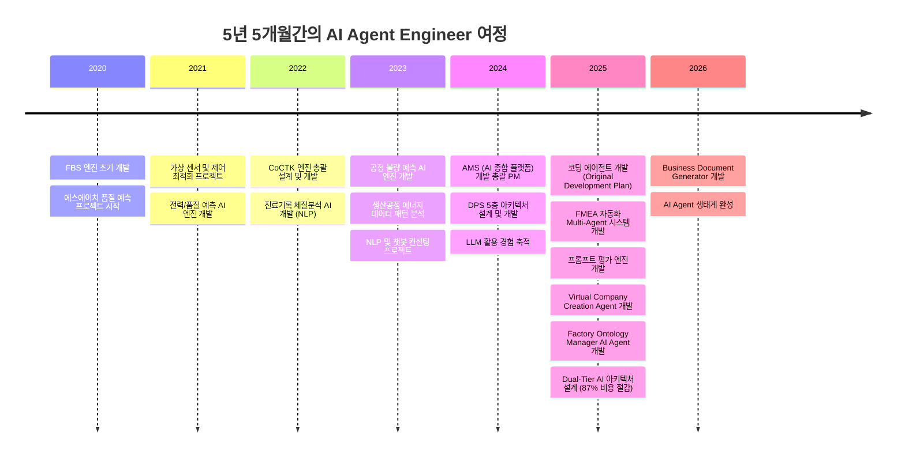
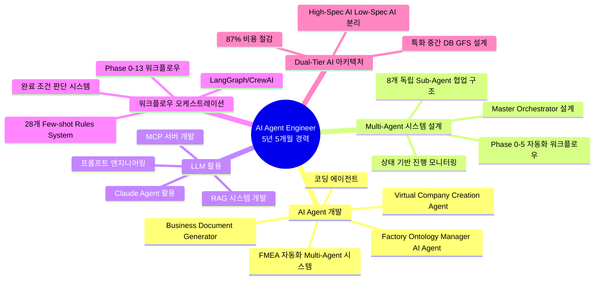
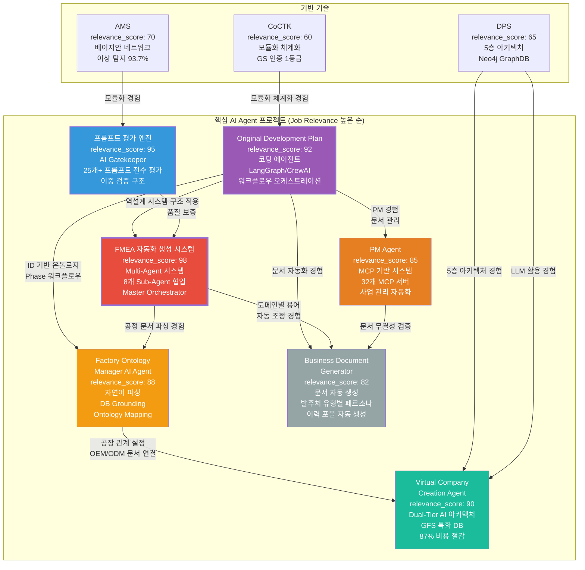
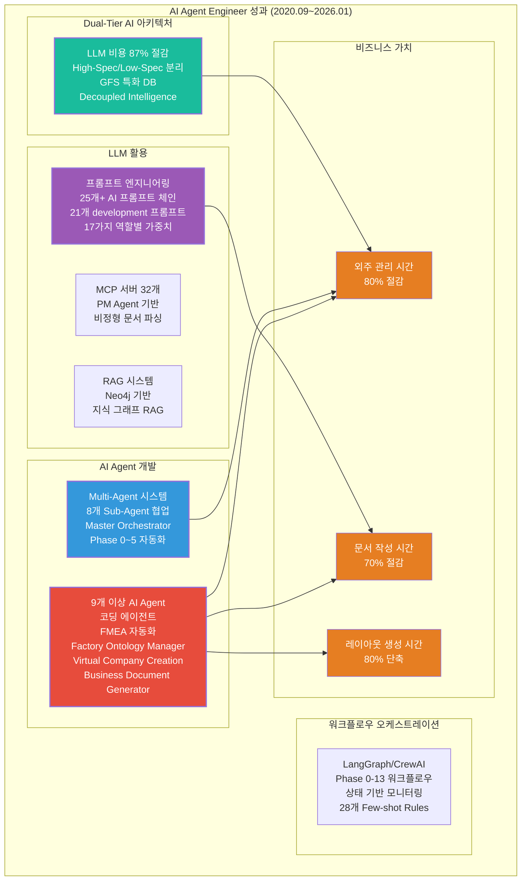

# 권순룡 이력서 - AI Agent Engineer / LLM Engineer

## 기본 정보

**이름**: 권순룡  
**현 소속**: 한솔코에버 연구소 대리 (2020.09 ~ 재직중)  
**총 경력**: 5년 5개월 (2020.09~2026.01)  
**핵심 역량**: AI Agent 개발, Multi-Agent 시스템 설계, LLM 활용 (Claude), 프롬프트 엔지니어링, RAG 시스템 개발, 워크플로우 오케스트레이션 (LangGraph/CrewAI), MCP 서버 개발, Dual-Tier AI 아키텍처  
**이메일**: m920831@naver.com  
**연락처**: 010-5671-6200  
**GitHub**: https://github.com/moobaek

---

## 한눈에 보는 경력 (2020-2026)

---

## 지원 동기

현대오토에버 인공지능기술실의 AI Agent 엔지니어 역할에 기여하고자 지원합니다.

현대오토에버 인공지능기술실은 AI 신기술을 바탕으로 전사 AI 주제를 리드하며 '살아있는 AI' 기술을 만들어 사내 주요 서비스 및 제품이 더욱 경쟁력 있도록 만드는 것을 목표로 하고 있습니다. 5년 5개월간의 경험을 통해 다양한 AI Agent를 개발하고 Multi-Agent 시스템을 설계할 수 있는 AI Agent Engineer로 성장했으며, 특히 **FMEA 자동화 Multi-Agent 시스템**, **Factory Ontology Manager AI Agent**, **PM Agent (MCP 기반)**, **Virtual Company Creation Agent** 등 9개 이상의 AI Agent를 개발했고, **AI Agent 아키텍처 설계 및 Orchestration 구현**, **MCP 기반 채널 연동 아키텍처 설계**, **지식그래프/온톨로지 관련 개발** 경험을 보유하고 있습니다.

**AI Agent 아키텍처 설계 및 Orchestration 구현 역량**을 구체적으로 설명하면, FMEA 자동화 시스템에서 **Master Orchestrator 기반 8개 독립 Sub-Agent 협업 구조**를 설계했습니다. Claude Sub-Agent 기반으로 R&D, Mfg, QA 등 8개의 독립 Sub-Agent가 협업하는 구조를 설계했으며, Phase 0~5 자동화 워크플로우를 통해 전체 프로세스를 자동화했습니다. 또한 LangGraph/CrewAI를 활용하여 복잡한 개발 프로세스를 자동화했으며, Phase 0-13 워크플로우를 설계하여 개발 프로세스의 각 단계를 자동화했습니다.

**MCP 기반 채널 연동 아키텍처 설계 및 구현 역량**으로는 PM Agent에서 **32개 Python MCP 서버를 개발**하여 비정형 문서(HWP, DOCX, XLSX)를 자동 파싱하는 Docker 기반 파서 서버를 구축했습니다. MCP (Model Context Protocol)를 통해 에이전트 간 통신을 구현하여 유기적 네트워크를 구축했으며, 내·외부 에이전트 연동이 가능한 구조를 설계했습니다.

**다양한 Agentic AI 라이브러리, 서비스, 플랫폼에 대한 경험**으로는 Claude Agent, LangGraph, CrewAI 등을 활용하여 다양한 AI Agent를 개발했습니다. 프롬프트 엔지니어링을 통해 복잡한 작업을 자동화했으며, RAG 시스템을 개발하여 LLM의 지식 기반을 확장했습니다.

**지식그래프, 온톨로지 관련 개발 경험**으로는 Neo4j 기반 지식 그래프 RAG 시스템을 개발했으며, Factory Ontology Manager AI Agent에서 자연어 기반 공정 문서 파싱 및 DB Grounding, Ontology Mapping을 구현했습니다. 4M2E 관계 온톨로지를 정의하여 공장의 복잡한 관계를 관리하며, OEM/ODM 대응을 자동화하는 시스템을 개발했습니다.

**AI 에이전트를 활용한 업무 자동화 및 효율화 솔루션 개발 및 적용** 경험으로는 FMEA 자동화 시스템을 통해 리스크 분석 시간을 대폭 단축했으며, Factory Ontology Manager AI Agent를 통해 레이아웃 생성 시간을 80% 단축했습니다. Business Document Generator를 통해 문서 작성 시간을 70% 절감했으며, 코딩 에이전트를 통해 외주 개발자 관리 시간을 80% 이상 절감했습니다.

이러한 경험을 바탕으로 현대오토에버 인공지능기술실의 AI Agent 엔지니어로 기여하여 '살아있는 AI' 기술 개발에 참여하고, 미래 모빌리티 및 유관 분야의 주인공이 되고자 합니다.

---

## 핵심 역량 맵

---

## 핵심 역량

### AI Agent 개발

다양한 AI Agent를 개발하고 설계하는 경험을 보유하고 있습니다. 특히 **코딩 에이전트**, **FMEA 자동화 Multi-Agent 시스템**, **Factory Ontology Manager AI Agent**, **Virtual Company Creation Agent**, **Business Document Generator** 등 9개 이상의 AI Agent를 개발했습니다.

**코딩 에이전트 (Original Development Plan)** 개발 경험으로는 외주 개발자 산출물 관리 문제를 해결하기 위해 코딩 에이전트를 개발했습니다. 백엔드 AI 개발자였지만 코딩 툴을 만들어서 말도 안 되는 시간에 말도 안 되는 개발 개수를 성공적으로 완료했습니다. ID 기반 온톨로지 맵, Phase 0-13 워크플로우, State 기반 정보 전달을 설계하여 복잡한 개발 프로세스를 자동화했습니다. 298개+ 설계 문서, 25개+ AI 프롬프트 체인, 21개 development 프롬프트를 생성했으며, 28개 Few-shot Rules System과 4단계 Testing Workflow를 설계했습니다.

**FMEA 자동화 Multi-Agent 시스템** 개발 경험으로는 Master Orchestrator 기반 8개 독립 Sub-Agent 협업 구조를 설계했습니다. Claude Sub-Agent 기반으로 R&D, Mfg, QA 등 8개의 독립 Sub-Agent가 협업하는 구조를 설계했으며, AIAG & VDA FMEA 표준을 기반으로 범용 리스크 분석 시스템을 개발했습니다. Phase 0부터 Phase 5까지 FMEA 생성 프로세스 전 과정을 자동화하여 리스크 분석 시간을 대폭 단축했습니다.

**Factory Ontology Manager AI Agent** 개발 경험으로는 공장의 온톨로지를 관리하고 OEM/ODM 대응을 자동화하는 시스템을 개발했습니다. 4M2E 관계를 정의하고 온톨로지 매핑을 통해 공장의 복잡한 관계를 관리하며, 고객 문서를 자동으로 파싱하여 자재나 제품 반제품 경로, PLC 센서를 자동으로 연결합니다.

**Virtual Company Creation Agent** 개발 경험으로는 LLM을 서포트하기 위한 특화 중간 DB(GFS)를 설계했습니다. Dual-Tier AI 아키텍처를 설계하여 High-Spec AI (추론)와 Low-Spec AI (조회)를 분리하여 최대 87%의 LLM 비용을 절감했습니다.

**Business Document Generator** 개발 경험으로는 사업계획서, 제안서, 착수보고서 등을 자동으로 생성하는 시스템을 개발했습니다. 2023년부터 회사에서 AI 쪽 사업계획은 내 손을 안 거친 게 없으므로, 이러한 경험을 바탕으로 문서 생성 자동화 시스템을 개발했습니다.

### Multi-Agent 시스템 설계

복잡한 Multi-Agent 시스템을 설계하고 워크플로우를 오케스트레이션하는 경험을 보유하고 있습니다.

**Master Orchestrator 설계** 경험으로는 FMEA 자동화 시스템에서 Master Orchestrator가 전체 워크플로우를 조율하는 구조를 설계했습니다. Python 스크립트 없이 Claude Code 세션 자체가 Orchestrator 역할을 담당하며, 프롬프트 기반 완전 자동화로 개발 복잡성을 감소시켰습니다. Task tool 기반 구현으로 유연한 워크플로우 조정이 가능합니다.

**8개 독립 Sub-Agent 협업 구조** 설계 경험으로는 각 Sub-Agent가 독립적으로 동작하면서도 Master Orchestrator의 지시에 따라 협업하도록 설계했습니다. R&D, Mfg, QA 등 8개의 독립 Sub-Agent가 각각 전문 영역을 담당하며, 전체 프로세스를 협업하여 완성합니다.

**Phase 0~5 자동화 워크플로우** 설계 경험으로는 FMEA 생성 프로세스 전 과정을 자동화했습니다. 각 Phase는 명확한 입력과 출력을 가지며, 상태 기반 진행 모니터링을 통해 각 단계의 완료 조건을 자동으로 판단합니다.

### LLM 활용 및 프롬프트 엔지니어링

Claude Agent를 활용하여 다양한 AI Agent를 개발하고 프롬프트 엔지니어링을 수행하는 경험을 보유하고 있습니다.

**Claude Agent 활용** 경험으로는 Claude Sub-Agent를 활용하여 다양한 AI Agent를 개발했습니다. FMEA 자동화 시스템에서 Claude Sub-Agent 기반으로 8개의 독립 Sub-Agent를 설계했으며, 프롬프트 평가 엔진에서 Claude Agent를 활용하여 프롬프트를 평가했습니다.

**프롬프트 엔지니어링** 경험으로는 25개+ AI 프롬프트 체인을 생성했으며, 21개 development 프롬프트를 개발했습니다. 28개 Few-shot Rules System을 설계하여 코드 품질을 자동으로 검증하도록 했으며, 프롬프트 평가 엔진을 개발하여 프롬프트의 품질을 자동으로 평가했습니다.

**RAG 시스템 개발** 경험으로는 Neo4j 기반 지식 그래프 RAG를 개발했습니다. 4M2E 관계 온톨로지를 정의하여 지식 그래프를 구축했으며, RAG를 통해 LLM의 지식 기반을 확장했습니다.

**MCP 서버 개발** 경험으로는 32개 Python MCP 서버를 개발하여 LLM과 외부 시스템을 연동했습니다. 다양한 도메인의 MCP 서버를 개발하여 LLM이 외부 시스템과 상호작용할 수 있도록 했습니다.

### 워크플로우 오케스트레이션

LangGraph/CrewAI를 활용하여 복잡한 개발 프로세스를 자동화하는 경험을 보유하고 있습니다.

**LangGraph/CrewAI 오케스트레이션** 경험으로는 Original Development Plan에서 LangGraph/CrewAI 방식 워크플로우 오케스트레이션을 설계했습니다. Phase 0-13 워크플로우를 설계하여 개발 프로세스의 각 단계를 자동화했으며, 상태 기반 정보 전달을 통해 Phase 간 데이터를 전달했습니다.

**상태 기반 진행 모니터링** 경험으로는 개발 프로세스의 각 단계를 자동으로 모니터링하고 완료 조건을 판단하는 시스템을 설계했습니다. 각 Phase의 완료 조건을 명확히 정의하고, 조건을 만족하면 다음 Phase로 자동으로 진행합니다.

**28개 Few-shot Rules System** 설계 경험으로는 8개 도메인(design/api/database/component/state/security/performance/testing)에 대해 28개의 Few-shot 규칙을 정의하여 코드 품질을 자동으로 검증합니다. 규칙 이중 참조 구조(설계 시 + 테스트 시 적용)를 통해 설계 단계와 테스트 단계 모두에서 규칙을 적용합니다.

**4단계 Testing Workflow** 설계 경험으로는 Mock Setup → Unit → Integration → E2E의 4단계 테스트 워크플로우를 설계하여 테스트 프로세스를 자동화했습니다. Mock 기반 테스트 자동화 워크플로우를 통해 테스트 환경을 자동으로 구축하고 실행합니다.

### Dual-Tier AI 아키텍처 설계

AI 시스템의 비용 효율성을 극대화하기 위한 Dual-Tier AI 아키텍처를 설계하는 경험을 보유하고 있습니다.

**High-Spec AI / Low-Spec AI 분리** 설계 경험으로는 Virtual Company Creation Agent에서 High-Spec AI (추론)와 Low-Spec AI (조회)를 분리하여 최대 87%의 LLM 비용을 절감했습니다. "어차피 AI LLM은 앞뒤 주는 것만 잘하면 되니까" 특화 중간 DB를 만들어서 LLM의 추론 부담을 줄이고, 조회 작업은 Low-Spec AI로 처리하도록 아키텍처를 설계했습니다.

**특화 중간 DB (GFS) 설계** 경험으로는 LLM을 서포트하기 위한 특화 중간 DB를 설계했습니다. LLM 활용하다보니 온톨로지도 잘 못알아먹고 벡터도 부족하다는 것을 깨달고 특화 중간 DB가 필요하다고 생각해서 만들었습니다. LLM이 만들어지려면 가상의 공장 정보의 파이프라인이 필요했는데, 실제 공장 정보가 아니라 암묵적으로 더 방대한 차원의 정보(기업 풀)가 필요했습니다. AI가 그때그때 추론하면 리소스도 많이 먹고 계속 변동되고 문제가 생겨도 왜인지 추적이 안되므로, 특화 중간 DB를 설계하여 이러한 문제를 해결했습니다.

**Decoupled Intelligence Architecture** 설계 경험으로는 지능과 상태를 분리하여 각각의 독립성을 확보하고, 시스템의 유연성과 확장성을 높였습니다. AI의 추론 능력과 시스템의 상태 관리를 분리하여 각각의 독립성을 확보했습니다.

---

## 프로젝트 관계도

---

## 경력 개요

### 한솔코에버 연구소 (2020.09 ~ 재직중)

**직급**: 대리  
**부서**: 연구소  
**총 경력**: 5년 5개월 (2020.09~2026.01)

**주요 업무**:
- **AI Agent 또는 LLM 기반 Agent 시스템 개발**: 코딩 에이전트, FMEA 자동화 Multi-Agent 시스템, Factory Ontology Manager AI Agent, Virtual Company Creation Agent, Business Document Generator 등 9개 이상의 AI Agent 개발
- **Prompt를 단순 텍스트가 아닌 Agent 동작 로직의 일부로 설계**: 프롬프트 평가 엔진 개발, 25개+ AI 프롬프트 체인 생성, 21개 development 프롬프트 개발, 17가지 역할별 동적 가중치 시스템 적용
- **Agent 실행 흐름을 구조화하여 설계·구현 (반복·종료·예외 제어 포함)**: Phase 0-13 워크플로우 설계, Phase 0~5 자동화 워크플로우 구현, 상태 기반 진행 모니터링 및 완료 조건 판단 시스템
- **MCP 기반 도구 연동 구조 개발 및 확장**: 32개 Python MCP 서버 개발, 비정형 문서(HWP, DOCX, XLSX) 자동 파싱, 에이전트 간 통신을 통한 유기적 네트워크 구축
- **Workflow 또는 Graph 기반 실행 구조 설계 및 구현**: LangGraph/CrewAI 워크플로우 오케스트레이션, 7단계 Chain Workflow, 14 Layer 온톨로지 좌표 체계
- **Agent 엔진·SDK 설계/개선 및 유지관리**: Master Orchestrator 설계, Modular Execution Engine 개발, 공용 엔진 형태의 코드 설계
- **Agent 품질 이슈 분석 및 안정화 (오동작/루프/환각 등 대응)**: 프롬프트 평가 엔진 개발, 이중 검증 구조, Human-in-the-Loop 8단계 필수 검증 프로세스

**핵심 성과**:
- ✅ **9개 이상의 AI Agent 개발**: 코딩 에이전트, FMEA 자동화, Factory Ontology Manager, Virtual Company Creation Agent, Business Document Generator, PM Agent, 프롬프트 평가 엔진, Evaluation Framework, AI_DB_tester (VACTS)
- ✅ **Multi-Agent 시스템 설계**: Master Orchestrator 기반 8개 독립 Sub-Agent 협업 구조 (FMEA 자동화)
- ✅ **워크플로우 오케스트레이션**: LangGraph/CrewAI를 활용한 복잡한 프로세스 자동화 (Phase 0-13 워크플로우)
- ✅ **프롬프트 엔지니어링**: 25개+ AI 프롬프트 체인, 21개 development 프롬프트, 28개 Few-shot Rules System
- ✅ **MCP 서버 개발**: 32개 Python MCP 서버 개발 (PM Agent 기반)
- ✅ **Dual-Tier AI 아키텍처 설계**: High-Spec AI와 Low-Spec AI 분리로 LLM 비용 87% 절감
- ✅ **GS 인증 1등급 2개 취득**: CoCTK (2024), AMS-PDS (2025)
- ✅ **특허 출원/등록**: 5건 (2건 등록결정 완료, 3건 심사 진행 중, 총 청구항 39개)
- ✅ **학술 논문 발표 10편**: 2020-2025년, AI/에너지/데이터 분석/제조 DX 분야
- ✅ **설계 문서 298개+ 작성**: ID 기반 온톨로지 맵 시스템, Original Development Plan
- ✅ **Python 모듈 49개 개발**: MLS, CoCTK, FBS, RMS, AMS 등 핵심 엔진

**비즈니스 임팩트**:
- 외주 개발자 관리 시간 80% 이상 절감 (코딩 에이전트 시스템)
- 문서 작성 시간 70% 절감 (Business Document Generator)
- LLM 비용 87% 절감 (Dual-Tier AI 아키텍처)
- 레이아웃 생성 시간 80% 단축 (Factory Ontology Manager AI Agent)

---

## 주요 프로젝트 경험

### 1. FMEA 자동화 생성 시스템 (Claude Sub-Agent) - Master Orchestrator 설계

**기간**: 2025.06 ~ 진행중  
**발주처**: 내부 개발  
**역할**: Master Orchestrator 설계 및 Multi-Agent Workflow 구현  
**relevance_score**: 98

**핵심 성과**:
- ✅ **Multi-Agent Workflow 설계**: Claude Sub-Agent 기반 8개 독립 Sub-Agent 협업 구조 구현
- ✅ **Master Orchestrator 설계**: Python 스크립트 없이 Claude Code 세션 자체가 Orchestrator 역할, 프롬프트 기반 완전 자동화
- ✅ **코딩 에이전트 역설계 시스템 구조 적용**: AIAG & VDA FMEA 표준 기반 범용 리스크 분석 시스템 개발
- ✅ **Phase 0~5 자동화 워크플로우**: FMEA 생성 프로세스 전 과정 자동화
- ✅ **Task tool 기반 구현**: 유연한 워크플로우 조정 가능
- ✅ **논문 발표**: 2025년 논문 발표

**기술 스택**: Python, Claude Agent, Multi-Agent System, MCP, RAG, LangGraph/CrewAI, Task tool

**상세 설명**:
FMEA 자동화 시스템은 제조 현장의 리스크 분석을 자동화하는 Multi-Agent 시스템입니다. Claude Sub-Agent 기반으로 8개의 독립 Sub-Agent(R&D, Mfg, QA 등)가 협업하는 구조를 설계했으며, AIAG & VDA FMEA 표준을 기반으로 범용 리스크 분석 시스템을 개발했습니다.

**Master Orchestrator 설계**: 전체 워크플로우를 조율하는 중앙 조정자입니다. Python 스크립트 없이 Claude Code 세션 자체가 Orchestrator 역할을 담당하며, 프롬프트 기반 완전 자동화로 개발 복잡성을 감소시켰습니다. Task tool 기반 구현으로 유연한 워크플로우 조정이 가능합니다.

**8개 독립 Sub-Agent 협업 구조**: 각 Sub-Agent가 독립적으로 동작하면서도 Master Orchestrator의 지시에 따라 협업하도록 설계했습니다. R&D, Mfg, QA 등 8개의 독립 Sub-Agent가 각각 전문 영역을 담당하며, 전체 프로세스를 협업하여 완성합니다.

**Phase 0~5 자동화 워크플로우**: FMEA 생성 프로세스 전 과정을 자동화하여 리스크 분석 시간을 대폭 단축했습니다. 각 Phase는 명확한 입력과 출력을 가지며, 상태 기반 진행 모니터링을 통해 각 단계의 완료 조건을 자동으로 판단합니다.

**진화 배경**: 테크웰/신성오토텍 컨설팅 프로젝트에서 FBS, 패턴 분석, 확률 네트워크가 너무 난해해서 공장 관리자가 이해하지 못하는 문제를 해결하기 위해 개발되었습니다. 공장 관리자가 아는 FMEA 형식으로 각각 문서화하여 종합적으로 보여주고, 도메인별 용어 자동 조정으로 현장이 이해할 수 있는 언어로 변환하는 시스템입니다.

**코딩 에이전트 역설계 시스템 구조 적용**: 코딩 에이전트의 역설계 시스템 구조를 FMEA 분석에 적용하여 복잡한 FMEA 프로세스를 8개 Sub-Agent로 분해했습니다. 코드 에이전트에서 영감을 받은 전체 공장/회사/사무 자동화의 백정보 핵심으로 발전했습니다.

**비즈니스 가치**: 복잡한 기술을 현장이 이해할 수 있는 언어로 변환하여 실용성을 극대화했습니다. 리스크 분석 시간을 대폭 단축하여 생산성을 향상시켰습니다.

---

### 2. 프롬프트 평가 엔진 (Claude Sub-Agent) - AI Gatekeeper

**기간**: 2025.06 ~ 진행중  
**발주처**: 내부 개발  
**역할**: AI Gatekeeper 설계 및 구현  
**relevance_score**: 95

**핵심 성과**:
- ✅ **AI Gatekeeper**: 모든 AI 생성물의 입구를 통제하는 심사관
- ✅ **전체 프롬프트 전수 평가**: 25개+ 프롬프트의 품질을 승인/반려하는 완전 자동화 시스템
- ✅ **Prompt를 Agent 동작 로직의 일부로 다루기**: Prompt를 단순 텍스트가 아닌 Agent 동작 로직의 일부로 설계, 17가지 역할별 동적 가중치 적용
- ✅ **3가지 핵심 차원 평가**: Quality, Consistency, Cost
- ✅ **MLOps Priority Matrix 기반 가중치**: Structural 40%, Correctness 30%, Relevancy 20%, Tone 10%
- ✅ **17가지 역할별 동적 가중치 시스템**: 각 역할에 맞는 최적화된 평가
- ✅ **병렬 처리 구조**: 4개 메트릭 동시 평가로 효율성 극대화
- ✅ **5단계 평가 프로세스**: Role Inference → Metrics Parallel → Consolidation → Report → Translation
- ✅ **이중 검증 구조**: AI가 생성한 프롬프트를 다른 AI가 평가하여 환각 방지
- ✅ **Human-in-the-Loop 8단계 필수 검증 프로세스**: 배치 처리 지원

**기술 스택**: Python, Claude Agent, Multi-Agent System, 프롬프트 평가, MLOps Priority Matrix

**상세 설명**:
프롬프트 평가 엔진은 모든 AI 생성물의 입구를 통제하는 심사관 역할을 합니다. 전체 프롬프트를 전수 평가하는 완전 자동화 시스템으로, AI가 생성한 프롬프트를 다른 AI가 평가하는 이중 검증 구조로 환각을 방지합니다.

**Prompt를 Agent 동작 로직의 일부로 다루기**: Prompt를 단순 텍스트가 아닌 Agent 동작 로직의 일부로 설계했습니다. 3가지 핵심 차원(Quality, Consistency, Cost) 평가 체계와 MLOps Priority Matrix 기반 가중치 시스템을 구축했으며, 특히 17가지 역할별 동적 가중치를 적용하여 다양한 사용자 시나리오에 맞는 Prompt 구조를 설계했습니다.

**Prompt 구조 설계 및 운영 기준 정립**: 반복·종료·예외 제어를 포함한 구조화된 Prompt 시스템을 구현했습니다. Prompt 변경에 따른 Agent 동작 및 품질 변화를 분석·개선하는 경험을 쌓았습니다.

**Agent 품질 이슈 분석 및 안정화**: 오동작/루프/환각 등 대응 메커니즘을 구현했습니다. 이중 검증(Double-Check) 시스템으로 환각(Hallucination) 방지, 운영 환경에서 이슈를 분석하고 개선으로 연결할 수 있는 문제 해결 역량을 보유하고 있습니다.

**LLM 에이전트 토대**: CoCTK/AMS에서 모듈화 및 체계화 경험, GS 인증 프로세스 경험을 쌓아 프롬프트 평가 엔진 설계의 토대가 되었습니다.

**비즈니스 가치**: AI 생성물의 품질을 보장하여 신뢰성 있는 AI 시스템 구축에 기여했습니다. 모든 AI 생성물의 입구를 통제하여 품질 관리를 자동화했습니다.

---

### 3. Original Development Plan (Obsidian Design Origin) - 코딩 에이전트 개발

**기간**: 2020~2025 (집중 개발: 2025.5~7, 2025.8~10, 2025.10~12)  
**발주처**: 내부 개발  
**역할**: 코딩 에이전트 개발 및 전체 에이전트 시스템 설계  
**relevance_score**: 92

**핵심 성과**:
- ✅ **코딩 에이전트 개발**: 외주 개발자 산출물 관리 문제 해결
- ✅ **LangGraph/CrewAI 워크플로우 오케스트레이션**: 복잡한 개발 프로세스 자동화
- ✅ **상태 기반 진행 모니터링**: 완료 조건 판단 시스템 설계
- ✅ **28개 Few-shot Rules System**: 코드 품질 자동 검증
- ✅ **4단계 Testing Workflow**: 테스트 프로세스 자동화
- ✅ **298개+ 설계 문서**: 체계적인 설계 문서화
- ✅ **25개+ AI 프롬프트 체인**: 프롬프트 기반 자동화

**기술 스택**: Python, LangGraph, CrewAI, State Management, Few-shot Learning, Testing Framework, 코딩 에이전트, ID 기반 온톨로지 맵

**상세 설명**:
Original Development Plan은 전체 에이전트 시스템의 아키텍처를 설계한 프로젝트입니다. **코딩 에이전트를 개발하여 외주 개발자 산출물 관리 문제를 해결**했습니다.

**코딩 에이전트 개발**: 외주 개발자 산출물 관리 문제를 해결하기 위해 코딩 에이전트를 개발했습니다. 백엔드 AI 개발자였지만 코딩 툴을 만들어서 말도 안 되는 시간에 말도 안 되는 개발 개수를 성공적으로 완료했습니다. 이를 통해 온톨로지 공장 agent 개발도 가능해졌으며, 프론트엔드/시각화 부분도 개발할 수 있게 되었습니다.

**LangGraph/CrewAI 워크플로우 오케스트레이션**: ID 기반 온톨로지 맵, Phase 0-13 워크플로우, State 기반 정보 전달을 설계하여 복잡한 개발 프로세스를 자동화했습니다. 각 Phase는 독립적으로 실행 가능하며, 상태 기반 정보 전달을 통해 Phase 간 데이터를 전달합니다. 전문가 요약 시스템으로 도메인 지식 기반 핵심 정보를 추출하여 컨텍스트 길이를 최적화했습니다.

**상태 기반 진행 모니터링**: 개발 프로세스의 각 단계를 자동으로 모니터링하고 완료 조건을 판단합니다. 각 Phase의 완료 조건을 명확히 정의하고, 조건을 만족하면 다음 Phase로 자동으로 진행합니다. 워크플로우 상태 모니터링 및 자동 복귀 로직을 구현하여 프로세스 안정성을 확보했습니다.

**28개 Few-shot Rules System**: 8개 도메인(design/api/database/component/state/security/performance/testing)에 대해 28개의 Few-shot 규칙을 정의하여 코드 품질을 자동으로 검증합니다. 규칙 이중 참조 구조(설계 시 + 테스트 시 적용)를 통해 설계 단계와 테스트 단계 모두에서 규칙을 적용합니다.

**4단계 Testing Workflow**: Mock Setup → Unit → Integration → E2E의 4단계 테스트 워크플로우를 설계하여 테스트 프로세스를 자동화했습니다. Mock 기반 테스트 자동화 워크플로우를 통해 테스트 환경을 자동으로 구축하고 실행합니다.

**공용 엔진·SDK·프레임워크 형태의 코드 설계**: 전체 에이전트 시스템을 공용 엔진 형태로 설계하여 재사용 가능한 구조로 개발했습니다. Agent 기능 확장 시 구조적 영향을 검토하고 설계 방향을 제시하는 경험을 쌓았습니다.

**진화 배경**: 외주 개발자 산출물 관리 문제 해결을 위해 코딩 에이전트 개발 → 다수 PM 경험(제안서~완료, 외주 관리)을 통해 전체 에이전트 시스템 설계의 토대 마련. **핵심 스토리**: 외주 개발자가 산출물을 관리하지 않고, 온톨로지 공장 agent 개발 시간이 부족한 상황에서 백엔드 AI 개발자였지만 코딩 툴을 만들어서 말도 안 되는 시간에 말도 안 되는 개발 개수를 성공적으로 완료. 이 경험이 FMEA 자동화 에이전트, PM Agent, Factory Ontology Manager 등 다른 AI Agent 설계의 기초가 됨.

**다른 AI Agent로의 확장**: 코딩 에이전트의 경험이 다른 모든 AI Agent의 설계 기초가 되었습니다. FMEA 자동화: 역설계 시스템 구조 적용, Factory Ontology Manager: ID 기반 온톨로지, Phase 워크플로우, PM Agent: PM 경험, 문서 관리, Business Document Generator: 문서 자동화 경험, Evaluation Framework: 모듈화 체계화.

**비즈니스 가치**: 외주 개발자 관리 시간 80% 이상 절감, 문서 일관성 100% 보장 (ID 시스템 기반), 개발 프로세스 자동화로 납품 품질 향상

---

### 2. FMEA 자동화 생성 시스템 (Claude Sub-Agent) - Multi-Agent 시스템 개발

**기간**: 2025.06 ~ 진행중  
**발주처**: 내부 개발  
**역할**: Master Orchestrator 설계 및 Multi-Agent Workflow 구현

**핵심 성과**:
- ✅ **Multi-Agent Workflow 설계**: Claude Sub-Agent 기반 8개 독립 Sub-Agent 협업 구조 구현
- ✅ **Master Orchestrator 설계**: 전체 워크플로우 조율 구조 설계
- ✅ **Phase 0~5 자동화 워크플로우**: FMEA 생성 프로세스 전 과정 자동화
- ✅ **AIAG & VDA FMEA 표준 기반**: 범용 리스크 분석 시스템 개발
- ✅ **논문 발표**: 2025년 논문 발표

**기술 스택**: Python, Claude Agent, Multi-Agent System, MCP, RAG

**Multi-Agent 시스템 개발 상세**:
FMEA 자동화 시스템은 제조 현장의 리스크 분석을 자동화하는 Multi-Agent 시스템입니다. **Master Orchestrator 기반 8개 독립 Sub-Agent 협업 구조**를 설계했습니다.

**Master Orchestrator**: 전체 워크플로우를 조율하는 중앙 조정자입니다. Python 스크립트 없이 Claude Code 세션 자체가 Orchestrator 역할을 담당하며, 프롬프트 기반 완전 자동화로 개발 복잡성을 감소시켰습니다. Task tool 기반 구현으로 유연한 워크플로우 조정이 가능합니다.

**8개 독립 Sub-Agent**: R&D, Mfg, QA 등 8개의 독립 Sub-Agent가 각각 전문 영역을 담당합니다. 각 Sub-Agent는 독립적으로 동작하면서도 Master Orchestrator의 지시에 따라 협업합니다.

**Phase 0~5 자동화 워크플로우**: FMEA 생성 프로세스 전 과정을 자동화하여 리스크 분석 시간을 대폭 단축했습니다. 각 Phase는 명확한 입력과 출력을 가지며, 상태 기반 진행 모니터링을 통해 각 단계의 완료 조건을 자동으로 판단합니다.

**AIAG & VDA FMEA 표준 기반**: AIAG & VDA FMEA 표준을 기반으로 범용 리스크 분석 시스템을 개발했습니다. 복잡한 기술적 출력(FBS, 확률 네트워크)을 현장이 이해하는 언어로 변환합니다.

**스토리**: 전무님이 2020년도부터 추구했던 공정 라인을 공장 사람들이 쉽게 수정하는 것, 그리고 2025년에 김이사님(당시 사업 부분장)이 OEM ODM 대응이 필요하다 자동 툴이 필요하다 하셨습니다. 그래서 이 두 가지를 커버하기 위해서 만들었습니다. 공장에 대한 기본적인 관계를 먼저 설정하고 고객이 각각 위 업체(발주처 등등) 문서를 받으면 거기에 올려서 자동으로 연결되는, 자재나 제품 반제품 경로, PLC 센서 자동) 시스템을 만들려고 했습니다. 그런데 세아특수강 프로젝트에서 Cursor(AI agent)를 활용하여 성공하였습니다. "아 이거 되는구나" 하고 진행했습니다.

---

### 4. Virtual Company Creation Agent & AI_DB_tester (VACTS) - Dual-Tier AI 아키텍처 설계

**기간**: 2026.1.4 ~ 진행중  
**발주처**: 내부 개발  
**역할**: Dual-Tier AI 아키텍처 설계 및 특화 중간 DB 설계  
**relevance_score**: 90

**핵심 성과**:
- ✅ **Dual-Tier AI 아키텍처 설계**: High-Spec AI (추론)와 Low-Spec AI (조회) 분리로 최대 87% 비용 절감
- ✅ **특화 중간 DB (GFS) 설계**: LLM을 서포트하기 위한 특화 중간 DB 설계
- ✅ **Decoupled Intelligence Architecture**: 지능과 상태의 분리
- ✅ **온톨로지 매핑 시스템**: DB Grounding 및 Ontology Mapping

**핵심 성과**:
- ✅ **AI 에이전트로만 구성된 가상 기업 생성 시스템**: 225개 서브시스템 (15 Systems × 15 Sub-Agents)
- ✅ **Decoupled Intelligence Architecture**: 지능과 상태의 분리, O(1) 리소스로 O(N) 스케일링 달성
- ✅ **Dual-Tier AI 아키텍처 설계**: High-Spec AI (추론)와 Low-Spec AI (조회) 분리로 최대 87% 비용 절감
- ✅ **GFS (Grape File System)**: AI 없이도 데이터 접근 가능한 파일 기반 NoSQL 구조로 비용 87% 절감
- ✅ **7단계 Chain Workflow**: Chain 01~07 (Foundation → Organization → Agents → System Orchestrator → Protocol → Assembly → Crystallization)
- ✅ **14 Layer 온톨로지 좌표 체계**: Strategic/Structural/Functional/Operational/Protocol
- ✅ **PostgreSQL-Inspired 기능**: WAL, MVCC, Index, Vacuum으로 엔터프라이즈급 데이터 무결성 보장
- ✅ **Modular Execution Engine**: Full/Partial/Single/Resume 모드 지원으로 유연한 워크플로우 실행
- ✅ **20개 이상 설계 문서 완료**: architecture 폴더 (Blue_Print, Business_Summary, Process_Overview 등)

**기술 스택**: Claude Agent, HQONS (Hyper-Quantum Omni-Net Structure), MCP, Vector DB, GFS, Dual-Tier AI, PostgreSQL-Inspired Architecture, Decoupled Intelligence Architecture

**상세 설명**:
Virtual Company Creation Agent와 AI_DB_tester (VACTS)는 같은 뿌리에서 시작된 프로젝트입니다. LLM 활용하다보니 온톨로지도 잘 못알아먹고 벡터도 부족하다는 것을 깨달고 특화 중간 DB가 필요하다고 생각해서 만들었습니다.

**Dual-Tier AI 아키텍처**: High-Spec AI (추론)와 Low-Spec AI (조회)를 분리하여 최대 87%의 LLM 비용을 절감했습니다. "어차피 AI LLM은 앞뒤 주는 것만 잘하면 되니까" 특화 중간 DB를 만들어서 LLM의 추론 부담을 줄이고, 조회 작업은 Low-Spec AI로 처리하도록 아키텍처를 설계했습니다.

**GFS (Grape File System)**: AI 없이도 데이터 접근 가능한 파일 기반 NoSQL 구조로 단순 조회 비용 $0.01/요청 → $0으로 절감 (87% 비용 절감). "직원 225명 대신 빈 책상 225개 + 천재 직원 1명"이라는 개념으로, Decoupled Intelligence Architecture를 통해 지능과 상태를 분리했습니다.

**Decoupled Intelligence Architecture**: 지능과 상태를 분리하여 각각의 독립성을 확보하고, 시스템의 유연성과 확장성을 높였습니다. AI의 추론 능력과 시스템의 상태 관리를 분리하여 각각의 독립성을 확보했습니다. 225개의 빈 책상(포도송이/Grape Cluster)은 평소 Dormant 상태로 유지비 0원, 1명의 슈퍼 AI(거대 에이전트)가 필요한 순간 특정 책상으로 순간이동(Docking)하여 O(1) 리소스로 O(N) 스케일링 달성했습니다.

**7단계 Chain Workflow**: Chain 01~07 (Foundation → Organization → Agents → System Orchestrator → Protocol → Assembly → Crystallization)을 통해 복잡한 비즈니스 프로세스를 구조화했습니다.

**PostgreSQL-Inspired 기능**: WAL (Write-Ahead Log), MVCC (Multi-Version Concurrency Control), Index, Vacuum으로 엔터프라이즈급 데이터 무결성 보장했습니다.

**LLM 에이전트 토대**: DPS에서 5층 아키텍처 설계 경험과 LLM 활용 경험을 바탕으로, LLM이 온톨로지도 잘 못알아먹고 벡터도 부족하다는 것을 깨달고 특화 중간 DB 필요성을 인식하여 개발되었습니다.

**비즈니스 가치**: LLM 비용을 87% 절감하면서도 엔터프라이즈급 데이터 무결성을 보장하는 혁신적인 아키텍처입니다.

---

### 5. Factory Ontology Manager AI Agent - 공장 온톨로지 관리 시스템 개발

**기간**: 2026.1.8 ~ 진행중  
**발주처**: 내부 개발  
**역할**: 공장 온톨로지 관리 시스템 개발  
**relevance_score**: 88

**핵심 성과**:
- ✅ **자연어 기반 공정 문서 파싱**: 공정 문서를 파싱하여 공장 데이터와 매핑
- ✅ **캔버스 레이아웃 자동 생성**: 공정 문서 기반 시각적 레이아웃 자동 생성
- ✅ **DB Grounding**: 자연어 파싱 결과를 DB에 연결
- ✅ **Ontology Mapping**: 공정 문서를 온톨로지로 매핑
- ✅ **Spec-First Modification**: 스펙 우선 수정 방식
- ✅ **LangGraph V2**: 공정 재사용 로직, 자재 할당 개선, materialId 검증
- ✅ **비즈니스 가치**: 레이아웃 생성 시간 80% 단축, 데이터 일관성 향상

**기술 스택**: React, TypeScript, Flask, LangGraph, Instructor, AI_DB_center, 자연어 처리, DB Grounding, Ontology Mapping, Human-in-the-Loop

**상세 설명**:
Factory Ontology Manager AI Agent는 자연어 기반 공정 문서 파싱 및 캔버스 레이아웃 자동 생성 시스템입니다. 공정 문서를 파싱하여 공장 데이터와 매핑하고, 캔버스 레이아웃을 자동으로 생성합니다.

**자연어 파싱**: 공정 문서를 자연어로 파싱하여 구조화된 데이터로 변환합니다. LangGraph V2를 활용하여 공정 재사용 로직, 자재 할당 개선, materialId 검증을 구현했습니다.

**DB Grounding**: 자연어 파싱 결과를 DB에 연결하여 데이터 일관성을 보장합니다. Spec-First Modification 방식으로 일관성을 유지합니다.

**Ontology Mapping**: 공정 문서를 온톨로지로 매핑하여 관계를 구조화합니다. 4M2E 관계를 정의하고 온톨로지 매핑을 통해 공장의 복잡한 관계를 관리합니다.

**LLM 에이전트 토대**: 세아특수강에서 데이터 통합(POP/SPC, RS232C-LAN 변환, Lot 매칭) 경험을 쌓아 Factory Ontology Manager AI Agent 프론트 및 기본 기능 설계의 토대가 되었습니다.

**진화 배경**: 2020년 전무님의 비전(공정 라인 쉽게 수정)과 2025년 김이사님의 니즈(OEM ODM 대응)가 만나서 해결책이 필요했습니다. 공장에 대한 기본적인 관계를 먼저 설정하고, 고객이 각각 위 업체(발주처 등등) 문서를 받으면 거기에 올려서 자동으로 연결되는 시스템을 만들려고 했는데, 세아특수강 프로젝트에서 Cursor(AI agent)를 활용하여 성공하였습니다. "아 이거 되는구나" 하고 진행했습니다. 5년간의 비전이 현실이 되었습니다.

**비즈니스 가치**: 레이아웃 생성 시간 80% 단축, 데이터 일관성 향상으로 OEM/ODM 대응 효율성을 극대화했습니다.

---

### 6. PM Agent (Business Management Sub-Agent) - MCP 기반 사업 관리 자동화

**기간**: 2025.10 ~ 진행중  
**발주처**: 내부 개발  
**역할**: MCP 기반 사업 관리 자동화 시스템 설계 및 개발  
**relevance_score**: 85

**핵심 성과**:
- ✅ **MCP 기반 시스템 개발**: MCP (Model Context Protocol) 기반 기술 자산 관리 시스템 구축
- ✅ **32개 Python MCP 서버 개발**: 비정형 문서(HWP, DOCX, XLSX) 자동 파싱하는 Docker 기반 파서 서버
- ✅ **사업 관리 전체 라이프사이클 관장**: Risk Management, Schedule Tracking, Integrity Check
- ✅ **Risk Management**: 계약서/과업지시서 내 독소 조항 자동 추출 및 리스크 평가
- ✅ **Schedule Tracking**: 회의록 분석을 통한 타임라인 자동 현행화
- ✅ **Integrity Check**: 누락된 문서나 데이터 파편화를 방지하는 무결성 검증
- ✅ **에이전트 간 통신**: 유기적 네트워크 구축하여 내·외부 에이전트 연동 가능한 구조

**기술 스택**: MCP (Model Context Protocol), Python, Claude Agent, Docker, HWP 파서

**상세 설명**:
PM Agent는 사업 관리의 전체 라이프사이클을 관장하는 Execution Manager & Governance 시스템입니다.

**MCP 기반 시스템 개발**: MCP Protocol을 통해 비정형 문서(HWP, DOCX, XLSX)를 자동 파싱하는 Docker 기반 파서 서버를 구축했습니다. 32개 Python MCP 서버를 개발하여 다양한 기능을 제공합니다.

**사업 관리 전체 라이프사이클 관장**:
1. **Risk Management**: 계약서/과업지시서 내 독소 조항 자동 추출 및 리스크 평가
2. **Schedule Tracking**: 회의록 분석을 통한 타임라인 자동 현행화
3. **Integrity Check**: 누락된 문서나 데이터 파편화를 방지하는 무결성 검증

**에이전트 간 통신**: 에이전트 간 통신을 통해 유기적 네트워크를 구축하여 내·외부 에이전트 연동이 가능한 구조를 설계했습니다.

**LLM 에이전트 토대**: 다수 PM 경험(제안서 작성, 외주 관리, 완료서 작성, 포미아 DX 등)을 통해 PM Agent 설계의 토대가 되었습니다.

**비즈니스 가치**: 사업 관리 자동화로 PM 업무 효율성을 극대화하고, 리스크를 사전에 예방하여 프로젝트 성공률을 향상시켰습니다.

---

### 7. Business Document Generator - 사업계획서 자동 생성 시스템

**기간**: 2025.12 ~ 진행중  
**발주처**: 내부 개발  
**역할**: 사업계획서 자동 생성 시스템 개발  
**relevance_score**: 82

**핵심 성과**:
- ✅ **사업계획서/제안서/착수보고서 자동 생성**: 요구조건 문서 및 Architecture 파일 파싱
- ✅ **포트폴리오 스마트 매칭**: 기존 포트폴리오를 활용하여 문서 품질 향상
- ✅ **발주처 유형별 페르소나 적용**: 정부/민간/공공기관 등 발주처 유형에 맞는 문서 스타일 자동 적용
- ✅ **이력 포폴 자동 생성**: 포트폴리오 기반 이력서 및 포트폴리오 자동 생성
- ✅ **PM 통합 검증**: PM Agent와 통합하여 문서 무결성 검증
- ✅ **WBS 세부화**: 작업 분해 구조 자동 세부화
- ✅ **PDF 자동 변환**: Mermaid 다이어그램 포함 PDF 자동 변환

**기술 스택**: Claude Agent, Multi-Step Chain Workflow, Role-based Expert Personas, Mermaid Diagram Generation, PDF Conversion

**상세 설명**:
Business Document Generator는 사업계획서, 제안서, 착수보고서를 자동으로 생성하는 시스템입니다. 요구조건 문서 및 Architecture 파일을 파싱하고, 포트폴리오를 스마트 매칭하여 발주처 유형에 맞는 문서를 자동 생성합니다.

**요구조건 문서 파싱**: 발주처 요구사항을 자동으로 분석합니다.

**포트폴리오 스마트 매칭**: 기존 포트폴리오를 활용하여 관련 경험을 자동 매칭합니다.

**발주처 유형별 페르소나 적용**: 정부/민간/공공기관 등 발주처 유형에 맞는 문서 스타일을 자동 적용합니다.

**청크 기반 생성**: 긴 문서를 청크 단위로 생성하여 품질을 향상시킵니다.

**PM 통합 검증**: PM Agent와 통합하여 문서 무결성을 검증합니다.

**LLM 에이전트 토대**: 2023년부터 한솔코에버 AI 쪽 사업계획은 사용자의 손을 안 거친 게 없을 정도로 많은 사업계획서, 제안서, 착수보고서를 작성했습니다. 다수 문서 작성 경험(사업계획서, 제안서, 착수보고서, 감리 문서 등)을 통해 Business Document Generator 설계의 토대가 되었습니다.

**핵심 스토리**: 사용자의 이력이 한솔코에버 AI 연구 이력과 동일하고, 회사에서 AI 쪽 사업계획은 적어도 2023년부터는 사용자의 손을 안 거친 게 없습니다. 사업계획서를 하도 만들다 보니, 이걸 자동화하면 좋겠다고 생각해서 Business Document Generator를 개발했습니다. 이력 포폴 자동으로 쓰고 사업계획서, 제안서, 착수보고서 자동으로 쓰는 시스템을 완성했습니다.

**비즈니스 가치**: 문서 작성 시간 70% 절감, 발주처 유형별 맞춤형 문서 자동 생성으로 사업 기획 효율성을 극대화했습니다.

---

### 8. 프롬프트 평가 엔진 (Claude Sub-Agent) - AI Gatekeeper

**기간**: 2025.06 ~ 진행중  
**발주처**: 내부 개발  
**역할**: AI Gatekeeper 설계 및 구현  
**relevance_score**: 95

**핵심 성과**:
- ✅ **AI Gatekeeper**: 모든 AI 생성물의 입구를 통제하는 심사관
- ✅ **전체 프롬프트 전수 평가**: 25개+ 프롬프트의 품질을 승인/반려하는 완전 자동화 시스템
- ✅ **3가지 핵심 차원 평가**: Quality, Consistency, Cost
- ✅ **17가지 역할별 동적 가중치 시스템**: 각 역할에 맞는 최적화된 평가
- ✅ **병렬 처리 구조**: 4개 메트릭 동시 평가로 효율성 극대화
- ✅ **5단계 평가 프로세스**: Role Inference → Metrics Parallel → Consolidation → Report → Translation
- ✅ **Human-in-the-Loop 8단계 필수 검증 프로세스**: 배치 처리 지원

**기술 스택**: Python, Claude Agent, Multi-Agent System, 프롬프트 평가, MLOps Priority Matrix

**상세 설명**:
프롬프트 평가 엔진은 모든 AI 생성물의 입구를 통제하는 심사관 역할을 합니다. 전체 프롬프트를 전수 평가하는 완전 자동화 시스템으로, AI가 생성한 프롬프트를 다른 AI가 평가하는 이중 검증 구조로 환각을 방지합니다.

**Prompt를 Agent 동작 로직의 일부로 다루기**: Prompt를 단순 텍스트가 아닌 Agent 동작 로직의 일부로 설계했습니다. 3가지 핵심 차원(Quality, Consistency, Cost) 평가 체계와 MLOps Priority Matrix 기반 가중치 시스템을 구축했으며, 특히 17가지 역할별 동적 가중치를 적용하여 다양한 사용자 시나리오에 맞는 Prompt 구조를 설계했습니다.

**Prompt 구조 설계 및 운영 기준 정립**: 반복·종료·예외 제어를 포함한 구조화된 Prompt 시스템을 구현했습니다. Prompt 변경에 따른 Agent 동작 및 품질 변화를 분석·개선하는 경험을 쌓았습니다.

**Agent 품질 이슈 분석 및 안정화**: 오동작/루프/환각 등 대응 메커니즘을 구현했습니다. 이중 검증(Double-Check) 시스템으로 환각(Hallucination) 방지, 운영 환경에서 이슈를 분석하고 개선으로 연결할 수 있는 문제 해결 역량을 보유하고 있습니다.

**병렬 처리 구조**: 4개 메트릭을 동시에 평가하여 효율성을 극대화했습니다. Quality, Consistency, Cost, 그리고 추가 메트릭을 병렬로 평가합니다.

**5단계 평가 프로세스**: Role Inference → Metrics Parallel → Consolidation → Report → Translation의 5단계 프로세스를 거쳐 최종 평가 결과를 생성합니다.

**Human-in-the-Loop 8단계 필수 검증 프로세스**: 배치 처리 지원을 통해 대량의 프롬프트를 효율적으로 평가합니다.

**LLM 에이전트 토대**: CoCTK/AMS에서 모듈화 및 체계화 경험, GS 인증 프로세스 경험을 쌓아 프롬프트 평가 엔진 설계의 토대가 되었습니다.

**비즈니스 가치**: AI 생성물의 품질을 보장하여 신뢰성 있는 AI 시스템 구축에 기여했습니다.

---

---

## 기술 스택

### AI Agent 프레임워크
- **LangGraph/CrewAI**: 1년 경력 (2025~2026)
  - 워크플로우 오케스트레이션 (FMEA 자동화, Virtual Company Creation Agent, Factory Ontology Manager)
  - Phase 0-13 워크플로우 설계 (Original Development Plan)
  - 상태 기반 진행 모니터링 및 완료 조건 판단 시스템
- **Claude Agent**: 1년 경력 (2025~2026)
  - Multi-Agent 시스템 개발 (FMEA 자동화, 프롬프트 평가 엔진)
  - Claude Sub-Agent 기반 8개 독립 Sub-Agent 협업 구조
- **MCP 서버**: 1년 경력 (2025~2026)
  - 32개 Python MCP 서버 개발 (PM Agent 기반)
  - 비정형 문서(HWP, DOCX, XLSX) 자동 파싱

### LLM 및 프롬프트 엔지니어링
- **Claude**: 1년 경력 (2025~2026)
  - Claude Sub-Agent 활용 (FMEA 자동화, 프롬프트 평가 엔진)
- **프롬프트 엔지니어링**: 1년 경력 (2025~2026)
  - 25개+ AI 프롬프트 체인 생성 (Original Development Plan)
  - 21개 development 프롬프트 개발
  - 17가지 역할별 동적 가중치 시스템 (프롬프트 평가 엔진)
- **Few-shot Learning**: 1년 경력 (2025~2026)
  - 28개 Few-shot Rules System (Original Development Plan)
  - 8개 도메인(design/api/database/component/state/security/performance/testing) 규칙 정의

### RAG 및 지식 관리
- **Neo4j 기반 RAG**: 1년 경력 (2025~2026)
  - 지식 그래프 RAG 시스템 개발 (AMS, DPS)
  - 4M2E 관계 온톨로지 정의
- **온톨로지 매핑**: 1년 경력 (2025~2026)
  - DB Grounding 및 Ontology Mapping (Factory Ontology Manager AI Agent)
  - 자연어 파싱 및 캔버스 레이아웃 자동 생성
- **특화 중간 DB (GFS)**: 1년 경력 (2026)
  - LLM을 서포트하기 위한 특화 중간 DB (Virtual Company Creation Agent)
  - 파일 기반 NoSQL 구조로 비용 87% 절감

### 워크플로우 오케스트레이션
- **Phase 0-13 워크플로우**: 1년 경력 (2025~2026)
  - 복잡한 개발 프로세스 자동화 (Original Development Plan)
  - Phase 0~5 자동화 워크플로우 (FMEA 자동화)
- **상태 기반 진행 모니터링**: 1년 경력 (2025~2026)
  - 완료 조건 판단 시스템 (Original Development Plan, FMEA 자동화)
  - 워크플로우 상태 모니터링 및 자동 복귀 로직
- **4단계 Testing Workflow**: 1년 경력 (2025~2026)
  - Mock Setup → Unit → Integration → E2E 테스트 프로세스 자동화 (Original Development Plan)

### Dual-Tier AI 아키텍처
- **High-Spec AI / Low-Spec AI 분리**: 1년 경력 (2026)
  - LLM 비용 87% 절감 (Virtual Company Creation Agent)
- **Decoupled Intelligence Architecture**: 1년 경력 (2026)
  - 지능과 상태의 분리 (Virtual Company Creation Agent)
  - O(1) 리소스로 O(N) 스케일링 달성

### 프로그래밍 언어
- **Python**: 5년 5개월 경력 (2020.09~2026.01)
  - 49개 모듈 개발: MLS, CoCTK, FBS, RMS, AMS
  - 주요 프로젝트: 모든 AI Agent 프로젝트

---

## 성과 대시보드

### 정량적 성과 요약

| 분류 | 지표 | 수치 | 세부 내용 |
|:---|---:|:---|:---|
| **AI Agent 개발** | AI Agent 수 | 9개+ | 코딩 에이전트, FMEA 자동화, Factory Ontology Manager, Virtual Company Creation Agent, Business Document Generator, PM Agent, 프롬프트 평가 엔진, Evaluation Framework, AI_DB_tester |
| | Multi-Agent 시스템 | 8개 Sub-Agent | FMEA 자동화 (Master Orchestrator 기반) |
| | 설계 문서 | 298개+ | ID 기반 온톨로지 맵 시스템 |
| **LLM 활용** | 프롬프트 체인 | 25개+ | Original Development Plan |
| | development 프롬프트 | 21개 | 개발 단계 정교한 관리 |
| | MCP 서버 | 32개 | PM Agent 기반 |
| | Few-shot Rules | 28개 | 8개 도메인 규칙 정의 |
| **워크플로우 오케스트레이션** | Phase 워크플로우 | Phase 0-13 | Original Development Plan |
| | 자동화 워크플로우 | Phase 0~5 | FMEA 자동화 |
| **Dual-Tier AI** | 비용 절감 | 87% | High-Spec AI와 Low-Spec AI 분리 |
| **비즈니스 가치** | 외주 관리 시간 절감 | 80%+ | 코딩 에이전트 시스템 |
| | 문서 작성 시간 절감 | 70% | Business Document Generator |
| | 레이아웃 생성 시간 절감 | 80% | Factory Ontology Manager AI Agent |

---

## 학술 활동 및 인증

### 논문 발표
- **2025년**: FMEA 자동화 Multi-Agent 시스템 논문 발표
- **총 10편 논문 발표**: 2020-2025년, AI/에너지/데이터 분석/제조 DX 분야

### 인증
- **GS 인증 1등급 (CoCTK)**: 2024년 소프트웨어 품질 인증 획득
- **GS 인증 1등급 (AMS-PDS)**: 2025년 소프트웨어 품질 인증 획득

## 특허 출원/등록 현황

### 특허 현황 요약 (5건)

| 출원일 | 특허명 | 상태 | 발명자 | AI Agent 연계 |
| :--- | :--- | :--- | :--- | :--- |
| 2025.08.13 | 인공지능을 활용한 공정 최적화 관리를 위한 공정 관리 방법 및 그 시스템 | 출원완료 심사청구완료 | **권순룡**, 최수영, 강용태, 안상윤 | FMEA 자동화 에이전트, Factory Ontology Manager 기반, LLM 연계 가능성 |
| 2025.03.28 | 공정 최적화를 위한 공정 관리 방법 및 그 시스템 | 등록결정 (2025.12.09) | 강용태, **권순룡**, 김혜주 | Factory Ontology Manager 기반 |
| 2023.12.26 | 생산공정 에너지 및 설비상태 데이터 처리를 위한 전력 사용 패턴 분석 및 상태 분석 방법 | 공개 심사청구완료 | 최수영, 강용태, **권순룡**, 이상훈 | 패턴 분석 에이전트, AMS Pattern Module |
| 2023.12.26 | 주기 데이터 분석 기반의 전력 추이 상황적 불량 이상 검증 방법 | 공개 심사청구완료 | 최수영, 강용태, **권순룡**, 이상훈 | 패턴 분석 에이전트, 시계열 분석 기법 |
| 2021.12.07 | 설비 제어 특성 로그 데이터와 에너지 소비패턴 모델을 활용한 인공지능 기반의 이상 탐지 방법 및 장치 | 등록결정 (2025.10.28) | 강용태, 김정호, **권순룡**, 김동기 | 패턴 분석 에이전트, AMS Pattern Module 기초 |

**국가연구개발사업 지원**: 특허 1, 3, 4는 에너지수요관리핵심기술개발사업 지원을 받아 수행된 연구 성과입니다.

---

## 학력

**홍익대학교 전자공학과** (2013.03 ~ 2020.02)
- 학점: 3.11 / 4.5
- 졸업논문: LD 동격회로 설계 및 PLL 설계
- 주요 수강 분야: 회로 설계, 전파공학, 컴퓨터공학

---

## 자격증

**OPIc** (2019.03)
- ACT FL (American Council on the Teaching of Foreign Languages)

---

## 핵심 철학

> **"모델보다 데이터, 데이터보다 정보, 지식구조를 정리하는 현장친화적 연구원"**

5년 5개월간의 AI Agent 개발 경험을 통해 AI 시스템의 본질을 이해하고, LLM을 활용하여 실용적인 솔루션을 개발하는 것을 목표로 합니다. 화려한 기술보다는 현장에서 실제로 사용할 수 있는 실용적인 AI Agent를 개발하는 것을 중시하며, 비용 효율성과 품질 관리를 추구합니다.

AI Agent는 단순한 자동화 도구가 아니라, 복잡한 비즈니스 프로세스를 구조화하고 자동화하는 지능형 시스템입니다. 이러한 철학을 바탕으로 9개 이상의 AI Agent를 개발했으며, Multi-Agent 시스템을 설계하고 워크플로우를 오케스트레이션하는 전문성을 갖추었습니다.

---

---

© 2026 권순룡. All Rights Reserved.

*본 이력서는 AI Agent Engineer / LLM Engineer 직무에 특화되어 작성되었습니다.*
