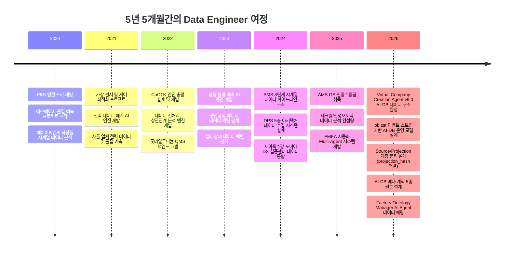
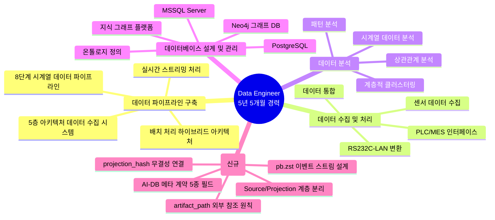
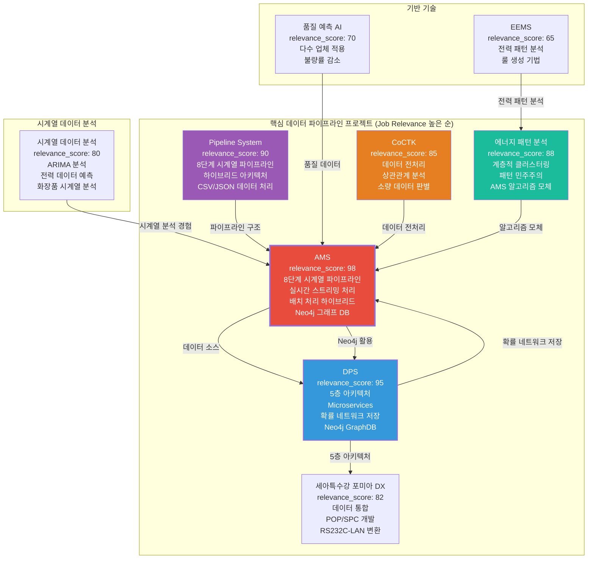
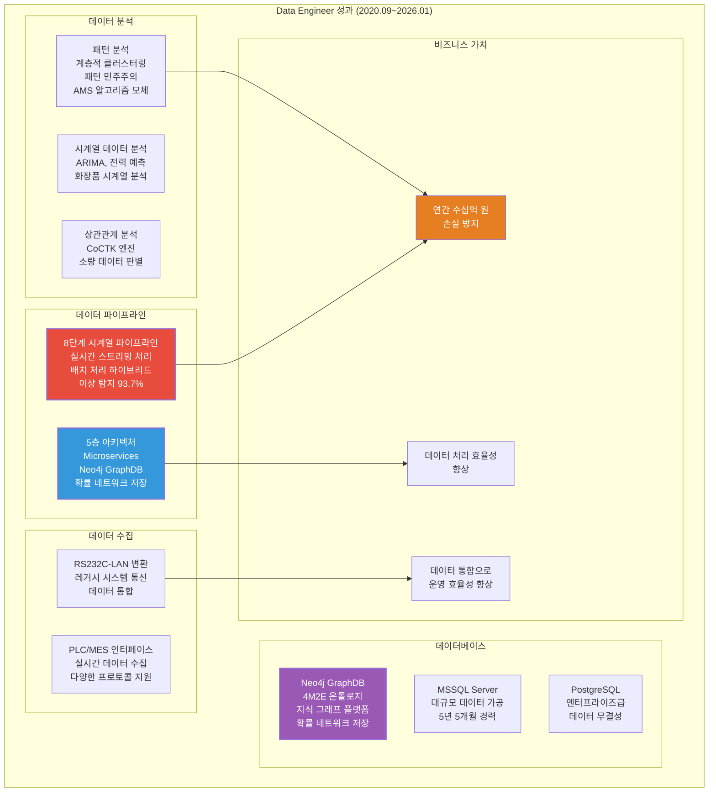

# 권순룡 이력서 - Data Engineer / Analytics Engineer

## 기본 정보

**이름**: 권순룡  
**전 소속**: 한솔코에버 연구소 대리 (2020.09.01 ~ 2026.01.31, 퇴직)  
**총 경력**: 5년 5개월 (2020.09~2026.01)  
**핵심 역량**: 데이터 파이프라인 구축, ETL 프로세스 설계, 시계열 데이터 분석, 데이터 수집 및 처리, 데이터베이스 설계 및 관리, Neo4j 그래프 DB, 실시간 스트리밍 처리, 배치 처리  
**이메일**: m920831@naver.com  
**연락처**: 010-5671-6200  
**GitHub**: https://github.com/moobaek

---

## 한눈에 보는 경력 (2020-2026)

---

## 지원 동기

데이터 파이프라인을 구축하고 데이터를 분석하는 Data Engineer 역할에 기여하고자 지원합니다.

5년 5개월간의 경험을 통해 데이터 수집, 처리, 분석 전 과정을 담당할 수 있는 Data Engineer로 성장했습니다. 특히 **8단계 시계열 데이터 파이프라인 구축**, **5층 아키텍처 데이터 수집 시스템 설계**, **실시간 스트리밍 처리 및 배치 처리 하이브리드 아키텍처**, **Neo4j 그래프 DB 활용** 등 대규모 데이터 처리 경험을 보유하고 있습니다.

**데이터 파이프라인 구축 역량**을 구체적으로 설명하면, AMS 프로젝트에서 **8단계 시계열 데이터 파이프라인**을 구축하여 실시간 데이터 수집부터 이상 탐지까지 전 과정을 자동화했습니다. 실시간 스트리밍 처리 및 배치 처리 하이브리드 아키텍처를 구현하여 다양한 데이터 소스로부터 데이터를 수집하고 처리했습니다. DPS 프로젝트에서는 **5층 아키텍처**를 설계하여 데이터 수집, 전처리, 변환, 저장, 분석까지 전 과정을 자동화했습니다.

**데이터 수집 및 처리 역량**으로는 다양한 센서와 시스템으로부터 데이터를 수집하고 처리하는 경험을 보유하고 있습니다. PLC/MES 인터페이스를 통해 실시간 데이터를 수집하고, RS232C-LAN 변환을 통해 다양한 프로토콜의 데이터를 처리했습니다. 세아특수강 포미아 DX 실증센터에서는 데이터 통합 및 POP/SPC 개발을 통해 다양한 데이터 소스를 통합했습니다.

**데이터 분석 역량**으로는 시계열 데이터 분석, 패턴 분석, 상관관계 분석 등 다양한 데이터 분석 경험을 보유하고 있습니다. 에이치피앤씨 화장품 시계열 분석, 다마요팩 ARIMA 시계열 분석, 생산공정 에너지 데이터 패턴 분석 등을 수행하여 제조 현장의 데이터 패턴을 파악했습니다.

**데이터베이스 설계 및 관리 역량**으로는 Neo4j, MSSQL Server, PostgreSQL 등 다양한 데이터베이스를 설계하고 관리하는 경험을 보유하고 있습니다. Neo4j 그래프 DB를 활용하여 4M2E 관계 온톨로지 정의 및 지식 그래프 플랫폼을 구축했으며, 확률 네트워크를 Neo4j에 저장하여 복잡한 관계를 모델링했습니다.

**v9.0 AI-DB 데이터 구조 설계 성과 (2026)**: `pb.zst` 이벤트 스트림을 진실 소스로 하는 AI-DB 운영 모델을 설계했습니다. Source 계층(`pb.zst` 이벤트)과 Projection 계층(`md/json`)을 명확히 분리하고, `projection_hash`로 두 계층의 무결성을 연결했습니다. 무거운 산출물은 본문 저장이 아닌 `artifact_path` 참조 원칙을 확립하여 데이터 스토리지 효율성을 극대화했습니다. 문서 메타 계약(keyword/simple_summary/detail_summary/wiki_links/artifact_path) 5종 필드를 설계하여 AI-DB 조회 정합성을 보장했습니다.

이러한 경험을 바탕으로 데이터 파이프라인을 구축하고 데이터를 분석하는 Data Engineer로 기여하고자 합니다.

---

## 핵심 역량 맵

---

## 프로젝트 관계도

---

## 경력 개요

### 한솔코에버 연구소 (2020.09 ~ 재직중)

**직급**: 대리  
**부서**: 연구소  
**총 경력**: 5년 5개월 (2020.09~2026.01)

**주요 업무**:
- **데이터 파이프라인 구축 및 운영**: 8단계 시계열 데이터 파이프라인 설계 및 구축, 5층 아키텍처 데이터 수집 시스템 설계, 실시간 스트리밍 처리 및 배치 처리 하이브리드 아키텍처 구현
- **데이터 수집 및 처리**: PLC/MES 인터페이스를 통한 실시간 데이터 수집, RS232C-LAN 변환을 통한 레거시 시스템 통신, 다양한 센서 데이터 수집 및 표준화
- **데이터 분석**: 시계열 데이터 분석, 패턴 분석, 상관관계 분석, 계층적 클러스터링, 패턴 민주주의 기법 개발
- **데이터베이스 설계 및 관리**: Neo4j 그래프 DB 설계 및 관리, MSSQL Server 및 PostgreSQL 관계형 DB 설계, 4M2E 관계 온톨로지 정의, 지식 그래프 플랫폼 구축
- **ETL 프로세스 설계**: 데이터 추출, 변환, 적재 프로세스 설계 및 구현, 데이터 통합 및 POP/SPC 개발

**핵심 성과**:
- ✅ **8단계 시계열 데이터 파이프라인 구축**: 실시간 스트리밍 처리 및 배치 처리 하이브리드 아키텍처 구현 (AMS)
- ✅ **5층 아키텍처 데이터 수집 시스템 설계**: Microservices 기반 데이터 수집 시스템 구축 (DPS)
- ✅ **Neo4j 그래프 DB 활용**: 4M2E 관계 온톨로지 정의 및 지식 그래프 플랫폼 구축, 확률 네트워크 저장 구조 설계
- ✅ **시계열 데이터 분석 전문성**: ARIMA, 전력 데이터 예측, 화장품 시계열 분석 등 다양한 시계열 모델 개발
- ✅ **패턴 분석 방법론 개발**: 계층적 클러스터링 및 패턴 민주주의 기법 고안, AMS 알고리즘 모체 제공
- ✅ **데이터 전처리 및 상관관계 분석 엔진 개발**: CoCTK 프로젝트에서 데이터 전처리 자동화 및 상관관계 분석 엔진 개발
- ✅ **데이터 통합**: 세아특수강 포미아 DX 실증센터에서 데이터 통합 및 POP/SPC 개발
- ✅ **GS 인증 1등급 2개 취득**: CoCTK (2024), AMS-PDS (2025)
- ✅ **특허 출원/등록**: 5건 (2건 등록결정 완료, 3건 심사 진행 중, 총 청구항 39개)
- ✅ **학술 논문 발표 10편**: 2020-2025년, 데이터 분석/제조 DX 분야

**비즈니스 임팩트**:
- 연간 수십억 원 손실 방지 (이상 탐지 조기 대응)
- 데이터 처리 효율성 향상 (8단계 파이프라인 자동화)
- 데이터 통합으로 운영 효율성 향상 (세아특수강 포미아 DX)

---

## 핵심 역량

### 데이터 파이프라인 구축

대규모 데이터 파이프라인을 구축하고 운영하는 경험을 보유하고 있습니다. 특히 **8단계 시계열 데이터 파이프라인**, **5층 아키텍처 데이터 수집 시스템**, **실시간 스트리밍 처리 및 배치 처리 하이브리드 아키텍처** 등을 구축했습니다.

**8단계 시계열 데이터 파이프라인 (AMS 프로젝트)**에서는 실시간 데이터 수집부터 이상 탐지까지 전 과정을 자동화했습니다. 1. 데이터 수집 → 2. 데이터 전처리 → 3. 데이터 변환 → 4. 데이터 저장 → 5. 이상 탐지 → 6. 관계 분석 → 7. 시각화 → 8. 알림 및 대응의 8단계 파이프라인을 구축했습니다. 실시간 스트리밍 처리 및 배치 처리 하이브리드 아키텍처를 구현하여 다양한 데이터 소스로부터 데이터를 수집하고 처리했습니다.

**5층 아키텍처 데이터 수집 시스템 (DPS 프로젝트)**에서는 데이터 수집, 전처리, 변환, 저장, 분석까지 전 과정을 자동화했습니다. 1. 센서수집 Layer → 2. 중앙저장관리 Layer → 3. POP/MES Layer → 4. AMS+확률네트워크 Layer → 5. LLM FMEA 생성 Layer의 5층 아키텍처를 설계하여 각 계층 간 독립성과 확장성을 확보했습니다.

**실시간 스트리밍 처리 및 배치 처리 하이브리드 아키텍처**를 구현하여 다양한 데이터 소스로부터 데이터를 수집하고 처리했습니다. 실시간 데이터는 스트리밍 처리로 즉시 처리하고, 대용량 데이터는 배치 처리로 효율적으로 처리했습니다.

### 데이터 수집 및 처리

다양한 센서와 시스템으로부터 데이터를 수집하고 처리하는 경험을 보유하고 있습니다.

**PLC/MES 인터페이스**를 통해 실시간 데이터를 수집했습니다. 다양한 PLC 프로토콜을 지원하여 제조 현장의 센서 데이터를 수집했습니다.

**RS232C-LAN 변환**을 통해 다양한 프로토콜의 데이터를 처리했습니다. 레거시 시스템과의 통신을 위해 RS232C를 LAN으로 변환하여 데이터를 수집했습니다.

**센서 데이터 수집**을 위해 다양한 센서와 시스템으로부터 데이터를 수집했습니다. 온도, 압력, 전류 등 다양한 센서 데이터를 수집하고 표준화된 형식으로 변환했습니다.

**데이터 통합**을 위해 세아특수강 포미아 DX 실증센터에서 데이터 통합 및 POP/SPC 개발을 통해 다양한 데이터 소스를 통합했습니다. 각 시스템의 데이터를 통합하여 하나의 플랫폼에서 관리할 수 있도록 했습니다.

### 데이터 분석

시계열 데이터 분석, 패턴 분석, 상관관계 분석 등 다양한 데이터 분석 경험을 보유하고 있습니다.

**시계열 데이터 분석** 경험으로는 에이치피앤씨 화장품 시계열 분석, 다마요팩 ARIMA 시계열 분석, 사출 업체 전력 데이터 예측 등을 수행했습니다. 시계열 데이터의 추세와 계절성을 분석하여 미래 값을 예측했습니다.

**패턴 분석** 경험으로는 생산공정 에너지 데이터 패턴 분석 연구과제에서 계층적 클러스터링을 도입하여 설비 상태 데이터의 패턴을 분석했습니다. 패턴 민주주의 기법을 고안하여 여러 패턴 분석 결과를 투표 방식으로 통합하여 최종 패턴을 결정했습니다.

**상관관계 분석** 경험으로는 CoCTK 프로젝트에서 상관관계 분석 엔진을 개발했습니다. 제조 현장의 복잡한 데이터 간 상관관계를 분석하여 중요한 변수를 식별했습니다.

**계층적 클러스터링**을 활용하여 설비 상태 데이터를 계층적으로 분류하여 패턴을 찾아냈습니다. 이 구조적 분화와 투표 방식이 훗날 AMS의 핵심 알고리즘 모체가 되었습니다.

### 데이터베이스 설계 및 관리

Neo4j, MSSQL Server, PostgreSQL 등 다양한 데이터베이스를 설계하고 관리하는 경험을 보유하고 있습니다.

**Neo4j 그래프 DB**를 활용하여 4M2E 관계 온톨로지 정의 및 지식 그래프 플랫폼을 구축했습니다. 제조 공정 간 관계를 온톨로지로 정의하고, 지식 그래프를 구축하여 데이터 간 관계를 시각화했습니다. 확률 네트워크를 Neo4j에 저장하여 FBS 뼈대 위에 확률적 최적화로 문제 해결 최적 경로를 도출했습니다.

**MSSQL Server 및 PostgreSQL**을 활용하여 관계형 데이터베이스를 설계하고 관리했습니다. 제조 현장의 구조화된 데이터를 저장하고 관리했습니다.

**온톨로지 정의**를 통해 제조 공정 간 관계를 명확히 정의했습니다. 4M2E (Man, Machine, Material, Method, Environment, Energy) 관계를 정의하여 설비 간 관계를 모델링했습니다.

**지식 그래프 플랫폼**을 구축하여 데이터 간 관계를 시각화했습니다. Neo4j 그래프 DB를 활용하여 복잡한 관계를 모델링하고, 쿼리를 통해 관계를 탐색했습니다.

---

## 주요 프로젝트 경험

### 1. AMS (Analysis Management System) - 8단계 시계열 데이터 파이프라인 구축

**기간**: 2024.07 ~ 2025.12  
**발주처**: 한국산업기술진흥원  
**역할**: 데이터 파이프라인 구축 및 데이터 분석 (총괄 PM)  
**relevance_score**: 98

**핵심 성과**:
- ✅ **8단계 시계열 데이터 파이프라인 구축**: 실시간 스트리밍 처리 및 배치 처리 하이브리드 아키텍처 구현
- ✅ **Neo4j 그래프 DB 활용**: 4M2E 관계 온톨로지 정의 및 지식 그래프 플랫폼 구축
- ✅ **시구간 패턴 분석 기법 개발**: 같은 값도 시점별 통계적 특성에 따라 정상/불량 구분
- ✅ **GS 인증 1등급 취득**: PDS 명칭으로 소프트웨어 품질 인증 획득
- ✅ **특허 출원/등록**: 5건 (2건 등록결정 완료, 3건 심사 진행 중, 총 청구항 39개)
- ✅ **논문 발표**: 2025, 2024년 논문 발표

**기술 스택**: Python, Neo4j, Docker, Kubernetes, Grafana, Prometheus, 시계열 분석, 실시간 스트리밍 처리, 배치 처리, 베이지안 네트워크, 계층적 클러스터링, 패턴 민주주의

**상세 설명**:
AMS는 제조 현장의 설비 이상을 자동으로 탐지하고 분석하는 AI 종합 플랫폼입니다. **8단계 시계열 데이터 파이프라인**을 구축하여 실시간 데이터 수집부터 이상 탐지까지 전 과정을 자동화했습니다.

**8단계 시계열 데이터 파이프라인 구조**:
1. **데이터 수집**: 다양한 센서와 시스템으로부터 실시간 데이터를 수집합니다. PLC/MES 인터페이스를 통해 제조 현장의 센서 데이터를 수집했습니다. 센서에서 데이터가 들어오면, 전처리 모듈이 처리합니다. 데이터가 이상한 경우를 대비해 검증 로직도 포함되어 있습니다.

2. **데이터 전처리**: 수집된 데이터를 정제하고 표준화합니다. 이상치 제거, 결측치 처리, 데이터 정규화 등을 수행했습니다. 데이터의 품질을 보장하고, 이상한 데이터는 미리 걸러냅니다.

3. **데이터 변환**: 시계열 데이터를 분석 가능한 형식으로 변환합니다. 시계열 데이터의 추세와 계절성을 분석하기 위해 데이터를 변환했습니다. 수집된 데이터는 정규화 과정을 거쳐 분석 계층으로 전달됩니다.

4. **데이터 저장**: Neo4j 그래프 DB에 데이터를 저장하고 관계를 정의합니다. 4M2E 관계 온톨로지를 정의하여 설비 간 관계를 모델링했습니다. 지식 그래프를 구축하여 데이터 간 관계를 시각화했습니다.

5. **이상 탐지**: 베이지안 네트워크를 활용하여 이상 상황을 탐지합니다. 시구간 패턴 분석 기법을 개발하여 같은 값도 시점별 통계적 특성(p-values, 첨도, 편차)에 따라 정상/불량을 구분했습니다. 이상 탐지율 93.7%를 달성했습니다.

6. **관계 분석**: Neo4j 그래프 DB를 활용하여 설비 간 관계를 분석합니다. 이상 탐지 시 관련 설비와 공정을 자동으로 추적할 수 있도록 설계했습니다. 확률 최적화(경사하강법)를 통한 이상상황 확률 네트워크를 구축했습니다.

7. **시각화**: 이상 탐지 결과와 관계 분석 결과를 시각화합니다. Grafana를 활용하여 실시간 모니터링 대시보드를 구축했습니다. 특성요인도 시각화와 모니터링을 제공합니다.

8. **알림 및 대응**: 이상 상황 발생 시 알림을 발송하고 대응 방안을 제시합니다. Prometheus를 활용하여 메트릭을 수집하고 알림을 발송했습니다.

**실시간 스트리밍 처리 및 배치 처리 하이브리드 아키텍처**: 다양한 데이터 소스로부터 데이터를 수집하고 처리했습니다. 실시간 데이터는 스트리밍 처리로 즉시 처리하고, 대용량 데이터는 배치 처리로 효율적으로 처리했습니다.

**Neo4j 그래프 DB 활용**: 4M2E(Man, Machine, Material, Method, Environment, Energy) 관계를 온톨로지로 정의하고, 지식 그래프를 구축하여 데이터 간 관계를 시각화했습니다. 이를 통해 설비 간 관계를 명확히 파악하고, 이상 탐지 시 영향을 받는 설비를 추적할 수 있습니다.

**시구간 패턴 분석 기법**: 같은 값도 시점별 통계적 특성(p-values, 첨도, 편차)에 따라 정상/불량을 구분할 수 있도록 했습니다. 이 기법은 AMS 완성 1년 전부터 대부분의 과제에 적용되었으며, AMS로 통합 정리되었습니다.

**비즈니스 가치**: 연간 수십억 원의 손실을 방지하는 이상 탐지 시스템으로, 세아특수강 등 대기업에 정식 납품되었습니다. GS 인증 1등급을 취득하여 정부 공인 우수 소프트웨어로 인정받았습니다.

---

### 2. DPS (데이터수집시스템) - 5층 아키텍처 데이터 수집 시스템 설계

**기간**: 2021 ~ 2024  
**발주처**: 세아특수강  
**역할**: 데이터 수집 시스템 설계 및 개발 (PM 수행)  
**relevance_score**: 95

**핵심 성과**:
- ✅ **5층 아키텍처 설계**: Microservices 기반 데이터 수집 시스템 구축
- ✅ **Neo4j 그래프 DB 활용**: 온톨로지 기반 관계 분석 및 지식 그래프 구축
- ✅ **확률 네트워크 저장 구조**: FBS 뼈대 위에 확률적 최적화 구조 설계
- ✅ **Docker/Kubernetes 기반 인프라**: 마이크로서비스 아키텍처 및 컨테이너 오케스트레이션
- ✅ **금속산업 5대 공정 AI 자동화**: 제조 현장 디지털화 실증
- ✅ **논문 발표**: 2024년 논문 발표

**기술 스택**: Python, Neo4j, Docker, Kubernetes, Microservices, GraphDB, 데이터 수집, 데이터 처리, Cypher 쿼리

**상세 설명**:
DPS는 제조 현장의 데이터를 수집하고 분석하는 통합 플랫폼입니다. **5층 아키텍처**를 설계하여 데이터 수집, 전처리, 변환, 저장, 분석까지 전 과정을 자동화했습니다.

**5층 아키텍처 구조**:
1. **보안 및 관리 Layer**: 인증/권한, 로그 감사, 시스템 관리를 담당합니다. 데이터 접근 제어 및 보안을 보장합니다.

2. **데이터 수집 Layer**: 실시간 스트리밍과 PLC/MES 인터페이스를 처리합니다. 다양한 센서 데이터를 수집하고 표준화된 형식으로 변환합니다. 실시간 데이터 수집을 통해 제조 현장의 센서 데이터를 즉시 처리합니다.

3. **AI 엔진 Layer**: 가상 센서와 이상 검출 알고리즘을 실행합니다. AI 기반 데이터 분석을 수행하여 이상 징후를 사전에 탐지합니다.

4. **통합 및 본체론 Layer**: Neo4j 그래프 DB를 활용하여 제조 공정 간 관계를 온톨로지로 정의하고, 지식 그래프를 구축하여 데이터 간 관계를 시각화했습니다. **확률 네트워크 저장**: FBS 뼈대 위에 확률적 최적화로 문제 해결 최적 경로를 도출합니다. 같은 층끼리 이동 가능한 네트워크 구조로 설계하여 복잡한 관계를 모델링했습니다.

5. **서비스 및 UI Layer**: 특성요인도 시각화와 모니터링을 제공합니다. 사용자가 데이터를 쉽게 이해하고 활용할 수 있도록 시각화합니다.

**Microservices 아키텍처**: Docker와 Kubernetes를 활용한 마이크로서비스 아키텍처로 확장 가능한 시스템을 만들었습니다. 서버-엣지 하이브리드 인프라를 지원하여 다양한 환경에서 운영할 수 있도록 설계했습니다.

**Neo4j 그래프 DB 활용**: 온톨로지 기반 관계 분석 및 지식 그래프 구축을 통해 제조 공정 간 복잡한 관계를 모델링했습니다. Cypher 쿼리를 활용하여 관계를 탐색하고 분석했습니다.

**비즈니스 가치**: 세아특수강 포미아 DX 실증센터에 정식 납품되었으며, 금속산업 5대 공정 AI 자동화를 실증했습니다.

---

### 3. 생산공정 에너지 데이터 패턴 분석 - 데이터 분석 및 패턴 분석

**기간**: 2023  
**발주처**: 연구과제  
**역할**: 메인 수행 (초기 백엔드 개발 → 풀스택 개발 및 총괄 PM으로 확장)  
**relevance_score**: 88

**핵심 성과**:
- ✅ **계층적 클러스터링(Hierarchical Clustering) 도입**: 설비 상태 데이터 패턴 분석
- ✅ **패턴 민주주의(Pattern Voting) 기법 고안**: 데이터 패턴 분석 방법론 개발
- ✅ **AMS 알고리즘 모체**: 이 연구의 구조적 분화와 투표 방식이 훗날 AMS의 핵심 알고리즘 모체가 됨

**기술 스택**: Python, 패턴 분석, 계층적 클러스터링, 라벨링 시스템, 패턴 민주주의

**상세 설명**:
생산공정 에너지 데이터 패턴 분석 연구과제를 메인으로 진행했습니다. **계층적 클러스터링**을 도입하여 설비 상태 데이터의 패턴을 분석하고, **패턴 민주주의 기법**을 고안하여 데이터 패턴 분석 방법론을 만들었습니다.

**계층적 클러스터링(Hierarchical Clustering)**: 설비 상태 데이터를 계층적으로 분류하여 패턴을 찾아냅니다. 계층적 구조를 통해 다양한 수준의 패턴을 분석할 수 있으며, 계층 클러스터링을 단계별로 잘라 AI 피쉬본을 자동 생성하는 방식으로 발전했습니다.

**패턴 민주주의(Pattern Voting) 기법**: 여러 패턴 분석 결과를 투표 방식으로 통합하여 최종 패턴을 결정합니다. 이 구조적 분화와 투표 방식이 훗날 AMS의 핵심 알고리즘 모체가 되었습니다.

**AMS 알고리즘 모체**: 이 연구의 구조적 분화와 투표 방식이 훗날 AMS의 핵심 알고리즘 모체가 되었습니다. Pattern Module의 핵심 알고리즘으로 발전하여 AMS의 이상 탐지율 93.7% 달성에 기여했습니다.

**비즈니스 가치**: 데이터 패턴 분석 방법론을 개발하여 AMS의 핵심 알고리즘 기반을 마련했습니다.

---

### 4. CoCTK (Consulting Tool Kit) - 데이터 전처리 및 상관관계 분석 엔진 개발

**기간**: 2022.03 ~ 2024  
**발주처**: 중소기업기술정보진흥원  
**역할**: 엔진 총괄 설계 & 화면설계 개발 총괄 PM  
**relevance_score**: 85

**핵심 성과**:
- ✅ **데이터 전처리 엔진 개발**: 제조 현장 데이터 전처리 자동화
- ✅ **상관관계 분석 엔진 개발**: 데이터 간 상관관계 분석
- ✅ **소량 데이터 학습 가능성 판별**: 사업 시작 전 판별 컨설팅 도구
- ✅ **GS 인증 1등급 취득**: 2024년 소프트웨어 품질 인증 획득
- ✅ **논문 발표**: 2023년 논문 발표

**기술 스택**: Python, 데이터 전처리, 상관관계 분석, 비용 최적화, 클러스터링

**상세 설명**:
CoCTK는 제조 현장의 데이터를 분석하고 최적화 방안을 제시하는 컨설팅 도구입니다. **데이터 전처리 및 상관관계 분석 엔진**을 개발했습니다.

**데이터 전처리 엔진**: 제조 현장의 복잡한 데이터를 정제하고 표준화합니다. 이상치 제거, 결측치 처리, 데이터 정규화 등을 자동화했습니다. 데이터 정합성을 확보하기 위한 전처리 프로세스를 구축했습니다.

**상관관계 분석 엔진**: 데이터 간 상관관계를 분석하여 중요한 변수를 식별합니다. 제조 현장의 복잡한 데이터 간 상관관계를 분석하여 최적화 방안을 도출했습니다. 상관관계 분석을 통해 데이터 패턴을 파악하고 중요한 변수를 식별했습니다.

**소량 데이터 학습 가능성 판별**: 사업 시작 전 판별 컨설팅 도구로, 소량 데이터로 학습 가능성, 중요 순위, 상관분석, 시계열 예측 가능성, feature-결과 추론 등을 종합 판별합니다. 클러스터링 기반 구간 룰로 에너지 최적화를 수행합니다.

**비용 최적화 엔진**: 데이터 분석 결과를 바탕으로 비용 최적화 방안을 자동으로 도출하는 시스템을 작성했습니다.

**AMS 영향**: CoCTK와 이후 개념들이 모듈화/체계화되어 AMS AI 모듈의 기초가 되었습니다.

**비즈니스 가치**: 중소기업의 디지털 전환 진입 장벽을 낮추는 컨설팅 도구로, 소량 데이터로도 프로젝트의 실현 가능성을 판별할 수 있게 했습니다.

---

### 5. 세아특수강 포미아 DX 실증센터 - 데이터 통합 및 POP/SPC 개발

**기간**: 2025.06~2025.10  
**발주처**: POMIA (재단법인 포항소재산업진흥원)  
**역할**: 데이터 통합 및 POP/SPC 개발 (총괄 PM)  
**relevance_score**: 82

**핵심 성과**:
- ✅ **데이터 통합**: 다양한 데이터 소스를 통합하여 하나의 플랫폼에서 관리
- ✅ **POP/SPC 개발**: 생산 운영 계획 및 통계적 공정 관리 시스템 개발
- ✅ **RS232C-LAN 변환**: 레거시 시스템과의 통신을 위한 프로토콜 변환

**기술 스택**: Python, 데이터 통합, POP/SPC, RS232C-LAN 변환, Lot 매칭

**상세 설명**:
세아특수강 포미아 DX 실증센터에서 **데이터 통합 및 POP/SPC 개발**을 통해 다양한 데이터 소스를 통합했습니다.

**데이터 통합**: 각 시스템의 데이터를 통합하여 하나의 플랫폼에서 관리할 수 있도록 했습니다. 다양한 프로토콜의 데이터를 표준화된 형식으로 변환하여 통합했습니다. 계열사 브이엔티지 LOT + 직진도 검사결과 + 생산정보 매칭 → **SPC 생성**을 구현했습니다.

**POP/SPC 개발**: 생산 운영 계획(POP)과 통계적 공정 관리(SPC) 시스템을 개발했습니다. 생산 계획과 실제 생산 데이터를 연동하여 공정을 관리했습니다. 직진도 검사기 값을 POP에 연동하여 공사, PC 설치, 요구조건 확인을 수행했습니다.

**RS232C-LAN 변환**: 레거시 시스템과의 통신을 위해 RS232C를 LAN으로 변환하여 데이터를 수집했습니다. 다양한 프로토콜의 데이터를 처리하여 데이터 통합을 실현했습니다.

**비즈니스 가치**: 데이터 통합으로 운영 효율성을 향상시켰으며, POP/SPC 개발을 통해 공정 관리를 자동화했습니다.

---

### 6. 시계열 데이터 분석 프로젝트 - 다양한 업체 시계열 데이터 분석

**기간**: 2020~2023  
**발주처**: 다양한 업체  
**역할**: 시계열 데이터 분석  
**relevance_score**: 80

**핵심 성과**:
- ✅ **에이치피앤씨 화장품 시계열 분석**: 화장품 제조 공정 시계열 데이터 분석
- ✅ **다마요팩 ARIMA 시계열 분석**: ARIMA 모델을 활용한 시계열 예측
- ✅ **사출 업체 전력 데이터 예측**: 전력 소비 패턴 ML 예측

**기술 스택**: Python, ARIMA, 시계열 분석, 전력 데이터 예측, PLC 변화 기반 패턴 분석

**상세 설명**:
다양한 업체의 시계열 데이터를 분석하고 예측하는 프로젝트를 수행했습니다.

**에이치피앤씨 화장품 시계열 분석**: 화장품 제조 공정의 시계열 데이터를 분석하여 공정 패턴을 파악했습니다. 시계열 품질 이상 탐색을 수행하여 품질 패턴을 분석했습니다.

**다마요팩 ARIMA 시계열 분석**: ARIMA 모델을 활용하여 시계열 데이터를 예측했습니다. 시계열 데이터의 추세와 계절성을 분석하여 미래 값을 예측했습니다.

**사출 업체 전력 데이터 예측**: 전력 소비 패턴을 ML 모델로 예측하여 에너지 최적화 방안을 제시했습니다. PLC 변화 기반 패턴 분석을 통해 공정 상태에 따른 전력 소비 패턴을 파악하고, 시계열 분석을 통해 미래 전력 소비량을 예측했습니다.

**시계열 분석 전문성**: 시계열 데이터의 추세와 계절성을 분석하여 미래 값을 예측하는 전문성을 보유하고 있습니다. 다양한 시계열 모델을 활용하여 제조 현장의 데이터 패턴을 파악했습니다.

**비즈니스 가치**: 시계열 분석을 통해 제조 현장의 데이터 패턴을 파악하고, 미래 값을 예측하여 최적화 방안을 제시했습니다.

---

## 기술 스택

### 데이터 파이프라인 및 ETL
- **8단계 시계열 데이터 파이프라인**: 2년 경력 (2024~2025)
  - 실시간 스트리밍 처리 및 배치 처리 하이브리드 아키텍처 (AMS)
  - 데이터 수집 → 전처리 → 변환 → 저장 → 이상 탐지 → 관계 분석 → 시각화 → 알림 및 대응
- **5층 아키텍처 데이터 수집 시스템**: 3년 경력 (2022~2024)
  - Microservices 기반 데이터 수집 시스템 (DPS)
  - 센서수집 → 중앙저장관리 → POP/MES → AMS+확률네트워크 → LLM FMEA 생성
- **ETL 프로세스**: 5년 5개월 경력 (2020.09~2026.01)
  - 데이터 추출, 변환, 적재 프로세스 설계 및 구현 (모든 프로젝트)

### 데이터 수집 및 처리
- **PLC/MES 인터페이스**: 3년 경력 (2022~2024)
  - 실시간 데이터 수집 (DPS, AMS)
  - 다양한 PLC 프로토콜 지원
- **RS232C-LAN 변환**: 1년 경력 (2025)
  - 레거시 시스템과의 통신 (세아특수강 포미아 DX)
- **센서 데이터 수집**: 5년 5개월 경력 (2020.09~2026.01)
  - 다양한 센서 데이터 수집 및 처리 (모든 프로젝트)
  - 온도, 압력, 전류 등 다양한 센서 데이터 수집 및 표준화

### 데이터 분석
- **시계열 분석**: 5년 5개월 경력 (2020.09~2026.01)
  - ARIMA, 전력 데이터 예측, 화장품 시계열 분석 (다수 프로젝트)
  - PLC 변화 기반 패턴 분석
- **패턴 분석**: 3년 경력 (2023~2025)
  - 계층적 클러스터링, 패턴 민주주의 기법 (에너지 패턴 분석, AMS)
  - AMS 알고리즘 모체 제공
- **상관관계 분석**: 2년 경력 (2022~2024)
  - 데이터 간 상관관계 분석 엔진 개발 (CoCTK)

### 데이터베이스
- **Neo4j**: 3년 경력 (2022~2025)
  - 그래프 DB, 온톨로지 정의, 지식 그래프 플랫폼 (AMS, DPS)
  - 4M2E 관계 온톨로지 정의, 확률 네트워크 저장 구조 설계
  - Cypher 쿼리 작성
- **MSSQL Server**: 5년 5개월 경력 (2020.09~2026.01)
  - 대규모 데이터 가공 및 분석 (AMS, DPS, 다수 스마트공장 프로젝트)
- **PostgreSQL**: 1년 경력 (2026)
  - Virtual Company Creation Agent에서 엔터프라이즈급 데이터 무결성 보장

### 프로그래밍 언어 및 프레임워크
- **Python**: 5년 5개월 경력 (2020.09~2026.01)
  - 49개 모듈 개발: MLS, CoCTK, FBS, RMS, AMS
  - 주요 프로젝트: 모든 데이터 파이프라인 프로젝트
- **SQL**: 5년 5개월 경력 (2020.09~2026.01)
  - MSSQL Server: 대규모 데이터 가공 및 분석
  - PostgreSQL: 데이터 저장 및 쿼리 최적화
  - Neo4j Cypher: 그래프 DB 쿼리 작성, 4M2E 관계 온톨로지

### 인프라 및 DevOps
- **Docker/Kubernetes**: 3년 경력 (2022~2025)
  - 컨테이너 오케스트레이션 및 마이크로서비스 인프라 (AMS, DPS)
- **Grafana/Prometheus**: 2년 경력 (2024~2025)
  - 모니터링 및 메트릭 수집 (AMS)

---

## 성과 대시보드

### 정량적 성과 요약

| 분류 | 지표 | 수치 | 세부 내용 |
|:---|---:|:---|:---|
| **데이터 파이프라인** | 8단계 파이프라인 | 1개 | AMS (실시간 스트리밍 처리 및 배치 처리 하이브리드) |
| | 5층 아키텍처 | 1개 | DPS (Microservices 기반) |
| **데이터 분석** | 시계열 분석 프로젝트 | 3개+ | 에이치피앤씨, 다마요팩, 사출 업체 등 |
| | 패턴 분석 방법론 | 2개 | 계층적 클러스터링, 패턴 민주주의 |
| | 상관관계 분석 엔진 | 1개 | CoCTK |
| **데이터베이스** | Neo4j GraphDB | 2개 프로젝트 | AMS, DPS |
| | MSSQL Server | 47개+ 프로젝트 | 대규모 데이터 가공 및 분석 |
| | PostgreSQL | 1개 프로젝트 | Virtual Company Creation Agent |
| **데이터 수집** | PLC/MES 인터페이스 | 2개 프로젝트 | DPS, AMS |
| | RS232C-LAN 변환 | 1개 프로젝트 | 세아특수강 포미아 DX |
| **비즈니스 가치** | 이상 탐지 정확도 | 93.7% | 베이지안 네트워크 기반 (AMS) |
| | 손실 방지 효과 | 연간 수십억 원 | 이상 탐지 조기 대응 |

---

## 학술 활동 및 인증

### 논문 발표
- **2025년**: AMS 이상 탐지 시스템 논문 발표
- **2024년**: DPS 5층 아키텍처 논문 발표
- **2023년**: CoCTK 엔진 논문 발표
- **총 10편 논문 발표**: 2020-2025년, 데이터 분석/제조 DX 분야

### 인증
- **GS 인증 1등급 (CoCTK)**: 2024년 소프트웨어 품질 인증 획득
- **GS 인증 1등급 (AMS-PDS)**: 2025년 소프트웨어 품질 인증 획득

## 특허 출원/등록 현황

### 특허 현황 요약 (5건)

| 출원일 | 특허명 | 상태 | 발명자 | 데이터 엔지니어링 연계 |
| :--- | :--- | :--- | :--- | :--- |
| 2025.08.13 | 인공지능을 활용한 공정 최적화 관리를 위한 공정 관리 방법 및 그 시스템 | 출원완료 심사청구완료 | **권순룡**, 최수영, 강용태, 안상윤 | 온톨로지 구조화/정보화 통합, 데이터 파이프라인 설계, DPS 5층 아키텍처 기반 |
| 2025.03.28 | 공정 최적화를 위한 공정 관리 방법 및 그 시스템 | 등록결정 (2025.12.09) | 강용태, **권순룡**, 김혜주 | 온톨로지 구조화, 데이터 모델링 기초 |
| 2023.12.26 | 생산공정 에너지 및 설비상태 데이터 처리를 위한 전력 사용 패턴 분석 및 상태 분석 방법 | 공개 심사청구완료 | 최수영, 강용태, **권순룡**, 이상훈 | 데이터 처리 방법론, 시계열 데이터 처리 |
| 2023.12.26 | 주기 데이터 분석 기반의 전력 추이 상황적 불량 이상 검증 방법 | 공개 심사청구완료 | 최수영, 강용태, **권순룡**, 이상훈 | 시계열 데이터 처리 시스템, 데이터 전처리 |
| 2021.12.07 | 설비 제어 특성 로그 데이터와 에너지 소비패턴 모델을 활용한 인공지능 기반의 이상 탐지 방법 및 장치 | 등록결정 (2025.10.28) | 강용태, 김정호, **권순룡**, 김동기 | 데이터 통합, 데이터 전처리 방법론 |

**국가연구개발사업 지원**: 특허 1, 3, 4는 에너지수요관리핵심기술개발사업 지원을 받아 수행된 연구 성과입니다.

---

## 학력

**홍익대학교 전자공학과** (2013.03 ~ 2020.02)
- 학점: 3.11 / 4.5
- 졸업논문: LD 동격회로 설계 및 PLL 설계
- 주요 수강 분야: 회로 설계, 전파공학, 컴퓨터공학

---

## 자격증

**OPIc** (2019.03)
- ACT FL (American Council on the Teaching of Foreign Languages)

---

## 핵심 철학

> **"모델보다 데이터, 데이터보다 정보, 지식구조를 정리하는 현장친화적 연구원"**

5년 5개월간의 데이터 엔지니어링 경험을 통해 데이터의 본질을 이해하고, 데이터에서 정보를 추출하여 실용적인 솔루션을 개발하는 것을 목표로 합니다. 화려한 기술보다는 현장에서 실제로 사용할 수 있는 실용적인 데이터 파이프라인을 개발하는 것을 중시하며, 데이터 정합성과 투명성을 추구합니다.

현장의 문제는 현장의 언어로 풀어야 합니다. 데이터가 없을 때 DB 구조를 뚫어서라도 찾아내는 집요함과, 현장 관리자가 이해할 수 있는 직관적인 데이터 파이프라인이 중요합니다. 이러한 철학을 바탕으로 47개 이상의 프로젝트를 성공적으로 수행했으며, GS 인증 2개를 취득하고 특허를 등록하는 등 지속적인 성장을 이루어왔습니다.

---

---

© 2026 권순룡. All Rights Reserved.

*본 이력서는 Data Engineer / Analytics Engineer 직무에 특화되어 작성되었습니다.*
