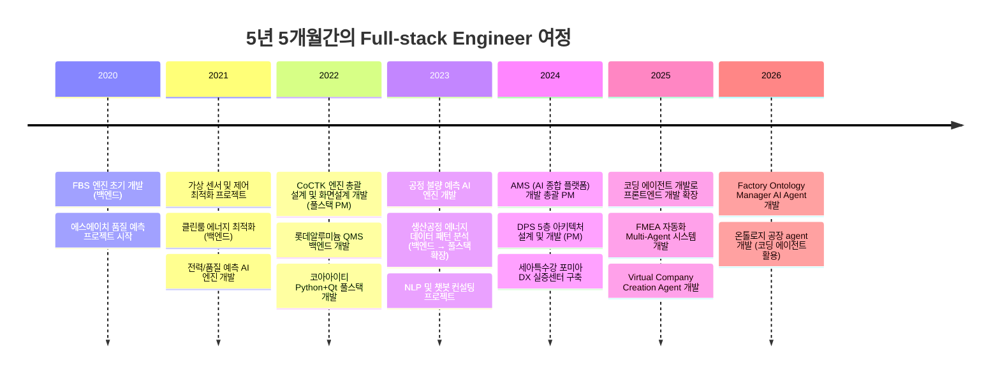
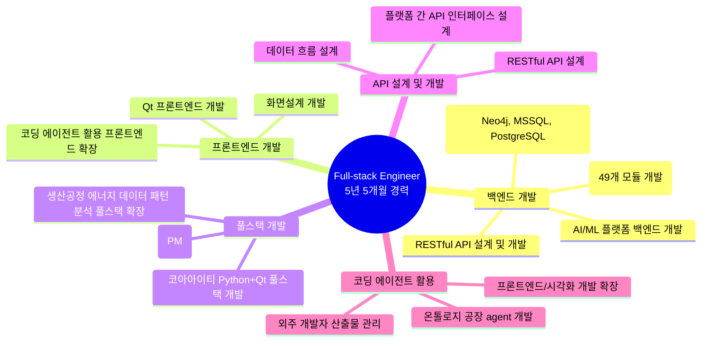
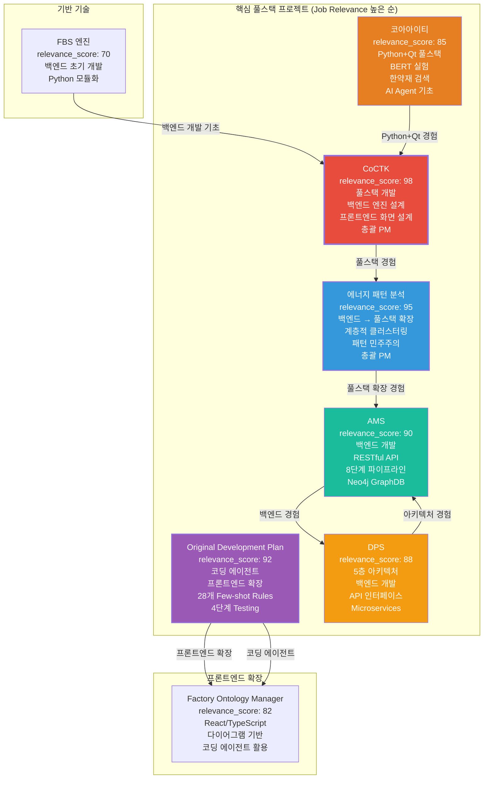
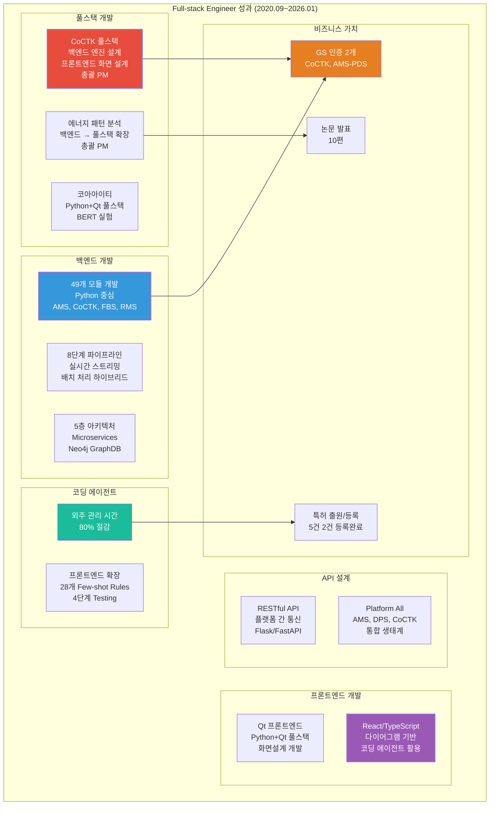

# 권순룡 이력서 - Full-stack Engineer (AI/ML 플랫폼)

## 기본 정보

**이름**: 권순룡  
**현 소속**: 한솔코에버 연구소 대리 (2020.09 ~ 재직중)  
**총 경력**: 5년 5개월 (2020.09~2026.01)  
**핵심 역량**: Python 백엔드 개발, Qt 프론트엔드 개발, 풀스택 개발, API 설계 및 개발, AI/ML 플랫폼 개발, 코딩 에이전트 활용 프론트엔드 개발 확장  
**이메일**: m920831@naver.com  
**연락처**: 010-5671-6200  
**GitHub**: https://github.com/moobaek

---

## 한눈에 보는 경력 (2020-2026)

---

## 지원 동기

AI/ML 플랫폼을 개발하는 Full-stack Engineer 역할에 기여하고자 지원합니다.

5년 5개월간의 경험을 통해 백엔드와 프론트엔드를 모두 개발할 수 있는 Full-stack Engineer로 성장했습니다. 특히 **Python 백엔드 개발**, **Qt 프론트엔드 개발**, **풀스택 개발**, **API 설계 및 개발** 등 AI/ML 플랫폼 개발에 필요한 전반적인 역량을 보유하고 있습니다.

**백엔드 개발 역량**을 구체적으로 설명하면, Python을 중심으로 49개 모듈을 개발했습니다. AMS, CoCTK, FBS, RMS 등 다양한 AI/ML 플랫폼의 백엔드를 개발했으며, Neo4j, MSSQL Server, PostgreSQL 등 다양한 데이터베이스를 활용한 백엔드 시스템을 구축했습니다. RESTful API를 설계하고 개발하여 프론트엔드와 백엔드 간 통신을 구현했습니다.

**프론트엔드 개발 역량**으로는 Qt를 활용한 프론트엔드 개발 경험을 보유하고 있습니다. CoCTK 프로젝트에서 화면설계 개발 총괄 PM을 담당했으며, 코아아이티에서 Python+Qt 풀스택 개발 경험을 쌓았습니다. 초기에는 백엔드 AI 개발만 가능했지만, 코딩 에이전트를 개발하여 프론트엔드/시각화 부분도 개발 가능하게 되었습니다.

**풀스택 개발 역량**으로는 CoCTK 프로젝트에서 엔진 총괄 설계 및 화면설계 개발 총괄 PM을 담당했습니다. 생산공정 에너지 데이터 패턴 분석 프로젝트에서는 초기 백엔드 개발에서 시작하여 풀스택 개발 및 총괄 PM으로 확장했습니다. 코아아이티에서 Python+Qt 풀스택 개발 경험을 쌓아 AI Agent 설계 및 개발의 기초가 되었습니다.

**코딩 에이전트 활용**으로는 외주 개발자 산출물 관리 문제를 해결하기 위해 코딩 에이전트를 개발했습니다. 백엔드 AI 개발자였지만 코딩 툴을 만들어서 말도 안 되는 시간에 말도 안 되는 개발 개수를 성공적으로 완료했습니다. 이를 통해 온톨로지 공장 agent 개발도 가능해졌으며, 프론트엔드/시각화 부분도 개발할 수 있게 되었습니다.

이러한 경험을 바탕으로 AI/ML 플랫폼을 개발하는 Full-stack Engineer로 기여하고자 합니다.

---

## 핵심 역량 맵

---

## 프로젝트 관계도

---

## 경력 개요

### 한솔코에버 연구소 (2020.09 ~ 재직중)

**직급**: 대리  
**부서**: 연구소  
**총 경력**: 5년 5개월 (2020.09~2026.01)

**주요 업무**:
- **풀스택 개발**: 백엔드와 프론트엔드를 모두 개발할 수 있는 풀스택 개발 역량 보유, CoCTK 프로젝트에서 엔진 총괄 설계 및 화면설계 개발 총괄 PM 담당
- **백엔드 개발**: Python을 중심으로 49개 모듈 개발 (AMS, CoCTK, FBS, RMS 등), RESTful API 설계 및 개발, Neo4j, MSSQL Server, PostgreSQL 등 다양한 데이터베이스 활용
- **프론트엔드 개발**: Qt 프론트엔드 개발, 코딩 에이전트를 활용하여 프론트엔드/시각화 개발 역량 확장, Factory Ontology Manager AI Agent에서 React/TypeScript 기반 다이어그램 시스템 개발
- **API 설계 및 개발**: 플랫폼 간 통신을 위한 RESTful API 설계, 데이터 흐름 설계, Platform All 프로젝트에서 AMS, DPS, CoCTK 등 다양한 플랫폼 통합
- **코딩 에이전트 활용**: 외주 개발자 산출물 관리 문제 해결, 프론트엔드/시각화 개발 확장, 온톨로지 공장 agent 개발

**핵심 성과**:
- ✅ **풀스택 개발**: CoCTK 프로젝트에서 백엔드 엔진 설계와 프론트엔드 화면 설계를 모두 담당하여 풀스택 개발 완료
- ✅ **백엔드에서 풀스택으로 확장**: 생산공정 에너지 데이터 패턴 분석 프로젝트에서 초기 백엔드 개발에서 시작하여 풀스택 개발 및 총괄 PM으로 확장
- ✅ **코딩 에이전트 개발**: 외주 개발자 산출물 관리 문제 해결, 프론트엔드/시각화 개발 역량 확장, 28개 Few-shot Rules System 및 4단계 Testing Workflow 설계
- ✅ **49개 모듈 개발**: Python을 중심으로 AMS, CoCTK, FBS, RMS 등 다양한 AI/ML 플랫폼의 백엔드 개발
- ✅ **8단계 시계열 데이터 파이프라인 구축**: 실시간 스트리밍 처리 및 배치 처리 하이브리드 아키텍처 구현 (AMS)
- ✅ **5층 아키텍처 설계**: Microservices 기반 데이터 수집 시스템 구축 (DPS)
- ✅ **RESTful API 설계**: 플랫폼 간 통신을 위한 API 설계 및 개발, Platform All 프로젝트에서 다양한 플랫폼 통합
- ✅ **GS 인증 1등급 2개 취득**: CoCTK (2024), AMS-PDS (2025)
- ✅ **특허 출원/등록**: 5건 (2건 등록결정 완료, 3건 심사 진행 중, 총 청구항 39개)
- ✅ **학술 논문 발표 10편**: 2020-2025년, 풀스택 개발/AI 플랫폼 분야

**비즈니스 임팩트**:
- 외주 개발자 관리 시간 80% 이상 절감 (코딩 에이전트 활용)
- 풀스택 개발로 프로젝트 일정 단축 및 품질 향상
- 플랫폼 통합으로 운영 효율성 향상 (Platform All)

---

## 핵심 역량

### 백엔드 개발 (Python 중심)

Python을 중심으로 다양한 AI/ML 플랫폼의 백엔드를 개발하는 경험을 보유하고 있습니다. 49개 모듈을 개발했으며, AMS, CoCTK, FBS, RMS 등 다양한 플랫폼의 백엔드를 구축했습니다.

**Python 백엔드 개발** 경험으로는 5년 5개월간 Python을 활용하여 다양한 모듈을 개발했습니다. AMS (Analysis Management System), CoCTK (Consulting Tool Kit), FBS (Fishbone Structure), RMS 등 다양한 AI/ML 플랫폼의 백엔드를 개발했으며, 각 플랫폼의 핵심 로직과 비즈니스 로직을 구현했습니다.

**데이터베이스 설계 및 개발** 경험으로는 Neo4j, MSSQL Server, PostgreSQL 등 다양한 데이터베이스를 활용한 백엔드 시스템을 구축했습니다. Neo4j 그래프 DB를 활용하여 4M2E 관계 온톨로지 정의 및 지식 그래프 플랫폼을 구축했으며, MSSQL Server와 PostgreSQL을 활용하여 관계형 데이터베이스를 설계하고 개발했습니다.

**RESTful API 설계 및 개발** 경험으로는 플랫폼 간 통신을 위한 RESTful API를 설계하고 개발했습니다. 각 플랫폼의 독립성을 유지하면서도 통합된 생태계로 동작하도록 API 인터페이스를 설계했으며, 데이터 흐름과 API 인터페이스를 설계하여 플랫폼 간 통신을 구현했습니다.

**AI/ML 플랫폼 백엔드 개발** 경험으로는 베이지안 네트워크, 시계열 분석, 클러스터링 등 다양한 ML 알고리즘을 백엔드에 통합했습니다. 8단계 시계열 데이터 파이프라인을 구축하여 실시간 데이터 수집부터 이상 탐지까지 전 과정을 자동화했으며, 베이지안 네트워크 기반 이상 탐지 모델을 백엔드에 통합했습니다.

### 프론트엔드 개발 (Qt 중심)

Qt를 활용한 프론트엔드 개발 경험을 보유하고 있으며, 코딩 에이전트를 활용하여 프론트엔드 개발 역량을 확장했습니다.

**Qt 프론트엔드 개발** 경험으로는 코아아이티에서 Python+Qt 풀스택 개발 경험을 쌓았습니다. Qt를 활용하여 사용자 인터페이스를 개발했으며, 백엔드와의 통신을 구현했습니다.

**화면설계 개발** 경험으로는 CoCTK 프로젝트에서 화면설계 개발 총괄 PM을 담당했습니다. 사용자 경험을 고려한 화면 설계를 진행했으며, 백엔드와의 연동을 구현했습니다.

**코딩 에이전트 활용 프론트엔드 확장** 경험으로는 초기에는 백엔드 AI 개발만 가능했지만, 코딩 에이전트를 개발하여 프론트엔드/시각화 부분도 개발 가능하게 되었습니다. 외주 개발자 산출물 관리 문제를 해결하기 위해 코딩 에이전트를 개발했으며, 이를 통해 온톨로지 공장 agent 개발도 가능해졌습니다. Factory Ontology Manager AI Agent에서 다이어그램 기반 공정 관리 시스템을 개발할 수 있게 되었습니다.

### 풀스택 개발

백엔드와 프론트엔드를 모두 개발할 수 있는 풀스택 개발 경험을 보유하고 있습니다.

**CoCTK 풀스택 개발** 경험으로는 CoCTK 프로젝트에서 엔진 총괄 설계 및 화면설계 개발 총괄 PM을 담당했습니다. 백엔드 엔진 설계와 프론트엔드 화면 설계를 모두 담당했으며, 전체 시스템을 통합하여 개발했습니다.

**생산공정 에너지 데이터 패턴 분석 풀스택 확장** 경험으로는 초기 백엔드 개발에서 시작하여 풀스택 개발 및 총괄 PM으로 확장했습니다. 계층적 클러스터링 및 패턴 민주주의 기법을 개발했으며, 백엔드와 프론트엔드를 모두 개발하여 전체 시스템을 구축했습니다.

**코아아이티 Python+Qt 풀스택 개발** 경험으로는 Python+Qt를 활용한 풀스택 개발 경험을 쌓았습니다. BERT 실험 및 한약재 검색 시스템을 개발했으며, 이 경험이 AI Agent 설계 및 개발의 기초가 되었습니다.

### API 설계 및 개발

플랫폼 간 통신을 위한 API를 설계하고 개발하는 경험을 보유하고 있습니다.

**RESTful API 설계** 경험으로는 각 플랫폼의 독립성을 유지하면서도 통합된 생태계로 동작하도록 API 인터페이스를 설계했습니다. 표준화된 API 인터페이스를 통해 플랫폼 간 호환성을 확보했습니다.

**플랫폼 간 API 인터페이스 설계** 경험으로는 Platform All 프로젝트에서 AMS, DPS, CoCTK 등 다양한 플랫폼을 통합하여 하나의 생태계로 구축했습니다. 각 플랫폼 간 데이터 흐름과 API 인터페이스를 설계하여 플랫폼 간 통신을 구현했습니다.

**데이터 흐름 설계** 경험으로는 각 플랫폼의 데이터 흐름을 설계하여 효율적인 데이터 처리가 가능하도록 했습니다. 실시간 스트리밍 처리 및 배치 처리 하이브리드 아키텍처를 구현하여 다양한 데이터 소스로부터 데이터를 수집하고 처리했습니다.

---

## 주요 프로젝트 경험

### 1. CoCTK (Consulting Tool Kit) - 엔진 총괄 설계 및 화면설계 개발 총괄 PM (풀스택)

**기간**: 2022.03 ~ 2024  
**발주처**: 중소기업기술정보진흥원  
**역할**: 엔진 총괄 설계 & 화면설계 개발 총괄 PM  
**relevance_score**: 98

**핵심 성과**:
- ✅ **풀스택 개발**: 백엔드 엔진 설계와 프론트엔드 화면 설계를 모두 담당
- ✅ **데이터 전처리, 상관관계 분석, 비용 최적화 엔진 개발**: 제조 현장 데이터 분석 플랫폼 구축
- ✅ **화면설계 개발 총괄 PM**: 사용자 경험을 고려한 화면 설계 및 개발
- ✅ **GS 인증 1등급 취득**: 2024년 소프트웨어 품질 인증 획득
- ✅ **논문 발표**: 2023년 논문 발표

**기술 스택**: Python, Qt, 데이터 전처리, 상관관계 분석, 비용 최적화, 풀스택 개발, RESTful API

**상세 설명**:
CoCTK는 제조 현장의 데이터를 분석하고 최적화 방안을 제시하는 컨설팅 도구입니다. **엔진 총괄 설계 및 화면설계 개발 총괄 PM**을 담당하여 풀스택 개발을 진행했습니다.

**백엔드 엔진 설계**: 데이터 전처리, 상관관계 분석, 비용 최적화 엔진을 개발했습니다. 사업 시작 전 판별 컨설팅 도구로, 소량 데이터로 학습 가능성, 중요 순위, 상관분석, 시계열 예측 가능성, feature-결과 추론 등을 종합 판별합니다. 클러스터링 기반 구간 룰로 에너지 최적화를 수행하며, CoCTK와 이후 개념들이 모듈화/체계화되어 AMS AI 모듈의 기초가 되었습니다.

**프론트엔드 화면 설계**: 사용자 경험을 고려한 화면 설계를 진행했으며, 백엔드와의 연동을 구현했습니다. Qt를 활용하여 사용자 인터페이스를 개발했으며, 데이터 분석 결과를 시각화하여 사용자에게 제공했습니다. 화면설계 개발 총괄 PM을 담당하여 전체 UI/UX를 설계하고 개발했습니다.

**풀스택 통합**: 백엔드 엔진과 프론트엔드 화면을 통합하여 전체 시스템을 구축했습니다. RESTful API를 설계하여 백엔드와 프론트엔드 간 통신을 구현했으며, 전체 시스템을 통합하여 개발했습니다.

**비즈니스 가치**: GS 인증 1등급을 취득하여 소프트웨어 품질을 인증받았으며, 중소기업의 디지털 전환 진입 장벽을 낮추는 컨설팅 도구로 활용되었습니다.

---

### 2. 생산공정 에너지 데이터 패턴 분석 - 백엔드에서 풀스택으로 확장

**기간**: 2023  
**발주처**: 연구과제  
**역할**: 메인 수행 (초기 백엔드 개발 → 풀스택 개발 및 총괄 PM으로 확장)  
**relevance_score**: 95

**핵심 성과**:
- ✅ **백엔드에서 풀스택으로 확장**: 초기 백엔드 개발에서 시작하여 풀스택 개발로 확장
- ✅ **계층적 클러스터링(Hierarchical Clustering) 도입**: 설비 상태 데이터 패턴 분석
- ✅ **패턴 민주주의(Pattern Voting) 기법 고안**: 데이터 패턴 분석 방법론 개발
- ✅ **AMS 알고리즘 모체**: 이 연구의 구조적 분화와 투표 방식이 훗날 AMS의 핵심 알고리즘 모체가 됨

**기술 스택**: Python, 패턴 분석, 클러스터링, 라벨링 시스템, 풀스택 개발, 시각화

**상세 설명**:
생산공정 에너지 데이터 패턴 분석 연구과제를 메인으로 진행했습니다. **초기 백엔드 개발에서 시작하여 풀스택 개발 및 총괄 PM으로 확장**했습니다.

**백엔드 개발**: 계층적 클러스터링을 도입하여 설비 상태 데이터의 패턴을 분석하고, 패턴 민주주의 기법을 고안하여 데이터 패턴 분석 방법론을 만들었습니다. 계층 클러스터링을 단계별로 잘라 AI 피쉬본을 자동 생성하는 방식으로 발전했습니다.

**프론트엔드 개발**: 데이터 분석 결과를 시각화하여 사용자에게 제공하는 프론트엔드를 개발했습니다. 백엔드에서 분석한 패턴을 시각적으로 표현하여 사용자가 쉽게 이해할 수 있도록 했습니다.

**풀스택 통합**: 백엔드와 프론트엔드를 통합하여 전체 시스템을 구축했습니다. 이 구조적 분화와 투표 방식이 훗날 AMS의 핵심 알고리즘 모체가 되었습니다.

**비즈니스 가치**: 데이터 패턴 분석 방법론을 개발하여 AMS의 핵심 알고리즘 기반을 마련했습니다.

---

### 3. 코아아이티 - Python+Qt 풀스택 개발

**기간**: 2020~2025  
**발주처**: 코아아이티  
**역할**: Python+Qt 풀스택 개발  
**relevance_score**: 85

**핵심 성과**:
- ✅ **Python+Qt 풀스택 개발**: 백엔드와 프론트엔드를 모두 개발
- ✅ **BERT 실험**: NLP 모델 실험 및 개발
- ✅ **한약재 검색 시스템**: 한약재 검색 시스템 개발
- ✅ **AI Agent 설계 기초**: 이 경험이 AI Agent 설계 및 개발의 기초가 됨

**기술 스택**: Python, Qt, BERT, NLP, 풀스택 개발, DistilBERT

**상세 설명**:
코아아이티에서 **Python+Qt 풀스택 개발** 경험을 쌓았습니다. BERT 실험 및 한약재 검색 시스템을 개발했으며, 이 경험이 AI Agent 설계 및 개발의 기초가 되었습니다.

**백엔드 개발**: Python을 활용하여 백엔드 로직을 개발했습니다. BERT 모델을 실험하고, 한약재 검색 시스템의 백엔드를 개발했습니다. DistilBERT를 활용하여 한약재 검색 시스템을 구축했습니다.

**프론트엔드 개발**: Qt를 활용하여 사용자 인터페이스를 개발했습니다. 한약재 검색 시스템의 프론트엔드를 개발하여 사용자가 쉽게 검색할 수 있도록 했습니다.

**풀스택 통합**: 백엔드와 프론트엔드를 통합하여 전체 시스템을 구축했습니다. 이 경험을 통해 풀스택 개발 역량을 쌓았으며, 이후 AI Agent 설계 및 개발에 활용했습니다.

**비즈니스 가치**: NLP 및 챗봇 컨설팅 프로젝트를 통해 자연어 처리 경험을 쌓았으며, AI Agent 설계의 기초가 되었습니다.

---

### 4. Original Development Plan (Obsidian Design Origin) - 코딩 에이전트 개발로 프론트엔드 개발 확장

**기간**: 2020~2025 (집중 개발: 2025.5~7, 2025.8~10, 2025.10~12)  
**발주처**: 내부 개발  
**역할**: 코딩 에이전트 개발 및 프론트엔드 개발 확장  
**relevance_score**: 92

**핵심 성과**:
- ✅ **코딩 에이전트 개발**: 외주 개발자 산출물 관리 문제 해결
- ✅ **프론트엔드/시각화 개발 확장**: 백엔드만 가능했던 한계를 극복
- ✅ **온톨로지 공장 agent 개발 가능**: Factory Ontology Manager AI Agent 개발
- ✅ **28개 Few-shot Rules System**: 코드 품질 자동 검증
- ✅ **4단계 Testing Workflow**: 테스트 프로세스 자동화

**기술 스택**: Python, 코딩 에이전트, 프론트엔드 개발, 시각화, LangGraph, CrewAI, Few-shot Learning, Testing Framework

**상세 설명**:
Original Development Plan은 전체 에이전트 시스템의 아키텍처를 설계한 프로젝트입니다. **코딩 에이전트를 개발하여 프론트엔드/시각화 개발 역량을 확장**했습니다.

**코딩 에이전트 개발**: 외주 개발자 산출물 관리 문제를 해결하기 위해 코딩 에이전트를 개발했습니다. 백엔드 AI 개발자였지만 코딩 툴을 만들어서 말도 안 되는 시간에 말도 안 되는 개발 개수를 성공적으로 완료했습니다. LangGraph/CrewAI 워크플로우 오케스트레이션을 통해 복잡한 개발 프로세스를 자동화했습니다.

**프론트엔드/시각화 개발 확장**: 초기에는 백엔드만 가능했지만, 코딩 에이전트를 개발하여 프론트엔드/시각화 부분도 개발 가능하게 되었습니다. 이를 통해 온톨로지 공장 agent 개발도 가능해졌으며, Factory Ontology Manager AI Agent에서 React/TypeScript 기반 다이어그램 기반 공정 관리 시스템을 개발할 수 있게 되었습니다.

**28개 Few-shot Rules System**: 8개 도메인(design/api/database/component/state/security/performance/testing)에 대해 28개의 Few-shot 규칙을 정의하여 코드 품질을 자동으로 검증합니다. 규칙 이중 참조 구조(설계 시 + 테스트 시 적용)를 통해 설계 단계와 테스트 단계 모두에서 규칙을 적용합니다.

**4단계 Testing Workflow**: Mock Setup → Unit → Integration → E2E의 4단계 테스트 워크플로우를 설계하여 테스트 프로세스를 자동화했습니다. Mock 기반 테스트 자동화 워크플로우를 통해 테스트 환경을 자동으로 구축하고 실행합니다.

**상태 기반 진행 모니터링**: 개발 프로세스의 각 단계를 자동으로 모니터링하고 완료 조건을 판단합니다. 각 Phase의 완료 조건을 명확히 정의하고, 조건을 만족하면 다음 Phase로 자동으로 진행합니다.

**비즈니스 가치**: 외주 개발자 관리 시간 80% 이상 절감, 문서 일관성 100% 보장 (ID 시스템 기반), 개발 프로세스 자동화로 납품 품질 향상

---

### 5. AMS (Analysis Management System) - AI 종합 플랫폼 백엔드 개발

**기간**: 2024.07 ~ 2025.12  
**발주처**: 한국산업기술진흥원  
**역할**: AI 종합 플랫폼 백엔드 개발 및 총괄 PM  
**relevance_score**: 90

**핵심 성과**:
- ✅ **8단계 시계열 데이터 파이프라인 구축**: 실시간 스트리밍 처리 및 배치 처리 하이브리드 아키텍처 구현
- ✅ **베이지안 네트워크 기반 이상 탐지 모델 개발**: 이상탐지율 93.7% 달성
- ✅ **Neo4j 그래프 DB 활용**: 4M2E 관계 온톨로지 정의 및 지식 그래프 플랫폼 구축
- ✅ **RESTful API 설계**: 플랫폼 간 통신을 위한 API 설계 및 개발
- ✅ **GS 인증 1등급 취득**: PDS 명칭으로 소프트웨어 품질 인증 획득

**기술 스택**: Python, Neo4j, Docker, Kubernetes, RESTful API, 베이지안 네트워크, 시계열 분석, Flask/FastAPI

**상세 설명**:
AMS는 제조 현장의 설비 이상을 자동으로 탐지하고 분석하는 AI 종합 플랫폼입니다. **백엔드 개발**을 담당하여 전체 시스템의 핵심 로직을 구현했습니다.

**8단계 시계열 데이터 파이프라인**: 실시간 데이터 수집부터 이상 탐지까지 전 과정을 자동화했습니다. 실시간 스트리밍 처리 및 배치 처리 하이브리드 아키텍처를 구현하여 다양한 데이터 소스로부터 데이터를 수집하고 분석합니다. 1. 데이터 수집 → 2. 데이터 전처리 → 3. 데이터 변환 → 4. 데이터 저장 → 5. 이상 탐지 → 6. 관계 분석 → 7. 시각화 → 8. 알림 및 대응의 8단계 파이프라인을 구축했습니다.

**베이지안 네트워크 모델**: 베이지안 네트워크를 활용하여 설비 상태 데이터를 분석하고, 확률 최적화(경사하강법)를 통한 이상상황 확률 네트워크를 작성했습니다. 이상 탐지율 93.7%를 달성했습니다.

**Neo4j 그래프 DB**: Neo4j 그래프 DB를 활용한 지식 그래프 플랫폼을 만들어 설비 간 관계를 시각화했습니다. 4M2E 관계 온톨로지를 정의하여 설비 간 관계를 모델링했습니다.

**RESTful API 설계**: 플랫폼 간 통신을 위한 RESTful API를 설계하고 개발했습니다. 각 플랫폼의 독립성을 유지하면서도 통합된 생태계로 동작하도록 API 인터페이스를 설계했습니다. Flask/FastAPI를 활용하여 RESTful API를 구현했습니다.

**비즈니스 가치**: 연간 수십억 원의 손실을 방지하는 이상 탐지 시스템으로, 세아특수강 등 대기업에 정식 납품되었습니다. GS 인증 1등급을 취득하여 정부 공인 우수 소프트웨어로 인정받았습니다.

---

### 6. DPS (데이터수집시스템) - 5층 아키텍처 백엔드 개발

**기간**: 2021 ~ 2024  
**발주처**: 세아특수강  
**역할**: 핵심 아키텍처 설계 및 백엔드 개발 (PM 수행)  
**relevance_score**: 88

**핵심 성과**:
- ✅ **5층 아키텍처 설계**: Microservices 기반 데이터 수집 시스템 구축
- ✅ **Neo4j 그래프 DB 활용**: 온톨로지 기반 관계 분석 및 지식 그래프 구축
- ✅ **Docker/Kubernetes 기반 인프라**: 마이크로서비스 아키텍처 및 컨테이너 오케스트레이션
- ✅ **API 인터페이스 설계**: 플랫폼 간 통신을 위한 API 설계 및 개발

**기술 스택**: Python, Neo4j, Docker, Kubernetes, Microservices, GraphDB, RESTful API, Flask/FastAPI

**상세 설명**:
DPS는 제조 현장의 데이터를 수집하고 분석하는 통합 플랫폼입니다. **5층 아키텍처**를 설계하여 데이터 수집, 전처리, 변환, 저장, 분석까지 전 과정을 자동화했습니다.

**5층 아키텍처 백엔드 개발**: 1. 보안 및 관리 Layer → 2. 데이터 수집 Layer → 3. AI 엔진 Layer → 4. 통합 및 본체론 Layer → 5. 서비스 및 UI Layer의 계층 구조를 설계하여 각 계층의 백엔드를 개발했습니다. Microservices 아키텍처로 확장 가능한 시스템을 만들었습니다.

**Neo4j 그래프 DB**: Neo4j 그래프 DB를 활용한 온톨로지 기반 관계 분석 및 지식 그래프 플랫폼을 구축했습니다. 확률 네트워크를 Neo4j에 저장하여 FBS 뼈대 위에 확률적 최적화로 문제 해결 최적 경로를 도출했습니다.

**API 인터페이스 설계**: 각 계층 간 통신을 위한 API 인터페이스를 설계하고 개발했습니다. 표준화된 API 인터페이스를 통해 각 계층의 독립성을 유지하면서도 통합된 시스템으로 동작하도록 했습니다. RESTful API를 설계하여 플랫폼 간 통신을 구현했습니다.

**비즈니스 가치**: 세아특수강 포미아 DX 실증센터에 정식 납품되었으며, 금속산업 5대 공정 AI 자동화를 실증했습니다.

---

## 기술 스택

### 프로그래밍 언어
- **Python**: 5년 5개월 경력 (2020.09~2026.01)
  - 49개 모듈 개발: MLS, CoCTK, FBS, RMS, AMS
  - 주요 프로젝트: 모든 풀스택 프로젝트
- **SQL**: 5년 5개월 경력 (2020.09~2026.01)
  - MSSQL Server: 대규모 데이터 가공 및 분석
  - PostgreSQL: 데이터 저장 및 쿼리 최적화
  - Neo4j Cypher: 그래프 DB 쿼리 작성, 4M2E 관계 온톨로지
- **TypeScript/JavaScript**: 1년 경력 (2026)
  - Factory Ontology Manager AI Agent에서 React/TypeScript 기반 프론트엔드 개발

### 프론트엔드 프레임워크
- **Qt**: 3년 경력 (2020~2025)
  - Python+Qt 풀스택 개발 (코아아이티, CoCTK)
  - 사용자 인터페이스 개발 및 백엔드 연동
- **React/TypeScript**: 1년 경력 (2026)
  - Factory Ontology Manager AI Agent에서 다이어그램 기반 공정 관리 시스템 개발
  - 코딩 에이전트를 활용한 프론트엔드 개발 확장
- **화면설계**: 3년 경력 (2022~2025)
  - 사용자 경험을 고려한 화면 설계 및 개발 (CoCTK, 에너지 패턴 분석)

### 백엔드 프레임워크 및 라이브러리
- **RESTful API**: 5년 5개월 경력 (2020.09~2026.01)
  - 플랫폼 간 통신을 위한 API 설계 및 개발 (AMS, DPS, Platform All)
- **Flask/FastAPI**: 2년 경력 (2024~2026)
  - Factory Ontology Manager AI Agent에서 Flask 기반 백엔드 개발
  - RESTful API 구현

### 데이터베이스
- **관계형 DB**: 5년 5개월 경력 (2020.09~2026.01)
  - MSSQL Server: 대규모 데이터 가공 및 분석 (AMS, DPS, 다수 프로젝트)
  - PostgreSQL: 데이터 저장 및 쿼리 최적화 (Virtual Company Creation Agent)
- **그래프 DB**: 3년 경력 (2022~2025)
  - Neo4j: 4M2E 관계 온톨로지, Cypher 쿼리 (AMS, DPS)

### 인프라 및 DevOps
- **컨테이너**: 3년 경력 (2022~2025)
  - Docker, Kubernetes: 마이크로서비스 아키텍처 및 컨테이너 오케스트레이션 (AMS, DPS)
- **아키텍처**: 5년 5개월 경력 (2020.09~2026.01)
  - Microservices: 확장 가능한 시스템 설계 (DPS)
  - 5층 아키텍처: 계층 구조 설계 (DPS)
  - 8단계 파이프라인: 데이터 처리 파이프라인 설계 (AMS)

### AI/ML 특화 기술
- **베이지안 네트워크**: 2년 경력 (2024~2025)
  - 이상 탐지 모델 개발 (93.7% 정확도, AMS)
- **시계열 분석**: 5년 5개월 경력 (2020.09~2026.01)
  - 전력 데이터 예측, 품질 예측, 공정 불량 예측 (다수 프로젝트)
- **Multi-Agent 시스템**: 1년 경력 (2025~2026)
  - Claude Sub-Agent 기반 8개 Sub-Agent 협업 (FMEA 자동화)
- **코딩 에이전트**: 1년 경력 (2025~2026)
  - 프론트엔드/시각화 개발 확장 (Original Development Plan)
  - LangGraph/CrewAI 워크플로우 오케스트레이션

---

## 성과 대시보드

### 정량적 성과 요약

| 분류 | 지표 | 수치 | 세부 내용 |
|:---|---:|:---|:---|
| **풀스택 개발** | 풀스택 프로젝트 | 3개+ | CoCTK, 에너지 패턴 분석, 코아아이티 |
| | 백엔드 → 풀스택 확장 | 1개 | 에너지 패턴 분석 프로젝트 |
| **백엔드 개발** | Python 모듈 개발 | 49개 | AMS, CoCTK, FBS, RMS 등 |
| | 8단계 파이프라인 | 1개 | AMS (실시간 스트리밍 처리 및 배치 처리 하이브리드) |
| | 5층 아키텍처 | 1개 | DPS (Microservices 기반) |
| **프론트엔드 개발** | Qt 프론트엔드 | 2개 프로젝트 | 코아아이티, CoCTK |
| | React/TypeScript | 1개 프로젝트 | Factory Ontology Manager AI Agent |
| **API 설계** | RESTful API | 3개 프로젝트 | AMS, DPS, Platform All |
| **코딩 에이전트** | Few-shot Rules | 28개 | 8개 도메인 규칙 정의 |
| | Testing Workflow | 4단계 | Mock Setup → Unit → Integration → E2E |
| **비즈니스 가치** | 외주 관리 시간 절감 | 80% | 코딩 에이전트 활용 |
| | GS 인증 | 2개 | CoCTK (2024), AMS-PDS (2025) |
| | 특허 | 5건 | 2건 등록결정 완료, 3건 심사 진행 중 (총 청구항 39개) |
| | 논문 발표 | 10편 | 2020-2025년 |

---

## 특허 출원/등록 현황

### 특허 현황 요약 (5건)

| 출원일 | 특허명 | 상태 | 발명자 | 풀스택 개발 연계 |
| :--- | :--- | :--- | :--- | :--- |
| 2025.08.13 | 인공지능을 활용한 공정 최적화 관리를 위한 공정 관리 방법 및 그 시스템 | 출원완료 심사청구완료 | **권순룡**, 최수영, 강용태, 안상윤 | 시스템 통합, 코딩 에이전트 기반, 프론트엔드/백엔드 연계 |
| 2025.03.28 | 공정 최적화를 위한 공정 관리 방법 및 그 시스템 | 등록결정 (2025.12.09) | 강용태, **권순룡**, 김혜주 | 시스템 통합, 풀스택 시스템 설계 |
| 2023.12.26 | 생산공정 에너지 및 설비상태 데이터 처리를 위한 전력 사용 패턴 분석 및 상태 분석 방법 | 공개 심사청구완료 | 최수영, 강용태, **권순룡**, 이상훈 | 풀스택 시스템, 백엔드 데이터 처리, 프론트엔드 실시간 분석 |
| 2023.12.26 | 주기 데이터 분석 기반의 전력 추이 상황적 불량 이상 검증 방법 | 공개 심사청구완료 | 최수영, 강용태, **권순룡**, 이상훈 | 시계열 데이터 처리 시스템 |
| 2021.12.07 | 설비 제어 특성 로그 데이터와 에너지 소비패턴 모델을 활용한 인공지능 기반의 이상 탐지 방법 및 장치 | 등록결정 (2025.10.28) | 강용태, 김정호, **권순룡**, 김동기 | 풀스택 시스템, 백엔드 데이터 통합, 프론트엔드 이상 탐지 |

**국가연구개발사업 지원**: 특허 1, 3, 4는 에너지수요관리핵심기술개발사업 지원을 받아 수행된 연구 성과입니다.

---

## 학술 활동 및 인증

### 논문 발표
- **2025년**: AMS 이상 탐지 시스템 논문 발표
- **2024년**: DPS 5층 아키텍처 논문 발표
- **2023년**: CoCTK 엔진 논문 발표
- **총 10편 논문 발표**: 2020-2025년, 풀스택 개발/AI 플랫폼 분야

### 인증
- **GS 인증 1등급 (CoCTK)**: 2024년 소프트웨어 품질 인증 획득
- **GS 인증 1등급 (AMS-PDS)**: 2025년 소프트웨어 품질 인증 획득

### 특허
- **특허 출원/등록**: 5건 (2건 등록결정 완료, 3건 심사 진행 중, 총 청구항 39개)

---

## 학력

**홍익대학교 전자공학과** (2013.03 ~ 2020.02)
- 학점: 3.11 / 4.5
- 졸업논문: LD 동격회로 설계 및 PLL 설계
- 주요 수강 분야: 회로 설계, 전파공학, 컴퓨터공학

---

## 자격증

**OPIc** (2019.03)
- ACT FL (American Council on the Teaching of Foreign Languages)

---

## 핵심 철학

> **"모델보다 데이터, 데이터보다 정보, 지식구조를 정리하는 현장친화적 연구원"**

5년 5개월간의 풀스택 개발 경험을 통해 백엔드와 프론트엔드를 모두 개발할 수 있는 역량을 갖추었습니다. 초기에는 백엔드 AI 개발만 가능했지만, 코딩 에이전트를 개발하여 프론트엔드/시각화 개발 역량을 확장했습니다. 화려한 기술보다는 현장에서 실제로 사용할 수 있는 실용적인 풀스택 솔루션을 개발하는 것을 중시하며, 사용자 경험과 비즈니스 가치를 추구합니다.

풀스택 개발은 단순히 백엔드와 프론트엔드를 모두 개발하는 것이 아니라, 전체 시스템을 이해하고 통합하는 것입니다. 이러한 철학을 바탕으로 CoCTK 프로젝트에서 풀스택 개발을 완료했으며, 생산공정 에너지 데이터 패턴 분석 프로젝트에서 백엔드에서 풀스택으로 확장하는 경험을 쌓았습니다.

---

---

© 2026 권순룡. All Rights Reserved.

*본 이력서는 Full-stack Engineer (AI/ML 플랫폼) 직무에 특화되어 작성되었습니다.*
