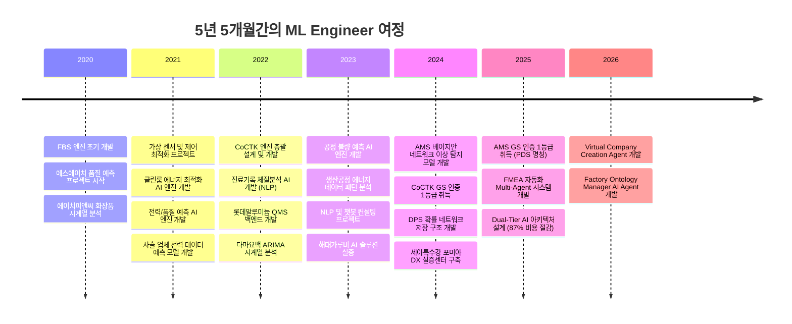
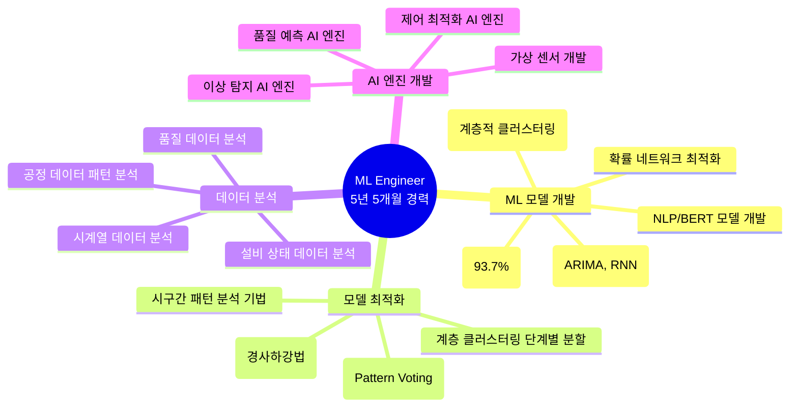
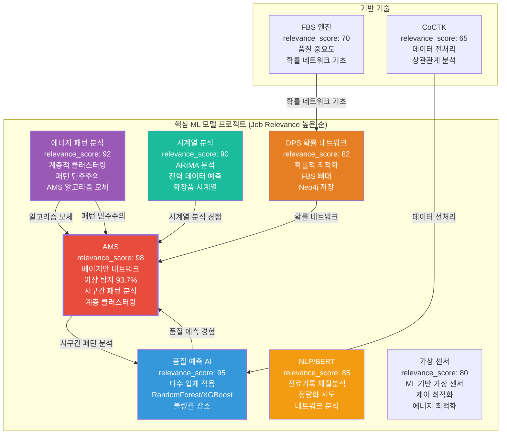
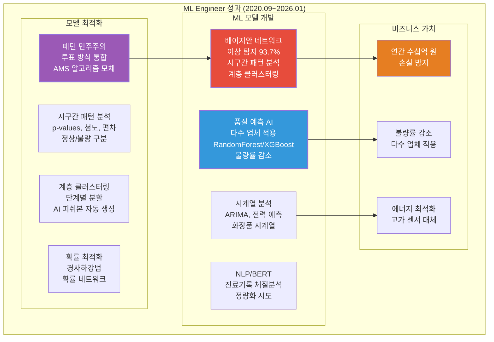

# 권순룡 이력서 - ML Engineer / AI Engineer

## 기본 정보

**이름**: 권순룡  
**현 소속**: 한솔코에버 연구소 대리 (2020.09 ~ 재직중)  
**총 경력**: 5년 5개월 (2020.09~2026.01)  
**핵심 역량**: ML/AI 모델 개발, 베이지안 네트워크, 시계열 분석, NLP/BERT, 클러스터링, 확률 네트워크, 모델 최적화, 이상 탐지, 품질 예측  
**이메일**: m920831@naver.com  
**연락처**: 010-5671-6200  
**GitHub**: https://github.com/moobaek

---

## 한눈에 보는 경력 (2020-2026)

---

## 지원 동기

ML/AI 모델을 개발하고 최적화하는 ML Engineer 역할에 기여하고자 지원합니다.

5년 5개월간의 경험을 통해 다양한 ML/AI 모델 개발과 최적화 역량을 갖춘 ML Engineer로 성장했습니다. 특히 **베이지안 네트워크 기반 이상 탐지 모델**, **시계열 분석**, **NLP/BERT**, **클러스터링**, **확률 네트워크** 등 다양한 ML 알고리즘을 활용한 모델 개발 경험을 보유하고 있습니다.

**ML 모델 개발 역량**을 구체적으로 설명하면, AMS 프로젝트에서 **베이지안 네트워크 기반 이상 탐지 모델**을 개발하여 93.7%의 이상탐지율을 달성했습니다. 확률 최적화(경사하강법)를 통한 이상상황 확률 네트워크를 작성했으며, 시구간 패턴 분석 기법을 개발하여 같은 값도 시점별 통계적 특성(p-values, 첨도, 편차)에 따라 정상/불량을 구분할 수 있도록 했습니다. 계층 클러스터링을 단계별로 잘라 AI 피쉬본을 자동 생성하는 방식으로 이상 탐지율을 극대화했습니다.

**시계열 분석 전문성**으로는 전력 데이터 예측, 품질 예측, 공정 불량 예측 등 다양한 시계열 분석 모델을 개발했습니다. 에이치피앤씨 화장품 시계열 분석, 다마요팩 ARIMA 시계열 분석, 사출 업체 전력 데이터 예측 모델 등을 개발하여 제조 현장의 시계열 데이터를 분석하고 예측했습니다.

**NLP/BERT 경험**으로는 진료기록 체질분석 AI 개발에서 비정형 진료 텍스트를 0/1 바이너리 테이블로 변환하여 네트워크 분석 및 체질 예측을 수행했습니다. 단순 워드클라우드 한계를 극복하고, NLP의 정량화를 시도하여 체질 예측 모델을 개발했습니다.

**확률 네트워크 및 최적화** 경험으로는 DPS 프로젝트에서 확률 네트워크를 Neo4j에 저장하여 FBS 뼈대 위에 확률적 최적화로 문제 해결 최적 경로를 도출했습니다. 같은 층끼리 이동 가능한 네트워크 구조를 설계하여 유연한 데이터 탐색이 가능하도록 했습니다.

이러한 경험을 바탕으로 ML/AI 모델을 개발하고 최적화하는 ML Engineer로 기여하고자 합니다.

---

## 핵심 역량 맵

---

## 프로젝트 관계도

---

## 경력 개요

### 한솔코에버 연구소 (2020.09 ~ 재직중)

**직급**: 대리  
**부서**: 연구소  
**총 경력**: 5년 5개월 (2020.09~2026.01)

**주요 업무**:
- **ML/AI 모델 개발**: 베이지안 네트워크, 시계열 분석, NLP/BERT, 클러스터링, 확률 네트워크 등 다양한 ML 알고리즘을 활용한 모델 개발
- **모델 최적화**: 확률 최적화(경사하강법), 시구간 패턴 분석 기법, 계층 클러스터링 단계별 분할, 패턴 민주주의 기법 개발
- **품질 예측 및 이상 탐지**: 다수 업체에 품질 예측 AI 엔진 적용, 베이지안 네트워크 기반 이상 탐지 모델 개발 (93.7% 이상탐지율)
- **가상 센서 및 제어 최적화**: ML 기반 가상 센서 개발, 제어 최적화 AI 엔진 개발, 에너지 최적화
- **데이터 분석**: 시계열 데이터 분석, 공정 데이터 패턴 분석, 설비 상태 데이터 분석, 품질 데이터 분석

**핵심 성과**:
- ✅ **베이지안 네트워크 기반 이상 탐지 모델 개발**: 이상탐지율 93.7% 달성 (AMS)
- ✅ **시구간 패턴 분석 기법 개발**: 같은 값도 시점별 통계적 특성(p-values, 첨도, 편차)에 따라 정상/불량 구분
- ✅ **계층 클러스터링 단계별 분할**: AI 피쉬본 자동 생성 방식으로 이상 탐지율 극대화
- ✅ **패턴 민주주의 기법 고안**: 여러 패턴 분석 결과를 투표 방식으로 통합하여 최종 패턴 결정
- ✅ **다수 업체 품질 예측 AI 엔진 적용**: 사출/도정/금형 공정 품질 예측 모델 개발, 불량률 감소 성과 달성
- ✅ **시계열 분석 전문성**: ARIMA, 전력 데이터 예측, 화장품 시계열 분석 등 다양한 시계열 모델 개발
- ✅ **NLP 정량화 시도**: 비정형 진료 텍스트를 0/1 바이너리 테이블로 변환하여 네트워크 분석 및 체질 예측
- ✅ **확률 네트워크 및 최적화**: FBS 뼈대 위에 확률적 최적화로 문제 해결 최적 경로 도출
- ✅ **GS 인증 1등급 2개 취득**: CoCTK (2024), AMS-PDS (2025)
- ✅ **특허 등록**: 피쉬본 관리 시스템 특허 등록
- ✅ **학술 논문 발표 10편**: 2020-2025년, ML/AI 모델 개발 분야

**비즈니스 임팩트**:
- 연간 수십억 원 손실 방지 (이상 탐지 조기 대응, AMS)
- 다수 업체 불량률 감소 (품질 예측 AI 엔진 적용)
- 에너지 최적화 및 고가 센서 대체 (가상 센서 및 제어 최적화)

---

## 핵심 역량

### ML 모델 개발 및 최적화

다양한 ML 알고리즘을 활용한 모델 개발과 최적화 경험을 보유하고 있습니다. 특히 **베이지안 네트워크**, **시계열 분석**, **NLP/BERT**, **클러스터링**, **확률 네트워크** 등을 활용한 모델 개발 경험을 보유하고 있습니다.

**베이지안 네트워크 기반 이상 탐지 모델 (AMS 프로젝트)**에서는 베이지안 네트워크를 활용하여 설비 상태 데이터를 분석하고, 확률 최적화(경사하강법)를 통한 이상상황 확률 네트워크를 작성했습니다. 시구간 패턴 분석 기법을 개발하여 같은 값도 시점별 통계적 특성(p-values, 첨도, 편차)에 따라 정상/불량을 구분할 수 있도록 했습니다. 계층 클러스터링을 단계별로 잘라 AI 피쉬본을 자동 생성하는 방식으로, 이상 탐지율 93.7%를 달성했습니다. 이 기법은 AMS 완성 1년 전부터 대부분의 과제에 적용되었으며, AMS로 통합 정리되었습니다.

**시계열 분석 모델 개발** 경험으로는 전력 데이터 예측, 품질 예측, 공정 불량 예측 등 다양한 시계열 분석 모델을 개발했습니다. 에이치피앤씨 화장품 시계열 분석, 다마요팩 ARIMA 시계열 분석, 사출 업체 전력 데이터 예측 모델 등을 개발하여 제조 현장의 시계열 데이터를 분석하고 예측했습니다. 전력 소비 패턴 ML 예측을 통해 에너지 최적화 방안을 제시했으며, 공정 불량 예측 모델을 개발하여 불량률을 감소시켰습니다.

**NLP/BERT 모델 개발** 경험으로는 진료기록 체질분석 AI 개발에서 비정형 진료 텍스트를 0/1 바이너리 테이블로 변환하여 네트워크 분석 및 체질 예측을 수행했습니다. 단순 워드클라우드 한계를 극복하고, NLP의 정량화를 시도하여 체질 예측 모델을 개발했습니다. 헬스케어 AI 적용을 통해 한의원 진료 기록 기반 체질 예측 시스템을 구축했습니다.

**클러스터링 및 패턴 분석** 경험으로는 생산공정 에너지 데이터 패턴 분석 연구과제에서 계층적 클러스터링(Hierarchical Clustering)을 도입하여 설비 상태 데이터의 패턴을 분석했습니다. 패턴 민주주의(Pattern Voting) 기법을 고안하여 데이터 패턴 분석 방법론을 만들었으며, 이 구조적 분화와 투표 방식이 훗날 AMS의 핵심 알고리즘 모체가 되었습니다.

**확률 네트워크 및 최적화** 경험으로는 DPS 프로젝트에서 확률 네트워크를 Neo4j에 저장하여 FBS 뼈대 위에 확률적 최적화로 문제 해결 최적 경로를 도출했습니다. 같은 층끼리 이동 가능한 네트워크 구조를 설계하여 유연한 데이터 탐색이 가능하도록 했습니다.

### 품질 예측 및 이상 탐지 AI 엔진 개발

제조 현장의 품질 예측과 이상 탐지를 위한 AI 엔진을 개발하는 경험을 보유하고 있습니다.

**품질 예측 AI 엔진 개발** 경험으로는 사출, 도정, 금형 등 다양한 공정에 적용하여 품질 예측 모델을 개발했습니다. 한중엔시에스에서는 사출 공정에 RandomForest, XGBoost, AdaBoost 앙상블을 적용했습니다. 대성금형에서는 전기장치 품질 OUT 예측을 수행했으며, 제이제이툴스에서는 금속가공에 FBS 품질 중요도를 적용했습니다. 알티스트에서는 식품 공정에 CoCTK 엔진의 초석을 적용했습니다. 다수 업체에 적용하여 불량률 감소 성과를 달성했으며, 제조 현장의 품질 개선을 실증했습니다.

**이상 탐지 AI 엔진 개발** 경험으로는 AMS 프로젝트에서 베이지안 네트워크 기반 이상 탐지 모델을 개발하여 93.7%의 이상탐지율을 달성했습니다. 시구간 패턴 분석 기법을 개발하여 같은 값도 시점별 통계적 특성에 따라 정상/불량을 구분할 수 있도록 했으며, 계층 클러스터링을 단계별로 잘라 AI 피쉬본을 자동 생성하는 방식으로 이상 탐지를 수행했습니다.

### 가상 센서 및 제어 최적화 AI 엔진 개발

고가 센서를 저비용으로 대체하기 위한 가상 센서와 제어 최적화 AI 엔진을 개발하는 경험을 보유하고 있습니다.

**가상 센서 개발** 경험으로는 ML 기반 가상 센서를 개발하여 고가 센서를 저비용으로 대체했습니다. 클린룸 송풍기 최적 제어 프로젝트에서 AI 엔진을 개발하여 에너지 최적화를 수행했으며, 논문을 발표했습니다.

**제어 최적화 AI 엔진 개발** 경험으로는 클린룸 에너지 최적화 프로젝트에서 제어 최적화 AI 엔진을 개발하여 에너지 소비를 최적화했습니다.

---

## 주요 프로젝트 경험

### 1. AMS (Analysis Management System) - 베이지안 네트워크 기반 이상 탐지 모델 개발

**기간**: 2024.07 ~ 2025.12  
**발주처**: 한국산업기술진흥원  
**역할**: AI 엔진 개발 및 모델 최적화 (총괄 PM)  
**relevance_score**: 98

**핵심 성과**:
- ✅ **베이지안 네트워크 기반 이상 탐지 모델 개발**: 이상탐지율 93.7% 달성 (실질적 정확도 60~70%, 데이터 한계 고려)
- ✅ **시구간 패턴 분석 기법 개발**: 같은 값도 시점별 통계적 특성에 따라 정상/불량 구분
- ✅ **계층 클러스터링 단계별 분할**: AI 피쉬본 자동 생성
- ✅ **8단계 시계열 데이터 파이프라인 구축**: 실시간 스트리밍 처리 및 배치 처리 하이브리드 아키텍처 구현
- ✅ **GS 인증 1등급 취득**: PDS 명칭으로 소프트웨어 품질 인증 획득
- ✅ **특허 등록**: 피쉬본 관리 시스템 특허 등록
- ✅ **논문 발표**: 2025, 2024년 논문 발표

**기술 스택**: Python, 베이지안 네트워크, 시계열 분석, 계층 클러스터링, 확률 최적화 (경사하강법), Neo4j, 패턴 민주주의

**상세 설명**:
AMS는 제조 현장의 설비 이상을 자동으로 탐지하고 분석하는 AI 종합 플랫폼입니다. **베이지안 네트워크 기반 이상 탐지 모델**을 개발하여 93.7%의 이상탐지율을 달성했습니다 (실질적 정확도 60~70%, 데이터 한계 고려).

**베이지안 네트워크 모델**: 설비 상태 데이터를 분석하고, 확률 최적화(경사하강법)를 통한 이상상황 확률 네트워크를 작성했습니다. 베이지안 네트워크를 활용하여 설비 간 관계를 모델링하고, 이상 상황의 확률을 계산합니다. 확률 최적화를 통해 이상상황 확률 네트워크를 최적화하여 이상 탐지 정확도를 향상시켰습니다.

**시구간 패턴 분석 기법**: 같은 값도 시점별 통계적 특성(p-values, 첨도, 편차)에 따라 정상/불량을 구분할 수 있도록 했습니다. 이 기법은 AMS 완성 1년 전부터 대부분의 과제에 적용되었으며, AMS로 통합 정리되었습니다. 시계열 데이터의 시점별 통계적 특성을 분석하여 더 정확한 이상 탐지를 수행합니다.

**계층 클러스터링 단계별 분할**: 계층 클러스터링을 단계별로 잘라 AI 피쉬본을 자동 생성하는 방식으로, 이상 탐지율을 극대화했습니다. 각 단계별로 클러스터를 분할하여 더 세밀한 패턴 분석이 가능하도록 했습니다. 이 방법은 생산공정 에너지 데이터 패턴 분석 연구과제에서 개발한 패턴 민주주의 기법과 결합하여 AMS의 핵심 알고리즘이 되었습니다.

**패턴 민주주의 기법**: 여러 패턴 분석 결과를 투표 방식으로 통합하여 최종 패턴을 결정합니다. 이 구조적 분화와 투표 방식이 AMS의 핵심 알고리즘 모체가 되었습니다.

**8단계 시계열 데이터 파이프라인**: 실시간 데이터 수집부터 이상 탐지까지 전 과정을 자동화했습니다. 실시간 스트리밍 처리 및 배치 처리 하이브리드 아키텍처를 구현하여 다양한 데이터 소스로부터 데이터를 수집하고 분석합니다.

**비즈니스 가치**: 연간 수십억 원의 손실을 방지하는 이상 탐지 시스템으로, 세아특수강 등 대기업에 정식 납품되었습니다. GS 인증 1등급을 취득하여 정부 공인 우수 소프트웨어로 인정받았습니다.

---

### 2. 품질 예측 AI 엔진 - 다수 업체 적용 및 고도화

**기간**: 2021 ~ 2023  
**발주처**: 정보통신산업진흥원  
**역할**: AI 엔진 개발 및 고도화  
**relevance_score**: 95

**핵심 성과**:
- ✅ **다수 업체 품질 예측 AI 엔진 개발**: 사출/도정/금형 공정 품질 예측 모델 개발
- ✅ **불량률 감소 성과 달성**: 제조 현장 품질 개선 실증
- ✅ **시계열 데이터 분석 전문성**: 공정 데이터 기반 품질 예측 및 패턴 분석
- ✅ **앙상블 모델 적용**: RandomForest, XGBoost, AdaBoost 앙상블 적용

**기술 스택**: Python, ML, 시계열 분석, 품질 예측 모델, RandomForest, XGBoost, AdaBoost, 앙상블 모델

**상세 설명**:
품질 예측 AI 엔진은 제조 공정의 품질을 사전에 예측하는 시스템입니다. 사출, 도정, 금형 등 다양한 공정에 적용하여 품질 예측 모델을 개발했으며, 시계열 데이터 분석을 통해 공정 패턴을 분석하고 품질을 예측했습니다.

**한중엔시에스 (사출 공정)**: RandomForest, XGBoost, AdaBoost 앙상블을 적용하여 사출 공정의 품질을 예측했습니다. 다양한 앙상블 기법을 활용하여 모델의 정확도를 향상시켰습니다. 시계열 데이터 분석을 통해 공정 패턴을 파악하고 품질을 예측했습니다.

**대성금형 (전기장치 품질)**: 전기장치 품질 OUT 예측을 수행하여 불량률을 감소시켰습니다. ML 모델을 활용하여 품질 예측 정확도를 향상시켰습니다.

**제이제이툴스 (금속가공)**: 금속가공에 FBS 품질 중요도를 적용하여 품질 예측 모델을 개발했습니다. FBS 엔진의 품질 중요도 분석 기능을 활용하여 품질 예측 모델을 구축했습니다.

**알티스트 (식품 공정)**: 식품 공정에 CoCTK 엔진의 초석을 적용하여 품질 예측 모델을 개발했습니다. CoCTK 엔진의 데이터 전처리 및 상관관계 분석 기능을 활용했습니다.

**비즈니스 가치**: 다수 업체에 적용하여 불량률 감소 성과를 달성했으며, 제조 현장의 품질 개선을 실증했습니다.

---

### 3. 생산공정 에너지 데이터 패턴 분석 - 계층적 클러스터링 및 패턴 민주주의 기법 개발

**기간**: 2023  
**발주처**: 연구과제  
**역할**: 메인 수행 (ML 모델 개발)  
**relevance_score**: 92

**핵심 성과**:
- ✅ **계층적 클러스터링(Hierarchical Clustering) 도입**: 설비 상태 데이터 패턴 분석
- ✅ **패턴 민주주의(Pattern Voting) 기법 고안**: 데이터 패턴 분석 방법론 개발
- ✅ **AMS 알고리즘 모체**: 이 연구의 구조적 분화와 투표 방식이 훗날 AMS의 핵심 알고리즘 모체가 됨

**기술 스택**: Python, 패턴 분석, 계층적 클러스터링, 라벨링 시스템, 패턴 민주주의

**상세 설명**:
생산공정 에너지 데이터 패턴 분석 연구과제를 메인으로 진행했습니다. **계층적 클러스터링**을 도입하여 설비 상태 데이터의 패턴을 분석하고, **패턴 민주주의 기법**을 고안하여 데이터 패턴 분석 방법론을 만들었습니다.

**계층적 클러스터링**: 설비 상태 데이터를 계층적으로 분류하여 패턴을 찾아냅니다. 계층적 구조를 통해 다양한 수준의 패턴을 분석할 수 있으며, 계층 클러스터링을 단계별로 잘라 AI 피쉬본을 자동 생성하는 방식으로 발전했습니다.

**패턴 민주주의 기법**: 여러 패턴 분석 결과를 투표 방식으로 통합하여 최종 패턴을 결정합니다. 이 구조적 분화와 투표 방식이 훗날 AMS의 핵심 알고리즘 모체가 되었습니다. Pattern Module의 핵심 알고리즘으로 발전하여 AMS의 이상 탐지율 93.7% 달성에 기여했습니다.

**AMS 알고리즘 모체**: 이 연구의 구조적 분화와 투표 방식이 훗날 AMS의 핵심 알고리즘 모체가 되었습니다. 계층적 클러스터링과 패턴 민주주의 기법을 결합하여 더 정확한 패턴 분석이 가능하도록 했습니다.

**비즈니스 가치**: 데이터 패턴 분석 방법론을 개발하여 AMS의 핵심 알고리즘 기반을 마련했습니다.

---

### 4. 진료기록 체질분석 AI - NLP 정량화 및 네트워크 분석

**기간**: 2022.06 ~ 2022.10  
**발주처**: 한국데이터산업진흥원  
**역할**: NLP 모델 개발  
**relevance_score**: 85

**핵심 성과**:
- ✅ **NLP의 정량화 시도**: 비정형 진료 텍스트를 0/1 바이너리 테이블로 변환하여 네트워크 분석 및 체질 예측
- ✅ **단순 워드클라우드 한계 극복**: 정량적 분석 방법론 개발
- ✅ **헬스케어 AI 적용**: 한의원 진료 기록 기반 체질 예측 시스템 구축

**기술 스택**: Python, NLP, 네트워크 분석, 체질 예측 모델, BERT, DistilBERT

**상세 설명**:
진료기록 체질분석 AI는 한의원 진료 기록을 분석하여 체질을 예측하는 시스템입니다. **NLP의 정량화**를 시도하여 비정형 진료 텍스트를 0/1 바이너리 테이블로 변환하여 네트워크 분석 및 체질 예측을 수행했습니다.

**NLP 정량화**: 단순 워드클라우드 한계를 극복하고, 비정형 진료 텍스트를 정량적으로 분석할 수 있는 방법론을 개발했습니다. 진료 텍스트를 0/1 바이너리 테이블로 변환하여 네트워크 분석을 수행했습니다. NLP의 정량화를 통해 비정형 텍스트를 구조화된 데이터로 변환하여 ML 모델에 적용할 수 있도록 했습니다.

**네트워크 분석**: 변환된 데이터를 네트워크 분석 기법을 활용하여 체질 간 관계를 분석했습니다. 체질 간 관계를 네트워크로 모델링하여 체질 예측의 정확도를 향상시켰습니다.

**체질 예측 모델**: 네트워크 분석 결과를 바탕으로 체질 예측 모델을 개발했습니다. 비정형 텍스트를 정량화하여 체질 예측 모델을 구축했습니다.

**비즈니스 가치**: 헬스케어 AI 적용을 통해 한의원 진료 기록 기반 체질 예측 시스템을 구축했습니다.

---

### 5. 시계열 분석 모델 개발 - ARIMA 및 전력 데이터 예측

**기간**: 2020~2023  
**발주처**: 다양한 업체  
**역할**: 시계열 분석 모델 개발  
**relevance_score**: 90

**핵심 성과**:
- ✅ **에이치피앤씨 화장품 시계열 분석**: 화장품 제조 공정 시계열 데이터 분석
- ✅ **다마요팩 ARIMA 시계열 분석**: ARIMA 모델을 활용한 시계열 예측
- ✅ **사출 업체 전력 데이터 예측 모델**: 전력 소비 패턴 ML 예측

**기술 스택**: Python, ARIMA, 시계열 분석, 전력 데이터 예측, RNN, PLC 변화 기반 패턴 분석

**상세 설명**:
다양한 업체의 시계열 데이터를 분석하고 예측하는 모델을 개발했습니다.

**에이치피앤씨 화장품 시계열 분석**: 화장품 제조 공정의 시계열 데이터를 분석하여 공정 패턴을 파악했습니다. 시계열 품질 이상 탐색을 수행하여 품질 패턴을 분석했습니다.

**다마요팩 ARIMA 시계열 분석**: ARIMA 모델을 활용하여 시계열 데이터를 예측했습니다. 시계열 데이터의 추세와 계절성을 분석하여 미래 값을 예측했습니다.

**사출 업체 전력 데이터 예측 모델**: 전력 소비 패턴을 ML 모델로 예측하여 에너지 최적화 방안을 제시했습니다. PLC 변화 기반 패턴 분석을 통해 공정 상태에 따른 전력 소비 패턴을 파악하고, 시계열 분석을 통해 미래 전력 소비량을 예측했습니다.

**시계열 분석 전문성**: 시계열 데이터의 추세와 계절성을 분석하여 미래 값을 예측하는 전문성을 보유하고 있습니다. 다양한 시계열 모델을 활용하여 제조 현장의 데이터 패턴을 파악했습니다.

**비즈니스 가치**: 시계열 분석을 통해 제조 현장의 데이터 패턴을 파악하고, 미래 값을 예측하여 최적화 방안을 제시했습니다.

---

### 6. DPS (데이터수집시스템) - 확률 네트워크 저장 구조 및 최적화

**기간**: 2021 ~ 2024  
**발주처**: 세아특수강  
**역할**: 확률 네트워크 모델 개발  
**relevance_score**: 82

**핵심 성과**:
- ✅ **확률 네트워크 저장 구조 설계**: Neo4j에 확률 네트워크 저장
- ✅ **확률적 최적화**: FBS 뼈대 위에 확률적 최적화로 문제 해결 최적 경로 도출
- ✅ **네트워크 구조 설계**: 같은 층끼리 이동 가능한 네트워크 구조 설계

**기술 스택**: Python, Neo4j, 확률 네트워크, 확률 최적화, FBS, Cypher 쿼리

**상세 설명**:
DPS 프로젝트에서 **확률 네트워크**를 Neo4j에 저장하여 FBS 뼈대 위에 확률적 최적화로 문제 해결 최적 경로를 도출했습니다.

**확률 네트워크 저장 구조**: 확률 네트워크를 Neo4j 그래프 DB에 저장하여 복잡한 관계를 모델링했습니다. Neo4j의 그래프 구조를 활용하여 확률 네트워크를 효율적으로 저장하고 관리했습니다.

**확률적 최적화**: FBS 뼈대 위에 확률적 최적화를 적용하여 문제 해결 최적 경로를 도출했습니다. 확률 네트워크를 활용하여 제조 공정의 복잡한 관계를 모델링하고, 최적화 방안을 도출했습니다.

**네트워크 구조 설계**: 같은 층끼리 이동 가능한 네트워크 구조를 설계하여 유연한 데이터 탐색이 가능하도록 했습니다. 네트워크 구조를 통해 제조 공정 간 관계를 명확히 파악하고, 문제 해결 경로를 찾을 수 있도록 했습니다.

**비즈니스 가치**: 제조 공정의 복잡한 관계를 확률적으로 모델링하고, 최적화 방안을 도출할 수 있도록 했습니다.

---

### 7. 가상 센서 및 제어 최적화 AI 엔진 개발

**기간**: 2021  
**발주처**: 다양한 업체  
**역할**: 가상 센서 및 제어 최적화 모델 개발  
**relevance_score**: 80

**핵심 성과**:
- ✅ **ML 기반 가상 센서 개발**: 고가 센서를 저비용으로 대체
- ✅ **클린룸 송풍기 최적 제어**: AI 엔진 개발 및 논문 발표
- ✅ **에너지 최적화**: 제어 최적화를 통한 에너지 소비 최적화

**기술 스택**: Python, ML, 가상 센서, 제어 최적화, 시계열 분석

**상세 설명**:
**ML 기반 가상 센서**를 개발하여 고가 센서를 저비용으로 대체했습니다. 클린룸 송풍기 최적 제어 프로젝트에서 AI 엔진을 개발하여 에너지 최적화를 수행했으며, 논문을 발표했습니다.

**가상 센서 개발**: ML 모델을 활용하여 실제 센서 없이도 센서 값을 예측할 수 있는 가상 센서를 개발했습니다. 시계열 데이터 분석을 통해 센서 값을 예측하는 모델을 구축했습니다.

**제어 최적화**: AI 엔진을 개발하여 제어 시스템을 최적화하고, 에너지 소비를 최소화했습니다. 제어 최적화를 통해 에너지 효율을 향상시켰습니다.

**비즈니스 가치**: 고가 센서를 저비용으로 대체하고, 에너지 소비를 최적화할 수 있도록 했습니다.

---

## 기술 스택

### ML/DL 프레임워크 및 라이브러리
- **Scikit-learn**: 5년 5개월 경력 (2020.09~2026.01)
  - 다양한 ML 알고리즘 활용 (모든 ML 프로젝트)
- **베이지안 네트워크**: 2년 경력 (2024~2025)
  - 이상 탐지 모델 개발 (AMS, 이상탐지율 93.7%)
- **시계열 분석**: 5년 5개월 경력 (2020.09~2026.01)
  - ARIMA, RNN 등 시계열 예측 모델 개발 (다수 프로젝트)
- **클러스터링**: 3년 경력 (2023~2025)
  - 계층적 클러스터링, 패턴 분석 (에너지 패턴 분석, AMS)
- **앙상블 모델**: 2년 경력 (2021~2023)
  - RandomForest, XGBoost, AdaBoost (품질 예측 AI 엔진)

### 데이터 처리 및 분석
- **Pandas**: 5년 5개월 경력 (2020.09~2026.01)
  - 데이터 전처리 및 분석 (모든 ML 프로젝트)
- **NumPy**: 5년 5개월 경력 (2020.09~2026.01)
  - 수치 계산 및 배열 처리 (모든 ML 프로젝트)
- **시계열 분석**: 5년 5개월 경력 (2020.09~2026.01)
  - 전력 데이터, 품질 데이터, 공정 데이터 분석 (다수 프로젝트)

### NLP 및 네트워크 분석
- **NLP**: 1년 경력 (2022)
  - 비정형 텍스트 정량화 및 분석 (진료기록 체질분석 AI)
- **BERT/DistilBERT**: 1년 경력 (2022)
  - NLP 모델 실험 및 개발 (진료기록 체질분석 AI)
- **네트워크 분석**: 1년 경력 (2022)
  - 체질 예측, 관계 분석 (진료기록 체질분석 AI)

### 데이터베이스
- **Neo4j**: 3년 경력 (2022~2025)
  - 그래프 DB, 확률 네트워크 저장 (AMS, DPS)
  - Cypher 쿼리 작성
- **MSSQL Server, PostgreSQL**: 5년 5개월 경력 (2020.09~2026.01)
  - 관계형 DB (모든 프로젝트)

### 프로그래밍 언어
- **Python**: 5년 5개월 경력 (2020.09~2026.01)
  - 49개 모듈 개발: MLS, CoCTK, FBS, RMS, AMS
  - 주요 프로젝트: 모든 ML 프로젝트

---

## 성과 대시보드

### 정량적 성과 요약

| 분류 | 지표 | 수치 | 세부 내용 |
|:---|---:|:---|:---|
| **ML 모델 개발** | 이상 탐지 정확도 | 93.7% | 베이지안 네트워크 기반 (AMS) |
| | 품질 예측 프로젝트 | 4개+ 업체 | 한중엔시에스, 대성금형, 제이제이툴스, 알티스트 |
| | 시계열 분석 프로젝트 | 3개+ | 에이치피앤씨, 다마요팩, 사출 업체 |
| | NLP 프로젝트 | 1개 | 진료기록 체질분석 AI |
| **모델 최적화** | 시구간 패턴 분석 | 1개 기법 | p-values, 첨도, 편차 기반 |
| | 계층 클러스터링 | 1개 기법 | 단계별 분할, AI 피쉬본 자동 생성 |
| | 패턴 민주주의 | 1개 기법 | 투표 방식 통합 |
| | 확률 최적화 | 1개 기법 | 경사하강법 기반 |
| **비즈니스 가치** | 손실 방지 효과 | 연간 수십억 원 | 이상 탐지 조기 대응 (AMS) |
| | 불량률 감소 | 다수 업체 | 품질 예측 AI 엔진 적용 |
| | 에너지 최적화 | 1개 프로젝트 | 가상 센서 및 제어 최적화 |

---

## 학술 활동 및 인증

### 논문 발표
- **2025년**: AMS 이상 탐지 시스템 논문 발표
- **2024년**: DPS 확률 네트워크 논문 발표
- **2023년**: CoCTK 엔진 논문 발표
- **2021년**: 클린룸 송풍기 최적 제어 논문 발표
- **총 10편 논문 발표**: 2020-2025년, ML/AI 모델 개발 분야

### 인증
- **GS 인증 1등급 (CoCTK)**: 2024년 소프트웨어 품질 인증 획득
- **GS 인증 1등급 (AMS-PDS)**: 2025년 소프트웨어 품질 인증 획득

### 특허
- **피쉬본 관리 시스템 특허 등록**: 이상 탐지 및 분석 시스템 특허

---

## 학력

**홍익대학교 전자공학과** (2013.03 ~ 2020.02)
- 학점: 3.11 / 4.5
- 졸업논문: LD 동격회로 설계 및 PLL 설계
- 주요 수강 분야: 회로 설계, 전파공학, 컴퓨터공학

---

## 자격증

**OPIc** (2019.03)
- ACT FL (American Council on the Teaching of Foreign Languages)

---

## 핵심 철학

> **"모델보다 데이터, 데이터보다 정보, 지식구조를 정리하는 현장친화적 연구원"**

5년 5개월간의 ML/AI 모델 개발 경험을 통해 다양한 ML 알고리즘을 활용한 모델 개발과 최적화 역량을 갖추었습니다. 화려한 기술보다는 현장에서 실제로 사용할 수 있는 실용적인 ML 모델을 개발하는 것을 중시하며, 모델의 정확도와 비즈니스 가치를 추구합니다.

ML 모델은 단순히 정확도만 높이는 것이 아니라, 현장의 문제를 해결하는 것입니다. 베이지안 네트워크 기반 이상 탐지 모델을 개발하여 93.7%의 이상탐지율을 달성했으며, 다수 업체에 품질 예측 AI 엔진을 적용하여 불량률 감소 성과를 달성했습니다. 이러한 철학을 바탕으로 지속적인 모델 개선과 최적화를 통해 비즈니스 가치를 창출하고 있습니다.

---

---

© 2026 권순룡. All Rights Reserved.

*본 이력서는 ML Engineer / AI Engineer 직무에 특화되어 작성되었습니다.*
