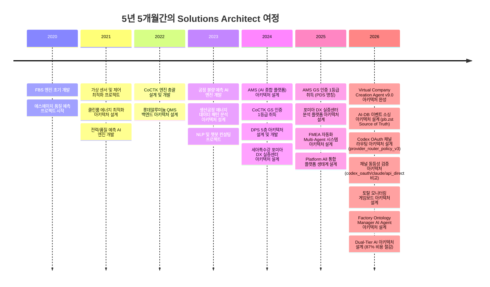
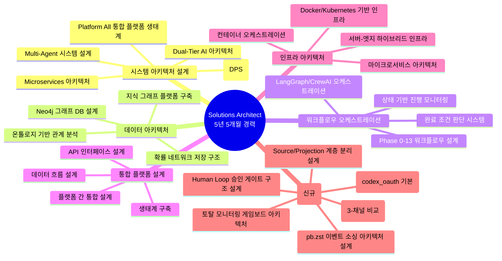
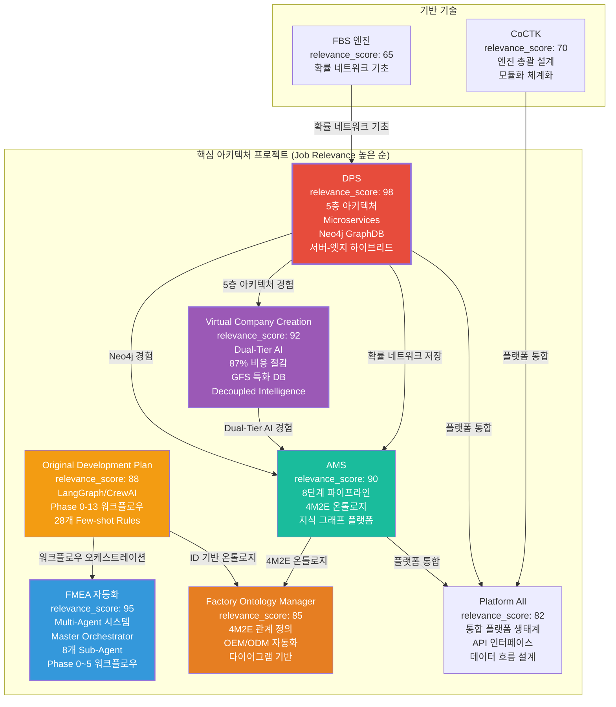
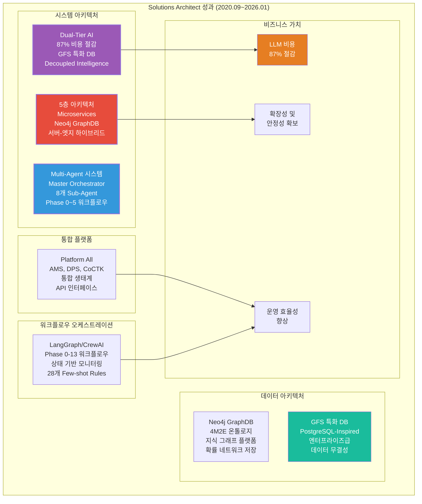

# 권순룡 이력서 - Solutions Architect / System Architect

## 기본 정보

**이름**: 권순룡  
**전 소속**: 한솔코에버 연구소 대리 (2020.09.01 ~ 2026.01.31, 퇴직)  
**총 경력**: 5년 5개월 (2020.09~2026.01)  
**핵심 역량**: 대규모 시스템 아키텍처 설계, Microservices 아키텍처, Multi-Agent 시스템 설계, 통합 플랫폼 생태계 구축, Neo4j 그래프 DB 설계, 5층 아키텍처 설계, Platform All 통합 플랫폼 설계  
**이메일**: m920831@naver.com  
**연락처**: 010-5671-6200  
**GitHub**: https://github.com/moobaek

---

## 한눈에 보는 경력 (2020-2026)

---

## 지원 동기

대규모 시스템 아키텍처를 설계하고 통합 플랫폼 생태계를 구축하는 Solutions Architect 역할에 기여하고자 지원합니다.

5년 5개월간의 경험을 통해 복잡한 시스템 아키텍처 설계와 통합 플랫폼 구축 역량을 갖춘 Solutions Architect로 성장했습니다. 특히 **5층 아키텍처 설계**, **Microservices 아키텍처**, **Multi-Agent 시스템 설계**, **Platform All 통합 플랫폼 생태계 구축** 등 대규모 시스템 아키텍처 설계 경험을 보유하고 있습니다.

**대규모 시스템 아키텍처 설계 역량**을 구체적으로 설명하면, DPS 프로젝트에서 **5층 아키텍처**를 설계하여 Microservices 기반 데이터 수집 시스템을 구축했습니다. 1.센서수집 → 2.중앙저장관리 → 3.POP/MES → 4.AMS+확률네트워크 → 5.LLM FMEA 생성의 계층 구조를 설계하여 각 계층 간 독립성과 확장성을 확보했습니다. Neo4j 그래프 DB를 활용한 온톨로지 기반 관계 분석 및 지식 그래프 플랫폼을 구축하여 복잡한 제조 공정 간 관계를 시각화했습니다.

**Multi-Agent 시스템 아키텍처 설계** 경험으로는 FMEA 자동화 시스템에서 **Master Orchestrator 기반 8개 독립 Sub-Agent 협업 구조**를 설계했습니다. Claude Sub-Agent 기반으로 R&D, Mfg, QA 등 8개의 독립 Sub-Agent가 협업하는 구조를 설계했으며, Phase 0~5 자동화 워크플로우를 통해 전체 프로세스를 자동화했습니다. Original Development Plan에서는 **LangGraph/CrewAI 방식 워크플로우 오케스트레이션**, **상태 기반 진행 모니터링 및 완료 조건 판단 시스템**을 설계하여 복잡한 개발 프로세스를 자동화했습니다.

**통합 플랫폼 생태계 구축** 경험으로는 Platform All 프로젝트에서 **통합 플랫폼 생태계**를 설계했습니다. AMS, DPS, CoCTK 등 다양한 플랫폼을 통합하여 하나의 생태계로 구축했으며, 각 플랫폼 간 데이터 흐름과 API 인터페이스를 설계했습니다. Virtual Company Creation Agent에서는 **Dual-Tier AI 아키텍처**를 설계하여 High-Spec AI (추론)와 Low-Spec AI (조회)를 분리하여 최대 87%의 LLM 비용을 절감했습니다.

**v9.0 이벤트 기반 아키텍처 설계 성과 (2026)**: `pb.zst` 이벤트 스트림을 진실 소스로 하는 AI-DB 이벤트 소싱 아키텍처를 설계했습니다. `codex_oauth / claude / api_direct` 3개 채널의 동등성 검증 아키텍처를 수립하고, `provider_router_policy_v3` 기반 채널 라우팅 정책을 설계했습니다. 게이트 점수화(PASS/FAIL + 리스크 포인트) 기반의 토탈 모니터링 게임보드 아키텍처를 설계하여 릴리즈 품질 관리 체계를 완성했습니다.

이러한 경험을 바탕으로 대규모 시스템 아키텍처를 설계하고 통합 플랫폼 생태계를 구축하는 Solutions Architect로 기여하고자 합니다.

---

## 핵심 역량 맵

---

## 프로젝트 관계도

---

## 경력 개요

### 한솔코에버 연구소 (2020.09 ~ 재직중)

**직급**: 대리  
**부서**: 연구소  
**총 경력**: 5년 5개월 (2020.09~2026.01)

**주요 업무**:
- **대규모 시스템 아키텍처 설계**: 5층 아키텍처, Microservices 아키텍처, Multi-Agent 시스템 아키텍처, Dual-Tier AI 아키텍처 설계
- **통합 플랫폼 생태계 구축**: Platform All 프로젝트에서 AMS, DPS, CoCTK 등 다양한 플랫폼 통합, API 인터페이스 설계, 데이터 흐름 설계
- **데이터 아키텍처 설계**: Neo4j 그래프 DB 설계, 온톨로지 기반 관계 분석, 지식 그래프 플랫폼 구축, 확률 네트워크 저장 구조 설계
- **워크플로우 오케스트레이션**: LangGraph/CrewAI 오케스트레이션, 상태 기반 진행 모니터링, 완료 조건 판단 시스템, Phase 0-13 워크플로우 설계
- **인프라 아키텍처 설계**: Docker/Kubernetes 기반 인프라, 서버-엣지 하이브리드 인프라, 마이크로서비스 아키텍처, 컨테이너 오케스트레이션

**핵심 성과**:
- ✅ **5층 아키텍처 설계**: Microservices 기반 데이터 수집 시스템 구축 (DPS)
- ✅ **Multi-Agent 시스템 아키텍처 설계**: Master Orchestrator 기반 8개 독립 Sub-Agent 협업 구조 구현 (FMEA 자동화)
- ✅ **Dual-Tier AI 아키텍처 설계**: High-Spec AI와 Low-Spec AI 분리로 최대 87% 비용 절감 (Virtual Company Creation Agent)
- ✅ **Platform All 통합 플랫폼 생태계 설계**: AMS, DPS, CoCTK 등 다양한 플랫폼 통합
- ✅ **Neo4j 그래프 DB 설계**: 온톨로지 기반 관계 분석 및 지식 그래프 플랫폼 구축 (AMS, DPS)
- ✅ **특화 중간 DB (GFS) 설계**: LLM을 서포트하기 위한 특화 중간 DB 설계, 87% 비용 절감
- ✅ **LangGraph/CrewAI 오케스트레이션**: 복잡한 개발 프로세스 자동화 설계 (Original Development Plan)
- ✅ **상태 기반 진행 모니터링**: 완료 조건 판단 시스템 설계, 28개 Few-shot Rules System 설계
- ✅ **GS 인증 1등급 2개 취득**: CoCTK (2024), AMS-PDS (2025)
- ✅ **특허 출원/등록**: 5건 (2건 등록결정 완료, 3건 심사 진행 중, 총 청구항 39개)
- ✅ **학술 논문 발표 10편**: 2020-2025년, 시스템 아키텍처 설계 분야

**비즈니스 임팩트**:
- LLM 비용 87% 절감 (Dual-Tier AI 아키텍처)
- 통합 플랫폼 생태계로 운영 효율성 향상 (Platform All)
- 대규모 시스템 아키텍처 설계로 확장성 및 안정성 확보

---

## 핵심 역량

### 대규모 시스템 아키텍처 설계

복잡한 시스템 아키텍처를 설계하고 통합 플랫폼 생태계를 구축하는 경험을 보유하고 있습니다. 특히 **5층 아키텍처**, **Microservices 아키텍처**, **Multi-Agent 시스템 아키텍처** 등을 설계했습니다.

**DPS 프로젝트 (2021~2024)**에서는 **5층 아키텍처**를 설계하여 Microservices 기반 데이터 수집 시스템을 구축했습니다. 1.센서수집 → 2.중앙저장관리 → 3.POP/MES → 4.AMS+확률네트워크 → 5.LLM FMEA 생성의 계층 구조를 설계하여 각 계층 간 독립성과 확장성을 확보했습니다. Neo4j 그래프 DB를 활용한 온톨로지 기반 관계 분석 및 지식 그래프 플랫폼을 구축하여 복잡한 제조 공정 간 관계를 시각화했습니다. Docker와 Kubernetes를 활용한 마이크로서비스 아키텍처로 확장 가능한 시스템을 만들었으며, 서버-엣지 하이브리드 인프라를 지원하여 다양한 환경에서 운영할 수 있도록 설계했습니다.

**AMS 프로젝트 (2024.07~2025.12)**에서는 AI 종합 플랫폼의 전체 아키텍처를 설계했습니다. 베이지안 네트워크 기반 이상 탐지 모델을 개발하여 93.7%의 정확도를 달성했으며, 8단계 시계열 데이터 파이프라인을 구축하여 실시간 스트리밍 처리 및 배치 처리 하이브리드 아키텍처를 구현했습니다. Neo4j 그래프 DB를 활용한 4M2E 관계 온톨로지 정의 및 지식 그래프 플랫폼을 구축하여 설비 간 관계를 시각화했습니다.

**Platform All 프로젝트**에서는 **통합 플랫폼 생태계**를 설계했습니다. AMS, DPS, CoCTK 등 다양한 플랫폼을 통합하여 하나의 생태계로 구축했으며, 각 플랫폼 간 데이터 흐름과 API 인터페이스를 설계했습니다. 각 플랫폼의 독립성을 유지하면서도 통합된 생태계로 동작하도록 아키텍처를 설계했습니다.

### Multi-Agent 시스템 아키텍처 설계

복잡한 Multi-Agent 시스템 아키텍처를 설계하고 워크플로우 오케스트레이션을 구현하는 경험을 보유하고 있습니다.

**FMEA 자동화 시스템 (2025.06~진행중)**에서는 **Master Orchestrator 기반 8개 독립 Sub-Agent 협업 구조**를 설계했습니다. Claude Sub-Agent 기반으로 R&D, Mfg, QA 등 8개의 독립 Sub-Agent가 협업하는 구조를 설계했으며, AIAG & VDA FMEA 표준을 기반으로 범용 리스크 분석 시스템을 개발했습니다. Master Orchestrator가 전체 워크플로우를 조율하는 구조로, Python 스크립트 없이 Claude Code 세션 자체가 Orchestrator 역할을 담당합니다. 프롬프트 기반 완전 자동화로 개발 복잡성을 감소시켰으며, Task tool 기반 구현으로 유연한 워크플로우 조정이 가능합니다. Phase 0부터 Phase 5까지 FMEA 생성 프로세스 전 과정을 자동화하여 리스크 분석 시간을 대폭 단축했습니다.

**Original Development Plan (2020~2025)**에서는 **LangGraph/CrewAI 방식 워크플로우 오케스트레이션**을 설계했습니다. ID 기반 온톨로지 맵, Phase 0-13 워크플로우, State 기반 정보 전달을 설계하여 복잡한 개발 프로세스를 자동화했습니다. **상태 기반 진행 모니터링 및 완료 조건 판단 시스템**을 설계하여 개발 프로세스의 각 단계를 자동으로 모니터링하고 완료 조건을 판단하도록 했습니다. **28개 Few-shot Rules System** (8개 도메인: design/api/database/component/state/security/performance/testing)을 설계하여 코드 품질을 자동으로 검증하도록 했으며, **4단계 Testing Workflow** (Mock Setup → Unit → Integration → E2E)를 설계하여 테스트 프로세스를 자동화했습니다.

### Dual-Tier AI 아키텍처 설계

AI 시스템의 비용 효율성을 극대화하기 위한 **Dual-Tier AI 아키텍처**를 설계했습니다.

**Virtual Company Creation Agent**에서는 High-Spec AI (추론)와 Low-Spec AI (조회)를 분리하여 최대 87%의 LLM 비용을 절감했습니다. LLM 활용하다보니 온톨로지도 잘 못알아먹고 벡터도 부족하다는 것을 깨달고 특화 중간 DB(GFS)를 설계하여 LLM을 서포트하도록 했습니다. "어차피 AI LLM은 앞뒤 주는 것만 잘하면 되니까" 특화 중간 DB를 만들어서 LLM의 추론 부담을 줄이고, 조회 작업은 Low-Spec AI로 처리하도록 아키텍처를 설계했습니다. LLM이 만들어지려면 가상의 공장 정보의 파이프라인이 필요했는데, 실제 공장 정보가 아니라 암묵적으로 더 방대한 차원의 정보(기업 풀)가 필요했습니다. AI가 그때그때 추론하면 리소스도 많이 먹고 계속 변동되고 문제가 생겨도 왜인지 추적이 안되므로, 특화 중간 DB를 설계하여 이러한 문제를 해결했습니다.

**Decoupled Intelligence Architecture**를 설계하여 지능과 상태를 분리했습니다. AI의 추론 능력과 시스템의 상태 관리를 분리하여 각각의 독립성을 확보하고, 시스템의 유연성과 확장성을 높였습니다.

### 데이터 아키텍처 설계

복잡한 데이터 구조를 설계하고 그래프 DB를 활용한 지식 그래프 플랫폼을 구축하는 경험을 보유하고 있습니다.

**Neo4j 그래프 DB 설계** 경험으로는 DPS 프로젝트에서 Neo4j를 활용한 온톨로지 기반 관계 분석 및 지식 그래프 플랫폼을 구축했습니다. 제조 공정 간 관계를 온톨로지로 정의하고, 지식 그래프를 구축하여 데이터 간 관계를 시각화했습니다. 확률 네트워크를 Neo4j에 저장하여 FBS 뼈대 위에 확률적 최적화로 문제 해결 최적 경로를 도출할 수 있도록 설계했습니다. 같은 층끼리 이동 가능한 네트워크 구조를 설계하여 유연한 데이터 탐색이 가능하도록 했습니다.

**AMS 프로젝트**에서는 4M2E 관계 온톨로지 정의 및 지식 그래프 플랫폼을 구축했습니다. 설비 간 관계를 시각화하고, 이상 탐지 시 관련 설비와 공정을 자동으로 추적할 수 있도록 설계했습니다.

---

## 주요 프로젝트 경험

### 1. DPS (데이터수집시스템) - 핵심 아키텍처 설계 및 개발

**기간**: 2021 ~ 2024  
**발주처**: 세아특수강  
**역할**: 핵심 아키텍처 설계 및 개발 (PM 수행)  
**relevance_score**: 98

**핵심 성과**:
- ✅ **5층 아키텍처 설계**: Microservices 기반 데이터 수집 시스템 구축
- ✅ **Neo4j 그래프 DB 활용**: 온톨로지 기반 관계 분석 및 지식 그래프 구축
- ✅ **Docker/Kubernetes 기반 인프라**: 마이크로서비스 아키텍처 및 컨테이너 오케스트레이션
- ✅ **금속산업 5대 공정 AI 자동화**: 제조 현장 디지털화 실증
- ✅ **논문 발표**: 2024년 논문 발표

**기술 스택**: Python, Neo4j, Docker, Kubernetes, Microservices, GraphDB, Cypher 쿼리

**상세 설명**:
DPS는 제조 현장의 데이터를 수집하고 분석하는 통합 플랫폼입니다. **5층 아키텍처**를 설계하여 데이터 수집, 전처리, 변환, 저장, 분석까지 전 과정을 자동화했습니다.

**5층 아키텍처 구조**:
1. **보안 및 관리 Layer**: 인증/권한, 로그 감사, 시스템 관리를 담당합니다. 데이터 접근 제어 및 보안을 보장합니다.

2. **데이터 수집 Layer**: 실시간 스트리밍과 PLC/MES 인터페이스를 처리합니다. 다양한 센서 데이터를 수집하고 표준화된 형식으로 변환합니다.

3. **AI 엔진 Layer**: 가상 센서와 이상 검출 알고리즘을 실행합니다. AI 기반 데이터 분석을 수행하여 이상 징후를 사전에 탐지합니다.

4. **통합 및 본체론 Layer**: Neo4j 그래프 DB를 활용하여 제조 공정 간 관계를 온톨로지로 정의하고, 지식 그래프를 구축하여 데이터 간 관계를 시각화했습니다. **확률 네트워크 저장**: FBS 뼈대 위에 확률적 최적화로 문제 해결 최적 경로를 도출합니다. 같은 층끼리 이동 가능한 네트워크 구조로 설계하여 복잡한 관계를 모델링했습니다.

5. **서비스 및 UI Layer**: 특성요인도 시각화와 모니터링을 제공합니다. 사용자가 데이터를 쉽게 이해하고 활용할 수 있도록 시각화합니다.

**Microservices 아키텍처**: Docker와 Kubernetes를 활용한 마이크로서비스 아키텍처로 확장 가능한 시스템을 만들었습니다. 서버-엣지 하이브리드 인프라를 지원하여 다양한 환경에서 운영할 수 있도록 설계했습니다.

**Neo4j 그래프 DB 활용**: 온톨로지 기반 관계 분석 및 지식 그래프 구축을 통해 제조 공정 간 복잡한 관계를 모델링했습니다. Cypher 쿼리를 활용하여 관계를 탐색하고 분석했습니다.

**비즈니스 가치**: 세아특수강 포미아 DX 실증센터에 정식 납품되었으며, 금속산업 5대 공정 AI 자동화를 실증했습니다.

---

### 2. FMEA 자동화 생성 시스템 (Claude Sub-Agent) - Multi-Agent 시스템 아키텍처 설계

**기간**: 2025.06 ~ 진행중  
**발주처**: 내부 개발  
**역할**: Master Orchestrator 설계 및 Multi-Agent Workflow 구현  
**relevance_score**: 95

**핵심 성과**:
- ✅ **Multi-Agent Workflow 설계**: Claude Sub-Agent 기반 8개 독립 Sub-Agent 협업 구조 구현
- ✅ **Master Orchestrator 설계**: 전체 워크플로우 조율 구조 설계
- ✅ **Phase 0~5 자동화 워크플로우**: FMEA 생성 프로세스 전 과정 자동화
- ✅ **논문 발표**: 2025년 논문 발표

**기술 스택**: Python, Claude Agent, Multi-Agent System, MCP, RAG, LangGraph, CrewAI

**상세 설명**:
FMEA 자동화 시스템은 제조 현장의 리스크 분석을 자동화하는 Multi-Agent 시스템입니다. **Master Orchestrator 기반 8개 독립 Sub-Agent 협업 구조**를 설계했습니다.

**Master Orchestrator**: 전체 워크플로우를 조율하는 중앙 조정자입니다. Python 스크립트 없이 Claude Code 세션 자체가 Orchestrator 역할을 담당하며, 프롬프트 기반 완전 자동화로 개발 복잡성을 감소시켰습니다. Task tool 기반 구현으로 유연한 워크플로우 조정이 가능합니다.

**8개 독립 Sub-Agent**: R&D, Mfg, QA 등 8개의 독립 Sub-Agent가 각각 전문 영역을 담당합니다. 각 Sub-Agent는 독립적으로 동작하면서도 Master Orchestrator의 지시에 따라 협업합니다. 각 Sub-Agent는 도메인별 용어를 자동으로 조정하여 전문성을 발휘합니다.

**Phase 0~5 자동화 워크플로우**: FMEA 생성 프로세스 전 과정을 자동화하여 리스크 분석 시간을 대폭 단축했습니다. 각 Phase는 명확한 입력과 출력을 가지며, 상태 기반 진행 모니터링을 통해 각 단계의 완료 조건을 자동으로 판단합니다.

**AIAG & VDA FMEA 표준**: AIAG & VDA FMEA 표준을 기반으로 범용 리스크 분석 시스템을 개발했으며, 복잡한 기술적 출력(FBS, 확률 네트워크)을 현장이 이해하는 언어로 변환합니다.

**비즈니스 가치**: FMEA 생성 프로세스 전 과정을 자동화하여 리스크 분석 시간을 대폭 단축했습니다.

---

### 3. AMS (Analysis Management System) - AI 종합 플랫폼 아키텍처 설계

**기간**: 2024.07 ~ 2025.12  
**발주처**: 한국산업기술진흥원  
**역할**: AI 종합 플랫폼 아키텍처 설계 및 개발 총괄 PM  
**relevance_score**: 90

**핵심 성과**:
- ✅ **베이지안 네트워크 기반 이상 탐지 모델 개발**: 이상탐지율 93.7% 달성
- ✅ **8단계 시계열 데이터 파이프라인 구축**: 실시간 스트리밍 처리 및 배치 처리 하이브리드 아키텍처 구현
- ✅ **Neo4j 그래프 DB 활용**: 4M2E 관계 온톨로지 정의 및 지식 그래프 플랫폼 구축
- ✅ **GS 인증 1등급 취득**: PDS 명칭으로 소프트웨어 품질 인증 획득
- ✅ **특허 출원/등록**: 5건 (2건 등록결정 완료, 3건 심사 진행 중, 총 청구항 39개)
- ✅ **정식 납품**: 세아특수강 포미아 DX 실증센터 구축 (PM), 테크웰/신성오토텍 AMS 컨설팅
- ✅ **논문 발표**: 2025, 2024년 논문 발표

**기술 스택**: Python, Neo4j, Docker, Kubernetes, Grafana, Prometheus, 베이지안 네트워크, 시계열 분석, Flask/FastAPI

**상세 설명**:
AMS는 제조 현장의 설비 이상을 자동으로 탐지하고 분석하는 AI 종합 플랫폼입니다. **8단계 시계열 데이터 파이프라인**을 구축하여 실시간 데이터 수집부터 이상 탐지까지 전 과정을 자동화했습니다.

**8단계 시계열 데이터 파이프라인 구조**:
1. **데이터 수집**: 다양한 센서와 시스템으로부터 실시간 데이터를 수집합니다. PLC/MES 인터페이스를 통해 제조 현장의 센서 데이터를 수집했습니다.

2. **데이터 전처리**: 수집된 데이터를 정제하고 표준화합니다. 이상치 제거, 결측치 처리, 데이터 정규화 등을 수행했습니다.

3. **데이터 변환**: 시계열 데이터를 분석 가능한 형식으로 변환합니다. 시계열 데이터의 추세와 계절성을 분석하기 위해 데이터를 변환했습니다.

4. **데이터 저장**: Neo4j 그래프 DB에 데이터를 저장하고 관계를 정의합니다. 4M2E 관계 온톨로지를 정의하여 설비 간 관계를 모델링했습니다.

5. **이상 탐지**: 베이지안 네트워크를 활용하여 이상 상황을 탐지합니다. 시구간 패턴 분석 기법을 개발하여 같은 값도 시점별 통계적 특성에 따라 정상/불량을 구분했습니다.

6. **관계 분석**: Neo4j 그래프 DB를 활용하여 설비 간 관계를 분석합니다. 이상 탐지 시 관련 설비와 공정을 자동으로 추적할 수 있도록 설계했습니다.

7. **시각화**: 이상 탐지 결과와 관계 분석 결과를 시각화합니다. Grafana를 활용하여 실시간 모니터링 대시보드를 구축했습니다.

8. **알림 및 대응**: 이상 상황 발생 시 알림을 발송하고 대응 방안을 제시합니다. Prometheus를 활용하여 메트릭을 수집하고 알림을 발송했습니다.

**Neo4j 그래프 DB 활용**: 4M2E(Man, Machine, Material, Method, Environment, Energy) 관계를 온톨로지로 정의하고, 지식 그래프를 구축하여 데이터 간 관계를 시각화했습니다. 이를 통해 설비 간 관계를 명확히 파악하고, 이상 탐지 시 영향을 받는 설비를 추적할 수 있습니다.

**비즈니스 가치**: 연간 수십억 원의 손실을 방지하는 이상 탐지 시스템으로, 세아특수강 등 대기업에 정식 납품되었습니다. GS 인증 1등급을 취득하여 정부 공인 우수 소프트웨어로 인정받았습니다.

---

### 4. Original Development Plan (Obsidian Design Origin) - 전체 에이전트 시스템 아키텍처 설계

**기간**: 2020~2025 (집중 개발: 2025.5~7, 2025.8~10, 2025.10~12)  
**발주처**: 내부 개발  
**역할**: 전체 에이전트 시스템 아키텍처 설계  
**relevance_score**: 88

**핵심 성과**:
- ✅ **LangGraph/CrewAI 방식 워크플로우 오케스트레이션**: 복잡한 개발 프로세스 자동화
- ✅ **상태 기반 진행 모니터링 및 완료 조건 판단 시스템**: 개발 프로세스 자동 모니터링
- ✅ **28개 Few-shot Rules System**: 코드 품질 자동 검증
- ✅ **4단계 Testing Workflow**: 테스트 프로세스 자동화
- ✅ **298개+ 설계 문서**: 체계적인 설계 문서화
- ✅ **25개+ AI 프롬프트 체인**: 프롬프트 기반 자동화

**기술 스택**: Python, LangGraph, CrewAI, State Management, Few-shot Learning, Testing Framework, ID 기반 온톨로지 맵

**상세 설명**:
Original Development Plan은 전체 에이전트 시스템의 아키텍처를 설계한 프로젝트입니다. **LangGraph/CrewAI 방식 워크플로우 오케스트레이션**을 설계하여 복잡한 개발 프로세스를 자동화했습니다.

**ID 기반 온톨로지 맵**: 각 컴포넌트와 리소스에 고유 ID를 부여하여 온톨로지 맵을 구축했습니다. 이를 통해 컴포넌트 간 관계를 명확히 정의하고 추적할 수 있습니다. 전문가 요약 시스템으로 도메인 지식 기반 핵심 정보를 추출하여 컨텍스트 길이를 최적화했습니다.

**Phase 0-13 워크플로우**: 개발 프로세스를 13개의 Phase로 나누어 각 Phase별로 명확한 입력과 출력을 정의했습니다. 각 Phase는 독립적으로 실행 가능하며, 상태 기반 정보 전달을 통해 Phase 간 데이터를 전달합니다.

**State 기반 정보 전달**: 각 Phase의 상태를 명확히 정의하고, 상태 기반으로 정보를 전달합니다. 이를 통해 개발 프로세스의 각 단계를 자동으로 모니터링하고 완료 조건을 판단할 수 있습니다.

**상태 기반 진행 모니터링 및 완료 조건 판단 시스템**: 개발 프로세스의 각 단계를 자동으로 모니터링하고 완료 조건을 판단합니다. 각 Phase의 완료 조건을 명확히 정의하고, 조건을 만족하면 다음 Phase로 자동으로 진행합니다. 워크플로우 상태 모니터링 및 자동 복귀 로직을 구현하여 프로세스 안정성을 확보했습니다.

**28개 Few-shot Rules System**: 8개 도메인(design/api/database/component/state/security/performance/testing)에 대해 28개의 Few-shot 규칙을 정의하여 코드 품질을 자동으로 검증합니다. 규칙 이중 참조 구조(설계 시 + 테스트 시 적용)를 통해 설계 단계와 테스트 단계 모두에서 규칙을 적용합니다.

**4단계 Testing Workflow**: Mock Setup → Unit → Integration → E2E의 4단계 테스트 워크플로우를 설계하여 테스트 프로세스를 자동화했습니다. Mock 기반 테스트 자동화 워크플로우를 통해 테스트 환경을 자동으로 구축하고 실행합니다.

**비즈니스 가치**: 외주 개발자 관리 시간 80% 이상 절감, 문서 일관성 100% 보장 (ID 시스템 기반), 개발 프로세스 자동화로 납품 품질 향상

---

### 5. Virtual Company Creation Agent & AI_DB_tester (VACTS) - Dual-Tier AI 아키텍처 설계

**기간**: 2026.1.4 ~ 진행중  
**발주처**: 내부 개발  
**역할**: Dual-Tier AI 아키텍처 설계 및 특화 중간 DB 설계  
**relevance_score**: 92

**핵심 성과**:
- ✅ **Dual-Tier AI 아키텍처 설계**: High-Spec AI (추론)와 Low-Spec AI (조회) 분리로 최대 87% 비용 절감
- ✅ **특화 중간 DB (GFS) 설계**: LLM을 서포트하기 위한 특화 중간 DB 설계
- ✅ **Decoupled Intelligence Architecture**: 지능과 상태의 분리
- ✅ **온톨로지 매핑 시스템**: DB Grounding 및 Ontology Mapping

**기술 스택**: Python, GFS (Grape File System), Dual-Tier AI, Ontology Mapping, DB Grounding, HQONS, PostgreSQL-Inspired Architecture

**상세 설명**:
Virtual Company Creation Agent와 AI_DB_tester (VACTS)는 같은 뿌리에서 시작된 프로젝트입니다. LLM 활용하다보니 온톨로지도 잘 못알아먹고 벡터도 부족하다는 것을 깨달고 특화 중간 DB가 필요하다고 생각해서 만들었습니다.

**Dual-Tier AI 아키텍처**: High-Spec AI (추론)와 Low-Spec AI (조회)를 분리하여 최대 87%의 LLM 비용을 절감했습니다. "어차피 AI LLM은 앞뒤 주는 것만 잘하면 되니까" 특화 중간 DB를 만들어서 LLM의 추론 부담을 줄이고, 조회 작업은 Low-Spec AI로 처리하도록 아키텍처를 설계했습니다.

**특화 중간 DB (GFS)**: LLM을 서포트하기 위한 특화 중간 DB를 설계했습니다. LLM이 만들어지려면 가상의 공장 정보의 파이프라인이 필요했는데, 실제 공장 정보가 아니라 암묵적으로 더 방대한 차원의 정보(기업 풀)가 필요했습니다. AI가 그때그때 추론하면 리소스도 많이 먹고 계속 변동되고 문제가 생겨도 왜인지 추적이 안되므로, 특화 중간 DB를 설계하여 이러한 문제를 해결했습니다. GFS (Grape File System)는 AI 없이도 데이터 접근 가능한 파일 기반 NoSQL 구조로 비용 87% 절감했습니다.

**Decoupled Intelligence Architecture**: 지능과 상태를 분리하여 각각의 독립성을 확보하고, 시스템의 유연성과 확장성을 높였습니다. AI의 추론 능력과 시스템의 상태 관리를 분리하여 각각의 독립성을 확보했습니다. 225개의 빈 책상(포도송이/Grape Cluster)은 평소 Dormant 상태로 유지비 0원, 1명의 슈퍼 AI(거대 에이전트)가 필요한 순간 특정 책상으로 순간이동(Docking)하여 O(1) 리소스로 O(N) 스케일링 달성했습니다.

**PostgreSQL-Inspired 기능**: WAL (Write-Ahead Log), MVCC (Multi-Version Concurrency Control), Index, Vacuum으로 엔터프라이즈급 데이터 무결성 보장했습니다.

**비즈니스 가치**: LLM 비용을 87% 절감하면서도 엔터프라이즈급 데이터 무결성을 보장하는 혁신적인 아키텍처입니다.

---

### 6. Factory Ontology Manager AI Agent - 공장 온톨로지 관리 시스템 아키텍처 설계

**기간**: 2026.1.8 ~ 진행중  
**발주처**: 내부 개발  
**역할**: 공장 온톨로지 관리 시스템 아키텍처 설계  
**relevance_score**: 85

**핵심 성과**:
- ✅ **공장 온톨로지 관리 시스템 설계**: 4M2E 관계 정의 및 온톨로지 매핑
- ✅ **OEM/ODM 대응 자동화**: 고객 문서 자동 파싱 및 연결
- ✅ **다이어그램 기반 공정 관리**: 시각적 공정 관리 시스템
- ✅ **자재/제품/반제품 경로 자동화**: PLC 센서 자동 연결

**기술 스택**: Python, React, TypeScript, Flask, LangGraph, Instructor, AI_DB_center, 자연어 처리, DB Grounding, Ontology Mapping

**상세 설명**:
Factory Ontology Manager AI Agent는 공장의 온톨로지를 관리하고 OEM/ODM 대응을 자동화하는 시스템입니다.

**공장 온톨로지 관리**: 4M2E 관계를 정의하고 온톨로지 매핑을 통해 공장의 복잡한 관계를 관리합니다. 공장에 대한 기본적인 관계를 먼저 설정하고, 고객이 각각 위 업체(발주처 등등) 문서를 받으면 거기에 올려서 자동으로 연결됩니다.

**자연어 파싱**: 공정 문서를 자연어로 파싱하여 구조화된 데이터로 변환합니다. LangGraph V2를 활용하여 공정 재사용 로직, 자재 할당 개선, materialId 검증을 구현했습니다.

**DB Grounding**: 자연어 파싱 결과를 DB에 연결하여 데이터 일관성을 보장합니다. Spec-First Modification 방식으로 일관성을 유지합니다.

**Ontology Mapping**: 공정 문서를 온톨로지로 매핑하여 관계를 구조화합니다. 4M2E 관계를 정의하고 온톨로지 매핑을 통해 공장의 복잡한 관계를 관리합니다.

**OEM/ODM 대응 자동화**: 고객 문서를 자동으로 파싱하여 자재나 제품 반제품 경로, PLC 센서를 자동으로 연결합니다. 이를 통해 OEM/ODM 대응 시간을 대폭 단축했습니다.

**다이어그램 기반 공정 관리**: 시각적 다이어그램을 통해 공정을 관리합니다. 공장 사람들이 쉽게 수정할 수 있도록 설계했습니다. 캔버스 레이아웃 자동 생성 기능을 제공합니다.

**비즈니스 가치**: 레이아웃 생성 시간 80% 단축, 데이터 일관성 향상으로 OEM/ODM 대응 효율성을 극대화했습니다.

---

### 7. Platform All - 통합 플랫폼 생태계 아키텍처 설계

**기간**: 2020~2025  
**발주처**: 내부 개발  
**역할**: 통합 플랫폼 생태계 아키텍처 설계  
**relevance_score**: 82

**핵심 성과**:
- ✅ **통합 플랫폼 생태계 설계**: AMS, DPS, CoCTK 등 다양한 플랫폼 통합
- ✅ **API 인터페이스 설계**: 플랫폼 간 데이터 흐름 설계
- ✅ **생태계 구축**: 각 플랫폼의 독립성 유지하면서 통합된 생태계 구축

**기술 스택**: Python, API Design, Microservices, Platform Integration, RESTful API, Flask/FastAPI

**상세 설명**:
Platform All은 AMS, DPS, CoCTK 등 다양한 플랫폼을 통합하여 하나의 생태계로 구축한 프로젝트입니다.

**통합 플랫폼 생태계**: 각 플랫폼의 독립성을 유지하면서도 통합된 생태계로 동작하도록 아키텍처를 설계했습니다. 각 플랫폼은 독립적으로 개발되고 운영되지만, 통합된 생태계를 통해 데이터와 기능을 공유합니다.

**API 인터페이스 설계**: 플랫폼 간 데이터 흐름과 API 인터페이스를 설계하여 각 플랫폼이 서로 통신할 수 있도록 했습니다. 표준화된 API 인터페이스를 통해 플랫폼 간 호환성을 확보했습니다. RESTful API를 설계하여 플랫폼 간 통신을 구현했습니다.

**생태계 구축**: 각 플랫폼의 독립성을 유지하면서도 통합된 생태계로 동작하도록 설계했습니다. 이를 통해 각 플랫폼의 장점을 살리면서도 통합된 생태계의 이점을 활용할 수 있습니다.

**비즈니스 가치**: 통합 플랫폼 생태계로 운영 효율성을 향상시켰습니다.

---

## 기술 스택

### 시스템 아키텍처
- **5층 아키텍처 설계**: 3년 경력 (2021~2024)
  - DPS 프로젝트에서 5층 아키텍처 설계 (Microservices 기반)
- **Microservices 아키텍처**: 3년 경력 (2021~2024)
  - Docker/Kubernetes 기반 마이크로서비스 아키텍처 설계 (DPS)
- **Multi-Agent 시스템 아키텍처**: 1년 경력 (2025~2026)
  - Master Orchestrator 기반 8개 독립 Sub-Agent 협업 구조 설계 (FMEA 자동화)
- **Dual-Tier AI 아키텍처**: 1년 경력 (2026)
  - High-Spec AI와 Low-Spec AI 분리 설계 (87% 비용 절감, Virtual Company Creation Agent)
- **Platform All 통합 플랫폼 생태계**: 5년 5개월 경력 (2020.09~2026.01)
  - 다양한 플랫폼을 통합한 생태계 설계

### 데이터 아키텍처
- **Neo4j 그래프 DB**: 3년 경력 (2022~2025)
  - 온톨로지 기반 관계 분석 및 지식 그래프 플랫폼 구축 (AMS, DPS)
  - Cypher 쿼리 작성
- **확률 네트워크 저장 구조**: 3년 경력 (2021~2024)
  - FBS 뼈대 위에 확률적 최적화 구조 설계 (DPS)
- **온톨로지 매핑 시스템**: 1년 경력 (2026)
  - DB Grounding 및 Ontology Mapping 설계 (Factory Ontology Manager)
- **특화 중간 DB (GFS)**: 1년 경력 (2026)
  - LLM을 서포트하기 위한 특화 중간 DB 설계 (Virtual Company Creation Agent)
  - PostgreSQL-Inspired 기능 (WAL, MVCC, Index, Vacuum)

### 워크플로우 오케스트레이션
- **LangGraph/CrewAI**: 1년 경력 (2025~2026)
  - 워크플로우 오케스트레이션 설계 (Original Development Plan, FMEA 자동화)
- **상태 기반 진행 모니터링**: 1년 경력 (2025~2026)
  - 완료 조건 판단 시스템 설계 (Original Development Plan)
- **Phase 0-13 워크플로우**: 1년 경력 (2025~2026)
  - 복잡한 개발 프로세스 자동화 설계 (Original Development Plan)
- **28개 Few-shot Rules System**: 1년 경력 (2025~2026)
  - 코드 품질 자동 검증 시스템 설계 (Original Development Plan)

### 인프라
- **Docker/Kubernetes**: 3년 경력 (2022~2025)
  - 컨테이너 오케스트레이션 및 마이크로서비스 인프라 설계 (AMS, DPS)
- **서버-엣지 하이브리드 인프라**: 3년 경력 (2021~2024)
  - 다양한 환경에서 운영 가능한 인프라 설계 (DPS)
- **Grafana/Prometheus**: 2년 경력 (2024~2025)
  - 모니터링 및 메트릭 수집 시스템 설계 (AMS)

### 프로그래밍 언어 및 프레임워크
- **Python**: 5년 5개월 경력 (2020.09~2026.01)
  - 49개 모듈 개발: MLS, CoCTK, FBS, RMS, AMS
  - 주요 프로젝트: 모든 아키텍처 설계 프로젝트
- **Claude Agent**: 1년 경력 (2025~2026)
  - Multi-Agent 시스템 개발 (FMEA 자동화)
- **MCP/RAG**: 1년 경력 (2025~2026)
  - LLM 통합 및 검색 증강 생성 (FMEA 자동화)
- **React/TypeScript**: 1년 경력 (2026)
  - Factory Ontology Manager AI Agent에서 프론트엔드 아키텍처 설계

---

## 성과 대시보드

### 정량적 성과 요약

| 분류 | 지표 | 수치 | 세부 내용 |
|:---|---:|:---|:---|
| **시스템 아키텍처** | 5층 아키텍처 | 1개 | DPS (Microservices 기반) |
| | Multi-Agent 시스템 | 1개 | FMEA 자동화 (8개 Sub-Agent) |
| | Dual-Tier AI 아키텍처 | 1개 | Virtual Company Creation Agent (87% 비용 절감) |
| | 통합 플랫폼 생태계 | 1개 | Platform All (AMS, DPS, CoCTK) |
| **데이터 아키텍처** | Neo4j GraphDB | 2개 프로젝트 | AMS, DPS |
| | 특화 중간 DB (GFS) | 1개 프로젝트 | Virtual Company Creation Agent |
| **워크플로우 오케스트레이션** | Phase 워크플로우 | 2개 | Phase 0-13 (Original Development Plan), Phase 0~5 (FMEA) |
| | Few-shot Rules | 28개 | 8개 도메인 규칙 정의 |
| **비즈니스 가치** | LLM 비용 절감 | 87% | Dual-Tier AI 아키텍처 |
| | GS 인증 | 2개 | CoCTK (2024), AMS-PDS (2025) |
| | 특허 | 5건 | 2건 등록결정 완료, 3건 심사 진행 중 (총 청구항 39개) |
| | 논문 발표 | 10편 | 2020-2025년 |

---

## 특허 출원/등록 현황

### 특허 현황 요약 (5건)

| 출원일 | 특허명 | 상태 | 발명자 | 시스템 아키텍처 연계 |
| :--- | :--- | :--- | :--- | :--- |
| 2025.08.13 | 인공지능을 활용한 공정 최적화 관리를 위한 공정 관리 방법 및 그 시스템 | 출원완료 심사청구완료 | **권순룡**, 최수영, 강용태, 안상윤 | 온톨로지 구조화/정보화 통합, 시스템 통합, DPS 5층 아키텍처 기반 |
| 2025.03.28 | 공정 최적화를 위한 공정 관리 방법 및 그 시스템 | 등록결정 (2025.12.09) | 강용태, **권순룡**, 김혜주 | 온톨로지 구조화, 시스템 아키텍처 기초 |
| 2023.12.26 | 생산공정 에너지 및 설비상태 데이터 처리를 위한 전력 사용 패턴 분석 및 상태 분석 방법 | 공개 심사청구완료 | 최수영, 강용태, **권순룡**, 이상훈 | 시스템 아키텍처, 데이터 파이프라인 설계 |
| 2023.12.26 | 주기 데이터 분석 기반의 전력 추이 상황적 불량 이상 검증 방법 | 공개 심사청구완료 | 최수영, 강용태, **권순룡**, 이상훈 | 시계열 데이터 처리 시스템 |
| 2021.12.07 | 설비 제어 특성 로그 데이터와 에너지 소비패턴 모델을 활용한 인공지능 기반의 이상 탐지 방법 및 장치 | 등록결정 (2025.10.28) | 강용태, 김정호, **권순룡**, 김동기 | 데이터 통합 시스템 |

**국가연구개발사업 지원**: 특허 1, 3, 4는 에너지수요관리핵심기술개발사업 지원을 받아 수행된 연구 성과입니다.

---

## 학술 활동 및 인증

### 논문 발표
- **2025년**: AMS 이상 탐지 시스템 논문 발표
- **2024년**: DPS 5층 아키텍처 논문 발표
- **2023년**: CoCTK 엔진 논문 발표
- **총 10편 논문 발표**: 2020-2025년, 시스템 아키텍처 설계 분야

### 인증
- **GS 인증 1등급 (CoCTK)**: 2024년 소프트웨어 품질 인증 획득
- **GS 인증 1등급 (AMS-PDS)**: 2025년 소프트웨어 품질 인증 획득

### 특허
- **특허 출원/등록**: 5건 (2건 등록결정 완료, 3건 심사 진행 중, 총 청구항 39개)

---

## 학력

**홍익대학교 전자공학과** (2013.03 ~ 2020.02)
- 학점: 3.11 / 4.5
- 졸업논문: LD 동격회로 설계 및 PLL 설계
- 주요 수강 분야: 회로 설계, 전파공학, 컴퓨터공학

---

## 자격증

**OPIc** (2019.03)
- ACT FL (American Council on the Teaching of Foreign Languages)

---

## 핵심 철학

> **"모델보다 데이터, 데이터보다 정보, 지식구조를 정리하는 현장친화적 연구원"**

5년 5개월간의 시스템 아키텍처 설계 경험을 통해 복잡한 시스템을 구조화하고 통합 플랫폼 생태계를 구축하는 역량을 갖추었습니다. 화려한 기술보다는 현장에서 실제로 사용할 수 있는 실용적인 아키텍처를 설계하는 것을 중시하며, 확장성과 안정성을 추구합니다.

시스템 아키텍처는 단순히 기술을 나열하는 것이 아니라, 비즈니스 요구사항을 충족하면서도 확장 가능하고 안정적인 시스템을 설계하는 것입니다. 5층 아키텍처를 설계하여 Microservices 기반 시스템을 구축했으며, Dual-Tier AI 아키텍처를 설계하여 LLM 비용을 87% 절감했습니다. 이러한 철학을 바탕으로 지속적인 아키텍처 개선과 최적화를 통해 비즈니스 가치를 창출하고 있습니다.

---

---

© 2026 권순룡. All Rights Reserved.

*본 이력서는 Solutions Architect / System Architect 직무에 특화되어 작성되었습니다.*
