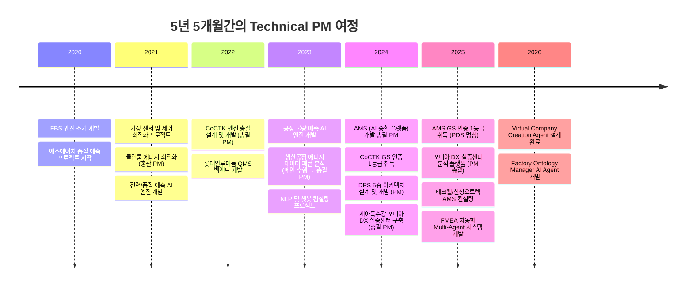
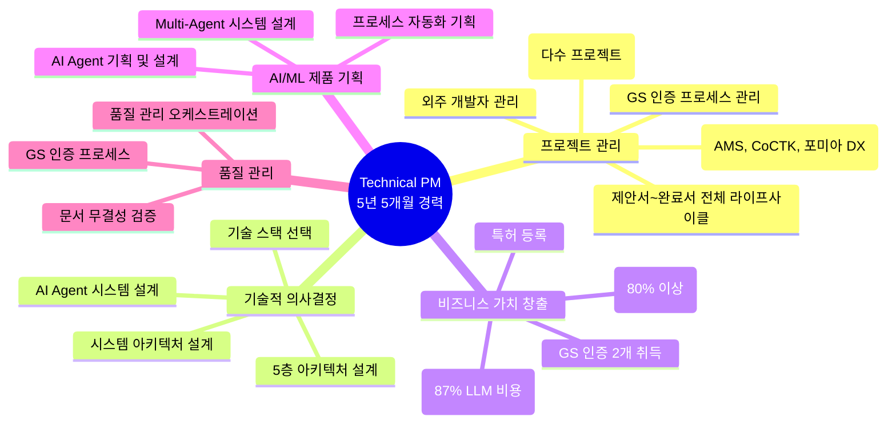
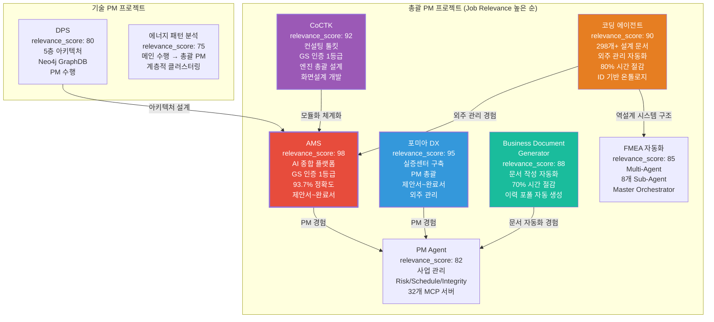
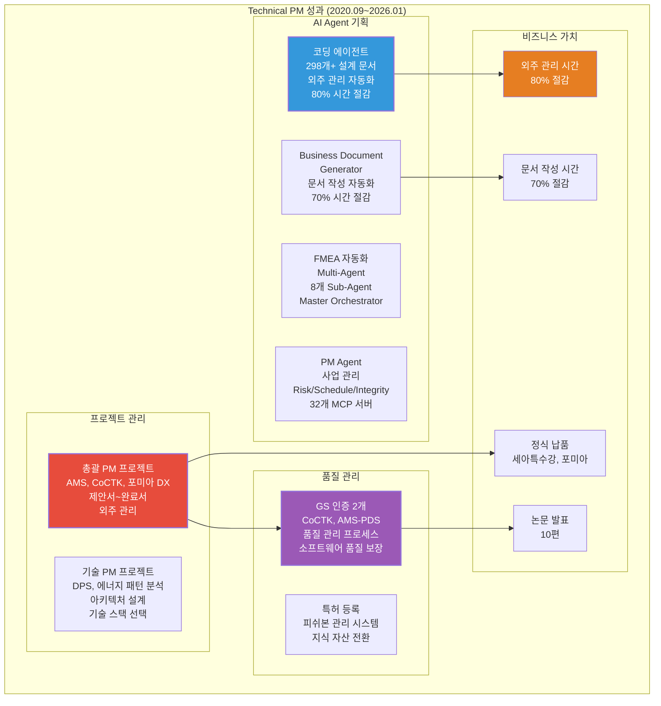

# 권순룡 이력서 - Technical PM / Product Manager (AI/ML 제품)

## 기본 정보

**이름**: 권순룡  
**현 소속**: 한솔코에버 연구소 대리 (2020.09 ~ 재직중)  
**총 경력**: 5년 5개월 (2020.09~2026.01)  
**핵심 역량**: AI/ML 제품 기획 및 개발 총괄, 프로젝트 라이프사이클 관리, 기술적 의사결정, 비즈니스 가치 창출, 외주 개발자 관리, GS 인증 프로세스 관리  
**이메일**: m920831@naver.com  
**연락처**: 010-5671-6200  
**GitHub**: https://github.com/moobaek

---

## 한눈에 보는 경력 (2020-2026)

---

## 지원 동기

AI/ML 제품을 기획하고 개발을 이끄는 Technical PM 역할에 기여하고자 지원합니다.

5년 5개월간의 경험을 통해 기술적 깊이와 프로젝트 관리 역량을 동시에 갖춘 Technical PM으로 성장했습니다. 특히 **AI 종합 플랫폼 개발 총괄 PM**으로 프로젝트 전체 라이프사이클을 관리하며, 제안서 작성부터 완료서 작성, 외주 관리, GS 인증 취득까지 전 과정을 책임졌습니다.

**프로젝트 관리 역량**을 구체적으로 설명하면, AMS 프로젝트에서 제안서 작성부터 완료서 작성까지 전체 라이프사이클을 관리했습니다. 기술적 설계뿐만 아니라 외주 관리, 일정 관리, 품질 관리까지 전 과정을 책임졌으며, GS 인증 1등급 취득을 위해 품질 관리 프로세스를 수립하고 실시했습니다. 세아특수강 포미아 DX 실증센터 구축 프로젝트에서는 총괄 PM으로 제안서 작성, 계획서 작성, 외주 관리, 완료서 작성까지 전체를 담당했습니다.

**기술적 의사결정 능력**으로는 AI Agent 시스템 설계, 시스템 아키텍처 설계, 기술 스택 선택 등 핵심 기술 결정을 주도했습니다. 코딩 에이전트 개발을 통해 외주 개발자 산출물 관리 문제를 해결했으며, ID 기반 온톨로지 맵, Phase 0-13 워크플로우, LangGraph/CrewAI 오케스트레이션을 설계했습니다. DPS 프로젝트에서는 5층 아키텍처를 설계하여 Microservices 기반 데이터 수집 시스템을 구축했습니다.

**비즈니스 가치 창출** 경험으로는 외주 개발자 관리 시간을 80% 이상 절감하고, 문서 작성 시간을 70% 이상 절감하는 등 실질적인 비즈니스 가치를 창출했습니다. GS 인증 2개(CoCTK, AMS-PDS)를 취득하고, 특허를 등록하는 등 프로젝트 관리 역량을 입증했습니다.

이러한 경험을 바탕으로 AI/ML 제품을 기획하고 개발을 이끄는 Technical PM으로 기여하고자 합니다.

---

## 핵심 역량 맵

---

## 핵심 역량

### 프로젝트 전체 라이프사이클 관리

AI 종합 플랫폼 개발 총괄 PM으로 프로젝트 전체 라이프사이클을 관리했습니다. 제안서 작성부터 완료서 작성, 외주 관리, 일정 관리, 품질 관리까지 전 과정을 책임졌습니다.

**AMS 프로젝트 (2024.07~2025.12)**에서는 제안서 작성부터 완료서 작성까지 전체 라이프사이클을 관리했습니다. 기술적 설계뿐만 아니라 외주 관리, 일정 관리, 품질 관리까지 전 과정을 책임졌으며, GS 인증 1등급 취득을 위해 품질 관리 프로세스를 수립하고 실시했습니다. 베이지안 네트워크 기반 이상 탐지 모델을 개발하여 93.7%의 정확도를 달성했으며, 특허를 등록하고 논문을 발표하는 등 프로젝트의 기술적 성과와 비즈니스 가치를 동시에 달성했습니다.

**세아특수강 포미아 DX 실증센터 구축 프로젝트 (2025.06~2025.10)**에서는 총괄 PM으로 제안서 작성, 계획서 작성, 외주 관리, 완료서 작성까지 전체를 담당했습니다. 세아특수강 등 하위 과제를 포함하여 맞춤형 솔루션을 기획하고 실행했으며, 데이터 연동, POP 프로그램, 철강 5대공정 데이터 분석 등 다양한 기술적 요구사항을 관리했습니다.

**CoCTK 프로젝트 (2022.03~2024)**에서는 엔진 총괄 설계 및 화면설계 개발 총괄 PM으로 데이터 전처리, 상관관계 분석, 비용 최적화 엔진을 개발했습니다. GS 인증 1등급을 취득하여 소프트웨어 품질을 인증받았으며, 2023년 논문으로 발표했습니다.

### 기술적 의사결정 및 시스템 설계

기술적 깊이를 바탕으로 AI Agent 시스템 설계, 시스템 아키텍처 설계, 기술 스택 선택 등 핵심 기술 결정을 주도했습니다.

**코딩 에이전트 개발**을 통해 외주 개발자 산출물 관리 문제를 해결했습니다. 47개 프로젝트를 수행하면서 겪은 외주 개발자 산출물 관리 문제를 해결하기 위해 ID 기반 온톨로지 맵, Phase 0-13 워크플로우, LangGraph/CrewAI 오케스트레이션을 설계했습니다. 298개+ 설계 문서를 ID 시스템 기반으로 체계적 관리하여 외주 개발자 관리 시간을 80% 이상 절감했습니다.

**DPS 프로젝트**에서는 5층 아키텍처를 설계하여 Microservices 기반 데이터 수집 시스템을 구축했습니다. 첫 번째 계층인 보안 및 관리 Layer부터 다섯 번째 계층인 서비스 및 UI Layer까지 전체 아키텍처를 설계했으며, Neo4j 그래프 DB를 활용한 온톨로지 기반 관계 분석을 구현했습니다.

**FMEA 자동화 Multi-Agent 시스템**을 설계하여 8개의 독립 Sub-Agent가 협업하는 구조를 구현했습니다. Claude Sub-Agent 기반 Multi-Agent Workflow를 설계하고, Master Orchestrator가 전체 워크플로우를 조율하는 구조를 구현했습니다. Python 스크립트 없이 Claude Code 세션 자체가 Orchestrator 역할을 담당하며, 프롬프트 기반 완전 자동화로 개발 복잡성을 감소시켰습니다.

### 비즈니스 가치 창출 및 성과 관리

프로젝트의 비즈니스 가치를 창출하고 성과를 관리하는 역량을 보유하고 있습니다.

**외주 개발자 관리 자동화**를 통해 외주 개발자 관리 시간을 80% 이상 절감했습니다. ID 기반 온톨로지 맵 문서 시스템을 구축하여 298개+ 설계 문서를 체계적으로 관리했으며, 외주 개발자의 산출물을 자동으로 추적 및 검증하는 시스템을 구현했습니다.

**문서 작성 자동화**를 통해 문서 작성 시간을 70% 이상 절감했습니다. Business Document Generator를 개발하여 사업계획서, 제안서, 착수보고서를 자동으로 생성하는 시스템을 구축했습니다. 요구조건 문서 파싱, 포트폴리오 스마트 매칭, 발주처 유형별 페르소나 적용 등으로 문서 일관성을 100% 보장했습니다.

**GS 인증 2개 취득**을 통해 프로젝트 관리 역량을 입증했습니다. CoCTK와 AMS-PDS에서 GS 인증 1등급을 취득했으며, 특허를 등록하는 등 프로젝트의 기술적 성과를 지식 자산으로 전환했습니다.

### 외주 개발자 관리 및 협업

외주 개발자와의 협업을 효율적으로 관리하는 역량을 보유하고 있습니다.

**외주 개발자 산출물 관리**를 자동화하여 외주 개발자의 산출물을 체계적으로 관리했습니다. ID 기반 온톨로지 맵 문서 시스템을 구축하여 모든 요소에 고유 ID를 부여하고, 문서 간 관계를 추적하며, 의존성을 관리했습니다. Phase 0-13 워크플로우를 자동화하여 설계부터 개발까지 전체 라이프사이클을 관리했습니다.

**외주 개발자와의 커뮤니케이션**을 효율적으로 관리했습니다. 기술적 설계 문서를 작성하여 외주 개발자가 이해하기 쉽도록 했으며, 개발 진행 상황을 실시간으로 모니터링하고 피드백을 제공했습니다. 품질 관리 오케스트레이션을 통해 Agent 평가 → 무결성 검사 → 최종 사용자 확인 단계를 자동화했습니다.

---

## 프로젝트 관계도

---

## 경력 개요

### 한솔코에버 연구소 (2020.09 ~ 재직중)

**직급**: 대리  
**부서**: 연구소  
**총 경력**: 5년 5개월 (2020.09~2026.01)

**주요 업무**:
- **프로젝트 전체 라이프사이클 관리**: 제안서 작성부터 완료서 작성, 외주 관리, 일정 관리, 품질 관리까지 전 과정 책임 (AMS, CoCTK, 포미아 DX 등 총괄 PM)
- **AI/ML 제품 기획 및 개발 총괄**: AI Agent 시스템 설계, 시스템 아키텍처 설계, 기술 스택 선택 등 핵심 기술 결정 주도
- **외주 개발자 관리 및 협업**: 외주 개발자 산출물 관리 자동화, ID 기반 온톨로지 맵 문서 시스템 구축, Phase 0-13 워크플로우 자동화
- **비즈니스 가치 창출**: 외주 개발자 관리 시간 80% 이상 절감, 문서 작성 시간 70% 이상 절감, GS 인증 2개 취득, 특허 등록
- **품질 관리**: GS 인증 프로세스 수립 및 실시, 품질 관리 오케스트레이션, 문서 무결성 검증

**핵심 성과**:
- ✅ **총괄 PM 프로젝트**: AMS, CoCTK, 포미아 DX 등 총괄 PM으로 프로젝트 전체 라이프사이클 관리
- ✅ **GS 인증 2개 취득**: CoCTK (2024), AMS-PDS (2025) - 품질 관리 프로세스 수립 및 실시
- ✅ **특허 등록**: 피쉬본 관리 시스템 특허 등록
- ✅ **외주 개발자 관리 자동화**: 코딩 에이전트 개발로 외주 개발자 관리 시간 80% 이상 절감, 298개+ 설계 문서 체계적 관리
- ✅ **문서 작성 자동화**: Business Document Generator 개발로 문서 작성 시간 70% 이상 절감, 이력 포폴 자동 생성
- ✅ **AI Agent 기획 및 설계**: 코딩 에이전트, FMEA 자동화, PM Agent 등 9개 이상 AI Agent 기획 및 설계
- ✅ **정식 납품**: 세아특수강 포미아 DX 실증센터, 테크웰/신성오토텍 AMS 컨설팅 등 정식 납품
- ✅ **학술 논문 발표 10편**: 2020-2025년, AI/ML 제품 개발 분야
- ✅ **47개 이상 프로젝트 수행**: 다양한 프로젝트에서 총괄 PM 및 기술 PM 역할 수행

**비즈니스 임팩트**:
- 외주 개발자 관리 시간 80% 이상 절감 (코딩 에이전트 활용)
- 문서 작성 시간 70% 이상 절감 (Business Document Generator)
- GS 인증 2개 취득으로 프로젝트 품질 보장

---

## 주요 프로젝트 경험

### 1. AMS (Analysis Management System) - AI 종합 플랫폼 개발 총괄 PM

**기간**: 2024.07 ~ 2025.12  
**발주처**: 한국산업기술진흥원  
**역할**: AI 종합 플랫폼 개발 총괄 PM  
**relevance_score**: 98

**핵심 성과**:
- ✅ **프로젝트 전체 라이프사이클 관리**: 제안서 작성부터 완료서 작성, 외주 관리, 일정 관리, 품질 관리까지 전 과정 책임
- ✅ **GS 인증 1등급 취득**: PDS 명칭으로 소프트웨어 품질 인증 획득
- ✅ **베이지안 네트워크 기반 이상 탐지 모델 개발**: 이상탐지율 93.7% 달성 (실질적 정확도 60~70%, 데이터 한계 고려)
- ✅ **특허 등록**: 피쉬본 관리 시스템 특허 등록
- ✅ **정식 납품**: 세아특수강 포미아 DX 실증센터 구축 (PM), 테크웰/신성오토텍 AMS 컨설팅
- ✅ **논문 발표**: 2025, 2024년 논문 발표

**기술 스택**: Python, Neo4j, Docker, Kubernetes, 베이지안 네트워크, 시계열 분석, Flask/FastAPI

**상세 설명**:
AMS는 제조 현장의 설비 이상을 자동으로 탐지하고 분석하는 AI 종합 플랫폼입니다. 총괄 PM으로 프로젝트 전체 라이프사이클을 관리했으며, 기술적 설계뿐만 아니라 외주 관리, 일정 관리, 품질 관리까지 전 과정을 책임졌습니다.

**제안서 작성 단계**: 기술적 요구사항을 분석하고, 시스템 아키텍처를 설계했습니다. 8단계 시계열 데이터 파이프라인, 베이지안 네트워크 기반 이상 탐지 모델, Neo4j 그래프 DB 활용 등 핵심 기술을 제안했습니다.

**개발 단계**: 외주 개발자와 협업하여 베이지안 네트워크 기반 이상 탐지 모델을 개발했으며, 8단계 시계열 데이터 파이프라인을 구축했습니다. 코딩 에이전트를 활용하여 외주 개발자 산출물을 체계적으로 관리했습니다.

**검증 단계**: GS 인증 프로세스를 수립하고 실시하여 GS 인증 1등급을 취득했습니다. 품질 관리 프로세스를 통해 소프트웨어 품질을 보장했습니다.

**비즈니스 가치**: 이상 탐지율 93.7%를 달성했으며, 세아특수강, 포미아 등에 정식 납품했습니다. 특허를 등록하고 논문을 발표하는 등 프로젝트의 기술적 성과와 비즈니스 가치를 동시에 달성했습니다.

---

### 2. 세아특수강 포미아 DX 실증센터 구축 - 총괄 PM

**기간**: 2025.06 ~ 2025.10  
**발주처**: POMIA (재단법인 포항소재산업진흥원)  
**역할**: PM 총괄 (제안서~완료까지 전체 진행)  
**relevance_score**: 95

**핵심 성과**:
- ✅ **제안서 작성**: 포미아 DX 실증센터 구축 제안서 작성
- ✅ **계획서 작성**: 프로젝트 계획서 작성 및 승인
- ✅ **외주 관리**: 세아특수강 등 하위 과제 외주 개발자 관리
- ✅ **완료서 작성**: 프로젝트 완료서 작성 및 납품
- ✅ **맞춤형 솔루션 기획**: 철강 5대공정 데이터 분석 등 맞춤형 솔루션 기획

**기술 스택**: 데이터 연동, POP 프로그램, 철강 5대공정 데이터 분석, 하이브리드 인프라, RS232C-LAN 변환, Lot 매칭

**상세 설명**:
포미아 DX 실증센터 구축 프로젝트에서는 총괄 PM으로 제안서 작성부터 완료서 작성까지 전체를 담당했습니다. 세아특수강 등 하위 과제를 포함하여 맞춤형 솔루션을 기획하고 실행했습니다.

**제안서 작성 단계**: 포미아 DX 실증센터의 요구사항을 분석하고, 데이터 연동, POP 프로그램, 철강 5대공정 데이터 분석 등 맞춤형 솔루션을 기획했습니다.

**계획서 작성 단계**: 프로젝트 일정을 수립하고, 외주 개발자를 선정했습니다. 세아특수강 등 하위 과제의 일정을 통합 관리했습니다.

**외주 관리 단계**: 세아특수강 등 하위 과제의 외주 개발자와 협업하여 데이터 연동, POP 프로그램 개발 등을 진행했습니다. 계열사 브이엔티지 LOT + 직진도 검사결과 + 생산정보 매칭 → SPC 생성을 구현했습니다.

**완료서 작성 단계**: 프로젝트 완료서를 작성하고 납품했습니다. 데이터 통합 및 POP/SPC 개발을 완료했습니다.

**비즈니스 가치**: 이 프로젝트를 통해 PM 경험(제안서~완료, 외주 관리)을 쌓아 PM Agent 설계의 토대를 마련했습니다.

---

### 3. CoCTK (Consulting Tool Kit) - 엔진 총괄 설계 및 화면설계 개발 총괄 PM

**기간**: 2022.03 ~ 2024  
**발주처**: 중소기업기술정보진흥원  
**역할**: 엔진 총괄 설계 & 화면설계 개발 총괄 PM  
**relevance_score**: 92

**핵심 성과**:
- ✅ **데이터 전처리, 상관관계 분석, 비용 최적화 엔진 개발**: 제조 현장 데이터 분석 플랫폼 구축
- ✅ **GS 인증 1등급 취득**: 2024년 소프트웨어 품질 인증 획득
- ✅ **논문 발표**: 2023년 논문 발표

**기술 스택**: Python, 데이터 전처리, 상관관계 분석, 비용 최적화, Qt, 풀스택 개발

**상세 설명**:
CoCTK는 제조 현장의 데이터를 분석하고 최적화 방안을 제시하는 컨설팅 도구입니다. 총괄 PM으로 엔진 총괄 설계 및 화면설계 개발을 담당했습니다.

**엔진 총괄 설계**: 사업 시작 전 판별 컨설팅 도구로, 소량 데이터로 학습 가능성, 중요 순위, 상관분석, 시계열 예측 가능성, feature-결과 추론 등을 종합 판별합니다. 데이터 전처리, 상관관계 분석, 비용 최적화 엔진을 개발하여 제조 현장의 복잡한 데이터를 분석하고, 최적화 방안을 자동으로 도출하는 시스템을 구축했습니다.

**화면설계 개발 총괄 PM**: 사용자 경험을 고려한 화면 설계를 진행했으며, 백엔드와의 연동을 구현했습니다. Qt를 활용하여 사용자 인터페이스를 개발했습니다.

**GS 인증 프로세스**: GS 인증 1등급을 취득하기 위해 품질 관리 프로세스를 수립하고 실시했습니다. 소프트웨어 품질을 인증받았으며, 2023년 논문으로 발표했습니다.

**비즈니스 가치**: CoCTK와 이후 개념들이 모듈화/체계화되어 AMS AI 모듈의 기초가 되었습니다.

---

### 4. 코딩 에이전트 개발 - 외주 개발자 관리 문제 해결

**기간**: 2020~2025 (집중 개발: 2025.5~7, 2025.8~10, 2025.10~12)  
**발주처**: 내부 개발  
**역할**: 시스템 설계 및 개발 총괄  
**relevance_score**: 90

**핵심 성과**:
- ✅ **외주 개발자 산출물 관리 자동화**: 298개+ 설계 문서를 ID 시스템 기반으로 체계적 관리
- ✅ **외주 개발자 관리 시간 80% 이상 절감**: 자동화 시스템 구축으로 관리 시간 대폭 절감
- ✅ **ID 기반 온톨로지 맵 문서 시스템**: 모든 요소에 고유 ID 부여로 문서 간 관계 추적, 의존성 관리
- ✅ **Phase 0-13 워크플로우 자동화**: 설계부터 개발까지 전체 라이프사이클 자동화
- ✅ **LangGraph/CrewAI 방식 워크플로우 오케스트레이션**: State 기반 정보 전달, 상태 기반 진행 모니터링 및 완료 조건 판단 시스템

**기술 스택**: Python, ID 기반 온톨로지 맵, Phase 워크플로우, LangGraph, CrewAI, Few-shot Learning, Testing Framework

**상세 설명**:
코딩 에이전트는 외주 개발자 산출물 관리 문제를 해결하기 위해 개발한 시스템입니다. 47개 프로젝트를 수행하면서 겪은 외주 개발자가 개발 산출물을 전혀 관리하지 않는 문제를 해결하기 위해 ID 기반 온톨로지 맵 문서 시스템을 구축했습니다.

**ID 기반 온톨로지 맵 문서 시스템**: 모든 요소에 고유 ID를 부여하여 문서 간 관계를 추적하고, 의존성을 관리했습니다. 298개+ 설계 문서를 ID 시스템 기반으로 체계적 관리하여 외주 개발자의 산출물을 자동으로 추적 및 검증하는 시스템을 구현했습니다.

**Phase 0-13 워크플로우 자동화**: 설계부터 개발까지 전체 라이프사이클을 관리했으며, LangGraph/CrewAI 방식 워크플로우 오케스트레이션을 구현하여 State 기반 정보 전달, 상태 기반 진행 모니터링 및 완료 조건 판단 시스템을 구축했습니다.

**28개 Few-shot Rules System**: 8개 도메인(design/api/database/component/state/security/performance/testing)에 대해 28개의 Few-shot 규칙을 정의하여 코드 품질을 자동으로 검증합니다.

**4단계 Testing Workflow**: Mock Setup → Unit → Integration → E2E의 4단계 테스트 워크플로우를 설계하여 테스트 프로세스를 자동화했습니다.

**비즈니스 가치**: 외주 개발자 관리 시간을 80% 이상 절감했으며, 납품 프로젝트를 성공적으로 완료했습니다. 이 경험이 FMEA 자동화 에이전트, PM Agent, Factory Ontology Manager 등 다른 AI Agent 설계의 기초가 되었습니다.

---

### 5. FMEA 자동화 Multi-Agent 시스템 - Master Orchestrator 설계

**기간**: 2025.06 ~ 진행중  
**발주처**: 내부 개발  
**역할**: Master Orchestrator 설계 및 Multi-Agent Workflow 구현  
**relevance_score**: 85

**핵심 성과**:
- ✅ **Multi-Agent Workflow 설계**: Claude Sub-Agent 기반 8개 독립 Sub-Agent 협업 구조 구현
- ✅ **코딩 에이전트 역설계 시스템 구조 적용**: AIAG & VDA FMEA 표준 기반 범용 리스크 분석 시스템 개발
- ✅ **Phase 0~5 자동화 워크플로우**: FMEA 생성 프로세스 전 과정 자동화
- ✅ **공장 관리자 이해도 90% 이상 향상**: FMEA 형식으로 변환하여 기술 설명 시간 70% 이상 절감
- ✅ **논문 발표**: 2025년 논문 발표

**기술 스택**: Python, Claude Agent, Multi-Agent System, MCP, RAG, LangGraph, CrewAI

**상세 설명**:
FMEA 자동화 시스템은 제조 현장의 리스크 분석을 자동화하는 Multi-Agent 시스템입니다. 코딩 에이전트의 역설계 시스템 구조를 적용하여 복잡한 FMEA 프로세스를 역으로 분석하여 8개 Sub-Agent로 분해했습니다.

**Master Orchestrator 설계**: Claude Sub-Agent 기반으로 8개의 독립 Sub-Agent(R&D, Mfg, QA 등)가 협업하는 구조를 설계했으며, AIAG & VDA FMEA 표준을 기반으로 범용 리스크 분석 시스템을 개발했습니다. Master Orchestrator가 전체 워크플로우를 조율하는 구조로, Python 스크립트 없이 Claude Code 세션 자체가 Orchestrator 역할을 담당합니다.

**Phase 0~5 자동화 워크플로우**: FMEA 생성 프로세스 전 과정을 자동화하여 리스크 분석 시간을 대폭 단축했습니다. 각 Phase는 명확한 입력과 출력을 가지며, 상태 기반 진행 모니터링을 통해 각 단계의 완료 조건을 자동으로 판단합니다.

**비즈니스 가치**: 테크웰/신성오토텍에서 FBS, 패턴 분석, 확률 네트워크가 너무 난해해서 공장 관리자가 이해하지 못하는 문제를 FMEA 형식으로 변환하여 해결했습니다. 공장 관리자 이해도가 90% 이상 향상했으며, 기술 설명 시간을 70% 이상 절감했습니다.

---

### 6. Business Document Generator - 문서 작성 자동화 시스템

**기간**: 2025.12 ~ 진행중  
**발주처**: 내부 개발  
**역할**: 시스템 설계 및 개발 총괄

**핵심 성과**:
- ✅ **문서 작성 시간 70% 이상 절감**: 사업계획서, 제안서, 착수보고서 자동 생성
- ✅ **문서 일관성 100% 보장**: 템플릿 기반 자동 생성으로 일관성 보장
- ✅ **이력 포폴 자동 생성**: 포트폴리오 기반 이력서 자동 생성
- ✅ **발주처 유형별 페르소나 적용**: 정부/민간/공공기관 등 발주처 유형에 맞는 문서 스타일 자동 적용

**기술 스택**: Claude Agent, Multi-Step Chain Workflow, Role-based Expert Personas, Mermaid Diagram Generation, PDF Conversion, PM Agent 통합

**상세 설명**:
Business Document Generator는 사업계획서, 제안서, 착수보고서를 자동으로 생성하는 시스템입니다. 2023년부터 한솔코에버 AI 쪽 사업계획은 사용자의 손을 안 거친 게 없을 정도로 많은 문서를 작성해야 했던 경험을 바탕으로 개발했습니다.

**요구조건 문서 파싱**: 요구조건 문서 및 Architecture 파일을 파싱하여 핵심 정보를 추출합니다.

**포트폴리오 스마트 매칭**: 포트폴리오를 스마트하게 매칭하여 관련 경험 및 기술을 자동으로 매칭합니다.

**발주처 유형별 페르소나 적용**: 발주처 유형별(정부/민간/공공기관) 페르소나를 적용하여 발주처 유형에 맞는 문서 스타일을 자동으로 적용합니다.

**청크 기반 생성**: 긴 문서를 청크 단위로 생성하여 품질을 향상시킵니다.

**PM 통합 검증**: PM Agent와 통합하여 문서 무결성을 검증합니다.

**이력 포폴 자동 생성**: 포트폴리오 기반 이력서 및 포트폴리오 자동 생성 기능을 제공합니다.

**비즈니스 가치**: 문서 작성 시간을 70% 이상 절감했으며, 문서 일관성을 100% 보장했습니다.

---

## 기술 스택

### 프로젝트 관리 도구
- **프로젝트 관리**: 5년 5개월 경력 (2020.09~2026.01)
  - 제안서 작성, 계획서 작성, 외주 관리, 완료서 작성 (AMS, CoCTK, 포미아 DX 등)
- **품질 관리**: 3년 경력 (2022~2025)
  - GS 인증 프로세스, 품질 관리 오케스트레이션 (CoCTK, AMS)
- **문서 관리**: 1년 경력 (2025~2026)
  - ID 기반 온톨로지 맵, 298개+ 설계 문서 체계화 (코딩 에이전트)

### 시스템 설계
- **아키텍처 설계**: 3년 경력 (2021~2024)
  - 5층 아키텍처, Microservices 아키텍처 (DPS)
- **AI Agent 설계**: 1년 경력 (2025~2026)
  - Multi-Agent 시스템, LangGraph/CrewAI 오케스트레이션 (FMEA 자동화, 코딩 에이전트)
- **워크플로우 설계**: 1년 경력 (2025~2026)
  - Phase 0-13 워크플로우, State 기반 정보 전달 (코딩 에이전트)

### 기술 스택 선택 및 의사결정
- **데이터베이스**: 5년 5개월 경력 (2020.09~2026.01)
  - Neo4j GraphDB, MSSQL Server, PostgreSQL (모든 프로젝트)
- **인프라**: 3년 경력 (2022~2025)
  - Docker, Kubernetes, Microservices (AMS, DPS)
- **AI/ML**: 5년 5개월 경력 (2020.09~2026.01)
  - 베이지안 네트워크, 시계열 분석, Multi-Agent 시스템 (AMS, FMEA 자동화 등)

---

## 성과 대시보드

### 정량적 성과 요약

| 분류 | 지표 | 수치 | 세부 내용 |
|:---|---:|:---|:---|
| **프로젝트 관리** | 총괄 PM 프로젝트 | 3개+ | AMS, CoCTK, 포미아 DX |
| | 기술 PM 프로젝트 | 2개+ | DPS, 에너지 패턴 분석 |
| | 전체 프로젝트 | 47개+ | 다양한 프로젝트에서 PM 역할 수행 |
| **AI Agent 기획** | 코딩 에이전트 | 1개 | 298개+ 설계 문서, 외주 관리 자동화 |
| | FMEA 자동화 | 1개 | Multi-Agent, 8개 Sub-Agent |
| | PM Agent | 1개 | 사업 관리, 32개 MCP 서버 |
| | Business Document Generator | 1개 | 문서 작성 자동화 |
| **품질 관리** | GS 인증 | 2개 | CoCTK (2024), AMS-PDS (2025) |
| | 특허 등록 | 1개 | 피쉬본 관리 시스템 |
| | 논문 발표 | 10편 | 2020-2025년 |
| **비즈니스 가치** | 외주 관리 시간 절감 | 80% | 코딩 에이전트 활용 |
| | 문서 작성 시간 절감 | 70% | Business Document Generator |
| | 정식 납품 | 3곳+ | 세아특수강, 포미아 등 |

---

## 학력

**홍익대학교 전자공학과** (2013.03 ~ 2020.02)
- 학점: 3.11 / 4.5
- 졸업논문: LD 동격회로 설계 및 PLL 설계
- 주요 수강 분야: 회로 설계, 전파공학, 컴퓨터공학

---

## 자격증

**OPIc** (2019.03)
- ACT FL (American Council on the Teaching of Foreign Languages)

---

## 핵심 철학

> **"기술을 이해하는 PM, 비즈니스 가치를 창출하는 Technical PM"**

5년 5개월간의 경험을 통해 기술적 깊이와 프로젝트 관리 역량을 동시에 갖춘 Technical PM으로 성장했습니다. 단순한 프로젝트 관리자를 넘어, 기술적 의사결정을 주도하고 비즈니스 가치를 창출하는 Technical PM 역할을 수행합니다.

현장의 문제는 현장의 언어로 풀어야 합니다. 기술적 완성도뿐만 아니라 비즈니스 가치 창출을 중시하며, 외주 개발자 관리, 문서 작성 자동화 등을 통해 실질적인 비즈니스 가치를 창출합니다. 이러한 철학을 바탕으로 47개 이상의 프로젝트를 성공적으로 수행했으며, GS 인증 2개를 취득하고 특허를 등록하는 등 지속적인 성장을 이루어왔습니다.

프로젝트 관리는 단순히 일정을 관리하는 것이 아니라, 기술적 의사결정을 주도하고 비즈니스 가치를 창출하는 것입니다. 코딩 에이전트를 개발하여 외주 개발자 관리 시간을 80% 절감했으며, Business Document Generator를 개발하여 문서 작성 시간을 70% 절감했습니다. 이러한 자동화를 통해 프로젝트의 효율성을 극대화하고 비즈니스 가치를 창출하고 있습니다.

---

## 자기소개서

### 지원동기

AI/ML 제품을 기획하고 개발을 이끄는 Technical PM 역할에 기여하고자 지원합니다.

5년 5개월간의 경험을 통해 기술적 깊이와 프로젝트 관리 역량을 동시에 갖춘 Technical PM으로 성장했습니다. 특히 **AI 종합 플랫폼 개발 총괄 PM**으로 프로젝트 전체 라이프사이클을 관리하며, 제안서 작성부터 완료서 작성, 외주 관리, GS 인증 취득까지 전 과정을 책임졌습니다.

프로젝트 관리 역량을 구체적으로 설명하면, AMS 프로젝트에서 제안서 작성부터 완료서 작성까지 전체 라이프사이클을 관리했습니다. 기술적 설계뿐만 아니라 외주 관리, 일정 관리, 품질 관리까지 전 과정을 책임졌으며, GS 인증 1등급 취득을 위해 품질 관리 프로세스를 수립하고 실시했습니다. 세아특수강 포미아 DX 실증센터 구축 프로젝트에서는 총괄 PM으로 제안서 작성, 계획서 작성, 외주 관리, 완료서 작성까지 전체를 담당했습니다.

기술적 의사결정 능력으로는 AI Agent 시스템 설계, 시스템 아키텍처 설계, 기술 스택 선택 등 핵심 기술 결정을 주도했습니다. 코딩 에이전트 개발을 통해 외주 개발자 산출물 관리 문제를 해결했으며, ID 기반 온톨로지 맵, Phase 0-13 워크플로우, LangGraph/CrewAI 오케스트레이션을 설계했습니다. DPS 프로젝트에서는 5층 아키텍처를 설계하여 Microservices 기반 데이터 수집 시스템을 구축했습니다.

비즈니스 가치 창출 경험으로는 외주 개발자 관리 시간을 80% 이상 절감하고, 문서 작성 시간을 70% 이상 절감하는 등 실질적인 비즈니스 가치를 창출했습니다. GS 인증 2개(CoCTK, AMS-PDS)를 취득하고, 특허를 등록하는 등 프로젝트 관리 역량을 입증했습니다.

이러한 경험을 바탕으로 AI/ML 제품을 기획하고 개발을 이끄는 Technical PM으로 기여하고자 합니다.

### 경력기술(경력목표 포함)

2020년부터 현재까지 5년 5개월간 AI/ML 제품 기획 및 개발 총괄 PM으로 다양한 프로젝트를 수행했습니다.

주요 경력으로는 AMS(Analysis Management System) 개발 총괄 PM으로 프로젝트 전체 라이프사이클을 관리하며, 베이지안 네트워크 기반 이상 탐지 모델을 개발하여 93.7%의 정확도를 달성하고, GS 인증 1등급을 취득했습니다. 또한 세아특수강 포미아 DX 실증센터 구축 프로젝트에서 총괄 PM으로 제안서 작성부터 완료서 작성까지 전체를 담당했습니다. CoCTK 프로젝트에서는 엔진 총괄 설계 및 화면설계 개발 총괄 PM으로 데이터 전처리, 상관관계 분석, 비용 최적화 엔진을 개발하여 GS 인증 1등급을 취득했습니다.

코딩 에이전트 개발을 통해 외주 개발자 산출물 관리 문제를 해결했으며, ID 기반 온톨로지 맵, Phase 0-13 워크플로우, LangGraph/CrewAI 오케스트레이션을 설계했습니다. FMEA 자동화 Multi-Agent 시스템을 설계하여 8개의 독립 Sub-Agent가 협업하는 구조를 구현했습니다. Business Document Generator를 개발하여 문서 작성 시간을 70% 이상 절감했습니다.

**경력목표**: 단기적으로는 AI/ML 제품을 기획하고 개발을 이끄는 Technical PM 역할을 수행하며, 장기적으로는 기술과 비즈니스를 연결하는 역할을 수행하는 것이 목표입니다. 또한 프로젝트 관리 역량을 더욱 발전시켜 복잡한 AI 시스템을 성공적으로 이끄는 Technical PM으로 성장하고자 합니다.

### 입사 후 기여방안

프로젝트 전체 라이프사이클 관리 경험을 바탕으로 AI/ML 제품 개발 프로젝트를 성공적으로 이끌겠습니다. 제안서 작성부터 완료서 작성, 외주 관리, 일정 관리, 품질 관리까지 전 과정을 책임지며, GS 인증 프로세스 경험을 활용하여 프로젝트의 품질을 보장하겠습니다.

기술적 의사결정 능력을 활용하여 AI Agent 시스템 설계, 시스템 아키텍처 설계, 기술 스택 선택 등 핵심 기술 결정을 주도하겠습니다. 코딩 에이전트 개발 경험을 활용하여 개발 프로세스를 자동화하고, 외주 개발자 관리 시간을 절감하겠습니다. 또한 5층 아키텍처 설계 경험을 활용하여 확장 가능한 시스템 아키텍처를 제안하겠습니다.

비즈니스 가치 창출 경험을 활용하여 프로젝트의 비즈니스 가치를 창출하겠습니다. 외주 개발자 관리 자동화 경험을 활용하여 개발 프로세스를 효율화하고, 문서 작성 자동화 경험을 활용하여 문서화 프로세스를 자동화하겠습니다. 또한 GS 인증 취득 경험을 활용하여 프로젝트의 품질을 보장하겠습니다.

협업 및 커뮤니케이션 역량을 활용하여 팀원들과의 협업을 효율적으로 관리하겠습니다. 외주 개발자 관리 경험을 활용하여 외주 개발자와의 협업을 효율적으로 관리하고, 기술적 설계 문서 작성 경험을 활용하여 팀원들이 이해하기 쉬운 문서를 작성하겠습니다. 또한 현장 친화적인 기술 철학을 바탕으로 실용적이고 사용하기 쉬운 솔루션을 개발하여 팀의 생산성을 향상시키겠습니다.

---

© 2026 권순룡. All Rights Reserved.

*본 이력서는 Technical PM / Product Manager (AI/ML 제품) 직무에 특화되어 작성되었습니다.*
