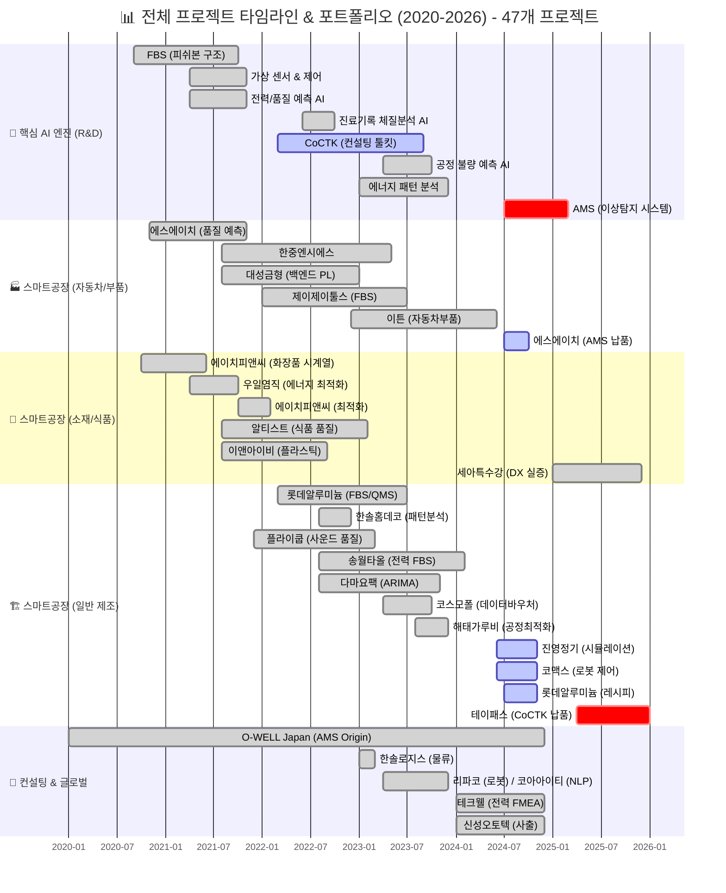
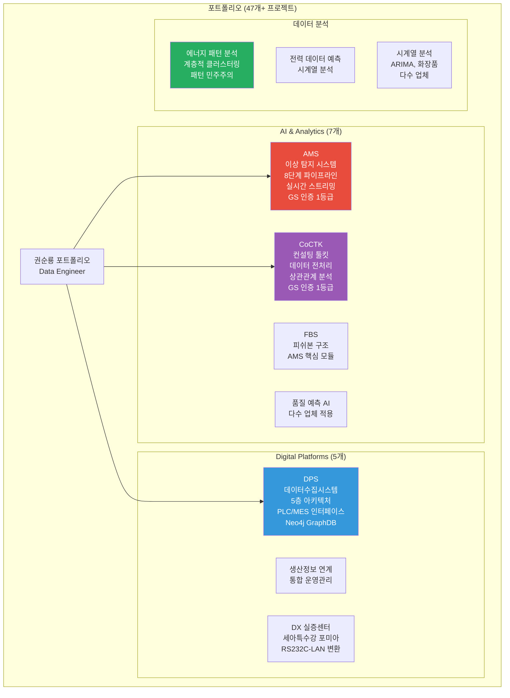
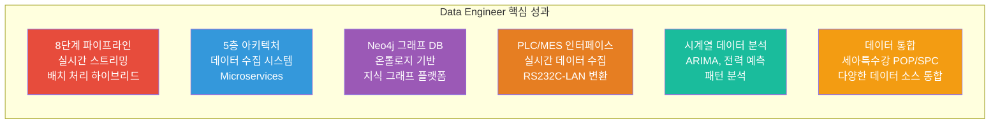
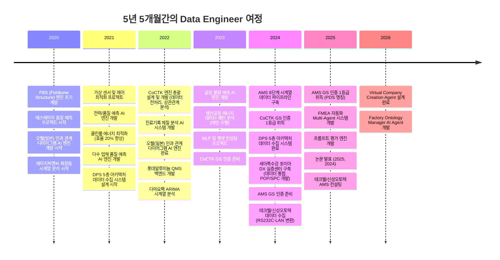
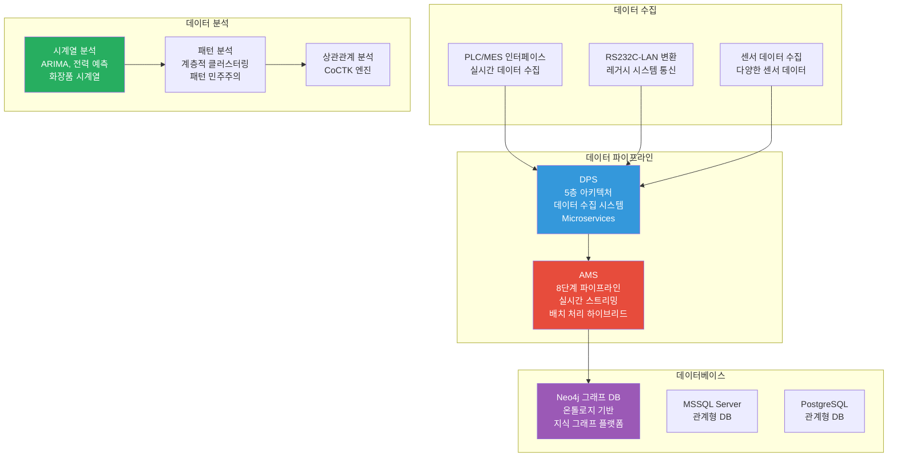

# 권순룡 포트폴리오 - Data Engineer / Analytics Engineer

> **"데이터 파이프라인을 구축하고 데이터를 분석하는 Data Engineer"**  
> **"모델보다 데이터, 데이터보다 정보, 지식구조를 정리하는 현장친화적 연구원"**

---

## 📌 기본 정보

**이름**: 권순룡  
**소속**: 한솔코에버 연구소 대리 (2020.09 ~ 재직중)  
**총 경력**: 5년 5개월 (2020.09~2026.01)  
**핵심 역량**: 데이터 파이프라인 구축, ETL 프로세스 설계, 시계열 데이터 분석, 데이터 수집 및 처리, 데이터베이스 설계 및 관리, Neo4j 그래프 DB, 실시간 스트리밍 처리, 배치 처리, PLC/MES 인터페이스, RS232C-LAN 변환  
**GitHub**: https://github.com/moobaek  
**이메일**: m920831@naver.com  
**연락처**: 010-5671-6200

---

## 📊 전체 프로젝트 타임라인 (2020-2026) - 47개 프로젝트



> [!INFO] **총 프로젝트 현황**
> - **AI & Analytics**: 7개 (AMS, CoCTK, FBS 등)
> - **스마트공장 구축**: 23개 (에스에이치아이엔티, 롯데알루미늄 등)
> - **컨설팅**: 8개 (테크웰, 신성오토텍 등)
> - **AI 에이전트**: 9개 (FMEA, PM Agent 등)

---

## 📊 포트폴리오 구조 (한눈에 보기)



---

## 🎯 핵심 Data Engineer 성과 대시보드



| 분류 | 지표 | 상세 |
|:---|---:|:---|
| **데이터 파이프라인** | 8단계 파이프라인 | 실시간 스트리밍 처리 및 배치 처리 하이브리드 |
| **데이터 수집 시스템** | 5층 아키텍처 | Microservices 기반 데이터 수집 시스템 |
| **데이터베이스** | Neo4j 그래프 DB | 온톨로지 기반 지식 그래프 플랫폼 |
| **데이터 수집** | PLC/MES 인터페이스 | 실시간 데이터 수집, RS232C-LAN 변환 |
| **데이터 분석** | 시계열 데이터 분석 | ARIMA, 전력 예측, 패턴 분석 |
| **데이터 통합** | 세아특수강 POP/SPC | 다양한 데이터 소스 통합 |

---

## 📅 경력 타임라인 (2020-2026)



---

## 🏆 주요 데이터 엔지니어링 프로젝트 (47개+)

### 프로젝트 관계도



### 1. AMS - 8단계 시계열 데이터 파이프라인 구축

**기간**: 2024.07 ~ 2025.12  
**발주처**: 한국산업기술진흥원  
**역할**: 데이터 파이프라인 구축 및 데이터 분석

**데이터 파이프라인 핵심**:
- ✅ **8단계 시계열 데이터 파이프라인**: 실시간 데이터 수집부터 이상 탐지까지 전 과정 자동화
- ✅ **실시간 스트리밍 처리 및 배치 처리 하이브리드 아키텍처**: 다양한 데이터 소스로부터 데이터 수집 및 처리
- ✅ **Neo4j 그래프 DB 활용**: 4M2E 관계 온톨로지 정의 및 지식 그래프 플랫폼 구축
- ✅ **데이터 품질 보장**: 데이터 검증 로직 포함, 이상한 데이터 미리 걸러냄
- ✅ **GS 인증 1등급 취득**: PDS 명칭으로 소프트웨어 품질 인증 획득
- ✅ **특허 등록**: 피쉬본 관리 시스템 특허 등록
- ✅ **정식 납품**: 세아특수강 포미아 DX 실증센터 구축, 테크웰/신성오토텍 AMS 컨설팅
- ✅ **논문 발표**: 2025, 2024년 논문 발표

**기술 스택**: Python, Neo4j, Docker, Kubernetes, Grafana, Prometheus, 베이지안 네트워크, 시계열 분석

**8단계 파이프라인 상세**:

```
1. 데이터 수집
   ↓ (검증 로직 포함)
2. 데이터 전처리
   ↓ (정규화 과정)
3. 데이터 변환
   ↓ (데이터 품질 보장)
4. 데이터 저장
   ↓ (Neo4j 그래프 DB)
5. 이상 탐지
   ↓ (베이지안 네트워크)
6. 관계 분석
   ↓ (4M2E 온톨로지)
7. 시각화
   ↓ (지식 그래프 플랫폼)
8. 알림 및 대응
```

**데이터 파이프라인 상세 설명**:
AMS는 제조 현장의 설비 이상을 자동으로 탐지하고 분석하는 AI 종합 플랫폼입니다. **8단계 시계열 데이터 파이프라인**을 구축하여 실시간 데이터 수집부터 이상 탐지까지 전 과정을 자동화했습니다.

**1단계: 데이터 수집**: 센서에서 데이터를 받아오는 부분을 담당합니다. 센서에서 데이터가 들어오면, 전처리 모듈이 처리합니다. 데이터가 이상한 경우를 대비해 검증 로직도 포함되어 있습니다. 다양한 데이터 소스(PLC, MES, 센서 등)로부터 데이터를 수집합니다.

**2단계: 데이터 전처리**: 수집된 데이터를 정규화 과정을 거쳐 분석 계층으로 전달합니다. 이 과정에서 데이터의 품질을 보장하고, 이상한 데이터는 미리 걸러냅니다. 결측치 처리, 이상치 제거, 정규화 등의 과정을 자동화합니다.

**3단계: 데이터 변환**: 전처리된 데이터를 분석 가능한 형태로 변환합니다. 데이터 형식을 표준화하고, 필요한 경우 데이터를 변환합니다.

**4단계: 데이터 저장**: 변환된 데이터를 저장합니다. Neo4j 그래프 DB에 저장하여 관계 데이터를 관리하고, 관계형 DB에도 저장하여 구조화된 데이터를 관리합니다.

**5단계: 이상 탐지**: 저장된 데이터를 분석하여 이상 징후를 찾아냅니다. 베이지안 네트워크를 활용하여 확률적 접근 방식으로 이상을 탐지합니다. 시구간 패턴 분석 기법을 만들어 같은 값도 시점별 통계적 특성(p-values, 첨도, 편차)에 따라 정상/불량을 구분할 수 있도록 했습니다.

**6단계: 관계 분석**: 이상 탐지 결과를 기반으로 설비 간 관계를 분석합니다. Neo4j 그래프 DB를 활용하여 4M2E(Man, Machine, Material, Method, Environment, Energy) 관계를 온톨로지로 정의하고, 지식 그래프를 만들어 데이터 간 관계를 분석합니다.

**7단계: 시각화**: 분석 결과를 사용자가 이해하기 쉬운 형태로 시각화합니다. 지식 그래프 플랫폼을 통해 설비 간 관계를 시각화하고, 이상 탐지 결과를 대시보드로 표시합니다.

**8단계: 알림 및 대응**: 이상 탐지 결과를 기반으로 알림을 발송하고 대응 방안을 제시합니다. 실시간 알림 시스템을 구축하여 이상 상황을 즉시 알리고, 대응 방안을 자동으로 제시합니다.

**실시간 스트리밍 처리 및 배치 처리 하이브리드 아키텍처**: 실시간 데이터는 스트리밍 처리로 즉시 처리하고, 대용량 데이터는 배치 처리로 효율적으로 처리합니다. 이를 통해 실시간성과 효율성을 동시에 확보했습니다.

---

### 2. DPS - 5층 아키텍처 데이터 수집 시스템 설계

**기간**: 2021 ~ 2024  
**발주처**: 세아특수강  
**역할**: 데이터 수집 시스템 설계 및 개발

**데이터 수집 시스템 핵심**:
- ✅ **5층 아키텍처 설계**: 데이터 수집, 전처리, 변환, 저장, 분석까지 전 과정 자동화
- ✅ **Neo4j 그래프 DB 활용**: 온톨로지 기반 관계 분석 및 지식 그래프 구축
- ✅ **확률 네트워크 저장 구조**: FBS 뼈대 위에 확률적 최적화 구조 설계
- ✅ **PLC/MES 인터페이스**: 실시간 데이터 수집
- ✅ **Docker/Kubernetes 기반 인프라**: 마이크로서비스 아키텍처 및 컨테이너 오케스트레이션
- ✅ **금속산업 5대 공정 AI 자동화**: 제조 현장 디지털화 실증
- ✅ **논문 발표**: 2024년 논문 발표

**기술 스택**: Python, Neo4j, Docker, Kubernetes, Microservices, GraphDB

**5층 아키텍처 데이터 수집 시스템 상세**:

```
Layer 5: LLM FMEA 생성 Layer
   ↓
Layer 4: AMS+확률네트워크 Layer (Neo4j 그래프 DB)
   ↓
Layer 3: POP/MES Layer
   ↓
Layer 2: 중앙저장관리 Layer
   ↓
Layer 1: 센서수집 Layer (PLC/MES 인터페이스)
```

**데이터 수집 시스템 상세 설명**:
DPS는 제조 현장의 데이터를 수집하고 분석하는 통합 플랫폼입니다. 5층 아키텍처를 설계하여 데이터 수집, 전처리, 변환, 저장, 분석까지 전 과정을 자동화했습니다.

**Layer 1: 센서수집 Layer**: 실시간 스트리밍과 PLC/MES 인터페이스를 처리합니다. 다양한 센서 데이터를 수집하고 표준화된 형식으로 변환합니다. PLC/MES 인터페이스를 통해 실시간으로 데이터를 수집합니다.

**Layer 2: 중앙저장관리 Layer**: 수집된 데이터를 중앙에서 관리하고 저장합니다. 데이터의 무결성과 일관성을 보장하며, 백업 및 복구 기능을 제공합니다. 데이터가 이상한 경우를 대비해 검증 로직도 포함되어 있습니다.

**Layer 3: POP/MES Layer**: 생산 운영 계획(POP)과 제조 실행 시스템(MES)과의 인터페이스를 담당합니다. 생산 계획과 실제 생산 데이터를 연동하여 실시간으로 데이터를 처리합니다.

**Layer 4: AMS+확률네트워크 Layer**: AI 분석 및 확률 네트워크를 활용한 분석 계층입니다. Neo4j 그래프 DB를 활용하여 확률 네트워크를 저장하고, FBS 뼈대 위에 확률적 최적화로 문제 해결 최적 경로를 도출합니다. 같은 층끼리 이동 가능한 네트워크 구조를 설계하여 유연한 데이터 탐색이 가능하도록 했습니다. 4M2E 관계를 온톨로지로 정의하여 설비, 공정, 자재, 방법, 환경, 에너지 간 관계를 명확히 파악할 수 있습니다.

**Layer 5: LLM FMEA 생성 Layer**: LLM을 활용하여 FMEA 문서를 자동으로 생성하는 계층입니다. 복잡한 기술적 출력(FBS, 확률 네트워크)을 현장이 이해하는 언어로 변환합니다.

각 계층 간 독립성과 확장성을 확보하여 Microservices 기반 데이터 수집 시스템을 구축했습니다. Docker와 Kubernetes를 활용한 마이크로서비스 아키텍처로 확장 가능한 시스템을 만들었습니다.

---

### 3. 생산공정 에너지 데이터 패턴 분석 - 데이터 분석 및 패턴 분석

**기간**: 2023  
**발주처**: 연구과제  
**역할**: 데이터 분석 및 패턴 분석

**데이터 분석 핵심**:
- ✅ **계층적 클러스터링(Hierarchical Clustering) 도입**: 설비 상태 데이터 패턴 분석
- ✅ **패턴 민주주의(Pattern Voting) 기법 고안**: 데이터 패턴 분석 방법론 개발
- ✅ **AMS 알고리즘 모체**: 이 연구의 구조적 분화와 투표 방식이 훗날 AMS의 핵심 알고리즘 모체가 됨

**기술 스택**: Python, 패턴 분석, 클러스터링, 라벨링 시스템

**데이터 분석 상세 설명**:
생산공정 에너지 데이터 패턴 분석 연구과제를 메인으로 수행했습니다. 계층적 클러스터링을 도입하여 설비 상태 데이터의 패턴을 분석하고, 패턴 민주주의 기법을 고안하여 데이터 패턴 분석 방법론을 개발했습니다.

**계층적 클러스터링**: 설비 상태 데이터를 계층적으로 분류하여 패턴을 찾아냅니다. 유사한 패턴을 가진 데이터를 그룹화하고, 계층 구조를 형성하여 패턴의 구조를 파악합니다. 계층적 클러스터링을 통해 설비 상태 데이터의 패턴을 계층적으로 분석하여 이상 징후를 찾아냅니다.

**패턴 민주주의 기법**: 여러 패턴 분석 결과를 투표 방식으로 통합하여 최종 패턴을 결정합니다. 각 패턴 분석 방법의 결과를 투표로 집계하여 가장 신뢰할 수 있는 패턴을 선택합니다. 패턴 민주주의 기법을 통해 다양한 패턴 분석 방법의 결과를 통합하여 더 정확한 패턴을 찾아냅니다.

이 구조적 분화와 투표 방식이 훗날 AMS의 핵심 알고리즘 모체가 되었습니다. AMS의 시구간 패턴 분석 기법은 이 연구에서 고안한 방법론을 기반으로 발전했습니다.

---

### 4. 세아특수강 포미아 DX 실증센터 - 데이터 통합 및 POP/SPC 개발

**기간**: 2024~2025  
**발주처**: POMIA (재단법인 포항소재산업진흥원)  
**역할**: 데이터 통합 및 POP/SPC 개발

**데이터 통합 핵심**:
- ✅ **데이터 통합**: 다양한 데이터 소스를 통합하여 하나의 플랫폼에서 관리
- ✅ **POP/SPC 개발**: 생산 운영 계획 및 통계적 공정 관리 시스템 개발
- ✅ **RS232C-LAN 변환**: 레거시 시스템과의 통신을 위한 프로토콜 변환
- ✅ **철강 5대공정 데이터 분석**: 맞춤형 솔루션 기획

**기술 스택**: 데이터 연동, POP 프로그램, 철강 5대공정 데이터 분석, 하이브리드 인프라, RS232C-LAN 변환

**데이터 통합 상세 설명**:
세아특수강 포미아 DX 실증센터 구축 프로젝트에서 데이터 통합 및 POP/SPC 개발을 담당했습니다. 다양한 데이터 소스를 통합하여 하나의 플랫폼에서 관리할 수 있도록 했습니다.

**데이터 통합**: 각 시스템의 데이터를 통합하여 하나의 플랫폼에서 관리할 수 있도록 했습니다. 다양한 프로토콜의 데이터를 표준화된 형식으로 변환하여 통합했습니다. 철강 5대공정 데이터를 분석하여 맞춤형 솔루션을 기획했습니다.

**POP/SPC 개발**: 생산 운영 계획(POP) 및 통계적 공정 관리(SPC) 시스템을 개발했습니다. 생산 계획과 실제 생산 데이터를 연동하여 실시간으로 데이터를 처리하고, 통계적 공정 관리를 통해 품질을 관리합니다.

**RS232C-LAN 변환**: 레거시 시스템과의 통신을 위한 프로토콜 변환을 구현했습니다. RS232C 프로토콜을 LAN 프로토콜로 변환하여 기존 시스템과의 통신을 가능하게 했습니다.

---

### 5. CoCTK - 데이터 전처리 및 상관관계 분석 엔진 개발

**기간**: 2022.03 ~ 2024  
**발주처**: 중소기업기술정보진흥원  
**역할**: 엔진 총괄 설계 & 화면설계 개발 총괄 PM

**데이터 분석 핵심**:
- ✅ **데이터 전처리 엔진 개발**: 제조 현장의 복잡한 데이터를 분석 가능한 형태로 변환
- ✅ **상관관계 분석 엔진 개발**: 변수 간의 관계를 분석하여 중요한 변수를 찾아냄
- ✅ **비용 최적화 엔진 개발**: 클러스터링 기반 구간 룰로 에너지 최적화 수행
- ✅ **GS 인증 1등급 취득**: 2024년 소프트웨어 품질 인증 획득
- ✅ **논문 발표**: 2023년 논문 발표

**기술 스택**: Python, 데이터 전처리, 상관관계 분석, 비용 최적화, 클러스터링

**데이터 분석 상세 설명**:
CoCTK는 제조 현장의 데이터를 분석하고 최적화 방안을 제시하는 컨설팅 도구입니다. 사업 시작 전 판별 컨설팅 도구로, 소량 데이터로 학습 가능성, 중요 순위, 상관분석, 시계열 예측 가능성, feature-결과 추론 등을 종합 판별합니다.

**데이터 전처리 엔진**: 제조 현장의 복잡한 데이터를 분석 가능한 형태로 변환합니다. 결측치 처리, 이상치 제거, 정규화 등의 과정을 자동화하여 데이터 품질을 보장합니다. 데이터 전처리 엔진을 통해 다양한 형태의 제조 현장 데이터를 표준화된 형식으로 변환합니다.

**상관관계 분석 엔진**: 변수 간의 관계를 분석하여 중요한 변수를 찾아냅니다. 상관계수, 상호정보량 등을 활용하여 변수 간의 관계를 정량화하고, 중요 순위를 결정합니다. 상관관계 분석 엔진을 통해 품질에 영향을 미치는 주요 변수를 식별합니다.

**비용 최적화 엔진**: 클러스터링 기반 구간 룰로 에너지 최적화를 수행합니다. 설비 상태 데이터를 클러스터링하여 패턴을 찾아내고, 최적 제어 방안을 도출합니다. 비용 최적화 엔진을 통해 에너지 소비를 최소화하는 제어 방안을 제시합니다.

CoCTK와 이후 개념들이 모듈화/체계화되어 AMS AI 모듈의 기초가 되었습니다. GS 인증 1등급을 취득하여 소프트웨어 품질을 인증받았으며, 2023년 논문으로 발표했습니다.

---

### 6. 시계열 데이터 분석 - ARIMA 및 전력 데이터 예측

**기간**: 2020~2023  
**발주처**: 정보통신산업진흥원, 다마요팩 등  
**역할**: 시계열 데이터 분석

**데이터 분석 핵심**:
- ✅ **에이치피앤씨 화장품 시계열 분석**: 화장품 제조 공정 시계열 데이터 분석
- ✅ **다마요팩 ARIMA 시계열 분석**: ARIMA 모델을 활용한 시계열 예측
- ✅ **사출 업체 전력 데이터 예측**: 전력 소비 패턴 ML 예측
- ✅ **PLC 변화 기반 패턴 분석**: 전력 데이터와 PLC 상태 변화를 연계한 패턴 분석

**기술 스택**: Python, ARIMA, 시계열 분석, 전력 데이터 예측

**데이터 분석 상세 설명**:
다양한 업체의 시계열 데이터를 분석하고 예측하는 모델을 개발했습니다. ARIMA 모델을 활용하여 시계열 데이터의 추세와 계절성을 분석하여 미래 값을 예측했습니다.

**에이치피앤씨 화장품 시계열 분석**: 화장품 제조 공정의 시계열 데이터를 분석하여 공정 패턴을 파악하고, 품질에 영향을 미치는 요인을 분석했습니다. 시계열 데이터의 추세와 계절성을 분석하여 공정 패턴을 예측했습니다.

**다마요팩 ARIMA 시계열 분석**: ARIMA 모델을 활용하여 시계열 데이터의 추세와 계절성을 분석하여 미래 값을 예측했습니다. ARIMA 모델의 파라미터를 최적화하여 예측 성능을 향상시켰습니다.

**사출 업체 전력 데이터 예측**: 전력 소비 패턴을 ML 모델로 예측하여 에너지 최적화 방안을 제시했습니다. PLC 변화 기반 패턴 분석을 통해 전력 데이터와 PLC 상태 변화를 연계하여 패턴을 분석했습니다.

---

## 🔧 데이터 엔지니어링 기술 스택

### 데이터 파이프라인 및 ETL
- **8단계 시계열 데이터 파이프라인**: 실시간 스트리밍 처리 및 배치 처리 하이브리드 아키텍처
- **5층 아키텍처 데이터 수집 시스템**: Microservices 기반 데이터 수집 시스템
- **ETL 프로세스**: 데이터 추출, 변환, 적재 프로세스 설계 및 구현

### 데이터 수집 및 처리
- **PLC/MES 인터페이스**: 실시간 데이터 수집
- **RS232C-LAN 변환**: 레거시 시스템과의 통신
- **센서 데이터 수집**: 다양한 센서 데이터 수집 및 처리

### 데이터 분석
- **시계열 분석**: ARIMA, RNN 등 시계열 예측 모델
- **패턴 분석**: 계층적 클러스터링, 패턴 민주주의 기법
- **상관관계 분석**: 데이터 간 상관관계 분석

### 데이터베이스
- **Neo4j**: 그래프 DB, 온톨로지 정의, 지식 그래프 플랫폼
- **MSSQL Server**: 관계형 DB
- **PostgreSQL**: 관계형 DB

---

## 📚 학술 성과 (10편)

| 발행일 | 논문 제목 | 학술지/학회 | 핵심 성과 및 프로젝트 연계 |
| :--- | :--- | :--- | :--- |
| 2025.12 | **분석 상관/확률 네트워크 최적 경로 정보 및 공정 관리 문서 기반 FMEA 생성 연구** | KSFM 2025년도 동계학술대회 | [FMEA 자동화/복합센서/AMS] 상관/확률 네트워크 최적 경로 분석 기반 FMEA 자동 생성 기술 검증, AMS 결과 표시 LLM agent (GPT OSS) 개발 및 포미아 납품 적용 |
| 2025.06 | **AI를 활용한 구조와 룰을 활용한 구조-확률 종합 네트워크 및 최적 관리 방안 도출** | 한국유체기계학회 | [AMS] 피쉬본 AI 모델의 학술적 고도화 및 최적 관리 로직 증명 (초기 O-WELL 알고리즘 고도화) |
| 2024.12 | **공장 운영 핵심 요소의 식별 및 최적화를 위한 클러스터링 기법 적용** | 한국생산제조학회 | [DPS] 공장 운영 데이터의 다차원 분석 및 디지털 트윈 최적화 근거 |
| 2024.12 | **설비 이상상태 기반 최적 공정 데이터 추론 및 위험/안전 관리 최적 자동화** | 한국유체기계학회 | [AMS] 실시간 이상 상태 기반 위험 관리 알고리즘의 유효성 검증 |
| 2024.07 | **전력 데이터를 통한 설비 상태 추론 및 이상 상황 설정 예측** | 한국유체기계학회 | [에너지/센서] 전력 데이터 기반의 설비 예지 보전 기술 실증 |
| 2023.12 | **송풍 설비 변동부하 대응 전력품질 분석 및 에너지 절감 연구** | 한국유체기계학회 | [에너지 최적화] 에너지 20% 절감 실증 솔루션의 핵심 물리 분석 모델 |
| 2023.12 | **압축기 공정에서 데이터 밸런스 문제 해결 및 품질 결과 사전 예측을 위한 AI 시스템** | 한국유체기계학회 | [AI/데이터] 소량의 불량 데이터 극복을 위한 AI 학습 모델 연구 |
| 2023.07 | **생산공정 에너지 및 설비 상태 진단을 위한 AI기반의 전력 사용 패턴 및 SOH분석** | 한국유체기계학회 | [에너지/전력] 설비 건전성(SOH) 진단 및 에너지 효율화 융합 기술 (**Energy Pattern** 과제 실증) |
| 2022.12 | **자동차 부품 생산 산업을 위한 머신러닝 기반의 품질예측 알고리즘** | 한국생산제조학회 | [AI/제조] 세아베스틸 등 자동차 부품 공정 품질 예측 모델의 기초 |
| 2022.06 | **ICT 융복합 기술을 활용한 스마트 공장 및 에너지 절감 솔루션 적용 사례** | 한국유체기계학회 | [Global DX] **O-WELL Japan** 등 글로벌 스마트 공장 구축 사례의 실증 (AMS 초기 모델 검증) |

---

## 💼 비즈니스 가치 창출

### 데이터 파이프라인 구축
- ✅ **8단계 시계열 데이터 파이프라인**: 실시간 데이터 수집부터 이상 탐지까지 전 과정 자동화
- ✅ **5층 아키텍처 데이터 수집 시스템**: Microservices 기반 데이터 수집 시스템 구축

### 데이터 통합
- ✅ **다양한 데이터 소스 통합**: 세아특수강 등 다양한 데이터 소스를 통합하여 하나의 플랫폼에서 관리

---

## 🔗 관련 문서

- **이력서**: [권순룡_이력서_일반공개_Data_Engineer.md](./권순룡_이력서_일반공개_Data_Engineer.md)
- **포트폴리오 인덱스**: [00_Portfolio_Index.md](../../00_Portfolio_Index.md)
- **프로젝트 개요**: [02_Projects_Overview.md](../../02_Projects_Overview.md)

---

*본 포트폴리오는 Data Engineer / Analytics Engineer 직무에 특화되어 작성되었습니다.*

© 2026 권순룡. All Rights Reserved.
