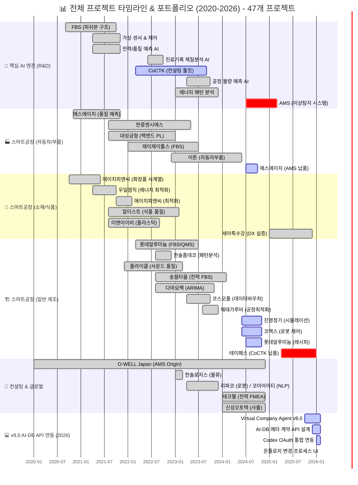
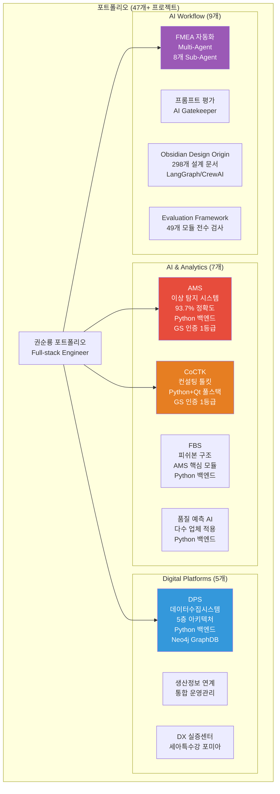
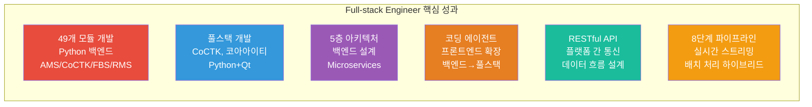
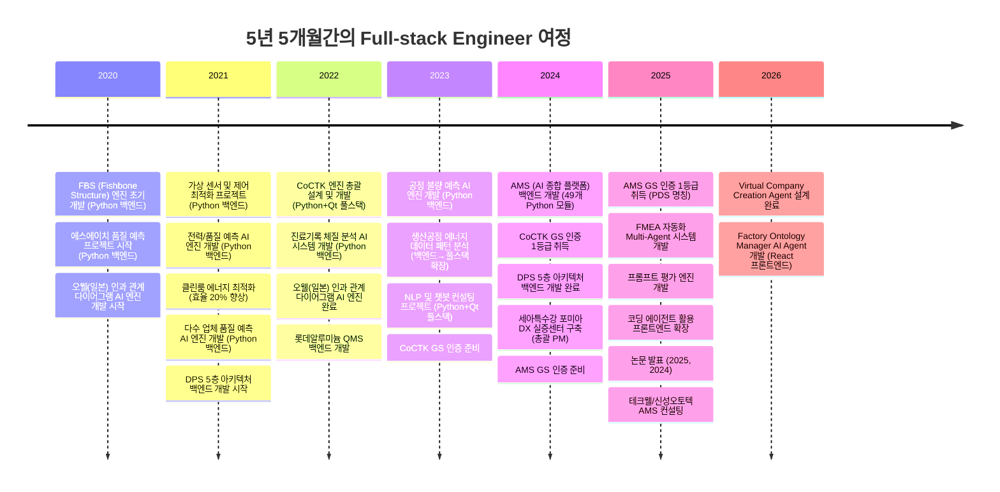
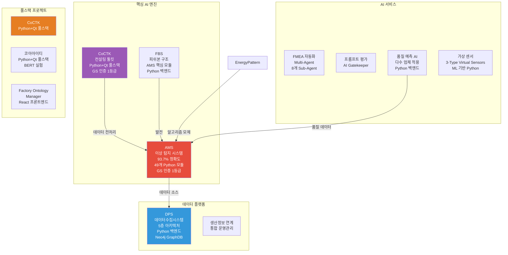

# 권순룡 포트폴리오 - Full-stack Engineer (AI/ML 플랫폼)

> **"AI/ML 플랫폼을 개발하는 Full-stack Engineer"**  
> **"모델보다 데이터, 데이터보다 정보, 지식구조를 정리하는 현장친화적 연구원"**

---

## 📌 기본 정보

**이름**: 권순룡  
**전 소속**: 한솔코에버 연구소 대리 (2020.09.01 ~ 2026.01.31, 퇴직)
**총 경력**: 5년 5개월 (2020.09~2026.01)  
**핵심 역량**: Python 백엔드 개발, Qt 프론트엔드 개발, 풀스택 개발, API 설계 및 개발, AI/ML 플랫폼 개발, 코딩 에이전트 활용 프론트엔드 개발 확장, RESTful API 설계, 49개 Python 모듈 개발  
**GitHub**: https://github.com/moobaek  
**이메일**: m920831@naver.com  
**연락처**: 010-5671-6200

---

## 📊 전체 프로젝트 타임라인 (2020-2026) - 47개 프로젝트



> [!INFO] **총 프로젝트 현황**
> - **AI & Analytics**: 7개 (AMS, CoCTK, FBS 등)
> - **스마트공장 구축**: 23개 (에스에이치아이엔티, 롯데알루미늄 등)
> - **컨설팅**: 8개 (테크웰, 신성오토텍 등)
> - **AI 에이전트**: 9개 (FMEA, PM Agent 등)

---

## 📊 포트폴리오 구조 (한눈에 보기)



---

## 🎯 핵심 Full-stack 성과 대시보드



| 분류 | 지표 | 상세 |
|:---|---:|:---|
| **백엔드 개발** | 49개 모듈 개발 | AMS, CoCTK, FBS, RMS 등 Python 백엔드 |
| **풀스택 개발** | CoCTK, 코아아이티 | Python+Qt 풀스택 개발 |
| **시스템 아키텍처** | 5층 아키텍처 설계 | Microservices 기반 백엔드 설계 |
| **프론트엔드 확장** | 코딩 에이전트 활용 | 백엔드만 가능→풀스택 확장 |
| **API 설계** | RESTful API | 플랫폼 간 통신, 데이터 흐름 설계 |
| **데이터 파이프라인** | 8단계 파이프라인 | 실시간 스트리밍 및 배치 처리 |

---

## 📅 경력 타임라인 (2020-2026)



---

## 🏆 주요 Full-stack 개발 프로젝트 (47개+)

### 프로젝트 관계도



### 1. AMS (Analysis Management System) - 49개 Python 모듈 백엔드 개발

**기간**: 2024.07 ~ 2025.12  
**발주처**: 한국산업기술진흥원  
**역할**: AI 종합 플랫폼 백엔드 개발 및 총괄 PM

**풀스택 개발 핵심**:
- ✅ **49개 Python 모듈 개발**: AMS 프로젝트 핵심 엔진 100% 자체 개발
- ✅ **8단계 시계열 데이터 파이프라인 백엔드**: 실시간 스트리밍 처리 및 배치 처리 하이브리드 아키텍처 구현
- ✅ **Neo4j 그래프 DB 백엔드**: 4M2E 관계 온톨로지 정의 및 지식 그래프 플랫폼 구축
- ✅ **Microservices 아키텍처**: Docker/Kubernetes 기반 마이크로서비스 아키텍처
- ✅ **GS 인증 1등급 취득**: PDS 명칭으로 소프트웨어 품질 인증 획득
- ✅ **특허 등록**: 피쉬본 관리 시스템 특허 등록
- ✅ **정식 납품**: 세아특수강 포미아 DX 실증센터 구축, 테크웰/신성오토텍 AMS 컨설팅
- ✅ **논문 발표**: 2025, 2024년 논문 발표

**기술 스택**: Python, Neo4j, Docker, Kubernetes, Grafana, Prometheus, 베이지안 네트워크, 시계열 분석

**49개 Python 모듈 상세**:

**총 49개 Python 파일로 구성**:

| 모듈 | 파일 수 | 주요 기능 | 담당 |
|------|---------|-----------|------|
| **01_MLS** (Machine Learning Service) | 15개 | 머신러닝 모델 학습, 데이터 전처리 | 권순룡 |
| **02_CoCTK** (Cost Control Toolkit) | 4개 | 비용 분석, 최적화 | 권순룡 |
| **03_FBS** (Fishbone Structure) | 6개 | 피쉬본 구조 생성, 원인 분석 | 권순룡 |
| **04_RMS** (Range Management System) | 4개 | 범위 관리, 클러스터링 | 권순룡 |
| **05_AMS_dev** (Analysis Management System) | 17개 | 통합 이상 관리, FMEA 생성 | 권순룡 |
| **common** | 2개 | 공통 모듈 (DB 연결, 로깅) | 권순룡 |

**주요 파일 구조**:
```
AI_docker_en/
├── 01_MLS/
│   ├── main_mls.py
│   ├── AI_preprocessing.py
│   ├── data_loader.py
│   ├── feature_progress.py
│   └── ... (총 15개 파일)
├── 02_CoCTK/
│   ├── main_ctk.py
│   └── ctk_ver2.py
│   └── ... (총 4개 파일)
├── 03_FBS/
│   ├── main_fbs.py
│   ├── fish_born_making.py
│   ├── AI_preprocessing.py
│   └── ... (총 6개 파일)
├── 04_RMS/
│   ├── main_rms.py
│   ├── cluster_auto_Binarization.py
│   ├── AI_preprocessing.py
│   └── ... (총 4개 파일)
├── 05_AMS_dev/
│   ├── main_ams.py
│   ├── data_pipeline.py
│   ├── bayesian_network_analyzer.py
│   ├── generate_fmea.py
│   ├── save_data_graphDB.py
│   └── ... (총 17개 파일)
└── common/
    ├── mssql_db_connection.py
    └── error_log.py
```

**백엔드 개발 상세 설명**:
AMS는 제조 현장의 설비 이상을 자동으로 탐지하고 분석하는 AI 종합 플랫폼입니다. **49개 Python 모듈을 100% 자체 개발**하여 전체 백엔드 시스템을 구축했습니다.

**01_MLS (Machine Learning Service)**: 머신러닝 모델 학습 및 데이터 전처리를 담당하는 15개 Python 모듈을 개발했습니다. 데이터 로더, 특징 추출, 전처리, 모델 학습 등 ML 파이프라인의 전 과정을 구현했습니다.

**02_CoCTK (Cost Control Toolkit)**: 비용 분석 및 최적화를 담당하는 4개 Python 모듈을 개발했습니다. 데이터 전처리, 상관관계 분석, 비용 최적화 알고리즘을 구현했습니다.

**03_FBS (Fishbone Structure)**: 피쉬본 구조 생성 및 원인 분석을 담당하는 6개 Python 모듈을 개발했습니다. 피쉬본 다이어그램 자동 생성 알고리즘을 구현했습니다.

**04_RMS (Range Management System)**: 범위 관리 및 클러스터링을 담당하는 4개 Python 모듈을 개발했습니다. 자동 클러스터링 및 범위 관리 알고리즘을 구현했습니다.

**05_AMS_dev (Analysis Management System)**: 통합 이상 관리 및 FMEA 생성을 담당하는 17개 Python 모듈을 개발했습니다. 베이지안 네트워크 분석기, 데이터 파이프라인, FMEA 생성기, Neo4j 그래프 DB 저장 모듈 등을 구현했습니다.

**common 모듈**: 공통 모듈로 MSSQL DB 연결 및 에러 로깅을 담당하는 2개 Python 모듈을 개발했습니다.

**8단계 시계열 데이터 파이프라인 백엔드**: 실시간 데이터 수집부터 이상 탐지까지 전 과정을 자동화하는 8단계 파이프라인을 백엔드로 구현했습니다. 실시간 스트리밍 처리 및 배치 처리 하이브리드 아키텍처를 구현하여 다양한 데이터 소스로부터 데이터를 수집하고 처리합니다.

**Neo4j 그래프 DB 백엔드**: Neo4j 그래프 DB를 활용한 지식 그래프 플랫폼을 백엔드로 구현했습니다. 4M2E(Man, Machine, Material, Method, Environment, Energy) 관계를 온톨로지로 정의하고, 지식 그래프를 만들어 데이터 간 관계를 시각화했습니다.

**Microservices 아키텍처**: Docker와 Kubernetes를 활용한 마이크로서비스 아키텍처로 각 모듈을 독립적인 서비스로 구성했습니다. 각 서비스를 독립적으로 개발, 배포, 확장할 수 있도록 설계했습니다.

---

### 2. CoCTK - 엔진 총괄 설계 및 화면설계 개발 총괄 PM (풀스택)

**기간**: 2022.03 ~ 2024  
**발주처**: 중소기업기술정보진흥원  
**역할**: 엔진 총괄 설계 & 화면설계 개발 총괄 PM

**풀스택 개발 상세**:
- ✅ **백엔드 엔진 설계**: 데이터 전처리, 상관관계 분석, 비용 최적화 엔진 개발 (Python)
- ✅ **프론트엔드 화면 설계**: 사용자 경험을 고려한 화면 설계 및 개발 (Qt)
- ✅ **풀스택 통합**: 백엔드 엔진과 프론트엔드 화면을 통합하여 전체 시스템 구축
- ✅ **RESTful API 설계**: 백엔드와 프론트엔드 간 통신을 위한 API 설계 및 개발
- ✅ **GS 인증 1등급 취득**: 2024년 소프트웨어 품질 인증 획득
- ✅ **논문 발표**: 2023년 논문 발표

**기술 스택**: Python, Qt, 데이터 전처리, 상관관계 분석, 비용 최적화, 풀스택 개발

**풀스택 개발 상세 설명**:
CoCTK는 제조 현장의 데이터를 분석하고 최적화 방안을 제시하는 컨설팅 도구입니다. **Python+Qt 풀스택 개발**을 통해 백엔드 엔진과 프론트엔드 화면을 모두 개발했습니다.

**백엔드 엔진 설계**: 데이터 전처리, 상관관계 분석, 비용 최적화 엔진을 Python으로 개발했습니다. 사업 시작 전 판별 컨설팅 도구로, 소량 데이터로 학습 가능성, 중요 순위, 상관분석, 시계열 예측 가능성, feature-결과 추론 등을 종합 판별합니다.

**프론트엔드 화면 설계**: 사용자 경험을 고려한 화면 설계를 Qt로 개발했습니다. 사용자가 데이터를 쉽게 입력하고 분석 결과를 직관적으로 확인할 수 있도록 UI를 설계했습니다.

**풀스택 통합**: 백엔드 엔진과 프론트엔드 화면을 통합하여 전체 시스템을 구축했습니다. RESTful API를 설계하여 백엔드와 프론트엔드 간 통신을 구현했으며, 전체 시스템을 통합하여 개발했습니다.

**RESTful API 설계**: 백엔드와 프론트엔드 간 통신을 위한 RESTful API를 설계하고 개발했습니다. API를 통해 데이터 전처리, 상관관계 분석, 비용 최적화 결과를 프론트엔드로 전달합니다.

GS 인증 1등급을 취득하여 소프트웨어 품질을 인증받았으며, 2023년 논문으로 발표했습니다.

---

### 3. 생산공정 에너지 데이터 패턴 분석 - 백엔드에서 풀스택으로 확장

**기간**: 2023  
**발주처**: 연구과제  
**역할**: 메인 수행 (초기 백엔드 개발 → 풀스택 개발 및 총괄 PM으로 확장)

**풀스택 확장 상세**:
- ✅ **백엔드 개발**: 계층적 클러스터링 및 패턴 민주주의 기법 개발 (Python)
- ✅ **프론트엔드 개발**: 데이터 분석 결과를 시각화하여 사용자에게 제공 (Qt)
- ✅ **풀스택 통합**: 백엔드와 프론트엔드를 통합하여 전체 시스템 구축

**기술 스택**: Python, Qt, 패턴 분석, 클러스터링, 라벨링 시스템

**풀스택 확장 상세 설명**:
초기 백엔드 개발에서 시작하여 풀스택 개발 및 총괄 PM으로 확장했습니다. 계층적 클러스터링을 도입하여 설비 상태 데이터의 패턴을 분석하고, 패턴 민주주의 기법을 고안하여 데이터 패턴 분석 방법론을 개발했습니다.

**백엔드 개발**: 계층적 클러스터링 및 패턴 민주주의 기법을 Python으로 개발했습니다. 설비 상태 데이터를 계층적으로 분류하여 패턴을 찾아내고, 여러 패턴 분석 결과를 투표 방식으로 통합하여 최종 패턴을 결정합니다.

**프론트엔드 개발**: 데이터 분석 결과를 시각화하여 사용자에게 제공하는 Qt 프론트엔드를 개발했습니다. 패턴 분석 결과를 그래프와 차트로 시각화하여 사용자가 쉽게 이해할 수 있도록 했습니다.

**풀스택 통합**: 백엔드와 프론트엔드를 통합하여 전체 시스템을 구축했습니다. 이 구조적 분화와 투표 방식이 훗날 AMS의 핵심 알고리즘 모체가 되었습니다.

---

### 4. 코아아이티 - Python+Qt 풀스택 개발

**기간**: 2023.04~2023.12  
**발주처**: 충북과학기술원 주관 산업 디지털 전환 지원체계 구축사업  
**역할**: Python+Qt 풀스택 개발

**풀스택 개발 상세**:
- ✅ **백엔드 개발**: Python을 활용하여 백엔드 로직 개발, BERT 모델 실험
- ✅ **프론트엔드 개발**: Qt를 활용하여 사용자 인터페이스 개발
- ✅ **풀스택 통합**: 백엔드와 프론트엔드를 통합하여 전체 시스템 구축

**기술 스택**: Python, Qt, BERT, DistilBERT, NLP, 챗봇

**풀스택 개발 상세 설명**:
Python+Qt를 활용한 풀스택 개발 경험을 쌓았습니다. 자연어 처리 및 챗봇 개발 컨설팅을 수행했으며, 한약재/건강식품 데이터 분석 및 자연어 처리를 통해 효과 및 주의사항 정보 구조화 및 챗봇 응답 생성 시스템을 설계했습니다.

**백엔드 개발**: Python을 활용하여 백엔드 로직을 개발했습니다. BERT 모델 실험 및 한약재 검색 시스템을 개발했으며, 자연어버트_모델_생성.ipynb에서 BertForSequenceClassification을 사용하여 모델을 개발했습니다. 공정데이터.ipynb에서 공정 기능 추출, 토큰화, 벡터화를 수행하고, DistilBERT 모델을 적용했습니다.

**프론트엔드 개발**: Qt를 활용하여 사용자 인터페이스를 개발했습니다. 사용자가 자연어로 질문하고 챗봇 응답을 받을 수 있는 인터페이스를 구현했습니다.

**풀스택 통합**: 백엔드와 프론트엔드를 통합하여 전체 시스템을 구축했습니다. 이 경험이 AI Agent 설계 및 개발의 기초가 되었습니다.

---

### 5. 코딩 에이전트 개발 - 프론트엔드 개발 확장

**기간**: 2025.05 ~ 진행중  
**발주처**: 내부 개발  
**역할**: 코딩 에이전트 개발 및 프론트엔드 개발 확장

**프론트엔드 확장 상세**:
- ✅ **초기 한계**: 백엔드 AI 개발만 가능 (Python 중심)
- ✅ **코딩 에이전트 개발**: 외주 개발자 산출물 관리 문제 해결
- ✅ **프론트엔드/시각화 개발 확장**: 코딩 에이전트를 활용하여 프론트엔드/시각화 부분도 개발 가능하게 됨
- ✅ **온톨로지 공장 agent 개발**: Factory Ontology Manager AI Agent로 진화

**기술 스택**: Python, ID 기반 온톨로지 맵, Phase 워크플로우, LangGraph, CrewAI, React, TypeScript

**프론트엔드 확장 상세 설명**:
백엔드 AI 개발자였지만 코딩 툴을 만들어서 말도 안 되는 시간에 말도 안 되는 개발 개수를 성공적으로 완료했습니다. 이를 통해 온톨로지 공장 agent 개발도 가능해졌으며, 프론트엔드/시각화 부분도 개발할 수 있게 되었습니다.

**코딩 에이전트 활용**: 코딩 에이전트를 활용하여 프론트엔드/시각화 부분도 개발할 수 있게 되었습니다. ID 기반 온톨로지 맵, Phase 0-13 워크플로우, LangGraph/CrewAI 오케스트레이션을 구현하여 개발 프로세스를 자동화했습니다.

**Factory Ontology Manager AI Agent**: 온톨로지 공장 agent를 Factory Ontology Manager AI Agent로 진화시켰습니다. React 18.3.1 + TypeScript 5.5.3 + Vite 7.1.12를 활용한 프론트엔드를 개발했습니다. shadcn-ui (Radix UI) + Tailwind CSS 3.4.11를 활용한 UI를 구현했으며, Zustand 5.0.9 + React Query 5.56.2를 활용한 상태 관리를 구현했습니다.

---

### 6. DPS (데이터수집시스템) - 5층 아키텍처 백엔드 개발

**기간**: 2021 ~ 2024  
**발주처**: 세아특수강  
**역할**: 핵심 아키텍처 설계 및 백엔드 개발 (PM 수행)

**백엔드 개발 핵심**:
- ✅ **5층 아키텍처 백엔드 설계**: Microservices 기반 데이터 수집 시스템 구축
- ✅ **Neo4j 그래프 DB 백엔드**: 온톨로지 기반 관계 분석 및 지식 그래프 구축
- ✅ **Docker/Kubernetes 기반 인프라**: 마이크로서비스 아키텍처 및 컨테이너 오케스트레이션
- ✅ **금속산업 5대 공정 AI 자동화**: 제조 현장 디지털화 실증
- ✅ **논문 발표**: 2024년 논문 발표

**기술 스택**: Python, Neo4j, Docker, Kubernetes, Microservices, GraphDB

**백엔드 개발 상세 설명**:
DPS는 제조 현장의 데이터를 수집하고 분석하는 통합 플랫폼입니다. 5층 아키텍처를 설계하여 데이터 수집, 전처리, 변환, 저장, 분석까지 전 과정을 백엔드로 자동화했습니다.

**5층 아키텍처 백엔드**:
- **Layer 1: 센서수집 Layer**: 실시간 스트리밍과 PLC/MES 인터페이스를 처리하는 백엔드 계층입니다. 다양한 센서 데이터를 수집하고 표준화된 형식으로 변환합니다.
- **Layer 2: 중앙저장관리 Layer**: 수집된 데이터를 중앙에서 관리하고 저장하는 백엔드 계층입니다. 데이터의 무결성과 일관성을 보장하며, 백업 및 복구 기능을 제공합니다.
- **Layer 3: POP/MES Layer**: 생산 운영 계획(POP)과 제조 실행 시스템(MES)과의 인터페이스를 담당하는 백엔드 계층입니다. 생산 계획과 실제 생산 데이터를 연동합니다.
- **Layer 4: AMS+확률네트워크 Layer**: AI 분석 및 확률 네트워크를 활용한 분석 백엔드 계층입니다. Neo4j 그래프 DB를 활용하여 확률 네트워크를 저장하고, FBS 뼈대 위에 확률적 최적화로 문제 해결 최적 경로를 도출합니다.
- **Layer 5: LLM FMEA 생성 Layer**: LLM을 활용하여 FMEA 문서를 자동으로 생성하는 백엔드 계층입니다.

Docker와 Kubernetes를 활용한 마이크로서비스 아키텍처로 확장 가능한 백엔드 시스템을 만들었습니다. 서버-엣지 하이브리드 인프라를 지원하여 다양한 환경에서 운영할 수 있도록 설계했습니다.

---

### 7. Factory Ontology Manager AI Agent - React 프론트엔드 개발

**기간**: 2025.06~진행중  
**발주처**: 내부 개발  
**역할**: React 프론트엔드 개발

**프론트엔드 개발 핵심**:
- ✅ **React 18.3.1 + TypeScript 5.5.3 + Vite 7.1.12**: 최신 React 스택 활용
- ✅ **shadcn-ui (Radix UI) + Tailwind CSS 3.4.11**: 현대적인 UI 컴포넌트 라이브러리 활용
- ✅ **Zustand 5.0.9 + React Query 5.56.2**: 상태 관리 및 데이터 페칭
- ✅ **다이어그램 기반 공정 관리 UI**: 시각적 공정 관리 시스템
- ✅ **자연어 기반 공정 문서 파싱 UI**: DB Grounding, Ontology Mapping UI

**기술 스택**: React 18.3.1, TypeScript 5.5.3, Vite 7.1.12, shadcn-ui, Tailwind CSS 3.4.11, Zustand 5.0.9, React Query 5.56.2

**프론트엔드 개발 상세 설명**:
Factory Ontology Manager AI Agent는 2020년 전무님의 비전(공정 라인 쉽게 수정)과 2025년 김이사님의 니즈(OEM ODM 대응)가 만나서 탄생한 프로젝트입니다.

**React 프론트엔드 개발**: React 18.3.1 + TypeScript 5.5.3 + Vite 7.1.12를 활용한 최신 React 스택으로 프론트엔드를 개발했습니다. shadcn-ui (Radix UI) + Tailwind CSS 3.4.11를 활용한 현대적인 UI 컴포넌트를 구현했으며, Zustand 5.0.9 + React Query 5.56.2를 활용한 상태 관리 및 데이터 페칭을 구현했습니다.

**다이어그램 기반 공정 관리 UI**: shapez.io 게임에서 영감을 받은 드래그 앤 드롭 인터페이스를 구현했습니다. 계층적 구조 관리(공장 > 작업장 > 생산라인 > 공정)를 지원하는 시각적 공정 관리 시스템을 개발했습니다.

**자연어 기반 공정 문서 파싱 UI**: 공정 엔지니어가 자연어로 작성한 공정 문서를 자동으로 파싱하여 구조화된 정보를 추출하는 UI를 개발했습니다. DB Grounding을 통해 사용자의 추상적 요청을 실제 DB의 설비/센서 ID로 자동 매핑하고, Ontology Mapping을 통해 설비 간 관계 및 데이터 흐름을 분석하여 시각화 구조를 생성합니다.

**AI Agent Window**: 새 창(모달/사이드바)로 AI 인터페이스를 제공하는 UI를 개발했습니다. 기존 Factory Ontology Manager 캔버스에 자연스럽게 통합하여 사용자가 자연어로 공정을 관리할 수 있도록 했습니다.

---

## 🔧 기술 스택

### 프로그래밍 언어
- **Python**: 5년 5개월 경력 (49개 모듈 개발: MLS, CoCTK, FBS, RMS, AMS)
- **TypeScript**: React 프론트엔드 개발 (TypeScript 5.5.3)
- **SQL**: MSSQL Server, PostgreSQL, Neo4j Cypher 쿼리 작성

### 프론트엔드 프레임워크
- **Qt**: Python+Qt 풀스택 개발 경험
- **React**: React 18.3.1 + TypeScript 5.5.3 + Vite 7.1.12
- **UI 라이브러리**: shadcn-ui (Radix UI), Tailwind CSS 3.4.11
- **상태 관리**: Zustand 5.0.9, React Query 5.56.2
- **화면설계**: 사용자 경험을 고려한 화면 설계 및 개발

### 백엔드 프레임워크 및 라이브러리
- **RESTful API**: 플랫폼 간 통신을 위한 API 설계 및 개발
- **Flask/FastAPI**: Python 웹 프레임워크 (추정)
- **49개 Python 모듈**: AMS, CoCTK, FBS, RMS 등 다양한 백엔드 모듈 개발

### 데이터베이스
- **관계형 DB**: MSSQL Server, PostgreSQL
- **그래프 DB**: Neo4j (4M2E 관계 온톨로지, Cypher 쿼리)

### 인프라 및 DevOps
- **컨테이너**: Docker, Kubernetes
- **아키텍처**: Microservices, 5층 아키텍처
- **모니터링**: Grafana, Prometheus

---

## 📚 학술 성과 (10편)

| 발행일 | 논문 제목 | 학술지/학회 | 핵심 성과 및 프로젝트 연계 |
| :--- | :--- | :--- | :--- |
| 2025.12 | **분석 상관/확률 네트워크 최적 경로 정보 및 공정 관리 문서 기반 FMEA 생성 연구** | KSFM 2025년도 동계학술대회 | [FMEA 자동화/복합센서/AMS] 상관/확률 네트워크 최적 경로 분석 기반 FMEA 자동 생성 기술 검증, AMS 결과 표시 LLM agent (GPT OSS) 개발 및 포미아 납품 적용 |
| 2025.06 | **AI를 활용한 구조와 룰을 활용한 구조-확률 종합 네트워크 및 최적 관리 방안 도출** | 한국유체기계학회 | [AMS] 피쉬본 AI 모델의 학술적 고도화 및 최적 관리 로직 증명 (초기 O-WELL 알고리즘 고도화) |
| 2024.12 | **공장 운영 핵심 요소의 식별 및 최적화를 위한 클러스터링 기법 적용** | 한국생산제조학회 | [DPS] 공장 운영 데이터의 다차원 분석 및 디지털 트윈 최적화 근거 |
| 2024.12 | **설비 이상상태 기반 최적 공정 데이터 추론 및 위험/안전 관리 최적 자동화** | 한국유체기계학회 | [AMS] 실시간 이상 상태 기반 위험 관리 알고리즘의 유효성 검증 |
| 2024.07 | **전력 데이터를 통한 설비 상태 추론 및 이상 상황 설정 예측** | 한국유체기계학회 | [에너지/센서] 전력 데이터 기반의 설비 예지 보전 기술 실증 |
| 2023.12 | **송풍 설비 변동부하 대응 전력품질 분석 및 에너지 절감 연구** | 한국유체기계학회 | [에너지 최적화] 에너지 20% 절감 실증 솔루션의 핵심 물리 분석 모델 |
| 2023.12 | **압축기 공정에서 데이터 밸런스 문제 해결 및 품질 결과 사전 예측을 위한 AI 시스템** | 한국유체기계학회 | [AI/데이터] 소량의 불량 데이터 극복을 위한 AI 학습 모델 연구 |
| 2023.07 | **생산공정 에너지 및 설비 상태 진단을 위한 AI기반의 전력 사용 패턴 및 SOH분석** | 한국유체기계학회 | [에너지/전력] 설비 건전성(SOH) 진단 및 에너지 효율화 융합 기술 (**Energy Pattern** 과제 실증) |
| 2022.12 | **자동차 부품 생산 산업을 위한 머신러닝 기반의 품질예측 알고리즘** | 한국생산제조학회 | [AI/제조] 세아베스틸 등 자동차 부품 공정 품질 예측 모델의 기초 |
| 2022.06 | **ICT 융복합 기술을 활용한 스마트 공장 및 에너지 절감 솔루션 적용 사례** | 한국유체기계학회 | [Global DX] **O-WELL Japan** 등 글로벌 스마트 공장 구축 사례의 실증 (AMS 초기 모델 검증) |

---

## 🔬 특허 출원/등록 현황 (풀스택 개발 및 코딩 에이전트 강조)

> [!NOTE] **풀스택 개발의 기술적 기반**
> 아래 특허들은 풀스택 개발, 시스템 통합, 프론트엔드/백엔드 연계의 핵심 기술을 특허로 보호한 것입니다. 특히 **특허 1**은 AI 기반 공정 최적화 관리 시스템으로, 코딩 에이전트의 기술적 기반이 됩니다.

### 특허 출원/등록 현황 (5건)

| 출원일 | 특허명 | 출원번호 | 청구항 | 상태 | 발명자 | 풀스택 개발 연계 |
| :--- | :--- | :--- | :--- | :--- | :--- | :--- |
| 2025.08.13 | **인공지능을 활용한 공정 최적화 관리를 위한 공정 관리 방법 및 그 시스템** | 10-2025-0040488<br/>(예정) | 10개 | 출원완료<br/>심사청구완료 | **권순룡**, 최수영, 강용태, 안상윤 | **시스템 통합**: FBS Module, RMS Module, 베이지안 네트워크를 통합한 풀스택 시스템<br/>**코딩 에이전트 기반**: 공정 관리 기술이 코딩 에이전트의 기술적 기반<br/>**프론트엔드/백엔드 연계**: 데이터 수집 → 분석 → 결과 표시의 전체 프로세스 통합 |
| 2025.03.28 | **공정 최적화를 위한 공정 관리 방법 및 그 시스템** | 10-2025-0040488 | 8개 | 등록결정<br/>(2025.12.09) | 강용태, **권순룡**, 김혜주 | **시스템 통합**: 공정 관리 기술의 풀스택 시스템 설계<br/>**등록결정 완료** |
| 2023.12.26 | **생산공정 에너지 및 설비상태 데이터 처리를 위한 전력 사용 패턴 분석 및 상태 분석 방법** | 1020230191965 | 6개 | 공개<br/>심사청구완료 | 최수영, 강용태, **권순룡**, 이상훈 | **풀스택 시스템**: 에너지 미터기 및 센서 데이터 수집(백엔드) → 전처리 → 머신러닝 학습 → 실시간 분석(프론트엔드)의 풀스택 시스템 |
| 2023.12.26 | **주기 데이터 분석 기반의 전력 추이 상황적 불량 이상 검증 방법** | 1020230191969 | 5개 | 공개<br/>심사청구완료 | 최수영, 강용태, **권순룡**, 이상훈 | **시계열 데이터 처리 시스템**: 시계열 분해 → 주파수 스펙트럼 생성 → 시계열 예측의 풀스택 시스템 |
| 2021.12.07 | **설비 제어 특성 로그 데이터와 에너지 소비패턴 모델을 활용한 인공지능 기반의 이상 탐지 방법 및 장치** | 1020210174274 | 10개 | 등록결정<br/>(2025.10.28) | 강용태, 김정호, **권순룡**, 김동기 | **풀스택 시스템**: 제어기 로그 데이터 + 전류 소비 데이터 결합(백엔드) → 에너지 소비 패턴 데이터 생성 → 이상 탐지 모델(프론트엔드)의 풀스택 시스템<br/>**등록결정 완료** |

### 풀스택 개발과 특허 기술의 연계

**특허 1 (2025.08.13) - 풀스택 시스템 설계의 핵심 기술**:
- **시스템 통합**: FBS Module, RMS Module, 베이지안 네트워크를 통합한 풀스택 시스템
- **프론트엔드/백엔드 연계**: 데이터 수집(백엔드) → 분석 → 결과 표시(프론트엔드)의 전체 프로세스 통합
- **코딩 에이전트 기반**: 공정 관리 기술이 코딩 에이전트의 기술적 기반이 되어, 풀스택 개발 자동화에 활용

**특허 3, 4, 5 (에너지 패턴 분석) - 풀스택 데이터 처리 시스템**:
- **백엔드**: 데이터 수집, 전처리, 머신러닝 학습
- **프론트엔드**: 실시간 분석, 결과 표시, 이상 상황 감지

### 국가연구개발사업 지원 현황

| 특허 | 국가연구개발사업 | 과제번호 | 연구기간 |
| :--- | :--- | :--- | :--- |
| 특허 1 (2025.08.13) | 에너지수요관리핵심기술개발(에특) | 20222020900031 | 2022.04.01 ~ 2024.12.31 |
| 특허 3, 4 (2023.12.26) | 에너지수요관리핵심기술개발사업 | 2022202090003B | 2022.04.01 ~ 2024.12.31 |

---

## 💼 비즈니스 가치 창출

### 개발 역량 확장
- ✅ **백엔드→풀스택 확장**: 코딩 에이전트를 활용하여 프론트엔드 개발 역량 확장
- ✅ **49개 모듈 개발**: 다양한 플랫폼의 백엔드 개발

### 시스템 구축
- ✅ **풀스택 시스템 구축**: CoCTK, 코아아이티 등 풀스택 시스템 구축
- ✅ **5층 아키텍처 백엔드**: Microservices 기반 백엔드 설계

---

## 🚀 v9.0 AI-DB API 연동 성과 (2026)

### AI-DB 메타 계약 API 설계

v9.0에서 풀스택 엔지니어링의 핵심은 **AI-DB 5-field 메타 계약을 API 레이어에 반영**한 것입니다. 모든 문서 생성·수정 API는 `keyword`, `simple_summary`, `detail_summary`, `wiki_links`, `artifact_path` 5개 필드를 필수 입력으로 강제하며, Codex OAuth 토큰으로 인증된 Agent만 쓰기 권한을 갖습니다.

### v9.0 풀스택 핵심 성과

| 성과 항목 | 내용 | 의의 |
|:---|:---|:---|
| **AI-DB 메타 계약 API** | 5-field 강제 스키마 | 문서 일관성 API 수준 보장 |
| **Codex OAuth 통합 연동** | OAuth 토큰 기반 Agent 인증 | 실행 채널 보안 |
| **온톨로지 변경 프로세스 UI** | Impact 분석→승인→반영→검증 4단계 | 안전한 지식구조 변경 |
| **projection_hash 검증 엔드포인트** | 소스-투영 무결성 API | 데이터 드리프트 탐지 |

---

## 🔗 관련 문서

- **이력서**: [권순룡_이력서_일반공개_Fullstack_Engineer.md](./권순룡_이력서_일반공개_Fullstack_Engineer.md)
- **포트폴리오 인덱스**: [00_Portfolio_Index.md](../../00_Portfolio_Index.md)
- **프로젝트 개요**: [02_Projects_Overview.md](../../02_Projects_Overview.md)

---

*본 포트폴리오는 Full-stack Engineer (AI/ML 플랫폼) 직무에 특화되어 작성되었습니다.*

© 2026 권순룡. All Rights Reserved.
