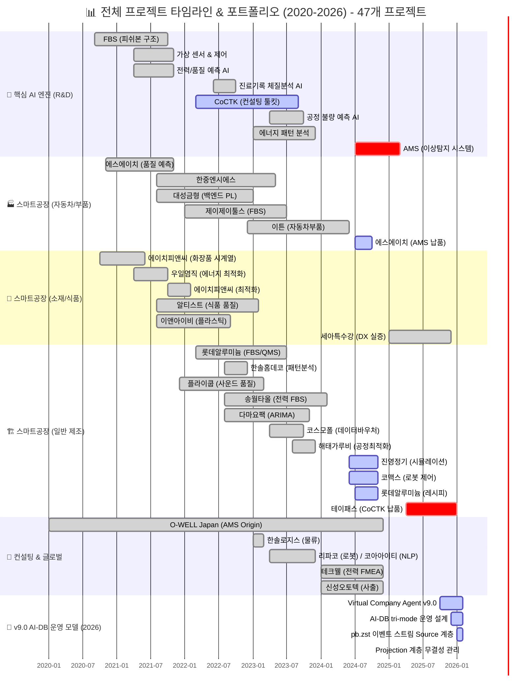
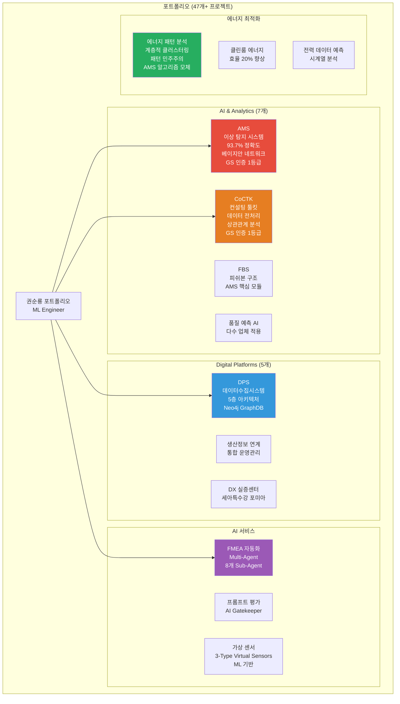
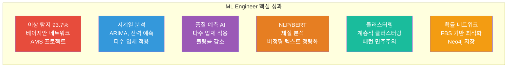
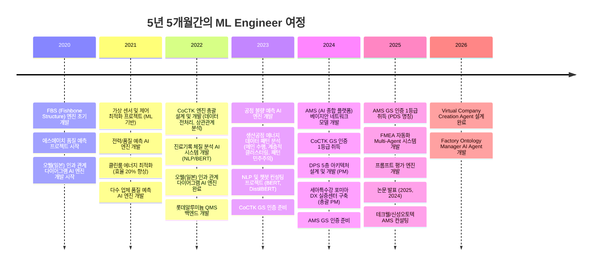
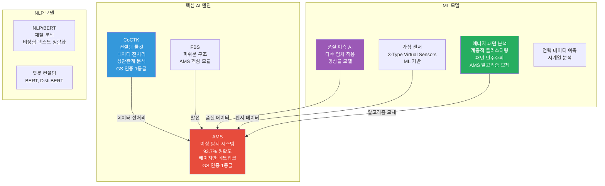

# 권순룡 포트폴리오 - ML Engineer / AI Engineer

> **"ML/AI 모델을 개발하고 최적화하는 ML Engineer"**  
> **"모델보다 데이터, 데이터보다 정보, 지식구조를 정리하는 현장친화적 연구원"**

---

## 📌 기본 정보

**이름**: 권순룡  
**전 소속**: 한솔코에버 연구소 대리 (2020.09.01 ~ 2026.01.31, 퇴직)
**총 경력**: 5년 5개월 (2020.09~2026.01)  
**핵심 역량**: ML/AI 모델 개발, 베이지안 네트워크, 시계열 분석, NLP/BERT, 클러스터링, 확률 네트워크, 모델 최적화, 이상 탐지, 품질 예측, 데이터 전처리, 특허 등록  
**GitHub**: https://github.com/moobaek  
**이메일**: m920831@naver.com  
**연락처**: 010-5671-6200

---

## 📊 전체 프로젝트 타임라인 (2020-2026) - 47개 프로젝트

> [!INFO] **총 프로젝트 현황**
> - **AI & Analytics**: 7개 (AMS, CoCTK, FBS 등)
> - **스마트공장 구축**: 23개 (에스에이치아이엔티, 롯데알루미늄 등)
> - **컨설팅**: 8개 (테크웰, 신성오토텍 등)
> - **AI 에이전트**: 9개 (FMEA, PM Agent 등)

---

## 📊 포트폴리오 구조 (한눈에 보기)

---

## 🎯 핵심 ML 성과 대시보드

| 분류 | 지표 | 상세 |
|:---|---:|:---|
| **이상 탐지** | 93.7% 정확도 | 베이지안 네트워크 기반 모델 (AMS) |
| **시계열 분석** | 다수 업체 적용 | ARIMA, 전력 데이터 예측, 화장품 시계열 |
| **품질 예측** | 다수 업체 적용 | 사출, 도정, 금형 공정 품질 예측 |
| **NLP/BERT** | 비정형 텍스트 정량화 | 진료기록 체질 분석, 0/1 바이너리 변환 |
| **클러스터링** | 계층적 클러스터링 | 패턴 민주주의 기법 개발 |
| **확률 네트워크** | FBS 기반 최적화 | Neo4j 저장, 확률적 최적화 |

---

## 📅 경력 타임라인 (2020-2026)

---

## 🏆 주요 ML 모델 개발 프로젝트 (47개+)

### 프로젝트 관계도

### 1. AMS - 베이지안 네트워크 기반 이상 탐지 모델 (93.7% 정확도)

**기간**: 2024.07 ~ 2025.12  
**발주처**: 한국산업기술진흥원  
**역할**: ML 모델 개발 및 최적화

**ML 모델 개발 핵심**:
- ✅ **베이지안 네트워크 기반 이상 탐지 모델**: 이상탐지율 93.7% 달성 (실질적 정확도 60~70%, 데이터 한계 고려)
- ✅ **시구간 패턴 분석 기법 개발**: 같은 값도 시점별 통계적 특성(p-values, 첨도, 편차)에 따라 정상/불량 구분
- ✅ **계층 클러스터링 단계별 분할**: AI 피쉬본 자동 생성
- ✅ **확률 최적화(경사하강법)**: 이상상황 확률 네트워크 작성
- ✅ **GS 인증 1등급 취득**: PDS 명칭으로 소프트웨어 품질 인증 획득
- ✅ **특허 등록**: 피쉬본 관리 시스템 특허 등록
- ✅ **정식 납품**: 세아특수강 포미아 DX 실증센터 구축, 테크웰/신성오토텍 AMS 컨설팅
- ✅ **논문 발표**: 2025, 2024년 논문 발표

**기술 스택**: Python, 베이지안 네트워크, 시계열 분석, 확률 최적화, 경사하강법

**ML 모델 개발 상세 설명**:
AMS는 제조 현장의 설비 이상을 자동으로 탐지하고 분석하는 AI 종합 플랫폼입니다. 베이지안 네트워크를 활용하여 설비 상태 데이터를 분석하고, 확률 최적화(경사하강법)를 통한 이상상황 확률 네트워크를 작성했습니다.

**베이지안 네트워크 모델 개발**: 베이지안 네트워크를 활용하여 설비 상태 데이터를 분석하고, 확률적 접근 방식으로 이상을 탐지합니다. 확률 최적화(경사하강법)를 통한 이상상황 확률 네트워크를 작성하여 설비 간 관계를 확률적으로 모델링했습니다.

**시구간 패턴 분석 기법 개발**: 같은 값도 시점별 통계적 특성(p-values, 첨도, 편차)에 따라 정상/불량을 구분할 수 있도록 했습니다. 이 기법은 AMS 완성 1년 전부터 대부분의 과제에 적용되었으며, AMS로 통합 정리되었습니다. 시구간 패턴 분석 기법을 통해 시간에 따른 데이터의 변화 패턴을 분석하여 이상 징후를 찾아냅니다.

**계층 클러스터링 단계별 분할**: 계층 클러스터링을 단계별로 잘라 AI 피쉬본을 자동 생성하는 방식으로, 이상 탐지율 93.7%를 달성했습니다. 설비 상태 데이터를 계층적으로 분류하여 패턴을 찾아내고, 피쉬본 다이어그램을 자동으로 생성합니다.

**8단계 시계열 데이터 파이프라인**: 실시간 데이터 수집부터 이상 탐지까지 전 과정을 자동화했습니다. 첫 번째 단계인 데이터 수집에서는 센서에서 데이터를 받아오는 부분을 담당합니다. 센서에서 데이터가 들어오면, 전처리 모듈이 처리합니다. 데이터가 이상한 경우를 대비해 검증 로직도 포함되어 있습니다. 수집된 데이터는 정규화 과정을 거쳐 분석 계층으로 전달됩니다. 이 과정에서 데이터의 품질을 보장하고, 이상한 데이터는 미리 걸러냅니다.

두 번째 계층인 분석 계층에서는 수집된 데이터를 분석해 이상 징후를 찾아냅니다. 베이지안 네트워크를 활용하여 확률적 접근 방식으로 이상을 탐지합니다. 시구간 패턴 분석 기법을 만들어 같은 값도 시점별 통계적 특성(p-values, 첨도, 편차)에 따라 정상/불량을 구분할 수 있도록 했습니다.

세 번째 계층인 시각화 계층에서는 분석 결과를 사용자가 이해하기 쉬운 형태로 보여줍니다. Neo4j 그래프 DB를 활용한 지식 그래프 플랫폼을 작성하여 설비 간 관계를 시각화했습니다. 4M2E(Man, Machine, Material, Method, Environment, Energy) 관계를 온톨로지로 정의하고, 지식 그래프를 만들어 데이터 간 관계를 시각화했습니다.

이 시스템의 정확도에 대해 설명하면, 세아특수강에 납품해 테스트한 결과, 이상 탐지 정확도가 93.7%를 기록했습니다. 이는 높은 수준입니다. 구체적으로 100개 중 93개 이상을 정확히 찾아낸다는 의미입니다. 실질적 정확도는 데이터 한계를 고려하면 60~70%로 투명하게 공개했습니다.

**모델 최적화**: 베이지안 네트워크 모델의 파라미터를 최적화하여 이상 탐지 성능을 향상시켰습니다. 경사하강법을 활용하여 확률 네트워크의 파라미터를 최적화했습니다.

---

### 2. 품질 예측 AI 엔진 - 다수 업체 적용 및 고도화

**기간**: 2021 ~ 2023  
**발주처**: 정보통신산업진흥원  
**역할**: ML 모델 개발 및 고도화

**ML 모델 개발 핵심**:
- ✅ **다수 업체 품질 예측 AI 엔진 개발**: 사출/도정/금형 공정 품질 예측 모델 개발
- ✅ **앙상블 모델 적용**: RandomForest, XGBoost, AdaBoost 앙상블 적용
- ✅ **불량률 감소 성과 달성**: 제조 현장 품질 개선 실증
- ✅ **시계열 데이터 분석 전문성**: 공정 데이터 기반 품질 예측 및 패턴 분석

**기술 스택**: Python, ML, 시계열 분석, 품질 예측 모델, RandomForest, XGBoost, AdaBoost

**ML 모델 개발 상세 설명**:
품질 예측 AI 엔진은 제조 공정의 품질을 사전에 예측하는 시스템입니다. 사출, 도정, 금형 등 다양한 공정에 적용하여 품질 예측 모델을 개발했으며, 시계열 데이터 분석을 통해 공정 패턴을 분석하고 품질을 예측했습니다.

**한중엔시에스 사출 공정**: 사출 공정에 RandomForest, XGBoost, AdaBoost 앙상블을 적용했습니다. 여러 모델의 예측 결과를 결합하여 더 정확한 예측을 수행했습니다. 앙상블 모델을 통해 단일 모델의 한계를 극복하고, 다양한 모델의 장점을 결합하여 예측 성능을 향상시켰습니다.

**대성금형 전기장치 품질 OUT 예측**: 전기장치 품질 OUT 예측을 수행했으며, 공정 데이터를 분석하여 품질을 예측하는 모델을 개발했습니다.

**제이제이툴스 금속가공**: 금속가공에 FBS 품질 중요도를 적용했습니다. 피쉬본 구조를 활용하여 품질에 영향을 미치는 요인을 분석하고, 중요도를 기반으로 품질을 예측했습니다.

**알티스트 식품 공정**: 식품 공정에 CoCTK 엔진의 초석을 적용했습니다. 데이터 전처리 및 상관관계 분석을 통해 품질 예측 모델을 개발했습니다.

다수 업체에 적용하여 불량률 감소 성과를 달성했으며, 제조 현장의 품질 개선을 실증했습니다.

---

### 3. 시계열 분석 모델 개발 - ARIMA 및 전력 데이터 예측

**기간**: 2020~2023  
**발주처**: 정보통신산업진흥원, 다마요팩 등  
**역할**: 시계열 분석 모델 개발

**ML 모델 개발 핵심**:
- ✅ **에이치피앤씨 화장품 시계열 분석**: 화장품 제조 공정 시계열 데이터 분석
- ✅ **다마요팩 ARIMA 시계열 분석**: ARIMA 모델을 활용한 시계열 예측
- ✅ **사출 업체 전력 데이터 예측**: 전력 소비 패턴 ML 예측
- ✅ **PLC 변화 기반 패턴 분석**: 전력 데이터와 PLC 상태 변화를 연계한 패턴 분석

**기술 스택**: Python, ARIMA, 시계열 분석, 전력 데이터 예측

**ML 모델 개발 상세 설명**:
다양한 업체의 시계열 데이터를 분석하고 예측하는 모델을 개발했습니다. ARIMA 모델을 활용하여 시계열 데이터의 추세와 계절성을 분석하여 미래 값을 예측했습니다.

**에이치피앤씨 화장품 시계열 분석**: 화장품 제조 공정의 시계열 데이터를 분석하여 공정 패턴을 파악하고, 품질에 영향을 미치는 요인을 분석했습니다.

**다마요팩 ARIMA 시계열 분석**: ARIMA 모델을 활용하여 시계열 데이터의 추세와 계절성을 분석하여 미래 값을 예측했습니다. ARIMA 모델의 파라미터를 최적화하여 예측 성능을 향상시켰습니다.

**사출 업체 전력 데이터 예측**: 전력 소비 패턴을 ML 모델로 예측하여 에너지 최적화 방안을 제시했습니다. PLC 변화 기반 패턴 분석을 통해 전력 데이터와 PLC 상태 변화를 연계하여 패턴을 분석했습니다.

---

### 4. 생산공정 에너지 데이터 패턴 분석 - 계층적 클러스터링 및 패턴 민주주의

**기간**: 2023  
**발주처**: 연구과제  
**역할**: 메인 수행 (초기 백엔드 개발 → 풀스택 개발 및 총괄 PM으로 확장)

**ML 모델 개발 핵심**:
- ✅ **계층적 클러스터링(Hierarchical Clustering) 도입**: 설비 상태 데이터 패턴 분석
- ✅ **패턴 민주주의(Pattern Voting) 기법 고안**: 데이터 패턴 분석 방법론 개발
- ✅ **AMS 알고리즘 모체**: 이 연구의 구조적 분화와 투표 방식이 훗날 AMS의 핵심 알고리즘 모체가 됨

**기술 스택**: Python, 패턴 분석, 클러스터링, 라벨링 시스템

**ML 모델 개발 상세 설명**:
생산공정 에너지 데이터 패턴 분석 연구과제를 메인으로 수행했습니다. 계층적 클러스터링을 도입하여 설비 상태 데이터의 패턴을 분석하고, 패턴 민주주의 기법을 고안하여 데이터 패턴 분석 방법론을 개발했습니다.

**계층적 클러스터링**: 설비 상태 데이터를 계층적으로 분류하여 패턴을 찾아냅니다. 유사한 패턴을 가진 데이터를 그룹화하고, 계층 구조를 형성하여 패턴의 구조를 파악합니다. 계층적 클러스터링을 통해 설비 상태 데이터의 패턴을 계층적으로 분석하여 이상 징후를 찾아냅니다.

**패턴 민주주의 기법**: 여러 패턴 분석 결과를 투표 방식으로 통합하여 최종 패턴을 결정합니다. 각 패턴 분석 방법의 결과를 투표로 집계하여 가장 신뢰할 수 있는 패턴을 선택합니다. 패턴 민주주의 기법을 통해 다양한 패턴 분석 방법의 결과를 통합하여 더 정확한 패턴을 찾아냅니다.

이 구조적 분화와 투표 방식이 훗날 AMS의 핵심 알고리즘 모체가 되었습니다. AMS의 시구간 패턴 분석 기법은 이 연구에서 고안한 방법론을 기반으로 발전했습니다.

---

### 5. 진료기록 체질분석 AI - NLP 정량화 및 네트워크 분석

**기간**: 2022.06 ~ 2022.10  
**발주처**: 한국데이터산업진흥원  
**역할**: NLP 모델 개발

**ML 모델 개발 핵심**:
- ✅ **NLP의 정량화 시도**: 비정형 진료 텍스트를 0/1 바이너리 테이블로 변환하여 네트워크 분석 및 체질 예측
- ✅ **단순 워드클라우드 한계 극복**: 정량적 분석 방법론 개발
- ✅ **헬스케어 AI 적용**: 한의원 진료 기록 기반 체질 예측 시스템 구축

**기술 스택**: Python, NLP, 네트워크 분석, 바이너리 변환

**ML 모델 개발 상세 설명**:
비정형 진료 텍스트를 0/1 바이너리 테이블로 변환하여 네트워크 분석 및 체질 예측을 수행했습니다. 단순 워드클라우드 한계를 극복하고, 정량적으로 분석할 수 있는 방법론을 개발했습니다.

**비정형 텍스트 정량화**: 한의원 진료 기록과 같은 비정형 텍스트를 0/1 바이너리 테이블로 변환하여 정량적으로 분석할 수 있도록 했습니다. 이를 통해 단순 워드클라우드의 한계를 극복하고, 네트워크 분석을 통해 체질 예측을 수행했습니다.

**네트워크 분석**: 바이너리 테이블을 기반으로 네트워크 분석을 수행하여 체질 간 관계를 분석했습니다. 네트워크 분석을 통해 체질 예측 모델을 개발했습니다.

---

### 6. CoCTK (Consulting Tool Kit) - 데이터 전처리 및 상관관계 분석 엔진 개발

**기간**: 2022.03 ~ 2024  
**발주처**: 중소기업기술정보진흥원  
**역할**: 엔진 총괄 설계 & 화면설계 개발 총괄 PM

**ML 모델 개발 핵심**:
- ✅ **데이터 전처리 엔진 개발**: 제조 현장의 복잡한 데이터를 분석 가능한 형태로 변환
- ✅ **상관관계 분석 엔진 개발**: 변수 간의 관계를 분석하여 중요한 변수를 찾아냄
- ✅ **비용 최적화 엔진 개발**: 클러스터링 기반 구간 룰로 에너지 최적화 수행
- ✅ **GS 인증 1등급 취득**: 2024년 소프트웨어 품질 인증 획득
- ✅ **논문 발표**: 2023년 논문 발표

**기술 스택**: Python, 데이터 전처리, 상관관계 분석, 비용 최적화, 클러스터링

**ML 모델 개발 상세 설명**:
CoCTK는 제조 현장의 데이터를 분석하고 최적화 방안을 제시하는 컨설팅 도구입니다. 사업 시작 전 판별 컨설팅 도구로, 소량 데이터로 학습 가능성, 중요 순위, 상관분석, 시계열 예측 가능성, feature-결과 추론 등을 종합 판별합니다.

**데이터 전처리 엔진**: 제조 현장의 복잡한 데이터를 분석 가능한 형태로 변환합니다. 결측치 처리, 이상치 제거, 정규화 등의 과정을 자동화하여 데이터 품질을 보장합니다. 데이터 전처리 엔진을 통해 다양한 형태의 제조 현장 데이터를 표준화된 형식으로 변환합니다.

**상관관계 분석 엔진**: 변수 간의 관계를 분석하여 중요한 변수를 찾아냅니다. 상관계수, 상호정보량 등을 활용하여 변수 간의 관계를 정량화하고, 중요 순위를 결정합니다. 상관관계 분석 엔진을 통해 품질에 영향을 미치는 주요 변수를 식별합니다.

**비용 최적화 엔진**: 클러스터링 기반 구간 룰로 에너지 최적화를 수행합니다. 설비 상태 데이터를 클러스터링하여 패턴을 찾아내고, 최적 제어 방안을 도출합니다. 비용 최적화 엔진을 통해 에너지 소비를 최소화하는 제어 방안을 제시합니다.

CoCTK와 이후 개념들이 모듈화/체계화되어 AMS AI 모듈의 기초가 되었습니다. GS 인증 1등급을 취득하여 소프트웨어 품질을 인증받았으며, 2023년 논문으로 발표했습니다.

---

### 7. 가상 센서 및 제어 최적화 - ML 기반 가상 센서 개발

**기간**: 2021.04 ~ 2021.11  
**발주처**: 한국에너지기술평가원  
**역할**: ML 기반 가상 센서 개발

**ML 모델 개발 핵심**:
- ✅ **고가센서 대체 가상센서**: 압축 사출 업체 고가센서 대체 가상센서 설계 및 구축
- ✅ **ML 기반 가상 센서 개발**: 저비용 대체 솔루션 제공
- ✅ **인증 완료**: 비용 절감 성과 달성

**기술 스택**: Python, ML, 가상 센서, 센서 대체

**ML 모델 개발 상세 설명**:
압축 사출 업체의 고가센서를 ML 기반 가상 센서로 대체하는 시스템을 개발했습니다. 고가의 물리 센서를 ML 모델로 대체하여 비용을 절감하면서도 동일한 수준의 데이터를 제공합니다.

**3-Type Virtual Sensors**: Pattern-based, Calculation-based, Prediction-based 세 가지 유형의 가상 센서를 개발했습니다.
- **Type 1: Pattern-based**: 패턴 분석 결과 자체를 센서값으로 활용 (예: 전력 패턴 → 가동 상태)
- **Type 2: Calculation-based**: 이종 데이터 결합 계산 (예: V*I = P)
- **Type 3: Prediction-based**: 백그라운드 정보/시뮬레이션 기반 예측 (예: 물리 센서 부재 시 AI 추론)

---

### 8. 코아아이티 자연어 처리 & 챗봇 컨설팅 - BERT 모델 개발

**기간**: 2023.04 ~ 2023.12  
**발주처**: 충북과학기술원 주관 산업 디지털 전환 지원체계 구축사업  
**역할**: NLP 모델 개발 및 컨설팅

**ML 모델 개발 핵심**:
- ✅ **BERT 기반 자연어 처리 모델 개발**: 한약재/건강식품 데이터 분석 및 자연어 처리
- ✅ **DistilBERT 모델 적용**: 공정 데이터 자연어 처리
- ✅ **BertForSequenceClassification 사용**: 자연어버트_모델_생성.ipynb
- ✅ **챗봇 응답 생성 시스템 설계**: 효과 및 주의사항 정보 구조화

**기술 스택**: Python, BERT, DistilBERT, NLP, 챗봇

**ML 모델 개발 상세 설명**:
자연어 처리 및 챗봇 개발 컨설팅을 수행했습니다. 한약재/건강식품 데이터 분석 및 자연어 처리 (자연어처리_예제_231212_코아아이티.csv 기반)를 통해 효과 및 주의사항 정보 구조화 및 챗봇 응답 생성 시스템을 설계했습니다.

**BERT 모델 개발**: CSV 기반 자연어 처리 파이프라인을 구축하고, BERT 기반 자연어 처리 모델을 생성 및 학습했습니다. 자연어버트_모델_생성.ipynb에서 BertForSequenceClassification을 사용하여 모델을 개발했습니다.

**공정 데이터 자연어 처리**: 공정데이터.ipynb에서 공정 기능 추출, 토큰화, 벡터화를 수행하고, DistilBERT 모델을 적용했습니다. 공정 데이터의 자연어 처리를 통해 공정 기능을 자동으로 추출하고 분석했습니다.

**챗봇 응답 생성 시스템**: 효과 및 주의사항 정보를 구조화하여 챗봇 응답 생성 시스템을 설계했습니다. 자연어 처리 모델을 활용하여 사용자 질문에 대한 적절한 응답을 생성합니다.

---

## 🔧 ML 기술 스택

### ML/DL 프레임워크 및 라이브러리
- **Scikit-learn**: 다양한 ML 알고리즘 활용
- **베이지안 네트워크**: 이상 탐지 모델 개발 (pgmpy >= 0.1.19)
- **시계열 분석**: ARIMA, RNN 등 시계열 예측 모델 개발
- **클러스터링**: 계층적 클러스터링, 패턴 분석
- **앙상블 모델**: RandomForest, XGBoost, AdaBoost
- **NLP**: BERT, DistilBERT, 자연어 처리

### 데이터 처리 및 분석
- **Pandas**: 데이터 전처리 및 분석 (>= 1.5.0)
- **NumPy**: 수치 계산 및 배열 처리 (>= 1.23.0)
- **시계열 분석**: 전력 데이터, 품질 데이터, 공정 데이터 분석

### NLP 및 네트워크 분석
- **NLP**: 비정형 텍스트 정량화 및 분석
- **BERT/DistilBERT**: 자연어 처리 모델 개발
- **네트워크 분석**: 체질 예측, 관계 분석

### 데이터베이스
- **Neo4j**: 그래프 DB, 확률 네트워크 저장 (>= 5.0.0)
- **MSSQL Server, PostgreSQL**: 관계형 DB

---

## 📚 학술 성과 (10편)

| 발행일 | 논문 제목 | 학술지/학회 | 핵심 성과 및 프로젝트 연계 |
| :--- | :--- | :--- | :--- |
| 2025.12 | **분석 상관/확률 네트워크 최적 경로 정보 및 공정 관리 문서 기반 FMEA 생성 연구** | KSFM 2025년도 동계학술대회 | [FMEA 자동화/복합센서/AMS] 상관/확률 네트워크 최적 경로 분석 기반 FMEA 자동 생성 기술 검증, AMS 결과 표시 LLM agent (GPT OSS) 개발 및 포미아 납품 적용 |
| 2025.06 | **AI를 활용한 구조와 룰을 활용한 구조-확률 종합 네트워크 및 최적 관리 방안 도출** | 한국유체기계학회 | [AMS] 피쉬본 AI 모델의 학술적 고도화 및 최적 관리 로직 증명 (초기 O-WELL 알고리즘 고도화) |
| 2024.12 | **공장 운영 핵심 요소의 식별 및 최적화를 위한 클러스터링 기법 적용** | 한국생산제조학회 | [DPS] 공장 운영 데이터의 다차원 분석 및 디지털 트윈 최적화 근거 |
| 2024.12 | **설비 이상상태 기반 최적 공정 데이터 추론 및 위험/안전 관리 최적 자동화** | 한국유체기계학회 | [AMS] 실시간 이상 상태 기반 위험 관리 알고리즘의 유효성 검증 |
| 2024.07 | **전력 데이터를 통한 설비 상태 추론 및 이상 상황 설정 예측** | 한국유체기계학회 | [에너지/센서] 전력 데이터 기반의 설비 예지 보전 기술 실증 |
| 2023.12 | **송풍 설비 변동부하 대응 전력품질 분석 및 에너지 절감 연구** | 한국유체기계학회 | [에너지 최적화] 에너지 20% 절감 실증 솔루션의 핵심 물리 분석 모델 |
| 2023.12 | **압축기 공정에서 데이터 밸런스 문제 해결 및 품질 결과 사전 예측을 위한 AI 시스템** | 한국유체기계학회 | [AI/데이터] 소량의 불량 데이터 극복을 위한 AI 학습 모델 연구 |
| 2023.07 | **생산공정 에너지 및 설비 상태 진단을 위한 AI기반의 전력 사용 패턴 및 SOH분석** | 한국유체기계학회 | [에너지/전력] 설비 건전성(SOH) 진단 및 에너지 효율화 융합 기술 (**Energy Pattern** 과제 실증) |
| 2022.12 | **자동차 부품 생산 산업을 위한 머신러닝 기반의 품질예측 알고리즘** | 한국생산제조학회 | [AI/제조] 세아베스틸 등 자동차 부품 공정 품질 예측 모델의 기초 |
| 2022.06 | **ICT 융복합 기술을 활용한 스마트 공장 및 에너지 절감 솔루션 적용 사례** | 한국유체기계학회 | [Global DX] **O-WELL Japan** 등 글로벌 스마트 공장 구축 사례의 실증 (AMS 초기 모델 검증) |

---

## 🔬 특허 출원/등록 현황 (ML 알고리즘 및 특허 기술 상세 강조)

> [!NOTE] **ML 알고리즘의 기술적 기반**
> 아래 특허들은 머신러닝 알고리즘, 패턴 분석 기법, 이상 탐지 모델의 핵심 기술을 특허로 보호한 것입니다. 특히 **특허 1**은 머신러닝 기반 특성요인도 자동 생성 및 관리 룰 자동 생성 기술로, ML 엔지니어의 핵심 역량을 보여줍니다.

### 특허 출원/등록 현황 (5건)

| 출원일 | 특허명 | 출원번호 | 청구항 | 상태 | 발명자 | ML 알고리즘 연계 |
| :--- | :--- | :--- | :--- | :--- | :--- | :--- |
| 2025.08.13 | **인공지능을 활용한 공정 최적화 관리를 위한 공정 관리 방법 및 그 시스템** | 10-2025-0040488 (예정) | 10개 | 출원완료 심사청구완료 | **권순룡**, 최수영, 강용태, 안상윤 | **머신러닝 기반 특성요인도 자동 생성**: 계층 클러스터링, 중요도 랭킹(RandomForest, Linear Regressor, 상관계수) **다단 클러스터링**: DBSCAN → K-means → 유전 알고리즘 기반 이진화 **베이지안 네트워크**: 확률 네트워크 기반 경로 탐색 |
| 2025.03.28 | **공정 최적화를 위한 공정 관리 방법 및 그 시스템** | 10-2025-0040488 | 8개 | 등록결정 (2025.12.09) | 강용태, **권순룡**, 김혜주 | **머신러닝 기반 특성요인도 자동 생성**: 공정 관리 기술의 ML 알고리즘 특허화 **등록결정 완료** |
| 2023.12.26 | **생산공정 에너지 및 설비상태 데이터 처리를 위한 전력 사용 패턴 분석 및 상태 분석 방법** | 1020230191965 | 6개 | 공개 심사청구완료 | 최수영, 강용태, **권순룡**, 이상훈 | **머신러닝 학습**: 설비 상태 및 SoH 분석 모델 생성 **실시간 판단**: 실시간 에너지 데이터 기반 설비 SoH 상태 판단 |
| 2023.12.26 | **주기 데이터 분석 기반의 전력 추이 상황적 불량 이상 검증 방법** | 1020230191969 | 5개 | 공개 심사청구완료 | 최수영, 강용태, **권순룡**, 이상훈 | **시계열 예측**: 전력 소비 패턴 데이터의 시계열 예측 기반 불량/이상 감지 **주파수 스펙트럼 분석**: 주파수 도메인 분석 기법 |
| 2021.12.07 | **설비 제어 특성 로그 데이터와 에너지 소비패턴 모델을 활용한 인공지능 기반의 이상 탐지 방법 및 장치** | 1020210174274 | 10개 | 등록결정 (2025.10.28) | 강용태, 김정호, **권순룡**, 김동기 | **머신러닝 학습**: 이상 탐지 모델 생성 **상태 전이 모델**: 제어기 로그 데이터를 이용한 머신러닝 학습으로 정상적인 상태 전이 파악 **에너지 소비 패턴 모델**: 전류 소비 데이터에 주파수 분해 작업 수행 → 시계열 데이터 특성을 갖는 에너지 소비 패턴 데이터 생성 **등록결정 완료** |

### ML 알고리즘과 특허 기술의 연계

**특허 1 (2025.08.13) - ML 알고리즘의 핵심 기술**:
- **계층 클러스터링**: 데이터를 계층적으로 군집하여 특성요인도의 구조 생성
- **중요도 랭킹**: RandomForest 중요도, Linear Regressor 계수, 상관계수 종합 산출
- **다단 클러스터링**: 1단계 DBSCAN 밀도기반 초기 군집화 → 2단계 K-means 세분화 → 유전 알고리즘 기반 최적화
- **베이지안 네트워크**: 이상 상황 발생 전후의 사전 확률과 사후 확률 계산 → 확률 관계 그래프 생성

**특허 3, 4, 5 (에너지 패턴 분석) - 패턴 분석 알고리즘의 기술적 기반**:
- **시계열 예측**: 전력 소비 패턴 데이터의 시계열 예측 기반 불량/이상 감지
- **주파수 스펙트럼 분석**: 주파수 도메인 분석 기법
- **상태 전이 모델**: 제어기 로그 데이터를 이용한 머신러닝 학습으로 정상적인 상태 전이 파악

### 국가연구개발사업 지원 현황

| 특허 | 국가연구개발사업 | 과제번호 | 연구기간 |
| :--- | :--- | :--- | :--- |
| 특허 1 (2025.08.13) | 에너지수요관리핵심기술개발(에특) | 20222020900031 | 2022.04.01 ~ 2024.12.31 |
| 특허 3, 4 (2023.12.26) | 에너지수요관리핵심기술개발사업 | 2022202090003B | 2022.04.01 ~ 2024.12.31 |

---

## 💼 비즈니스 가치 창출

### 모델 성능
- ✅ **이상 탐지율 93.7% 달성**: 베이지안 네트워크 기반 모델
- ✅ **불량률 감소**: 다수 업체에 품질 예측 모델 적용하여 불량률 감소
- ✅ **에너지 최적화**: 가상 센서 및 제어 최적화를 통한 에너지 소비 최적화

### 비용 절감
- ✅ **고가 센서 대체**: ML 기반 가상 센서로 고가 센서를 저비용으로 대체

---

## 🚀 v9.0 AI-DB 운영 모델 성과 (2026)

### AI-DB tri-mode 운영 설계

v9.0에서 AI 모델 개발 및 운영의 핵심 혁신은 **AI-DB tri-mode(설계/개발/트러블슈팅) 운영 체계**입니다. 각 모드는 AI-DB 조회 방식과 인간 개입 조건이 다르며, `pb.zst` 이벤트 스트림이 모든 모드에서 결과를 기록하는 공통 Source of Truth 역할을 합니다.

### v9.0 ML 운영 핵심 성과

| 성과 항목 | 내용 | 의의 |
|:---|:---|:---|
| **AI-DB tri-mode 운영** | 설계/개발/트러블슈팅 모드 분리 | 상황별 최적 실행 경로 |
| **pb.zst Source of Truth** | 모델 실행 이력 이벤트 스트림 기록 | 재현 가능한 실험 추적 |
| **Source/Projection 계층** | 모델 결과 투영 계층 분리 | 데이터 무결성 보장 |
| **Human Loop 승인** | 모델 배포 전 게이트 통과 | 안전한 릴리즈 관리 |

---

## 🔗 관련 문서

- **이력서**: [권순룡_이력서_일반공개_ML_Engineer.md](./권순룡_이력서_일반공개_ML_Engineer.md)
- **포트폴리오 인덱스**: [00_Portfolio_Index.md](../../00_Portfolio_Index.md)
- **프로젝트 개요**: [02_Projects_Overview.md](../../02_Projects_Overview.md)

---

*본 포트폴리오는 ML Engineer / AI Engineer 직무에 특화되어 작성되었습니다.*

© 2026 권순룡. All Rights Reserved.
