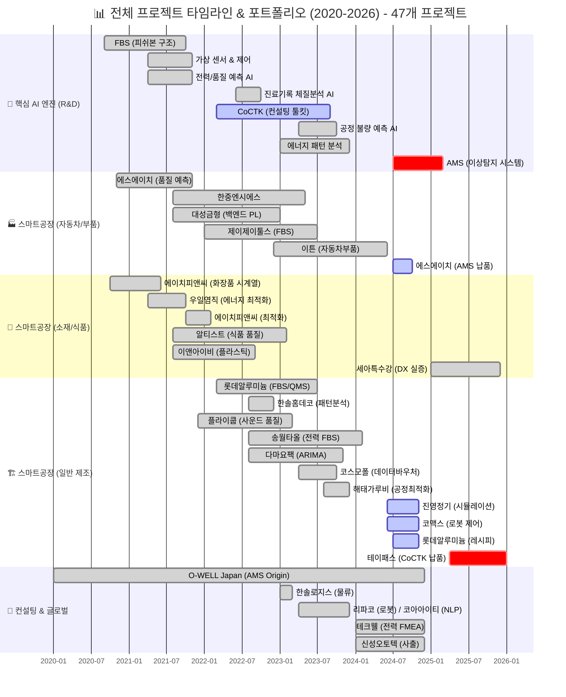
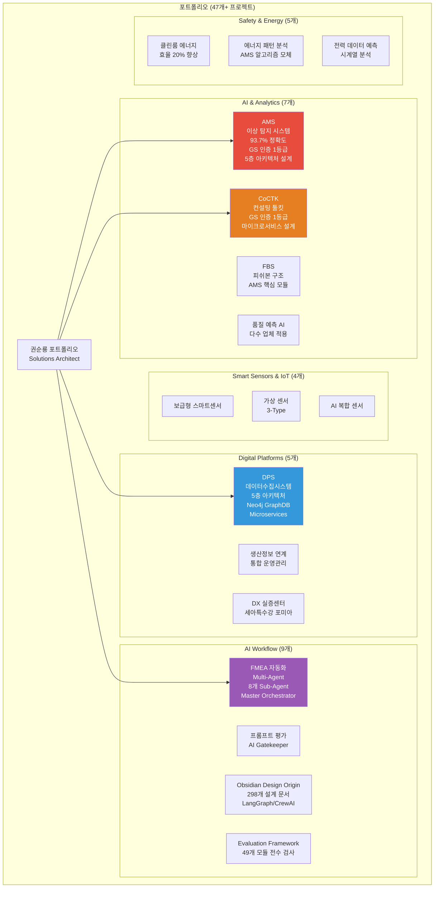
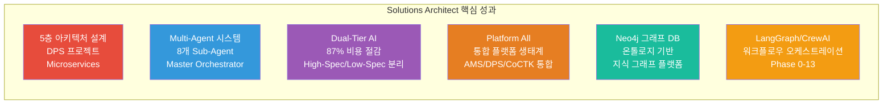
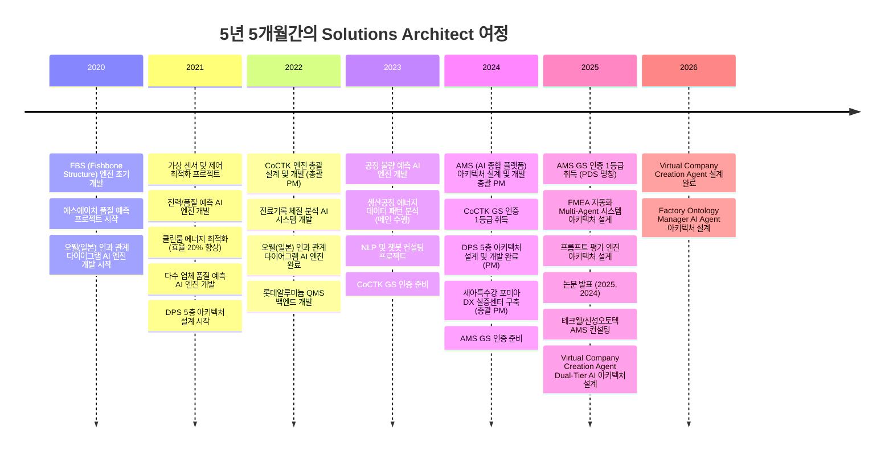
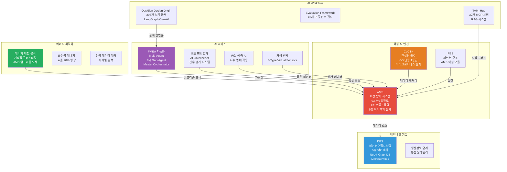

# 권순룡 포트폴리오 - Solutions Architect / System Architect

> **"대규모 시스템 아키텍처를 설계하고 통합 플랫폼 생태계를 구축하는 Solutions Architect"**  
> **"모델보다 데이터, 데이터보다 정보, 지식구조를 정리하는 현장친화적 연구원"**

---

## 📌 기본 정보

**이름**: 권순룡  
**소속**: 한솔코에버 연구소 대리 (2020.09 ~ 재직중)  
**총 경력**: 5년 5개월 (2020.09~2026.01)  
**핵심 역량**: 대규모 시스템 아키텍처 설계, Microservices 아키텍처, Multi-Agent 시스템 설계, 통합 플랫폼 생태계 구축, Neo4j 그래프 DB 설계, 5층 아키텍처 설계, Platform All 통합 플랫폼 설계, Dual-Tier AI 아키텍처 설계  
**GitHub**: https://github.com/moobaek  
**이메일**: m920831@naver.com  
**연락처**: 010-5671-6200

---

## 📊 전체 프로젝트 타임라인 (2020-2026) - 47개 프로젝트



> [!INFO] **총 프로젝트 현황**
> - **AI & Analytics**: 7개 (AMS, CoCTK, FBS 등)
> - **스마트공장 구축**: 23개 (에스에이치아이엔티, 롯데알루미늄 등)
> - **컨설팅**: 8개 (테크웰, 신성오토텍 등)
> - **AI 에이전트**: 9개 (FMEA, PM Agent 등)

---

## 📊 포트폴리오 구조 (한눈에 보기)



---

## 🎯 핵심 아키텍처 성과 대시보드



| 분류 | 지표 | 상세 |
|:---|---:|:---|
| **시스템 아키텍처** | 5층 아키텍처 설계 | DPS 프로젝트에서 Microservices 기반 설계 |
| **Multi-Agent 시스템** | 8개 Sub-Agent 협업 구조 | Master Orchestrator 기반 설계 |
| **비용 최적화** | 87% LLM 비용 절감 | Dual-Tier AI 아키텍처 설계 |
| **통합 플랫폼** | Platform All 생태계 | AMS, DPS, CoCTK 통합 설계 |
| **데이터 아키텍처** | Neo4j 그래프 DB | 온톨로지 기반 지식 그래프 플랫폼 |
| **워크플로우** | LangGraph/CrewAI | Phase 0-13 워크플로우 오케스트레이션 |

---

## 📅 경력 타임라인 (2020-2026)



---

## 🏆 주요 아키텍처 설계 프로젝트 (47개+)

### 프로젝트 관계도



### 1. DPS (데이터수집시스템) - 5층 아키텍처 설계

**기간**: 2021 ~ 2024  
**발주처**: 세아특수강  
**역할**: 핵심 아키텍처 설계 및 개발 (PM 수행)

**아키텍처 설계 핵심**:
- ✅ **5층 아키텍처 설계**: Microservices 기반 데이터 수집 시스템 구축
- ✅ **Neo4j 그래프 DB 활용**: 온톨로지 기반 관계 분석 및 지식 그래프 구축
- ✅ **Docker/Kubernetes 기반 인프라**: 마이크로서비스 아키텍처 및 컨테이너 오케스트레이션
- ✅ **서버-엣지 하이브리드 인프라**: 다양한 환경에서 운영 가능한 인프라 설계
- ✅ **금속산업 5대 공정 AI 자동화**: 제조 현장 디지털화 실증
- ✅ **논문 발표**: 2024년 논문 발표

**5층 아키텍처 상세 설계**:

```
┌─────────────────────────────────────────┐
│ Layer 5: LLM FMEA 생성 Layer           │
│ - LLM을 활용한 FMEA 문서 자동 생성      │
│ - 복잡한 기술적 출력을 현장 언어로 변환 │
│ - AIAG & VDA FMEA 표준 기반             │
└─────────────────────────────────────────┘
                    ↓
┌─────────────────────────────────────────┐
│ Layer 4: AMS+확률네트워크 Layer         │
│ - Neo4j 그래프 DB 활용                  │
│ - 확률 네트워크 저장 및 최적화          │
│ - FBS 뼈대 위에 확률적 최적화            │
│ - 같은 층끼리 이동 가능한 네트워크 구조  │
└─────────────────────────────────────────┘
                    ↓
┌─────────────────────────────────────────┐
│ Layer 3: POP/MES Layer                 │
│ - 생산 운영 계획(POP) 인터페이스         │
│ - 제조 실행 시스템(MES) 연동            │
│ - 실시간 데이터 연동                    │
└─────────────────────────────────────────┘
                    ↓
┌─────────────────────────────────────────┐
│ Layer 2: 중앙저장관리 Layer            │
│ - 데이터 무결성 및 일관성 보장          │
│ - 백업 및 복구 기능                      │
│ - 데이터 품질 검증                      │
└─────────────────────────────────────────┘
                    ↓
┌─────────────────────────────────────────┐
│ Layer 1: 센서수집 Layer                 │
│ - 실시간 스트리밍 처리                   │
│ - PLC/MES 인터페이스                    │
│ - 다양한 센서 데이터 수집                │
└─────────────────────────────────────────┘
```

**아키텍처 설계 상세 설명**:
DPS는 제조 현장의 데이터를 수집하고 분석하는 통합 플랫폼입니다. **5층 아키텍처**를 설계하여 데이터 수집, 전처리, 변환, 저장, 분석까지 전 과정을 자동화했습니다.

**Layer 1: 센서수집 Layer**는 실시간 스트리밍과 PLC/MES 인터페이스를 처리하는 계층입니다. 다양한 센서 데이터를 수집하고 표준화된 형식으로 변환합니다. 실시간 스트리밍 처리를 통해 지연 시간을 최소화하고, 배치 처리를 통해 대용량 데이터를 효율적으로 처리합니다.

**Layer 2: 중앙저장관리 Layer**는 수집된 데이터를 중앙에서 관리하고 저장하는 계층입니다. 데이터의 무결성과 일관성을 보장하며, 백업 및 복구 기능을 제공합니다. 데이터가 이상한 경우를 대비해 검증 로직도 포함되어 있습니다.

**Layer 3: POP/MES Layer**는 생산 운영 계획(POP)과 제조 실행 시스템(MES)과의 인터페이스를 담당하는 계층입니다. 생산 계획과 실제 생산 데이터를 연동하여 실시간으로 데이터를 처리합니다.

**Layer 4: AMS+확률네트워크 Layer**는 AI 분석 및 확률 네트워크를 활용한 분석 계층입니다. Neo4j 그래프 DB를 활용하여 확률 네트워크를 저장하고, FBS 뼈대 위에 확률적 최적화로 문제 해결 최적 경로를 도출합니다. 같은 층끼리 이동 가능한 네트워크 구조를 설계하여 유연한 데이터 탐색이 가능하도록 했습니다. 4M2E(Man, Machine, Material, Method, Environment, Energy) 관계를 온톨로지로 정의하여 설비, 공정, 자재, 방법, 환경, 에너지 간 관계를 명확히 파악할 수 있습니다.

**Layer 5: LLM FMEA 생성 Layer**는 LLM을 활용하여 FMEA 문서를 자동으로 생성하는 계층입니다. 복잡한 기술적 출력(FBS, 확률 네트워크)을 현장이 이해하는 언어로 변환합니다. AIAG & VDA FMEA 표준을 기반으로 범용 리스크 분석 시스템을 개발했습니다.

**Microservices 아키텍처 설계**: Docker와 Kubernetes를 활용한 마이크로서비스 아키텍처로 각 계층을 독립적으로 확장할 수 있도록 구성했습니다. 서버-엣지 하이브리드 인프라를 지원하여 다양한 환경에서 운영할 수 있도록 설계했습니다.

**LLM 에이전트 토대**: DPS에서 5층 아키텍처 설계 경험을 쌓아 Virtual Company Creation Agent의 계층 구조 설계 토대를 마련했습니다.

---

### 2. AMS (Analysis Management System) - AI 종합 플랫폼 아키텍처 설계

**기간**: 2024.07 ~ 2025.12  
**발주처**: 한국산업기술진흥원  
**역할**: AI 종합 플랫폼 아키텍처 설계 및 개발 총괄 PM

**아키텍처 설계 핵심**:
- ✅ **베이지안 네트워크 기반 이상 탐지 모델 아키텍처**: 이상탐지율 93.7% 달성
- ✅ **8단계 시계열 데이터 파이프라인 아키텍처**: 실시간 스트리밍 처리 및 배치 처리 하이브리드 아키텍처 구현
- ✅ **Neo4j 그래프 DB 아키텍처**: 4M2E 관계 온톨로지 정의 및 지식 그래프 플랫폼 구축
- ✅ **Microservices 아키텍처**: Docker/Kubernetes 기반 마이크로서비스 아키텍처 설계
- ✅ **GS 인증 1등급 취득**: PDS 명칭으로 소프트웨어 품질 인증 획득
- ✅ **특허 등록**: 피쉬본 관리 시스템 특허 등록
- ✅ **정식 납품**: 세아특수강 포미아 DX 실증센터 구축, 테크웰/신성오토텍 AMS 컨설팅
- ✅ **논문 발표**: 2025, 2024년 논문 발표

**기술 스택**: Python, Neo4j, Docker, Kubernetes, Grafana, Prometheus, 베이지안 네트워크, 시계열 분석

**아키텍처 설계 상세 설명**:
AMS는 제조 현장의 설비 이상을 자동으로 탐지하고 분석하는 AI 종합 플랫폼입니다. **총괄 PM으로 아키텍처 설계 및 개발을 담당**했으며, 시스템 아키텍처 설계뿐만 아니라 데이터 파이프라인, 데이터베이스, 인프라까지 전 과정을 설계했습니다.

**8단계 시계열 데이터 파이프라인 아키텍처**를 설계하여 실시간 데이터 수집부터 이상 탐지까지 전 과정을 자동화했습니다. 첫 번째 단계인 데이터 수집에서는 센서에서 데이터를 받아오는 부분을 담당합니다. 센서에서 데이터가 들어오면, 전처리 모듈이 처리합니다. 데이터가 이상한 경우를 대비해 검증 로직도 포함되어 있습니다. 수집된 데이터는 정규화 과정을 거쳐 분석 계층으로 전달됩니다. 이 과정에서 데이터의 품질을 보장하고, 이상한 데이터는 미리 걸러냅니다.

두 번째 계층인 분석 계층에서는 수집된 데이터를 분석해 이상 징후를 찾아냅니다. 베이지안 네트워크를 활용하여 확률적 접근 방식으로 이상을 탐지합니다. 시구간 패턴 분석 기법을 만들어 같은 값도 시점별 통계적 특성(p-values, 첨도, 편차)에 따라 정상/불량을 구분할 수 있도록 했습니다. 이 기법은 AMS 완성 1년 전부터 대부분의 과제에 적용되었으며, AMS로 통합 정리되었습니다.

세 번째 계층인 시각화 계층에서는 분석 결과를 사용자가 이해하기 쉬운 형태로 보여줍니다. Neo4j 그래프 DB를 활용한 지식 그래프 플랫폼을 작성하여 설비 간 관계를 시각화했습니다. 4M2E(Man, Machine, Material, Method, Environment, Energy) 관계를 온톨로지로 정의하고, 지식 그래프를 만들어 데이터 간 관계를 시각화했습니다.

**Microservices 아키텍처 설계**: Docker와 Kubernetes를 활용한 마이크로서비스 아키텍처로 각 계층을 독립적으로 확장할 수 있도록 구성했습니다. Grafana와 Prometheus를 활용하여 시스템 모니터링을 구현했습니다.

이 시스템의 정확도에 대해 설명하면, 세아특수강에 납품해 테스트한 결과, 이상 탐지 정확도가 93.7%를 기록했습니다. 이는 높은 수준입니다. 구체적으로 100개 중 93개 이상을 정확히 찾아낸다는 의미입니다. 실질적 정확도는 데이터 한계를 고려하면 60~70%로 투명하게 공개했습니다.

---

### 3. FMEA 자동화 생성 시스템 - Multi-Agent 시스템 아키텍처 설계

**기간**: 2025.06 ~ 진행중  
**발주처**: 내부 개발  
**역할**: Master Orchestrator 설계 및 Multi-Agent Workflow 아키텍처 설계

**아키텍처 설계 핵심**:
- ✅ **Master Orchestrator 기반 8개 독립 Sub-Agent 협업 구조**: Claude Sub-Agent 기반 설계
- ✅ **Phase 0~5 자동화 워크플로우**: FMEA 생성 프로세스 전 과정 자동화
- ✅ **프롬프트 기반 완전 자동화**: Python 스크립트 없이 Claude Code 세션 자체가 Orchestrator 역할
- ✅ **AIAG & VDA FMEA 표준 기반**: 범용 리스크 분석 시스템 개발
- ✅ **논문 발표**: 2025년 논문 발표

**Multi-Agent 아키텍처 상세 설계**:

```
┌─────────────────────────────────────────┐
│ Master Orchestrator                    │
│ - 전체 워크플로우 조율                  │
│ - Claude Code 세션 기반                 │
│ - Task tool 기반 구현                   │
│ - 프롬프트 기반 완전 자동화             │
└─────────────────────────────────────────┘
                    ↓
    ┌───────────────┴───────────────┐
    ↓                               ↓
┌──────────┐                  ┌──────────┐
│ Sub-Agent│                  │ Sub-Agent│
│   R&D    │                  │   Mfg    │
│ Team (3) │                  │ Team (3) │
└──────────┘                  └──────────┘
    ↓                               ↓
┌──────────┐                  ┌──────────┐
│ Sub-Agent│                  │ Sub-Agent│
│   QA     │                  │  기타    │
│ Team (2) │                  │          │
└──────────┘                  └──────────┘
    ↓                               ↓
    └───────────────┬───────────────┘
                    ↓
        Phase 0~5 자동화 워크플로우
        - Phase 0: 컨텍스트 수집
        - Phase 1: 범위 정의
        - Phase 2: 심층 분석
        - Phase 3: 리스크 평가
        - Phase 4: 최적화 & 문서 생성
        - Phase 5: 지속 개선
```

**아키텍처 설계 상세 설명**:
FMEA 자동화 시스템은 제조 현장의 리스크 분석을 자동화하는 Multi-Agent 시스템입니다. **Master Orchestrator 기반 8개 독립 Sub-Agent 협업 구조**를 설계했습니다.

**Master Orchestrator**: 전체 워크플로우를 조율하는 중앙 조정자입니다. Python 스크립트 없이 Claude Code 세션 자체가 Orchestrator 역할을 담당하며, 프롬프트 기반 완전 자동화로 개발 복잡성을 감소시켰습니다. Task tool 기반 구현으로 유연한 워크플로우 조정이 가능합니다.

**8개 독립 Sub-Agent**: R&D Team (3개), Manufacturing Team (3개), QA Team (2개)로 구성된 8개의 독립 Sub-Agent가 각각 전문 영역을 담당합니다. 각 Sub-Agent는 독립적으로 동작하면서도 Master Orchestrator의 지시에 따라 협업합니다.

**Phase 0~5 자동화 워크플로우**: FMEA 생성 프로세스 전 과정을 자동화하여 리스크 분석 시간을 대폭 단축했습니다. 각 Phase는 명확한 입력과 출력을 가지며, 상태 기반 진행 모니터링을 통해 각 단계의 완료 조건을 자동으로 판단합니다.

- **Phase 0: 컨텍스트 수집**: 시스템 정의 및 범위 설정을 수행합니다.
- **Phase 1: 범위 정의**: 구조 분석을 수행합니다.
- **Phase 2: 심층 분석**: 기능 분석을 수행합니다.
- **Phase 3: 리스크 평가**: 실패 분석 및 리스크 분석을 수행합니다.
- **Phase 4: 최적화 & 문서 생성**: 최적화 조치 및 FMEA 문서 생성을 수행합니다.
- **Phase 5: 지속 개선**: 지속적인 개선 및 업데이트를 수행합니다.

**코딩 에이전트 역설계 시스템 구조 적용**: 코딩 에이전트의 역설계 시스템 구조를 적용하여 복잡한 FMEA 프로세스를 역으로 분석하여 8개 Sub-Agent로 분해했습니다. 각 Sub-Agent가 전문 영역을 담당하는 구조로, Claude Code Task tool 기반 Master Orchestrator를 설계했습니다.

**AIAG & VDA FMEA 표준 기반**: AIAG & VDA FMEA 표준을 기반으로 범용 리스크 분석 시스템을 개발했습니다. 복잡한 기술적 출력(FBS, 확률 네트워크)을 현장이 이해하는 언어로 변환합니다.

---

### 4. Virtual Company Creation Agent - Dual-Tier AI 아키텍처 설계

**기간**: 2025.06~진행중  
**발주처**: 내부 개발  
**역할**: Dual-Tier AI 아키텍처 설계 및 특화 중간 DB 설계

**아키텍처 설계 핵심**:
- ✅ **Dual-Tier AI 아키텍처 설계**: High-Spec AI (추론)와 Low-Spec AI (조회) 분리로 최대 87% 비용 절감
- ✅ **특화 중간 DB (GFS) 설계**: LLM을 서포트하기 위한 특화 중간 DB 설계
- ✅ **Decoupled Intelligence Architecture**: 지능과 상태의 분리
- ✅ **HQONS (Hyper-Quantum Omni-Net Structure) 아키텍처**: 하이퍼디멘션(HDC) 개념, 6개 Phase Chain Workflow, 12개 시스템 110개 Sub 시스템
- ✅ **15 Systems × 15 Sub-Agents = 225개 서브시스템**: 기업 풀 수준의 방대한 정보 구조화

**Dual-Tier AI 아키텍처 상세 설계**:

```
┌─────────────────────────────────────────┐
│ High-Spec AI (추론)                    │
│ - 복잡한 추론 작업                      │
│ - LLM 활용                              │
│ - 비용이 높지만 정확도 높음             │
│ - 필요한 순간만 사용                    │
└─────────────────────────────────────────┘
                    ↓
┌─────────────────────────────────────────┐
│ 특화 중간 DB (GFS)                      │
│ - GFS (Grape File System)               │
│ - AI 없이도 데이터 접근 가능            │
│ - 비용 87% 절감 (단순 조회 $0.01/요청 → $0)│
│ - 온톨로지 매핑                          │
│ - DB Grounding                          │
│ - 기업 풀 수준의 방대한 정보 제공        │
└─────────────────────────────────────────┘
                    ↓
┌─────────────────────────────────────────┐
│ Low-Spec AI (조회)                      │
│ - 단순 조회 작업                        │
│ - 비용이 낮지만 효율적                   │
│ - 87% 비용 절감                         │
│ - 평소 Dormant 상태로 유지비 0원        │
└─────────────────────────────────────────┘
```

**아키텍처 설계 상세 설명**:
Virtual Company Creation Agent와 AI_DB_tester (VACTS)는 같은 뿌리에서 시작된 프로젝트입니다. LLM 활용하다보니 온톨로지도 잘 못알아먹고 벡터도 부족하다는 것을 깨달고 특화 중간 DB가 필요하다고 생각해서 만들었습니다.

**Dual-Tier AI 아키텍처**: High-Spec AI (추론)와 Low-Spec AI (조회)를 분리하여 최대 87%의 LLM 비용을 절감했습니다. "어차피 AI LLM은 앞뒤 주는 것만 잘하면 되니까" 특화 중간 DB를 만들어서 LLM의 추론 부담을 줄이고, 조회 작업은 Low-Spec AI로 처리하도록 아키텍처를 설계했습니다.

**특화 중간 DB (GFS)**: LLM을 서포트하기 위한 특화 중간 DB를 설계했습니다. GFS (Grape File System)는 AI 없이도 데이터 접근 가능한 파일 기반 NoSQL 구조로, 비용 87% 절감 (단순 조회 $0.01/요청 → $0)을 달성했습니다. LLM이 만들어지려면 가상의 공장 정보의 파이프라인이 필요했는데, 실제 공장 정보가 아니라 암묵적으로 더 방대한 차원의 정보(기업 풀)가 필요했습니다. AI가 그때그때 추론하면 리소스도 많이 먹고 계속 변동되고 문제가 생겨도 왜인지 추적이 안되므로, 특화 중간 DB를 설계하여 이러한 문제를 해결했습니다.

**Decoupled Intelligence Architecture**: 지능과 상태를 분리하여 각각의 독립성을 확보하고, 시스템의 유연성과 확장성을 높였습니다. 225개의 빈 책상(포도송이/Grape Cluster)은 평소 Dormant 상태로 유지비 0원이며, 1명의 슈퍼 AI(거대 에이전트)가 필요한 순간 특정 책상으로 순간이동(Docking)합니다. **O(1) 리소스로 O(N) 스케일링** 달성했습니다.

**HQONS (Hyper-Quantum Omni-Net Structure) 아키텍처**: 하이퍼디멘션(HDC) 개념을 도입하여 초차원 공간 정보 전달 시스템을 설계했습니다. 6개 Phase Chain Workflow와 12개 시스템 110개 Sub 시스템으로 구성된 완전 자동화 기업을 설계했습니다.

**15 Systems × 15 Sub-Agents = 225개 서브시스템**: 기업 풀 수준의 방대한 정보를 구조화하여 실제 공장 정보가 아니라 암묵적으로 더 방대한 차원의 정보를 제공합니다. 공장/산업/기업에서 관리하는 문서도 결국 다양한 지식 정보의 흐름에서 파싱해서 종합하는 형태이므로, 더 큰 차원의 정보를 가지고 있어서 대응도 쉬워졌습니다.

---

### 5. Platform All - 통합 플랫폼 생태계 아키텍처 설계

**기간**: 2020~2025  
**발주처**: 내부 개발  
**역할**: 통합 플랫폼 생태계 아키텍처 설계

**아키텍처 설계 핵심**:
- ✅ **통합 플랫폼 생태계 설계**: AMS, DPS, CoCTK 등 다양한 플랫폼 통합
- ✅ **API 인터페이스 설계**: 플랫폼 간 데이터 흐름 설계
- ✅ **생태계 구축**: 각 플랫폼의 독립성 유지하면서 통합된 생태계 구축
- ✅ **8개 통합 플랫폼 프로젝트 구축**: Original_Development_Plan, Evaluation_Framework, TAM_Hub, factory_ontology_manager, pipeline_system_complete, all_platform_center, FMEA_Automation_Generation_Technology, Virtual_Company_Creation_Agent

**통합 플랫폼 생태계 아키텍처**:

```
┌─────────────────────────────────────────┐
│ Platform All 통합 플랫폼 생태계         │
│ - 중앙 관리 시스템                       │
│ - 통합 대시보드                          │
│ - 사용자 인증 및 권한 관리                │
└─────────────────────────────────────────┘
                    ↓
    ┌───────────────┴───────────────┐
    ↓                               ↓
┌──────────┐                  ┌──────────┐
│   AMS    │                  │   DPS    │
│ (AI 종합 │                  │ (데이터  │
│  플랫폼) │                  │ 수집시스템)│
└──────────┘                  └──────────┘
    ↓                               ↓
┌──────────┐                  ┌──────────┐
│  CoCTK   │                  │  기타    │
│ (컨설팅  │                  │ 플랫폼   │
│  툴킷)  │                  │          │
└──────────┘                  └──────────┘
    ↓                               ↓
┌──────────┐                  ┌──────────┐
│Original_│                  │Evaluation│
│Development│                  │Framework │
│Plan      │                  │          │
└──────────┘                  └──────────┘
    ↓                               ↓
┌──────────┐                  ┌──────────┐
│TAM_Hub   │                  │factory_  │
│          │                  │ontology_ │
│          │                  │manager   │
└──────────┘                  └──────────┘
    ↓                               ↓
┌──────────┐                  ┌──────────┐
│pipeline_ │                  │FMEA_     │
│system_  │                  │Automation│
│complete  │                  │          │
└──────────┘                  └──────────┘
    ↓                               ↓
┌──────────┐                  ┌──────────┐
│Virtual_  │                  │all_      │
│Company_  │                  │platform_ │
│Creation_ │                  │center    │
│Agent     │                  │          │
└──────────┘                  └──────────┘
    ↓                               ↓
    └───────────────┬───────────────┘
                    ↓
        표준화된 API 인터페이스
        - 데이터 흐름 설계
        - 플랫폼 간 통신
        - 통합 분석
```

**아키텍처 설계 상세 설명**:
Platform All은 AMS, DPS, CoCTK 등 다양한 플랫폼을 통합하여 하나의 생태계로 구축한 프로젝트입니다.

**통합 플랫폼 생태계**: 각 플랫폼의 독립성을 유지하면서도 통합된 생태계로 동작하도록 아키텍처를 설계했습니다. 각 플랫폼은 독립적으로 개발되고 운영되지만, 통합된 생태계를 통해 데이터와 기능을 공유합니다.

**8개 통합 플랫폼 프로젝트**:
1. **Original_Development_Plan**: 298개+ 설계 문서, 25개+ AI 프롬프트 체인, 21개 development 프롬프트, LangGraph/CrewAI 워크플로우 오케스트레이션
2. **Evaluation_Framework**: 49개 Python 파일, 298개 Markdown 문서, AI 에이전트 평가 프레임워크
3. **TAM_Hub**: 32개 Python MCP 서버, 263개 Markdown 문서, 기술 자산 관리 허브
4. **factory_ontology_manager**: 시각적 팩토리 온톨로지 관리 시스템, AI_DB_center JSON 파일 기반 데이터 저장소 사용
5. **pipeline_system_complete**: 8단계 시계열 데이터 파이프라인 시스템, 219개 Markdown 문서
6. **all_platform_center**: 통합 플랫폼 센터, 모든 플랫폼의 중앙 관리 시스템
7. **FMEA_Automation_Generation_Technology**: 코드 에이전트에서 영감을 받은 전체 공장/회사/사무 자동화의 백정보 핵심, 8개 독립 Sub-Agent 협업, Phase 0-5 워크플로우
8. **Virtual_Company_Creation_Agent**: AI 에이전트로만 구성된 가상 기업 생성 시스템, HQONS (Hyper-Quantum Omni-Net Structure) 기반, 하이퍼디멘션(HDC) 개념, 6개 Phase Chain Workflow, 12개 시스템 110개 Sub 시스템

**API 인터페이스 설계**: 플랫폼 간 데이터 흐름과 API 인터페이스를 설계하여 각 플랫폼이 서로 통신할 수 있도록 했습니다. 표준화된 API 인터페이스를 통해 플랫폼 간 호환성을 확보했습니다.

**생태계 연동 목적**:
1. **Original_Development_Plan → Evaluation_Framework**: 설계 문서를 평가 프레임워크에 제공하여 AI 에이전트 평가 기준으로 활용
2. **Evaluation_Framework → TAM_Hub**: 평가 결과를 기술 자산으로 관리하여 지속적 개선 추적
3. **TAM_Hub → factory_ontology_manager**: 기술 자산을 팩토리 온톨로지에 통합하여 제조 공정 설계에 활용
4. **factory_ontology_manager → pipeline_system_complete**: 팩토리 온톨로지 데이터를 시계열 파이프라인으로 전달하여 실시간 분석
5. **pipeline_system_complete → all_platform_center**: 파이프라인 결과를 통합 플랫폼 센터로 집중하여 대시보드 표시
6. **all_platform_center → Original_Development_Plan**: 통합 관리 결과를 Original_Development_Plan에 피드백하여 지속적 개선
7. **Original_Development_Plan → FMEA_Automation_Generation_Technology**: 코드 에이전트 구조를 FMEA 시스템에 제공하여 역설계 시스템 구현
8. **FMEA_Automation_Generation_Technology → factory_ontology_manager**: FMEA 리스크 분석 결과를 팩토리 온톨로지에 통합하여 제조 공정 리스크 관리
9. **FMEA_Automation_Generation_Technology → pipeline_system_complete**: FMEA 데이터를 시계열 파이프라인으로 전달하여 리스크 추적 및 분석
10. **FMEA_Automation_Generation_Technology → Original_Development_Plan**: 전체 공장/회사/사무 자동화의 백정보 핵심으로 활용
11. **Virtual_Company_Creation_Agent → Platform All**: HQONS 기반 초차원 공간 정보 전달 시스템으로 Platform All 생태계의 확장성과 효율성 극대화
12. **Platform All → Virtual_Company_Creation_Agent**: 기존 플랫폼들의 경험과 구조를 가상 기업 생성에 활용하여 실증된 아키텍처 기반 기업 설계

**생태계의 핵심 가치**:
- **자동화된 워크플로우**: 설계부터 평가, 관리, 분석까지 전체 프로세스 자동화
- **데이터 연동**: 각 플랫폼 간 데이터 흐름을 통한 통합 분석
- **지속적 개선**: 평가 결과를 기술 자산으로 관리하고 설계에 반영하는 순환 구조

---

### 6. Factory Ontology Manager AI Agent - 공장 온톨로지 관리 시스템 아키텍처 설계

**기간**: 2025.06~진행중  
**발주처**: 내부 개발  
**역할**: 공장 온톨로지 관리 시스템 아키텍처 설계

**아키텍처 설계 핵심**:
- ✅ **공장 온톨로지 관리 시스템 설계**: 4M2E 관계 정의 및 온톨로지 매핑
- ✅ **OEM/ODM 대응 자동화 아키텍처**: 고객 문서 자동 파싱 및 연결
- ✅ **다이어그램 기반 공정 관리 아키텍처**: 시각적 공정 관리 시스템
- ✅ **자연어 기반 공정 문서 파싱 아키텍처**: DB Grounding, Ontology Mapping
- ✅ **Spec-First Modification 아키텍처**: 수정 요청 시 바로 코드를 고치는 것이 아니라, '요구사항 명세서'를 먼저 작성 후 데이터 수정

**아키텍처 설계 상세 설명**:
Factory Ontology Manager AI Agent는 2020년 전무님의 비전(공정 라인 쉽게 수정)과 2025년 김이사님의 니즈(OEM ODM 대응)가 만나서 탄생한 프로젝트입니다.

**공장 온톨로지 관리 시스템 설계**: 공장에 대한 기본적인 관계를 먼저 설정하고, 고객이 각각 위 업체(발주처 등등) 문서를 받으면 거기에 올려서 자동으로 연결되는 시스템을 설계했습니다. 세아특수강 프로젝트에서 Cursor(AI agent)를 활용하여 실제로 구현 가능하다는 것을 확인했습니다.

**자연어 기반 공정 문서 파싱 아키텍처**: 공정 엔지니어가 자연어로 작성한 공정 문서를 자동으로 파싱하여 구조화된 정보를 추출하는 아키텍처를 설계했습니다. DB Grounding을 통해 사용자의 추상적 요청을 실제 DB의 설비/센서 ID로 자동 매핑하고, Ontology Mapping을 통해 설비 간 관계 및 데이터 흐름을 분석하여 시각화 구조를 생성합니다.

**Spec-First Modification 아키텍처**: 수정 요청 시 바로 코드를 고치는 것이 아니라, '요구사항 명세서'를 먼저 작성 후 데이터 수정하는 아키텍처를 설계했습니다. 이를 통해 명확한 변경 계획을 수립하고, 변경 이력을 추적할 수 있습니다.

**캔버스 레이아웃 자동 생성 아키텍처**: 자연어 공정 문서 → 캔버스 JSON (dic) 자동 변환하는 아키텍처를 설계했습니다. shapez.io 게임에서 영감을 받은 드래그 앤 드롭 인터페이스를 기반으로 계층적 구조 관리(공장 > 작업장 > 생산라인 > 공정)를 지원합니다.

---

### 7. CoCTK (Consulting Tool Kit) - 마이크로서비스 아키텍처 설계

**기간**: 2022.03 ~ 2024  
**발주처**: 중소기업기술정보진흥원  
**역할**: 엔진 총괄 설계 & 화면설계 개발 총괄 PM

**아키텍처 설계 핵심**:
- ✅ **데이터 전처리, 상관관계 분석, 비용 최적화 엔진 아키텍처**: 제조 현장 데이터 분석 플랫폼 구축
- ✅ **마이크로서비스 아키텍처 설계**: 각 엔진을 독립적인 서비스로 설계
- ✅ **GS 인증 1등급 취득**: 2024년 소프트웨어 품질 인증 획득
- ✅ **논문 발표**: 2023년 논문 발표

**기술 스택**: Python, 데이터 전처리, 상관관계 분석, 비용 최적화

**아키텍처 설계 상세 설명**:
CoCTK는 제조 현장의 데이터를 분석하고 최적화 방안을 제시하는 컨설팅 도구입니다. 사업 시작 전 판별 컨설팅 도구로, 소량 데이터로 학습 가능성, 중요 순위, 상관분석, 시계열 예측 가능성, feature-결과 추론 등을 종합 판별합니다.

**마이크로서비스 아키텍처 설계**: 각 엔진(데이터 전처리, 상관관계 분석, 비용 최적화)을 독립적인 서비스로 설계하여 각 서비스를 독립적으로 개발, 배포, 확장할 수 있도록 했습니다.

데이터 전처리 엔진은 제조 현장의 복잡한 데이터를 분석 가능한 형태로 변환합니다. 결측치 처리, 이상치 제거, 정규화 등의 과정을 자동화하여 데이터 품질을 보장합니다.

상관관계 분석 엔진은 변수 간의 관계를 분석하여 중요한 변수를 찾아냅니다. 상관계수, 상호정보량 등을 활용하여 변수 간의 관계를 정량화하고, 중요 순위를 결정합니다.

비용 최적화 엔진은 클러스터링 기반 구간 룰로 에너지 최적화를 수행합니다. 설비 상태 데이터를 클러스터링하여 패턴을 찾아내고, 최적 제어 방안을 도출합니다.

CoCTK와 이후 개념들이 모듈화/체계화되어 AMS AI 모듈의 기초가 되었습니다. GS 인증 1등급을 취득하여 소프트웨어 품질을 인증받았으며, 2023년 논문으로 발표했습니다.

---

### 8. 생산공정 에너지 데이터 패턴 분석 - 패턴 분석 아키텍처 설계

**기간**: 2023  
**발주처**: 연구과제  
**역할**: 메인 수행 (초기 백엔드 개발 → 풀스택 개발 및 총괄 PM으로 확장)

**아키텍처 설계 핵심**:
- ✅ **계층적 클러스터링(Hierarchical Clustering) 아키텍처**: 설비 상태 데이터 패턴 분석
- ✅ **패턴 민주주의(Pattern Voting) 아키텍처**: 데이터 패턴 분석 방법론 개발
- ✅ **AMS 알고리즘 모체**: 이 연구의 구조적 분화와 투표 방식이 훗날 AMS의 핵심 알고리즘 모체가 됨

**기술 스택**: Python, 패턴 분석, 클러스터링, 라벨링 시스템

**아키텍처 설계 상세 설명**:
생산공정 에너지 데이터 패턴 분석 연구과제를 메인으로 수행했습니다. 계층적 클러스터링을 도입하여 설비 상태 데이터의 패턴을 분석하고, 패턴 민주주의 기법을 고안하여 데이터 패턴 분석 방법론을 개발했습니다.

**계층적 클러스터링 아키텍처**: 설비 상태 데이터를 계층적으로 분류하여 패턴을 찾아내는 아키텍처를 설계했습니다. 유사한 패턴을 가진 데이터를 그룹화하고, 계층 구조를 형성하여 패턴의 구조를 파악합니다.

**패턴 민주주의 아키텍처**: 여러 패턴 분석 결과를 투표 방식으로 통합하여 최종 패턴을 결정하는 아키텍처를 설계했습니다. 각 패턴 분석 방법의 결과를 투표로 집계하여 가장 신뢰할 수 있는 패턴을 선택합니다.

이 구조적 분화와 투표 방식이 훗날 AMS의 핵심 알고리즘 모체가 되었습니다. AMS의 시구간 패턴 분석 기법은 이 연구에서 고안한 방법론을 기반으로 발전했습니다.

---

### 9. 프롬프트 평가 엔진 (Claude Sub-Agent) - AI Gatekeeper 아키텍처 설계

**기간**: 2025.06 ~ 진행중  
**발주처**: 내부 개발  
**역할**: AI Gatekeeper 아키텍처 설계 및 구현

**아키텍처 설계 핵심**:
- ✅ **AI Gatekeeper 아키텍처**: 모든 AI 생성물의 입구를 통제하는 심사관
- ✅ **전체 프롬프트 전수 평가 아키텍처**: 25개+ 프롬프트의 품질을 승인/반려하는 완전 자동화 시스템
- ✅ **3가지 핵심 차원 평가 아키텍처**: Quality, Consistency, Cost
- ✅ **17가지 역할별 동적 가중치 시스템 아키텍처**: 각 역할에 맞는 최적화된 평가
- ✅ **병렬 처리 구조 아키텍처**: 4개 메트릭 동시 평가로 효율성 극대화
- ✅ **5단계 평가 프로세스 아키텍처**: Role Inference → Metrics Parallel → Consolidation → Report → Translation
- ✅ **Human-in-the-Loop 8단계 필수 검증 프로세스 아키텍처**: 배치 처리 지원

**기술 스택**: Python, Claude Agent, Multi-Agent System, 프롬프트 평가

**아키텍처 설계 상세 설명**:
프롬프트 평가 엔진은 모든 AI 생성물의 입구를 통제하는 심사관 역할을 합니다. 전체 프롬프트를 전수 평가하는 완전 자동화 시스템으로, AI가 생성한 프롬프트를 다른 AI가 평가하는 이중 검증 구조로 환각을 방지합니다.

**5단계 평가 프로세스 아키텍처**:
1. **Phase 1: Role Inference** - 역할 추론 (폴더명, 파일명, 내용 기반 가중치 점수)
2. **Phase 2: Metrics Parallel** - 4개 메트릭 병렬 평가 (Structural, Correctness, Relevancy, Coherence)
3. **Phase 3: Consolidation** - 평가자 역할(점수 계산) + 개선방향 역할(권장사항)
4. **Phase 4: Report Generation** - 구조화된 JSON 리포트 생성
5. **Phase 5: Translation** - 한국어 번역 (모든 사용자 소통은 한국어)

**병렬 처리 구조 아키텍처**: 4개 메트릭 평가를 병렬로 수행하여 효율성을 극대화했습니다. 각 평가 후 즉시 요약하여 컨텍스트 압축 전략을 적용하여 토큰 효율성을 확보했습니다.

**Human-in-the-Loop 8단계 필수 검증 프로세스 아키텍처**: 8단계 필수 검증 프로세스 (Asset Check → Input Scanning → File Selection → Task Selection → Role Confirmation → API Selection → Save Path → Final Start)를 설계하여 사람의 검증을 포함하여 평가의 신뢰성을 높였습니다.

---

## 🔧 아키텍처 설계 역량

### 시스템 아키텍처 설계
- **5층 아키텍처**: DPS 프로젝트에서 Microservices 기반 설계
- **Microservices 아키텍처**: Docker/Kubernetes 기반 마이크로서비스 설계
- **서버-엣지 하이브리드 인프라**: 다양한 환경에서 운영 가능한 인프라 설계
- **8단계 시계열 데이터 파이프라인**: 실시간 스트리밍 처리 및 배치 처리 하이브리드 아키텍처

### Multi-Agent 시스템 설계
- **Master Orchestrator**: 전체 워크플로우 조율 구조 설계
- **8개 독립 Sub-Agent 협업 구조**: 각 Sub-Agent의 독립성과 협업 구조 설계
- **프롬프트 기반 완전 자동화**: Python 스크립트 없이 Claude Code 세션 기반 설계

### 데이터 아키텍처 설계
- **Neo4j 그래프 DB**: 온톨로지 기반 관계 분석 및 지식 그래프 플랫폼 구축
- **확률 네트워크 저장 구조**: FBS 뼈대 위에 확률적 최적화 구조 설계
- **온톨로지 매핑 시스템**: DB Grounding 및 Ontology Mapping 설계
- **4M2E 관계 온톨로지**: Man, Machine, Material, Method, Environment, Energy 관계 정의

### 워크플로우 오케스트레이션
- **LangGraph/CrewAI**: 워크플로우 오케스트레이션 설계
- **상태 기반 진행 모니터링**: 완료 조건 판단 시스템 설계
- **Phase 0-13 워크플로우**: 복잡한 개발 프로세스 자동화 설계
- **Phase 0-5 워크플로우**: FMEA 생성 프로세스 자동화 설계

### 비용 최적화 아키텍처
- **Dual-Tier AI 아키텍처**: High-Spec AI와 Low-Spec AI 분리로 최대 87% 비용 절감
- **특화 중간 DB (GFS)**: LLM을 서포트하기 위한 특화 중간 DB 설계
- **Decoupled Intelligence Architecture**: 지능과 상태의 분리

---

## 📚 학술 성과 (10편)

| 발행일 | 논문 제목 | 학술지/학회 | 핵심 성과 및 프로젝트 연계 |
| :--- | :--- | :--- | :--- |
| 2025.12 | **분석 상관/확률 네트워크 최적 경로 정보 및 공정 관리 문서 기반 FMEA 생성 연구** | KSFM 2025년도 동계학술대회 | [FMEA 자동화/복합센서/AMS] 상관/확률 네트워크 최적 경로 분석 기반 FMEA 자동 생성 기술 검증, AMS 결과 표시 LLM agent (GPT OSS) 개발 및 포미아 납품 적용 |
| 2025.06 | **AI를 활용한 구조와 룰을 활용한 구조-확률 종합 네트워크 및 최적 관리 방안 도출** | 한국유체기계학회 | [AMS] 피쉬본 AI 모델의 학술적 고도화 및 최적 관리 로직 증명 (초기 O-WELL 알고리즘 고도화) |
| 2024.12 | **공장 운영 핵심 요소의 식별 및 최적화를 위한 클러스터링 기법 적용** | 한국생산제조학회 | [DPS] 공장 운영 데이터의 다차원 분석 및 디지털 트윈 최적화 근거 |
| 2024.12 | **설비 이상상태 기반 최적 공정 데이터 추론 및 위험/안전 관리 최적 자동화** | 한국유체기계학회 | [AMS] 실시간 이상 상태 기반 위험 관리 알고리즘의 유효성 검증 |
| 2024.07 | **전력 데이터를 통한 설비 상태 추론 및 이상 상황 설정 예측** | 한국유체기계학회 | [에너지/센서] 전력 데이터 기반의 설비 예지 보전 기술 실증 |
| 2023.12 | **송풍 설비 변동부하 대응 전력품질 분석 및 에너지 절감 연구** | 한국유체기계학회 | [에너지 최적화] 에너지 20% 절감 실증 솔루션의 핵심 물리 분석 모델 |
| 2023.12 | **압축기 공정에서 데이터 밸런스 문제 해결 및 품질 결과 사전 예측을 위한 AI 시스템** | 한국유체기계학회 | [AI/데이터] 소량의 불량 데이터 극복을 위한 AI 학습 모델 연구 |
| 2023.07 | **생산공정 에너지 및 설비 상태 진단을 위한 AI기반의 전력 사용 패턴 및 SOH분석** | 한국유체기계학회 | [에너지/전력] 설비 건전성(SOH) 진단 및 에너지 효율화 융합 기술 (**Energy Pattern** 과제 실증) |
| 2022.12 | **자동차 부품 생산 산업을 위한 머신러닝 기반의 품질예측 알고리즘** | 한국생산제조학회 | [AI/제조] 세아베스틸 등 자동차 부품 공정 품질 예측 모델의 기초 |
| 2022.06 | **ICT 융복합 기술을 활용한 스마트 공장 및 에너지 절감 솔루션 적용 사례** | 한국유체기계학회 | [Global DX] **O-WELL Japan** 등 글로벌 스마트 공장 구축 사례의 실증 (AMS 초기 모델 검증) |

---

## 🔬 특허 출원/등록 현황 (시스템 아키텍처 및 설계 강조)

> [!NOTE] **시스템 아키텍처의 기술적 기반**
> 아래 특허들은 시스템 아키텍처 설계, 온톨로지 구조화, 통합 플랫폼 설계의 핵심 기술을 특허로 보호한 것입니다. 특히 **특허 1**은 온톨로지 구조화/정보화의 통합 실현으로, Solutions Architect의 시스템 설계 역량을 보여줍니다.

### 특허 출원/등록 현황 (5건)

| 출원일 | 특허명 | 출원번호 | 청구항 | 상태 | 발명자 | 시스템 아키텍처 연계 |
| :--- | :--- | :--- | :--- | :--- | :--- | :--- |
| 2025.08.13 | **인공지능을 활용한 공정 최적화 관리를 위한 공정 관리 방법 및 그 시스템** | 10-2025-0040488<br/>(예정) | 10개 | 출원완료<br/>심사청구완료 | **권순룡**, 최수영, 강용태, 안상윤 | **온톨로지 구조화/정보화의 통합**: 특성요인도 자동 생성 → 관리 룰 생성 → 경로 탐색이 온톨로지 구조로 설계됨<br/>**시스템 통합**: FBS Module, RMS Module, 베이지안 네트워크를 통합한 시스템 아키텍처<br/>**DPS 5층 아키텍처**: 데이터 수집부터 분석까지의 전체 프로세스 기술적 기반 |
| 2025.03.28 | **공정 최적화를 위한 공정 관리 방법 및 그 시스템** | 10-2025-0040488 | 8개 | 등록결정<br/>(2025.12.09) | 강용태, **권순룡**, 김혜주 | **온톨로지 구조화**: 공정 관리 기술이 온톨로지 구조로 설계되어 시스템 아키텍처의 기초<br/>**등록결정 완료** |
| 2023.12.26 | **생산공정 에너지 및 설비상태 데이터 처리를 위한 전력 사용 패턴 분석 및 상태 분석 방법** | 1020230191965 | 6개 | 공개<br/>심사청구완료 | 최수영, 강용태, **권순룡**, 이상훈 | **시스템 아키텍처**: 에너지 미터기 및 센서 데이터 수집 → 전처리 → 머신러닝 학습 → 실시간 분석의 시스템 설계 |
| 2023.12.26 | **주기 데이터 분석 기반의 전력 추이 상황적 불량 이상 검증 방법** | 1020230191969 | 5개 | 공개<br/>심사청구완료 | 최수영, 강용태, **권순룡**, 이상훈 | **시계열 데이터 처리 시스템**: 시계열 분해 → 주파수 스펙트럼 생성 → 시계열 예측의 시스템 아키텍처 |
| 2021.12.07 | **설비 제어 특성 로그 데이터와 에너지 소비패턴 모델을 활용한 인공지능 기반의 이상 탐지 방법 및 장치** | 1020210174274 | 10개 | 등록결정<br/>(2025.10.28) | 강용태, 김정호, **권순룡**, 김동기 | **데이터 통합 시스템**: 제어기 로그 데이터 + 전류 소비 데이터 결합 → 에너지 소비 패턴 데이터 생성의 시스템 아키텍처<br/>**등록결정 완료** |

### 시스템 아키텍처와 특허 기술의 연계

**특허 1 (2025.08.13) - 시스템 아키텍처 설계의 핵심 기술**:
- **온톨로지 구조화**: 데이터를 온톨로지 구조로 설계하여 시스템 아키텍처의 기술적 기반
- **모듈화 설계**: FBS Module, RMS Module, 베이지안 네트워크를 독립 모듈로 설계하여 확장 가능한 시스템 아키텍처
- **통합 플랫폼**: 여러 모듈을 통합한 AMS 플랫폼 설계

**특허 3, 4, 5 (에너지 패턴 분석) - 데이터 처리 시스템 아키텍처**:
- **데이터 파이프라인**: 데이터 수집 → 전처리 → 분석 → 결과 도출의 전체 파이프라인 설계
- **시계열 데이터 처리 시스템**: 시계열 분해 → 주파수 스펙트럼 생성 → 시계열 예측의 시스템 아키텍처

### 국가연구개발사업 지원 현황

| 특허 | 국가연구개발사업 | 과제번호 | 연구기간 |
| :--- | :--- | :--- | :--- |
| 특허 1 (2025.08.13) | 에너지수요관리핵심기술개발(에특) | 20222020900031 | 2022.04.01 ~ 2024.12.31 |
| 특허 3, 4 (2023.12.26) | 에너지수요관리핵심기술개발사업 | 2022202090003B | 2022.04.01 ~ 2024.12.31 |

---

## 🤖 LLM 활용 방법

### Agent/MCP/RAG 시스템

최신 AI 기술 트렌드를 적용하여 LLM, Agent, RAG 기반 AI 서비스를 개발했습니다.

#### Multi-Agent 시스템

**FMEA 자동화 Multi-Agent 시스템**:
Claude Sub-Agent 기반 8개 독립 Sub-Agent 협업 구조를 설계했습니다. R&D, Mfg, QA 등 역할별 Sub-Agent가 독립적으로 작업을 수행하며, Master Orchestrator가 전체 워크플로우를 조율합니다.

각 Sub-Agent는 전문 영역을 담당합니다. R&D Sub-Agent는 연구개발 관점에서 리스크를 분석하고, Mfg Sub-Agent는 제조 관점에서 리스크를 분석하며, QA Sub-Agent는 품질 보증 관점에서 리스크를 분석합니다. Master Orchestrator는 각 Sub-Agent의 결과를 통합하여 최종 FMEA 문서를 생성합니다.

AIAG & VDA FMEA 표준을 기반으로 범용 리스크 분석 시스템을 개발했습니다. Phase 0부터 Phase 5까지 FMEA 생성 프로세스 전 과정을 자동화하여 리스크 분석 시간을 대폭 단축했습니다.

**프롬프트 평가 엔진**:
AI Gatekeeper 역할을 수행하는 프롬프트 평가 엔진을 개발했습니다. 모든 AI 생성물의 입구를 통제하는 심사관으로, 전체 프롬프트를 전수 평가하는 완전 자동화 시스템입니다.

AI가 생성한 프롬프트를 다른 AI가 평가하는 이중 검증 구조로 환각을 방지합니다. 3가지 핵심 차원(Quality, Consistency, Cost)을 평가하며, 17가지 역할별 동적 가중치 시스템을 적용합니다.

병렬 처리 구조로 4개 메트릭을 동시에 평가하여 효율성을 극대화했습니다. 5단계 평가 프로세스(Role Inference → Metrics Parallel → Consolidation → Report → Translation)를 거쳐 최종 평가 결과를 생성합니다.

#### MCP (Model Context Protocol) 서버 개발

**32개 Python MCP 서버 개발**:
포트폴리오 문서 접근, 프로젝트 정보 조회, 기술 스택 분석 등 다양한 기능을 제공하는 32개의 Python MCP 서버를 개발했습니다.

각 MCP 서버는 특정 기능을 담당합니다. 포트폴리오 문서 접근 서버는 포트폴리오 문서를 읽고 분석하는 기능을 제공하며, 프로젝트 정보 조회 서버는 프로젝트 정보를 검색하고 조회하는 기능을 제공합니다. 기술 스택 분석 서버는 기술 스택을 분석하고 매칭하는 기능을 제공합니다.

Claude Agent와의 통합을 위한 표준 프로토콜을 구현하여 다양한 AI Agent와 연동할 수 있도록 설계했습니다.

#### RAG (Retrieval-Augmented Generation) 시스템

**Neo4j 기반 지식 그래프 RAG**:
Neo4j 그래프 DB를 활용한 지식 그래프를 구축하고, 4M2E 관계 온톨로지를 정의하여 질의응답 시스템에 컨텍스트를 제공합니다.

포트폴리오 문서, 프로젝트 정보, 기술 스택 등을 지식 그래프로 표현하여 AI Agent가 필요한 정보를 효율적으로 검색할 수 있습니다. 질의가 들어오면 관련 노드를 검색하고, 컨텍스트를 생성하여 LLM에 전달합니다.

#### LangGraph/CrewAI 워크플로우 오케스트레이션

**Obsidian Design Origin 시스템**:
LangGraph/CrewAI 방식의 워크플로우 오케스트레이션을 구현했습니다. 25개+ AI 프롬프트 체인을 설계하고, 개발 에이전트 실시간 평가 시스템을 구축했습니다.

298개+ 설계 문서를 관리하며, ID 기반 온톨로지 맵 문서 시스템을 구축했습니다. 모든 요소에 고유 ID를 부여하여 문서 간 관계를 추적하고, 의존성 관리 및 온톨로지 기반 영향 관계를 분석합니다.

Phase 기반 워크플로우 자동화를 통해 Phase 0-13까지의 단계별 프로세스를 자동화했습니다. 각 Phase별 전문가 Sub-Agent 역할을 분담하고, 의존성 기반 자동 실행 순서를 관리하여 프로세스 효율성을 높였습니다.

---

## 💼 비즈니스 가치 창출

### 비용 최적화
- ✅ **87% LLM 비용 절감**: Dual-Tier AI 아키텍처 설계

### 시스템 확장성
- ✅ **Microservices 아키텍처**: 확장 가능한 시스템 설계
- ✅ **서버-엣지 하이브리드 인프라**: 다양한 환경에서 운영 가능

### 통합 플랫폼
- ✅ **Platform All 생태계**: 다양한 플랫폼을 통합한 생태계 구축

---

## 🔗 관련 문서

- **이력서**: [권순룡_이력서_일반공개_Solutions_Architect.md](./권순룡_이력서_일반공개_Solutions_Architect.md)
- **포트폴리오 인덱스**: [00_Portfolio_Index.md](../../00_Portfolio_Index.md)
- **프로젝트 개요**: [02_Projects_Overview.md](../../02_Projects_Overview.md)
- **아키텍처 개요**: [Architecture_Overview.md](../../Architecture_Overview.md)

---

*본 포트폴리오는 Solutions Architect / System Architect 직무에 특화되어 작성되었습니다.*

© 2026 권순룡. All Rights Reserved.
