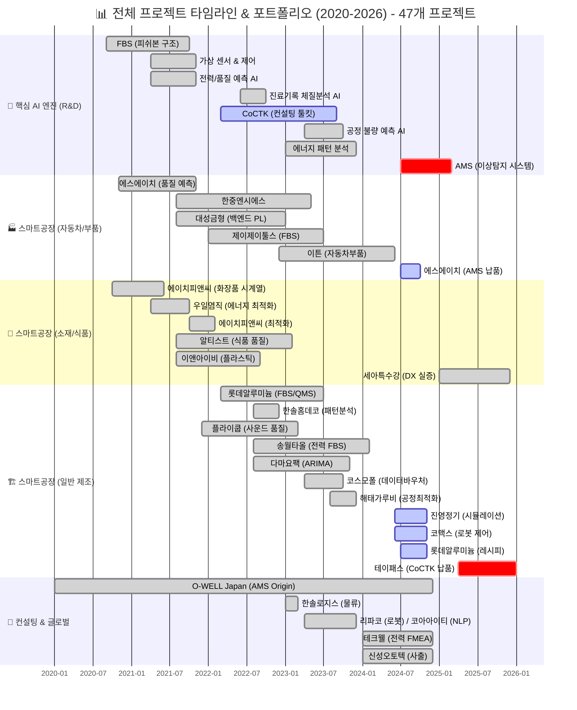
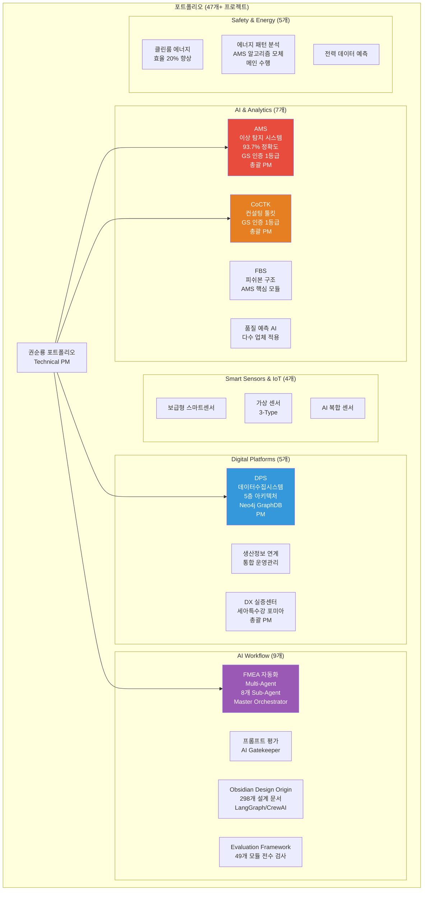
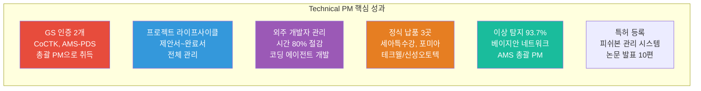
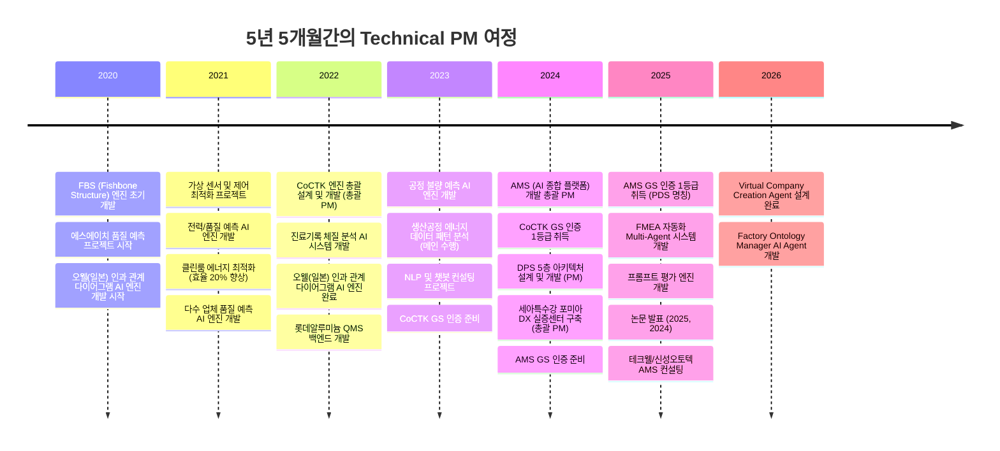
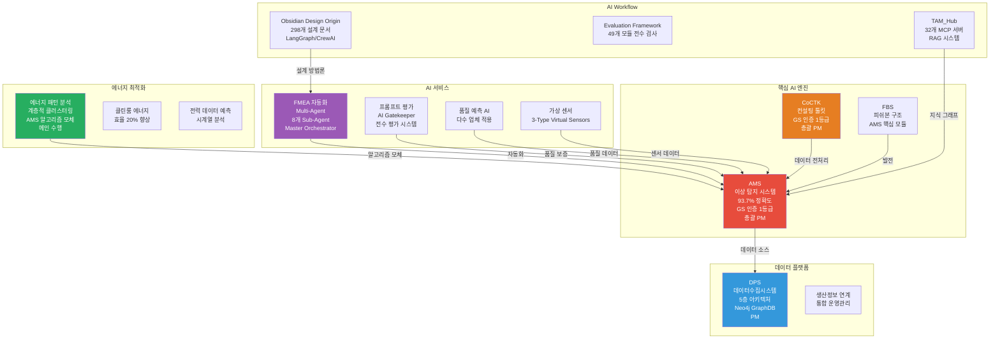

# 권순룡 포트폴리오 - Technical PM / Product Manager (AI/ML 제품)

> **"AI/ML 제품을 기획하고 개발을 이끄는 Technical PM"**  
> **"모델보다 데이터, 데이터보다 정보, 지식구조를 정리하는 현장친화적 연구원"**

---

## 📌 기본 정보

**이름**: 권순룡  
**소속**: 한솔코에버 연구소 대리 (2020.09 ~ 재직중)  
**총 경력**: 5년 5개월 (2020.09~2026.01)  
**핵심 역량**: AI/ML 제품 기획 및 개발 총괄, 프로젝트 라이프사이클 관리, 기술적 의사결정, 비즈니스 가치 창출, 외주 개발자 관리, GS 인증 프로세스 관리  
**GitHub**: https://github.com/moobaek  
**이메일**: m920831@naver.com  
**연락처**: 010-5671-6200

---

## 📊 전체 프로젝트 타임라인 (2020-2026) - 47개 프로젝트

> [!INFO] **총 프로젝트 현황**
> - **AI & Analytics**: 7개 (AMS, CoCTK, FBS 등)
> - **스마트공장 구축**: 23개 (에스에이치아이엔티, 롯데알루미늄 등)
> - **컨설팅**: 8개 (테크웰, 신성오토텍 등)
> - **AI 에이전트**: 9개 (FMEA, PM Agent 등)

---

## 📊 포트폴리오 구조 (한눈에 보기)

---

## 🎯 핵심 성과 대시보드

| 분류 | 지표 | 상세 |
|:---|---:|:---|
| **인증** | GS 인증 2개 | CoCTK (2024), AMS-PDS (2025) - 총괄 PM으로 취득 |
| **프로젝트 관리** | 제안서~완료서 전체 라이프사이클 | AMS, CoCTK, 포미아 DX 등 다수 프로젝트 |
| **외주 관리** | 관리 시간 80% 절감 | 코딩 에이전트 개발로 자동화 |
| **납품 실적** | 정식 납품 3곳 | 세아특수강, 포미아, 테크웰/신성오토텍 |
| **기술 성과** | 이상 탐지 93.7% | 베이지안 네트워크 기반 모델 (AMS 총괄 PM) |
| **지식 자산** | 특허 등록, 논문 10편 | 피쉬본 관리 시스템 특허 등록 |

---

## 📅 경력 타임라인 (2020-2026)

---

## 🏆 주요 프로젝트 (Technical PM 관점)

### 프로젝트 관계도

### 1. AMS (Analysis Management System) - AI 종합 플랫폼 개발 총괄 PM

**기간**: 2024.07 ~ 2025.12  
**발주처**: 한국산업기술진흥원  
**역할**: AI 종합 플랫폼 개발 총괄 PM

**프로젝트 라이프사이클 관리**:
- ✅ **제안서 작성**: 기술적 요구사항 분석, 시스템 아키텍처 설계, 베이지안 네트워크 기반 이상 탐지 모델의 기술적 타당성 검증, 8단계 시계열 데이터 파이프라인의 실현 가능성 분석
- ✅ **계획서 작성**: 프로젝트 일정 수립, 외주 개발자 선정, 각 단계별 마일스톤 설정, 리스크 관리 대응 방안 수립
- ✅ **개발 관리**: 외주 개발자 협업, 베이지안 네트워크 모델 개발, 8단계 시계열 데이터 파이프라인 구축, Neo4j 그래프 DB 활용한 지식 그래프 플랫폼 구축
- ✅ **품질 관리**: GS 인증 프로세스 수립 및 실시, 소프트웨어 품질 관리 프로세스 수립, 각 단계별 품질 검증, GS 인증 1등급 취득
- ✅ **완료서 작성**: 프로젝트 완료서 작성 및 납품, 기술적 성과와 비즈니스 가치 정리

**핵심 성과**:
- ✅ **베이지안 네트워크 기반 이상 탐지 모델 개발**: 이상탐지율 93.7% 달성 (실질적 정확도 60~70%, 데이터 한계 고려)
- ✅ **8단계 시계열 데이터 파이프라인 구축**: 실시간 스트리밍 처리 및 배치 처리 하이브리드 아키텍처 구현
- ✅ **Neo4j 그래프 DB 활용**: 4M2E 관계 온톨로지 정의 및 지식 그래프 플랫폼 구축
- ✅ **GS 인증 1등급 취득**: PDS 명칭으로 소프트웨어 품질 인증 획득
- ✅ **특허 등록**: 피쉬본 관리 시스템 특허 등록
- ✅ **정식 납품**: 세아특수강 포미아 DX 실증센터 구축 (PM), 테크웰/신성오토텍 AMS 컨설팅
- ✅ **논문 발표**: 2025, 2024년 논문 발표

**기술 스택**: Python, Neo4j, Docker, Kubernetes, Grafana, Prometheus, 베이지안 네트워크, 시계열 분석

**PM 관점의 상세 설명**:
AMS는 제조 현장의 설비 이상을 자동으로 탐지하고 분석하는 AI 종합 플랫폼입니다. **총괄 PM으로 프로젝트 전체 라이프사이클을 관리**했으며, 기술적 설계뿐만 아니라 외주 관리, 일정 관리, 품질 관리까지 전 과정을 책임졌습니다.

**제안서 작성 단계**에서는 기술적 요구사항을 분석하고, 시스템 아키텍처를 설계했습니다. 베이지안 네트워크 기반 이상 탐지 모델의 기술적 타당성을 검증하고, 8단계 시계열 데이터 파이프라인의 실현 가능성을 분석했습니다. 발주처의 요구사항을 정확히 파악하고, 기술적 타당성을 검증했습니다.

**계획서 작성 단계**에서는 프로젝트 일정을 수립하고, 외주 개발자를 선정했습니다. 각 단계별 마일스톤을 설정하고, 리스크 관리를 위한 대응 방안을 수립했습니다. 프로젝트의 전체 일정을 관리하고, 각 단계별 완료 조건을 명확히 정의했습니다.

**개발 단계**에서는 외주 개발자와 협업하여 베이지안 네트워크 기반 이상 탐지 모델을 개발했으며, 8단계 시계열 데이터 파이프라인을 구축했습니다. Neo4j 그래프 DB를 활용한 지식 그래프 플랫폼을 만들어 설비 간 관계를 시각화했습니다. 외주 개발자의 산출물을 관리하고, 일정을 조율했습니다.

**품질 관리 단계**에서는 GS 인증 프로세스를 수립하고 실시하여 GS 인증 1등급을 취득했습니다. 소프트웨어 품질 관리 프로세스를 수립하고, 각 단계별 품질 검증을 수행했습니다. GS 인증 전략으로 "선택과 집중"을 취하여, 포기할 기능은 과감히 포기하고 핵심 경쟁력인 '분석 정확도'와 '데이터 처리 속도'에 자원을 집중했습니다. 그 결과, 심사관들로부터 "핵심 기능의 완성도가 매우 높다"는 평가를 받으며 1등급을 획득할 수 있었습니다.

**완료서 작성 단계**에서는 프로젝트 완료서를 작성하고 납품했습니다. 프로젝트의 기술적 성과와 비즈니스 가치를 정리하여 보고서를 작성했습니다.

**비즈니스 가치 창출** 측면에서는 이상 탐지율 93.7%를 달성했으며, 세아특수강, 포미아 등에 정식 납품했습니다. 특허를 등록하고 논문을 발표하는 등 프로젝트의 기술적 성과와 비즈니스 가치를 동시에 달성했습니다.

**8단계 시계열 데이터 파이프라인**을 통해 실시간 데이터 수집부터 이상 탐지까지 전 과정을 자동화했습니다. 첫 번째 단계인 데이터 수집에서는 센서에서 데이터를 받아오는 부분을 담당합니다. 센서에서 데이터가 들어오면, 전처리 모듈이 처리합니다. 데이터가 이상한 경우를 대비해 검증 로직도 포함되어 있습니다. 수집된 데이터는 정규화 과정을 거쳐 분석 계층으로 전달됩니다. 이 과정에서 데이터의 품질을 보장하고, 이상한 데이터는 미리 걸러냅니다.

두 번째 계층인 분석 계층에서는 수집된 데이터를 분석해 이상 징후를 찾아냅니다. 베이지안 네트워크를 활용하여 확률적 접근 방식으로 이상을 탐지합니다. 시구간 패턴 분석 기법을 만들어 같은 값도 시점별 통계적 특성(p-values, 첨도, 편차)에 따라 정상/불량을 구분할 수 있도록 했습니다. 이 기법은 AMS 완성 1년 전부터 대부분의 과제에 적용되었으며, AMS로 통합 정리되었습니다.

세 번째 계층인 시각화 계층에서는 분석 결과를 사용자가 이해하기 쉬운 형태로 보여줍니다. Neo4j 그래프 DB를 활용한 지식 그래프 플랫폼을 작성하여 설비 간 관계를 시각화했습니다. 4M2E(Man, Machine, Material, Method, Environment, Energy) 관계를 온톨로지로 정의하고, 지식 그래프를 만들어 데이터 간 관계를 시각화했습니다.

이 시스템의 정확도에 대해 설명하면, 세아특수강에 납품해 테스트한 결과, 이상 탐지 정확도가 93.7%를 기록했습니다. 이는 높은 수준입니다. 구체적으로 100개 중 93개 이상을 정확히 찾아낸다는 의미입니다. 실질적 정확도는 데이터 한계를 고려하면 60~70%로 투명하게 공개했습니다.

아키텍처 외에 성능 최적화나 확장성도 고려했습니다. Docker와 Kubernetes를 활용한 마이크로서비스 아키텍처로 각 계층을 독립적으로 확장할 수 있도록 구성했습니다. Grafana와 Prometheus를 활용하여 시스템 모니터링을 구현했습니다.

---

### 2. 세아특수강 포미아 DX 실증센터 구축 - 총괄 PM

**기간**: 2025.06 ~ 2025.10  
**발주처**: POMIA (재단법인 포항소재산업진흥원)  
**역할**: PM 총괄 (제안서~완료까지 전체 진행)

**프로젝트 라이프사이클 관리**:
- ✅ **제안서 작성**: 포미아 DX 실증센터 구축 제안서 작성, 데이터 연동, POP 프로그램, 철강 5대공정 데이터 분석 등 맞춤형 솔루션 기획, 발주처의 요구사항을 정확히 파악하고 기술적 타당성을 검증
- ✅ **계획서 작성**: 프로젝트 계획서 작성 및 승인, 프로젝트 일정 수립, 외주 개발자 선정, 세아특수강 등 하위 과제의 일정을 조율하고 전체 프로젝트 일정을 관리
- ✅ **외주 관리**: 세아특수강 등 하위 과제 외주 개발자 관리, 데이터 연동, POP 프로그램 개발 등을 진행, 외주 개발자의 산출물을 관리하고 일정을 조율
- ✅ **완료서 작성**: 프로젝트 완료서 작성 및 납품, 각 하위 과제의 완료 내용을 정리하고 전체 프로젝트의 성과를 보고

**핵심 성과**:
- ✅ **맞춤형 솔루션 기획**: 철강 5대공정 데이터 분석 등 맞춤형 솔루션 기획
- ✅ **하위 과제 관리**: 세아특수강 등 하위 과제 외주 개발자 관리
- ✅ **정식 납품**: 포미아 DX 실증센터 구축 완료 및 납품

**기술 스택**: 데이터 연동, POP 프로그램, 철강 5대공정 데이터 분석, 하이브리드 인프라

**PM 관점의 상세 설명**:
포미아 DX 실증센터 구축 프로젝트에서는 **총괄 PM으로 제안서 작성부터 완료서 작성까지 전체를 담당**했습니다. 세아특수강 등 하위 과제를 포함하여 맞춤형 솔루션을 기획하고 실행했습니다.

**제안서 작성 단계**에서는 포미아 DX 실증센터의 요구사항을 분석하고, 데이터 연동, POP 프로그램, 철강 5대공정 데이터 분석 등 맞춤형 솔루션을 기획했습니다. 발주처의 요구사항을 정확히 파악하고, 기술적 타당성을 검증했습니다.

**계획서 작성 단계**에서는 프로젝트 일정을 수립하고, 외주 개발자를 선정했습니다. 세아특수강 등 하위 과제의 일정을 조율하고, 전체 프로젝트 일정을 관리했습니다.

**외주 관리 단계**에서는 세아특수강 등 하위 과제의 외주 개발자와 협업하여 데이터 연동, POP 프로그램 개발 등을 진행했습니다. 외주 개발자의 산출물을 관리하고, 일정을 조율했습니다.

**완료서 작성 단계**에서는 프로젝트 완료서를 작성하고 납품했습니다. 각 하위 과제의 완료 내용을 정리하고, 전체 프로젝트의 성과를 보고했습니다.

이 프로젝트를 통해 **PM 경험(제안서~완료, 외주 관리)을 쌓아 PM Agent 설계의 토대를 마련**했습니다.

---

### 3. CoCTK (Consulting Tool Kit) - 엔진 총괄 설계 및 화면설계 개발 총괄 PM

**기간**: 2022.03 ~ 2024  
**발주처**: 중소기업기술정보진흥원  
**역할**: 엔진 총괄 설계 & 화면설계 개발 총괄 PM

**프로젝트 라이프사이클 관리**:
- ✅ **엔진 총괄 설계**: 데이터 전처리, 상관관계 분석, 비용 최적화 엔진 설계, 사업 시작 전 판별 컨설팅 도구로 소량 데이터로 학습 가능성, 중요 순위, 상관분석, 시계열 예측 가능성, feature-결과 추론 등을 종합 판별하는 엔진 설계
- ✅ **화면설계 개발 총괄 PM**: 사용자 인터페이스 설계 및 개발 관리, 사용자 경험을 고려한 화면 설계 진행, 백엔드와의 연동 구현
- ✅ **GS 인증 프로세스 관리**: GS 인증 1등급 취득을 위한 품질 관리 프로세스 수립 및 실시, 소프트웨어 품질 관리 프로세스 수립, 각 단계별 품질 검증

**핵심 성과**:
- ✅ **데이터 전처리, 상관관계 분석, 비용 최적화 엔진 개발**: 제조 현장 데이터 분석 플랫폼 구축
- ✅ **GS 인증 1등급 취득**: 2024년 소프트웨어 품질 인증 획득
- ✅ **논문 발표**: 2023년 논문 발표

**기술 스택**: Python, 데이터 전처리, 상관관계 분석, 비용 최적화

**PM 관점의 상세 설명**:
CoCTK는 제조 현장의 데이터를 분석하고 최적화 방안을 제시하는 컨설팅 도구입니다. **총괄 PM으로 엔진 총괄 설계 및 화면설계 개발을 담당**했습니다.

**엔진 총괄 설계**에서는 사업 시작 전 판별 컨설팅 도구로, 소량 데이터로 학습 가능성, 중요 순위, 상관분석, 시계열 예측 가능성, feature-결과 추론 등을 종합 판별하는 엔진을 설계했습니다. 데이터 전처리, 상관관계 분석, 비용 최적화 엔진을 개발하여 제조 현장의 복잡한 데이터를 분석하고, 최적화 방안을 자동으로 도출하는 시스템을 구축했습니다.

데이터 전처리 엔진은 제조 현장의 복잡한 데이터를 분석 가능한 형태로 변환합니다. 결측치 처리, 이상치 제거, 정규화 등의 과정을 자동화하여 데이터 품질을 보장합니다.

상관관계 분석 엔진은 변수 간의 관계를 분석하여 중요한 변수를 찾아냅니다. 상관계수, 상호정보량 등을 활용하여 변수 간의 관계를 정량화하고, 중요 순위를 결정합니다.

비용 최적화 엔진은 클러스터링 기반 구간 룰로 에너지 최적화를 수행합니다. 설비 상태 데이터를 클러스터링하여 패턴을 찾아내고, 최적 제어 방안을 도출합니다.

**화면설계 개발 총괄 PM**에서는 사용자 인터페이스를 설계하고 개발을 관리했습니다. 사용자 경험을 고려한 화면 설계를 진행했으며, 백엔드와의 연동을 구현했습니다.

**GS 인증 프로세스 관리**에서는 GS 인증 1등급 취득을 위한 품질 관리 프로세스를 수립하고 실시했습니다. 소프트웨어 품질 관리 프로세스를 수립하고, 각 단계별 품질 검증을 수행했습니다. GS 인증 전략으로 "선택과 집중"을 취하여, 포기할 기능은 과감히 포기하고 핵심 경쟁력인 '분석 정확도'와 '데이터 처리 속도'에 자원을 집중했습니다.

GS 인증 1등급을 취득하여 소프트웨어 품질을 인증받았으며, 2023년 논문으로 발표했습니다. **CoCTK와 이후 개념들이 모듈화/체계화되어 AMS AI 모듈의 기초가 되었습니다**.

---

### 4. 코딩 에이전트 개발 - 외주 개발자 관리 문제 해결

**기간**: 2025.05 ~ 진행중  
**발주처**: 내부 개발  
**역할**: 시스템 설계 및 개발 총괄

**프로젝트 배경**:
47개 프로젝트를 수행하면서 겪은 **외주 개발자가 개발 산출물을 전혀 관리하지 않는 문제**를 해결하기 위해 코딩 에이전트를 개발했습니다. 백엔드 AI 개발자였지만 코딩 툴을 만들어서 말도 안 되는 시간에 말도 안 되는 개발 개수를 성공적으로 완료했습니다.

**핵심 성과**:
- ✅ **외주 개발자 산출물 관리 자동화**: 298개+ 설계 문서를 ID 시스템 기반으로 체계적 관리
- ✅ **외주 개발자 관리 시간 80% 이상 절감**: 자동화 시스템 구축으로 관리 시간 대폭 절감
- ✅ **ID 기반 온톨로지 맵 문서 시스템**: 모든 요소에 고유 ID 부여로 문서 간 관계 추적, 의존성 관리
- ✅ **Phase 0-13 워크플로우 자동화**: 설계부터 개발까지 전체 라이프사이클 자동화
- ✅ **LangGraph/CrewAI 방식 워크플로우 오케스트레이션**: State 기반 정보 전달, 상태 기반 진행 모니터링 및 완료 조건 판단 시스템
- ✅ **28개 Few-shot Rules System**: 8개 도메인(design/api/database/component/state/security/performance/testing)에 대한 규칙 기반 코드 품질 자동 검증
- ✅ **4단계 Testing Workflow**: Mock Setup → Unit → Integration → E2E 자동화

**기술 스택**: Python, ID 기반 온톨로지 맵, Phase 워크플로우, LangGraph, CrewAI

**PM 관점의 상세 설명**:
코딩 에이전트는 외주 개발자 산출물 관리 문제를 해결하기 위해 개발한 시스템입니다. **PM 활동에서 문서, 개발 진행 관리에 활용**하며, 전체 에이전트 시스템 설계의 토대를 마련했습니다.

**ID 기반 온톨로지 맵 문서 시스템**을 구축하여 모든 요소에 고유 ID를 부여하고, 문서 간 관계를 추적하며, 의존성을 관리했습니다. 이를 통해 외주 개발자의 산출물을 자동으로 추적 및 검증하는 시스템을 구현했습니다.

**Phase 0-13 워크플로우**를 자동화하여 설계부터 개발까지 전체 라이프사이클을 관리했습니다. 각 Phase는 명확한 입력과 출력을 가지며, 상태 기반 정보 전달을 통해 Phase 간 데이터를 전달합니다.

**LangGraph/CrewAI 방식 워크플로우 오케스트레이션**을 구현하여 State 기반 정보 전달, 상태 기반 진행 모니터링 및 완료 조건 판단 시스템을 구축했습니다. 개발 프로세스의 각 단계를 자동으로 모니터링하고 완료 조건을 판단합니다.

**28개 Few-shot Rules System** (8개 도메인: design/api/database/component/state/security/performance/testing)을 설계하여 코드 품질을 자동으로 검증하도록 했으며, **4단계 Testing Workflow** (Mock Setup → Unit → Integration → E2E)를 설계하여 테스트 프로세스를 자동화했습니다.

298개+ 설계 문서를 ID 시스템 기반으로 체계적 관리하여 외주 개발자의 산출물을 자동으로 추적 및 검증하는 시스템을 구현했습니다. 이를 통해 **외주 개발자 관리 시간을 80% 이상 절감**했으며, 납품 프로젝트를 성공적으로 완료했습니다.

**이 경험이 FMEA 자동화 에이전트, PM Agent, Factory Ontology Manager 등 다른 AI Agent 설계의 기초가 되었습니다**.

---

### 5. FMEA 자동화 Multi-Agent 시스템 - Master Orchestrator 설계

**기간**: 2025.06 ~ 진행중  
**발주처**: 내부 개발  
**역할**: Master Orchestrator 설계 및 Multi-Agent Workflow 구현

**프로젝트 배경**:
전무님이 2020년도부터 추구했던 공정 라인을 공장 사람들이 쉽게 수정하는 것, 그리고 2025년에 김이사님(당시 사업 부분장)이 OEM ODM 대응이 필요하다 자동 툴이 필요하다 하셨습니다. 그래서 이 두 가지를 커버하기 위해서 만들었습니다.

**핵심 성과**:
- ✅ **Multi-Agent Workflow 설계**: Claude Sub-Agent 기반 8개 독립 Sub-Agent 협업 구조 구현
- ✅ **Master Orchestrator 설계**: 전체 워크플로우 조율 구조 설계
- ✅ **Phase 0~5 자동화 워크플로우**: FMEA 생성 프로세스 전 과정 자동화
- ✅ **AIAG & VDA FMEA 표준 기반**: 범용 리스크 분석 시스템 개발
- ✅ **논문 발표**: 2025년 논문 발표

**기술 스택**: Python, Claude Agent, Multi-Agent System, MCP, RAG

**PM 관점의 상세 설명**:
FMEA 자동화 시스템은 제조 현장의 리스크 분석을 자동화하는 Multi-Agent 시스템입니다. **Master Orchestrator 기반 8개 독립 Sub-Agent 협업 구조**를 설계했습니다.

**Master Orchestrator**는 전체 워크플로우를 조율하는 중앙 조정자입니다. Python 스크립트 없이 Claude Code 세션 자체가 Orchestrator 역할을 담당하며, 프롬프트 기반 완전 자동화로 개발 복잡성을 감소시켰습니다. Task tool 기반 구현으로 유연한 워크플로우 조정이 가능합니다.

**8개 독립 Sub-Agent**는 R&D, Mfg, QA 등 8개의 독립 Sub-Agent가 각각 전문 영역을 담당합니다. 각 Sub-Agent는 독립적으로 동작하면서도 Master Orchestrator의 지시에 따라 협업합니다.

**Phase 0~5 자동화 워크플로우**는 FMEA 생성 프로세스 전 과정을 자동화하여 리스크 분석 시간을 대폭 단축했습니다. 각 Phase는 명확한 입력과 출력을 가지며, 상태 기반 진행 모니터링을 통해 각 단계의 완료 조건을 자동으로 판단합니다.

**AIAG & VDA FMEA 표준 기반**으로 범용 리스크 분석 시스템을 개발했습니다. 복잡한 기술적 출력(FBS, 확률 네트워크)을 현장이 이해하는 언어로 변환합니다.

**PM 관점에서의 가치**: 이 프로젝트를 통해 Multi-Agent 시스템의 설계 및 관리 경험을 쌓았으며, 복잡한 워크플로우를 자동화하는 방법론을 개발했습니다. 이를 통해 PM Agent 설계의 토대를 마련했습니다.

---

### 6. DPS (데이터수집시스템) - 핵심 아키텍처 설계 및 개발 (PM)

**기간**: 2021 ~ 2024  
**발주처**: 세아특수강  
**역할**: 핵심 아키텍처 설계 및 개발 (PM 수행)

**핵심 성과**:
- ✅ **5층 아키텍처 설계**: Microservices 기반 데이터 수집 시스템 구축
- ✅ **Neo4j 그래프 DB 활용**: 온톨로지 기반 관계 분석 및 지식 그래프 구축
- ✅ **Docker/Kubernetes 기반 인프라**: 마이크로서비스 아키텍처 및 컨테이너 오케스트레이션
- ✅ **금속산업 5대 공정 AI 자동화**: 제조 현장 디지털화 실증
- ✅ **논문 발표**: 2024년 논문 발표

**기술 스택**: Python, Neo4j, Docker, Kubernetes, Microservices, GraphDB

**PM 관점의 상세 설명**:
DPS는 제조 현장의 데이터를 수집하고 분석하는 통합 플랫폼입니다. 5층 아키텍처를 설계하여 데이터 수집, 전처리, 변환, 저장, 분석까지 전 과정을 자동화했습니다.

**5층 아키텍처 설계**:
- **첫 번째 계층인 보안 및 관리 Layer**: 인증/권한, 로그 감사, 시스템 관리를 담당합니다. 이 계층은 다른 모든 계층에 영향을 미치며, 시스템의 보안과 안정성을 보장합니다.
- **두 번째 계층인 데이터 수집 Layer**: 실시간 스트리밍과 PLC/MES 인터페이스를 처리합니다. 다양한 데이터 소스로부터 데이터를 수집하고, 데이터의 품질을 검증합니다. 실시간 스트리밍 처리를 통해 지연 시간을 최소화하고, 배치 처리를 통해 대용량 데이터를 효율적으로 처리합니다.
- **세 번째 계층인 AI 엔진 Layer**: 가상 센서와 이상 검출 알고리즘을 실행합니다. 가상 센서는 물리 센서가 없는 부분을 AI로 예측하고, 이상 검출 알고리즘은 설비 상태를 분석하여 이상 징후를 찾아냅니다.
- **네 번째 계층인 통합 및 본체론 Layer**: Neo4j 그래프 DB를 활용하여 제조 공정 간 관계를 온톨로지로 정의하고, 지식 그래프를 구축하여 데이터 간 관계를 시각화했습니다. 4M2E 관계를 온톨로지로 정의하여 설비, 공정, 자재, 방법, 환경, 에너지 간 관계를 명확히 파악할 수 있습니다.
- **다섯 번째 계층인 서비스 및 UI Layer**: 특성요인도 시각화와 모니터링을 제공합니다. 사용자가 이해하기 쉬운 형태로 데이터를 시각화하고, 실시간 모니터링을 통해 설비 상태를 확인할 수 있습니다.

Docker와 Kubernetes를 활용한 마이크로서비스 아키텍처로 확장 가능한 시스템을 만들었습니다. 서버-엣지 하이브리드 인프라를 지원하여 다양한 환경에서 운영할 수 있도록 설계했습니다.

---

### 7. 생산공정 에너지 데이터 패턴 분석 - 메인 수행 (초기 백엔드 개발 → 풀스택 개발 및 총괄 PM으로 확장)

**기간**: 2023  
**발주처**: 연구과제  
**역할**: 메인 수행 (초기 백엔드 개발 → 풀스택 개발 및 총괄 PM으로 확장)

**핵심 성과**:
- ✅ **계층적 클러스터링(Hierarchical Clustering) 도입**: 설비 상태 데이터 패턴 분석
- ✅ **패턴 민주주의(Pattern Voting) 기법 고안**: 데이터 패턴 분석 방법론 개발
- ✅ **AMS 알고리즘 모체**: 이 연구의 구조적 분화와 투표 방식이 훗날 AMS의 핵심 알고리즘 모체가 됨

**기술 스택**: Python, 패턴 분석, 클러스터링, 라벨링 시스템

**PM 관점의 상세 설명**:
생산공정 에너지 데이터 패턴 분석 연구과제를 메인으로 수행했습니다. 계층적 클러스터링을 도입하여 설비 상태 데이터의 패턴을 분석하고, 패턴 민주주의 기법을 고안하여 데이터 패턴 분석 방법론을 개발했습니다.

계층적 클러스터링은 설비 상태 데이터를 계층적으로 분류하여 패턴을 찾아냅니다. 유사한 패턴을 가진 데이터를 그룹화하고, 계층 구조를 형성하여 패턴의 구조를 파악합니다.

패턴 민주주의 기법은 여러 패턴 분석 결과를 투표 방식으로 통합하여 최종 패턴을 결정합니다. 각 패턴 분석 방법의 결과를 투표로 집계하여 가장 신뢰할 수 있는 패턴을 선택합니다.

이 구조적 분화와 투표 방식이 훗날 AMS의 핵심 알고리즘 모체가 되었습니다. AMS의 시구간 패턴 분석 기법은 이 연구에서 고안한 방법론을 기반으로 발전했습니다.

---

### 8. 프롬프트 평가 엔진 (Claude Sub-Agent) - AI Gatekeeper

**기간**: 2025.06 ~ 진행중  
**발주처**: 내부 개발  
**역할**: AI Gatekeeper 설계 및 구현

**핵심 성과**:
- ✅ **AI Gatekeeper**: 모든 AI 생성물의 입구를 통제하는 심사관
- ✅ **전체 프롬프트 전수 평가**: 25개+ 프롬프트의 품질을 승인/반려하는 완전 자동화 시스템
- ✅ **3가지 핵심 차원 평가**: Quality, Consistency, Cost
- ✅ **17가지 역할별 동적 가중치 시스템**: 각 역할에 맞는 최적화된 평가
- ✅ **병렬 처리 구조**: 4개 메트릭 동시 평가로 효율성 극대화
- ✅ **5단계 평가 프로세스**: Role Inference → Metrics Parallel → Consolidation → Report → Translation
- ✅ **Human-in-the-Loop 8단계 필수 검증 프로세스**: 배치 처리 지원

**기술 스택**: Python, Claude Agent, Multi-Agent System, 프롬프트 평가

**PM 관점의 상세 설명**:
프롬프트 평가 엔진은 모든 AI 생성물의 입구를 통제하는 심사관 역할을 합니다. 전체 프롬프트를 전수 평가하는 완전 자동화 시스템으로, AI가 생성한 프롬프트를 다른 AI가 평가하는 이중 검증 구조로 환각을 방지합니다.

3가지 핵심 차원(Quality, Consistency, Cost)을 평가하며, MLOps Priority Matrix 기반 가중치(Structural 40%, Correctness 30%, Relevancy 20%, Tone 10%)를 적용합니다. 17가지 역할별 동적 가중치 시스템을 통해 각 역할에 맞는 최적화된 평가를 수행합니다.

병렬 처리 구조로 4개 메트릭을 동시에 평가하여 효율성을 극대화했습니다. 5단계 평가 프로세스(Role Inference → Metrics Parallel → Consolidation → Report → Translation)를 거쳐 최종 평가 결과를 생성합니다.

Human-in-the-Loop 8단계 필수 검증 프로세스를 통해 사람의 검증을 포함하여 평가의 신뢰성을 높였습니다. 배치 처리 지원으로 대량의 프롬프트를 효율적으로 평가할 수 있습니다.

---

## 📈 프로젝트 관리 역량

### 프로젝트 라이프사이클 관리

**제안서 작성**:
- 기술적 요구사항 분석
- 시스템 아키텍처 설계
- 기술적 타당성 검증
- 비즈니스 가치 제안

**계획서 작성**:
- 프로젝트 일정 수립
- 외주 개발자 선정
- 마일스톤 설정
- 리스크 관리 대응 방안 수립

**개발 관리**:
- 외주 개발자 협업
- 일정 조율 및 관리
- 산출물 관리 및 검증
- 기술적 의사결정

**품질 관리**:
- GS 인증 프로세스 수립 및 실시
- 소프트웨어 품질 관리 프로세스 수립
- 각 단계별 품질 검증
- 문서 무결성 검증

**완료서 작성**:
- 프로젝트 완료서 작성
- 기술적 성과 및 비즈니스 가치 정리
- 납품 및 보고

### 외주 개발자 관리

**문제 해결**:
- 외주 개발자 산출물 관리 부재 문제 해결
- 코딩 에이전트 개발로 관리 시간 80% 이상 절감
- ID 기반 온톨로지 맵 문서 시스템 구축

**자동화 시스템**:
- 298개+ 설계 문서를 ID 시스템 기반으로 체계적 관리
- Phase 0-13 워크플로우 자동화
- 상태 기반 진행 모니터링 및 완료 조건 판단 시스템

### 기술적 의사결정

**시스템 아키텍처 설계**:
- 5층 아키텍처 설계 (DPS)
- Microservices 아키텍처 설계
- Multi-Agent 시스템 아키텍처 설계

**기술 스택 선택**:
- Neo4j 그래프 DB 활용
- Docker/Kubernetes 기반 인프라
- LangGraph/CrewAI 워크플로우 오케스트레이션

---

## 🎓 학술 활동 및 인증

### 논문 발표
- **2025년**: FMEA 자동화 Multi-Agent 시스템 논문 발표
- **2024년**: DPS 5층 아키텍처 논문 발표
- **2023년**: CoCTK 엔진 논문 발표
- **총 10편 논문 발표**: 학술 연구 및 논문 발표

### 인증
- **GS 인증 1등급 (CoCTK)**: 2024년 소프트웨어 품질 인증 획득 (총괄 PM)
- **GS 인증 1등급 (AMS-PDS)**: 2025년 소프트웨어 품질 인증 획득 (총괄 PM)

### 특허
- **피쉬본 관리 시스템 특허 등록**: 이상 탐지 및 분석 시스템 특허

---

## 💼 비즈니스 가치 창출

### 시간 절감
- ✅ **외주 개발자 관리 시간 80% 이상 절감**: 코딩 에이전트 개발
- ✅ **문서 작성 시간 70% 이상 절감**: Business Document Generator 개발

### 비용 절감
- ✅ **87% LLM 비용 절감**: Dual-Tier AI 아키텍처 설계

### 품질 향상
- ✅ **이상 탐지율 93.7% 달성**: 베이지안 네트워크 기반 모델
- ✅ **GS 인증 2개 취득**: 소프트웨어 품질 인증

### 납품 실적
- ✅ **정식 납품 3곳**: 세아특수강, 포미아, 테크웰/신성오토텍

---

## 📚 학술 성과 (10편)

| 발행일 | 논문 제목 | 학술지/학회 | 핵심 성과 및 프로젝트 연계 |
| :--- | :--- | :--- | :--- |
| 2025.12 | **분석 상관/확률 네트워크 최적 경로 정보 및 공정 관리 문서 기반 FMEA 생성 연구** | KSFM 2025년도 동계학술대회 | [FMEA 자동화/복합센서/AMS] 상관/확률 네트워크 최적 경로 분석 기반 FMEA 자동 생성 기술 검증, AMS 결과 표시 LLM agent (GPT OSS) 개발 및 포미아 납품 적용 |
| 2025.06 | **AI를 활용한 구조와 룰을 활용한 구조-확률 종합 네트워크 및 최적 관리 방안 도출** | 한국유체기계학회 | [AMS] 피쉬본 AI 모델의 학술적 고도화 및 최적 관리 로직 증명 (초기 O-WELL 알고리즘 고도화) |
| 2024.12 | **공장 운영 핵심 요소의 식별 및 최적화를 위한 클러스터링 기법 적용** | 한국생산제조학회 | [DPS] 공장 운영 데이터의 다차원 분석 및 디지털 트윈 최적화 근거 |
| 2024.12 | **설비 이상상태 기반 최적 공정 데이터 추론 및 위험/안전 관리 최적 자동화** | 한국유체기계학회 | [AMS] 실시간 이상 상태 기반 위험 관리 알고리즘의 유효성 검증 |
| 2024.07 | **전력 데이터를 통한 설비 상태 추론 및 이상 상황 설정 예측** | 한국유체기계학회 | [에너지/센서] 전력 데이터 기반의 설비 예지 보전 기술 실증 |
| 2023.12 | **송풍 설비 변동부하 대응 전력품질 분석 및 에너지 절감 연구** | 한국유체기계학회 | [에너지 최적화] 에너지 20% 절감 실증 솔루션의 핵심 물리 분석 모델 |
| 2023.12 | **압축기 공정에서 데이터 밸런스 문제 해결 및 품질 결과 사전 예측을 위한 AI 시스템** | 한국유체기계학회 | [AI/데이터] 소량의 불량 데이터 극복을 위한 AI 학습 모델 연구 |
| 2023.07 | **생산공정 에너지 및 설비 상태 진단을 위한 AI기반의 전력 사용 패턴 및 SOH분석** | 한국유체기계학회 | [에너지/전력] 설비 건전성(SOH) 진단 및 에너지 효율화 융합 기술 (**Energy Pattern** 과제 실증) |
| 2022.12 | **자동차 부품 생산 산업을 위한 머신러닝 기반의 품질예측 알고리즘** | 한국생산제조학회 | [AI/제조] 세아베스틸 등 자동차 부품 공정 품질 예측 모델의 기초 |
| 2022.06 | **ICT 융복합 기술을 활용한 스마트 공장 및 에너지 절감 솔루션 적용 사례** | 한국유체기계학회 | [Global DX] **O-WELL Japan** 등 글로벌 스마트 공장 구축 사례의 실증 (AMS 초기 모델 검증) |

---

## 🔬 특허 출원/등록 현황 (프로젝트 관리 및 PM Agent 진화 강조)

> [!NOTE] **프로젝트 관리의 기술적 기반**
> 아래 특허들은 프로젝트 관리 자동화, 공정 관리 시스템, 리스크 관리의 핵심 기술을 특허로 보호한 것입니다. 특히 **특허 1**은 공정 최적화 관리를 위한 시스템으로, PM Agent의 기술적 기반이 됩니다.

### 특허 출원/등록 현황 (5건)

| 출원일 | 특허명 | 출원번호 | 청구항 | 상태 | 발명자 | 프로젝트 관리 연계 |
| :--- | :--- | :--- | :--- | :--- | :--- | :--- |
| 2025.08.13 | **인공지능을 활용한 공정 최적화 관리를 위한 공정 관리 방법 및 그 시스템** | 10-2025-0040488 (예정) | 10개 | 출원완료 심사청구완료 | **권순룡**, 최수영, 강용태, 안상윤 | **공정 관리 시스템**: 공정 관련 데이터 수집 → 분석 → 관리 룰 생성 → 이상 상황 감지 및 원인 분석의 프로젝트 관리 자동화 **리스크 관리**: 이상 상황 발생 시 최적의 원인 경로를 파악하고 해결 방안을 제시하는 리스크 관리 시스템 **PM Agent 기반**: 공정 관리 기술이 PM Agent의 기술적 기반 |
| 2025.03.28 | **공정 최적화를 위한 공정 관리 방법 및 그 시스템** | 10-2025-0040488 | 8개 | 등록결정 (2025.12.09) | 강용태, **권순룡**, 김혜주 | **공정 관리 시스템**: 공정 최적화를 위한 공정 관리 방법의 프로젝트 관리 자동화 **등록결정 완료** |
| 2023.12.26 | **생산공정 에너지 및 설비상태 데이터 처리를 위한 전력 사용 패턴 분석 및 상태 분석 방법** | 1020230191965 | 6개 | 공개 심사청구완료 | 최수영, 강용태, **권순룡**, 이상훈 | **설비 상태 관리**: 설비 상태 및 SoH 분석을 통한 설비 관리 시스템 |
| 2023.12.26 | **주기 데이터 분석 기반의 전력 추이 상황적 불량 이상 검증 방법** | 1020230191969 | 5개 | 공개 심사청구완료 | 최수영, 강용태, **권순룡**, 이상훈 | **이상 상황 감지**: 시계열 예측 기반 불량/이상 감지 시스템 |
| 2021.12.07 | **설비 제어 특성 로그 데이터와 에너지 소비패턴 모델을 활용한 인공지능 기반의 이상 탐지 방법 및 장치** | 1020210174274 | 10개 | 등록결정 (2025.10.28) | 강용태, 김정호, **권순룡**, 김동기 | **이상 탐지 시스템**: 제어기 로그 데이터 + 전류 소비 데이터 결합 → 이상 탐지 모델의 프로젝트 모니터링 시스템 **등록결정 완료** |

### 프로젝트 관리와 특허 기술의 연계

**특허 1 (2025.08.13) - 프로젝트 관리 자동화의 핵심 기술**:
- **공정 관리 시스템**: 공정 관련 데이터 수집 → 분석 → 관리 룰 생성 → 이상 상황 감지 및 원인 분석의 프로젝트 관리 자동화
- **리스크 관리**: 이상 상황 발생 시 최적의 원인 경로를 파악하고 해결 방안을 제시하는 리스크 관리 시스템
- **PM Agent 기반**: 공정 관리 기술이 PM Agent의 기술적 기반이 되어, 사업 관리 자동화에 활용

**특허 3, 4, 5 (에너지 패턴 분석) - 프로젝트 모니터링 시스템**:
- **설비 상태 관리**: 설비 상태 및 SoH 분석을 통한 설비 관리 시스템
- **이상 상황 감지**: 시계열 예측 기반 불량/이상 감지 시스템으로 프로젝트 리스크 관리에 활용

### 국가연구개발사업 지원 현황

| 특허 | 국가연구개발사업 | 과제번호 | 연구기간 |
| :--- | :--- | :--- | :--- |
| 특허 1 (2025.08.13) | 에너지수요관리핵심기술개발(에특) | 20222020900031 | 2022.04.01 ~ 2024.12.31 |
| 특허 3, 4 (2023.12.26) | 에너지수요관리핵심기술개발사업 | 2022202090003B | 2022.04.01 ~ 2024.12.31 |

---

## 🤖 LLM 활용 방법

### Agent/MCP/RAG 시스템

최신 AI 기술 트렌드를 적용하여 LLM, Agent, RAG 기반 AI 서비스를 개발했습니다.

#### Multi-Agent 시스템

**FMEA 자동화 Multi-Agent 시스템**:
Claude Sub-Agent 기반 8개 독립 Sub-Agent 협업 구조를 설계했습니다. R&D, Mfg, QA 등 역할별 Sub-Agent가 독립적으로 작업을 수행하며, Master Orchestrator가 전체 워크플로우를 조율합니다.

각 Sub-Agent는 전문 영역을 담당합니다. R&D Sub-Agent는 연구개발 관점에서 리스크를 분석하고, Mfg Sub-Agent는 제조 관점에서 리스크를 분석하며, QA Sub-Agent는 품질 보증 관점에서 리스크를 분석합니다. Master Orchestrator는 각 Sub-Agent의 결과를 통합하여 최종 FMEA 문서를 생성합니다.

AIAG & VDA FMEA 표준을 기반으로 범용 리스크 분석 시스템을 개발했습니다. Phase 0부터 Phase 5까지 FMEA 생성 프로세스 전 과정을 자동화하여 리스크 분석 시간을 대폭 단축했습니다.

**프롬프트 평가 엔진**:
AI Gatekeeper 역할을 수행하는 프롬프트 평가 엔진을 개발했습니다. 모든 AI 생성물의 입구를 통제하는 심사관으로, 전체 프롬프트를 전수 평가하는 완전 자동화 시스템입니다.

AI가 생성한 프롬프트를 다른 AI가 평가하는 이중 검증 구조로 환각을 방지합니다. 3가지 핵심 차원(Quality, Consistency, Cost)을 평가하며, 17가지 역할별 동적 가중치 시스템을 적용합니다.

병렬 처리 구조로 4개 메트릭을 동시에 평가하여 효율성을 극대화했습니다. 5단계 평가 프로세스(Role Inference → Metrics Parallel → Consolidation → Report → Translation)를 거쳐 최종 평가 결과를 생성합니다.

#### MCP (Model Context Protocol) 서버 개발

**32개 Python MCP 서버 개발**:
포트폴리오 문서 접근, 프로젝트 정보 조회, 기술 스택 분석 등 다양한 기능을 제공하는 32개의 Python MCP 서버를 개발했습니다.

각 MCP 서버는 특정 기능을 담당합니다. 포트폴리오 문서 접근 서버는 포트폴리오 문서를 읽고 분석하는 기능을 제공하며, 프로젝트 정보 조회 서버는 프로젝트 정보를 검색하고 조회하는 기능을 제공합니다. 기술 스택 분석 서버는 기술 스택을 분석하고 매칭하는 기능을 제공합니다.

Claude Agent와의 통합을 위한 표준 프로토콜을 구현하여 다양한 AI Agent와 연동할 수 있도록 설계했습니다.

#### RAG (Retrieval-Augmented Generation) 시스템

**Neo4j 기반 지식 그래프 RAG**:
Neo4j 그래프 DB를 활용한 지식 그래프를 구축하고, 4M2E 관계 온톨로지를 정의하여 질의응답 시스템에 컨텍스트를 제공합니다.

포트폴리오 문서, 프로젝트 정보, 기술 스택 등을 지식 그래프로 표현하여 AI Agent가 필요한 정보를 효율적으로 검색할 수 있습니다. 질의가 들어오면 관련 노드를 검색하고, 컨텍스트를 생성하여 LLM에 전달합니다.

#### LangGraph/CrewAI 워크플로우 오케스트레이션

**Obsidian Design Origin 시스템**:
LangGraph/CrewAI 방식의 워크플로우 오케스트레이션을 구현했습니다. 25개+ AI 프롬프트 체인을 설계하고, 개발 에이전트 실시간 평가 시스템을 구축했습니다.

298개+ 설계 문서를 관리하며, ID 기반 온톨로지 맵 문서 시스템을 구축했습니다. 모든 요소에 고유 ID를 부여하여 문서 간 관계를 추적하고, 의존성 관리 및 온톨로지 기반 영향 관계를 분석합니다.

Phase 기반 워크플로우 자동화를 통해 Phase 0-13까지의 단계별 프로세스를 자동화했습니다. 각 Phase별 전문가 Sub-Agent 역할을 분담하고, 의존성 기반 자동 실행 순서를 관리하여 프로세스 효율성을 높였습니다.

---

## 🔗 관련 문서

- **이력서**: [권순룡_이력서_일반공개_Technical_PM.md](./권순룡_이력서_일반공개_Technical_PM.md)
- **포트폴리오 인덱스**: [00_Portfolio_Index.md](../../00_Portfolio_Index.md)
- **프로젝트 개요**: [02_Projects_Overview.md](../../02_Projects_Overview.md)
- **아키텍처 개요**: [Architecture_Overview.md](../../Architecture_Overview.md)

---

*본 포트폴리오는 Technical PM / Product Manager (AI/ML 제품) 직무에 특화되어 작성되었습니다.*

© 2026 권순룡. All Rights Reserved.
