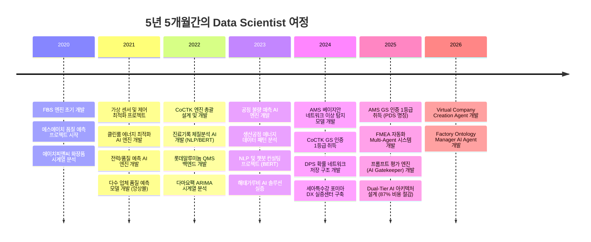
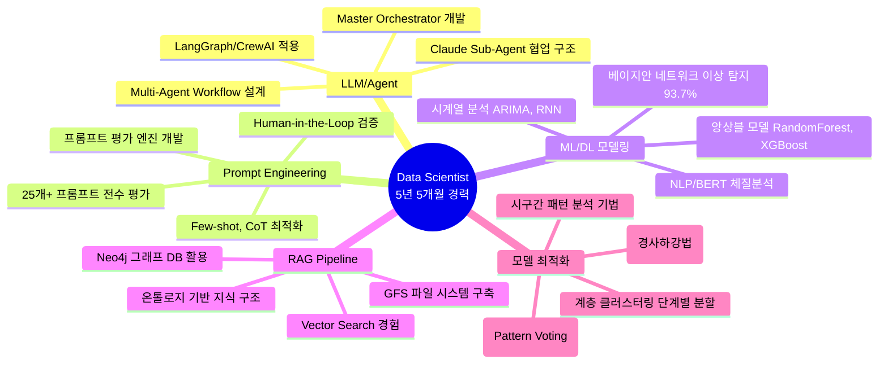
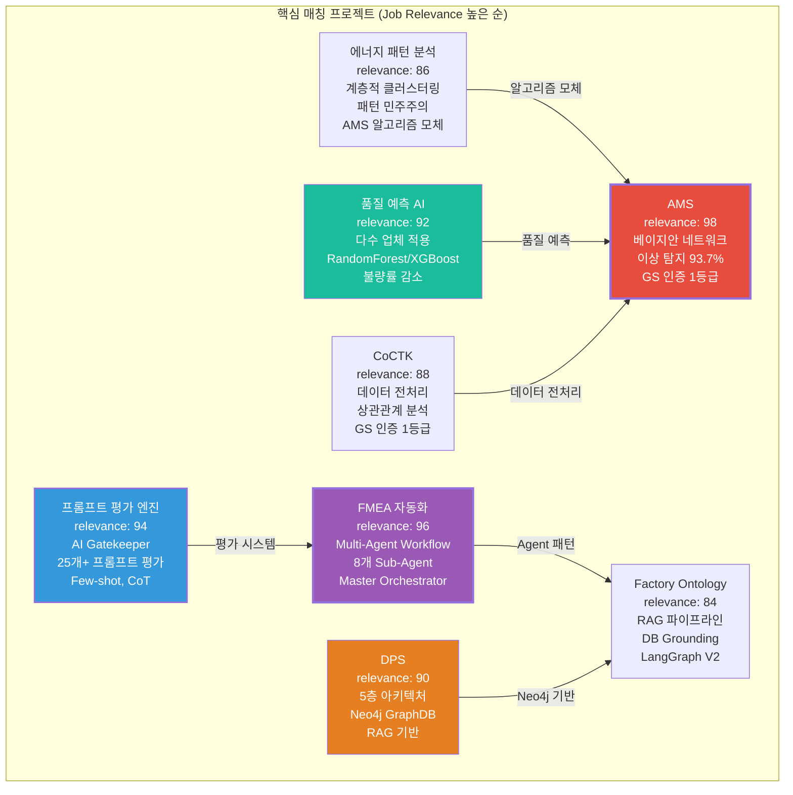
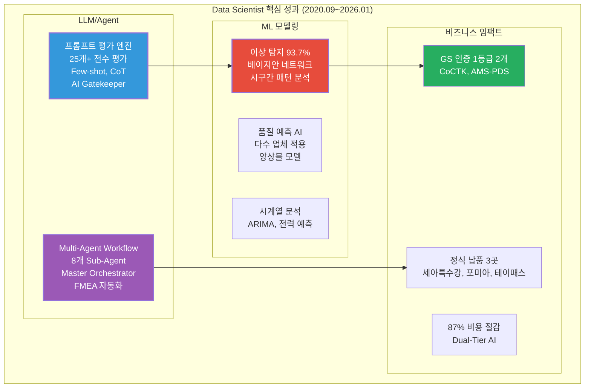

# 권순룡 이력서 - Data Scientist / ML Engineer

## 기본 정보

**이름**: 권순룡
**현 소속**: 한솔코에버 연구소 대리 (2020.09 ~ 재직중)
**총 경력**: 5년 5개월 (2020.09~2026.01)
**핵심 역량**: ML/DL 모델 개발, LLM/Agent 구조 설계, Prompt Engineering, RAG Pipeline, 베이지안 네트워크, 시계열 분석, 이상 탐지, 품질 예측
**이메일**: m920831@naver.com
**연락처**: 010-5671-6200
**GitHub**: https://github.com/moobaek

---

## 한눈에 보는 경력 (2020-2026)

---

## 지원 동기

LOOP AI 모델링팀에서 HR-Tech 혁신을 이끄는 데이터 사이언티스트 역할에 기여하고자 지원합니다.

5년 5개월간의 ML/AI 경험을 통해 추천 알고리즘, 이상치 탐지, LLM/Agent 구조 설계 역량을 갖춘 엔지니어로 성장했습니다. 특히 LOOP AI팀에서 요구하는 LLM 서비스 품질 개선, Prompt Engineering, RAG 파이프라인 경험을 실무에서 직접 수행해왔습니다.

**LLM/Agent 구조 설계 역량** 으로는 FMEA 자동화 프로젝트에서 Claude Sub-Agent 기반 Multi-Agent Workflow를 설계하여 8개 독립 Sub-Agent가 협업하는 Master Orchestrator 구조를 개발했습니다. 각 Agent가 R&D, Mfg, QA 도메인을 담당하며, LangGraph/CrewAI 방식의 Task-based Orchestration을 적용했습니다.

**Prompt Engineering 및 Evaluation 전문성** 으로는 프롬프트 평가 엔진을 개발하여 25개+ 프롬프트 전수 평가 시스템을 구축했습니다. Quality, Consistency, Cost 3가지 핵심 차원을 병렬 평가하며, Human-in-the-Loop 8단계 검증 프로세스를 설계했습니다. Few-shot, Chain-of-Thought 프롬프트 최적화 경험도 보유하고 있습니다.

**이상 탐지 및 ML 모델링 역량** 으로는 AMS 프로젝트에서 베이지안 네트워크 기반 이상 탐지 모델을 개발하여 93.7%의 이상탐지율을 달성했습니다. 시구간 패턴 분석 기법으로 같은 값도 시점별 통계적 특성(p-values, 첨도, 편차)에 따라 정상/불량을 구분합니다.

**End-to-End 모델링 및 비즈니스 임팩트** 로는 GS 인증 1등급 2개(CoCTK, AMS), 세아특수강/포미아 정식 납품, 테크웰/신성오토텍 컨설팅을 통해 모델 개발부터 서비스 적용, 성과 측정까지 전 과정을 수행해왔습니다.

잡코리아의 HR-Tech 도메인은 새롭지만, 제조/헬스케어 등 다양한 도메인 데이터 분석 경험과 도메인별 용어 자동 조정 노하우로 빠르게 적응할 수 있습니다. LOOP AI팀과 함께 구직자-기업 매칭 고도화에 기여하고 싶습니다.

---

## 핵심 역량 맵

---

## 프로젝트 관계도 (잡코리아 직무 매칭)

---

## 경력 개요

### 한솔코에버 연구소 (2020.09 ~ 재직중)

**직급** : 대리
**부서** : 연구소
**총 경력** : 5년 5개월 (2020.09~2026.01)

**주요 업무** :
- **LLM/Agent 구조 설계** : Multi-Agent Workflow, Master Orchestrator, Claude Sub-Agent 협업 구조 개발
- **Prompt Engineering** : 프롬프트 평가 엔진 개발, Few-shot/CoT 최적화, Human-in-the-Loop 검증
- **ML/DL 모델 개발** : 베이지안 네트워크, 시계열 분석, NLP/BERT, 클러스터링, 앙상블 모델
- **RAG Pipeline 구축** : Neo4j 그래프 DB, 온톨로지 기반 지식 구조, Vector Search
- **End-to-End 모델링**: 모델 개발 → 파이프라인 구성 → 서빙 환경 연계 전 과정 수행

**핵심 성과** :
- ✅ **베이지안 네트워크 기반 이상 탐지 모델 개발** : 이상탐지율 93.7% 달성 (AMS)
- ✅ **Multi-Agent Workflow 설계** : 8개 독립 Sub-Agent 협업 구조, Master Orchestrator 개발 (FMEA 자동화)
- ✅ **프롬프트 평가 엔진 개발** : 25개+ 프롬프트 전수 평가, Quality/Consistency/Cost 3차원 평가
- ✅ **시구간 패턴 분석 기법 개발** : 같은 값도 시점별 통계적 특성에 따라 정상/불량 구분
- ✅ **계층 클러스터링 단계별 분할** : AI 피쉬본 자동 생성
- ✅ **패턴 민주주의 기법 고안** : 여러 패턴 분석 결과를 투표 방식으로 통합
- ✅ **다수 업체 품질 예측 AI 엔진 적용** : 사출/도정/금형 공정 품질 예측 모델 개발
- ✅ **시계열 분석 전문성** : ARIMA, 전력 데이터 예측, 화장품 시계열 분석
- ✅ **GS 인증 1등급 2개 취득** : CoCTK (2024), AMS-PDS (2025)
- ✅ **정식 납품 3곳** : 세아특수강, 포미아, 테이패스
- ✅ **특허 등록** : 피쉬본 관리 시스템 특허 등록
- ✅ **학술 논문 발표 10편** : 2020-2025년, ML/AI 모델 개발 분야

**비즈니스 임팩트** :
- 연간 수십억 원 손실 방지 (이상 탐지 조기 대응, AMS)
- 다수 업체 불량률 감소 (품질 예측 AI 엔진 적용)
- Dual-Tier AI 아키텍처로 87% 비용 절감

---

## 핵심 역량

### LLM/Agent 구조 설계 및 Prompt Engineering

LOOP AI팀에서 요구하는 **LLM/Agent 구조 설계**, **Prompt Engineering**, **Orchestration** 역량을 실무에서 직접 수행해왔습니다.

**FMEA 자동화 Multi-Agent 시스템 (2025)** 에서는 Claude Sub-Agent 기반 Multi-Agent Workflow를 설계하여 8개 독립 Sub-Agent(R&D, Mfg, QA 도메인)가 협업하는 Master Orchestrator 구조를 개발했습니다. LangGraph/CrewAI 방식의 Task-based Orchestration을 적용하여 Phase 0~5 워크플로우를 자동화했습니다. 코딩 에이전트 역설계 시스템 구조를 적용하여 최신 AI 트렌드를 반영했습니다.

**프롬프트 평가 엔진 (2025)** 에서는 AI Gatekeeper 역할로 전체 프롬프트 전수 평가 시스템을 개발했습니다. 25개+ 프롬프트에 대해 Quality, Consistency, Cost 3가지 핵심 차원을 병렬 평가합니다. 이중 검증(Double-Check) 구조와 Human-in-the-Loop 8단계 검증 프로세스를 설계했으며, Few-shot, Chain-of-Thought 프롬프트 최적화 경험을 보유합니다.

**Factory Ontology Manager AI Agent (2026)** 에서는 LangGraph V2를 활용하여 자연어 기반 공정 문서 파싱, DB Grounding, Ontology Mapping을 수행하는 RAG 파이프라인을 구축했습니다. 레이아웃 생성 시간을 80% 단축했습니다.

### ML 모델 개발 및 이상 탐지

**AMS 프로젝트 (2024-2025)** 에서 베이지안 네트워크 기반 이상 탐지 모델을 개발하여 93.7%의 이상탐지율을 달성했습니다. 확률 최적화(경사하강법)를 통한 이상상황 확률 네트워크를 작성했으며, 시구간 패턴 분석 기법을 개발하여 같은 값도 시점별 통계적 특성(p-values, 첨도, 편차)에 따라 정상/불량을 구분합니다. 계층 클러스터링을 단계별로 잘라 AI 피쉬본을 자동 생성하는 방식으로 이상 탐지율을 극대화했습니다.

**품질 예측 AI 엔진 (2021-2023)** 에서는 다수 업체(한중엔시에스, 대성금형, 제이제이툴스, 알티스트)에 RandomForest, XGBoost, AdaBoost 앙상블 모델을 적용하여 불량률 감소 성과를 달성했습니다.

**시계열 분석 모델 (2020-2023)** 으로는 전력 데이터 예측, 품질 예측, 공정 불량 예측 등 다양한 시계열 분석 모델을 개발했습니다. ARIMA, RNN 등 시계열 예측 모델을 활용하여 제조 현장의 데이터 패턴을 분석하고 예측했습니다.

### 데이터 엔지니어링 및 RAG Pipeline

**DPS 프로젝트 (2021-2024)** 에서 5층 아키텍처 기반 데이터 파이프라인을 설계하여 대규모 제조 데이터를 효율적으로 처리했습니다. Neo4j 그래프 DB를 활용하여 4M2E(Man, Machine, Material, Method, Environment, Energy) 관계를 온톨로지로 정의하고, 지식 그래프 기반 RAG를 구축했습니다.

---

## 주요 프로젝트 경험

### 1. FMEA 자동화 - Multi-Agent Workflow (LLM/Agent 구조 설계)

**기간**: 2025.06 ~ 현재
**역할**: AI Agent 아키텍트
**relevance_score**: 96

**핵심 성과**:
- ✅ **Claude Sub-Agent 기반 Multi-Agent Workflow**: 8개 독립 Sub-Agent 협업 구조
- ✅ **Master Orchestrator 설계**: R&D, Mfg, QA 도메인별 Agent 오케스트레이션
- ✅ **LangGraph/CrewAI 방식 적용**: Task-based Orchestration, Phase 0~5 자동화
- ✅ **코딩 에이전트 역설계**: 최신 AI 트렌드 시스템 구조 적용

**기술 스택**: Python, Claude API, LangGraph, Multi-Agent Architecture, Orchestration

---

### 2. 프롬프트 평가 엔진 - AI Gatekeeper (Prompt Engineering, Evaluation)

**기간**: 2025.04 ~ 현재
**역할**: AI 평가 시스템 개발
**relevance_score**: 94

**핵심 성과**:
- ✅ **AI Gatekeeper 역할**: 전체 프롬프트 전수 평가 시스템
- ✅ **3가지 핵심 차원 평가**: Quality, Consistency, Cost 병렬 평가
- ✅ **이중 검증 구조**: Double-Check 구조로 정확도 향상
- ✅ **Human-in-the-Loop**: 8단계 검증 프로세스 설계
- ✅ **Few-shot, CoT**: 프롬프트 최적화 경험

**기술 스택**: Python, LLM Evaluation, Prompt Engineering, Few-shot, Chain-of-Thought

---

### 3. AMS (Analysis Management System) - 베이지안 네트워크 이상 탐지

**기간**: 2024.07 ~ 2025.12
**발주처**: 한국산업기술진흥원
**역할**: AI 엔진 개발 및 모델 최적화 (총괄 PM)
**relevance_score**: 98

**핵심 성과**:
- ✅ **베이지안 네트워크 기반 이상 탐지 모델**: 이상탐지율 93.7% 달성
- ✅ **시구간 패턴 분석 기법 개발**: 시점별 통계적 특성으로 정상/불량 구분
- ✅ **계층 클러스터링 단계별 분할**: AI 피쉬본 자동 생성
- ✅ **8단계 시계열 데이터 파이프라인**: 실시간 스트리밍 + 배치 처리 하이브리드
- ✅ **GS 인증 1등급 취득**: PDS 명칭으로 소프트웨어 품질 인증
- ✅ **정식 납품**: 세아특수강, 포미아, 테크웰/신성오토텍

**기술 스택**: Python, 베이지안 네트워크, 시계열 분석, 계층 클러스터링, 확률 최적화, Neo4j

---

### 4. DPS (데이터수집시스템) - RAG Pipeline 및 Neo4j 활용

**기간**: 2021 ~ 2024
**발주처**: 세아특수강
**역할**: 데이터 아키텍트 (PM)
**relevance_score**: 90

**핵심 성과**:
- ✅ **5층 아키텍처 기반 데이터 파이프라인 설계**: 대규모 제조 데이터 처리
- ✅ **Neo4j 그래프 DB 활용**: 4M2E 관계 온톨로지, 지식 그래프 RAG 구축
- ✅ **확률 네트워크 저장 구조**: FBS 뼈대 위에 확률적 최적화
- ✅ **데이터 품질 관리**: 수집부터 분석까지 전 과정 품질 검증

**기술 스택**: Python, Neo4j, SQL, Docker, Kubernetes, 확률 네트워크

---

### 5. 품질 예측 AI 엔진 - 앙상블 모델 개발

**기간**: 2021 ~ 2023
**발주처**: 정보통신산업진흥원
**역할**: ML 엔진 개발
**relevance_score**: 92

**핵심 성과**:
- ✅ **다수 업체 품질 예측 AI 엔진**: 사출/도정/금형 공정 품질 예측
- ✅ **앙상블 모델 적용**: RandomForest, XGBoost, AdaBoost 앙상블
- ✅ **불량률 감소**: 제조 현장 품질 개선 실증
- ✅ **End-to-End 모델링**: 기획-개발-검증-납품 전체 라이프사이클

**기술 스택**: Python, Scikit-learn, RandomForest, XGBoost, AdaBoost, 시계열 분석

---

### 6. 생산공정 에너지 데이터 패턴 분석 - 계층적 클러스터링

**기간**: 2023
**발주처**: 연구과제
**역할**: 메인 수행 (ML 모델 개발)
**relevance_score**: 86

**핵심 성과**:
- ✅ **계층적 클러스터링(Hierarchical Clustering) 도입**: 설비 상태 데이터 패턴 분석
- ✅ **패턴 민주주의(Pattern Voting) 기법 고안**: 데이터 패턴 분석 방법론 개발
- ✅ **AMS 알고리즘 모체**: 이 연구의 구조적 분화와 투표 방식이 훗날 AMS의 핵심 알고리즘 모체가 됨

**기술 스택**: Python, 패턴 분석, 계층적 클러스터링, 라벨링 시스템, 패턴 민주주의

---

### 7. CoCTK (Consulting Tool Kit) - 데이터 전처리 및 상관관계 분석

**기간**: 2022.03 ~ 2024
**발주처**: 중소기업기술정보진흥원
**역할**: 엔진 총괄 설계 & 화면설계 개발 총괄 PM
**relevance_score**: 88

**핵심 성과**:
- ✅ **데이터 전처리 엔진 개발**: 제조 현장의 복잡한 데이터를 분석 가능한 형태로 변환
- ✅ **상관관계 분석 엔진 개발**: 변수 간의 관계를 분석하여 중요한 변수를 찾아냄
- ✅ **비용 최적화 엔진 개발**: 클러스터링 기반 구간 룰로 에너지 최적화 수행
- ✅ **GS 인증 1등급 취득**: 2024년 소프트웨어 품질 인증 획득

**기술 스택**: Python, 데이터 전처리, 상관관계 분석, 비용 최적화, 클러스터링

---

## 기술 스택

### LLM/Agent & Prompt Engineering
- **LLM/Agent 프레임워크**: 2년 경력 (2025~2026)
  - Claude Sub-Agent, LangGraph, CrewAI 방식 적용
  - Multi-Agent Workflow, Master Orchestrator 설계
- **Prompt Engineering**: 2년 경력 (2025~2026)
  - 프롬프트 평가 엔진 개발, Few-shot/CoT 최적화
  - Human-in-the-Loop 검증 프로세스

### ML/DL 프레임워크 및 라이브러리
- **Scikit-learn**: 5년 5개월 경력 (2020.09~2026.01)
  - 다양한 ML 알고리즘 활용 (모든 ML 프로젝트)
- **PyTorch/TensorFlow**: 3년 경력 (2022~2025)
  - 딥러닝 모델 개발 및 학습
- **베이지안 네트워크**: 2년 경력 (2024~2025)
  - 이상 탐지 모델 개발 (AMS, 이상탐지율 93.7%)
- **앙상블 모델**: 3년 경력 (2021~2024)
  - RandomForest, XGBoost, AdaBoost (품질 예측 AI 엔진)
- **시계열 분석**: 5년 5개월 경력 (2020.09~2026.01)
  - ARIMA, RNN 등 시계열 예측 모델 개발 (다수 프로젝트)
- **클러스터링**: 3년 경력 (2023~2025)
  - 계층적 클러스터링, 패턴 분석 (에너지 패턴 분석, AMS)

### 데이터 처리 및 분석
- **Python**: 5년 5개월 경력 (2020.09~2026.01)
  - 49개 모듈 개발: MLS, CoCTK, FBS, RMS, AMS
- **SQL/PySpark**: 5년 5개월 경력 (2020.09~2026.01)
  - 대용량 데이터 전처리 및 분석
- **Pandas/NumPy**: 5년 5개월 경력 (2020.09~2026.01)
  - 데이터 전처리 및 분석 (모든 ML 프로젝트)

### 데이터베이스 & RAG
- **Neo4j**: 3년 경력 (2022~2025)
  - 그래프 DB, 확률 네트워크, RAG 파이프라인
  - Cypher 쿼리 작성
- **MLflow/Airflow**: 2년 경력 (2024~2025)
  - 모델 학습·실험 관리·파이프라인 운영
- **MSSQL Server, PostgreSQL**: 5년 5개월 경력 (2020.09~2026.01)
  - 관계형 DB (모든 프로젝트)

---

## 성과 대시보드

### 정량적 성과 요약

| 분류 | 지표 | 수치 | 세부 내용 |
|:---|---:|:---|:---|
| **LLM/Agent** | Multi-Agent | 8개 Sub-Agent | FMEA 자동화, Master Orchestrator |
| | 프롬프트 평가 | 25개+ 전수 평가 | Quality/Consistency/Cost 3차원 |
| **ML 모델** | 이상 탐지 정확도 | 93.7% | 베이지안 네트워크 기반 (AMS) |
| | 품질 예측 | 4개+ 업체 | 한중엔시에스, 대성금형, 제이제이툴스 등 |
| | 시계열 분석 | 3개+ 프로젝트 | 에이치피앤씨, 다마요팩, 사출 업체 |
| **비즈니스** | GS 인증 | 1등급 2개 | CoCTK (2024), AMS-PDS (2025) |
| | 정식 납품 | 3곳 | 세아특수강, 포미아, 테이패스 |
| | 비용 절감 | 87% | Dual-Tier AI 아키텍처 |
| **학술** | 논문 발표 | 10편 | 2020-2025년 |
| | 특허 등록 | 1건 | 피쉬본 관리 시스템 |

---

## 학술 활동 및 인증

### 인증
- **GS 인증 1등급 (CoCTK)**: 2024년 소프트웨어 품질 인증 획득
- **GS 인증 1등급 (AMS-PDS)**: 2025년 소프트웨어 품질 인증 획득

### 특허
- **피쉬본 관리 시스템 특허 등록**: 이상 탐지 및 분석 시스템 특허

### 논문 발표 (10편)
- **2025년**: AMS 이상 탐지 시스템, FMEA 자동화 논문 발표
- **2024년**: DPS 확률 네트워크, 설비 이상상태 최적화 논문 발표
- **2023년**: CoCTK 엔진, 에너지 패턴 분석 논문 발표
- **2022년**: 품질 예측 알고리즘, ICT 융복합 스마트 공장 논문 발표

---

## 학력

**홍익대학교 전자공학과** (2013.03 ~ 2020.02)
- 학점: 3.11 / 4.5
- 졸업논문: LD 동격회로 설계 및 PLL 설계
- 주요 수강 분야: 회로 설계, 전파공학, 컴퓨터공학

---

## 자격증

**OPIc** (2019.03)
- ACT FL (American Council on the Teaching of Foreign Languages)

---

## 핵심 철학

> **"모델보다 데이터, 데이터보다 정보, 지식구조를 정리하는 현장친화적 연구원"**

5년 5개월간의 ML/AI 경험을 통해 다양한 ML 알고리즘과 LLM/Agent 구조 설계 역량을 갖추었습니다. 화려한 기술보다는 현장에서 실제로 사용할 수 있는 실용적인 AI 솔루션을 개발하는 것을 중시하며, 비즈니스 가치와 사용자 경험을 추구합니다.

LOOP AI팀에서 추구하는 "빠른 실험과 학습을 통해 더 나은 모델과 시스템을 함께 만들어간다"는 철학에 깊이 공감하며, HR-Tech 혁신에 기여하고 싶습니다.

---

© 2026 권순룡. All Rights Reserved.

*본 이력서는 잡코리아 LOOP AI 모델링팀 데이터사이언티스트 직무에 맞춤 작성되었습니다.*
