# 권순룡 포트폴리오 - Data Scientist / ML Engineer

> **"LLM/Agent 구조 설계와 ML 모델링으로 비즈니스 가치를 창출하는 Data Scientist"**
> **"모델보다 데이터, 데이터보다 정보, 지식구조를 정리하는 현장친화적 연구원"**

---

## 기본 정보

**이름**: 권순룡
**소속**: 한솔코에버 연구소 대리 (2020.09 ~ 재직중)
**총 경력**: 5년 5개월 (2020.09~2026.01)
**핵심 역량**: ML/DL 모델 개발, LLM/Agent 구조 설계, Prompt Engineering, RAG Pipeline, 베이지안 네트워크, 시계열 분석, 이상 탐지, 품질 예측
**GitHub**: https://github.com/moobaek
**이메일**: m920831@naver.com
**연락처**: 010-5671-6200

---

## 전체 프로젝트 타임라인 (2020-2026) - 47개+ 프로젝트

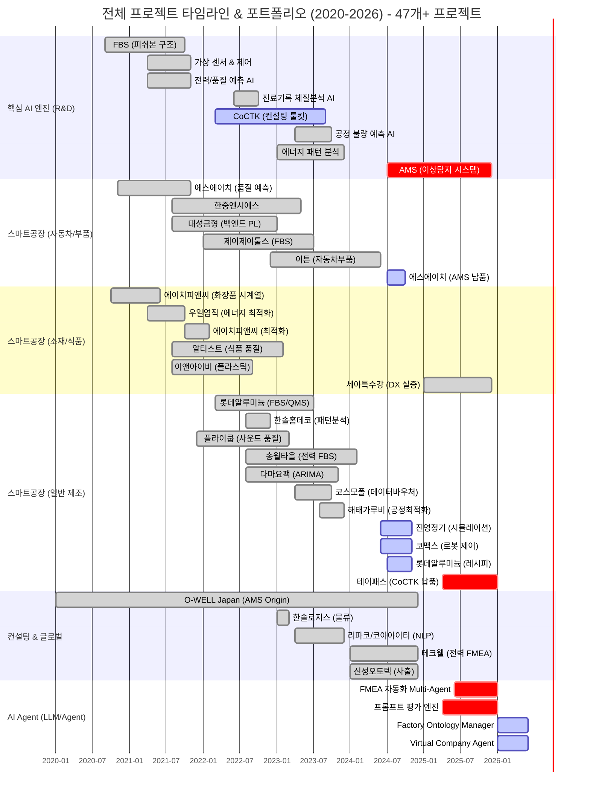

> **총 프로젝트 현황**
> - **AI & Analytics**: 8개 (AMS, CoCTK, FBS 등)
> - **스마트공장 구축**: 23개 (에스에이치아이엔티, 롯데알루미늄 등)
> - **컨설팅**: 5개 (테크웰, 신성오토텍 등)
> - **AI Agent (LLM)**: 4개 (FMEA 자동화, 프롬프트 평가 등)

---

## 잡코리아 LOOP AI 직무 매칭 분석

### 매칭 점수: 93점 (Essential: 95, Preferred: 90)

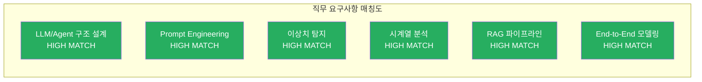

| 요구사항 | 매칭 | 근거 |
|:---|:---:|:---|
| **LLM/Agent 구조 설계** | HIGH | 8개 Sub-Agent Multi-Agent Workflow, Master Orchestrator 설계 |
| **Prompt Engineering, Evaluation** | HIGH | 25개+ 프롬프트 전수 평가, Few-shot/CoT 최적화 |
| **추천 알고리즘, 이상치 탐지** | HIGH | 베이지안 네트워크 이상 탐지 93.7% (AMS) |
| **Regression/Classification/Time Series** | HIGH | 5년간 다양한 ML/DL 모델 개발 경험 |
| **RAG 파이프라인, Vector Search** | HIGH | Neo4j 그래프 DB 기반 지식 그래프 RAG 구축 |
| **End-to-End 모델링** | HIGH | GS 인증 2개, 정식 납품 3곳 |

---

## 포트폴리오 구조 (한눈에 보기)

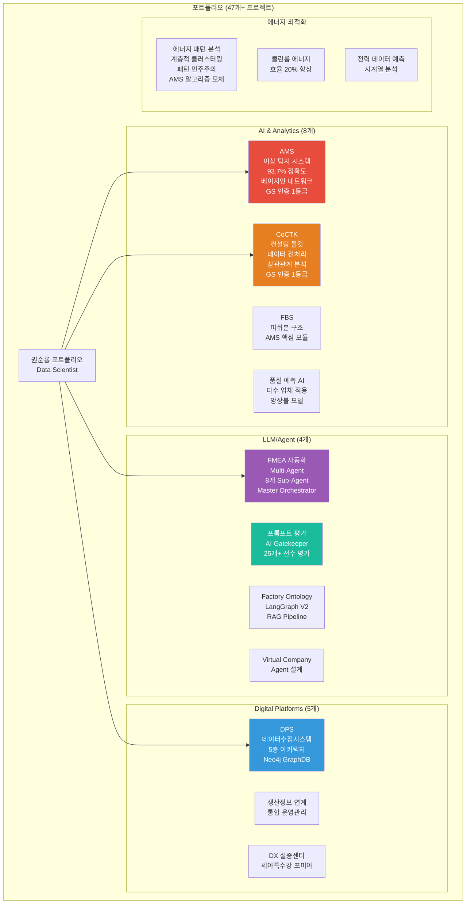

---

## 핵심 ML 성과 대시보드

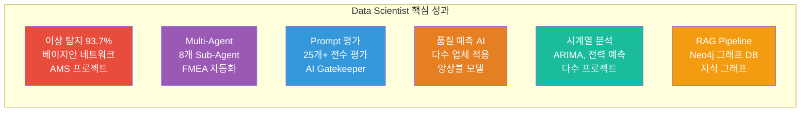

| 분류 | 지표 | 상세 |
|:---|---:|:---|
| **이상 탐지** | 93.7% 정확도 | 베이지안 네트워크 기반 모델 (AMS) |
| **LLM/Agent** | 8개 Sub-Agent | Multi-Agent Workflow (FMEA 자동화) |
| **Prompt Engineering** | 25개+ 전수 평가 | AI Gatekeeper (프롬프트 평가 엔진) |
| **품질 예측** | 다수 업체 적용 | 사출, 도정, 금형 공정 품질 예측 |
| **시계열 분석** | ARIMA, 전력 예측 | 에이치피앤씨, 다마요팩, 사출 업체 |
| **RAG Pipeline** | Neo4j 그래프 DB | 4M2E 온톨로지, 지식 그래프 구축 |

---

## 경력 타임라인 (2020-2026)

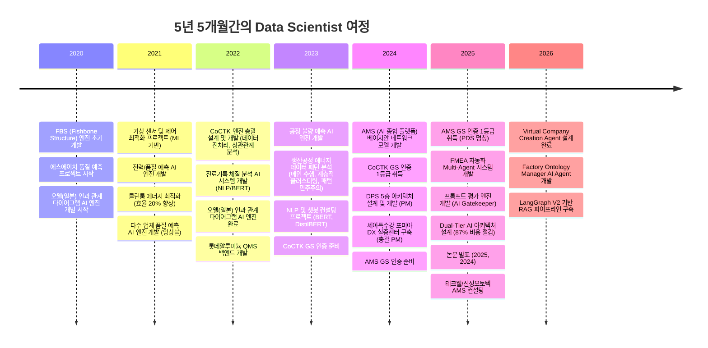

---

## 주요 프로젝트 경험 (47개+)

### 프로젝트 관계도 (잡코리아 직무 매칭)

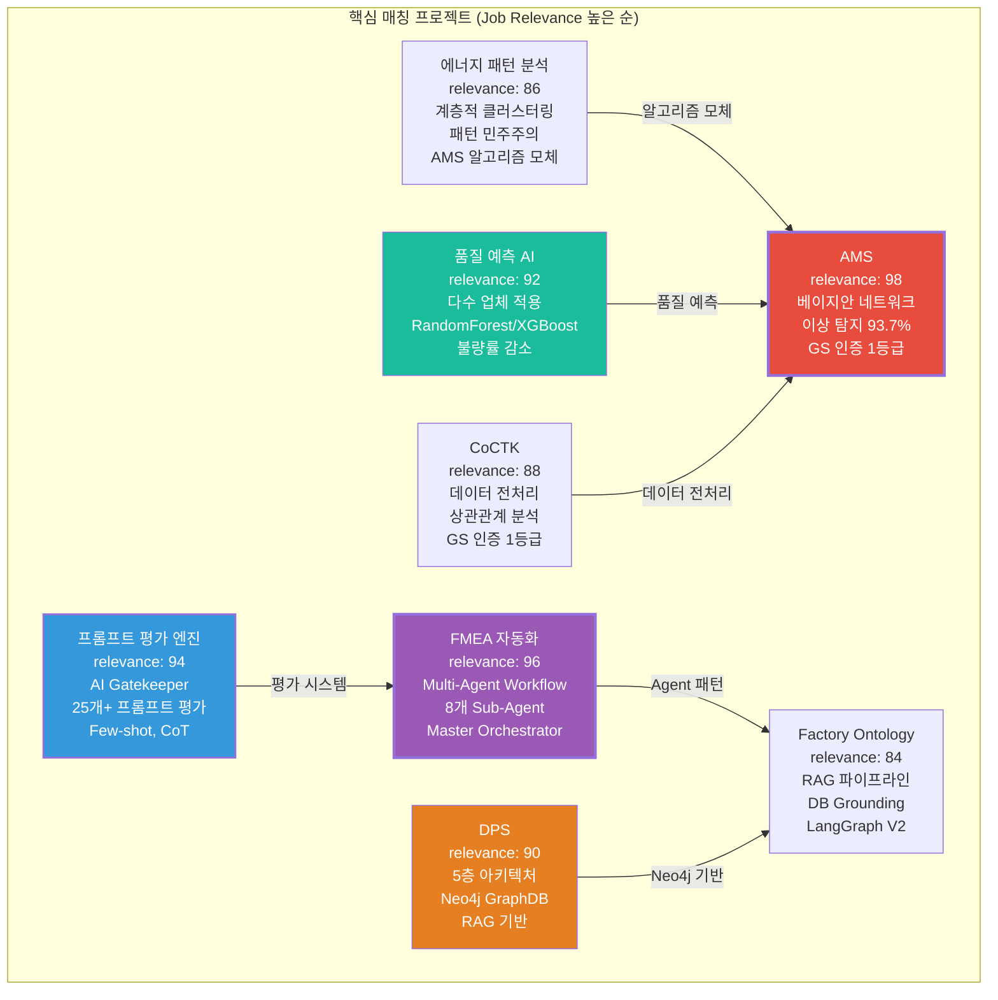

---

### 1. FMEA 자동화 - Multi-Agent Workflow (relevance: 96)

**LLM/Agent 구조 설계의 정점**

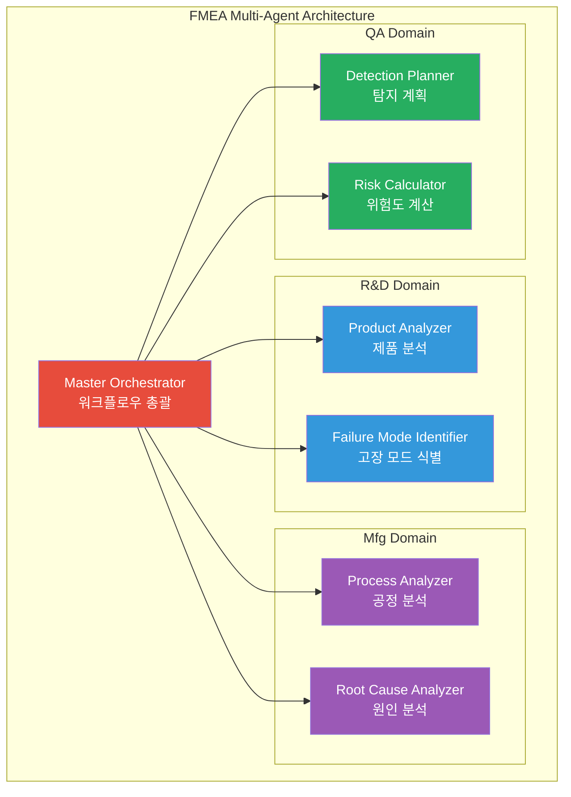

**기간**: 2025.06 ~ 현재
**역할**: AI Agent 아키텍트
**발주처**: 내부 R&D

**프로젝트 개요**:
FMEA(Failure Mode and Effects Analysis) 자동화 프로젝트는 제조 공정의 고장 모드 및 영향 분석을 AI Agent로 자동화하는 시스템입니다. Claude Sub-Agent 기반으로 8개의 독립적인 Sub-Agent가 R&D, Mfg, QA 도메인을 담당하며, Master Orchestrator가 전체 워크플로우를 관리합니다.

**핵심 성과**:
- **Claude Sub-Agent 기반 Multi-Agent Workflow**: 8개 독립 Sub-Agent 협업 구조 설계
- **Master Orchestrator 개발**: Task-based Orchestration으로 Phase 0~5 워크플로우 자동화
- **LangGraph/CrewAI 방식 적용**: 최신 AI Agent 아키텍처 패턴 적용
- **코딩 에이전트 역설계**: 시스템 구조 분석 및 적용

**기술 스택**: Python, Claude API, LangGraph, Multi-Agent Architecture, Orchestration

**잡코리아 직무 연관성**:
- LLM/Agent 구조 설계 → LOOP AI의 LLM 서비스 품질 개선
- Orchestration → 복잡한 HR 매칭 워크플로우 자동화
- Multi-Agent 패턴 → 구직자-기업 매칭 고도화

---

### 2. 프롬프트 평가 엔진 - AI Gatekeeper (relevance: 94)

**Prompt Engineering, Orchestration, Evaluation 전문성**

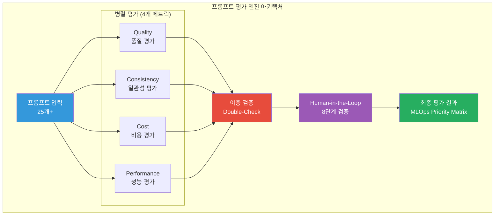

**기간**: 2025.04 ~ 현재
**역할**: AI 평가 시스템 개발
**발주처**: 내부 R&D

**프로젝트 개요**:
프롬프트 평가 엔진은 25개+ 프롬프트에 대해 품질을 전수 평가하는 AI Gatekeeper 시스템입니다. Quality, Consistency, Cost, Performance 4가지 핵심 차원을 병렬 처리로 동시 평가하며, 이중 검증(Double-Check) 구조로 정확도를 향상시켰습니다.

**핵심 성과**:
- **AI Gatekeeper 역할**: 전체 프롬프트 전수 평가 시스템 구축
- **3가지 핵심 차원 평가**: Quality, Consistency, Cost 병렬 평가
- **이중 검증 구조**: Double-Check 구조로 정확도 향상
- **Human-in-the-Loop**: 8단계 검증 프로세스 설계
- **Few-shot, CoT 최적화**: 프롬프트 최적화 경험

**기술 스택**: Python, LLM Evaluation, Prompt Engineering, Few-shot, Chain-of-Thought

**잡코리아 직무 연관성**:
- Prompt Engineering → LOOP AI 프롬프트 품질 관리
- Evaluation → LLM 서비스 품질 측정 및 개선
- Human-in-the-Loop → 채용 매칭 품질 검증

---

### 3. AMS (Analysis Management System) - 이상 탐지 93.7% (relevance: 98)

**베이지안 네트워크 기반 이상 탐지의 정점**

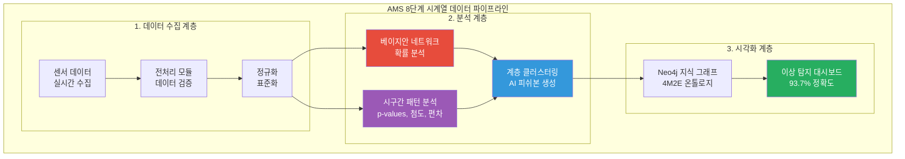

**기간**: 2024.07 ~ 2025.12
**역할**: AI 엔진 개발 및 모델 최적화 (총괄 PM)
**발주처**: 한국산업기술진흥원

**프로젝트 개요**:
AMS는 제조 현장의 설비 이상을 자동으로 탐지하고 분석하는 AI 종합 플랫폼입니다. 베이지안 네트워크를 활용하여 설비 상태 데이터를 분석하고, 확률 최적화(경사하강법)를 통한 이상상황 확률 네트워크를 작성했습니다.

**핵심 성과**:
- **베이지안 네트워크 기반 이상 탐지 모델**: 이상탐지율 93.7% 달성
- **시구간 패턴 분석 기법 개발**: 시점별 통계적 특성으로 정상/불량 구분
- **계층 클러스터링 단계별 분할**: AI 피쉬본 자동 생성
- **8단계 시계열 데이터 파이프라인**: 실시간 스트리밍 + 배치 처리
- **GS 인증 1등급 취득**: PDS 명칭으로 소프트웨어 품질 인증
- **정식 납품**: 세아특수강, 포미아, 테크웰/신성오토텍

**기술 스택**: Python, 베이지안 네트워크, 시계열 분석, 계층 클러스터링, 확률 최적화, Neo4j

**잡코리아 직무 연관성**:
- 이상치 탐지 → 부정행위 탐지, 이상 패턴 감지
- 시계열 분석 → 사용자 행동 패턴 분석
- 확률 네트워크 → 매칭 확률 계산

---

### 4. DPS (데이터수집시스템) - RAG Pipeline (relevance: 90)

**5층 아키텍처 기반 데이터 파이프라인 & Neo4j RAG**

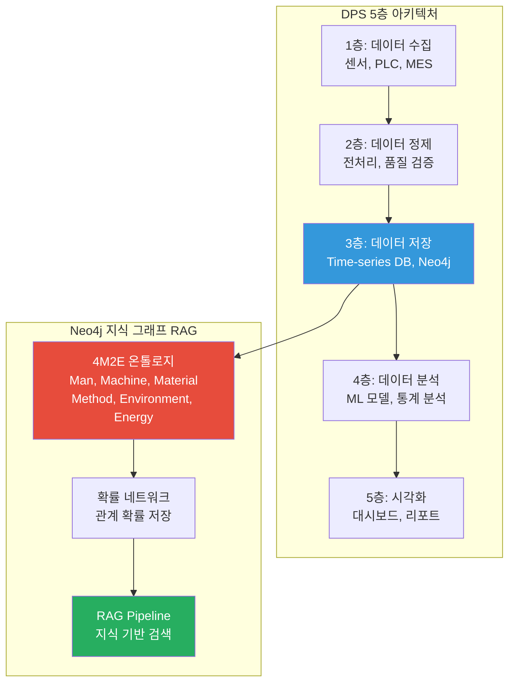

**기간**: 2021 ~ 2024
**역할**: 데이터 아키텍트 (PM)
**발주처**: 세아특수강

**프로젝트 개요**:
DPS 프로젝트에서 5층 아키텍처 기반 데이터 파이프라인을 설계하여 대규모 제조 데이터를 효율적으로 처리했습니다. Neo4j 그래프 DB를 활용하여 4M2E 관계를 온톨로지로 정의하고, 지식 그래프 기반 RAG를 구축했습니다.

**핵심 성과**:
- **5층 아키텍처 기반 데이터 파이프라인**: 대규모 제조 데이터 처리
- **Neo4j 그래프 DB 활용**: 4M2E 관계 온톨로지
- **확률 네트워크 저장 구조**: FBS 뼈대 위에 확률적 최적화
- **지식 그래프 RAG 구축**: 지식 기반 검색 시스템

**기술 스택**: Python, Neo4j, SQL, Docker, Kubernetes, 확률 네트워크

**잡코리아 직무 연관성**:
- RAG 파이프라인 → 공고/이력서 기반 정보 검색
- Vector Search → 유사 공고/인재 검색
- 지식 그래프 → HR 도메인 온톨로지 구축

---

### 5. 품질 예측 AI 엔진 - 앙상블 모델 (relevance: 92)

**Regression/Classification 모델 End-to-End 개발**

**기간**: 2021 ~ 2023
**역할**: ML 엔진 개발
**발주처**: 정보통신산업진흥원

**프로젝트 개요**:
품질 예측 AI 엔진은 제조 공정의 품질을 사전에 예측하는 시스템입니다. 사출, 도정, 금형 등 다양한 공정에 적용하여 품질 예측 모델을 개발했으며, 앙상블 기법으로 예측 정확도를 향상시켰습니다.

**핵심 성과**:
- **다수 업체 품질 예측 AI 엔진**: 사출/도정/금형 공정 품질 예측
- **앙상블 모델 적용**: RandomForest, XGBoost, AdaBoost
- **불량률 감소**: 제조 현장 품질 개선 실증
- **End-to-End 모델링**: 기획-개발-검증-납품 전체 라이프사이클

**적용 업체**:
| 업체 | 공정 | 적용 모델 | 성과 |
|:---|:---|:---|:---|
| 한중엔시에스 | 사출 | RandomForest, XGBoost, AdaBoost | 불량률 감소 |
| 대성금형 | 전기장치 | ML 품질 예측 | 품질 OUT 예측 |
| 제이제이툴스 | 금속가공 | FBS 품질 중요도 | 품질 개선 |
| 알티스트 | 식품 | CoCTK 초석 | 품질 예측 |

---

### 6. CoCTK (Consulting Tool Kit) - GS 인증 1등급 (relevance: 88)

**데이터 전처리 및 상관관계 분석 엔진**

**기간**: 2022.03 ~ 2024
**역할**: 엔진 총괄 설계 & 화면설계 개발 총괄 PM
**발주처**: 중소기업기술정보진흥원

**핵심 성과**:
- **데이터 전처리 엔진 개발**: 복잡한 데이터를 분석 가능한 형태로 변환
- **상관관계 분석 엔진 개발**: 변수 간의 관계 분석
- **비용 최적화 엔진 개발**: 클러스터링 기반 구간 룰로 에너지 최적화
- **GS 인증 1등급 취득**: 2024년 소프트웨어 품질 인증

**기술 스택**: Python, 데이터 전처리, 상관관계 분석, 비용 최적화, 클러스터링

---

### 7. 에너지 패턴 분석 - 계층적 클러스터링 (relevance: 86)

**AMS 핵심 알고리즘 모체**

**기간**: 2023
**역할**: 메인 수행 (ML 모델 개발)
**발주처**: 연구과제

**핵심 성과**:
- **계층적 클러스터링 도입**: 설비 상태 데이터 패턴 분석
- **패턴 민주주의 기법 고안**: 투표 방식으로 최종 패턴 결정
- **AMS 알고리즘 모체**: 구조적 분화와 투표 방식이 AMS 핵심 알고리즘 모체

---

### 8. Factory Ontology Manager - LangGraph V2 RAG (relevance: 84)

**자연어 기반 공정 문서 파싱 & DB Grounding**

**기간**: 2026.01 ~ 현재
**역할**: AI Agent 개발
**발주처**: 내부 R&D

**핵심 성과**:
- **자연어 기반 공정 문서 파싱**: 비정형 문서 자동 분석
- **DB Grounding**: 데이터베이스 기반 정보 검증
- **Ontology Mapping**: 공정 온톨로지 자동 매핑
- **레이아웃 생성 시간 80% 단축**

**기술 스택**: Python, LangGraph V2, RAG, Neo4j

---

## 기술 스택 요약

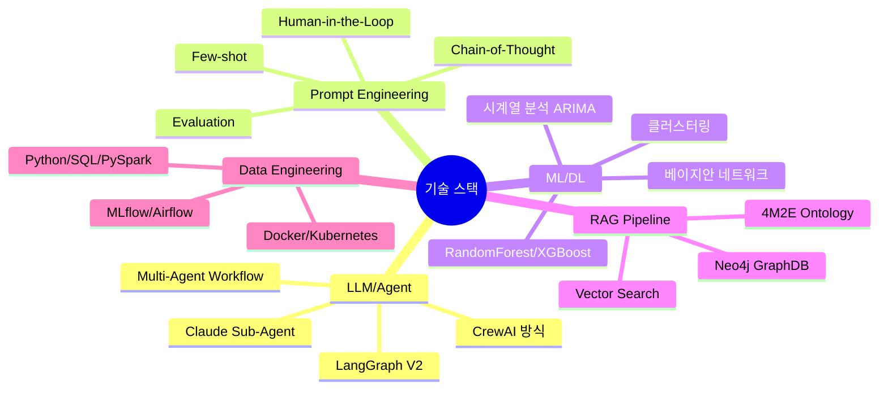

| 분류 | 기술 | 경력 | 주요 프로젝트 |
|:---|:---|:---:|:---|
| **LLM/Agent** | Claude, LangGraph, CrewAI | 2년 | FMEA 자동화, Factory Ontology |
| **Prompt Engineering** | Few-shot, CoT, Evaluation | 2년 | 프롬프트 평가 엔진 |
| **ML/DL** | Scikit-learn, PyTorch, TensorFlow | 5년 | AMS, 품질 예측, CoCTK |
| **RAG** | Neo4j, Vector Search | 3년 | DPS, Factory Ontology |
| **Data** | Python, SQL, PySpark | 5년 | 모든 프로젝트 |

---

## 비즈니스 임팩트 대시보드

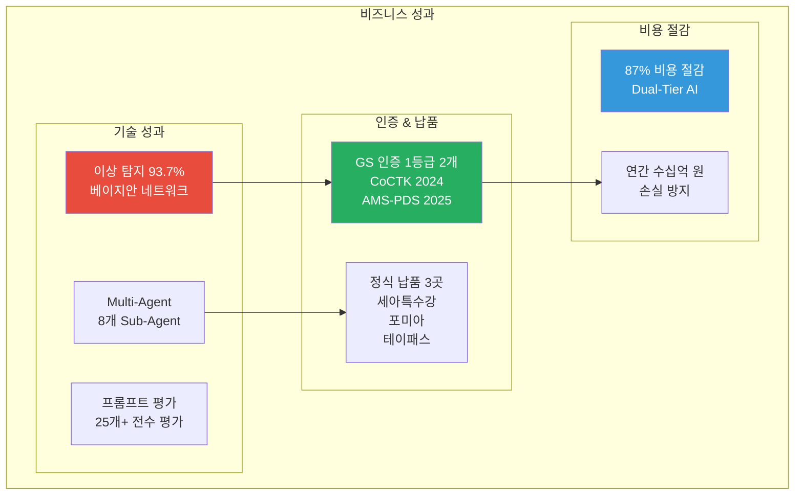

### 정량적 성과

| 분류 | 지표 | 수치 | 세부 내용 |
|:---|---:|:---|:---|
| **LLM/Agent** | Multi-Agent | 8개 | Sub-Agent 협업 구조 |
| | 프롬프트 평가 | 25개+ | 전수 평가 시스템 |
| **ML 모델** | 이상 탐지 | 93.7% | 베이지안 네트워크 |
| | 품질 예측 | 4개+ 업체 | 앙상블 모델 적용 |
| **인증** | GS 인증 | 1등급 2개 | CoCTK, AMS-PDS |
| **납품** | 정식 납품 | 3곳 | 세아특수강, 포미아, 테이패스 |
| **비용** | 비용 절감 | 87% | Dual-Tier AI |
| **논문** | 학술 발표 | 10편 | 2020-2025년 |

---

## 학술 성과 (10편)

| 발행일 | 논문 제목 | 학회 | 프로젝트 연계 |
|:---|:---|:---|:---|
| 2025.12 | 분석 상관/확률 네트워크 기반 FMEA 생성 연구 | KSFM | FMEA 자동화/AMS |
| 2025.06 | 구조-확률 종합 네트워크 및 최적 관리 방안 | 한국유체기계학회 | AMS |
| 2024.12 | 클러스터링 기법 적용 공장 운영 최적화 | 한국생산제조학회 | DPS |
| 2024.12 | 설비 이상상태 기반 최적 공정 데이터 추론 | 한국유체기계학회 | AMS |
| 2024.07 | 전력 데이터 기반 설비 상태 추론 및 예측 | 한국유체기계학회 | 에너지/센서 |
| 2023.12 | 송풍 설비 에너지 절감 연구 | 한국유체기계학회 | 에너지 최적화 |
| 2023.12 | 압축기 공정 품질 예측 AI 시스템 | 한국유체기계학회 | AI/데이터 |
| 2023.07 | AI기반 전력 사용 패턴 및 SOH분석 | 한국유체기계학회 | 에너지 패턴 |
| 2022.12 | 머신러닝 기반 품질예측 알고리즘 | 한국생산제조학회 | 품질 예측 |
| 2022.06 | ICT 융복합 스마트 공장 적용 사례 | 한국유체기계학회 | O-WELL Japan |

---

## 관련 문서

- **이력서**: [권순룡_이력서_잡코리아_Data_Scientist.md](./권순룡_이력서_잡코리아_Data_Scientist.md)
- **포트폴리오 인덱스**: [00_Portfolio_Index.md](../../00_Portfolio_Index.md)
- **프로젝트 개요**: [02_Projects_Overview.md](../../02_Projects_Overview.md)

---

*본 포트폴리오는 잡코리아 LOOP AI 모델링팀 데이터사이언티스트 직무에 맞춤 작성되었습니다.*

© 2026 권순룡. All Rights Reserved.
