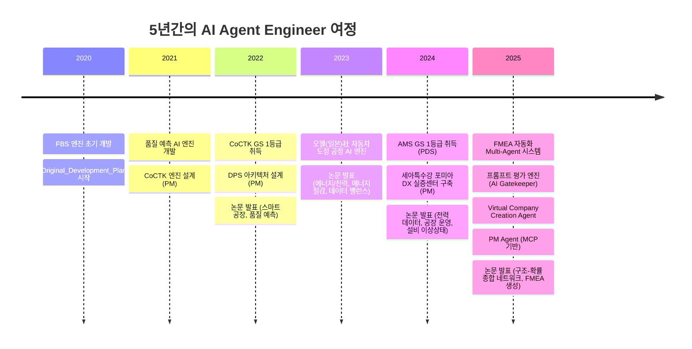
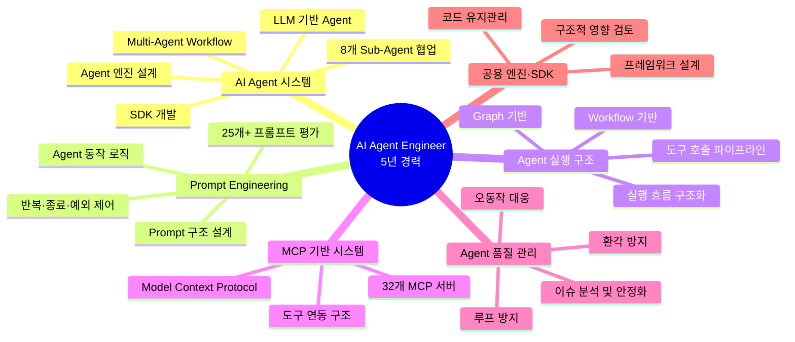
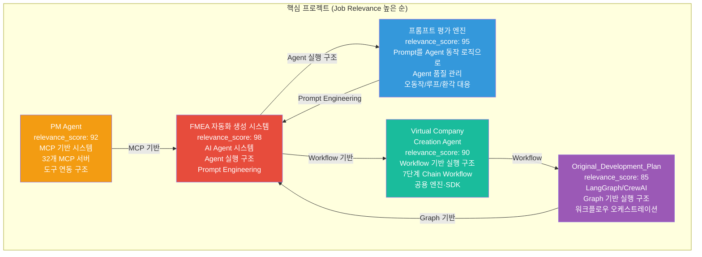
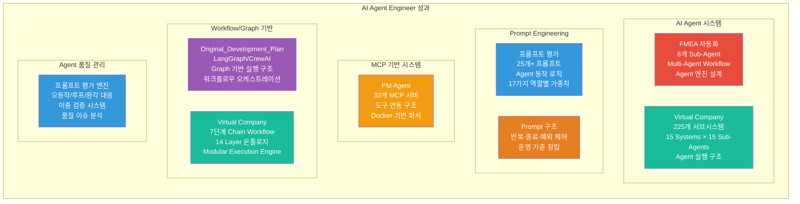

# 권순룡 이력서

## 기본 정보

**이름**: 권순룡  
**현 소속**: 한솔코에버 연구소 대리 (2020.09 ~ 재직중)  
**총 경력**: 5년 (2020~2025)  
**핵심 역량**: AI Agent Engineer, LLM 기반 Agent 시스템 개발, Prompt Engineering, Agent 실행 구조 설계, MCP 기반 시스템 개발, Workflow/Graph 기반 실행 구조

---

## 한눈에 보는 경력 (2020-2025)

---

## 지원 동기

5년간 AI Agent 시스템을 설계하고 개발하며 "Prompt를 단순 텍스트가 아닌 Agent 동작 로직의 일부로 다루는" 전문성을 쌓아왔습니다. 특히 FMEA 자동화 생성 시스템에서 Claude Sub-Agent 기반 Multi-Agent Workflow를 구축하여 8개 독립 Sub-Agent가 협업하는 시스템을 설계하고, Agent 실행 구조(Workflow/Tool/Prompt 흐름)를 개발·고도화한 경험은 한글과컴퓨터 AI Agent 핵심 기반 기술 연구·개발 팀의 "Agent 엔진, 런타임, 저작도구, 모델 연동 등 제품 기능의 기반이 되는 서버 기술을 설계·구현"하는 목표와 정확히 일치합니다.

한글과컴퓨터가 추구하는 "AI Hub Agent 엔진·SDK 설계/개선 및 유지관리", "Agent 실행 구조(Workflow/Tool/Prompt 흐름) 개발 및 고도화", "Prompt 구조 설계 및 운영 기준 정립(반복·종료·예외 제어 포함)", "Agent 품질 이슈 분석 및 안정화(오동작/루프/환각 등 대응)", "MCP 기반 도구 연동 구조 이해 및 확장"은 제가 프롬프트 평가 엔진에서 Prompt를 Agent 동작 로직의 일부로 설계하고, FMEA 자동화에서 Agent 실행 흐름을 구조화하여 반복·종료·예외 제어를 포함한 시스템을 구현한 경험과 직접적으로 연결됩니다. 또한 PM Agent에서 MCP 기반 도구 연동 구조를 개발하고, Virtual Company Creation Agent에서 Workflow/Graph 기반 실행 구조를 설계한 경험은 한글과컴퓨터의 "MCP 기반 기능을 지원하기 위한 안정적이고 확장 가능한 AI Agent 실행 환경을 구축"하는 목표를 충족합니다.

한글과컴퓨터의 "AI 혁신으로 함께하는 더 큰 성장"이라는 비전에 공감하며, 제가 쌓아온 AI Agent 시스템 개발 경험과 Prompt Engineering 전문성을 바탕으로 한글과컴퓨터의 B2C 서비스 확장과 다양한 MCP 기반 기능을 지원하는 안정적이고 확장 가능한 AI Agent 실행 환경 구축에 기여하고 싶습니다.

---

## 핵심 역량 맵

---

## 핵심 역량

### AI Agent 또는 LLM 기반 Agent 시스템 개발 (5년 경력)

Claude Sub-Agent 기반 Multi-Agent Workflow를 구축하여 8개 독립 Sub-Agent가 협업하는 시스템을 설계했습니다. FMEA 자동화 생성 시스템에서는 Claude Code Task tool을 활용하여 Master Orchestrator를 설계하고, Phase 0~5 자동화 워크플로우를 완전 구현했습니다. 각 Sub-Agent는 R&D, Mfg, QA 등 전문 영역을 담당하며, 코딩 에이전트의 역설계 시스템 구조를 적용하여 복잡한 FMEA 프로세스를 Sub-Agent로 분해했습니다. Virtual Company Creation Agent에서는 225개 서브시스템을 AI 에이전트로만 구성한 가상 기업 생성 시스템을 설계하여 15 Systems × 15 Sub-Agents 구조를 구현했습니다.

### Prompt를 Agent 동작 로직의 일부로 다루는 전문성

프롬프트 평가 엔진에서 Prompt를 단순 텍스트가 아닌 Agent 동작 로직의 일부로 설계했습니다. 3가지 핵심 차원(Quality, Consistency, Cost) 평가 체계와 MLOps Priority Matrix 기반 가중치 시스템을 구축했으며, 특히 17가지 역할별 동적 가중치를 적용하여 다양한 사용자 시나리오에 맞는 Prompt 구조를 설계했습니다. FMEA 자동화에서는 Prompt 구조 설계 및 운영 기준을 정립하여 반복·종료·예외 제어를 포함한 구조화된 Prompt 시스템을 구현했습니다. 프롬프트 평가 엔진에서는 25개+ 프롬프트를 전수 평가하는 AI Gatekeeper 시스템으로, Prompt 변경에 따른 Agent 동작 및 품질 변화를 분석·개선하는 경험을 쌓았습니다.

### Agent 실행 흐름 구조화 및 Workflow/Graph 기반 실행 구조 (5년 경력)

FMEA 자동화 생성 시스템에서 Agent 실행 흐름을 구조화하여 설계·구현했습니다. Phase 0~5까지의 체계적인 워크플로우 자동화를 통해 복잡한 FMEA 프로세스를 구조화했으며, 각 Sub-Agent의 역할과 책임을 명확히 정의했습니다. Virtual Company Creation Agent에서는 7단계 Chain Workflow (Chain 01~07)와 14 Layer 온톨로지 좌표 체계를 통해 복잡한 비즈니스 프로세스를 구조화했습니다. Original_Development_Plan에서는 LangGraph/CrewAI 방식 워크플로우 오케스트레이션을 구현하고, 상태 기반 진행 모니터링 및 완료 조건 판단 시스템을 구축했습니다. Modular Execution Engine을 통해 Full/Partial/Single/Resume 모드를 지원하여 유연한 워크플로우 실행을 가능하게 했습니다.

### MCP 기반 도구 연동 구조 개발 및 확장 (1년 경력)

PM Agent에서 MCP (Model Context Protocol) 기반 기술 자산 관리 시스템을 구축했습니다. 32개 Python MCP 서버를 개발하여 비정형 문서(HWP, DOCX, XLSX)를 자동 파싱하는 Docker 기반 파서 서버를 구축했습니다. MCP Protocol을 통해 계약서/과업지시서 분석, 회의록 분석을 통한 타임라인 자동 현행화, 누락된 문서나 데이터 파편화 방지 등 사업 관리의 전체 라이프사이클을 관장합니다. 에이전트 간 통신을 통해 유기적 네트워크를 구축하여 내·외부 에이전트 연동이 가능한 구조를 설계했습니다.

### Agent 품질 이슈 분석 및 안정화 (1년 경력)

프롬프트 평가 엔진에서 Agent 품질 이슈를 분석하고 안정화하는 시스템을 구축했습니다. AI가 생성한 프롬프트를 다른 AI가 평가하는 이중 검증(Double-Check) 시스템으로 환각(Hallucination) 방지, 오동작/루프/환각 등 대응 메커니즘을 구현했습니다. 3가지 핵심 차원(Quality, Consistency, Cost) 평가 체계를 통해 Prompt 변경에 따른 Agent 동작 및 품질 변화를 분석·개선하는 경험을 쌓았습니다. 운영 환경에서 이슈를 분석하고 개선으로 연결할 수 있는 문제 해결 역량을 보유하고 있습니다.

### 공용 엔진·SDK·프레임워크 형태의 코드 설계 및 유지관리 (5년 경력)

FMEA 자동화 생성 시스템에서 공용 엔진 형태의 Master Orchestrator를 설계하고, 각 Sub-Agent가 재사용 가능한 구조로 개발했습니다. Virtual Company Creation Agent에서는 Decoupled Intelligence Architecture (지능과 상태의 분리)를 통해 공용 엔진 형태의 코드를 설계했으며, Modular Execution Engine을 통해 다양한 실행 모드를 지원하는 프레임워크를 구축했습니다. Agent 기능 확장 시 구조적 영향을 검토하고 설계 방향을 제시하는 경험을 쌓았습니다.

---

## 프로젝트 관계도

---

## 경력 개요

### 한솔코에버 연구소 (2020.09 ~ 재직중)

**직급**: 대리  
**주요 업무**:
- AI Agent 또는 LLM 기반 Agent 시스템 개발
- Prompt를 단순 텍스트가 아닌 Agent 동작 로직의 일부로 설계
- Agent 실행 흐름을 구조화하여 설계·구현 (반복·종료·예외 제어 포함)
- MCP 기반 도구 연동 구조 개발 및 확장
- Workflow 또는 Graph 기반 실행 구조 설계 및 구현
- Agent 엔진·SDK 설계/개선 및 유지관리
- Agent 품질 이슈 분석 및 안정화 (오동작/루프/환각 등 대응)

**성과**:
- GS 인증 1등급 2개 취득 (CoCTK, AMS)
- 세아특수강과 포미아에 정식 납품
- 학술 논문 10편 발표
- 특허 출원/등록
- Multi-Agent Workflow 시스템 구축 (8개 Sub-Agent 협업)
- 25개+ 프롬프트 평가 시스템 구축
- 32개 Python MCP 서버 개발

---

## 주요 프로젝트 경험

### 1. FMEA 자동화 생성 시스템 (Claude Sub-Agent) - Master Orchestrator 설계

**기간**: 2025.6 ~ (진행중)  
**역할**: Master Orchestrator 설계 및 개발  
**relevance_score**: 98

**핵심 성과**:
- ✅ **AI Agent 시스템 개발**: Claude Sub-Agent 기반 Multi-Agent Workflow 구축, 8개 독립 Sub-Agent 협업 구조 설계 및 구현
- ✅ **Agent 실행 구조 개발**: Agent 실행 구조(Workflow/Tool/Prompt 흐름) 개발 및 고도화, Phase 0~5 자동화 워크플로우 완전 구현
- ✅ **Prompt 구조 설계**: Prompt 구조 설계 및 운영 기준 정립, 반복·종료·예외 제어 포함한 구조화된 Prompt 시스템 구현
- ✅ **공용 엔진·SDK 설계**: Master Orchestrator를 공용 엔진 형태로 설계, 각 Sub-Agent가 재사용 가능한 구조로 개발
- ✅ **Workflow 기반 실행 구조**: Phase 0~5까지의 체계적인 워크플로우 자동화, 코딩 에이전트의 역설계 시스템 구조 적용
- ✅ **논문 발표**: 2025.12 KSFM 학술대회 발표

**기술 스택**: Claude Sub-Agent, LLM API, Multi-Agent Workflow, Prompt Engineering, Workflow 기반 실행 구조

**한글과컴퓨터 요구사항 매칭**:
- ✅ **AI Agent 또는 LLM 기반 Agent 시스템에 대한 개발 경험**: 완벽 매칭
- ✅ **Agent 실행 흐름을 구조화하여 설계·구현할 수 있는 역량(반복·종료·예외 제어 포함)**: 완벽 매칭
- ✅ **Workflow 또는 Graph 기반 실행 구조에 대한 이해 또는 개발 경험**: 완벽 매칭 (한글과컴퓨터 우대사항)
- ✅ **공용 엔진·SDK·프레임워크 형태의 코드 설계 및 유지관리 경험**: 완벽 매칭 (한글과컴퓨터 우대사항)

### 2. 프롬프트 평가 엔진 (AI Gatekeeper) - AI Gatekeeper 설계

**기간**: 2025.6 ~ (진행중)  
**역할**: AI Gatekeeper 설계 및 개발  
**relevance_score**: 95

**핵심 성과**:
- ✅ **Prompt를 Agent 동작 로직의 일부로 다루기**: Prompt를 단순 텍스트가 아닌 Agent 동작 로직의 일부로 설계, 17가지 역할별 동적 가중치 적용
- ✅ **Prompt 구조 설계 및 운영 기준 정립**: 3가지 핵심 차원(Quality, Consistency, Cost) 평가 체계, MLOps Priority Matrix 기반 가중치 시스템 구축
- ✅ **Agent 품질 이슈 분석 및 안정화**: AI가 생성한 프롬프트를 다른 AI가 평가하는 이중 검증(Double-Check) 시스템으로 오동작/루프/환각 방지
- ✅ **Prompt 변경에 따른 Agent 동작 및 품질 변화 분석·개선**: 25개+ 프롬프트를 전수 평가하여 Prompt 변경에 따른 Agent 동작 및 품질 변화를 분석·개선
- ✅ **운영 환경에서 이슈 분석 및 개선**: 모든 AI 생성물의 '입구'를 통제하는 심사관 역할, 병렬 처리 구조(4개 메트릭 동시 평가)로 효율성 향상

**기술 스택**: Claude Sub-Agent, LLM API, Prompt Engineering, 평가 프레임워크, Agent 품질 관리

**한글과컴퓨터 요구사항 매칭**:
- ✅ **Prompt를 단순 텍스트가 아닌 Agent 동작 로직의 일부로 다뤄본 경험**: 완벽 매칭
- ✅ **Prompt 구조 설계 및 운영 기준 정립(반복·종료·예외 제어 포함)**: 완벽 매칭
- ✅ **Agent 품질 이슈 분석 및 안정화(오동작/루프/환각 등 대응)**: 완벽 매칭
- ✅ **Prompt 변경에 따른 Agent 동작 및 품질 변화를 분석·개선한 경험**: 완벽 매칭 (한글과컴퓨터 우대사항)
- ✅ **운영 환경에서 이슈를 분석하고 개선으로 연결할 수 있는 문제 해결 역량**: 완벽 매칭

### 3. PM Agent (Business Management Sub-Agent) - MCP 서버 구축

**기간**: 2025.10 ~ (진행중)  
**역할**: MCP 기반 사업 관리 자동화 시스템 설계 및 개발  
**relevance_score**: 92

**핵심 성과**:
- ✅ **MCP 기반 시스템 개발**: MCP (Model Context Protocol) 기반 기술 자산 관리 시스템 구축
- ✅ **MCP 기반 도구 연동 구조 개발 및 확장**: 32개 Python MCP 서버 개발, Docker 기반 파서 서버 구축
- ✅ **외부 기능 연동(도구 호출) 기반의 실행 파이프라인 설계·구현**: 비정형 문서(HWP, DOCX, XLSX) 자동 파싱, 에이전트 간 통신을 통한 유기적 네트워크 구축
- ✅ **도구 호출 파이프라인**: 계약서/과업지시서 분석, 회의록 분석을 통한 타임라인 자동 현행화 등 도구 호출 기반 실행 파이프라인 구현

**기술 스택**: MCP (Model Context Protocol), Python, Claude Agent, Docker, HWP 파서

**한글과컴퓨터 요구사항 매칭**:
- ✅ **MCP(Model Context Protocol) 기반 시스템에 대한 이해 또는 개발·연동 경험**: 완벽 매칭 (한글과컴퓨터 우대사항)
- ✅ **MCP 기반 도구 연동 구조 이해 및 확장**: 완벽 매칭
- ✅ **외부 기능 연동(도구 호출) 기반의 실행 파이프라인을 설계·구현한 경험**: 완벽 매칭

### 4. Virtual Company Creation Agent - Workflow 기반 실행 구조 설계

**기간**: 2026.1.4 ~ (진행중)  
**역할**: 시스템 설계 및 개발  
**relevance_score**: 90

**핵심 성과**:
- ✅ **Agent 실행 흐름 구조화**: 7단계 Chain Workflow (Chain 01~07), 14 Layer 온톨로지 좌표 체계를 통해 복잡한 비즈니스 프로세스를 구조화
- ✅ **Workflow 기반 실행 구조**: 15 Systems × 15 Sub-Agents = 225개 서브시스템 구조 설계, Modular Execution Engine (Full/Partial/Single/Resume 모드 지원)
- ✅ **공용 엔진·SDK·프레임워크 형태의 코드 설계**: Decoupled Intelligence Architecture (지능과 상태의 분리), Intelligence as a Service Serverless Agent Orchestration
- ✅ **Agent 기능 확장 시 구조적 영향 검토 및 설계 방향 제시**: 20개 이상 설계 문서 완료, 구조적 영향 검토 시스템 구축

**기술 스택**: Claude Agent, LLM API, Workflow 기반 실행 구조, Vector DB, RAG, Dual-Tier AI

**한글과컴퓨터 요구사항 매칭**:
- ✅ **Agent 실행 흐름을 구조화하여 설계·구현할 수 있는 역량**: 완벽 매칭
- ✅ **Workflow 또는 Graph 기반 실행 구조에 대한 이해 또는 개발 경험**: 완벽 매칭 (한글과컴퓨터 우대사항)
- ✅ **공용 엔진·SDK·프레임워크 형태의 코드 설계 및 유지관리 경험**: 완벽 매칭 (한글과컴퓨터 우대사항)
- ✅ **Agent 기능 확장 시 구조적 영향 검토 및 설계 방향 제시**: 완벽 매칭

### 5. Original_Development_Plan (Obsidian Design Origin) - LangGraph/CrewAI 워크플로우 오케스트레이션

**기간**: 2020~2025 (집중 개발: 2025.5~7, 2025.8~10, 2025.10~12)  
**역할**: 전체 에이전트 시스템 설계 (PM 활동에서 문서, 개발 진행 관리에 활용)  
**relevance_score**: 85

**핵심 성과**:
- ✅ **Agent 실행 흐름 구조화**: LangGraph/CrewAI 방식 워크플로우 오케스트레이션, 상태 기반 진행 모니터링 및 완료 조건 판단 시스템
- ✅ **Workflow 또는 Graph 기반 실행 구조**: 298개+ 설계 문서, 25개+ AI 프롬프트 체인, 21개 development 프롬프트(수정 관리 시스템 포함)
- ✅ **Agent 품질 관리**: 개발 에이전트 실시간 평가 시스템, 워크플로우 상태 모니터링 및 자동 복귀 로직, 품질 관리 오케스트레이션

**기술 스택**: LangGraph, CrewAI, Workflow 기반 실행 구조, 워크플로우 상태 모니터링

**한글과컴퓨터 요구사항 매칭**:
- ✅ **Agent 실행 흐름을 구조화하여 설계·구현할 수 있는 역량**: 완벽 매칭
- ✅ **Workflow 또는 Graph 기반 실행 구조에 대한 이해 또는 개발 경험**: 완벽 매칭 (한글과컴퓨터 우대사항)

---

## 기술 스택

### Programming Languages
- **Python**: 5년 (AI Agent 시스템 개발, 백엔드 개발, MCP 서버 개발)
- **Java**: 기본 이해 (특정 언어에 종속되지 않고 개발 가능한 역량)
- **SQL**: 5년 (데이터베이스 쿼리, 데이터 분석)

### AI Agent Technologies
- **AI Agent 시스템**: Claude Sub-Agent, Multi-Agent Workflow, 8개 Sub-Agent 협업 구조
- **LLM 기반 Agent**: Claude Agent, LLM API 활용, Agent 엔진 설계
- **Prompt Engineering**: Prompt를 Agent 동작 로직의 일부로 설계, 25개+ 프롬프트 평가, Prompt 구조 설계
- **Agent 실행 구조**: Workflow/Tool/Prompt 흐름 개발 및 고도화, 반복·종료·예외 제어

### Workflow & Graph 기반 실행 구조
- **Workflow 기반**: LangGraph, CrewAI, 7단계 Chain Workflow, Phase 0~5 자동화 워크플로우
- **Graph 기반**: 14 Layer 온톨로지 좌표 체계, 프로젝트 관계도 설계
- **상태 모니터링**: 상태 기반 진행 모니터링, 완료 조건 판단 시스템, 자동 복귀 로직

### MCP (Model Context Protocol)
- **MCP 기반 시스템**: 32개 Python MCP 서버 개발, MCP Protocol 기반 도구 연동 구조
- **도구 호출 파이프라인**: 비정형 문서(HWP, DOCX, XLSX) 자동 파싱, 에이전트 간 통신

### Agent 품질 관리
- **품질 이슈 분석**: 오동작/루프/환각 등 대응, 이중 검증(Double-Check) 시스템
- **품질 안정화**: 3가지 핵심 차원(Quality, Consistency, Cost) 평가, MLOps Priority Matrix 기반 가중치 시스템

### 공용 엔진·SDK·프레임워크
- **엔진 설계**: Master Orchestrator, Modular Execution Engine, 공용 엔진 형태의 코드 설계
- **SDK 개발**: 재사용 가능한 Sub-Agent 구조, 프레임워크 형태의 코드 설계 및 유지관리

---

## 성과 대시보드

| 분류 | 지표 | 상세 |
|:---|---:|:---|
| **AI Agent 시스템** | 2개 프로젝트 | FMEA 자동화, Virtual Company Creation Agent |
| **Prompt Engineering** | 25개+ 프롬프트 | 프롬프트 평가 엔진, FMEA 자동화 |
| **MCP 기반 시스템** | 32개 MCP 서버 | PM Agent |
| **Workflow/Graph 기반 실행 구조** | 3개 프로젝트 | FMEA 자동화, Virtual Company Creation Agent, Original_Development_Plan |
| **Agent 품질 관리** | 1개 시스템 | 프롬프트 평가 엔진 (오동작/루프/환각 대응) |
| **공용 엔진·SDK·프레임워크** | 2개 프로젝트 | FMEA 자동화, Virtual Company Creation Agent |
| **정식 납품** | 2개 프로젝트 | AMS (세아특수강, 포미아), DPS (세아특수강, 포미아) |
| **학술 논문** | 10편 | KSFM, 한국유체기계학회 등 |

---

## 학력 및 자격증

### 학력
- **홍익대학교 전자공학과** (2013.03 ~ 2020.02)
  - 학점: 3.11 / 4.5
  - 졸업논문: LD 동격회로 설계 및 PLL 설계
  - 주요 수강 분야: 회로 설계, 전파공학, 컴퓨터공학

### 자격증 및 인증
- **GS 인증 1등급** (CoCTK, 2022)
- **GS 인증 1등급** (AMS/PDS, 2024)

---

© 2026 권순룡. All Rights Reserved.
