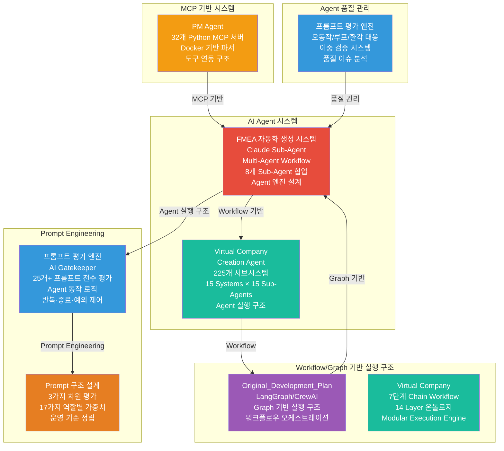
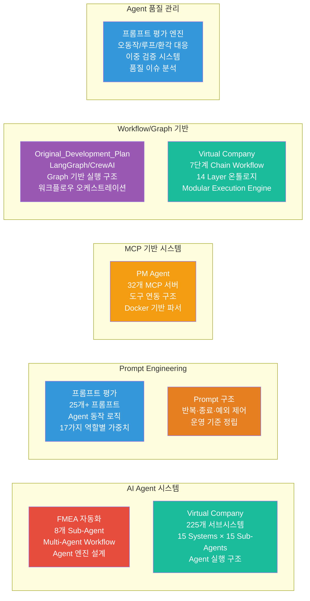
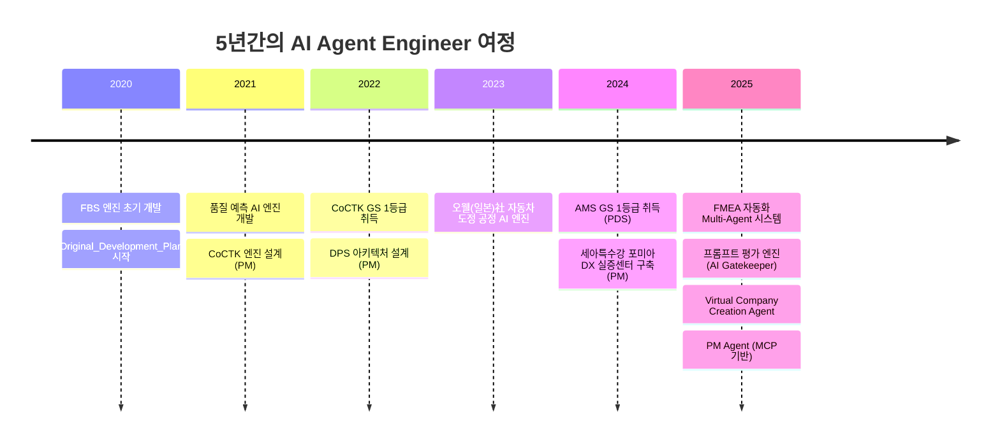
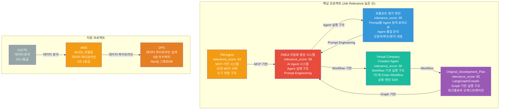
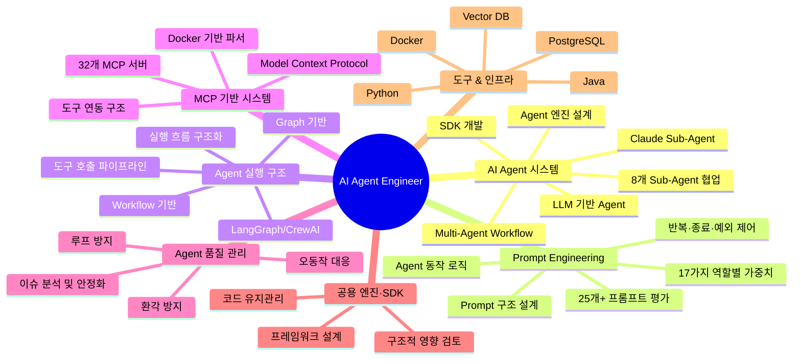

# 권순룡 포트폴리오

> **"모델보다 데이터, 데이터보다 정보, 지식구조를 정리하는 현장친화적 연구원"**

## 📌 기본 정보

**이름**: 권순룡  
**GitHub**: https://github.com/moobaek

---

## 📊 포트폴리오 구조 (한눈에 보기)

---

## 🎯 핵심 성과 대시보드

| 분류 | 지표 | 상세 |
|:---|---:|:---|
| **AI Agent 시스템** | 2개 프로젝트 | FMEA 자동화, Virtual Company Creation Agent |
| **Prompt Engineering** | 25개+ 프롬프트 | 프롬프트 평가 엔진, FMEA 자동화 |
| **MCP 기반 시스템** | 32개 MCP 서버 | PM Agent |
| **Workflow/Graph 기반 실행 구조** | 3개 프로젝트 | FMEA 자동화, Virtual Company Creation Agent, Original_Development_Plan |
| **Agent 품질 관리** | 1개 시스템 | 프롬프트 평가 엔진 (오동작/루프/환각 대응) |
| **공용 엔진·SDK·프레임워크** | 2개 프로젝트 | FMEA 자동화, Virtual Company Creation Agent |
| **정식 납품** | 2개 프로젝트 | AMS (세아특수강, 포미아), DPS (세아특수강, 포미아) |
| **학술 논문** | 10편 | KSFM, 한국유체기계학회 등 |
| **GS 인증** | 2개 1등급 | CoCTK, AMS/PDS |

---

## 📅 경력 타임라인 (2020-2025)

---

## 🏆 주요 프로젝트 (30개+)

### 프로젝트 관계도

### 1. FMEA 자동화 생성 시스템 (Claude Sub-Agent) - Master Orchestrator 설계

**기간**: 2025.6 ~ (진행중)  
**역할**: Master Orchestrator 설계 및 개발  
**relevance_score**: 98

**프로젝트 개요**:
AIAG & VDA FMEA 표준 기반 범용 리스크 분석 시스템으로, Claude Sub-Agent 기반 Multi-Agent Workflow를 구축하여 8개 독립 Sub-Agent가 협업하는 시스템을 설계했습니다. Master Orchestrator를 통해 Phase 0~5 자동화 워크플로우를 완전 구현했으며, 각 Sub-Agent는 R&D, Mfg, QA 등 전문 영역을 담당합니다.

**핵심 성과**:
- ✅ **AI Agent 시스템 개발**: Claude Sub-Agent 기반 Multi-Agent Workflow 구축, Claude Code Task tool 활용하여 8개 독립 Sub-Agent 협업 시스템 설계
- ✅ **Agent 실행 구조 개발 및 고도화**: Agent 실행 구조(Workflow/Tool/Prompt 흐름) 개발 및 고도화, Phase 0~5 자동화 워크플로우 완전 구현
- ✅ **Prompt 구조 설계 및 운영 기준 정립**: Prompt 구조 설계 및 운영 기준 정립, 반복·종료·예외 제어 포함한 구조화된 Prompt 시스템 구현
- ✅ **공용 엔진·SDK 설계**: Master Orchestrator를 공용 엔진 형태로 설계, 각 Sub-Agent가 재사용 가능한 구조로 개발
- ✅ **Workflow 기반 실행 구조**: Phase 0~5까지의 체계적인 워크플로우 자동화, 코딩 에이전트의 역설계 시스템 구조 적용
- ✅ **Agent 기능 확장 시 구조적 영향 검토**: Agent 기능 확장 시 구조적 영향을 검토하고 설계 방향을 제시하는 경험
- ✅ **논문 발표**: 2025.12 KSFM 학술대회 발표

**기술 스택**: Claude Sub-Agent, LLM API, Multi-Agent Workflow, Prompt Engineering, Workflow 기반 실행 구조

**한글과컴퓨터 요구사항 매칭**:
- ✅ **AI Agent 또는 LLM 기반 Agent 시스템에 대한 개발 경험**: 완벽 매칭
- ✅ **Agent 실행 흐름을 구조화하여 설계·구현할 수 있는 역량(반복·종료·예외 제어 포함)**: 완벽 매칭
- ✅ **Workflow 또는 Graph 기반 실행 구조에 대한 이해 또는 개발 경험**: 완벽 매칭 (한글과컴퓨터 우대사항)
- ✅ **공용 엔진·SDK·프레임워크 형태의 코드 설계 및 유지관리 경험**: 완벽 매칭 (한글과컴퓨터 우대사항)
- ✅ **AI Agent 관련 기술 또는 구조를 주도적으로 정리·개선한 경험**: 완벽 매칭 (한글과컴퓨터 우대사항)

### 2. 프롬프트 평가 엔진 (AI Gatekeeper) - AI Gatekeeper 설계

**기간**: 2025.6 ~ (진행중)  
**역할**: AI Gatekeeper 설계 및 개발  
**relevance_score**: 95

**프로젝트 개요**:
모든 AI 생성물의 '입구'를 통제하는 심사관 역할을 하는 프롬프트 평가 엔진입니다. 25개+ 프롬프트를 전수 평가하여 Prompt를 단순 텍스트가 아닌 Agent 동작 로직의 일부로 설계하고, Prompt 변경에 따른 Agent 동작 및 품질 변화를 분석·개선하는 시스템입니다.

**핵심 성과**:
- ✅ **Prompt를 Agent 동작 로직의 일부로 다루기**: Prompt를 단순 텍스트가 아닌 Agent 동작 로직의 일부로 설계, 17가지 역할별 동적 가중치 적용
- ✅ **Prompt 구조 설계 및 운영 기준 정립**: 3가지 핵심 차원(Quality, Consistency, Cost) 평가 체계, MLOps Priority Matrix 기반 가중치 시스템 구축
- ✅ **Agent 품질 이슈 분석 및 안정화**: AI가 생성한 프롬프트를 다른 AI가 평가하는 이중 검증(Double-Check) 시스템으로 오동작/루프/환각 방지
- ✅ **Prompt 변경에 따른 Agent 동작 및 품질 변화 분석·개선**: 25개+ 프롬프트를 전수 평가하여 Prompt 변경에 따른 Agent 동작 및 품질 변화를 분석·개선
- ✅ **운영 환경에서 이슈 분석 및 개선**: 모든 AI 생성물의 '입구'를 통제하는 심사관 역할, 병렬 처리 구조(4개 메트릭 동시 평가)로 효율성 향상

**기술 스택**: Claude Sub-Agent, LLM API, Prompt Engineering, 평가 프레임워크, Agent 품질 관리

**한글과컴퓨터 요구사항 매칭**:
- ✅ **Prompt를 단순 텍스트가 아닌 Agent 동작 로직의 일부로 다뤄본 경험**: 완벽 매칭
- ✅ **Prompt 구조 설계 및 운영 기준 정립(반복·종료·예외 제어 포함)**: 완벽 매칭
- ✅ **Agent 품질 이슈 분석 및 안정화(오동작/루프/환각 등 대응)**: 완벽 매칭
- ✅ **Prompt 변경에 따른 Agent 동작 및 품질 변화를 분석·개선한 경험**: 완벽 매칭 (한글과컴퓨터 우대사항)
- ✅ **운영 환경에서 이슈를 분석하고 개선으로 연결할 수 있는 문제 해결 역량**: 완벽 매칭

### 3. PM Agent (Business Management Sub-Agent) - MCP 서버 구축

**기간**: 2025.10 ~ (진행중)  
**역할**: MCP 기반 사업 관리 자동화 시스템 설계 및 개발  
**relevance_score**: 92

**프로젝트 개요**:
MCP (Model Context Protocol) 기반 기술 자산 관리 시스템으로, 32개 Python MCP 서버를 개발하여 비정형 문서(HWP, DOCX, XLSX)를 자동 파싱하는 Docker 기반 파서 서버를 구축했습니다. MCP Protocol을 통해 계약서/과업지시서 분석, 회의록 분석을 통한 타임라인 자동 현행화, 누락된 문서나 데이터 파편화 방지 등 사업 관리의 전체 라이프사이클을 관장합니다.

**핵심 성과**:
- ✅ **MCP 기반 시스템 개발**: MCP (Model Context Protocol) 기반 기술 자산 관리 시스템 구축
- ✅ **MCP 기반 도구 연동 구조 개발 및 확장**: 32개 Python MCP 서버 개발, Docker 기반 파서 서버 구축
- ✅ **외부 기능 연동(도구 호출) 기반의 실행 파이프라인 설계·구현**: 비정형 문서(HWP, DOCX, XLSX) 자동 파싱, 에이전트 간 통신을 통한 유기적 네트워크 구축
- ✅ **도구 호출 파이프라인**: 계약서/과업지시서 분석, 회의록 분석을 통한 타임라인 자동 현행화 등 도구 호출 기반 실행 파이프라인 구현

**기술 스택**: MCP (Model Context Protocol), Python, Claude Agent, Docker, HWP 파서

**한글과컴퓨터 요구사항 매칭**:
- ✅ **MCP(Model Context Protocol) 기반 시스템에 대한 이해 또는 개발·연동 경험**: 완벽 매칭 (한글과컴퓨터 우대사항)
- ✅ **MCP 기반 도구 연동 구조 이해 및 확장**: 완벽 매칭
- ✅ **외부 기능 연동(도구 호출) 기반의 실행 파이프라인을 설계·구현한 경험**: 완벽 매칭

### 4. Virtual Company Creation Agent - Workflow 기반 실행 구조 설계

**기간**: 2026.1.4 ~ (진행중)  
**역할**: 시스템 설계 및 개발  
**relevance_score**: 90

**프로젝트 개요**:
225개 서브시스템을 AI 에이전트로만 구성한 가상 기업 생성 시스템으로, 7단계 Chain Workflow (Chain 01~07)와 14 Layer 온톨로지 좌표 체계를 통해 복잡한 비즈니스 프로세스를 구조화했습니다. Decoupled Intelligence Architecture (지능과 상태의 분리)를 통해 공용 엔진 형태의 코드를 설계했으며, Modular Execution Engine을 통해 다양한 실행 모드를 지원하는 프레임워크를 구축했습니다.

**핵심 성과**:
- ✅ **Agent 실행 흐름 구조화**: 7단계 Chain Workflow (Chain 01~07), 14 Layer 온톨로지 좌표 체계를 통해 복잡한 비즈니스 프로세스를 구조화
- ✅ **Workflow 기반 실행 구조**: 15 Systems × 15 Sub-Agents = 225개 서브시스템 구조 설계, Modular Execution Engine (Full/Partial/Single/Resume 모드 지원)
- ✅ **공용 엔진·SDK·프레임워크 형태의 코드 설계**: Decoupled Intelligence Architecture (지능과 상태의 분리), Intelligence as a Service Serverless Agent Orchestration
- ✅ **Agent 기능 확장 시 구조적 영향 검토 및 설계 방향 제시**: 20개 이상 설계 문서 완료, 구조적 영향 검토 시스템 구축

**기술 스택**: Claude Agent, LLM API, Workflow 기반 실행 구조, Vector DB, RAG, Dual-Tier AI

**한글과컴퓨터 요구사항 매칭**:
- ✅ **Agent 실행 흐름을 구조화하여 설계·구현할 수 있는 역량**: 완벽 매칭
- ✅ **Workflow 또는 Graph 기반 실행 구조에 대한 이해 또는 개발 경험**: 완벽 매칭 (한글과컴퓨터 우대사항)
- ✅ **공용 엔진·SDK·프레임워크 형태의 코드 설계 및 유지관리 경험**: 완벽 매칭 (한글과컴퓨터 우대사항)
- ✅ **Agent 기능 확장 시 구조적 영향 검토 및 설계 방향 제시**: 완벽 매칭

### 5. Original_Development_Plan (Obsidian Design Origin) - LangGraph/CrewAI 워크플로우 오케스트레이션

**기간**: 2020~2025 (집중 개발: 2025.5~7, 2025.8~10, 2025.10~12)  
**역할**: 전체 에이전트 시스템 설계 (PM 활동에서 문서, 개발 진행 관리에 활용)  
**relevance_score**: 85

**프로젝트 개요**:
LangGraph/CrewAI 방식 워크플로우 오케스트레이션을 구현하고, 상태 기반 진행 모니터링 및 완료 조건 판단 시스템을 구축했습니다. 298개+ 설계 문서, 25개+ AI 프롬프트 체인, 21개 development 프롬프트(수정 관리 시스템 포함)를 통해 체계적인 개발 워크플로우를 구축했습니다.

**핵심 성과**:
- ✅ **Agent 실행 흐름 구조화**: LangGraph/CrewAI 방식 워크플로우 오케스트레이션, 상태 기반 진행 모니터링 및 완료 조건 판단 시스템
- ✅ **Workflow 또는 Graph 기반 실행 구조**: 298개+ 설계 문서, 25개+ AI 프롬프트 체인, 21개 development 프롬프트(수정 관리 시스템 포함)
- ✅ **Agent 품질 관리**: 개발 에이전트 실시간 평가 시스템, 워크플로우 상태 모니터링 및 자동 복귀 로직, 품질 관리 오케스트레이션

**기술 스택**: LangGraph, CrewAI, Workflow 기반 실행 구조, 워크플로우 상태 모니터링

**한글과컴퓨터 요구사항 매칭**:
- ✅ **Agent 실행 흐름을 구조화하여 설계·구현할 수 있는 역량**: 완벽 매칭
- ✅ **Workflow 또는 Graph 기반 실행 구조에 대한 이해 또는 개발 경험**: 완벽 매칭 (한글과컴퓨터 우대사항)

---

## 💻 기술 스택 맵

---

## 📚 학술 성과 (10편)

| 발행일 | 논문 제목 | 학술지/학회 | 핵심 성과 및 프로젝트 연계 |
|:---|:---|:---|:---|
| 2025.12 | **분석 상관/확률 네트워크 최적 경로 정보 및 공정 관리 문서 기반 FMEA 생성 연구** | KSFM 2025년도 동계학술대회 | [FMEA 자동화/복합센서/AMS] 상관/확률 네트워크 최적 경로 분석 기반 FMEA 자동 생성 기술 검증, AMS 결과 표시 LLM agent (GPT OSS) 개발 및 포미아 납품 적용 |
| 2025.06 | **AI를 활용한 구조와 룰을 활용한 구조-확률 종합 네트워크 및 최적 관리 방안 도출** | 한국유체기계학회 | [AMS] 피쉬본 AI 모델의 학술적 고도화 및 최적 관리 로직 증명 |
| 2024.12 | **공장 운영 핵심 요소의 식별 및 최적화를 위한 클러스터링 기법 적용** | 한국생산제조학회 | [DPS] 공장 운영 데이터의 다차원 분석 및 디지털 트윈 최적화 근거 |
| 2024.12 | **설비 이상상태 기반 최적 공정 데이터 추론 및 위험/안전 관리 최적 자동화** | 한국유체기계학회 | [AMS] 실시간 이상 상태 기반 위험 관리 알고리즘의 유효성 검증 |
| 2024.07 | **전력 데이터를 통한 설비 상태 추론 및 이상 상황 설정 예측** | 한국유체기계학회 | [에너지/센서] 전력 데이터 기반의 설비 예지 보전 기술 실증 |
| 2023.12 | **송풍 설비 변동부하 대응 전력품질 분석 및 에너지 절감 연구** | 한국유체기계학회 | [에너지 최적화] 에너지 20% 절감 실증 솔루션의 핵심 물리 분석 모델 |
| 2023.12 | **압축기 공정에서 데이터 밸런스 문제 해결 및 품질 결과 사전 예측을 위한 AI 시스템** | 한국유체기계학회 | [AI/데이터] 소량의 불량 데이터 극복을 위한 AI 학습 모델 연구 |
| 2023.07 | **생산공정 에너지 및 설비 상태 진단을 위한 AI기반의 전력 사용 패턴 및 SOH분석** | 한국유체기계학회 | [에너지/전력] 설비 건전성(SOH) 진단 및 에너지 효율화 융합 기술 |
| 2022.12 | **자동차 부품 생산 산업을 위한 머신러닝 기반의 품질예측 알고리즘** | 한국생산제조학회 | [AI/제조] 세아베스틸 등 자동차 부품 공정 품질 예측 모델의 기초 |
| 2022.06 | **ICT 융복합 기술을 활용한 스마트 공장 및 에너지 절감 솔루션 적용 사례** | 한국유체기계학회 | [Global DX] 일본 도료기업 등 글로벌 스마트 공장 구축 사례의 실증 |

---

## 🤖 LLM 활용 방법

### AI Agent 시스템

**FMEA 자동화 생성 시스템**에서는 Claude Sub-Agent 기반 Multi-Agent Workflow를 구축하여 8개 독립 Sub-Agent가 협업하는 시스템을 설계했습니다. Master Orchestrator를 통해 Phase 0~5 자동화 워크플로우를 완전 구현했으며, 각 Sub-Agent는 R&D, Mfg, QA 등 전문 영역을 담당합니다. Agent 실행 구조(Workflow/Tool/Prompt 흐름)를 개발·고도화하여 복잡한 FMEA 프로세스를 구조화했습니다.

**Virtual Company Creation Agent**에서는 225개 서브시스템을 AI 에이전트로만 구성한 가상 기업 생성 시스템을 설계했습니다. 7단계 Chain Workflow와 14 Layer 온톨로지 좌표 체계를 통해 복잡한 비즈니스 프로세스를 구조화했으며, Decoupled Intelligence Architecture (지능과 상태의 분리)를 통해 공용 엔진 형태의 코드를 설계했습니다.

### Prompt Engineering

**프롬프트 평가 엔진**에서는 Prompt를 단순 텍스트가 아닌 Agent 동작 로직의 일부로 설계했습니다. 17가지 역할별 동적 가중치를 적용하여 다양한 사용자 시나리오에 맞는 Prompt 구조를 설계했으며, 반복·종료·예외 제어를 포함한 구조화된 Prompt 시스템을 구현했습니다. 3가지 핵심 차원(Quality, Consistency, Cost) 평가 체계와 MLOps Priority Matrix 기반 가중치 시스템을 통해 Prompt 변경에 따른 Agent 동작 및 품질 변화를 분석·개선합니다.

**FMEA 자동화 생성 시스템**에서는 Prompt 구조 설계 및 운영 기준을 정립했습니다. AIAG & VDA FMEA 표준 기반 범용 리스크 분석 시스템에서 Prompt를 통해 복잡한 워크플로우를 구조화하고, 각 Sub-Agent의 역할과 책임을 명확히 정의했습니다. 반복·종료·예외 제어를 포함한 구조화된 Prompt 시스템을 구현하여 Agent 실행 흐름을 구조화했습니다.

### MCP (Model Context Protocol)

**PM Agent**에서는 MCP 기반 사업 관리 자동화 시스템을 구축했습니다. 32개 Python MCP 서버를 개발하여 비정형 문서(HWP, DOCX, XLSX)를 자동 파싱하는 Docker 기반 파서 서버를 구축했습니다. MCP Protocol을 통해 계약서/과업지시서 분석, 회의록 분석을 통한 타임라인 자동 현행화, 누락된 문서나 데이터 파편화 방지 등 사업 관리의 전체 라이프사이클을 관장합니다. MCP 기반 도구 연동 구조를 이해하고 확장하여 에이전트 간 통신을 통해 유기적 네트워크를 구축했습니다.

### Workflow 또는 Graph 기반 실행 구조

**FMEA 자동화 생성 시스템**에서는 Phase 0~5까지의 체계적인 워크플로우 자동화를 통해 Workflow 기반 실행 구조를 구현했습니다. 각 Phase는 독립적인 Sub-Agent가 담당하며, Master Orchestrator가 전체 워크플로우를 관리합니다.

**Virtual Company Creation Agent**에서는 7단계 Chain Workflow (Chain 01~07)를 통해 복잡한 비즈니스 프로세스를 구조화했습니다. 14 Layer 온톨로지 좌표 체계를 통해 Graph 기반 실행 구조를 구현했으며, Modular Execution Engine을 통해 Full/Partial/Single/Resume 모드를 지원하여 유연한 워크플로우 실행을 가능하게 했습니다.

**Original_Development_Plan**에서는 LangGraph/CrewAI 방식 워크플로우 오케스트레이션을 구현했습니다. 상태 기반 진행 모니터링 및 완료 조건 판단 시스템을 구축하여 Graph 기반 실행 구조를 구현했습니다.

### Agent 품질 이슈 분석 및 안정화

**프롬프트 평가 엔진**에서는 Agent 품질 이슈를 분석하고 안정화하는 시스템을 구축했습니다. AI가 생성한 프롬프트를 다른 AI가 평가하는 이중 검증(Double-Check) 시스템으로 오동작/루프/환각 방지 메커니즘을 구현했습니다. 3가지 핵심 차원(Quality, Consistency, Cost) 평가 체계를 통해 Prompt 변경에 따른 Agent 동작 및 품질 변화를 분석·개선합니다. 운영 환경에서 이슈를 분석하고 개선으로 연결할 수 있는 문제 해결 역량을 보유하고 있습니다.

---

## 🔗 관련 링크

### GitHub

- **메인 레포지토리**: https://github.com/moobaek/Testing_AI_agents_for_public_use
- **포트폴리오 문서**: https://github.com/moobaek/Testing_AI_agents_for_public_use/tree/main/portfolio/portfolio_docs
- **GitHub 프로필**: https://github.com/moobaek

---

© 2026 권순룡. All Rights Reserved.
