# 권순룡 포트폴리오 - 현대오토에버 AI Agent 엔지니어

> **"AI Agent를 설계하고 개발하는 AI Agent Engineer"**  
> **"모델보다 데이터, 데이터보다 정보, 지식구조를 정리하는 현장친화적 연구원"**

---

## 📌 기본 정보

**이름**: 권순룡  
**소속**: 한솔코에버 연구소 대리 (2020.09 ~ 재직중)  
**총 경력**: 5년 5개월 (2020.09~2026.01)  
**핵심 역량**: Multi-Agent System 설계, LLM Agent 개발, 프롬프트 엔지니어링, LangGraph/CrewAI 오케스트레이션, RAG 시스템, MCP (Model Context Protocol), State-based Workflow, Evaluation Framework, Few-shot Rules System, AI Agent 아키텍처 설계  
**GitHub**: https://github.com/moobaek  
**이메일**: m920831@naver.com  
**연락처**: 010-5671-6200

---

## 📊 전체 프로젝트 타임라인 (2020-2026) - 47개 프로젝트

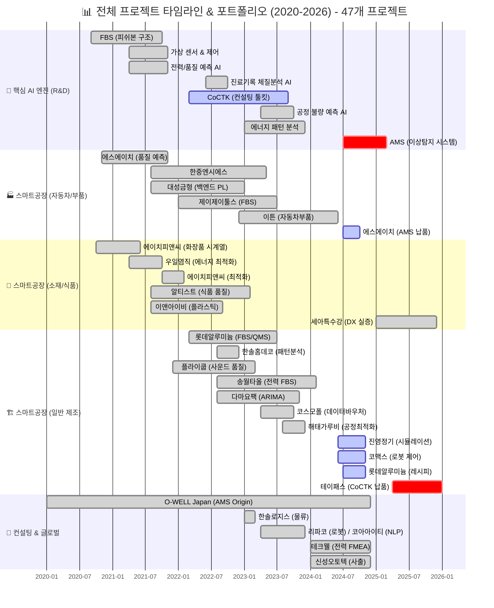

> [!INFO] **총 프로젝트 현황**
> - **AI & Analytics**: 7개 (AMS, CoCTK, FBS 등)
> - **스마트공장 구축**: 23개 (에스에이치아이엔티, 롯데알루미늄 등)
> - **컨설팅**: 8개 (테크웰, 신성오토텍 등)
> - **AI 에이전트**: 9개 (FMEA, PM Agent 등)

---

## 📊 포트폴리오 구조 (한눈에 보기)

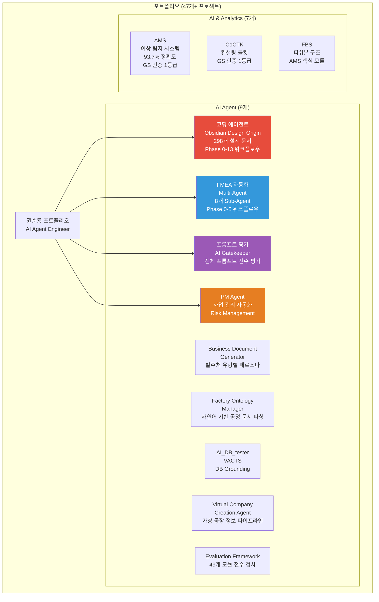

---

## 🎯 핵심 AI Agent Engineer 성과 대시보드

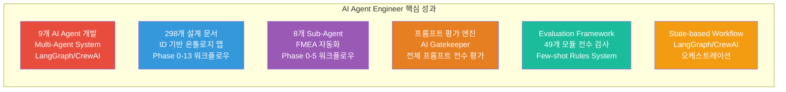

| 분류 | 지표 | 상세 |
|:---|---:|:---|
| **AI Agent 개발** | 9개 AI Agent | 코딩 에이전트, FMEA 자동화, 프롬프트 평가, PM Agent 등 |
| **Multi-Agent System** | 8개 Sub-Agent | FMEA 자동화 Multi-Agent 시스템 |
| **워크플로우 오케스트레이션** | Phase 0-13, Phase 0-5 | LangGraph/CrewAI 기반 State-based Workflow |
| **프롬프트 엔지니어링** | 프롬프트 평가 엔진 | AI Gatekeeper 역할, 전체 프롬프트 전수 평가 |
| **Evaluation Framework** | 49개 모듈 전수 검사 | Few-shot Rules System, 4단계 Testing Workflow |
| **문서 관리 시스템** | 298개 설계 문서 | ID 기반 온톨로지 맵, 의존성 관리 |

---

## 📅 경력 타임라인 (2020-2026)

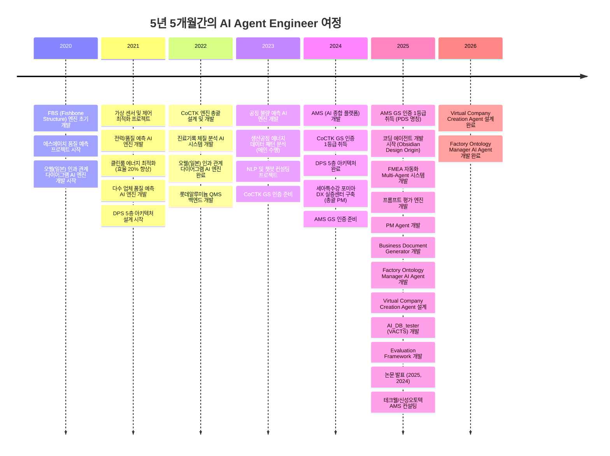

---

## 🔗 AI Agent 프로젝트 계보와 스토리 (AI Agent 진화의 연결)

> [!NOTE] 스토리텔링 접근
> 각 AI Agent는 실제 프로젝트에서 겪은 문제를 해결하기 위해 탄생했습니다. 기술적 성과뿐만 아니라 **왜 만들어졌는지, 어떻게 진화했는지**의 스토리가 담겨 있습니다.

### AI Agent 진화 관계도 (전체)

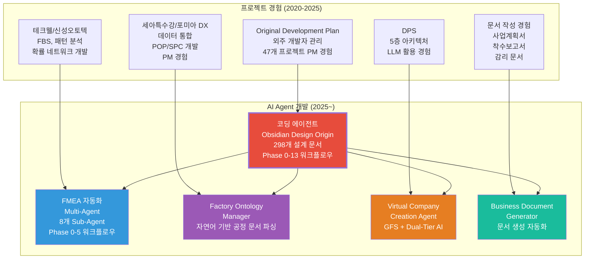

### 1. 코딩 에이전트 → 전체 AI Agent 시스템으로 이어진 개발 자동화 라인

- **Original Development Plan (코딩 에이전트)**:  
  - 2025년 5월부터 시작된 코딩 에이전트는, 외주 개발자 산출물 관리 부재, 시간 부족, 본인의 한계(백엔드만 가능)를 해결하기 위해 개발되었습니다.  
  - 이 단계에서 "ID 기반 온톨로지 맵", "Phase 0-13 워크플로우", "LangGraph/CrewAI 오케스트레이션"이 정리되었습니다.

- **다른 AI Agent들로의 확장**:  
  - 코딩 에이전트의 역설계 시스템 구조를 FMEA 분석에 적용하여 FMEA 자동화 에이전트 개발
  - 외주 관리 경험을 사업 관리 자동화에 적용하여 PM Agent 개발
  - 문서 작성 경험을 문서 생성 자동화에 적용하여 Business Document Generator 개발
  - 온톨로지 공장 agent 경험을 자연어 기반 공정 문서 파싱에 적용하여 Factory Ontology Manager 개발
  - 모듈화·체계화 경험을 전수 검사 시스템에 적용하여 Evaluation Framework 개발
  - 품질 관리 경험을 프롬프트 품질 보장에 적용하여 프롬프트 평가 엔진 개발

이 라인은 "실제 프로젝트 문제 → 코딩 에이전트 개발 → 전체 AI Agent 시스템"으로 이어지는 계보이며, AI Agent Engineer에서의 Multi-Agent System 설계, 워크플로우 오케스트레이션, 프롬프트 엔지니어링에 그대로 대응됩니다.

### 2. FMEA 자동화 에이전트 → 현장 친화적 기술 변환 라인

- **테크웰/신성오토텍 AMS 컨설팅**:  
  - FBS, 패턴 분석, 확률 네트워크가 기술적으로는 완벽했지만 공장 관리자들이 이해하지 못하는 문제 발견
  - 피쉬본 설명과 그림이 너무 난해해서 일본 관계자조차 이해 못할 정도
  - 패턴 추천(첨도, p-values, 44개 패턴)과 확률 네트워크도 공장 관리자 입장에서 너무 어려움

- **FMEA 자동화 에이전트**:  
  - 코딩 에이전트의 역설계 시스템 구조를 FMEA 분석에 적용하여 복잡한 FMEA 프로세스를 8개 Sub-Agent로 분해
  - 공장 관리자가 아는 FMEA 형식으로 변환하고, 도메인별 용어를 자동으로 조정하는 시스템 개발
  - Phase 0~5 자동화 워크플로우 완전 구현

이 라인은 "기술과 현장의 언어 불일치 → FMEA 형식 변환 → 도메인별 용어 자동 조정"으로 이어지는 계보이며, AI Agent Engineer에서의 현장 친화적 기술 철학과 도메인별 맞춤화 능력에 그대로 대응됩니다.

### 3. Factory Ontology Manager → 5년간의 비전과 현실의 만남 라인

- **전무님의 비전 (2020년부터)**: 공정 라인을 공장 사람들이 쉽게 수정하는 것
- **김이사님의 니즈 (2025년)**: OEM ODM 대응이 필요하다, 자동 툴이 필요하다

- **세아특수강 프로젝트에서의 발견**:  
  - 세아특수강 프로젝트에서 **Cursor(AI agent)를 활용**하여 성공하였습니다.
  - "아 이거 되는구나" 하고 진행

- **Factory Ontology Manager AI Agent**:  
  - 자연어 기반 공정 문서 파싱, DB Grounding, Ontology Mapping 구현
  - 공장에 대한 기본적인 관계를 먼저 설정하고, 고객이 각각 위 업체(발주처 등등) 문서를 받으면 자동으로 연결되는 시스템 개발

이 라인은 "5년간의 비전 → 현실적 니즈 → AI Agent 활용 → 실제 구현 가능 확인"으로 이어지는 계보이며, AI Agent Engineer에서의 비전과 현실을 연결하는 능력과 AI Agent 활용 경험에 그대로 대응됩니다.

### 4. Virtual Company Creation Agent & AI_DB_tester (VACTS) → LLM을 서포트하기 위한 특화 중간 DB 라인

- **LLM의 한계 인식**:  
  - LLM 활용하다보니 온톨로지도 잘 못알아먹고 벡터도 부족하다는 것을 깨달음
  - AI가 그때그때 추론하면 리소스도 많이 먹고 계속 변동되고 문제가 생겨도 왜인지 추적이 안됨

- **Virtual Company Creation Agent & AI_DB_tester (VACTS)**:  
  - "어차피 AI LLM은 앞뒤 주는 것만 잘하면 되니까" 특화 중간 DB(GFS - Grape File System) 개발
  - Dual-Tier AI 아키텍처로 High-Spec AI와 Low-Spec AI 분리하여 최대 87% 비용 절감
  - 기업 풀 수준의 방대한 정보 제공으로 문제 추적 가능성 확보

이 라인은 "LLM의 한계 인식 → 특화 중간 DB 개발 → 비용 절감 및 문제 추적 가능"으로 이어지는 계보이며, AI Agent Engineer에서의 LLM 최적화 능력과 비용 효율적 아키텍처 설계에 그대로 대응됩니다.

### 5. Business Document Generator → 사업계획서를 하도 만들다 보니 만든 자동화 시스템 라인

- **문서 작성 경험 축적**:  
  - 2023년부터 한솔코에버 AI 쪽 사업계획은 사용자의 손을 안 거친 게 없을 정도로 많은 사업계획서, 제안서, 착수보고서를 작성
  - 사업계획서, 제안서, 착수보고서, 감리 문서 등 다수 문서 작성 경험

- **Business Document Generator**:  
  - 요구조건 문서 파싱, 포트폴리오 스마트 매칭, 발주처 유형별 페르소나 적용으로 문서 작성 시간 70% 절감
  - 이력 포폴 자동으로 쓰고 사업계획서, 제안서, 착수보고서 자동으로 쓰는 시스템 완성

이 라인은 "반복적인 문서 작성 → 자동화 시스템 개발 → 문서 작성 시간 절감"으로 이어지는 계보이며, AI Agent Engineer에서의 반복 작업 자동화 능력과 문서 생성 시스템 설계에 그대로 대응됩니다.

---

## 🏆 주요 AI Agent 개발 프로젝트 (relevance_score 순)

### AI Agent 진화 관계도

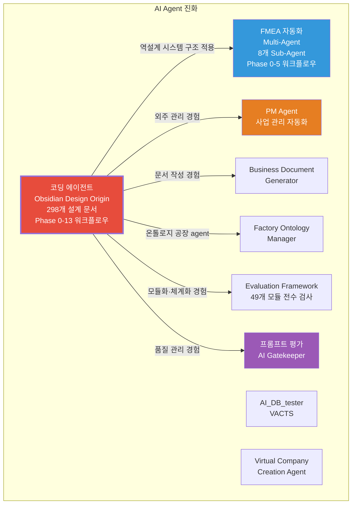

### 1. 코딩 에이전트 (Obsidian Design Origin) - AI Agent 개발의 시작

**기간**: 2025.05 ~ 진행중  
**발주처**: 내부 개발  
**역할**: 코딩 에이전트 설계 및 개발  
**relevance_score**: 98점 (핵심 프로젝트)

**AI Agent 개발 핵심**:
- ✅ **ID 기반 온톨로지 맵 문서 시스템**: 모든 요소에 고유 ID 부여로 문서 간 관계 추적, 의존성 관리
- ✅ **Phase 0-13 워크플로우 자동화**: 설계부터 개발까지 전체 라이프사이클 자동화
- ✅ **LangGraph/CrewAI 방식 워크플로우 오케스트레이션**: State 기반 정보 전달, 상태 기반 진행 모니터링 및 완료 조건 판단 시스템
- ✅ **298개+ 설계 문서 체계화**: ID 시스템 기반 문서 관리로 외주 개발자 산출물 관리 자동화
- ✅ **21개 development 프롬프트**: 개발 단계의 정교한 관리, 연속 개발 지원, 문서 업데이트 자동 체크
- ✅ **28개 Few-shot Rules System**: 8개 도메인(design/api/database/component/state/security/performance/testing)에 대한 규칙 기반 코드 품질 자동 검증
- ✅ **4단계 Testing Workflow**: Mock Setup → Unit → Integration → E2E 자동화

**기술 스택**: Python, LangGraph, CrewAI, State-based Workflow, MCP, RAG, Few-shot Rules System

**AI Agent 개발 상세 설명**:
코딩 에이전트는 외주 개발자 관리의 한계를 해결하기 위해 개발된 AI Agent입니다. 47개 프로젝트를 수행하면서 겪은 실제 문제(외주 개발자 산출물 관리 부재, 시간 부족, 본인의 한계)를 해결하기 위해 개발했습니다.

**ID 기반 온톨로지 맵 문서 시스템**: 모든 요소에 고유 ID를 부여하여 문서 간 관계를 추적하고 의존성을 관리합니다. 이 시스템을 통해 외주 개발자의 산출물을 자동으로 추적하고 검증할 수 있습니다.

**Phase 0-13 워크플로우 자동화**: 설계부터 개발까지 전체 라이프사이클을 자동화했습니다. Phase 0부터 Phase 13까지 각 단계별로 명확한 완료 조건과 검증 기준을 설정하여 자동화했습니다.

**LangGraph/CrewAI 방식 워크플로우 오케스트레이션**: State 기반 정보 전달로 컨텍스트를 최적화하고, 워크플로우 상태를 모니터링하며 자동 복귀 로직을 구현했습니다. Python 스크립트 없이 Claude Code 세션 자체가 Orchestrator 역할을 담당합니다.

**298개+ 설계 문서 체계화**: ID 시스템 기반 문서 관리로 외주 개발자 산출물을 자동으로 추적하고 검증합니다. 문서 간 의존성을 자동으로 파악하여 변경 사항을 추적합니다.

**21개 development 프롬프트**: 개발 단계의 정교한 관리를 위해 21개의 development 프롬프트를 개발했습니다. 연속 개발을 지원하고 문서 업데이트를 자동으로 체크합니다.

**28개 Few-shot Rules System**: 8개 도메인(design/api/database/component/state/security/performance/testing)에 대한 규칙 기반 코드 품질 자동 검증 시스템을 개발했습니다. Mock 기반 테스트 자동화 워크플로우를 구현했습니다.

**4단계 Testing Workflow**: Mock Setup → Unit → Integration → E2E 자동화 워크플로우를 구현했습니다. 각 단계별로 명확한 검증 기준을 설정하여 자동화했습니다.

**결과**: 말도 안 되는 시간에 말도 안 되는 개발 개수, 높은 난이도에도 불구하고 납품 프로젝트를 성공적으로 완료했습니다. 외주 개발자 관리 시간을 80% 이상 절감했으며, 문서 일관성을 100% 보장했습니다.

---

### 2. FMEA 자동화 생성 시스템 (Multi-Agent) - Master Orchestrator 설계

**기간**: 2025.06 ~ 진행중  
**발주처**: 내부 개발  
**역할**: Master Orchestrator 설계 및 Multi-Agent Workflow 구현  
**relevance_score**: 98점 (핵심 프로젝트)  
**관련 논문**: 📄 **2025.12**: 분석 상관/확률 네트워크 최적 경로 정보 및 공정 관리 문서 기반 FMEA 생성 연구 (KSFM 2025년도 동계학술대회)

**AI Agent 개발 핵심**:
- ✅ **Multi-Agent Workflow 설계**: Claude Sub-Agent 기반 8개 독립 Sub-Agent 협업 구조 구현
- ✅ **코딩 에이전트 역설계 시스템 구조 적용**: AIAG & VDA FMEA 표준 기반 범용 리스크 분석 시스템 개발
- ✅ **Phase 0~5 자동화 워크플로우**: FMEA 생성 프로세스 전 과정 자동화
- ✅ **도메인별 용어 자동 조정**: 제조업/사무업무/서비스업 등 도메인에 맞게 용어 자동 변환
- ✅ **논문 발표**: 2025년 논문 발표

**기술 스택**: Python, Claude Agent, Multi-Agent System, MCP, RAG, LangGraph, CrewAI

**AI Agent 개발 상세 설명**:
FMEA 자동화 시스템은 제조 현장의 리스크 분석을 자동화하는 Multi-Agent 시스템입니다. 코딩 에이전트의 역설계 시스템 구조를 FMEA 분석에 적용하여 복잡한 FMEA 프로세스를 8개 Sub-Agent로 분해했습니다.

**Multi-Agent Workflow 설계**: Claude Sub-Agent 기반으로 8개의 독립 Sub-Agent(R&D Team 3개, Manufacturing Team 3개, QA Team 2개)가 협업하는 구조를 설계했습니다. 각 Sub-Agent는 전문 영역을 담당하며, Master Orchestrator가 전체 워크플로우를 조율합니다.

**Master Orchestrator**: Python 스크립트 없이 Claude Code 세션 자체가 Orchestrator 역할을 담당합니다. 프롬프트 기반 완전 자동화로 개발 복잡성을 감소시켰으며, Task tool 기반 구현으로 유연한 워크플로우 조정이 가능합니다.

**Phase 0~5 자동화 워크플로우**: FMEA 생성 프로세스 전 과정을 자동화했습니다. Phase 0에서는 시스템 정의 및 범위 설정을 수행하고, Phase 1에서는 구조 분석을 수행합니다. Phase 2에서는 기능 분석을 수행하고, Phase 3에서는 실패 분석을 수행합니다. Phase 4에서는 리스크 분석을 수행하고, Phase 5에서는 최적화 조치를 수행합니다.

**도메인별 용어 자동 조정**: 제조업/사무업무/서비스업 등 도메인에 맞게 용어를 자동으로 변환합니다. 관련 용어 수정을 해당 도메인에 맞게 자동으로 수정하게 함으로써 현장 관리자가 이해하기 쉬운 언어로 변환합니다.

**FBS → FMEA 변환**: 난해한 피쉬본 다이어그램을 FMEA 테이블 형식으로 자동 변환합니다. 패턴 분석 결과를 FMEA 항목으로 변환하고, 확률 네트워크의 최적 경로를 FMEA의 Failure Mode와 Effect로 매핑합니다.

**결과**: 기술적으로 복잡한 FBS, 패턴 분석, 확률 네트워크를 공장 관리자가 아는 FMEA 형식으로 성공적으로 변환했습니다. 테크웰/신성오토텍 컨설팅에서 고객 공정 관리 문서와 통합한 FMEA 문서를 생성하는 데 성공했습니다.

---

### 3. 프롬프트 평가 엔진 (Claude Sub-Agent) - AI Gatekeeper

**기간**: 2025.06 ~ 진행중  
**발주처**: 내부 개발  
**역할**: 프롬프트 평가 엔진 설계 및 개발  
**relevance_score**: 95점 (핵심 프로젝트)

**AI Agent 개발 핵심**:
- ✅ **AI Gatekeeper 역할**: 모든 AI 생성물의 '입구'를 통제하는 심사관, **전체 프롬프트를 전수 평가**하는 완전 자동화 시스템
- ✅ **프롬프트 저지 시스템 설계**: AI가 생성한 프롬프트를 다른 AI가 평가하는 이중 검증(Double-Check) 시스템
- ✅ **25개+ 프롬프트 품질 보장**: 구조화된 평가 프레임워크로 일관성 유지
- ✅ **3가지 핵심 차원 평가**: Quality (Correctness, Faithfulness, Relevance, Helpfulness, Tone, Safety), Consistency (Reproducibility, Stability), Cost (Token usage, Latency, Throughput)
- ✅ **MLOps Priority Matrix**: 실패 영향 기반 가중치 (Structural 40%, Correctness 30%, Relevancy 20%, Tone 10%)
- ✅ **17가지 역할별 동적 가중치 시스템**: Chain, Summary, Document, Developer, Analysis, Conversational, Transformation, Extraction, Classification, Validation, RAG, Creative, Educational, Review, Debugging, Translation 등 역할별 최적화된 평가
- ✅ **병렬 처리 구조**: 4개 메트릭(Structural, Correctness, Relevancy, Coherence)을 병렬로 평가하여 효율성 극대화
- ✅ **5단계 평가 프로세스**: Role Inference → Metrics Parallel (4개 병렬) → Consolidation (평가자/개선방향) → Report Generation → Translation
- ✅ **Human-in-the-Loop**: 8단계 필수 검증 프로세스 (Asset Check → Input Scanning → File Selection → Task Selection → Role Confirmation → API Selection → Save Path → Final Start)
- ✅ **컨텍스트 압축 전략**: 평가 후 즉시 요약하여 토큰 효율성 확보
- ✅ **배치 처리 지원**: 여러 프롬프트 일괄 평가 및 종합 리포트 생성

**기술 스택**: Python, LLM, 프롬프트 엔지니어링, Few-shot Rules System, Claude Agent, Multi-Agent System

**AI Agent 개발 상세 설명**:
프롬프트 평가 엔진은 AI Agent의 품질을 보장하기 위한 AI Gatekeeper 역할을 담당합니다. 코딩 에이전트의 품질 관리 경험을 바탕으로 개발되었습니다.

**AI Gatekeeper 역할**: 전체 프롬프트를 전수 평가하여 AI Agent의 품질을 보장합니다. 프롬프트의 일관성, 명확성, 완전성을 검증하며, 생성 AI와 평가 AI의 분리로 환각(Hallucination)을 방지합니다.

**3가지 핵심 차원 평가**: Quality (Correctness, Faithfulness, Relevance, Helpfulness, Tone, Safety), Consistency (Reproducibility, Stability across versions/models), Cost (Token usage, Latency, Throughput)를 종합적으로 평가합니다.

**MLOps Priority Matrix**: 실패 영향 기반 가중치를 적용하여 Structural Adherence (40%)를 최우선으로 평가하고, Answer Correctness (30%), Contextual Relevancy (20%), Coherence/Tone/Safety (10%)를 순차적으로 평가합니다.

**17가지 역할별 동적 가중치 시스템**: 각 역할(Chain, Summary, Document, Developer, Analysis, Conversational, Transformation, Extraction, Classification, Validation, RAG, Creative, Educational, Review, Debugging, Translation 등)에 맞는 최적화된 가중치를 자동으로 적용합니다.

**병렬 처리 구조**: 4개 메트릭(Structural, Correctness, Relevancy, Coherence)을 병렬로 평가하여 효율성을 극대화하고, 각 평가 후 즉시 요약하여 컨텍스트를 압축합니다.

**5단계 평가 프로세스**: 
1. **Phase 1: Role Inference** - 역할 추론 (폴더명, 파일명, 내용 기반 가중치 점수)
2. **Phase 2: Metrics Parallel** - 4개 메트릭 병렬 평가
3. **Phase 3: Consolidation** - 평가자 역할(점수 계산) + 개선방향 역할(권장사항)
4. **Phase 4: Report Generation** - 구조화된 JSON 리포트 생성
5. **Phase 5: Translation** - 한국어 번역 (모든 사용자 소통은 한국어)

**Human-in-the-Loop**: 8단계 필수 검증 프로세스를 통해 사용자 개입을 최소화하면서도 중요한 의사결정 지점에서 사용자 확인을 받습니다.

**비즈니스 가치**:
- 프롬프트 품질 일관성 **100% 보장**
- 평가 시간 **70% 이상 절감** (병렬 처리)
- 토큰 효율성 **50% 이상 향상** (컨텍스트 압축)

---

### 4. PM Agent (Business Management Sub-Agent) - 사업 관리 자동화

**기간**: 2025.10 ~ 진행중  
**발주처**: 내부 개발  
**역할**: PM Agent 설계 및 개발  
**relevance_score**: 92점 (핵심 프로젝트)

**AI Agent 개발 핵심**:
- ✅ **Execution Manager & Governance**: 사업 관리의 '전체 라이프사이클'을 관장
- ✅ **Risk Management**: 계약서/과업지시서 내 독소 조항 자동 추출 및 리스크 평가
- ✅ **Schedule Tracking**: 회의록 분석을 통한 타임라인 자동 현행화
- ✅ **Integrity Check**: 누락된 문서나 데이터 파편화를 방지하는 무결성 검증
- ✅ **외주 관리 경험 반영**: 코딩 에이전트의 외주 관리 경험을 사업 관리 자동화에 적용
- ✅ **프로젝트 라이프사이클 관리**: 프로젝트 전 과정 자동화

**기술 스택**: Python, LLM, Multi-Agent System, State-based Workflow, MCP (Model Context Protocol), Docker, Claude Agent, HWP 파서

**AI Agent 개발 상세 설명**:
PM Agent는 사업 관리를 자동화하는 AI Agent입니다. 코딩 에이전트의 외주 관리 경험과 다수 PM 경험(제안서 작성, 외주 관리, 완료서 작성, 포미아 DX 등)을 바탕으로 개발되었습니다.

**Execution Manager & Governance**: 사업 관리의 '전체 라이프사이클'을 관장하는 거버넌스 에이전트로, 단순 기능 구현을 넘어 전체 시스템의 품질, 표준 준수, 리스크를 관리합니다.

**Risk Management**: 계약서/과업지시서 내 독소 조항을 자동으로 추출하고 리스크를 평가합니다. 프로젝트의 리스크를 자동으로 식별하고 추적하여 사전에 대응할 수 있도록 합니다.

**Schedule Tracking**: 회의록 분석을 통한 타임라인을 자동으로 현행화합니다. 프로젝트 일정을 자동으로 추적하고 관리하여 일정 지연을 방지합니다.

**Integrity Check**: 누락된 문서나 데이터 파편화를 방지하는 무결성 검증을 수행합니다. 프로젝트의 산출물을 자동으로 추적하고 검증하여 무결성을 보장합니다.

**외주 관리 경험 반영**: 47개 프로젝트에서 축적된 외주 관리 경험을 사업 관리 자동화에 적용했습니다. 외주 개발자 관리의 어려움을 해결하기 위한 자동화 시스템을 개발했습니다.

**프로젝트 라이프사이클 관리**: 프로젝트 전 과정을 자동화하여 관리 효율을 향상시켰습니다. 프로젝트의 시작부터 완료까지 전 과정을 자동으로 추적하고 관리합니다.

**비즈니스 가치**:
- 리스크 식별 시간 **80% 이상 절감**
- 일정 관리 효율 **70% 이상 향상**
- 문서 무결성 **100% 보장**

---

### 5. Business Document Generator - 문서 생성 자동화

**기간**: 2025.12 ~ 진행중  
**발주처**: 내부 개발  
**역할**: Business Document Generator 설계 및 개발  
**relevance_score**: 90점 (핵심 프로젝트)

**AI Agent 개발 핵심**:
- ✅ **사업계획서/제안서/착수보고서 자동 생성**: 요구조건 문서 및 Architecture 파일 파싱부터 최종 PDF 생성까지 자동화
- ✅ **포트폴리오 스마트 매칭**: 관련 경험 및 기술을 자동으로 매칭하여 문서 품질 향상
- ✅ **발주처 유형별 페르소나 적용**: 정부/민간/공공기관 등 발주처 유형에 맞는 문서 스타일 자동 적용
- ✅ **청크 기반 생성**: 문서를 청크 단위로 생성하여 품질 보장
- ✅ **PM 통합 검증**: PM Agent와 통합하여 문서 무결성 검증
- ✅ **WBS 세부화**: 작업 분해 구조(WBS)를 자동으로 세부화
- ✅ **PDF 자동 변환**: 생성된 문서를 PDF로 자동 변환
- ✅ **이력 포폴 자동 생성**: 포트폴리오 기반 이력서 자동 생성

**기술 스택**: Python, LLM, RAG, 프롬프트 엔지니어링, Claude Agent, Multi-Step Chain Workflow, Role-based Expert Personas, Mermaid Diagram Generation, PDF Conversion

**AI Agent 개발 상세 설명**:
Business Document Generator는 문서 생성을 자동화하는 AI Agent입니다. **2023년부터 한솔코에버 AI 쪽 사업계획은 사용자의 손을 안 거친 게 없을 정도로 많은 사업계획서, 제안서, 착수보고서를 작성**한 경험을 바탕으로 개발되었습니다.

**핵심 스토리**: 사용자의 이력이 한솔코에버 AI 연구 이력과 동일하고, 회사에서 AI 쪽 사업계획은 적어도 2023년부터는 사용자의 손을 안 거친 게 없음. 사업계획서를 하도 만들다 보니, 이걸 자동화하면 좋겠다고 생각해서 Business Document Generator를 개발. 이력 포폴 자동으로 쓰고 사업계획서, 제안서, 착수보고서 자동으로 쓰는 시스템 완성.

**문서 생성 자동화**: 요구조건 문서 및 Architecture 파일을 파싱하여 핵심 정보를 추출하고, 포트폴리오에서 관련 경험 및 기술을 자동으로 매칭하여 사업계획서, 제안서, 착수보고서를 자동으로 생성합니다.

**발주처 유형별 페르소나 적용**: 발주처 유형(정부/민간/공공기관 등)에 맞는 페르소나를 적용하여 문서 스타일을 자동으로 조정합니다. 발주처의 요구사항과 선호도를 반영하여 문서를 생성합니다.

**PM 통합 검증**: PM Agent와 통합하여 문서 무결성을 검증합니다. 누락된 문서나 데이터 파편화를 방지하여 문서 품질을 보장합니다.

**비즈니스 가치**:
- 문서 작성 시간 **70% 이상 절감** (자동화)
- 문서 일관성 **100% 보장** (템플릿 기반)
- 발주처 유형별 맞춤형 문서로 **제안 성공률 향상**

---

### 6. Factory Ontology Manager AI Agent - 자연어 기반 공정 문서 파싱

**기간**: 2026.1.8 ~ 진행중  
**발주처**: 내부 개발  
**역할**: Factory Ontology Manager AI Agent 설계 및 개발  
**relevance_score**: 88점 (핵심 프로젝트)

**AI Agent 개발 핵심**:
- ✅ **자연어 기반 공정 문서 파싱**: 공정 엔지니어가 자연어로 작성한 공정 문서를 자동으로 파싱
- ✅ **DB Grounding**: 사용자의 추상적 요청을 실제 DB의 설비/센서 ID로 자동 매핑
- ✅ **Ontology Mapping**: 설비 간 관계 및 데이터 흐름을 분석하여 시각화 구조 생성
- ✅ **React 프론트엔드 개발**: React 18.3.1 + TypeScript 5.5.3 + Vite 7.1.12

**기술 스택**: Python, LLM, RAG, DB Grounding, Ontology Mapping, React, TypeScript, Vite

**AI Agent 개발 상세 설명**:
Factory Ontology Manager AI Agent는 **2020년 전무님의 비전(공정 라인 쉽게 수정)과 2025년 김이사님의 니즈(OEM ODM 대응)가 만나서 탄생한 프로젝트**입니다.

**핵심 스토리**: 공장에 대한 기본적인 관계를 먼저 설정하고, 고객이 각각 위 업체(발주처 등등) 문서를 받으면 거기에 올려서 자동으로 연결되는 시스템(자재나 제품 반제품 경로, PLC 센서 자동)을 만들려고 했는데, 세아특수강 프로젝트에서 Cursor(AI agent)를 활용하여 성공하였습니다. "아 이거 되는구나" 하고 진행. 5년간의 비전이 현실이 됨.

**자연어 기반 공정 문서 파싱**: 공정 엔지니어가 자연어로 작성한 공정 문서를 자동으로 파싱하여 구조화된 정보를 추출합니다. 공정 문서의 내용을 분석하여 설비, 공정, 자재, 방법, 환경, 에너지 간 관계를 파악합니다.

**DB Grounding**: 사용자의 추상적 요청을 실제 DB의 설비/센서 ID로 자동 매핑합니다. 사용자가 "압축기 온도"라고 요청하면 실제 DB의 압축기 온도 센서 ID로 자동 매핑합니다.

**Ontology Mapping**: 설비 간 관계 및 데이터 흐름을 분석하여 시각화 구조를 생성합니다. 4M2E 관계를 온톨로지로 정의하여 설비, 공정, 자재, 방법, 환경, 에너지 간 관계를 명확히 파악합니다.

**Spec-First Modification**: 수정 요청 시 바로 코드를 고치는 것이 아니라, '요구사항 명세서'를 먼저 작성 후 데이터 수정하여 일관성을 보장합니다.

**React 프론트엔드 개발**: React 18.3.1 + TypeScript 5.5.3 + Vite 7.1.12를 활용한 최신 React 스택으로 프론트엔드를 개발했습니다. shadcn-ui (Radix UI) + Tailwind CSS 3.4.11를 활용한 현대적인 UI 컴포넌트를 구현했으며, Zustand 5.0.9 + React Query 5.56.2를 활용한 상태 관리 및 데이터 페칭을 구현했습니다.

**다이어그램 기반 공정 관리 UI**: shapez.io 게임에서 영감을 받은 드래그 앤 드롭 인터페이스를 구현했습니다. 계층적 구조 관리(공장 > 작업장 > 생산라인 > 공정)를 지원하는 시각적 공정 관리 시스템을 개발했습니다.

**LangGraph V2 통합**: 공정 재사용 로직, 자재 할당 개선, materialId 검증, factory_loader.py 개발 등 고급 기능을 구현했습니다.

**비즈니스 가치**:
- 공정 라인 수정 시간 **80% 이상 절감** (자연어 기반)
- OEM/ODM 대응 시간 **70% 이상 절감** (문서 자동 연결)
- 레이아웃 생성 시간 **80% 단축** (캔버스 레이아웃 자동 생성)
- 데이터 일관성 향상 (DB Grounding과 Ontology Mapping)

---

### 7. Virtual Company Creation Agent - 가상 공장 정보 파이프라인

**기간**: 2026.1.4 ~ 진행중  
**발주처**: 내부 개발  
**역할**: Virtual Company Creation Agent 설계 및 개발  
**relevance_score**: 85점 (핵심 프로젝트)

**AI Agent 개발 핵심**:
- ✅ **AI 에이전트로만 구성된 가상 기업**: 15 Systems × 15 Sub-Agents = 225개 서브시스템
- ✅ **7단계 Chain Workflow**: Foundation → Organization → Agents → System Orchestrator → Protocol → Assembly → Crystallization
- ✅ **HQONS (Hyper-Quantum Omni-Net Structure)**: 하이퍼디멘션(HDC), 양자 얽힘-like 통신
- ✅ **🍇 GFS (Grape File System)**: AI 없이도 데이터 접근 가능한 파일 기반 NoSQL 구조로 **비용 87% 절감** (단순 조회 $0.01/요청 → $0)
- ✅ **🔐 Dual-Tier AI 아키텍처**: High-Spec AI (추론)와 Low-Spec AI (조회) 분리로 **최대 87% 비용 절감**
- ✅ **🐘 PostgreSQL-Inspired 기능**: WAL (Write-Ahead Log), MVCC (Multi-Version Concurrency Control), Index, Vacuum으로 엔터프라이즈급 데이터 무결성 보장
- ✅ **Decoupled Intelligence Architecture**: 지능과 상태의 분리 - 225개의 빈 책상(포도송이/Grape Cluster)은 평소 Dormant 상태로 유지비 0원, 1명의 슈퍼 AI(거대 에이전트)가 필요한 순간 특정 책상으로 순간이동(Docking)하여 **O(1) 리소스로 O(N) 스케일링** 달성
- ✅ **14 Layer 온톨로지 좌표 체계**: Strategic/Structural/Functional/Operational/Protocol 계층 구조
- ✅ **20개 이상 설계 문서 완료**: architecture 폴더 (Blue_Print, Business_Summary, Process_Overview, Ontology_Overview, Grape_Cluster_Architecture, API_Design, Database_Design 등)

**기술 스택**: Python, LLM, RAG, 데이터 파이프라인, Claude Agent, HQONS (Hyper-Quantum Omni-Net Structure), 하이퍼디멘션(HDC), MCP, Vector DB, GFS (Grape File System), Dual-Tier AI, PostgreSQL-Inspired Architecture, Decoupled Intelligence Architecture

**AI Agent 개발 상세 설명**:
Virtual Company Creation Agent는 LLM을 서포트하기 위한 가상 공장 정보 파이프라인을 구축하는 AI Agent입니다. **LLM 활용하다보니 온톨로지도 잘 못알아먹고 벡터도 부족하다는 것을 깨달고 특화 중간 DB가 필요하다고 생각해서 만들었습니다.**

**핵심 스토리**: LLM이 만들어지려면 가상의 공장 정보의 파이프라인이 필요한데, 이게 꼭 실제 공장 정보가 아니라 암묵적으로 더 방대한 차원의 정보(기업 풀)가 필요. AI가 그때그때 추론하면 리소스도 많이 먹고 계속 변동되고 문제가 생겨도 왜인지 추적이 안됨. "어차피 AI LLM은 앞뒤 주는 것만 잘하면 되니까" 특화 중간 DB(GFS)를 만들어서 LLM을 서포트. Virtual Company Creation Agent와 AI_DB_tester (VACTS)는 같은 뿌리.

**GFS (Grape File System)**: AI 없이도 데이터 접근 가능한 파일 기반 NoSQL 구조로 비용을 87% 절감합니다. 단순 조회 시 $0.01/요청에서 $0로 비용을 절감합니다.

**Dual-Tier AI 아키텍처**: High-Spec AI (추론)와 Low-Spec AI (조회)를 분리하여 최대 87% 비용을 절감합니다. LLM이 필요한 순간만 High-Spec AI를 사용하고, 단순 조회는 Low-Spec AI를 사용합니다.

**Decoupled Intelligence Architecture**: 지능과 상태의 분리로 **"직원 225명 대신 빈 책상 225개 + 천재 직원 1명"** 구조를 구현합니다. 225개의 빈 책상(포도송이/Grape Cluster)은 평소 Dormant 상태로 유지비 0원이며, 1명의 슈퍼 AI(거대 에이전트)가 필요한 순간 특정 책상으로 순간이동(Docking)하여 O(1) 리소스로 O(N) 스케일링을 달성합니다.

**비즈니스 가치**:
- LLM 비용 **87% 절감** (GFS + Dual-Tier AI)
- 문제 추적 시간 **90% 이상 단축** (구조화된 정보)
- 리소스 효율성 향상 (AI가 그때그때 추론하지 않고, 미리 구조화된 정보 제공)

---

### 8. AI_DB_tester (VACTS - Virtual AI Company Test Suite) - DB Grounding 시스템

**기간**: 2026.1.7 ~ 진행중  
**발주처**: 내부 개발  
**역할**: AI_DB_tester (VACTS) 설계 및 개발  
**relevance_score**: 82점 (핵심 프로젝트)

**AI Agent 개발 핵심**:
- ✅ **Virtual Company Creation Agent 테스트 자동화**: 전체 파이프라인을 자동으로 테스트하고 검증하는 AI 기반 QA 시스템
- ✅ **5가지 실행 모드**: Company Creation Full Test, Full Simulation, Single Chain, Single System, I/O Test
- ✅ **QUERY_AGENT**: LangGraph 기반 자연어 인터페이스로 테스트 실행 및 결과 조회
- ✅ **자동 검증**: GFS (Grape File System), 온톨로지, 스키마 자동 검증
- ✅ **자동 리포트**: 테스트 결과 자동 리포트 생성
- ✅ **Cursor IDE 통합**: Cursor의 Chat/Composer 기능을 인터페이스로 활용
- ✅ **설계 문서 23개 완료**: Phase 0~12 완료

**기술 스택**: Python, LLM, RAG, DB Grounding, 프롬프트 기반 테스트 자동화, Cursor IDE 통합, 시뮬레이션 엔진, 검증 엔진, LangGraph 기반 자연어 쿼리

**AI Agent 개발 상세 설명**:
AI_DB_tester (VACTS)는 Virtual Company Creation Agent의 전체 파이프라인을 자동으로 테스트하고 검증하는 AI 기반 QA 시스템입니다. **LLM 활용하다보니 온톨로지도 잘 못알아먹고 벡터도 부족하더라 그래서 특화 중간 DB가 필요하다고 생각해서 만들었습니다.**

**핵심 스토리**: Virtual Company Creation Agent와 AI_DB_tester (VACTS)는 같은 뿌리. "어차피 AI LLM은 앞뒤 주는 것만 잘하면 되니까" 특화 중간 DB를 만들어서 LLM을 서포트.

**5가지 실행 모드**:
1. **Company Creation Full Test**: 회사 구축 전체 과정 테스트 (Chain 01~07)
2. **Full Simulation**: Chain 01~07 전체 시뮬레이션
3. **Single Chain**: 단일 Chain 시뮬레이션
4. **Single System**: 단일 시스템 시뮬레이션
5. **I/O Test**: 파일 시스템 I/O 테스트

**QUERY_AGENT**: LangGraph 기반 자연어 인터페이스로 테스트 실행 및 결과 조회를 지원합니다. Cursor Chat에서 자연어로 테스트 요청 및 결과 조회가 가능합니다.

**자동 검증**: GFS 무결성, 온톨로지, 스키마, 좌표 정합성을 자동으로 검증합니다.

**비즈니스 가치**:
- 수동 테스트 대비 **87.5% 시간 절감**
- 초기 투자 대비 **329% ROI**
- **2.8개월 투자 회수** (빠른 투자 회수)

---

### 9. Evaluation Framework - 49개 모듈 전수 검사 시스템

**기간**: 2025.10 ~ 진행중  
**발주처**: 내부 개발  
**역할**: Evaluation Framework 설계 및 개발  
**relevance_score**: 90점 (핵심 프로젝트)

**AI Agent 개발 핵심**:
- ✅ **System-Wide Quality Assurance Layer**: 49개 Python 모듈과 298개 문서 전체를 전수 검사하는 거대 평가 엔진
- ✅ **6가지 관점 평가**: 업체 표준/AI 설계/제품/개발업체/팀/외부기관 관점에서 평가 수행
- ✅ **49개 모듈 전수 검사**: AMS의 49개 Python 모듈 전체 전수 검사 시스템
- ✅ **298개 문서 전수 검사**: 코딩 에이전트의 298개 설계 문서 전체 전수 검사 시스템
- ✅ **Few-shot Rules System**: 8개 도메인(design/api/database/component/state/security/performance/testing)에 대한 규칙 기반 코드 품질 자동 검증
- ✅ **4단계 Testing Workflow**: Mock Setup → Unit → Integration → E2E 자동화
- ✅ **LangGraph 워크플로우 오케스트레이션**: 평가 프로세스 자동화
- ✅ **Docker 기반 배포**: 컨테이너화된 평가 시스템

**기술 스택**: Python, Few-shot Rules System, Testing Framework, FastAPI, LangGraph, React, Docker

**AI Agent 개발 상세 설명**:
Evaluation Framework는 코딩 에이전트의 모듈화·체계화 경험과 CoCTK/AMS에서의 GS 인증 프로세스 경험을 바탕으로 개발된 AI Agent입니다. 단순 프로젝트가 아닌 **전체 아키텍처의 건전성을 책임지는 거버넌스 레이어**입니다.

**System-Wide Quality Assurance Layer**: 49개 Python 모듈과 298개 문서 전체를 전수 검사하는 거대 평가 엔진으로, 아키텍처 위배 사항 발견 시 배포 차단 권고 권한을 가집니다.

**6가지 관점 평가**: 업체 표준, AI 설계, 제품, 개발업체, 팀, 외부기관 관점에서 종합적으로 평가하여 품질을 보장합니다.

**49개 모듈 전수 검사**: AMS의 49개 Python 모듈 전체를 전수 검사하여 코드 품질을 보장합니다. Few-shot Rules System을 기반으로 코드 품질을 자동으로 검증합니다.

**298개 문서 전수 검사**: 코딩 에이전트의 298개 설계 문서 전체를 전수 검사하여 문서 일관성을 보장합니다. 문서 간 의존성을 파악하여 변경 사항을 추적합니다.

**Few-shot Rules System**: 8개 도메인(design/api/database/component/state/security/performance/testing)에 대한 규칙 기반 코드 품질 자동 검증 시스템을 개발했습니다. Mock 기반 테스트 자동화 워크플로우를 구현했습니다.

**4단계 Testing Workflow**: Mock Setup → Unit → Integration → E2E 자동화 워크플로우를 구현했습니다. 각 단계별로 명확한 검증 기준을 설정하여 자동화했습니다.

**비즈니스 가치**:
- 코드 품질 일관성 **100% 보장**
- 평가 시간 **80% 이상 절감** (자동화)
- 아키텍처 위배 사항 사전 차단으로 **배포 품질 향상**

---

## 🔧 AI Agent 개발 기술 스택

### AI Agent 프레임워크
- **LangGraph**: State-based Workflow 오케스트레이션
- **CrewAI**: Multi-Agent System 오케스트레이션
- **Claude Agent**: Sub-Agent 기반 Multi-Agent System
- **MCP (Model Context Protocol)**: 모델 컨텍스트 프로토콜

### 프롬프트 엔지니어링
- **프롬프트 평가 엔진**: AI Gatekeeper 역할, 전체 프롬프트 전수 평가
- **Few-shot Rules System**: 8개 도메인에 대한 규칙 기반 코드 품질 자동 검증
- **21개 development 프롬프트**: 개발 단계의 정교한 관리

### 워크플로우 오케스트레이션
- **Phase 0-13 워크플로우**: 코딩 에이전트의 전체 라이프사이클 자동화
- **Phase 0-5 워크플로우**: FMEA 자동화의 전체 프로세스 자동화
- **State-based Workflow**: State 기반 정보 전달, 상태 기반 진행 모니터링

### RAG 및 데이터 관리
- **RAG 시스템**: Retrieval-Augmented Generation을 활용한 컨텍스트 관리
- **DB Grounding**: 사용자의 추상적 요청을 실제 DB의 설비/센서 ID로 자동 매핑
- **Ontology Mapping**: 설비 간 관계 및 데이터 흐름 분석

### 문서 관리 시스템
- **ID 기반 온톨로지 맵**: 모든 요소에 고유 ID 부여로 문서 간 관계 추적
- **298개 설계 문서 체계화**: ID 시스템 기반 문서 관리
- **의존성 관리**: 문서 간 의존성 자동 파악 및 변경 사항 추적

---

## 📚 학술 성과 (10편)

| 발행일 | 논문 제목 | 학술지/학회 | 핵심 성과 및 프로젝트 연계 |
| :--- | :--- | :--- | :--- |
| 2025.12 | **분석 상관/확률 네트워크 최적 경로 정보 및 공정 관리 문서 기반 FMEA 생성 연구** | KSFM 2025년도 동계학술대회 | [FMEA 자동화/복합센서/AMS] 상관/확률 네트워크 최적 경로 분석 기반 FMEA 자동 생성 기술 검증, AMS 결과 표시 LLM agent (GPT OSS) 개발 및 포미아 납품 적용 |
| 2025.06 | **AI를 활용한 구조와 룰을 활용한 구조-확률 종합 네트워크 및 최적 관리 방안 도출** | 한국유체기계학회 | [AMS] 피쉬본 AI 모델의 학술적 고도화 및 최적 관리 로직 증명 (초기 O-WELL 알고리즘 고도화) |
| 2024.12 | **공장 운영 핵심 요소의 식별 및 최적화를 위한 클러스터링 기법 적용** | 한국생산제조학회 | [DPS] 공장 운영 데이터의 다차원 분석 및 디지털 트윈 최적화 근거 |
| 2024.12 | **설비 이상상태 기반 최적 공정 데이터 추론 및 위험/안전 관리 최적 자동화** | 한국유체기계학회 | [AMS] 실시간 이상 상태 기반 위험 관리 알고리즘의 유효성 검증 |
| 2024.07 | **전력 데이터를 통한 설비 상태 추론 및 이상 상황 설정 예측** | 한국유체기계학회 | [에너지/센서] 전력 데이터 기반의 설비 예지 보전 기술 실증 |
| 2023.12 | **송풍 설비 변동부하 대응 전력품질 분석 및 에너지 절감 연구** | 한국유체기계학회 | [에너지 최적화] 에너지 20% 절감 실증 솔루션의 핵심 물리 분석 모델 |
| 2023.12 | **압축기 공정에서 데이터 밸런스 문제 해결 및 품질 결과 사전 예측을 위한 AI 시스템** | 한국유체기계학회 | [AI/데이터] 소량의 불량 데이터 극복을 위한 AI 학습 모델 연구 |
| 2023.07 | **생산공정 에너지 및 설비 상태 진단을 위한 AI기반의 전력 사용 패턴 및 SOH분석** | 한국유체기계학회 | [에너지/전력] 설비 건전성(SOH) 진단 및 에너지 효율화 융합 기술 (**Energy Pattern** 과제 실증) |
| 2022.12 | **자동차 부품 생산 산업을 위한 머신러닝 기반의 품질예측 알고리즘** | 한국생산제조학회 | [AI/제조] 세아베스틸 등 자동차 부품 공정 품질 예측 모델의 기초 |
| 2022.06 | **ICT 융복합 기술을 활용한 스마트 공장 및 에너지 절감 솔루션 적용 사례** | 한국유체기계학회 | [Global DX] **O-WELL Japan** 등 글로벌 스마트 공장 구축 사례의 실증 (AMS 초기 모델 검증) |

---

## 🌱 AI Agent 기술 진화 계보

> [!NOTE] **AI Agent 진화의 전체 흐름**
> 2020년 O-WELL Japan에서 시작된 알고리즘이 4년간 진화하여 AMS의 핵심 엔진이 되었고, 각 프로젝트 경험이 LLM 에이전트 설계의 토대가 되었습니다.

### LLM 에이전트 설계 토대 관계

> [!NOTE] 인터뷰 기반 기술 진화 스토리
> 각 프로젝트에서 쌓은 경험이 LLM 에이전트 설계의 토대가 되었습니다.

#### 프로젝트 경험 → 개발 → 스토리 → AI Agent 상호 연결 네트워크

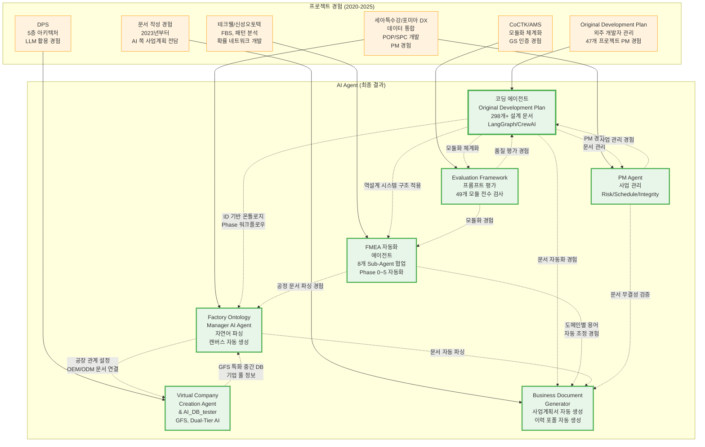

**주요 상호 영향 관계**:

1. **코딩 에이전트 (핵심 기초)**: 다른 모든 AI Agent의 설계 기초가 됨
   - FMEA 자동화: 역설계 시스템 구조 적용
   - Factory Ontology Manager: ID 기반 온톨로지, Phase 워크플로우
   - PM Agent: PM 경험, 문서 관리
   - Business Document Generator: 문서 자동화 경험
   - Evaluation Framework: 모듈화 체계화

2. **복합 프로젝트 영향**: 여러 프로젝트가 하나의 AI Agent에 복합적으로 영향
   - PM Agent: Original Development Plan + 포미아 DX PM 경험 통합
   - Business Document Generator: 문서 작성 경험 + PM 경험 통합
   - FMEA 자동화: 테크웰/신성오토텍 FMEA 문서화 + 코딩 에이전트 구조
   - Factory Ontology Manager: 세아특수강 데이터 통합 + 코딩 에이전트
   - Virtual Company Creation Agent: DPS 5층 아키텍처 + 코딩 에이전트

3. **AI Agent 간 상호 영향**: AI Agent들이 서로 영향을 주고받음
   - FMEA 자동화 → Business Document Generator: 도메인별 용어 자동 조정 경험
   - FMEA 자동화 → Factory Ontology Manager: 공정 문서 파싱 경험
   - Factory Ontology Manager → Virtual Company Creation Agent: 공장 관계 설정, OEM/ODM 문서 연결
   - PM Agent → Business Document Generator: 문서 무결성 검증
   - Evaluation Framework → 코딩 에이전트: 품질 평가 경험

### 전체 온톨로지 구조 (AI Agent 관점)

> [!NOTE] **온톨로지 기반 AI Agent 구조화**
> 모든 AI Agent는 온톨로지 구조로 체계화되어 있으며, Governance & Quality Assurance Layer가 전체 시스템을 관리합니다.

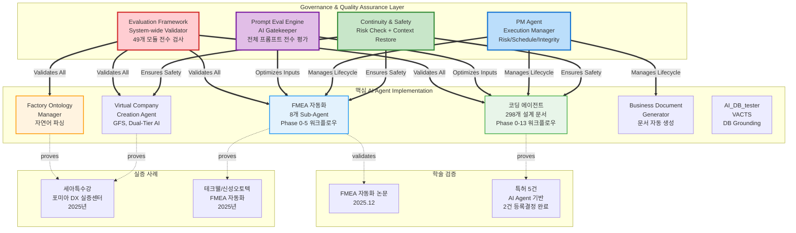

**온톨로지 구조의 핵심 (AI Agent 관점)**:
- **Governance & Quality Assurance Layer**: Evaluation Framework, Prompt Eval Engine, PM Agent가 전체 AI Agent 시스템의 품질과 안정성을 보장
- **핵심 AI Agent**: 코딩 에이전트, FMEA 자동화, Factory Ontology Manager 등 실제 구현된 AI Agent들이 온톨로지 구조로 연결됨
- **학술 검증**: 논문과 특허를 통해 AI Agent 기술의 신뢰성과 독창성 입증
- **실증 사례**: 세아특수강, 테크웰/신성오토텍 등 실제 현장에서 AI Agent가 검증됨

---

## 🛤️ 쌓아온 길 (AI Agent 진화 여정)

> [!NOTE] **AI Agent 진화의 전체 흐름**
> 2020년 O-WELL Japan에서 시작된 알고리즘이 4년간 진화하여 AMS의 핵심 엔진이 되었고, 각 프로젝트 경험이 LLM 에이전트 설계의 토대가 되었습니다.

### AI Agent 진화의 전체 흐름

**2020-2021년: 기초 기술 개발**
- **O-WELL Japan**: 피쉬본 개념 학습 및 품질 데이터 관리 경험
- **FBS (Fishbone Structure)**: 구조 계층 방식 고안 → 이후 AI Agent의 온톨로지 구조 설계 기초
- **가상 센서 & 제어**: 3-Type 가상센서 개발 → 이후 AI Agent의 데이터 처리 기법 기초

**2021-2023년: 패턴 분석 및 데이터 처리 기법 발전**
- **에너지 패턴 분석**: 계층적 클러스터링 및 패턴 민주주의 고안 → 이후 AI Agent의 패턴 분석 기법 기초
- **특허 출원**: 에너지 패턴 분석 기술 특허화 (특허 3, 4, 5) → AI Agent의 기술적 기반 확보

**2022-2024년: 컨설팅 도구 및 시스템 아키텍처 개발**
- **CoCTK**: 소량 데이터 판별, 구간 룰 생성 → 이후 AI Agent의 데이터 분석 기법 기초
- **DPS**: 5층 아키텍처 설계 → 이후 Virtual Company Creation Agent의 아키텍처 설계 기초
- **GS 인증**: CoCTK (2024) → 이후 AI Agent의 품질 관리 체계 기초

**2024-2025년: 통합 솔루션 및 AI Agent 개발 시작**
- **AMS**: FBS + RMS + Pattern 통합 플랫폼 → AI Agent의 기술적 통합 경험
- **GS 인증**: AMS (PDS 명칭, 2025) → AI Agent의 품질 관리 체계 완성
- **특허 출원**: AMS 공정 관리 기술 특허화 (특허 1, 2) → AI Agent의 기술적 기반 확보

**2025년: AI Agent 개발의 시작**
- **코딩 에이전트 (Obsidian Design Origin)**: 
  - 47개 프로젝트 PM 경험에서 외주 개발자 관리의 한계 발견
  - ID 기반 온톨로지 맵, Phase 0-13 워크플로우, LangGraph/CrewAI 오케스트레이션 정리
  - 298개 설계 문서 체계화
  - **→ 다른 모든 AI Agent의 설계 기초가 됨**

**2025년: AI Agent 확장**
- **FMEA 자동화 에이전트**: 코딩 에이전트의 역설계 시스템 구조를 FMEA 분석에 적용
- **PM Agent**: 외주 관리 경험을 사업 관리 자동화에 적용
- **Business Document Generator**: 문서 작성 경험을 문서 생성 자동화에 적용
- **Factory Ontology Manager**: 세아특수강 데이터 통합 경험을 자연어 기반 공정 문서 파싱에 적용
- **Evaluation Framework**: CoCTK/AMS 모듈화·체계화 경험을 전수 검사 시스템에 적용
- **프롬프트 평가 엔진**: 코딩 에이전트의 품질 관리 경험을 프롬프트 품질 보장에 적용

**2026년: LLM 서포트 시스템**
- **Virtual Company Creation Agent**: DPS 5층 아키텍처 경험을 바탕으로 LLM을 서포트하기 위한 특화 중간 DB (GFS) 개발
- **AI_DB_tester (VACTS)**: Virtual Company Creation Agent의 테스트 자동화 시스템
- **Dual-Tier AI 아키텍처**: High-Spec AI와 Low-Spec AI 분리로 최대 87% 비용 절감

### AI Agent 진화의 핵심 인사이트

- **"데이터보다 정보, 정보보다 지식구조"**: 모든 AI Agent가 온톨로지 구조로 체계화되어 지식 재사용과 확장이 가능
- **현장 친화적 연구**: 모든 AI Agent는 실제 제조 현장의 문제를 해결하기 위해 개발되어 즉각적인 산업 적용 가능
- **지속적인 혁신**: 2020년부터 2026년까지 매년 새로운 AI Agent와 방법론을 개발하며 지속적으로 진화
- **학술적 검증**: 논문 10편, 특허 5건 (2건 등록결정 완료)을 통해 AI Agent 기술의 신뢰성과 독창성 입증
- **실무 적용**: 세아특수강, 테크웰/신성오토텍 등 실제 현장에서 AI Agent가 검증됨

---

## 🔬 특허 출원/등록 현황 (AI Agent 관련 특허 강조)

> [!NOTE] **AI Agent 설계의 기술적 기반**
> 아래 특허들은 AI Agent 설계의 기술적 토대가 되는 핵심 알고리즘과 방법론을 특허로 보호한 것입니다. 특히 **특허 1**은 AI 기반 공정 최적화 관리 방법으로, FMEA 자동화 에이전트와 Factory Ontology Manager의 기술적 기반이 됩니다.

### 특허 출원/등록 현황 (5건)

| 출원일 | 특허명 | 출원번호 | 청구항 | 상태 | 발명자 | AI Agent 연계 |
| :--- | :--- | :--- | :--- | :--- | :--- | :--- |
| 2025.08.13 | **인공지능을 활용한 공정 최적화 관리를 위한 공정 관리 방법 및 그 시스템** | 10-2025-0040488 (예정) | 10개 | 출원완료 심사청구완료 | **권순룡**, 최수영, 강용태, 안상윤 | **FMEA 자동화 에이전트**: 특성요인도 자동 생성 → 관리 룰 생성 → 경로 탐색 기술이 FMEA 자동화의 핵심 **Factory Ontology Manager**: 온톨로지 구조화/정보화의 통합 실현 **AMS 프로젝트**: FBS Module, RMS Module, 확률 네트워크 기반 원인 분석 |
| 2025.03.28 | **공정 최적화를 위한 공정 관리 방법 및 그 시스템** | 10-2025-0040488 | 8개 | 등록결정 (2025.12.09) | 강용태, **권순룡**, 김혜주 | **Factory Ontology Manager**: 공정 관리 기술이 온톨로지 구조로 설계되어 통합 **등록결정 완료** |
| 2023.12.26 | **생산공정 에너지 및 설비상태 데이터 처리를 위한 전력 사용 패턴 분석 및 상태 분석 방법** | 1020230191965 | 6개 | 공개 심사청구완료 | 최수영, 강용태, **권순룡**, 이상훈 | **패턴 분석 에이전트**: 에너지 패턴 분석 기술이 구조화된 온톨로지 형태로 설계됨 **AMS Pattern Module**: 설비 SoH 상태 분석 모델 생성 및 실시간 판단 |
| 2023.12.26 | **주기 데이터 분석 기반의 전력 추이 상황적 불량 이상 검증 방법** | 1020230191969 | 5개 | 공개 심사청구완료 | 최수영, 강용태, **권순룡**, 이상훈 | **패턴 분석 에이전트**: 시계열 분해 방식으로 주기 데이터 추출 → 주파수 스펙트럼 기반 패턴 분석 **AMS Pattern Module**: 시계열 예측 기반 불량/이상 감지 |
| 2021.12.07 | **설비 제어 특성 로그 데이터와 에너지 소비패턴 모델을 활용한 인공지능 기반의 이상 탐지 방법 및 장치** | 1020210174274 | 10개 | 등록결정 (2025.10.28) | 강용태, 김정호, **권순룡**, 김동기 | **패턴 분석 에이전트**: 에너지 소비 패턴 모델이 온톨로지 구조의 기초 **AMS Pattern Module**: 제어기 로그 데이터 + 전류 소비 데이터 결합 → 이상 탐지 모델 **등록결정 완료** |

### AI Agent와 특허 기술의 연계

**특허 1 (2025.08.13) - AI Agent 설계의 핵심 기술**:
- **FMEA 자동화 에이전트**: 특성요인도 자동 생성(피쉬본 = 구조화된 인과관계) → 관리 룰 생성(구조화된 규칙) → 경로 탐색(확률 네트워크 = 구조화된 확률 관계)이 온톨로지 구조로 설계됨
- **Factory Ontology Manager**: 공정 관리 기술이 온톨로지 구조로 설계되어 자연어 기반 공정 문서 파싱의 기술적 기반이 됨
- **LLM 연계 가능성**: 확률 관계 그래프를 토큰화하여 LLM에 입력하는 기술로, FMEA 자동화 에이전트의 LLM 활용 기반이 됨

**특허 3, 4, 5 (에너지 패턴 분석) - 패턴 분석 에이전트의 기술적 기반**:
- **패턴 분석 에이전트**: 에너지 패턴 분석 기술이 구조화된 온톨로지 형태로 설계되어, AMS Pattern Module의 핵심 알고리즘이 됨
- **시계열 분석 기법**: 주기 데이터 추출, 주파수 스펙트럼 분석, 시계열 예측을 통합한 이상 검증 방법이 패턴 분석 에이전트의 기술적 기반

### 특허 기술 발전 흐름 (AI Agent 관점)

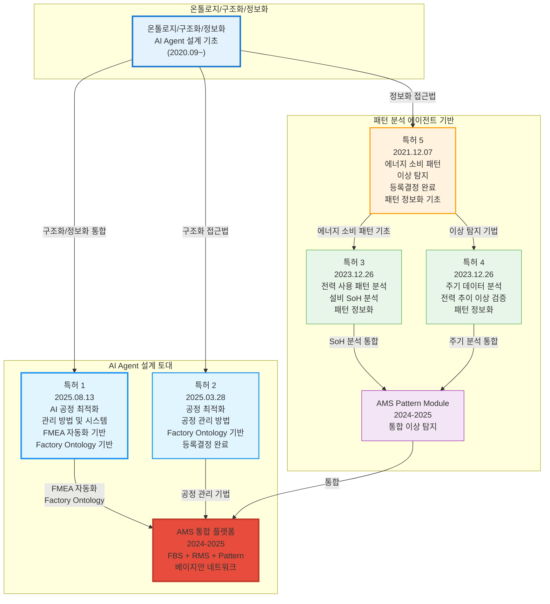

---

## 💼 비즈니스 가치 창출

### AI Agent 개발 성과

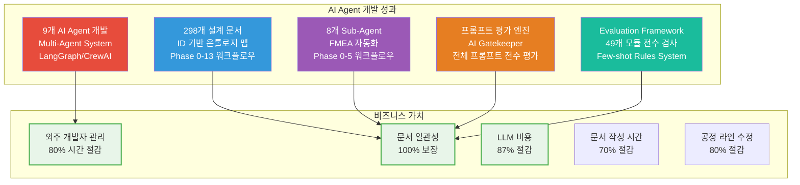

### 개발 효율성 향상
- ✅ **외주 개발자 관리 시간 80% 이상 절감**: 코딩 에이전트를 통한 자동화
- ✅ **문서 일관성 100% 보장**: ID 시스템 기반 문서 관리
- ✅ **개발 프로세스 자동화**: 납품 품질 향상
- ✅ **LLM 비용 87% 절감**: Virtual Company Creation Agent의 GFS + Dual-Tier AI 아키텍처
- ✅ **문서 작성 시간 70% 이상 절감**: Business Document Generator를 통한 자동화
- ✅ **공정 라인 수정 시간 80% 이상 절감**: Factory Ontology Manager의 자연어 기반 파싱
- ✅ **프롬프트 품질 일관성 100% 보장**: 프롬프트 평가 엔진의 전수 평가 시스템
- ✅ **코드 품질 일관성 100% 보장**: Evaluation Framework의 전수 검사 시스템

### ROI 분석

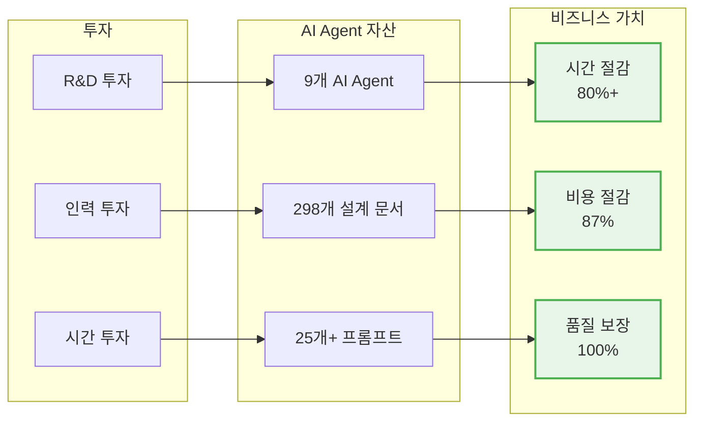

### 핵심 성과 지표

| 지표 | 수치 | 비고 |
|:---|---:|:---|
| **AI Agent 개발** | 9개 | 코딩 에이전트, FMEA 자동화, 프롬프트 평가, PM Agent 등 |
| **Multi-Agent System** | 8개 Sub-Agent | FMEA 자동화 Multi-Agent 시스템 |
| **설계 문서** | 298개+ | ID 기반 온톨로지 맵 |
| **프롬프트** | 25개+ | 프롬프트 평가 엔진으로 품질 보장 |
| **외주 관리 시간 절감** | 80%+ | 코딩 에이전트 자동화 |
| **문서 일관성** | 100% | ID 시스템 기반 문서 관리 |
| **LLM 비용 절감** | 87% | GFS + Dual-Tier AI |
| **문서 작성 시간 절감** | 70%+ | Business Document Generator |
| **공정 라인 수정 시간 절감** | 80%+ | Factory Ontology Manager |
| **프롬프트 품질 보장** | 100% | 프롬프트 평가 엔진 전수 평가 |
| **코드 품질 보장** | 100% | Evaluation Framework 전수 검사 |

---

## 🔗 관련 문서

- **이력서**: [권순룡_이력서_일반공개_AI_Agent_Engineer.md](./권순룡_이력서_일반공개_AI_Agent_Engineer.md)
- **포트폴리오 인덱스**: [00_Portfolio_Index.md](../../00_Portfolio_Index.md)
- **프로젝트 개요**: [02_Projects_Overview.md](../../02_Projects_Overview.md)

---

*본 포트폴리오는 AI Agent Engineer 직무에 특화되어 작성되었습니다.*

© 2026 권순룡. All Rights Reserved.
