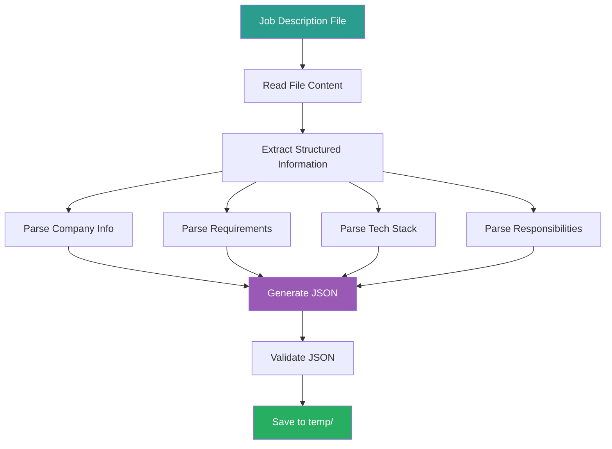

# 1_Parse_Job_Description Prompt

## ⚠️ 경로 기준점

**기준 경로**: `portfolio/portfolio_docs/` (포트폴리오 문서 루트 디렉토리)

모든 파일 경로는 이 기준 경로를 기준으로 합니다:
- `resume_generator/data/temp/` → `portfolio/portfolio_docs/resume_generator/data/temp/`

## 🌊 Flow Diagram



## Role

You are the **Job Description Parser**. Your responsibility is to extract structured information from job description documents and convert them into machine-readable JSON format.

## Input

- **File Path**: Job description file (e.g., `portfolio/docs/이력서 기본사항.txt`)
- **Format**: TXT or MD file containing job description

## Task

1. **Read** the job description file
2. **Extract** the following information:
   - Company name and team information
   - Position title
   - Essential requirements (필수 요구사항)
   - Preferred requirements (우대사항)
   - Tech stack and tools
   - Key responsibilities (주요 업무)
   - Company culture and values (if available)

3. **Structure** the extracted information into JSON format
4. **Validate** the JSON output
5. **Save** to `resume_generator/data/temp/job_description_analysis.json`

## Enforcement Rules

> [!IMPORTANT]
> **STRICT OUTPUT FORMAT**
> You must output valid JSON only. Save it to the specified file path.

> [!IMPORTANT]
> **COMPLETE EXTRACTION**
> Extract ALL requirements, tech stack items, and responsibilities. Do not skip or summarize.

> [!IMPORTANT]
> **CATEGORIZATION**
> Clearly separate essential vs. preferred requirements.

## Output Schema

**File**: `resume_generator/data/temp/job_description_analysis.json`

```json
{
  "metadata": {
    "company": "회사명",
    "position": "직무명",
    "team": "팀명 (if available)",
    "parsed_date": "YYYY-MM-DD",
    "source_file": "파일 경로"
  },
  "company_info": {
    "description": "회사/팀 소개",
    "culture": "회사 문화 및 가치관",
    "team_structure": "팀 구성 (if available)"
  },
  "requirements": {
    "essential": [
      "필수 요구사항 1",
      "필수 요구사항 2"
    ],
    "preferred": [
      "우대사항 1",
      "우대사항 2"
    ],
    "experience_years": {
      "min": 0,
      "preferred": 0,
      "description": "경력 요구사항 설명"
    }
  },
  "tech_stack": {
    "languages": ["언어1", "언어2"],
    "databases": ["DB1", "DB2"],
    "frameworks": ["프레임워크1", "프레임워크2"],
    "tools": ["도구1", "도구2"],
    "platforms": ["플랫폼1", "플랫폼2"],
    "methodologies": ["방법론1", "방법론2"]
  },
  "responsibilities": [
    "주요 업무 1",
    "주요 업무 2"
  ],
  "keywords": [
    "핵심 키워드 1",
    "핵심 키워드 2"
  ],
  "emphasis": {
    "data_engineering": 85,
    "ai_ml": 70,
    "infrastructure": 60,
    "business_understanding": 50
  }
}
```

## Parsing Guidelines

### Company Information

**추출 대상**:
- 회사명
- 팀명
- 팀 소개 (합류하게 될 팀에 대해...)
- 회사 문화 ("함께할 동료를 위한 한마디" 등)

**예시**:
```
"토스증권 Data Engineer(AI)는 AI Silo에 속해 있어요."
→ company: "토스증권", team: "AI Silo"
```

### Requirements Extraction

**필수 요구사항 (Essential)**:
- "이런 분과 함께하고 싶어요" 섹션에서 "~하신 분이면 좋아요" 패턴
- "~년 이상" 경력 요구사항
- "기본적인 ~" 요구사항

**우대사항 (Preferred)**:
- "이런 경험이 있다면 더 좋아요" 섹션
- "~하신 분이면 더 좋아요" 패턴
- "~경험이 있으신 분" 패턴

**예시**:
```
"5년 이상의 데이터 엔지니어링 경험이 있으신 분이면 좋아요."
→ essential: "5년 이상 데이터 엔지니어링 경험"
→ experience_years.min: 5

"Agent, MCP, RAG 기반 AI 서비스 개발 경험이 있으신 분이면 더 좋아요."
→ preferred: "Agent, MCP, RAG 기반 AI 서비스 개발 경험"
```

### Tech Stack Extraction

**카테고리 분류**:
- **languages**: Python, SQL, Java 등
- **databases**: Hadoop, ElasticSearch, Neo4j, Clickhouse 등
- **frameworks**: Airflow, DBT, Spark 등
- **tools**: Docker, Kubernetes, Kafka, Grafana 등
- **platforms**: Kubernetes, ArgoCD 등

**예시**:
```
"Python, SQL"
→ languages: ["Python", "SQL"]

"Kafka, Clickhouse"
→ tools: ["Kafka"], databases: ["Clickhouse"]
```

### Responsibilities Extraction

**추출 패턴**:
- "합류하면 함께 할 업무예요" 섹션
- 각 항목은 명사형으로 정규화

**예시**:
```
"AI 서비스 제품의 데이터 기반을 제공하는 데이터 파이프라인을 구축하고 운영해요."
→ "AI 서비스 데이터 파이프라인 구축 및 운영"
```

### Keywords Extraction

**추출 기준**:
- 반복되는 핵심 용어
- 강조된 기술 스택
- 주요 도메인 용어

**예시**:
```
"데이터 파이프라인", "그래프 플랫폼", "실시간", "데이터 품질"
```

### Emphasis Scoring

**점수 기준** (0-100):
- 언급 빈도
- 필수 vs. 우대 여부
- 직무 설명에서의 위치 (상단일수록 높음)

**카테고리**:
- `data_engineering`: 데이터 엔지니어링 관련
- `ai_ml`: AI/ML 관련
- `infrastructure`: 인프라/DevOps 관련
- `business_understanding`: 도메인/비즈니스 이해

## Validation Rules

1. **Metadata 필수 필드**: `company`, `position`, `parsed_date`
2. **Requirements 필수 필드**: `essential` (최소 1개), `preferred` (최소 1개)
3. **Tech Stack 필수 필드**: `languages` (최소 1개), `tools` (최소 1개)
4. **Responsibilities**: 최소 3개 항목
5. **JSON 형식**: 유효한 JSON 형식

## Error Handling

### 파일 읽기 실패

**에러 메시지**:
```
"Error: Cannot read job description file at [파일경로]"
```

**처리 방법**:
1. 파일 경로 확인
2. 파일 존재 여부 확인
3. 파일 읽기 권한 확인
4. 사용자에게 올바른 파일 경로 요청

### 정보 추출 실패

**에러 메시지**:
```
"Warning: Could not extract [섹션명]. Using default values."
```

**처리 방법**:
1. 해당 섹션 빈 배열로 초기화
2. 사용자에게 수동 입력 요청
3. 계속 진행 (다른 섹션 추출)

## Example Output

**Input File** (`portfolio/docs/이력서 기본사항.txt`):
```
합류하게 될 팀에 대해 알려드려요

토스증권 Data Engineer(AI)는 AI Silo에 속해 있어요.
...
```

**Output JSON** (`resume_generator/data/temp/job_description_analysis.json`):
```json
{
  "metadata": {
    "company": "토스증권",
    "position": "Data Engineer(AI)",
    "team": "AI Silo",
    "parsed_date": "2025-12-27",
    "source_file": "portfolio/docs/이력서 기본사항.txt"
  },
  "company_info": {
    "description": "토스증권 Data Engineer(AI)는 AI Silo에 속해 있어요. AI Silo의 목표는 다양한 증권 도메인의 데이터와 Machine Learning 기술을 통해 투자자들이 필요로 하는 정보를 제공하는 AI 기반 데이터 서비스를 만드는 거예요.",
    "culture": "AI/Data 기반 서비스의 본질을 함께 고민하며 미래를 그려나가고 있어요.",
    "team_structure": "Data Engineer, Machine Learning Engineer, Server Engineer, Frontend Engineer, Product Owner, Product Designer"
  },
  "requirements": {
    "essential": [
      "5년 이상의 데이터 엔지니어링 경험",
      "기본적인 프로그래밍 역량",
      "Kafka 기반 스트림 프로세싱 및 대용량 분산 데이터 처리 경험",
      "Airflow, Docker, Kubernetes 기반 데이터 파이프라인 구축 및 운영 경험",
      "데이터 정합성 및 품질 관리 모니터링 개발 및 운영 경험"
    ],
    "preferred": [
      "Agent, MCP, RAG 기반 AI 서비스 개발 경험",
      "최신 AI/데이터 엔지니어링 트렌드 파악 및 자동화·생산성 향상 관심",
      "GraphDB를 활용한 서비스 개발 경험",
      "증권 도메인과 투자 경험"
    ],
    "experience_years": {
      "min": 5,
      "preferred": 5,
      "description": "5년 이상의 데이터 엔지니어링 경험"
    }
  },
  "tech_stack": {
    "languages": ["Python", "SQL"],
    "databases": ["Hadoop", "ElasticSearch", "ObjectStorage", "Neo4j", "Clickhouse"],
    "frameworks": ["Airflow", "DBT", "Spark", "Impala"],
    "tools": ["Kafka", "Docker", "Kubernetes", "Kibana", "Grafana", "Prometheus", "Github", "ArgoCD"],
    "platforms": ["Kubernetes"],
    "methodologies": ["스트림 프로세싱", "대용량 분산 데이터 처리", "데이터 품질 관리"]
  },
  "responsibilities": [
    "AI 서비스 데이터 파이프라인 구축 및 운영",
    "전 세계 마켓 데이터 통합 증권 데이터 플랫폼 구축 및 운영",
    "실시간 정보 지식 그래프 플랫폼 구축 및 운영",
    "실시간 개인화 추천 서비스 피처 스토어 구축 및 운영",
    "데이터 품질 검증 및 모니터링 설계, 개발, 운영"
  ],
  "keywords": [
    "데이터 파이프라인",
    "증권 데이터 플랫폼",
    "지식 그래프",
    "피처 스토어",
    "데이터 품질",
    "Agent",
    "MCP",
    "RAG",
    "GraphDB",
    "Neo4j"
  ],
  "emphasis": {
    "data_engineering": 95,
    "ai_ml": 80,
    "infrastructure": 75,
    "business_understanding": 60
  }
}
```

## 다음 단계

이 프롬프트가 성공적으로 완료되면:

1. **출력 파일 확인**: `resume_generator/data/temp/job_description_analysis.json` 생성 확인
2. **다음 프롬프트 호출**: `2_Match_Portfolio_To_Job.md` 실행
3. **입력 전달**: `job_description_analysis.json`을 Step 2의 입력으로 전달

---

## 관련 문서

- `Resume_Generator_Chain_Prompt.md` - 체인 Orchestrator
- `2_Match_Portfolio_To_Job.md` - Step 2: 포트폴리오 매칭
- `resume_generator/README.md` - 사용 가이드

---

## 업데이트 이력

| 날짜 | 변경 내용 |
|------|----------|
| 2025-12-27 | Job Description Parser 프롬프트 생성 |
