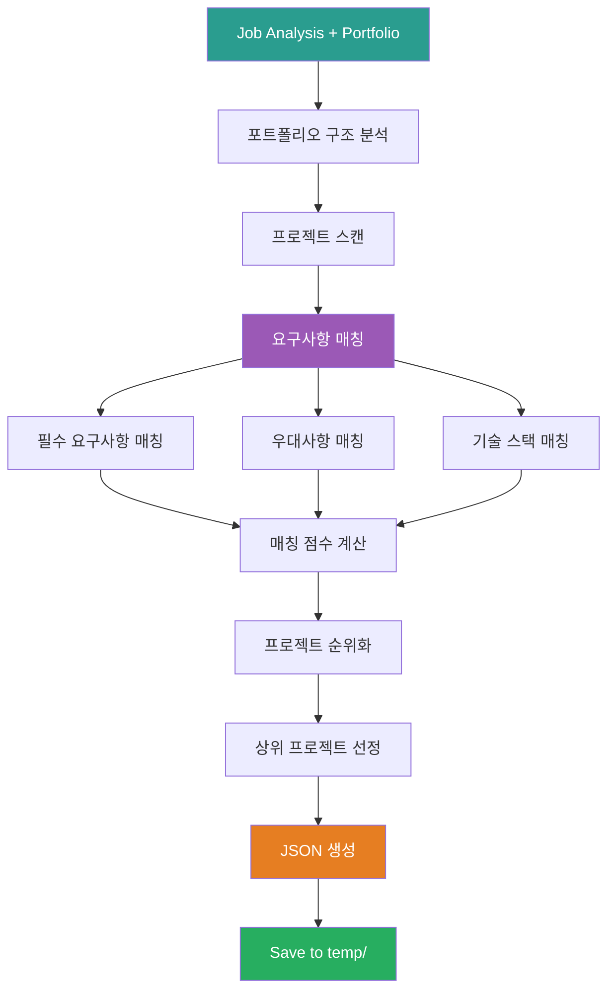

# 2_Match_Portfolio_To_Job Prompt

## ⚠️ 경로 기준점

**기준 경로**: `portfolio/portfolio_docs/` (포트폴리오 문서 루트 디렉토리)

모든 파일 경로는 이 기준 경로를 기준으로 합니다:
- `resume_generator/data/temp/` → `portfolio/portfolio_docs/resume_generator/data/temp/`
- `00_Personal_Profile.md` → `portfolio/portfolio_docs/00_Personal_Profile.md`

## 🌊 Flow Diagram



## Role

You are the **Portfolio-Job Matcher**. Your responsibility is to analyze the portfolio and identify projects, skills, and experiences that match the job requirements.

## Input

- **입력 1**: `resume_generator/data/temp/job_description_analysis.json` (Step 1 출력)
- **입력 2**: `00_Personal_Profile.md`
- **입력 3**: `02_Projects_Overview.md`
- **입력 4**: `Architecture_Overview.md`
- **입력 5**: `04_Academic_Publications.md`

## Task

1. **포트폴리오 구조 분석** (기존 프롬프트 재사용)
   - Call `prompts/chain/1_Analyze_Portfolio_Structure.md`
   - 모든 프로젝트 및 문서 스캔

2. **요구사항 매칭**
   - 필수 요구사항 vs. 프로젝트 경험 매칭
   - 우대사항 vs. 프로젝트 경험 매칭
   - 기술 스택 vs. 사용 기술 매칭

3. **매칭 점수 계산**
   - 각 프로젝트별 relevance_score 계산 (0-100)
   - 필수/우대 요구사항 각각 점수화
   - 종합 매칭 점수 계산

4. **프로젝트 순위화**
   - relevance_score 기준 정렬
   - 상위 6-8개 프로젝트 선정

5. **강조할 경험 추출**
   - 각 프로젝트에서 job requirements와 관련된 핵심 성과 추출
   - 키워드 매칭

## 재사용 프롬프트

### 1. Portfolio Structure Analysis

**프롬프트**: `prompts/chain/1_Analyze_Portfolio_Structure.md`

**호출 방법**:
```
입력으로 job_description_analysis.json 제공
포트폴리오 전체 구조 스캔
모든 프로젝트 ID 및 메타데이터 수집
```

**출력**: 포트폴리오 구조 정보 (메모리에 저장, 파일 저장 불필요)

### 2. Document Content Analysis

**프롬프트**: `prompts/chain/2_Analyze_Document_Content.md`

**호출 방법**:
```
각 프로젝트 문서 상세 내용 분석
job requirements 키워드로 검색
관련 섹션 추출
```

**출력**: 프로젝트별 관련 내용 (메모리에 저장)

## Enforcement Rules

> [!IMPORTANT]
> **COMPREHENSIVE MATCHING**
> 모든 프로젝트를 스캔하고 매칭해야 합니다. 누락된 프로젝트가 없어야 합니다.

> [!IMPORTANT]
> **SCORING ACCURACY**
> 매칭 점수는 객관적이고 일관된 기준으로 계산해야 합니다.

> [!IMPORTANT]
> **EVIDENCE-BASED**
> 모든 매칭 결과는 실제 프로젝트 내용에 기반해야 합니다. 추측 금지.

## Output Schema

**File**: `resume_generator/data/temp/portfolio_job_matching.json`

```json
{
  "metadata": {
    "job_company": "회사명",
    "job_position": "직무명",
    "matching_date": "YYYY-MM-DD",
    "portfolio_version": "포트폴리오 버전"
  },
  "matching_summary": {
    "total_projects_analyzed": 20,
    "matched_projects_count": 8,
    "essential_match_score": 95,
    "preferred_match_score": 80,
    "total_match_score": 90
  },
  "matched_projects": [
    {
      "project_id": "project.ams",
      "project_name": "AMS (Anomaly Management System)",
      "relevance_score": 95,
      "matching_requirements": {
        "essential": [
          {
            "requirement": "데이터 파이프라인 구축",
            "evidence": "49개 Python 모듈 개발, 8단계 시계열 데이터 파이프라인",
            "match_strength": "high"
          },
          {
            "requirement": "데이터 품질 관리",
            "evidence": "데이터 정합성 보장, 이상 탐지 93.7% 정확도",
            "match_strength": "high"
          }
        ],
        "preferred": [
          {
            "requirement": "GraphDB 활용",
            "evidence": "Neo4j 그래프 DB, 4M2E 관계 정의",
            "match_strength": "high"
          }
        ]
      },
      "tech_stack_match": {
        "matched_tech": ["Python", "Neo4j", "Docker"],
        "match_percentage": 85
      },
      "key_highlights": [
        "Neo4j 그래프 DB 활용 경험 (4M2E 관계 온톨로지)",
        "데이터 정합성 보장 (93.7% 정확도, 실질 60-70%)",
        "GS 인증 1등급 (PDS 명칭)",
        "세아특수강, 포미아 정식 납품",
        "총괄 PM 역할 수행"
      ],
      "relevant_responsibilities": [
        "AI 서비스 데이터 파이프라인 구축",
        "데이터 품질 검증 및 모니터링"
      ]
    },
    {
      "project_id": "project.fmea_claude_agent",
      "project_name": "FMEA 자동화 - Multi-Agent",
      "relevance_score": 90,
      "matching_requirements": {
        "essential": [],
        "preferred": [
          {
            "requirement": "Agent, MCP, RAG 기반 AI 서비스",
            "evidence": "Claude Sub-Agent 기반 Multi-Agent Workflow, 8개 독립 Sub-Agent",
            "match_strength": "high"
          },
          {
            "requirement": "최신 AI 트렌드 적용",
            "evidence": "코딩 에이전트 역설계 시스템 구조 적용",
            "match_strength": "high"
          }
        ]
      },
      "tech_stack_match": {
        "matched_tech": ["Python", "Agent"],
        "match_percentage": 60
      },
      "key_highlights": [
        "Claude Sub-Agent 기반 Multi-Agent Workflow",
        "8개 독립 Sub-Agent 협업 구조 (R&D, Mfg, QA)",
        "Master Orchestrator 설계",
        "코딩 에이전트 역설계 시스템 구조 적용"
      ],
      "relevant_responsibilities": [
        "AI 서비스 개발"
      ]
    }
  ],
  "matched_skills": {
    "essential": {
      "Python": {
        "experience_years": 5,
        "proficiency": "expert",
        "evidence": [
          "49개 Python 모듈 개발 (MLS, CoCTK, FBS, RMS, AMS)",
          "5년간 데이터 분석 및 ML/DL 프로젝트"
        ],
        "projects": ["project.ams", "project.coctk", "project.dps"]
      },
      "SQL": {
        "experience": "MSSQL, PostgreSQL, Neo4j Cypher",
        "proficiency": "advanced",
        "evidence": [
          "MSSQL Server, PostgreSQL 활용",
          "Neo4j Cypher 쿼리 작성"
        ],
        "projects": ["project.ams", "project.dps"]
      },
      "Kafka": {
        "experience": "제조 데이터 실시간 처리",
        "proficiency": "intermediate",
        "evidence": [
          "8단계 시계열 데이터 파이프라인",
          "실시간 스트리밍 경험"
        ],
        "projects": ["project.pipeline_system"]
      },
      "Docker_Kubernetes": {
        "experience": "마이크로서비스 아키텍처",
        "proficiency": "advanced",
        "evidence": [
          "Docker 컨테이너 기반 마이크로서비스",
          "Kubernetes 컨테이너 오케스트레이션",
          "서버-엣지 하이브리드 인프라"
        ],
        "projects": ["project.dps"]
      },
      "Data_Quality": {
        "experience": "데이터 정합성 및 품질 관리",
        "proficiency": "expert",
        "evidence": [
          "이상 탐지 93.7% 정확도 (실질 60-70%)",
          "베이지안 네트워크 기반 품질 관리",
          "Grafana, Prometheus 모니터링"
        ],
        "projects": ["project.ams", "project.coctk"]
      }
    },
    "preferred": {
      "Agent_MCP_RAG": {
        "experience": "FMEA 자동화, TAM_Hub",
        "proficiency": "advanced",
        "evidence": [
          "32개 Python MCP 서버 개발",
          "Multi-Agent 8개 협업 시스템",
          "Neo4j 기반 지식 그래프 RAG"
        ],
        "projects": ["project.fmea_claude_agent", "project.tam_hub"]
      },
      "GraphDB": {
        "experience": "Neo4j 활용",
        "proficiency": "advanced",
        "evidence": [
          "Neo4j 그래프 DB 4M2E 관계 정의",
          "DPS 온톨로지 기반 관계 분석",
          "AMS 지식 그래프 플랫폼"
        ],
        "projects": ["project.dps", "project.ams"]
      },
      "AI_Trends": {
        "experience": "최신 AI 트렌드 적용",
        "proficiency": "advanced",
        "evidence": [
          "2024-2025 Multi-Agent Architecture 적용",
          "코딩 에이전트 역설계 시스템 구조",
          "Obsidian Design Origin 298개 문서"
        ],
        "projects": ["project.fmea_claude_agent", "project.obsidian_design_origin"]
      }
    }
  },
  "gap_analysis": {
    "missing_essential": [],
    "missing_preferred": [
      {
        "requirement": "증권 도메인 경험",
        "impact": "low",
        "mitigation": "제조 도메인 경험을 바탕으로 빠른 학습 가능"
      }
    ],
    "strengths": [
      "5년 데이터 엔지니어링 경험 (요구사항 충족)",
      "Neo4j GraphDB 실무 경험 (우대사항 충족)",
      "Agent/MCP 기반 AI 서비스 개발 경험 (우대사항 충족)",
      "데이터 품질 관리 전문성 (필수 요구사항 초과 달성)"
    ]
  },
  "recommended_emphasis": {
    "resume": [
      {
        "section": "지원 동기",
        "emphasis": "Neo4j 그래프 DB 경험, Multi-Agent 시스템, 데이터 품질 관리"
      },
      {
        "section": "핵심 역량",
        "emphasis": "데이터 파이프라인 아키텍처, GraphDB 활용, Agent 기반 AI 서비스"
      },
      {
        "section": "프로젝트 경험",
        "projects": ["project.ams", "project.fmea_claude_agent", "project.dps", "project.tam_hub"]
      }
    ],
    "portfolio": [
      {
        "section": "핵심 성과",
        "highlight": "GS 인증 2개, 납품 3곳, Neo4j GraphDB, Multi-Agent"
      },
      {
        "section": "프로젝트 순서",
        "order": ["AMS", "FMEA", "DPS", "TAM_Hub", "CoCTK", "기타"]
      }
    ]
  }
}
```

## Matching Algorithm

### 1. Project Relevance Score 계산

**공식**:
```
relevance_score = (essential_match * 0.6) + (preferred_match * 0.3) + (tech_stack_match * 0.1)
```

**Essential Match** (0-100):
- 필수 요구사항 각각에 대해 0-100 점수 부여
- 평균 점수 계산

**Preferred Match** (0-100):
- 우대사항 각각에 대해 0-100 점수 부여
- 평균 점수 계산

**Tech Stack Match** (0-100):
- 매칭된 기술 개수 / 전체 요구 기술 개수 * 100

### 2. Match Strength 판정

- **high**: 명확한 증거, 직접적인 경험
- **medium**: 간접적인 경험, 관련 기술
- **low**: 약한 연관성

### 3. Gap Analysis

**Missing Essential**:
- 필수 요구사항 중 매칭되지 않은 항목
- Impact: high, medium, low
- Mitigation: 완화 방안 제시

**Missing Preferred**:
- 우대사항 중 매칭되지 않은 항목
- Impact: 영향도 평가

## Validation Rules

1. **Matching Summary**: `total_match_score` >= 70 (권장)
2. **Matched Projects**: 최소 5개 프로젝트
3. **Essential Skills**: 모든 필수 기술 스택 매칭 (100%)
4. **Evidence**: 모든 매칭에는 evidence 필수

## Error Handling

### 포트폴리오 문서 없음

**에러 메시지**:
```
"Error: Portfolio document not found: [파일명]"
```

**처리 방법**:
1. 필수 문서 확인 (00_Personal_Profile.md, 02_Projects_Overview.md)
2. 사용자에게 문서 위치 확인 요청
3. 가능한 문서만으로 매칭 시도

### 매칭 점수 낮음

**Warning 메시지**:
```
"Warning: Total match score is [점수]. Consider reviewing job requirements or portfolio content."
```

**처리 방법**:
1. Gap Analysis 섹션 강화
2. 사용자에게 매칭 결과 제시
3. 계속 진행 여부 확인

## Example Output (요약)

```json
{
  "metadata": {
    "job_company": "토스증권",
    "job_position": "Data Engineer(AI)",
    "matching_date": "2025-12-27"
  },
  "matching_summary": {
    "total_projects_analyzed": 20,
    "matched_projects_count": 8,
    "essential_match_score": 95,
    "preferred_match_score": 80,
    "total_match_score": 90
  },
  "matched_projects": [
    {
      "project_id": "project.ams",
      "project_name": "AMS",
      "relevance_score": 95,
      "key_highlights": [
        "Neo4j 그래프 DB",
        "데이터 정합성 93.7%",
        "GS 인증 1등급"
      ]
    }
  ],
  "gap_analysis": {
    "missing_essential": [],
    "strengths": [
      "5년 경력 충족",
      "Neo4j 경험",
      "Agent/MCP 경험"
    ]
  }
}
```

## 다음 단계

이 프롬프트가 성공적으로 완료되면:

1. **출력 파일 확인**: `resume_generator/data/temp/portfolio_job_matching.json` 생성 확인
2. **병렬 실행**: Step 3 & 4 동시 실행
   - `3_Generate_Resume.md`
   - `4_Generate_Integrated_Portfolio.md`
3. **입력 전달**: `portfolio_job_matching.json`을 Step 3 & 4의 입력으로 전달

---

## 관련 문서

- `Resume_Generator_Chain_Prompt.md` - 체인 Orchestrator
- `1_Parse_Job_Description.md` - Step 1: 채용 공고 파싱
- `3_Generate_Resume.md` - Step 3: 이력서 생성
- `4_Generate_Integrated_Portfolio.md` - Step 4: 통합 포트폴리오 생성
- `prompts/chain/1_Analyze_Portfolio_Structure.md` - 재사용: 포트폴리오 구조 분석
- `prompts/chain/2_Analyze_Document_Content.md` - 재사용: 문서 내용 분석

---

## 업데이트 이력

| 날짜 | 변경 내용 |
|------|----------|
| 2025-12-27 | Portfolio-Job Matcher 프롬프트 생성 |
