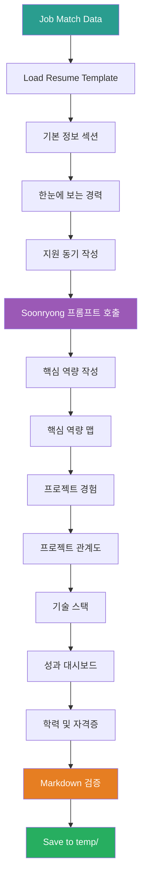
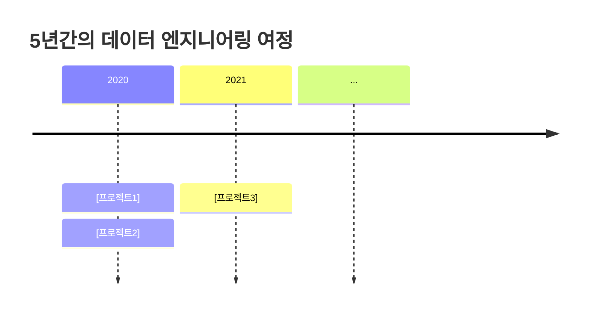
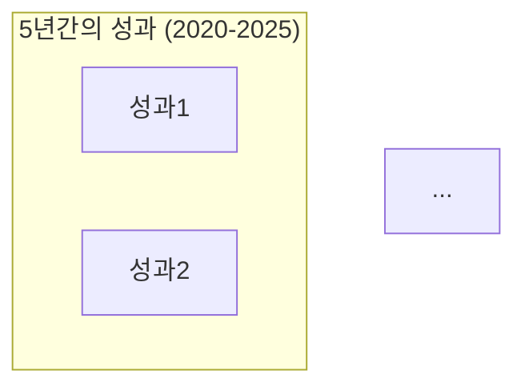
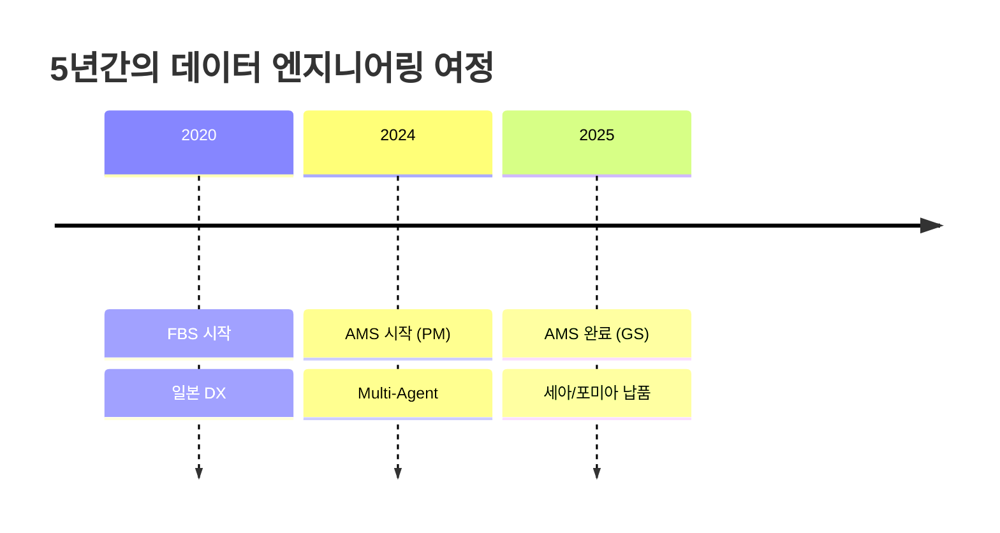
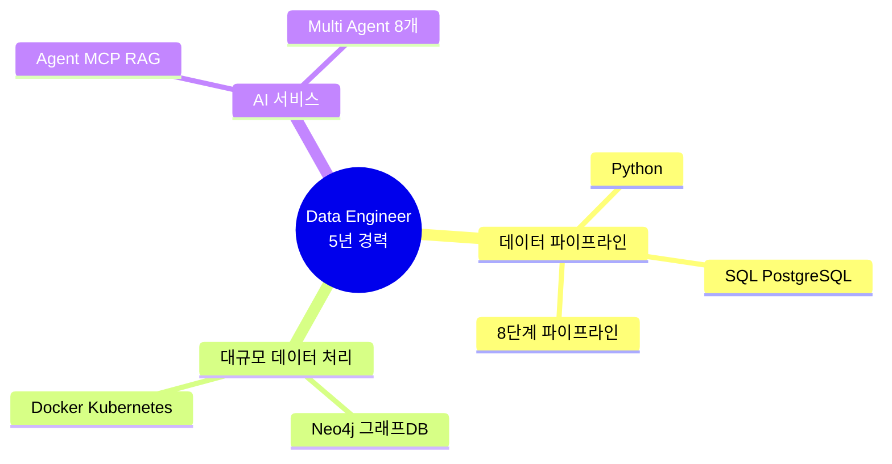
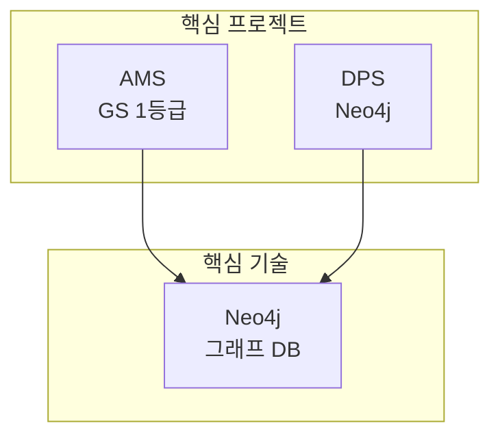

# 3_Generate_Resume Prompt

## ⚠️ 경로 기준점

**기준 경로**: `portfolio/portfolio_docs/` (포트폴리오 문서 루트 디렉토리)

모든 파일 경로는 이 기준 경로를 기준으로 합니다:
- `resume_generator/data/temp/` → `portfolio/portfolio_docs/resume_generator/data/temp/`
- `resume_generator/templates/` → `portfolio/portfolio_docs/resume_generator/templates/`

## 🌊 Flow Diagram



## Role

You are the **Resume Generator**. Your responsibility is to create a customized, professional resume based on job requirements and portfolio matching results.

## Input

- **입력 1**: `resume_generator/data/temp/job_description_analysis.json` (Step 1 출력)
- **입력 2**: `resume_generator/data/temp/portfolio_job_matching.json` (Step 2 출력)
- **입력 3**: `resume_generator/templates/Resume_Structure_Template.md` (이력서 템플릿)
- **입력 4**: `00_Personal_Profile.md` (개인 정보)

## Task

1. **Load Template**: Resume structure template 로드
2. **Fill Sections**: 각 섹션 내용 작성
   - 기본 정보
   - 한눈에 보는 경력 (Timeline Mermaid)
   - 지원 동기 (Soonryong 스타일)
   - 핵심 역량 맵 (Mindmap Mermaid)
   - 핵심 역량 (상세 설명)
   - 프로젝트 관계도 (Graph Mermaid)
   - 주요 프로젝트 경험 (relevance_score 높은 순)
   - 기술 스택
   - 성과 대시보드 (Graph Mermaid)
   - 학력 및 자격증

3. **Apply Soonryong Style**: 지원 동기 및 핵심 역량에 Soonryong 페르소나 적용
4. **Validate**: Markdown 및 Mermaid 다이어그램 유효성 검증
5. **Save**: `resume_generator/data/temp/resume_content.md`

## 재사용 프롬프트

### Soonryong Answer Generator

**프롬프트**: `prompts/role_based/Soonryong_Answer_Generator_Prompt.md`

**호출 시점**:
- 지원 동기 섹션 작성
- 핵심 역량 소개 작성

**스타일 특징**:
- 평존대 (~이에요, ~거든요, ~네요)
- 두괄식 구조 (핵심 먼저 → 상세 서술)
- 구체적 경험 중심
- 친근한 비유 사용

**예시**:
```markdown
5년간 제조 데이터 파이프라인을 구축하며 "데이터를 정보로, 정보를 지식으로" 전환하는 과정에서 임팩트 있는 경험을 체험하였습니다. 세아특수강 외 다양한 도메인에 적용하였으며, 포미아에 정식으로 납품하였습니다.

토스증권 AI Silo에서 증권 데이터의 본질을 함께 고민하며, 투자자들에게 가치 있는 정보를 제공하는 데이터 서비스를 만들고 싶습니다. 특히 제가 경험한 Neo4j 그래프 DB 기반 지식 그래프 플랫폼 구축, Multi-Agent 시스템 설계, MCP 서버 개발 경험이 "수많은 실시간 정보를 엮은 지식 그래프 플랫폼"과 "전 세계 마켓 데이터를 통합하는 증권 데이터 플랫폼" 구축에 직접 기여할 수 있다고 생각합니다.
```

## Enforcement Rules

> [!IMPORTANT]
> **CUSTOMIZATION**
> 모든 내용은 job requirements에 맞춤화되어야 합니다. Generic한 내용 금지.

> [!IMPORTANT]
> **MERMAID DIAGRAMS**
> 최소 4개의 Mermaid 다이어그램 포함 필수:
> - Timeline (한눈에 보는 경력)
> - Mindmap (핵심 역량 맵)
> - Graph (프로젝트 관계도)
> - Dashboard (성과 대시보드)

> [!IMPORTANT]
> **SOONRYONG STYLE**
> 지원 동기와 핵심 역량 소개는 반드시 Soonryong 스타일 적용.

> [!IMPORTANT]
> **PROJECT RANKING**
> 프로젝트는 반드시 relevance_score 순으로 배치.

## Output Schema

**File**: `resume_generator/data/temp/resume_content.md`

### 구조

```markdown
# [이름] 이력서

## 기본 정보

**이름**: [이름]
**현 소속**: [소속]
**총 경력**: [경력]
**핵심 역량**: [job requirements 키워드 중심]

---

## 한눈에 보는 경력 (2020-2025)



---

## 지원 동기

[Soonryong 스타일]
[채용 공고 핵심 가치 + 본인 경험 연결]
[relevance_score 높은 프로젝트 언급]
[구체적 기여 방안]

---

## 핵심 역량 맵

```mermaid
mindmap
  root((Data Engineer<br/>[경력]))
    [Job Tech Stack 1]
      [세부 기술 1]
      [세부 기술 2]
    [Job Tech Stack 2]
      [세부 기술 3]
    ...
```

---

## 핵심 역량

[matched_skills의 essential 중심]

### [역량 1]

[Soonryong 스타일 설명]
[구체적 프로젝트 예시]
[정량적 성과]

### [역량 2]

...

---

## 프로젝트 관계도

```mermaid
graph TB
    subgraph "핵심 프로젝트 (2020-2025)"
        [Project1]
        [Project2]
    end
    ...
```

---

## 경력 개요

### [회사명] ([기간])
**직급**: [직급]
**주요 업무**:
- [업무 1]
- [업무 2]

**성과**:
- [성과 1]
- [성과 2]

---

## 주요 프로젝트 경험

[relevance_score 순으로 6-8개]

### 1. [프로젝트명] - [역할]

**기간**: [기간]
**발주처**: [발주처]
**역할**: [역할 - PM 강조]

**핵심 성과**:
- ✅ **[key_highlight 1]**: [설명]
- ✅ **[key_highlight 2]**: [설명]

---

## 기술 스택

### Programming Languages
- **[언어1]**: [경력] ([세부 기술])
- **[언어2]**: [경력]

### [Job Tech Stack Category] ([Job Requirements 중심])
- **[기술1]**: [경험 설명]
- **[기술2]**: [경험 설명]

---

## 성과 대시보드



### [성과 카테고리 1]
- **[성과 항목]**: [설명]

---

## 학력

**[학교명] [학과]** ([기간])
- [상세 정보]

---

## 자격증

**[자격증명]** ([취득일])
- [상세 정보]

---

## 핵심 철학

> "[철학 문구]"

[간단한 설명]
```

## Section Details

### 1. 기본 정보

**내용**:
- 이름
- 현 소속
- 총 경력
- **핵심 역량**: job_description의 keywords 중심으로 작성

**예시**:
```markdown
**핵심 역량**: 데이터 엔지니어링, AI 기반 데이터 서비스 개발, 데이터 파이프라인 아키텍처 설계, Neo4j 그래프 DB
```

### 2. 한눈에 보는 경력 (Timeline)

**Mermaid Timeline**:
- 2020-2025년 주요 프로젝트 타임라인
- matched_projects의 상위 프로젝트 포함
- 연도별 2-3개 프로젝트

**예시**:


### 3. 지원 동기

**구성** (Soonryong 스타일):
1. **도입부** (1-2문장): 본인의 핵심 경험 요약
2. **본론** (3-5문장):
   - 회사/팀 목표와 본인 경험 연결
   - relevance_score 높은 프로젝트 구체적 언급
   - 기술 스택 매칭 강조
3. **결론** (1-2문장): 기여 의지 및 비전

**Call Soonryong Prompt**:
```
입력:
- 회사명, 팀명, 직무
- job_description의 responsibilities
- matched_projects 상위 3개
- 본인의 핵심 철학

출력: Soonryong 스타일 지원 동기 (300-500자)
```

### 4. 핵심 역량 맵 (Mindmap)

**Mermaid Mindmap**:
- 중심: "Data Engineer [경력]"
- 주요 브랜치: job_description의 tech_stack categories
- 세부: matched_skills의 evidence

**예시**:


### 5. 핵심 역량 (상세 설명)

**구성**:
- matched_skills의 essential 중심 (3-5개 역량)
- 각 역량마다:
  - Soonryong 스타일 소개 (2-3문장)
  - 구체적 프로젝트 예시
  - 정량적 성과

**Call Soonryong Prompt**:
```
입력:
- 역량명 (e.g., "데이터 파이프라인 아키텍처 설계")
- matched_skills의 evidence
- 관련 프로젝트

출력: Soonryong 스타일 역량 설명 (150-200자)
```

### 6. 프로젝트 관계도 (Graph)

**Mermaid Graph**:
- 핵심 프로젝트 (matched_projects 상위 6개)
- 핵심 기술 (job tech_stack)
- 성과 (GS 인증, 납품 등)
- 연결 관계

**예시**:


### 7. 주요 프로젝트 경험

**구성**:
- matched_projects의 relevance_score 순 (상위 6-8개)
- 각 프로젝트:
  - 기본 정보 (기간, 발주처, 역할)
  - **핵심 성과**: key_highlights (3-5개)
  - PM 역할 명시

**템플릿**:
```markdown
### [순위]. [프로젝트명] - [역할]

**기간**: [기간]
**발주처**: [발주처]
**역할**: [역할 - matched_projects의 PM 정보]

**핵심 성과**:
- ✅ **[key_highlight 1]**: [설명]
- ✅ **[key_highlight 2]**: [설명]
- ✅ **[key_highlight 3]**: [설명]
```

### 8. 기술 스택

**구성**:
- job_description의 tech_stack categories 순
- matched_skills의 essential + preferred
- 각 기술마다 경력 및 evidence

**예시**:
```markdown
### Programming Languages
- **Python**: 5년 (데이터 분석, ML/DL, 파이프라인 구축)
  - 49개 모듈 개발 (MLS, CoCTK, FBS, RMS, AMS)

### Data Engineering (토스증권 기술 스택 중심)
- **Database**: Neo4j (그래프 DB), PostgreSQL, MSSQL
  - 4M2E 관계 정의, 온톨로지 기반 분석
```

### 9. 성과 대시보드 (Graph)

**Mermaid Graph**:
- job requirements와 관련된 성과 강조
- GS 인증, 납품, 논문, 특허 등
- 중심 노드: "검증된 데이터 엔지니어링 역량"

### 10. 학력 및 자격증

**구성**:
- 00_Personal_Profile.md에서 추출
- 간결하게 작성

## Validation Rules

1. **Mermaid Diagrams**: 최소 4개 포함
2. **Soonryong Style**: 지원 동기 및 핵심 역량 소개에 적용
3. **Project Count**: 6-8개 프로젝트
4. **Customization**: job requirements 키워드 5회 이상 언급
5. **Length**: 총 2000-3000줄

## Error Handling

### Template 없음

**에러 메시지**:
```
"Error: Resume template not found at [경로]"
```

**처리 방법**:
1. 기본 구조로 진행
2. 사용자에게 알림

### Soonryong Prompt 실패

**Warning 메시지**:
```
"Warning: Soonryong style generation failed. Using standard format."
```

**처리 방법**:
1. 평존대 스타일로 직접 작성
2. 계속 진행

## 다음 단계

이 프롬프트가 성공적으로 완료되면:

1. **출력 파일 확인**: `resume_generator/data/temp/resume_content.md` 생성 확인
2. **병렬 완료 대기**: Step 4 (Integrated Portfolio) 완료 대기
3. **사용자 리뷰**: 두 문서 모두 완료 후 사용자에게 제시

---

## 관련 문서

- `Resume_Generator_Chain_Prompt.md` - 체인 Orchestrator
- `2_Match_Portfolio_To_Job.md` - Step 2: 포트폴리오 매칭
- `4_Generate_Integrated_Portfolio.md` - Step 4: 통합 포트폴리오 생성 (병렬)
- `resume_generator/templates/Resume_Structure_Template.md` - 이력서 템플릿
- `prompts/role_based/Soonryong_Answer_Generator_Prompt.md` - Soonryong 스타일

---

## 업데이트 이력

| 날짜 | 변경 내용 |
|------|----------|
| 2025-12-27 | Resume Generator 프롬프트 생성 |
