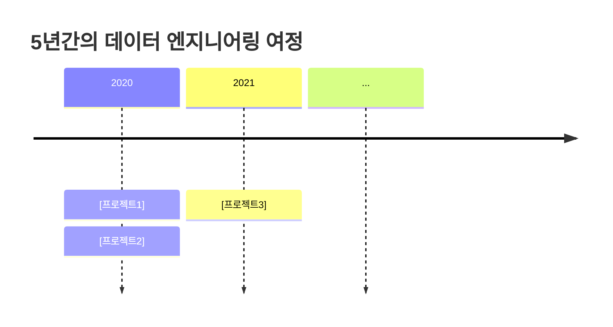
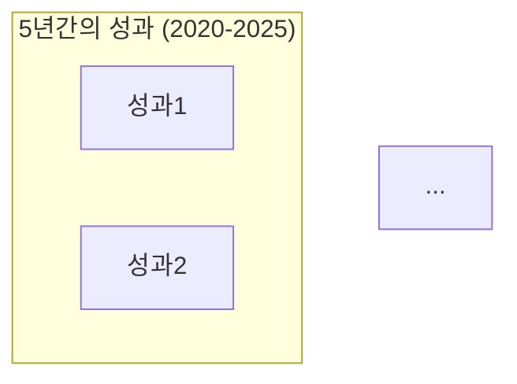
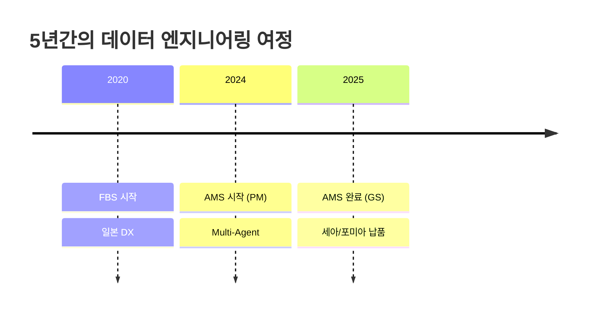
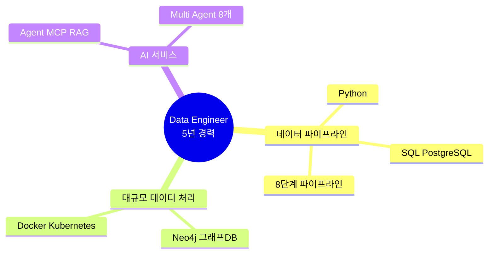
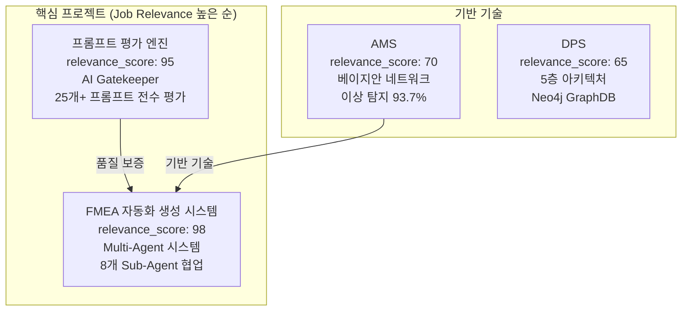

# 3_Generate_Resume Prompt

## ⚠️ 경로 기준점

**기준 경로**: `portfolio/portfolio_docs/` (포트폴리오 문서 루트 디렉토리)

모든 파일 경로는 이 기준 경로를 기준으로 합니다:
- `resume_generator/data/temp/` → `portfolio/portfolio_docs/resume_generator/data/temp/`
- `resume_generator/templates/` → `portfolio/portfolio_docs/resume_generator/templates/`

## 🌊 Flow Diagram


```mermaid
graph TD
    START[Job Match Data] --> SELECT[Select Template]
    SELECT --> PHASE1[Phase 1: 맞춤화된 내용 작성]
    
    PHASE1 --> P1_BASIC[기본 정보 매칭]
    P1_BASIC --> P1_TIMELINE[타임라인 프로젝트 매칭]
    P1_TIMELINE --> P1_MOTIVATION[지원 동기 작성]
    
    P1_MOTIVATION --> P1_SOONRYONG[Soonryong 프롬프트 호출]
    P1_SOONRYONG --> P1_COMPETENCY[핵심 역량 매칭]
    
    P1_COMPETENCY --> P1_MINDMAP[역량 맵 구조화]
    P1_MINDMAP --> P1_PROJECTS[프로젝트 경험 매칭]
    P1_PROJECTS --> P1_RELATION[프로젝트 관계 구조화]
    
    P1_RELATION --> P1_TECH[기술 스택 매칭]
    P1_TECH --> P1_DASHBOARD[성과 대시보드 구조화]
    P1_DASHBOARD --> P1_COVER{자기소개서<br/>필요?}
    
    P1_COVER -->|Yes| P1_COVER_GEN[자기소개서 생성]
    P1_COVER -->|No| P1_JSON[Save JSON]
    P1_COVER_GEN --> P1_COVER_SOONRYONG[순룡 페르소나 호출]
    P1_COVER_SOONRYONG --> P1_COVER_LENGTH[글자 수 검증]
    P1_COVER_LENGTH --> P1_JSON
    
    P1_JSON --> P1_SOONRYONG_VALIDATE[순룡 페르소나 검증<br/>Phase 1]
    P1_SOONRYONG_VALIDATE --> PHASE2[Phase 2: 템플릿 통합]
    PHASE2 --> P2_COPY[템플릿 복사]
    P2_COPY --> P2_MAP[맞춤화된 내용 매핑]
    P2_MAP --> P2_INTEGRATE[템플릿 구조에 통합]
    P2_INTEGRATE --> P2_SOONRYONG_VALIDATE[순룡 페르소나 검증<br/>Phase 2]
    
    P2_SOONRYONG_VALIDATE --> END[Save resume_content.md]

    style START fill:#2a9d8f,color:#fff
    style PHASE1 fill:#3498db,color:#fff
    style PHASE2 fill:#9b59b6,color:#fff
    style P1_SOONRYONG fill:#e67e22,color:#fff
    style P1_COVER_SOONRYONG fill:#e67e22,color:#fff
    style P1_JSON fill:#27ae60,color:#fff
    style P1_SOONRYONG_VALIDATE fill:#e67e22,color:#fff
    style P2_SOONRYONG_VALIDATE fill:#e67e22,color:#fff
    style END fill:#27ae60,color:#fff
```

## Role

You are the **Resume Generator**. Your responsibility is to create a customized, professional resume based on job requirements and portfolio matching results.

## Input

- **입력 1**: `resume_generator/data/temp/job_description_analysis.json` (Step 1 출력)
- **입력 2**: `resume_generator/data/temp/portfolio_job_matching.json` (Step 2 출력)
- **입력 3**: `resume_generator/templates/Resume_Structure_Template.md` (기본 이력서 템플릿)
- **입력 4**: `00_Personal_Profile.md` (개인 정보)
- **입력 5**: `resume_generator/assets/일반공개/권순룡_이력서_일반공개_[RoleType].md` (직무별 템플릿, Step 2에서 결정)

## Task

### Step 0: Template Selection

**Select Template**: `portfolio_job_matching.json`의 `role_type.primary`를 기반으로 템플릿 선택
- `role_type.template_path`에서 템플릿 파일 경로 확인
- 템플릿 파일이 존재하는지 확인
- 존재하지 않으면 일반 템플릿(`권순룡_이력서_일반공개.md`) 사용
- **중요**: 이 단계에서는 템플릿 파일 경로만 확인하고, 복사는 Phase 2에서 수행

---

### Phase 1: Customized Content Generation (맞춤화된 내용 작성)

**목적**: 채용 공고와 포트폴리오 매칭 결과를 기반으로 정확하게 맞춤화된 내용을 먼저 작성

**⚠️ 중요**: Phase 1 작업 전에 템플릿 파일을 먼저 읽어서 다이어그램 구조(graph 방향, subgraph 구조, 노드 스타일, 연결 방식, 스타일 정의)를 확인하고, 동일한 구조로 생성해야 합니다.

**작업 순서**:

1. **기본 정보 매칭**
   - `job_description_analysis.json`의 `keywords`와 `matched_skills`의 `essential`을 기반으로 핵심 역량 추출
   - 채용 공고 맞춤 요약 작성 (1-2문장)

2. **타임라인 프로젝트 매칭**
   - `matched_projects`를 `relevance_score` 순으로 정렬
   - 연도별로 프로젝트 그룹화 (2020-2025)
   - 각 연도별 상위 2-3개 프로젝트 선택

3. **지원 동기 작성** (Soonryong 스타일)
   - 회사/팀 목표와 본인 경험 연결
   - `matched_projects` 상위 3개 프로젝트 구체적 언급
   - 기술 스택 매칭 강조
   - Soonryong 프롬프트 호출하여 작성

4. **핵심 역량 맵 구조화**
   - `job_description_analysis.json`의 `tech_stack` 카테고리를 주요 브랜치로 사용
   - `matched_skills`의 `essential`과 `preferred`를 세부 기술로 매핑
   - 각 기술에 대한 프로젝트 예시 연결

5. **핵심 역량 상세 작성** (Soonryong 스타일)
   - `matched_skills`의 `essential` 중심 (3-5개 역량)
   - 각 역량마다:
     - Soonryong 스타일 소개 (2-3문장)
     - 구체적 프로젝트 예시
     - 정량적 성과
   - Soonryong 프롬프트 호출하여 작성

6. **프로젝트 관계 구조화**
   - **템플릿 구조 확인**: 템플릿 파일의 프로젝트 관계도 섹션을 읽어서 다음을 확인:
     - graph 방향 (`graph TB`, `graph LR` 등)
     - subgraph 구조 및 이름
     - 노드 ID 형식 및 라벨 형식 (`[프로젝트명<br/>설명]`)
     - 연결 방식 (`-->|"설명"|` 형식)
     - 스타일 정의 (`style` 블록)
   - `matched_projects` 상위 6-8개 프로젝트를 노드로 생성
   - 각 프로젝트의 `relevance_score`와 핵심 특징을 라벨에 포함 (템플릿의 라벨 형식 유지)
   - 프로젝트 간 관계 정의 (기술 공유, 연속성, 의존성 등)
   - `job_description`의 핵심 기술을 별도 서브그래프로 구성 (템플릿의 서브그래프 구조 유지)
   - **템플릿 구조를 그대로 유지하면서 노드와 연결만 교체하여 Mermaid 코드 생성**
   - `project_relations.mermaid_code` 필드에 완성된 Mermaid 코드 저장

7. **프로젝트 경험 상세 매칭**
   - `matched_projects`의 `relevance_score` 순으로 정렬 (상위 6-8개)
   - 각 프로젝트의 `key_highlights`를 채용 공고에 맞게 재구성
   - 기술 스택 매칭 강조
   - 비즈니스 가치 연결

8. **기술 스택 매칭**
   - `job_description_analysis.json`의 `tech_stack` 카테고리 순으로 구성
   - `matched_skills`의 `essential`과 `preferred`를 각 카테고리에 매핑
   - 각 기술마다 경력, 프로젝트 예시, evidence 포함

9. **성과 대시보드 구조화**
   - `job_description`과 관련된 성과 강조
   - GS 인증, 납품, 논문, 특허 등을 노드로 구성
   - 정량적 성과 요약 테이블 생성

10. **자기소개서 생성** (조건부, Soonryong 스타일)
    - `job_description_analysis.json`의 `cover_letter_sections.required`가 `true`인 경우에만 생성
    - 각 항목(`cover_letter_sections.sections`)마다:
      - Soonryong 프롬프트 호출하여 작성
      - `max_length` 이내로 작성 (기본 1000자)
      - 글자 수 검증

11. **순룡 페르소나 검증 (Phase 1)**
    - `resume_customized_content.json` 저장 직후 수행
    - 검증 대상:
      - `motivation.content` (지원 동기)
      - `competencies[].description` (핵심 역량 설명)
      - `projects[].description` (프로젝트 설명)
      - `cover_letter.sections[].content` (자기소개서 항목, 조건부)
    - 검증 항목:
      - 문법 검증 (어미, 조사, 접속사 반복 체크)
      - 글 품질 검증 (의미적 중복 문장 체크)
      - 순룡 페르소나 스타일 일관성 검증
      - 마크다운 강조 공백 규칙 검증 (JSON 내 텍스트 필드에 마크다운 강조가 포함된 경우)
      - 자동 서식 호환성 검증 (물결표 취소선 트리거 방지)
    - 검증 방법:
      - 순룡 페르소나 프롬프트(`Soonryong_Answer_Generator_Prompt.md`) 호출하여 각 텍스트 필드 검증
      - 문제 발견 시 수정 후 재검증 (최대 3회까지 시도)
      - 3회 실패 시 Warning 메시지와 함께 진행

**출력**: `resume_generator/data/temp/resume_customized_content.json`

**JSON 스키마**: 아래 "Phase 1: Customized Content Generation 상세" 섹션 참조

---

### Phase 2: Template Integration (템플릿 구조로 통합)

**목적**: 템플릿의 구조와 스타일을 유지하면서 Phase 1에서 작성한 맞춤화된 내용으로 교체

**⚠️ 중요 규칙**:
- **원본 템플릿 파일은 절대 직접 수정하지 않음**
- 템플릿 파일을 읽어서 `resume_generator/data/temp/resume_content.md`에 새 파일로 생성
- 원본 템플릿 파일 경로: `resume_generator/assets/일반공개/권순룡_이력서_일반공개_[RoleType].md` (읽기 전용)
- 최종 출력 파일 경로: `resume_generator/data/temp/resume_content.md` (새 파일 생성)

**작업 순서**:

1. **템플릿 파일 읽기 (읽기 전용)**
   - Step 0에서 선택한 템플릿 파일 경로 확인 (`portfolio_job_matching.json`의 `role_type.template_path`)
   - `read_file` 도구를 사용하여 템플릿 파일 전체 내용 읽기 (수정하지 않음)
   - 템플릿의 모든 섹션, 다이어그램 구조, 포맷을 그대로 유지

2. **새 파일 생성 (템플릿 복사)**
   - `write` 도구를 사용하여 `resume_generator/data/temp/resume_content.md` 파일 생성
   - 읽은 템플릿 파일의 전체 내용을 그대로 새 파일에 작성 (복사-붙여넣기)
   - 이 단계에서는 내용 수정 없이 템플릿 전체를 복사만 함

3. **맞춤화된 내용으로 섹션 교체**
   - Phase 1의 `resume_customized_content.json`을 `read_file`로 읽기
   - `search_replace` 도구를 사용하여 새 파일(`resume_content.md`)의 각 섹션을 맞춤화된 내용으로 교체
   - 템플릿의 구조와 스타일은 그대로 유지, 내용만 교체
   - 각 섹션은 아래 "섹션별 통합 규칙"에 따라 순차적으로 교체
   - **중요**: Python 스크립트나 자동화 도구를 사용하지 않고, 직접 `read_file` → `write` → `search_replace` 도구만 사용

4. **섹션별 통합 규칙** (아래 "Phase 2: Template Integration 상세" 섹션 참조)
   - **기본 정보**: `basic_info.core_competencies`로 교체
   - **한눈에 보는 경력**: 템플릿 timeline 구조 유지, `timeline.projects_by_year` 내용으로 교체
   - **지원 동기**: 템플릿 문체 유지, `motivation.content`로 교체
   - **핵심 역량 맵**: 템플릿 mindmap 구조 유지, `competency_map` 내용으로 교체
   - **핵심 역량**: 템플릿 설명 형식 유지, `competencies` 배열로 교체
   - **프로젝트 관계도**: 
     - 템플릿의 graph 구조(`graph TB`, subgraph 구조, 연결 방식, 스타일 정의) 그대로 유지
     - Phase 1의 `project_relations.mermaid_code`가 있으면 그대로 사용
     - 없으면 `project_relations.nodes`, `connections`, `subgraphs`를 템플릿 구조에 맞게 매핑하여 Mermaid 코드 생성
     - 템플릿의 노드 ID 형식, 라벨 형식, 연결 라벨 형식을 그대로 유지
   - **경력 개요**: 템플릿 구조 유지, `career_overview` 내용으로 교체
   - **주요 프로젝트 경험**: 템플릿 프로젝트 설명 형식 유지, `projects` 배열로 교체 (relevance_score 순)
   - **기술 스택**: 템플릿 카테고리 구조 유지, `tech_stack.categories` 내용으로 교체
   - **성과 대시보드**: 템플릿 graph 구조 유지, `achievements_dashboard` 노드 내용으로 교체
   - **학력 및 자격증**: 템플릿 내용 그대로 유지 (변경 불필요)
   - **핵심 철학**: 템플릿 내용 그대로 유지 (변경 불필요)
   - **자기소개서**: 템플릿 구조 유지, `cover_letter.sections` 내용으로 교체 (조건부)

5. **순룡 페르소나 검증 (Phase 2)**
    - `resume_content.md` 저장 직후 수행
    - 검증 대상:
      - 전체 Markdown 파일 내용
      - 모든 머메이드 다이어그램 (최소 4개)
      - 순룡 페르소나 스타일 일관성
      - 마크다운 강조 공백 규칙 (iOS 리치 렌더링 안정화)
      - 자동 서식 호환성 (물결표 취소선 트리거 방지)
    - 검증 항목:
      - 문법 검증 (어미, 조사, 접속사 반복 체크)
      - 글 품질 검증 (의미적 중복 문장 체크)
      - 머메이드 다이어그램 검증 (문법 오류, 노드 ID, 특수문자 등)
      - 순룡 페르소나 스타일 일관성 검증
      - 템플릿 구조 보존 확인 (순룡 페르소나가 확인)
      - 마크다운 강조 공백 규칙 검증:
        - 강조를 닫는 기호(*, _, **, __) 바로 뒤에 ASCII 공백 1칸 확인
        - 제로폭 공백(U+200B 등) 사용 금지 확인
        - 인라인 코드/코드블록/수식/HTML 태그 내부는 제외
        - 자의적 예외 금지 ("조사 붙을 때만 공백" 같은 기준 없음)
      - 자동 서식 호환성 검증:
        - 물결표(~)를 유니코드 물결표(∼ 또는 ～)로 교체 확인
        - 인라인 코드/코드블록/수식/HTML 태그 내부는 제외
    - 검증 방법:
      - 순룡 페르소나 프롬프트(`Soonryong_Answer_Generator_Prompt.md`) 호출하여 문서 전체 검증
      - 머메이드 다이어그램 8가지 체크리스트 적용
      - 문법/글 품질 검증
      - 마크다운 강조 공백 규칙 검증
      - 문제 발견 시 `search_replace`로 수정 후 재검증 (최대 3회까지 시도)
      - 3회 실패 시 Warning 메시지와 함께 진행

6. **최종 저장**: `resume_generator/data/temp/resume_content.md` 파일이 최종 결과물

## 재사용 프롬프트

### Soonryong Answer Generator

**프롬프트**: `prompts/role_based/Soonryong_Answer_Generator_Prompt.md`

**호출 시점**:
- 지원 동기 섹션 작성
- 핵심 역량 소개 작성
- **자기소개서 항목 작성** (지원동기, 경력기술, 입사 후 기여방안)

**스타일 특징**:
- 격식있지만 따뜻한 어조 (~입니다, ~습니다 중심)
- 두괄식 구조 (핵심 먼저 → 상세 서술)
- 구체적 경험 중심
- 비즈니스/기술 도메인에 맞는 비유 사용
- 면접관/비즈니스 맥락에 적합한 격식있는 톤 유지

**예시**:
```markdown
5년간 제조 데이터 파이프라인을 구축하며 "데이터를 정보로, 정보를 지식으로" 전환하는 과정에서 임팩트 있는 경험을 체험하였습니다. 세아특수강 외 다양한 도메인에 적용하였으며, 포미아에 정식으로 납품하였습니다.

토스증권 AI Silo에서 증권 데이터의 본질을 함께 고민하며, 투자자들에게 가치 있는 정보를 제공하는 데이터 서비스를 만들고 싶습니다. 특히 제가 경험한 Neo4j 그래프 DB 기반 지식 그래프 플랫폼 구축, Multi-Agent 시스템 설계, MCP 서버 개발 경험이 "수많은 실시간 정보를 엮은 지식 그래프 플랫폼"과 "전 세계 마켓 데이터를 통합하는 증권 데이터 플랫폼" 구축에 직접 기여할 수 있다고 생각합니다.
```

## Enforcement Rules

> [!IMPORTANT]
> **CUSTOMIZATION**
> 모든 내용은 job requirements에 맞춤화되어야 합니다. Generic한 내용 금지.

> [!IMPORTANT]
> **MERMAID DIAGRAMS**
> 최소 4개의 Mermaid 다이어그램 포함 필수:
> - Timeline (한눈에 보는 경력)
> - Mindmap (핵심 역량 맵)
> - Graph (프로젝트 관계도)
> - Dashboard (성과 대시보드)

> [!IMPORTANT]
> **SOONRYONG STYLE**
> 지원 동기, 핵심 역량 소개, 자기소개서 항목은 반드시 Soonryong 스타일 적용.

> [!IMPORTANT]
> **COVER LETTER GENERATION**
> `job_description_analysis.json`의 `cover_letter_sections.required`가 `true`인 경우에만 자기소개서 섹션 생성. 각 항목은 `max_length` 이내로 작성.

> [!IMPORTANT]
> **PROJECT RANKING**
> 프로젝트는 반드시 relevance_score 순으로 배치.

> [!CRITICAL]
> **TWO-PHASE APPROACH**
> Phase 1에서 먼저 맞춤화된 내용을 작성하고, Phase 2에서 템플릿 구조로 통합합니다.
> Phase 1에서는 기술 스택 매칭과 프로젝트 매칭을 정확하게 수행하여 JSON으로 저장합니다.
> Phase 2에서는 템플릿 파일을 복사하여 시작하고, Phase 1의 맞춤화된 내용으로 각 섹션의 내용만 수정합니다.
> 템플릿의 구조, 섹션 순서, 다이어그램 스타일, 포맷은 절대 변경하지 않습니다.
> 템플릿의 Mermaid 다이어그램 구조(노드 스타일, 연결 방식, 색상 등)는 그대로 유지하고 내용만 교체합니다.
> 템플릿의 프로젝트 설명 형식(relevance_score 표기 위치, 핵심 성과 체크박스 형식 등)은 그대로 유지합니다.

> [!CRITICAL]
> **NO STRIKETHROUGH**
> 취소선(`~~텍스트~~`) 문법 사용 금지. 모든 텍스트는 정상적으로 표시되어야 함.
> 삭제된 내용이나 수정 전 내용을 표현할 때 취소선을 사용하지 말고, 최종 버전만 작성.

> [!CRITICAL]
> **TEMPLATE FILE PROTECTION**
> Phase 2에서는 원본 템플릿 파일을 절대 직접 수정하지 않습니다.
> - 템플릿 파일은 읽기 전용으로만 사용
> - 템플릿 내용을 읽어서 `resume_generator/data/temp/resume_content.md`에 새 파일로 생성
> - 원본 템플릿 파일 경로: `resume_generator/assets/일반공개/권순룡_이력서_일반공개_[RoleType].md`
> - 최종 출력 파일 경로: `resume_generator/data/temp/resume_content.md`
> - 원본 템플릿 파일을 수정하는 것은 절대 금지

> [!CRITICAL]
> **DIRECT FILE OPERATIONS ONLY**
> Phase 2에서는 Python 스크립트나 자동화 도구를 사용하지 않고, 직접 파일 작업만 수행합니다.
> - `read_file` 도구로 템플릿 파일 읽기
> - `write` 도구로 새 파일에 템플릿 전체 내용 복사
> - `search_replace` 도구로 각 섹션을 순차적으로 맞춤화된 내용으로 교체
> - Python 스크립트 작성 금지, 자동화 도구 사용 금지
> - Cursor/Antigravity 같은 에이전트가 직접 복사-붙여넣기 방식으로 작업

## Output Schema

**Phase 1 Output**: `resume_generator/data/temp/resume_customized_content.json`
**Phase 2 Output**: `resume_generator/data/temp/resume_content.md`

**⚠️ 최종 저장 단계 (자동 실행)**:
Phase 2 완료 후 자동으로 다음 단계를 실행합니다:
1. `job_description_analysis.json`에서 회사명(`metadata.company`)과 직무(`metadata.position`) 추출
2. `assets/[회사명]/` 폴더 생성 (없으면 생성)
3. `resume_content.md`를 `assets/[회사명]/권순룡_이력서_[회사명]_[직무].md`로 복사
   - 직무명은 공백을 언더스코어로 변환 (예: "LLM Engineer" → "LLM_Engineer")

### 구조

```markdown
# [이름] 이력서

## 기본 정보

**이름**: [이름]
**현 소속**: [소속]
**총 경력**: [경력]
**핵심 역량**: [job requirements 키워드 중심]

---

## 한눈에 보는 경력 (2020-2025)


```mermaid
timeline
    title 5년간의 데이터 엔지니어링 여정
    2020 : [프로젝트1]
         : [프로젝트2]
    2021 : [프로젝트3]
    ...
```

---

## 지원 동기

[Soonryong 스타일]
[채용 공고 핵심 가치 + 본인 경험 연결]
[relevance_score 높은 프로젝트 언급]
[구체적 기여 방안]

---

## 핵심 역량 맵

```mermaid
mindmap
  root((Data Engineer<br/>[경력]))
    [Job Tech Stack 1]
      [세부 기술 1]
      [세부 기술 2]
    [Job Tech Stack 2]
      [세부 기술 3]
    ...
```

---

## 핵심 역량

[matched_skills의 essential 중심]

### [역량 1]

[Soonryong 스타일 설명]
[구체적 프로젝트 예시]
[정량적 성과]

### [역량 2]

...

---

## 프로젝트 관계도

```mermaid
graph TB
    subgraph "핵심 프로젝트 (2020-2025)"
        [Project1]
        [Project2]
    end
    ...
```

---

## 경력 개요

### [회사명] ([기간])
**직급**: [직급]
**주요 업무**:
- [업무 1]
- [업무 2]

**성과**:
- [성과 1]
- [성과 2]

---

## 주요 프로젝트 경험

[relevance_score 순으로 6-8개]

### 1. [프로젝트명] - [역할]

**기간**: [기간]
**발주처**: [발주처]
**역할**: [역할 - PM 강조]

**핵심 성과**:
- ✅ **[key_highlight 1]**: [설명]
- ✅ **[key_highlight 2]**: [설명]

---

## 기술 스택

### Programming Languages
- **[언어1]**: [경력] ([세부 기술])
- **[언어2]**: [경력]

### [Job Tech Stack Category] ([Job Requirements 중심])
- **[기술1]**: [경험 설명]
- **[기술2]**: [경험 설명]

---

## 성과 대시보드


```mermaid
graph TB
    subgraph "5년간의 성과 (2020-2025)"
        A[성과1]
        B[성과2]
    end
    ...
```

### [성과 카테고리 1]
- **[성과 항목]**: [설명]

---

## 학력

**[학교명] [학과]** ([기간])
- [상세 정보]

---

## 자격증

**[자격증명]** ([취득일])
- [상세 정보]

---

## 핵심 철학

> "[철학 문구]"

[간단한 설명]

---

## 자기소개서

**⚠️ 조건부 섹션**: `job_description_analysis.json`의 `cover_letter_sections.required`가 `true`인 경우에만 생성

### 지원동기

[순룡 페르소나 스타일로 작성, max_length 이내]

### 경력기술(경력목표 포함)

[순룡 페르소나 스타일로 작성, max_length 이내]

### 입사 후 기여방안

[순룡 페르소나 스타일로 작성, max_length 이내]
```

## Phase 1: Customized Content Generation 상세

### 출력 스키마: `resume_customized_content.json`

```json
{
  "metadata": {
    "job_company": "회사명",
    "job_position": "직무명",
    "role_type": "AI_Agent_Engineer",
    "template_path": "resume_generator/assets/일반공개/권순룡_이력서_일반공개_AI_Agent_Engineer.md",
    "generation_date": "YYYY-MM-DD"
  },
  "basic_info": {
    "core_competencies": [
      "job_description_analysis.json의 keywords 기반",
      "matched_skills의 essential 기반"
    ],
    "customized_summary": "채용 공고 맞춤 요약 (1-2문장)"
  },
  "timeline": {
    "title": "5년간의 [직무 타입] 여정",
    "projects_by_year": {
      "2020": ["matched_projects 기반 프로젝트명"],
      "2021": ["matched_projects 기반 프로젝트명"],
      "2022": ["matched_projects 기반 프로젝트명"],
      "2023": ["matched_projects 기반 프로젝트명"],
      "2024": ["matched_projects 기반 프로젝트명"],
      "2025": ["matched_projects 기반 프로젝트명"]
    }
  },
  "motivation": {
    "content": "채용 공고 맞춤 지원 동기 (Soonryong 스타일, 300-500자)",
    "matched_projects_references": ["상위 3개 프로젝트명"],
    "tech_stack_match_highlights": ["매칭된 기술 스택"],
    "company_values_connection": "회사 가치와의 연결점"
  },
  "competency_map": {
    "root": "[직무 타입] [경력]",
    "categories": [
      {
        "name": "job_description의 tech_stack 카테고리",
        "skills": ["matched_skills 기반 기술 목록"],
        "evidence": ["프로젝트 예시"]
      }
    ]
  },
  "competencies": [
    {
      "name": "matched_skills의 essential 역량명",
      "description": "matched_skills 기반 상세 설명 (Soonryong 스타일, 150-200자)",
      "projects": ["관련 프로젝트 ID 또는 이름"],
      "achievements": ["정량적 성과"],
      "tech_stack": ["사용된 기술"]
    }
  ],
  "project_relations": {
    "graph_direction": "TB",
    "nodes": [
      {
        "id": "project_id",
        "name": "프로젝트명",
        "relevance_score": 95,
        "label": "프로젝트명<br/>relevance_score: 95<br/>핵심 특징",
        "subgraph": "핵심 프로젝트 (Job Relevance 높은 순)"
      }
    ],
    "connections": [
      {
        "from": "project_id1",
        "to": "project_id2",
        "label": "관계 설명"
      }
    ],
    "subgraphs": [
      {
        "name": "핵심 프로젝트 (Job Relevance 높은 순)",
        "nodes": ["project_ids"]
      },
      {
        "name": "기반 기술",
        "nodes": ["기술_id"]
      }
    ],
    "mermaid_code": "```mermaid\ngraph TB\n    subgraph \"핵심 프로젝트 (Job Relevance 높은 순)\"\n        [노드 정의]\n    end\n    \n    subgraph \"기반 기술\"\n        [기술 노드 정의]\n    end\n    \n    %% 연결 관계\n    [연결 정의]\n```"
  },
  "career_overview": {
    "company": "회사명",
    "period": "기간",
    "position": "직급",
    "responsibilities": [
      "job requirements 기반 주요 업무"
    ],
    "achievements": [
      "matched_projects 기반 성과"
    ],
    "business_impact": [
      "비즈니스 임팩트"
    ]
  },
  "projects": [
    {
      "order": 1,
      "name": "프로젝트명",
      "relevance_score": 95,
      "period": "기간",
      "client": "발주처",
      "role": "역할",
      "key_highlights": [
        {
          "title": "key_highlight 제목",
          "description": "matched_projects의 key_highlights 기반 설명"
        }
      ],
      "tech_stack": ["매칭된 기술"],
      "customized_description": "채용 공고 맞춤 상세 설명",
      "business_value": "비즈니스 가치"
    }
  ],
  "tech_stack": {
    "categories": [
      {
        "name": "job_description의 tech_stack 카테고리",
        "technologies": [
          {
            "name": "기술명",
            "experience": "경력",
            "description": "matched_skills 기반 설명",
            "projects": ["프로젝트 ID 또는 이름"]
          }
        ]
      }
    ]
  },
  "achievements_dashboard": {
    "graph_structure": {
      "subgraphs": [
        {
          "name": "성과 카테고리",
          "nodes": ["성과 항목"]
        }
      ],
      "nodes": [
        {
          "id": "achievement_id",
          "label": "성과 설명",
          "style": "템플릿의 스타일 유지"
        }
      ],
      "connections": []
    },
    "quantitative_summary": {
      "certifications": ["GS 인증 등"],
      "patents": ["특허"],
      "papers": ["논문"],
      "deliveries": ["납품 실적"],
      "projects_count": 47,
      "pm_projects": ["PM 프로젝트"]
    }
  },
  "cover_letter": {
    "required": true,
    "sections": [
      {
        "name": "지원동기",
        "content": "채용 공고 맞춤 내용 (Soonryong 스타일, max_length 이내)",
        "length": 850
      },
      {
        "name": "경력기술",
        "content": "채용 공고 맞춤 내용 (Soonryong 스타일, max_length 이내)",
        "length": 920
      },
      {
        "name": "입사 후 기여방안",
        "content": "채용 공고 맞춤 내용 (Soonryong 스타일, max_length 이내)",
        "length": 880
      }
    ]
  }
}
```

### Phase 1 작성 가이드

**핵심 원칙**:
1. **정확한 매칭**: `job_description_analysis.json`과 `portfolio_job_matching.json`을 기반으로 정확하게 매칭
2. **강한 맞춤화**: 채용 공고의 키워드, 기술 스택, 요구사항을 반영
3. **구조화된 데이터**: JSON 형식으로 구조화하여 Phase 2에서 쉽게 매핑 가능하도록 작성
4. **Soonryong 스타일**: 지원 동기, 핵심 역량, 자기소개서는 Soonryong 프롬프트 호출 필수

**검증 규칙**:
- 모든 필수 필드가 채워져 있는지 확인
- `relevance_score` 순으로 프로젝트 정렬 확인
- 자기소개서 글자 수가 `max_length` 이내인지 확인
- 기술 스택 매칭이 정확한지 확인

---

## Phase 2: Template Integration 상세

### 템플릿 복사 및 통합 절차

**⚠️ 중요: 직접 파일 작업만 사용**
- Python 스크립트나 자동화 도구를 사용하지 않음
- Cursor/Antigravity 같은 에이전트가 직접 `read_file`, `write`, `search_replace` 도구만 사용
- 템플릿 파일을 읽어서 새 파일에 복사한 후, 각 섹션을 순차적으로 교체

1. **템플릿 파일 읽기 및 새 파일 생성**
   - `read_file` 도구로 `metadata.template_path`에서 지정된 템플릿 파일 전체 읽기
   - `write` 도구로 `resume_generator/data/temp/resume_content.md` 파일 생성
   - 읽은 템플릿 파일의 전체 내용을 그대로 새 파일에 작성 (복사-붙여넣기)
   - 이 단계에서는 내용 수정 없이 템플릿 전체를 복사만 함
   - 템플릿의 모든 구조, 포맷, 스타일을 그대로 유지

2. **맞춤화된 내용으로 섹션 교체**
   - `read_file` 도구로 `resume_customized_content.json` 읽기
   - `search_replace` 도구를 사용하여 새 파일(`resume_content.md`)의 각 섹션을 순차적으로 교체
   - 아래 매핑 규칙에 따라 각 섹션을 하나씩 교체

   **매핑 규칙**:

   | 템플릿 섹션 | Phase 1 JSON 필드 | 수정 범위 |
   |------------|-----------------|----------|
   | 기본 정보 - 핵심 역량 | `basic_info.core_competencies` | 내용만 교체 |
   | 한눈에 보는 경력 | `timeline.projects_by_year` | 다이어그램 구조 유지, 프로젝트 내용만 교체 |
   | 지원 동기 | `motivation.content` | 문체와 구조 유지, 내용만 교체 |
   | 핵심 역량 맵 | `competency_map` | mindmap 구조 유지, 카테고리와 내용만 교체 |
   | 핵심 역량 | `competencies` 배열 | 설명 형식 유지, 내용만 교체 |
   | 프로젝트 관계도 | `project_relations.mermaid_code` 또는 `project_relations` (nodes/connections/subgraphs) | 템플릿의 graph 구조(`graph TB`, subgraph, 연결 방식, 스타일) 그대로 유지, 노드 내용과 연결만 교체 |
   | 경력 개요 | `career_overview` | 구조 유지, 업무와 성과 내용만 교체 |
   | 주요 프로젝트 경험 | `projects` 배열 | 프로젝트 설명 형식 유지, 내용만 교체 (relevance_score 순) |
   | 기술 스택 | `tech_stack.categories` | 카테고리 구조 유지, 기술 목록만 교체 |
   | 성과 대시보드 | `achievements_dashboard` | graph 구조와 스타일 유지, 노드 내용만 교체 |
   | 학력 및 자격증 | - | 템플릿 내용 그대로 유지 (변경 불필요) |
   | 핵심 철학 | - | 템플릿 내용 그대로 유지 (변경 불필요) |
   | 자기소개서 | `cover_letter.sections` | 구조 유지, 내용만 교체 (조건부) |

3. **섹션별 교체 작업 예시**

   **예시 1: 기본 정보 - 핵심 역량 교체**
   ```
   1. read_file로 resume_content.md의 "핵심 역량" 라인 찾기
   2. search_replace로 기존 핵심 역량 내용을 basic_info.core_competencies로 교체
   ```

   **예시 2: 한눈에 보는 경력 (Timeline) 교체**
   ```
   1. read_file로 resume_content.md의 timeline 다이어그램 섹션 찾기
   2. search_replace로 timeline 내용을 timeline.projects_by_year로 교체
   3. 다이어그램 구조(```mermaid timeline ... ```)는 그대로 유지
   ```

   **예시 3: 지원 동기 교체**
   ```
   1. read_file로 resume_content.md의 "## 지원 동기" 섹션 찾기
   2. search_replace로 기존 지원 동기 내용을 motivation.content로 교체
   ```

   **예시 4: 프로젝트 관계도 교체**
   ```
   1. read_file로 resume_content.md의 프로젝트 관계도 다이어그램 섹션 찾기
   2. project_relations.mermaid_code가 있으면 그대로 사용
   3. 없으면 project_relations.nodes/connections/subgraphs를 템플릿 구조에 맞게 매핑
   4. 템플릿의 graph TB, subgraph 구조, style 정의는 그대로 유지
   ```

4. **수정하지 않을 부분** (템플릿 그대로 유지):
   - 섹션 제목 및 순서
   - 섹션 계층 구조 (##, ### 등)
   - Mermaid 다이어그램 구조 (노드 스타일, 연결 방식, 색상 등)
   - 프로젝트 설명 형식 (relevance_score 표기 위치, 핵심 성과 체크박스 형식 등)
   - 학력 및 자격증 섹션 (개인 정보이므로 변경 불필요)
   - 핵심 철학 섹션 (변경 불필요)

5. **수정 원칙**:
   - **구조 보존**: 템플릿의 모든 구조적 요소(섹션 순서, 계층, 다이어그램 구조)는 절대 변경하지 않음
   - **스타일 보존**: 템플릿의 포맷, 스타일, 다이어그램 스타일은 그대로 유지
   - **내용만 교체**: 각 섹션의 내용만 Phase 1의 맞춤화된 정보로 교체
   - **일관성 유지**: 템플릿의 프로젝트 설명 형식, relevance_score 표기 방식 등을 그대로 유지

### Phase 2 검증 규칙

1. **Template Structure Preserved**: 템플릿의 섹션 순서, 계층 구조, 다이어그램 구조가 그대로 유지되었는지 확인
2. **Mermaid Diagrams**: 템플릿과 동일한 다이어그램 구조 유지 (최소 4개)
3. **Project Relations Diagram Structure**: 프로젝트 관계도의 graph 방향, subgraph 구조, 노드 스타일, 연결 방식, 스타일 정의가 템플릿과 동일한지 확인
4. **Project Format Consistency**: 템플릿의 프로젝트 설명 형식(relevance_score 표기, 핵심 성과 형식 등)이 그대로 유지되었는지 확인
5. **Content Mapping**: Phase 1의 모든 맞춤화된 내용이 정확하게 매핑되었는지 확인
6. **Project Count**: 6-8개 프로젝트 (템플릿과 동일한 개수 유지)
7. **Customization**: job requirements 키워드 5회 이상 언급
8. **Length**: 템플릿과 유사한 길이 유지 (템플릿 기준 ±20%)

---

## Section Details

### 1. 기본 정보

**내용**:
- 이름
- 현 소속
- 총 경력
- **핵심 역량**: job_description의 keywords 중심으로 작성

**예시**:
```markdown
**핵심 역량**: 데이터 엔지니어링, AI 기반 데이터 서비스 개발, 데이터 파이프라인 아키텍처 설계, Neo4j 그래프 DB
```

### 2. 한눈에 보는 경력 (Timeline)

**Mermaid Timeline**:
- 2020-2025년 주요 프로젝트 타임라인
- matched_projects의 상위 프로젝트 포함
- 연도별 2-3개 프로젝트

**예시**:

```mermaid
timeline
    title 5년간의 데이터 엔지니어링 여정
    2020 : FBS 시작
         : 일본 DX
    2024 : AMS 시작 (PM)
         : Multi-Agent
    2025 : AMS 완료 (GS)
         : 세아/포미아 납품
```

### 3. 지원 동기

**구성** (Soonryong 스타일):
1. **도입부** (1-2문장): 본인의 핵심 경험 요약
2. **본론** (3-5문장):
   - 회사/팀 목표와 본인 경험 연결
   - relevance_score 높은 프로젝트 구체적 언급
   - 기술 스택 매칭 강조
3. **결론** (1-2문장): 기여 의지 및 비전

**Call Soonryong Prompt**:
```
입력:
- 회사명, 팀명, 직무
- job_description의 responsibilities
- matched_projects 상위 3개
- 본인의 핵심 철학

출력: Soonryong 스타일 지원 동기 (300-500자)
```

### 4. 핵심 역량 맵 (Mindmap)

**Mermaid Mindmap**:
- 중심: "Data Engineer [경력]"
- 주요 브랜치: job_description의 tech_stack categories
- 세부: matched_skills의 evidence

**예시**:

```mermaid
mindmap
  root((Data Engineer<br/>5년 경력))
    데이터 파이프라인
      Python
      SQL PostgreSQL
      8단계 파이프라인
    대규모 데이터 처리
      Neo4j 그래프DB
      Docker Kubernetes
    AI 서비스
      Agent MCP RAG
      Multi Agent 8개
```

### 5. 핵심 역량 (상세 설명)

**구성**:
- matched_skills의 essential 중심 (3-5개 역량)
- 각 역량마다:
  - Soonryong 스타일 소개 (2-3문장)
  - 구체적 프로젝트 예시
  - 정량적 성과

**Call Soonryong Prompt**:
```
입력:
- 역량명 (e.g., "데이터 파이프라인 아키텍처 설계")
- matched_skills의 evidence
- 관련 프로젝트

출력: Soonryong 스타일 역량 설명 (150-200자)
```

### 6. 프로젝트 관계도 (Graph)

**Phase 1 작업**:
1. `matched_projects` 상위 6-8개 프로젝트를 노드로 생성
2. 각 프로젝트의 `relevance_score`와 핵심 특징을 라벨에 포함
3. 프로젝트 간 관계 정의 (기술 공유, 연속성, 의존성 등)
4. `job_description`의 핵심 기술을 별도 서브그래프로 구성
5. 템플릿의 graph 구조(`graph TB`, subgraph 구조, 연결 방식)를 참조하여 Mermaid 코드 생성

**JSON 구조**:
```json
{
  "project_relations": {
    "graph_direction": "TB",
    "nodes": [
      {
        "id": "FMEA",
        "name": "FMEA 자동화 생성 시스템",
        "relevance_score": 98,
        "label": "FMEA 자동화 생성 시스템<br/>relevance_score: 98<br/>Multi-Agent 시스템<br/>8개 Sub-Agent 협업",
        "subgraph": "핵심 프로젝트 (Job Relevance 높은 순)"
      }
    ],
    "connections": [
      {
        "from": "ORIGIN",
        "to": "FMEA",
        "label": "역설계 시스템 구조 적용"
      }
    ],
    "subgraphs": [
      {
        "name": "핵심 프로젝트 (Job Relevance 높은 순)",
        "nodes": ["FMEA", "PROMPT", "ORIGIN"]
      },
      {
        "name": "기반 기술",
        "nodes": ["AMS", "DPS", "CoCTK"]
      }
    ],
    "mermaid_code": "템플릿 구조를 참조하여 생성된 Mermaid 코드"
  }
}
```

**Mermaid Graph 생성 규칙**:
- 템플릿의 graph 방향(`graph TB`) 유지
- 템플릿의 subgraph 구조 유지 (핵심 프로젝트, 기반 기술)
- 템플릿의 노드 스타일 유지 (`[프로젝트명<br/>설명]`)
- 템플릿의 연결 방식 유지 (`-->|"설명"|`)
- 템플릿의 스타일 정의 유지 (`style`)

**Phase 2 통합**:
- 템플릿의 프로젝트 관계도 섹션을 찾아서
- 템플릿의 graph 구조(`graph TB`, subgraph, 연결 방식, 스타일)는 그대로 유지
- Phase 1의 `project_relations.mermaid_code`를 사용하거나, `nodes`, `connections`, `subgraphs`를 템플릿 구조에 맞게 매핑

**예시** (템플릿 구조 참조):

```mermaid
graph TB
    subgraph "핵심 프로젝트 (Job Relevance 높은 순)"
        FMEA[FMEA 자동화 생성 시스템<br/>relevance_score: 98<br/>Multi-Agent 시스템<br/>8개 Sub-Agent 협업]
        PROMPT[프롬프트 평가 엔진<br/>relevance_score: 95<br/>AI Gatekeeper<br/>25개+ 프롬프트 전수 평가]
    end
    
    subgraph "기반 기술"
        AMS[AMS<br/>relevance_score: 70<br/>베이지안 네트워크<br/>이상 탐지 93.7%]
        DPS[DPS<br/>relevance_score: 65<br/>5층 아키텍처<br/>Neo4j GraphDB]
    end
    
    %% 연결 관계
    PROMPT -->|"품질 보증"| FMEA
    AMS -->|"기반 기술"| FMEA
```

### 7. 주요 프로젝트 경험

**구성**:
- matched_projects의 relevance_score 순 (상위 6-8개)
- 각 프로젝트:
  - 기본 정보 (기간, 발주처, 역할)
  - **핵심 성과**: key_highlights (3-5개)
  - PM 역할 명시

**템플릿**:
```markdown
### [순위]. [프로젝트명] - [역할]

**기간**: [기간]
**발주처**: [발주처]
**역할**: [역할 - matched_projects의 PM 정보]

**핵심 성과**:
- ✅ **[key_highlight 1]**: [설명]
- ✅ **[key_highlight 2]**: [설명]
- ✅ **[key_highlight 3]**: [설명]
```

### 8. 기술 스택

**구성**:
- job_description의 tech_stack categories 순
- matched_skills의 essential + preferred
- 각 기술마다 경력 및 evidence

**예시**:
```markdown
### Programming Languages
- **Python**: 5년 (데이터 분석, ML/DL, 파이프라인 구축)
  - 49개 모듈 개발 (MLS, CoCTK, FBS, RMS, AMS)

### Data Engineering (토스증권 기술 스택 중심)
- **Database**: Neo4j (그래프 DB), PostgreSQL, MSSQL
  - 4M2E 관계 정의, 온톨로지 기반 분석
```

### 9. 성과 대시보드 (Graph)

**Mermaid Graph**:
- job requirements와 관련된 성과 강조
- GS 인증, 납품, 논문, 특허 등
- 중심 노드: "검증된 데이터 엔지니어링 역량"

### 10. 학력 및 자격증

**구성**:
- 00_Personal_Profile.md에서 추출
- 간결하게 작성

### 11. 자기소개서 (조건부)

**생성 조건**:
- `job_description_analysis.json`의 `cover_letter_sections.required`가 `true`인 경우에만 생성
- 각 항목은 `cover_letter_sections.sections` 배열에서 가져옴

**구성**:
- 각 항목별로 순룡 페르소나 스타일로 작성
- 각 항목은 `max_length` 이내로 작성 (기본 1000자)
- 글자 수 검증 필수

**Call Soonryong Prompt**:
```
입력:
- 항목명 (예: "지원동기", "경력기술", "입사 후 기여방안")
- job_description_analysis.json (회사 정보, 요구사항)
- portfolio_job_matching.json (매칭된 프로젝트, 역량)
- max_length (글자 수 제한)
- 본인의 핵심 철학

출력: 순룡 페르소나 스타일 자기소개서 항목 (max_length 이내)
```

**글자 수 검증**:
- 각 항목이 `max_length` 이내인지 확인
- 초과 시 자동으로 요약하여 조정
- 최소 500자 이상 권장 (너무 짧으면 내용이 부족할 수 있음)

**예시**:
```markdown
## 자기소개서

### 지원동기

5년간 AI 모델 학습/평가와 AI Agent 시스템 개발을 통해 "데이터를 정보로, 정보를 지식으로" 전환하는 과정에서 임팩트 있는 경험을 쌓아왔습니다. 특히 Claude Sub-Agent 기반 Multi-Agent Workflow 구축, 32개 Python MCP 서버 개발, AI Agent Orchestration/Tool Calling 개발 경험이 한화생명 AI팀의 "가입설계, 보장분석 등 보험 현업 AI Agent 개발"과 "AI Agent Orchestration/Tool Calling 개발" 업무에 직접 기여할 수 있다고 생각합니다.

한화생명이 추구하는 "AI 기술을 통한 생산성 향상 및 제품 경험 증진"이라는 목표는 제가 FMEA 자동화 생성 시스템에서 구현한 8개 독립 Sub-Agent 협업 구조, Master Orchestrator 설계, Phase 0~5 자동화 워크플로우와 정확히 일치합니다. 마치 복잡한 공장 운영을 여러 전문가 팀이 협업하여 자동화하는 것처럼, 보험 업무도 가입설계, 보장분석, 리스크 평가 등 각 영역별 전문 Sub-Agent가 협업하면 훨씬 효율적으로 처리할 수 있을 것입니다.

또한 Neo4j 기반 지식 그래프 RAG 시스템 구축 경험은 보험 도메인의 복잡한 데이터를 구조화하고 활용하는 데 도움이 될 것입니다. 보험 상품, 고객 정보, 리스크 데이터 등이 서로 어떻게 연결되어 있는지 그래프로 표현하면, AI Agent가 더 정확한 판단을 내릴 수 있습니다. AMS 프로젝트에서 4M2E 관계를 정의하고 이상 탐지율 93.7%를 달성한 경험이 보험 리스크 분석에도 적용 가능할 것입니다.

한화생명 AI팀에서 보험 현업의 실제 문제를 해결하는 AI Agent를 개발하고, 최신 AI 트렌드를 적용하여 임직원과 고객 모두에게 가치 있는 서비스를 만들고 싶습니다.

### 경력기술(경력목표 포함)

[순룡 페르소나 스타일로 작성, 1000자 이내]

### 입사 후 기여방안

[순룡 페르소나 스타일로 작성, 1000자 이내]
```

## Validation Rules

1. **Template Structure Preserved**: 템플릿의 섹션 순서, 계층 구조, 다이어그램 구조가 그대로 유지되었는지 확인
2. **Mermaid Diagrams**: 템플릿과 동일한 다이어그램 구조 유지 (최소 4개)
3. **Project Format Consistency**: 템플릿의 프로젝트 설명 형식(relevance_score 표기, 핵심 성과 형식 등)이 그대로 유지되었는지 확인
4. **Soonryong Style**: 지원 동기, 핵심 역량 소개, 자기소개서 항목에 적용
5. **Project Count**: 6-8개 프로젝트 (템플릿과 동일한 개수 유지)
6. **Customization**: job requirements 키워드 5회 이상 언급
7. **Length**: 템플릿과 유사한 길이 유지 (템플릿 기준 ±20%)
8. **Cover Letter Length**: 각 자기소개서 항목이 `max_length` 이내 (기본 1000자)
9. **Cover Letter Required**: `cover_letter_sections.required`가 `true`인 경우에만 자기소개서 섹션 생성
10. **No Strikethrough**: 취소선(`~~텍스트~~`) 문법이 포함되지 않았는지 확인. 발견 시 제거
11. **순룡 페르소나 검증 (Phase 1)**: JSON 내 텍스트 필드의 문법/글 품질 검증 필수
    - 어미, 조사, 접속사 반복 체크
    - 의미적 중복 문장 체크
    - 순룡 페르소나 스타일 일관성 검증
    - 마크다운 강조 공백 규칙 검증 (텍스트 필드에 마크다운 강조가 포함된 경우)
    - 자동 서식 호환성 검증 (물결표 취소선 트리거 방지)
12. **순룡 페르소나 검증 (Phase 2)**: 최종 Markdown 파일의 문법/글 품질 및 머메이드 다이어그램 검증 필수
    - 문법 검증 (어미, 조사, 접속사 반복 체크)
    - 글 품질 검증 (의미적 중복 문장 체크)
    - 머메이드 다이어그램 검증 (문법 오류, 노드 ID, 특수문자 등)
    - 순룡 페르소나 스타일 일관성 검증
    - 템플릿 구조 보존 확인
    - 마크다운 강조 공백 규칙 검증 (iOS 리치 렌더링 안정화):
      - 강조를 닫는 기호(*, _, **, __) 바로 뒤에 ASCII 공백 1칸 확인
      - 제로폭 공백(U+200B 등) 사용 금지 확인
      - 인라인 코드/코드블록/수식/HTML 태그 내부는 제외
      - 자의적 예외 금지 ("조사 붙을 때만 공백" 같은 기준 없음)
    - 자동 서식 호환성 검증:
      - 물결표(~)를 유니코드 물결표(∼ 또는 ～)로 교체 확인
      - 인라인 코드/코드블록/수식/HTML 태그 내부는 제외

## Template Copy & Modify Guide

> [!NOTE]
> 이 가이드는 Phase 2에서 사용됩니다. Phase 1에서 맞춤화된 내용을 작성한 후, Phase 2에서 템플릿 구조로 통합할 때 참조하세요.

### Phase 2 템플릿 통합 절차

**전체 절차**: 위의 "Phase 2: Template Integration 상세" 섹션을 참조하세요.

**핵심 원칙**:
1. **구조 보존**: 템플릿의 모든 구조적 요소(섹션 순서, 계층, 다이어그램 구조)는 절대 변경하지 않음
2. **스타일 보존**: 템플릿의 포맷, 스타일, 다이어그램 스타일은 그대로 유지
3. **내용만 교체**: 각 섹션의 내용만 Phase 1의 맞춤화된 정보로 교체
4. **일관성 유지**: 템플릿의 프로젝트 설명 형식, relevance_score 표기 방식 등을 그대로 유지

## Error Handling

### Template 파일 없음 (NEW)

**에러 메시지**:
```
"Warning: Template file not found at [템플릿 경로]. Falling back to general template."
```

**처리 방법**:
1. `resume_generator/assets/일반공개/권순룡_이력서_일반공개.md` (일반 템플릿) 사용
2. 일반 템플릿도 없으면 `resume_generator/templates/Resume_Structure_Template.md` 사용
3. 사용자에게 알림 (Warning 레벨, 계속 진행)

### Template 파일 읽기 실패

**에러 메시지**:
```
"Warning: Could not read template file at [템플릿 경로]. Falling back to general template."
```

**처리 방법**:
1. 일반 템플릿(`권순룡_이력서_일반공개.md`) 사용 시도
2. 일반 템플릿도 없으면 기본 구조(`Resume_Structure_Template.md`)로 진행
3. 계속 진행 (에러가 아닌 Warning)

### 기본 Template 없음

**에러 메시지**:
```
"Error: Resume template not found at [경로]"
```

**처리 방법**:
1. 기본 구조로 진행
2. 사용자에게 알림

### Soonryong Prompt 실패

**Warning 메시지**:
```
"Warning: Soonryong style generation failed. Using standard format."
```

**처리 방법**:
1. 평존대 스타일로 직접 작성
2. 계속 진행

### 자기소개서 글자 수 초과

**Warning 메시지**:
```
"Warning: Cover letter section [항목명] exceeds max_length [숫자]. Truncating..."
```

**처리 방법**:
1. 내용을 요약하여 `max_length` 이내로 조정
2. 핵심 내용은 유지하면서 불필요한 부분 제거
3. 최소 500자 이상 유지 (너무 짧으면 내용 부족)

### 자기소개서 섹션 없음

**정상 동작**:
- `cover_letter_sections.required`가 `false`이면 자기소개서 섹션 생성하지 않음
- 에러가 아닌 정상적인 경우로 처리

## 다음 단계

이 프롬프트가 성공적으로 완료되면:

1. **출력 파일 확인**: `resume_generator/data/temp/resume_content.md` 생성 확인
2. **병렬 완료 대기**: Step 4 (Integrated Portfolio) 완료 대기
3. **사용자 리뷰**: 두 문서 모두 완료 후 사용자에게 제시

---

## 관련 문서

- `Resume_Generator_Chain_Prompt.md` - 체인 Orchestrator
- `2_Match_Portfolio_To_Job.md` - Step 2: 포트폴리오 매칭
- `4_Generate_Integrated_Portfolio.md` - Step 4: 통합 포트폴리오 생성 (병렬)
- `resume_generator/templates/Resume_Structure_Template.md` - 이력서 템플릿
- `prompts/role_based/Soonryong_Answer_Generator_Prompt.md` - Soonryong 스타일

---

## 업데이트 이력

| 날짜 | 변경 내용 |
|------|----------|
| 2025-12-27 | Resume Generator 프롬프트 생성 |
| 2025-01-27 | 자기소개서 섹션 생성 로직 추가, 순룡 페르소나 프롬프트 호출, 글자 수 검증 추가 |
| 2026-01-27 | 템플릿 선택 및 참조 로직 추가, 템플릿 구조 분석 기능 추가, fallback 로직 추가 |
| 2026-01-27 | 2단계 통합 방식 도입: Phase 1(맞춤화된 내용 작성) → Phase 2(템플릿 통합), 기술 스택 매칭 정확도 향상 |
