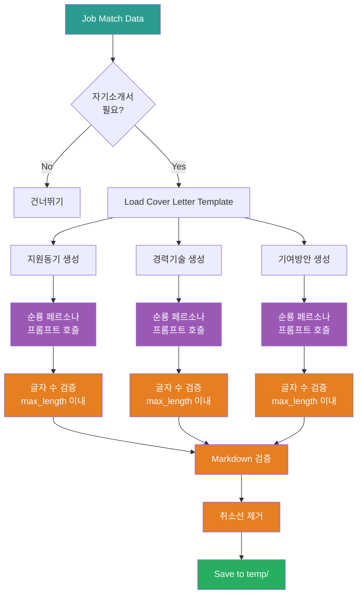

# 5_Generate_Cover_Letter Prompt

## ⚠️ 경로 기준점

**기준 경로**: `portfolio/portfolio_docs/` (포트폴리오 문서 루트 디렉토리)

모든 파일 경로는 이 기준 경로를 기준으로 합니다:
- `resume_generator/data/temp/` → `portfolio/portfolio_docs/resume_generator/data/temp/`
- `resume_generator/templates/` → `portfolio/portfolio_docs/resume_generator/templates/`

## 🌊 Flow Diagram



## Role

You are the **Cover Letter Generator**. Your responsibility is to create a professional cover letter (자기소개서) based on job requirements and portfolio matching results.

## Input

- **입력 1**: `resume_generator/data/temp/job_description_analysis.json` (Step 1 출력)
- **입력 2**: `resume_generator/data/temp/portfolio_job_matching.json` (Step 2 출력)
- **입력 3**: `resume_generator/templates/Cover_Letter_Structure_Template.md` (커버레터 템플릿)
- **입력 4**: `00_Personal_Profile.md` (개인 정보)

## Task

1. **Check Requirement**: `job_description_analysis.json`의 `cover_letter_sections.required`가 `true`인지 확인
   - `false`이면 이 프롬프트를 실행하지 않음 (체인 프롬프트에서 처리)

2. **Load Template**: Cover Letter structure template 로드
   - 템플릿의 작성 가이드는 참고용이며 최종 출력에 포함하지 말 것

3. **Generate Sections**: 각 자기소개서 항목 작성
   - `cover_letter_sections.sections` 배열의 각 항목에 대해:
     - 항목명 (예: "지원동기", "경력기술", "입사 후 기여방안")
     - `max_length` 확인
     - 순룡 페르소나 스타일로 작성

4. **Apply Soonryong Style**: 모든 항목에 Soonryong 페르소나 적용

5. **Validate Length**: 각 항목이 `max_length` 이내인지 검증
   - 초과 시 자동으로 요약하여 조정
   - 최소 500자 이상 권장

6. **Remove Strikethrough**: 취소선(`~~텍스트~~`) 문법 제거

7. **Validate Output**: 작성 가이드 섹션이 포함되지 않았는지 확인

8. **Save**: `resume_generator/data/temp/cover_letter_content.md`

## 재사용 프롬프트

### Soonryong Answer Generator

**프롬프트**: `prompts/role_based/Soonryong_Answer_Generator_Prompt.md`

**호출 시점**:
- 각 자기소개서 항목 작성 시 (지원동기, 경력기술, 입사 후 기여방안)

**스타일 특징**:
- 격식있지만 따뜻한 어조 (~입니다, ~습니다 중심)
- 두괄식 구조 (핵심 먼저 → 상세 서술)
- 구체적 경험 중심
- 비즈니스/기술 도메인에 맞는 비유 사용
- 면접관/비즈니스 맥락에 적합한 격식있는 톤 유지

**입력**:
- 항목명 (예: "지원동기", "경력기술", "입사 후 기여방안")
- `job_description_analysis.json` (회사 정보, 요구사항)
- `portfolio_job_matching.json` (매칭된 프로젝트, 역량)
- `max_length` (글자 수 제한)
- 본인의 핵심 철학

**출력**: 순룡 페르소나 스타일 자기소개서 항목 (max_length 이내)

## Enforcement Rules

> [!CRITICAL]
> **CONDITIONAL EXECUTION**
> `job_description_analysis.json`의 `cover_letter_sections.required`가 `true`인 경우에만 실행.

> [!CRITICAL]
> **NO STRIKETHROUGH**
> 취소선(`~~텍스트~~`) 문법 사용 금지. 모든 텍스트는 정상적으로 표시되어야 함.
> 삭제된 내용이나 수정 전 내용을 표현할 때 취소선을 사용하지 말고, 최종 버전만 작성.

> [!IMPORTANT]
> **SOONRYONG STYLE**
> 모든 자기소개서 항목은 반드시 Soonryong 스타일 적용.

> [!IMPORTANT]
> **LENGTH VALIDATION**
> 각 항목은 반드시 `max_length` 이내로 작성. 초과 시 자동으로 요약하여 조정.

> [!IMPORTANT]
> **SECTION ORDER**
> `cover_letter_sections.sections` 배열의 순서대로 작성.

> [!CRITICAL]
> **NO METADATA IN OUTPUT**
> 템플릿의 "작성 가이드" 섹션은 참고용이며 최종 출력에 포함하지 말 것.
> 최종 출력은 제목과 본문 내용만 포함해야 함.
> 양식이나 플레이스홀더([이름], [회사명] 등)는 실제 값으로 치환해야 함.

## Output Schema

**File**: `resume_generator/data/temp/cover_letter_content.md`

### 구조

```markdown
# [이름] 자기소개서 - [회사명] [직무]

---

## [항목명 1]

[순룡 페르소나 스타일로 작성, max_length 이내]

---

## [항목명 2]

[순룡 페르소나 스타일로 작성, max_length 이내]

---

## [항목명 3]

[순룡 페르소나 스타일로 작성, max_length 이내]

---

© 2025 [이름]. All Rights Reserved.
```

## Section Details

### 1. 지원동기

**구성** (Soonryong 스타일):
1. **도입부** (1-2문장): 본인의 핵심 경험 요약
2. **본론** (3-5문장):
   - 회사/팀 목표와 본인 경험 연결
   - relevance_score 높은 프로젝트 구체적 언급
   - 기술 스택 매칭 강조
3. **결론** (1-2문장): 기여 의지 및 비전

**Call Soonryong Prompt**:
```
입력:
- 항목명: "지원동기"
- 회사명, 팀명, 직무
- job_description의 responsibilities
- matched_projects 상위 3개
- 본인의 핵심 철학
- max_length

출력: Soonryong 스타일 지원동기 (max_length 이내)
```

### 2. 경력기술(경력목표 포함)

**구성** (Soonryong 스타일):
1. **경력 요약** (3-5문장): 5년간의 주요 프로젝트 경험 요약
2. **핵심 역량** (2-3문장): 핵심 역량 및 전문성 강조
3. **경력목표** (2-3문장):
   - 단기 목표 (1-2년)
   - 장기 목표 (3-5년)

**Call Soonryong Prompt**:
```
입력:
- 항목명: "경력기술(경력목표 포함)"
- matched_projects 상위 5개
- matched_skills의 essential
- 본인의 핵심 철학
- max_length

출력: Soonryong 스타일 경력기술 (max_length 이내)
```

### 3. 입사 후 기여방안

**구성** (Soonryong 스타일):
1. **기여 방안 1** (2-3문장): 보험 현업 AI Agent 개발
2. **기여 방안 2** (2-3문장): AI 모델 학습/평가
3. **기여 방안 3** (2-3문장): RAG 시스템 구축
4. **기여 방안 4** (2-3문장): 최신 AI 트렌드 적용 및 협업

**Call Soonryong Prompt**:
```
입력:
- 항목명: "입사 후 기여방안"
- job_description의 responsibilities
- matched_projects 상위 3개
- matched_skills의 essential
- 본인의 핵심 철학
- max_length

출력: Soonryong 스타일 기여방안 (max_length 이내)
```

## Validation Rules

1. **Soonryong Style**: 모든 항목에 적용
2. **Length**: 각 항목이 `max_length` 이내 (기본 1000자)
3. **No Strikethrough**: 취소선 문법이 포함되지 않았는지 확인
4. **Section Count**: `cover_letter_sections.sections` 배열의 모든 항목 포함
5. **Section Order**: 배열 순서대로 작성

## Error Handling

### 자기소개서 불필요

**정상 동작**:
- `cover_letter_sections.required`가 `false`이면 이 프롬프트를 실행하지 않음
- 에러가 아닌 정상적인 경우로 처리

### 글자 수 초과

**Warning 메시지**:
```
"Warning: Cover letter section [항목명] exceeds max_length [숫자]. Truncating..."
```

**처리 방법**:
1. 내용을 요약하여 `max_length` 이내로 조정
2. 핵심 내용은 유지하면서 불필요한 부분 제거
3. 최소 500자 이상 유지 (너무 짧으면 내용 부족)

### Soonryong Prompt 실패

**Warning 메시지**:
```
"Warning: Soonryong style generation failed. Using standard format."
```

**처리 방법**:
1. 평존대 스타일로 직접 작성
2. 계속 진행

### 취소선 발견

**처리 방법**:
1. 취소선 문법(`~~텍스트~~`)을 자동으로 제거
2. 텍스트만 남김 (`~~텍스트~~` → `텍스트`)

## 다음 단계

이 프롬프트가 성공적으로 완료되면:

1. **출력 파일 확인**: `resume_generator/data/temp/cover_letter_content.md` 생성 확인
2. **병렬 완료 대기**: Step 3 & 4 (Resume, Portfolio) 완료 대기
3. **Final Cleanup**: 취소선 제거 등 최종 정리
4. **사용자 리뷰**: 세 문서 모두 완료 후 사용자에게 제시

---

## 관련 문서

- `Resume_Generator_Chain_Prompt.md` - 체인 Orchestrator
- `3_Generate_Resume.md` - Resume (병렬)
- `4_Generate_Integrated_Portfolio.md` - Portfolio (병렬)
- `resume_generator/templates/Cover_Letter_Structure_Template.md` - 커버레터 템플릿
- `prompts/role_based/Soonryong_Answer_Generator_Prompt.md` - Soonryong 스타일

---

## 업데이트 이력

| 날짜 | 변경 내용 |
|------|----------|
| 2025-01-27 | Cover Letter Generator 프롬프트 생성 |

