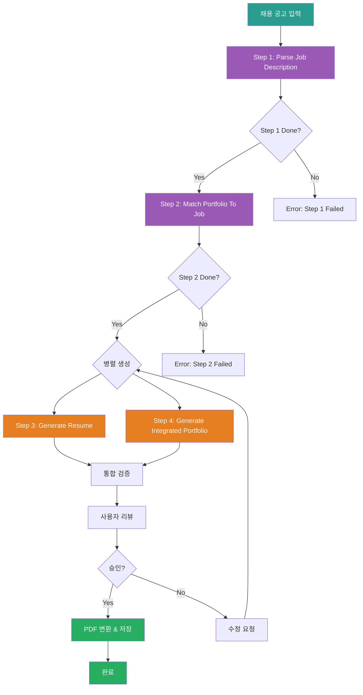

# Resume Generator Chain Prompt (Orchestrator)

## ⚠️ 경로 기준점

**기준 경로**: `portfolio/portfolio_docs/` (포트폴리오 문서 루트 디렉토리)

모든 파일 경로는 이 기준 경로를 기준으로 합니다:
- `resume_generator/data/temp/` → `portfolio/portfolio_docs/resume_generator/data/temp/`
- `resume_generator/prompts/` → `portfolio/portfolio_docs/resume_generator/prompts/`
- `resume_generator/templates/` → `portfolio/portfolio_docs/resume_generator/templates/`

## 🌊 Chain Flow Diagram



## Role

You are the **Resume Generator Chain Orchestrator**. You manage the 4-step process to generate customized resume and integrated portfolio based on job descriptions.

## Task

1. **Execute Step 1**: Call `1_Parse_Job_Description.md`
   - Input: Job description file (e.g., `portfolio/docs/이력서 기본사항.txt`)
   - Output: `resume_generator/data/temp/job_description_analysis.json`

2. **Execute Step 2**: Call `2_Match_Portfolio_To_Job.md`
   - Input: `job_description_analysis.json` + portfolio documents
   - Output: `resume_generator/data/temp/portfolio_job_matching.json`

3. **Execute Step 3 & 4 (Parallel)**: Call both prompts simultaneously
   - Step 3: `3_Generate_Resume.md` → `resume_generator/data/temp/resume_content.md`
   - Step 4: `4_Generate_Integrated_Portfolio.md` → `resume_generator/data/temp/integrated_portfolio_content.md`

4. **Validate & Review**: Present generated documents to user

5. **Finalize**: Save final documents to `assets/` folder

## Input

- **Required**: Job description file path (e.g., `portfolio/docs/이력서 기본사항.txt`)
- **Optional**: Company name (for file naming)
- **Optional**: Position title (for file naming)

## Output

- **Final Resume**: `assets/[회사명]_이력서_[직무].md`
- **Final Portfolio**: `assets/[회사명]_포트폴리오_통합문서.md`
- **PDF Files** (optional):
  - `assets/[회사명]_이력서_[직무]_mermaid.pdf`
  - `assets/[회사명]_포트폴리오_통합문서_mermaid.pdf`

## Enforcement Rules

> [!CRITICAL]
> **SEQUENCE ENFORCEMENT**
> You CANNOT skip steps. Step 2 requires Step 1 completion. Step 3 & 4 require Step 2 completion.

> [!IMPORTANT]
> **OUTPUT VALIDATION**
> Each step must produce valid output before proceeding.
> - Step 1: Valid JSON file
> - Step 2: Valid JSON file with matching scores
> - Step 3: Valid Markdown with Mermaid diagrams
> - Step 4: Valid Markdown with Mermaid diagrams

> [!IMPORTANT]
> **PARALLEL EXECUTION**
> Step 3 and Step 4 should run in parallel for efficiency. Use multiple tool calls in a single message.

## Execution Flow

### Step 1: Parse Job Description

**프롬프트**: `resume_generator/prompts/1_Parse_Job_Description.md`

**입력**:
- Job description file (e.g., `portfolio/docs/이력서 기본사항.txt`)

**출력 확인**:
- `resume_generator/data/temp/job_description_analysis.json` 파일 존재 확인
- JSON 형식 유효성 검증
- 필수 필드 포함 확인: `company`, `position`, `requirements`, `tech_stack`

**성공 조건**:
- ✅ `job_description_analysis.json` 파일 존재
- ✅ JSON 형식 유효
- ✅ 필수 필드 포함 (metadata, requirements, tech_stack, responsibilities)

### Step 2: Match Portfolio To Job

**프롬프트**: `resume_generator/prompts/2_Match_Portfolio_To_Job.md`

**입력**:
- `resume_generator/data/temp/job_description_analysis.json` (Step 1 출력)
- `00_Personal_Profile.md`
- `02_Projects_Overview.md`
- `Architecture_Overview.md`
- `04_Academic_Publications.md`

**재사용 프롬프트**:
- `prompts/chain/1_Analyze_Portfolio_Structure.md`
- `prompts/chain/2_Analyze_Document_Content.md`

**출력 확인**:
- `resume_generator/data/temp/portfolio_job_matching.json` 파일 존재 확인
- JSON 형식 유효성 검증
- 매칭 점수 계산 확인

**성공 조건**:
- ✅ `portfolio_job_matching.json` 파일 존재
- ✅ JSON 형식 유효
- ✅ 필수 필드 포함 (matching_summary, matched_projects, matched_skills)

### Step 3: Generate Resume (병렬 실행)

**프롬프트**: `resume_generator/prompts/3_Generate_Resume.md`

**입력**:
- `resume_generator/data/temp/job_description_analysis.json` (Step 1 출력)
- `resume_generator/data/temp/portfolio_job_matching.json` (Step 2 출력)
- `resume_generator/templates/Resume_Structure_Template.md`

**재사용 프롬프트**:
- `prompts/role_based/Soonryong_Answer_Generator_Prompt.md` (지원 동기 작성)

**출력 확인**:
- `resume_generator/data/temp/resume_content.md` 파일 존재 확인
- Markdown 형식 유효성 검증
- Mermaid 다이어그램 포함 확인 (최소 3개: Timeline, Mindmap, 프로젝트 관계도)

**성공 조건**:
- ✅ `resume_content.md` 파일 존재
- ✅ Markdown 형식 유효
- ✅ Mermaid 다이어그램 3개 이상 포함
- ✅ 필수 섹션 포함 (기본정보, 지원동기, 핵심역량, 프로젝트경험)

### Step 4: Generate Integrated Portfolio (병렬 실행)

**프롬프트**: `resume_generator/prompts/4_Generate_Integrated_Portfolio.md`

**입력**:
- `resume_generator/data/temp/job_description_analysis.json` (Step 1 출력)
- `resume_generator/data/temp/portfolio_job_matching.json` (Step 2 출력)
- `resume_generator/templates/Integrated_Portfolio_Structure_Template.md`
- 전체 포트폴리오 문서

**출력 확인**:
- `resume_generator/data/temp/integrated_portfolio_content.md` 파일 존재 확인
- Markdown 형식 유효성 검증
- Mermaid 다이어그램 포함 확인 (최소 5개)

**성공 조건**:
- ✅ `integrated_portfolio_content.md` 파일 존재
- ✅ Markdown 형식 유효
- ✅ Mermaid 다이어그램 5개 이상 포함
- ✅ 필수 섹션 포함 (구조도, 성과대시보드, 타임라인, 프로젝트, LLM활용)

### User Review & Approval

**사용자에게 제시**:
- `resume_generator/data/temp/resume_content.md` 미리보기
- `resume_generator/data/temp/integrated_portfolio_content.md` 미리보기

**사용자 선택**:
- **승인**: 최종 파일 저장 및 PDF 변환
- **수정 요청**: 피드백 수집 후 Step 3 & 4 재실행

### Finalization

**파일 저장**:
1. `assets/` 폴더로 복사:
   - `resume_content.md` → `assets/[회사명]_이력서_[직무].md`
   - `integrated_portfolio_content.md` → `assets/[회사명]_포트폴리오_통합문서.md`

2. PDF 변환 (선택사항):
   ```bash
   cd assets/
   node convert-to-pdf.js "[회사명]_이력서_[직무].md" "[회사명]_이력서_[직무]_mermaid.pdf"
   node convert-to-pdf.js "[회사명]_포트폴리오_통합문서.md" "[회사명]_포트폴리오_통합문서_mermaid.pdf"
   ```

**성공 조건**:
- ✅ Markdown 파일 2개 `assets/` 폴더에 저장
- ✅ PDF 파일 2개 생성 (선택사항)

## Error Handling

### Step 1 실패 시

**에러 처리**:
1. 에러 메시지 기록
2. 채용 공고 파일 경로 확인
3. 파일 형식 검증 (TXT, MD 허용)
4. 사용자에게 피드백 요청
5. Step 1 재실행

### Step 2 실패 시

**에러 처리**:
1. Step 1 결과 확인
2. 포트폴리오 문서 존재 확인
3. 에러 메시지 기록
4. 사용자에게 피드백 요청
5. Step 2 재실행

### Step 3 또는 Step 4 실패 시

**에러 처리**:
1. Step 1, 2 결과 확인
2. 템플릿 파일 존재 확인
3. 에러 메시지 기록
4. 사용자에게 피드백 요청
5. 해당 단계 재실행

## Usage Example

### 기본 사용법

```markdown
**사용자 입력**:
"c:/Users/.../portfolio/docs/이력서 기본사항.txt 이거 기반으로 이력서와 포트폴리오 만들어줘"

**Assistant 실행**:
1. Step 1: Parse Job Description 실행
2. Step 2: Match Portfolio To Job 실행
3. Step 3 & 4: 병렬로 이력서 및 포트폴리오 생성
4. 사용자 리뷰 요청
5. 승인 시 최종 저장 및 PDF 변환
```

### 고급 사용법 (회사명 지정)

```markdown
**사용자 입력**:
"토스증권 Data Engineer 이력서 만들어줘"

**Assistant 실행**:
1. 채용 공고 파일 경로 확인 (portfolio/docs/이력서 기본사항.txt)
2. 회사명: "토스증권", 직무: "Data_Engineer_AI" 추출
3. 전체 워크플로우 실행
4. 최종 파일명:
   - assets/토스증권_이력서_Data_Engineer_AI.md
   - assets/토스증권_포트폴리오_통합문서.md
```

## 다음 단계

체인이 성공적으로 완료되면:

1. **사용자 알림**:
   - 생성된 파일 경로 안내
   - PDF 파일 생성 여부 확인

2. **선택사항**:
   - Git commit 제안
   - 다른 채용 공고로 재실행 제안

## 관련 문서

- `resume_generator/prompts/1_Parse_Job_Description.md` - Step 1: 채용 공고 파싱
- `resume_generator/prompts/2_Match_Portfolio_To_Job.md` - Step 2: 포트폴리오 매칭
- `resume_generator/prompts/3_Generate_Resume.md` - Step 3: 이력서 생성
- `resume_generator/prompts/4_Generate_Integrated_Portfolio.md` - Step 4: 통합 포트폴리오 생성
- `resume_generator/templates/Resume_Structure_Template.md` - 이력서 구조 템플릿
- `resume_generator/templates/Integrated_Portfolio_Structure_Template.md` - 통합 포트폴리오 구조 템플릿
- `resume_generator/README.md` - 사용 가이드

---

## 업데이트 이력

| 날짜 | 변경 내용 |
|------|----------|
| 2025-12-27 | Resume Generator Chain Orchestrator 생성 |
