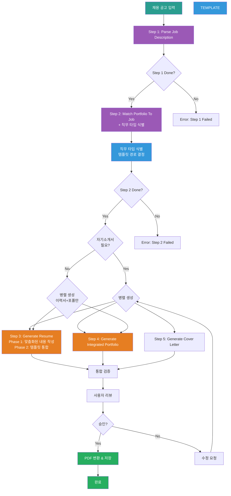

# Resume Generator Chain Prompt (Orchestrator)

## ⚠️ 경로 기준점

**기준 경로**: `portfolio/portfolio_docs/` (포트폴리오 문서 루트 디렉토리)

모든 파일 경로는 이 기준 경로를 기준으로 합니다:
- `resume_generator/data/temp/` → `portfolio/portfolio_docs/resume_generator/data/temp/`
- `resume_generator/prompts/` → `portfolio/portfolio_docs/resume_generator/prompts/`
- `resume_generator/templates/` → `portfolio/portfolio_docs/resume_generator/templates/`

## 🌊 Chain Flow Diagram


```mermaid
graph TD
    START[채용 공고 입력] --> STEP1[Step 1: Parse Job Description]
    STEP1 --> CHECK1{Step 1 Done?}
    CHECK1 -->|Yes| STEP2[Step 2: Match Portfolio To Job<br/>+ 직무 타입 식별]
    CHECK1 -->|No| ERROR1[Error: Step 1 Failed]

    STEP2 --> ROLE[직무 타입 식별<br/>템플릿 경로 결정]
    ROLE --> CHECK2{Step 2 Done?}
    CHECK2 -->|Yes| CHECK3{자기소개서<br/>필요?}
    CHECK2 -->|No| ERROR2[Error: Step 2 Failed]

    CHECK3 -->|Yes| PARALLEL{병렬 생성}
    CHECK3 -->|No| PARALLEL2{병렬 생성<br/>이력서+포폴만}

    PARALLEL --> STEP3A[Step 3: Generate Resume<br/>Phase 1: 맞춤화된 내용 작성<br/>Phase 2: 템플릿 통합]
    PARALLEL2 --> STEP3A
    PARALLEL --> STEP3B[Step 4: Generate Integrated Portfolio]
    PARALLEL --> STEP5[Step 5: Generate Cover Letter]

    PARALLEL2 --> STEP3B

    STEP3A --> MERGE[통합 검증]
    STEP3B --> MERGE
    STEP5 --> MERGE

    MERGE --> REVIEW[사용자 리뷰]
    REVIEW --> DECIDE{승인?}
    DECIDE -->|Yes| PDF[PDF 변환 & 저장]
    DECIDE -->|No| RETRY[수정 요청]
    RETRY --> PARALLEL

    PDF --> END[완료]

    style START fill:#2a9d8f,color:#fff
    style STEP1 fill:#9b59b6,color:#fff
    style STEP2 fill:#9b59b6,color:#fff
    style ROLE fill:#3498db,color:#fff
    style TEMPLATE fill:#3498db,color:#fff
    style STEP3A fill:#e67e22,color:#fff
    style STEP3B fill:#e67e22,color:#fff
    style PDF fill:#27ae60,color:#fff
    style END fill:#27ae60,color:#fff
```

## Role

You are the **Resume Generator Chain Orchestrator**. You manage the 5-step process to generate customized resume, integrated portfolio, and cover letter based on job descriptions.

## Task

1. **Execute Step 1**: Call `1_Parse_Job_Description.md`
   - Input: Job description file (e.g., `portfolio/docs/이력서 기본사항.txt`)
   - Output: `resume_generator/data/temp/job_description_analysis.json`

2. **Execute Step 2**: Call `2_Match_Portfolio_To_Job.md`
   - Input: `job_description_analysis.json` + portfolio documents
   - Output: `resume_generator/data/temp/portfolio_job_matching.json`
   - **NEW**: 직무 타입 식별 및 템플릿 경로 결정 (`role_type` 필드 포함)

3. **Execute Step 3, 4 & 5 (Parallel)**: Call prompts simultaneously
   - Step 3: `3_Generate_Resume.md` → `resume_generator/data/temp/resume_content.md`
     - **NEW**: `portfolio_job_matching.json`의 `role_type.template_path`에서 템플릿 선택
   - **NEW**: 선택된 템플릿 파일을 복사하여 시작
   - **NEW**: 템플릿의 구조와 스타일은 그대로 유지하고 내용만 수정
   - Step 4: `4_Generate_Integrated_Portfolio.md` → `resume_generator/data/temp/integrated_portfolio_content.md`
   - Step 5: `5_Generate_Cover_Letter.md` → `resume_generator/data/temp/cover_letter_content.md` (조건부: `cover_letter_sections.required`가 `true`일 때만)

4. **Final Cleanup**: Remove strikethrough and other unwanted markdown syntax from generated documents

5. **Validate & Review**: Present generated documents to user

6. **Finalize (자동 실행)**: Step 3과 Step 4가 완료되면 자동으로 최종 저장 단계를 실행합니다
   - **⚠️ 중요**: Step 3과 Step 4의 "최종 저장 단계"가 자동으로 실행되어야 합니다
   - 회사명 폴더 생성 (없으면 생성)
   - 파일 저장: `assets/[회사명]/권순룡_이력서_[회사명]_[직무].md`, `assets/[회사명]/권순룡_포트폴리오_[회사명]_[직무].md`
   - PDF 변환 (선택사항)

## Input

- **Required**: Job description file path (e.g., `portfolio/docs/이력서 기본사항.txt`)
- **Optional**: Company name (for file naming)
- **Optional**: Position title (for file naming)

## Output

- **Final Resume**: `assets/[회사명]/권순룡_이력서_[회사명]_[직무].md`
- **Final Portfolio**: `assets/[회사명]/권순룡_포트폴리오_[회사명]_[직무].md`
- **Final Cover Letter**: `assets/[회사명]/권순룡_자기소개서_[회사명]_[직무].md` (조건부)
- **PDF Files** (optional):
  - `assets/[회사명]/권순룡_이력서_[회사명]_[직무].pdf`
  - `assets/[회사명]/권순룡_포트폴리오_[회사명]_[직무].pdf`
  - `assets/[회사명]/권순룡_자기소개서_[회사명]_[직무].pdf` (조건부)

## Enforcement Rules

> [!CRITICAL]
> **SEQUENCE ENFORCEMENT**
> You CANNOT skip steps. Step 2 requires Step 1 completion. Step 3, 4, 5 require Step 2 completion.

> [!IMPORTANT]
> **OUTPUT VALIDATION**
> Each step must produce valid output before proceeding.
> - Step 1: Valid JSON file
> - Step 2: Valid JSON file with matching scores
> - Step 3: Valid Markdown with Mermaid diagrams
> - Step 4: Valid Markdown with Mermaid diagrams
> - Step 5: Valid Markdown (조건부: `cover_letter_sections.required`가 `true`일 때만)

> [!IMPORTANT]
> **PARALLEL EXECUTION**
> Step 3, 4, and 5 should run in parallel for efficiency. Use multiple tool calls in a single message.
> Step 5 is conditional: only execute if `cover_letter_sections.required` is `true`.

> [!CRITICAL]
> **AUTOMATIC FINALIZATION**
> Step 3과 Step 4가 완료되면 자동으로 최종 저장 단계를 실행해야 합니다.
> - Step 3 완료 후: `resume_content.md`를 `assets/[회사명]/권순룡_이력서_[회사명]_[직무].md`로 자동 복사
> - Step 4 완료 후: `integrated_portfolio_content.md`를 `assets/[회사명]/권순룡_포트폴리오_[회사명]_[직무].md`로 자동 복사
> - 회사명 폴더가 없으면 자동으로 생성
> - 이 단계는 Step 3과 Step 4의 일부로 자동 실행되어야 하며, 별도의 "Finalization" 단계를 기다리지 않습니다.

> [!CRITICAL]
> **FINAL CLEANUP**
> Step 3 & 4 완료 후 반드시 Final Cleanup 단계를 실행하여 취소선(`~~텍스트~~`) 및 기타 불필요한 마크다운 문법을 제거해야 함.

## Execution Flow

### Step 1: Parse Job Description

**프롬프트**: `resume_generator/prompts/1_Parse_Job_Description.md`

**입력**:
- Job description file (e.g., `portfolio/docs/이력서 기본사항.txt`)

**출력 확인**:
- `resume_generator/data/temp/job_description_analysis.json` 파일 존재 확인
- JSON 형식 유효성 검증
- 필수 필드 포함 확인: `company`, `position`, `requirements`, `tech_stack`

**성공 조건**:
- ✅ `job_description_analysis.json` 파일 존재
- ✅ JSON 형식 유효
- ✅ 필수 필드 포함 (metadata, requirements, tech_stack, responsibilities)

### Step 2: Match Portfolio To Job

**프롬프트**: `resume_generator/prompts/2_Match_Portfolio_To_Job.md`

**입력**:
- `resume_generator/data/temp/job_description_analysis.json` (Step 1 출력)
- `00_Personal_Profile.md`
- `02_Projects_Overview.md`
- `Architecture_Overview.md`
- `04_Academic_Publications.md`

**재사용 프롬프트**:
- `prompts/chain/1_Analyze_Portfolio_Structure.md`
- `prompts/chain/2_Analyze_Document_Content.md`

**주요 작업** (NEW):
1. 포트폴리오-채용 공고 매칭
2. **직무 타입 식별**: 채용 공고 분석하여 직무 타입 결정 (AI_Agent_Engineer, Data_Engineer, ML_Engineer, Fullstack_Engineer, Solutions_Architect, Technical_PM)
3. **템플릿 경로 결정**: 직무 타입에 맞는 템플릿 파일 경로 결정

**출력 확인**:
- `resume_generator/data/temp/portfolio_job_matching.json` 파일 존재 확인
- JSON 형식 유효성 검증
- 매칭 점수 계산 확인
- **role_type 필드 포함 확인** (NEW)

**성공 조건**:
- ✅ `portfolio_job_matching.json` 파일 존재
- ✅ JSON 형식 유효
- ✅ 필수 필드 포함 (matching_summary, matched_projects, matched_skills)
- ✅ **role_type 필드 포함** (primary, confidence, template_path) (NEW)

### Step 3: Generate Resume (병렬 실행)

**프롬프트**: `resume_generator/prompts/3_Generate_Resume.md`

**입력**:
- `resume_generator/data/temp/job_description_analysis.json` (Step 1 출력)
- `resume_generator/data/temp/portfolio_job_matching.json` (Step 2 출력, **role_type 포함**)
- `resume_generator/templates/Resume_Structure_Template.md` (기본 템플릿)
- **템플릿 파일**: `resume_generator/assets/일반공개/권순룡_이력서_일반공개_[RoleType].md` (Step 2에서 결정된 템플릿)

**재사용 프롬프트**:
- `prompts/role_based/Soonryong_Answer_Generator_Prompt.md` (지원 동기 작성)

**2단계 워크플로우** (NEW):

#### Phase 1: Customized Content Generation (맞춤화된 내용 작성)

**목적**: 채용 공고와 포트폴리오 매칭 결과를 기반으로 정확하게 맞춤화된 내용을 먼저 작성

**작업 내용**:
1. 기술 스택 매칭 기반 내용 작성
2. 프로젝트 매칭 기반 내용 작성
3. 채용 공고 맞춤화된 섹션 작성
4. Soonryong 스타일 적용 (지원 동기, 핵심 역량, 자기소개서)
5. temp JSON 파일에 구조화된 데이터로 저장

**출력**: `resume_generator/data/temp/resume_customized_content.json`

**검증**:
- ✅ JSON 형식 유효
- ✅ 모든 필수 필드 포함
- ✅ 기술 스택 매칭 정확도 확인
- ✅ 프로젝트 relevance_score 순 정렬 확인

#### Phase 2: Template Integration (템플릿 구조로 통합)

**목적**: 템플릿의 구조와 스타일을 유지하면서 Phase 1에서 작성한 맞춤화된 내용으로 교체

**작업 내용**:
1. **템플릿 선택**: `portfolio_job_matching.json`의 `role_type.template_path`에서 템플릿 파일 경로 확인
2. **템플릿 복사**: 선택된 템플릿 파일을 복사하여 작업 시작점으로 사용
3. **맞춤화된 내용 매핑**: Phase 1의 JSON 내용을 템플릿 구조에 맞게 매핑
4. **섹션별 통합**: 템플릿의 구조와 스타일은 그대로 유지하고, 내용만 Phase 1의 맞춤화된 정보로 교체

**템플릿 통합 원칙**:
- 템플릿 파일 전체를 복사하여 시작
- 템플릿의 섹션 구조, 순서, 계층은 절대 변경하지 않음
- 템플릿의 Mermaid 다이어그램 구조(노드 스타일, 연결 방식, 색상 등)는 그대로 유지하고 내용만 교체
- 템플릿의 프로젝트 설명 형식(relevance_score 표기 위치, 핵심 성과 체크박스 형식 등)은 그대로 유지
- 각 섹션의 내용만 Phase 1의 맞춤화된 정보로 교체

**Fallback 로직**:
- 템플릿 파일이 없거나 읽을 수 없는 경우 → 일반 템플릿(`권순룡_이력서_일반공개.md`) 사용
- 일반 템플릿도 없는 경우 → 기본 템플릿(`Resume_Structure_Template.md`) 사용

**출력 확인**:
- `resume_generator/data/temp/resume_customized_content.json` 파일 존재 확인 (Phase 1 출력)
- `resume_generator/data/temp/resume_content.md` 파일 존재 확인 (Phase 2 출력)
- Markdown 형식 유효성 검증
- Mermaid 다이어그램 포함 확인 (최소 4개: Timeline, Mindmap, 프로젝트 관계도, 성과 대시보드)
- 템플릿 구조 보존 확인

**성공 조건**:
- ✅ `resume_customized_content.json` 파일 존재 (Phase 1)
- ✅ `resume_content.md` 파일 존재 (Phase 2)
- ✅ Markdown 형식 유효
- ✅ Mermaid 다이어그램 4개 이상 포함
- ✅ 필수 섹션 포함 (기본정보, 지원동기, 핵심역량, 프로젝트경험)
- ✅ 템플릿 구조가 그대로 유지되고 내용만 수정됨
- ✅ 기술 스택 매칭 정확도 향상 확인

**⚠️ 최종 저장 단계 (자동 실행)**:
Phase 2 완료 후 자동으로 다음 단계를 실행합니다:
1. `job_description_analysis.json`에서 회사명(`metadata.company`)과 직무(`metadata.position`) 추출
2. `assets/[회사명]/` 폴더 생성 (없으면 생성)
3. `resume_content.md`를 `assets/[회사명]/권순룡_이력서_[회사명]_[직무].md`로 복사
   - 직무명은 공백을 언더스코어로 변환 (예: "LLM Engineer" → "LLM_Engineer")
4. 최종 저장 완료 확인

### Step 4: Generate Integrated Portfolio (병렬 실행)

**프롬프트**: `resume_generator/prompts/4_Generate_Integrated_Portfolio.md`

**입력**:
- `resume_generator/data/temp/job_description_analysis.json` (Step 1 출력)
- `resume_generator/data/temp/portfolio_job_matching.json` (Step 2 출력)
- `resume_generator/templates/Integrated_Portfolio_Structure_Template.md`
- 전체 포트폴리오 문서

**출력 확인**:
- `resume_generator/data/temp/integrated_portfolio_content.md` 파일 존재 확인
- Markdown 형식 유효성 검증
- Mermaid 다이어그램 포함 확인 (최소 5개)

**성공 조건**:
- ✅ `integrated_portfolio_content.md` 파일 존재
- ✅ Markdown 형식 유효
- ✅ Mermaid 다이어그램 5개 이상 포함
- ✅ 필수 섹션 포함 (구조도, 성과대시보드, 타임라인, 프로젝트, LLM활용)

**⚠️ 최종 저장 단계 (자동 실행)**:
포트폴리오 생성 완료 후 자동으로 다음 단계를 실행합니다:
1. `job_description_analysis.json`에서 회사명(`metadata.company`)과 직무(`metadata.position`) 추출
2. `assets/[회사명]/` 폴더 생성 (없으면 생성)
3. `integrated_portfolio_content.md`를 `assets/[회사명]/권순룡_포트폴리오_[회사명]_[직무].md`로 복사
   - 직무명은 공백을 언더스코어로 변환 (예: "LLM Engineer" → "LLM_Engineer")
4. 최종 저장 완료 확인

### Step 5: Generate Cover Letter (조건부 실행)

**프롬프트**: `resume_generator/prompts/5_Generate_Cover_Letter.md`

**실행 조건**:
- `job_description_analysis.json`의 `cover_letter_sections.required`가 `true`인 경우에만 실행

**입력**:
- `resume_generator/data/temp/job_description_analysis.json` (Step 1 출력)
- `resume_generator/data/temp/portfolio_job_matching.json` (Step 2 출력)
- `resume_generator/templates/Cover_Letter_Structure_Template.md`
- `00_Personal_Profile.md` (개인 정보)

**출력 확인**:
- `resume_generator/data/temp/cover_letter_content.md` 파일 존재 확인
- Markdown 형식 유효성 검증
- 각 항목이 `max_length` 이내인지 확인
- 취소선 문법이 포함되지 않았는지 확인

**성공 조건**:
- ✅ `cover_letter_content.md` 파일 존재
- ✅ Markdown 형식 유효
- ✅ 모든 항목이 `max_length` 이내
- ✅ 취소선 문법 없음
- ✅ 순룡 페르소나 스타일 적용됨

### Final Cleanup (최종 정리)

**생성된 마크다운 파일에서 자동으로 제거**:
1. 취소선 문법 (`~~텍스트~~` → `텍스트`)
2. 작성 가이드 섹션 (## 작성 가이드 ~ ---)
3. 빈 줄 3개 이상 연속 → 2개로 통일
4. 불필요한 공백 제거
5. 마크다운 문법 오류 수정

**처리 파일**:
- `resume_generator/data/temp/resume_content.md`
- `resume_generator/data/temp/integrated_portfolio_content.md`
- `resume_generator/data/temp/cover_letter_content.md` (조건부)

**성공 조건**:
- ✅ 취소선 문법이 모두 제거됨
- ✅ 작성 가이드 섹션이 제거됨
- ✅ 문서 형식이 정리됨
- ✅ 불필요한 공백이 제거됨

### User Review & Approval

**사용자에게 제시**:
- `resume_generator/data/temp/resume_content.md` 미리보기 (정리 후)
- `resume_generator/data/temp/integrated_portfolio_content.md` 미리보기 (정리 후)
- `resume_generator/data/temp/cover_letter_content.md` 미리보기 (정리 후, 조건부)

**사용자 선택**:
- **승인**: 최종 파일 저장 및 PDF 변환
- **수정 요청**: 피드백 수집 후 Step 3, 4, 5 재실행

### Finalization

**파일 저장**:
1. **회사명 폴더 생성**: `assets/[회사명]/` 폴더가 없으면 생성
   - 회사명은 `job_description_analysis.json`의 `company` 필드에서 가져옴
   
2. `assets/[회사명]/` 폴더로 복사:
   - `resume_content.md` → `assets/[회사명]/권순룡_이력서_[회사명]_[직무].md`
   - `integrated_portfolio_content.md` → `assets/[회사명]/권순룡_포트폴리오_[회사명]_[직무].md`
   - `cover_letter_content.md` → `assets/[회사명]/권순룡_자기소개서_[회사명]_[직무].md` (조건부)

3. PDF 변환 (선택사항):
   ```bash
   cd assets/[회사명]/
   node ../convert-to-pdf.js "권순룡_이력서_[회사명]_[직무].md" "권순룡_이력서_[회사명]_[직무].pdf"
   node ../convert-to-pdf.js "권순룡_포트폴리오_[회사명]_[직무].md" "권순룡_포트폴리오_[회사명]_[직무].pdf"
   node ../convert-to-pdf.js "권순룡_자기소개서_[회사명]_[직무].md" "권순룡_자기소개서_[회사명]_[직무].pdf"  # 조건부
   ```

**성공 조건**:
- ✅ 회사명 폴더 생성 (`assets/[회사명]/`)
- ✅ Markdown 파일 2-3개 `assets/[회사명]/` 폴더에 저장 (커버레터는 조건부)
- ✅ PDF 파일 2-3개 생성 (선택사항, 커버레터는 조건부)

## Error Handling

### Step 1 실패 시

**에러 처리**:
1. 에러 메시지 기록
2. 채용 공고 파일 경로 확인
3. 파일 형식 검증 (TXT, MD 허용)
4. 사용자에게 피드백 요청
5. Step 1 재실행

### Step 2 실패 시

**에러 처리**:
1. Step 1 결과 확인
2. 포트폴리오 문서 존재 확인
3. 에러 메시지 기록
4. 사용자에게 피드백 요청
5. Step 2 재실행

### Step 3 또는 Step 4 실패 시

**에러 처리**:
1. Step 1, 2 결과 확인
2. 템플릿 파일 존재 확인
3. 에러 메시지 기록
4. 사용자에게 피드백 요청
5. 해당 단계 재실행

## Usage Example

### 기본 사용법

```markdown
**사용자 입력**:
"c:/Users/.../portfolio/docs/이력서 기본사항.txt 이거 기반으로 이력서와 포트폴리오 만들어줘"

**Assistant 실행**:
1. Step 1: Parse Job Description 실행
2. Step 2: Match Portfolio To Job 실행
3. Step 3 & 4: 병렬로 이력서 및 포트폴리오 생성
4. 사용자 리뷰 요청
5. 승인 시 최종 저장 및 PDF 변환
```

### 고급 사용법 (회사명 지정)

```markdown
**사용자 입력**:
"토스증권 Data Engineer 이력서 만들어줘"

**Assistant 실행**:
1. 채용 공고 파일 경로 확인 (portfolio/docs/이력서 기본사항.txt)
2. 회사명: "토스증권", 직무: "Data_Engineer_AI" 추출
3. 전체 워크플로우 실행
4. 최종 파일명:
   - assets/토스증권/권순룡_이력서_토스증권_Data_Engineer_AI.md
   - assets/토스증권/권순룡_포트폴리오_토스증권_Data_Engineer_AI.md
```

## 다음 단계

체인이 성공적으로 완료되면:

1. **사용자 알림**:
   - 생성된 파일 경로 안내
   - PDF 파일 생성 여부 확인

2. **선택사항**:
   - Git commit 제안
   - 다른 채용 공고로 재실행 제안

## 관련 문서

- `resume_generator/prompts/1_Parse_Job_Description.md` - Step 1: 채용 공고 파싱
- `resume_generator/prompts/2_Match_Portfolio_To_Job.md` - Step 2: 포트폴리오 매칭
- `resume_generator/prompts/3_Generate_Resume.md` - Step 3: 이력서 생성
- `resume_generator/prompts/4_Generate_Integrated_Portfolio.md` - Step 4: 통합 포트폴리오 생성
- `resume_generator/templates/Resume_Structure_Template.md` - 이력서 구조 템플릿
- `resume_generator/templates/Integrated_Portfolio_Structure_Template.md` - 통합 포트폴리오 구조 템플릿
- `resume_generator/README.md` - 사용 가이드

---

## 업데이트 이력

| 날짜 | 변경 내용 |
|------|----------|
| 2025-12-27 | Resume Generator Chain Orchestrator 생성 |
| 2026-01-27 | 템플릿 참조 시스템 추가: Step 2에 직무 타입 식별, Step 3에 템플릿 선택 및 참조 로직 추가 |
| 2026-01-27 | Step 3을 2단계 방식으로 개선: Phase 1(맞춤화된 내용 작성) → Phase 2(템플릿 통합), 기술 스택 매칭 정확도 향상 |
