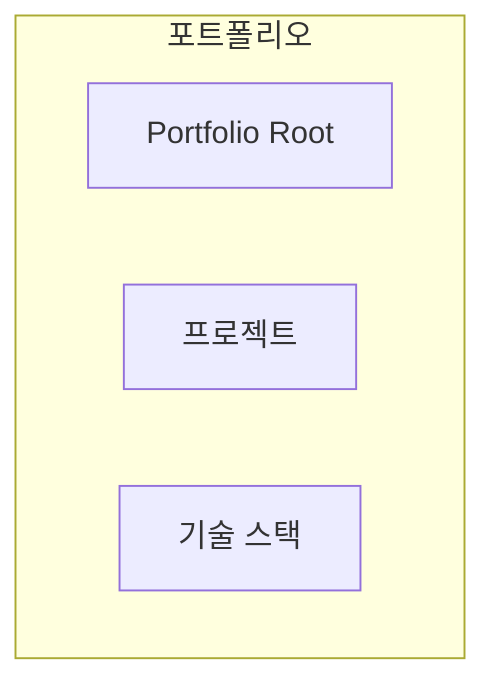
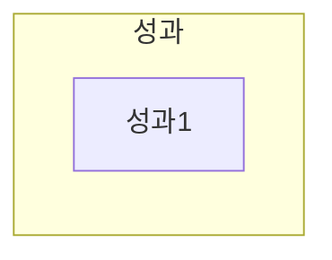
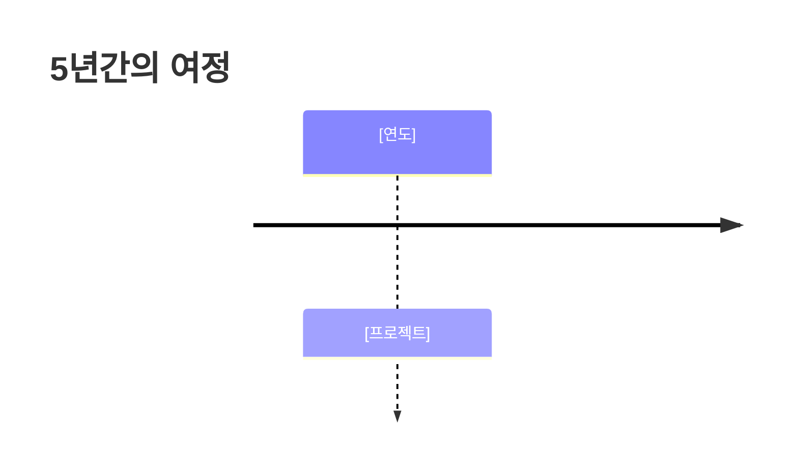
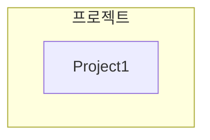
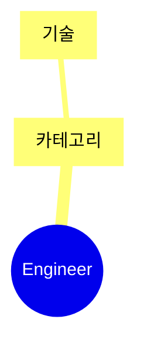

# [이름] 포트폴리오

> **"[핵심 철학]"**

---

## 📌 기본 정보

**이름**: [이름]
**GitHub**: [GitHub URL]

---

## 📊 포트폴리오 구조 (한눈에 보기)

---

## 🎯 핵심 성과 대시보드

| 분류 | 지표 | 상세 |
|:---|---:|:---|
| **성과** | 수치 | 설명 |

---

## 📅 경력 타임라인 (2020-2025)

---

## 🏆 주요 프로젝트 (20개+)

### 프로젝트 관계도

### 1. [프로젝트명] - 총괄 PM

**기간**: [기간]
**역할**: [역할]

**핵심 성과**:
- ✅ [성과]

---

## 💻 기술 스택 맵

---

## 📚 학술 성과

| 발행일 | 논문 제목 | 학술지/학회 |
|:---|:---|:---|
| [날짜] | [제목] | [학회] |

---

## 🤖 LLM 활용 방법

### Agent/MCP/RAG 시스템

[상세 설명]

---

## 🔗 관련 링크

- **GitHub**: [URL]
- **문서**: [URL]

---

© 2025 [이름]. All Rights Reserved.
