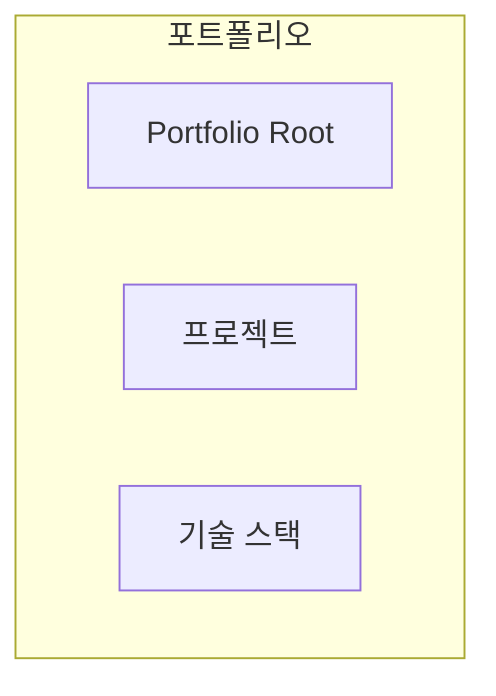
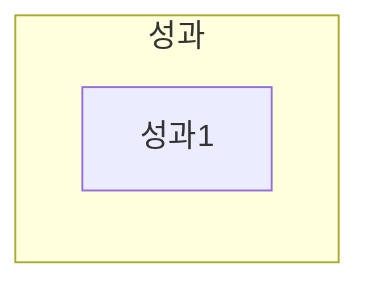
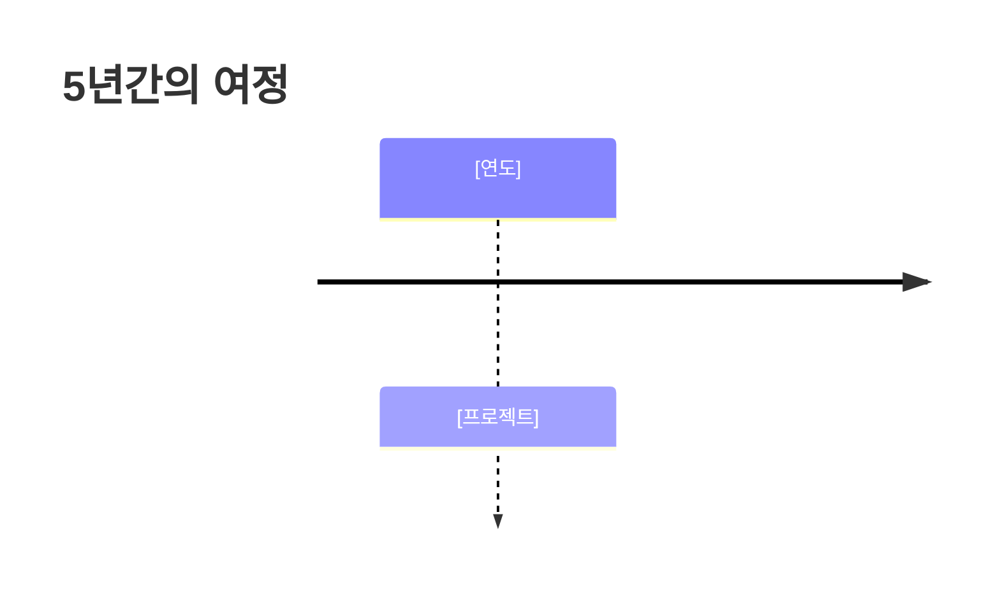
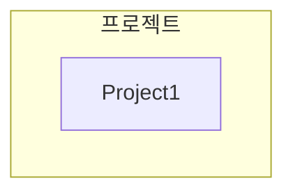
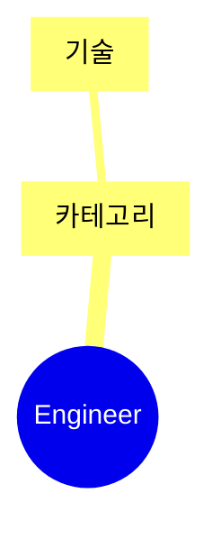

# [이름] 포트폴리오

> **"[핵심 철학]"**

## 작성 가이드

⚠️ **중요 사항**:
- 취소선(`~~텍스트~~`) 문법 사용 금지
- 모든 내용은 최종 버전만 작성
- 삭제된 내용이나 수정 전 내용을 표현하지 않음
- 하나의 연속된 문서로 작성 (페이지 구분 없음)

---

## 📌 기본 정보

**이름**: [이름]
**GitHub**: [GitHub URL - personal_info.json에서 가져오기]

---

## 📊 포트폴리오 구조 (한눈에 보기)

```mermaid
graph TB
    subgraph "포트폴리오"
        Root[Portfolio Root]
        Projects[프로젝트]
        Tech[기술 스택]
    end
```

---

## 🎯 핵심 성과 대시보드

```mermaid
graph LR
    subgraph "성과"
        A[성과1]
    end
```

| 분류 | 지표 | 상세 |
|:---|---:|:---|
| **성과** | 수치 | 설명 |

---

## 📅 경력 타임라인 (2020-2025)

```mermaid
timeline
    title 5년간의 여정
    [연도] : [프로젝트]
```

---

## 🏆 주요 프로젝트 (20개+)

### 프로젝트 관계도

```mermaid
graph TB
    subgraph "프로젝트"
        P1[Project1]
    end
```

### 1. [프로젝트명] - 총괄 PM

**기간**: [기간]
**역할**: [역할]

**핵심 성과**:
- ✅ [성과]

---

## 💻 기술 스택 맵

```mermaid
mindmap
  root((Engineer))
    [카테고리]
      [기술]
```

---

## 📚 학술 성과

| 발행일 | 논문 제목 | 학술지/학회 |
|:---|:---|:---|
| [날짜] | [제목] | [학회] |

---

## 🤖 LLM 활용 방법

### Agent/MCP/RAG 시스템

[상세 설명]

---

## 🔗 관련 링크

- **메인 레포지토리**: [personal_info.json의 github.main_repository]
- **포트폴리오 문서**: [personal_info.json의 github.portfolio_docs]
- **GitHub 프로필**: [personal_info.json의 github.profile]

---

© 2025 [이름]. All Rights Reserved.
