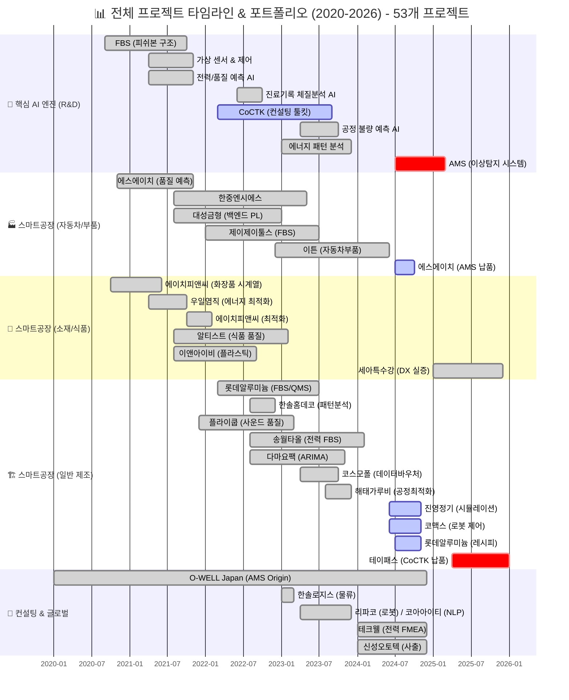
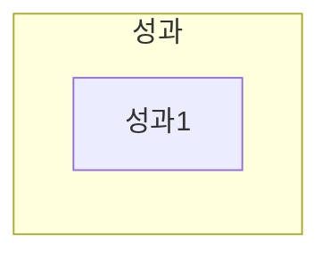
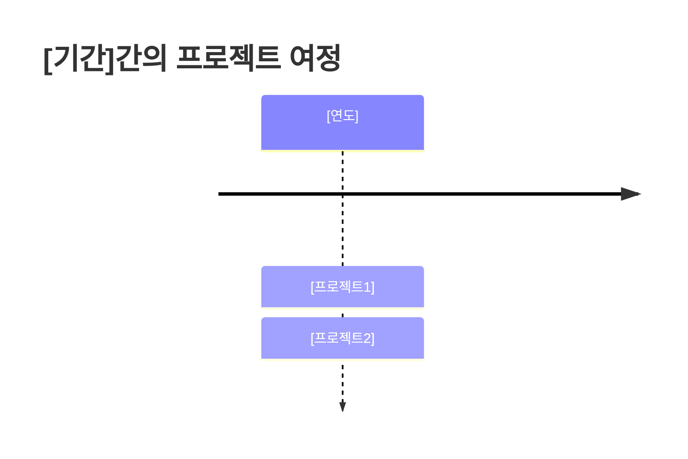
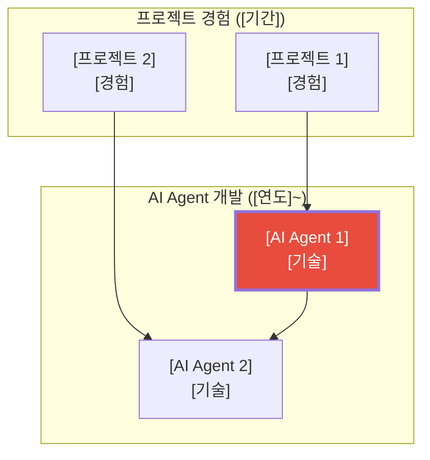
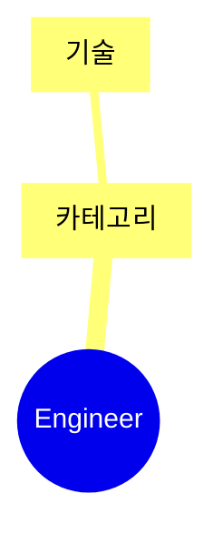
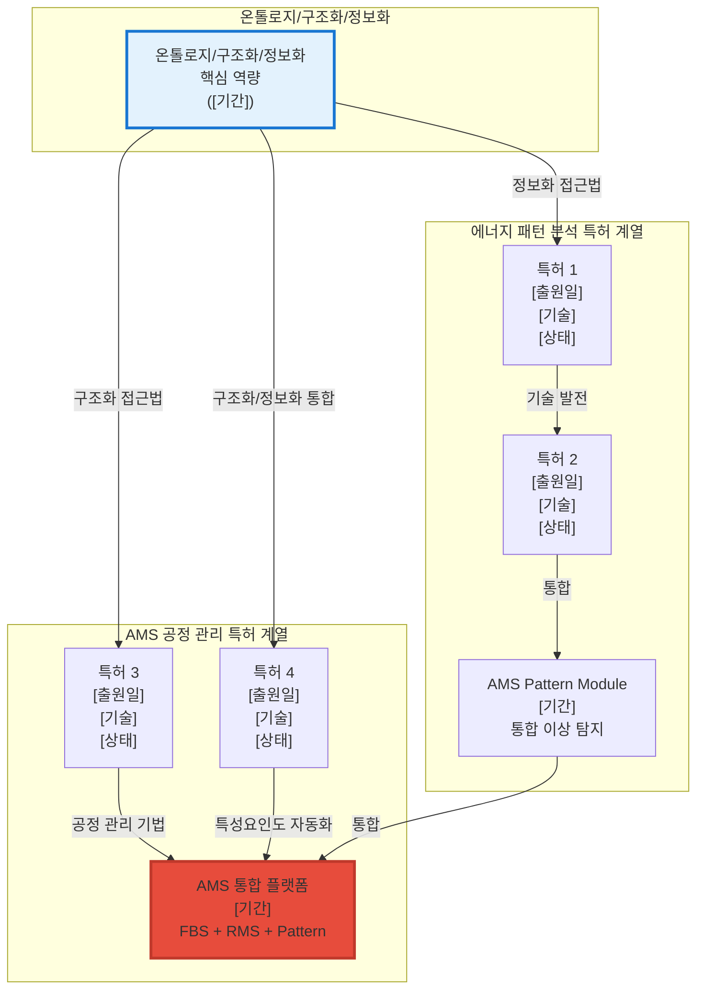
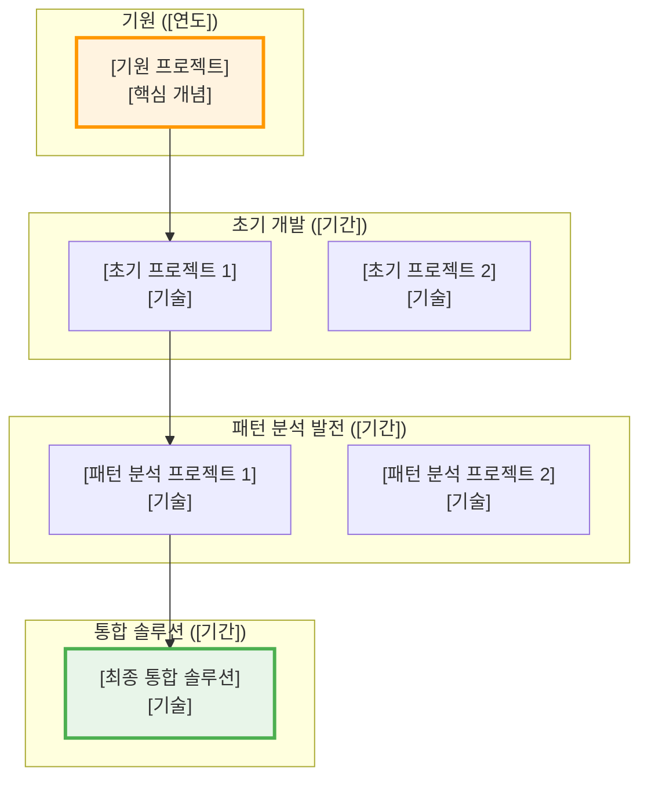
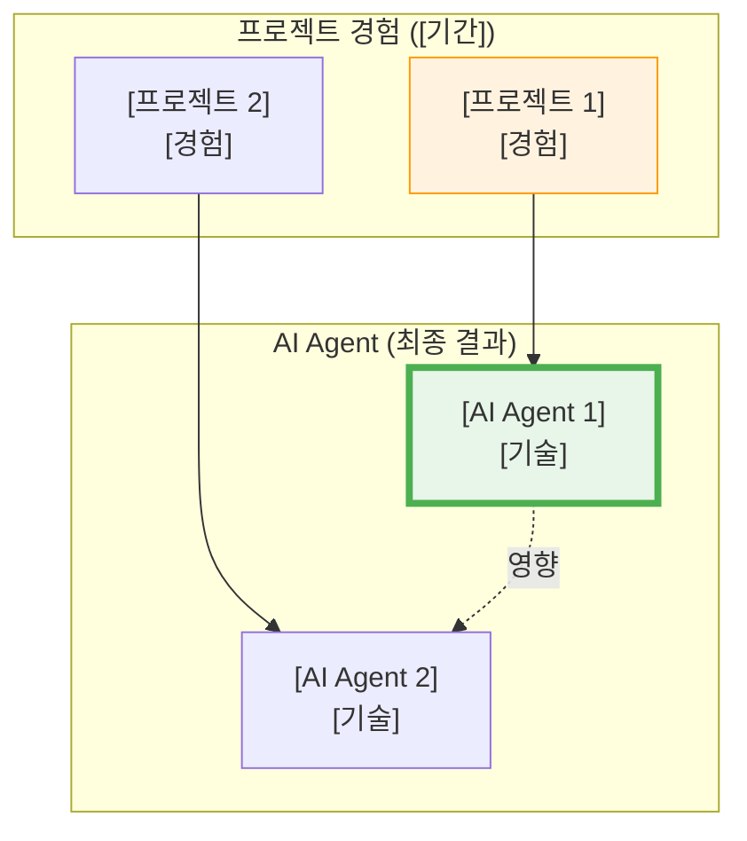
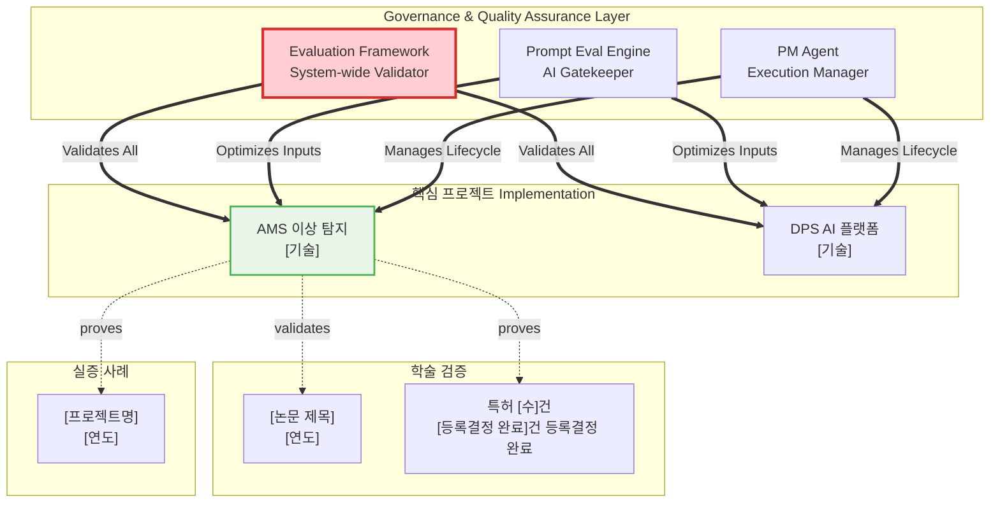

# [이름] 포트폴리오

> **"[핵심 철학]"**

## 작성 가이드

⚠️ **중요 사항**:
- 취소선(`~~텍스트~~`) 문법 사용 금지
- 모든 내용은 최종 버전만 작성
- 삭제된 내용이나 수정 전 내용을 표현하지 않음
- 하나의 연속된 문서로 작성 (페이지 구분 없음)

---

## 📌 기본 정보

**이름**: [이름]
**GitHub**: [GitHub URL - personal_info.json에서 가져오기]

---

## 📊 전체 프로젝트 타임라인 (2020-2026) - 53개 프로젝트

> [!CRITICAL] **필수 섹션**
> 이 섹션은 포트폴리오 생성 시 **반드시** 포함되어야 합니다.
> `02_Projects_Overview.md`의 전체 프로젝트 타임라인 Gantt 차트를 그대로 가져옵니다.

```mermaid
gantt
    title 📊 전체 프로젝트 타임라인 & 포트폴리오 (2020-2026) - 53개 프로젝트
    dateFormat  YYYY-MM
    axisFormat  %Y-%m
    tickInterval 6month

    section 🤖 핵심 AI 엔진 (R&D)
    FBS (피쉬본 구조)              :done,    r1, 2020-09, 2021-10
    가상 센서 & 제어               :done,    r2, 2021-04, 2021-11
    전력/품질 예측 AI              :done,    r3, 2021-04, 2021-11
    진료기록 체질분석 AI           :done,    r4, 2022-06, 2022-10
    CoCTK (컨설팅 툴킷)          :active,  r5, 2022-03, 2023-09
    공정 불량 예측 AI              :done,    r6, 2023-04, 2023-10
    에너지 패턴 분석               :done,    r7, 2023-01, 2023-12
    AMS (이상탐지 시스템)          :crit,    r8, 2024-07, 2025-03

    section 🏭 스마트공장 (자동차/부품)
    에스에이치 (품질 예측)         :done,    sf1, 2020-11, 2021-11
    한중엔시에스                   :done,    sf2, 2021-08, 2023-05
    대성금형 (백엔드 PL)           :done,    sf3, 2021-08, 2023-01
    제이제이툴스 (FBS)             :done,    sf4, 2022-01, 2023-07
    이튼 (자동차부품)              :done,    sf5, 2022-12, 2024-06
    에스에이치 (AMS 납품)          :active,  sf6, 2024-07, 2024-10

    section 🧪 스마트공장 (소재/식품)
    에이치피앤씨 (화장품 시계열)   :done,    sf7, 2020-10, 2021-06
    우일염직 (에너지 최적화)       :done,    sf8, 2021-04, 2021-10
    에이치피앤씨 (최적화)          :done,    sf9, 2021-10, 2022-02
    알티스트 (식품 품질)           :done,    sf10, 2021-08, 2023-02
    이앤아이비 (플라스틱)          :done,    sf11, 2021-08, 2022-09
    세아특수강 (DX 실증)           :done,    sf12, 2025-01, 2025-12

    section 🏗️ 스마트공장 (일반 제조)
    롯데알루미늄 (FBS/QMS)         :done,    sf13, 2022-03, 2023-07
    한솔홈데코 (패턴분석)          :done,    sf14, 2022-08, 2022-12
    플라이쿱 (사운드 품질)         :done,    sf15, 2021-12, 2023-03
    송월타올 (전력 FBS)            :done,    sf16, 2022-08, 2024-02
    다마요팩 (ARIMA)               :done,    sf17, 2022-08, 2023-11
    코스모폴 (데이터바우처)        :done,    sf18, 2023-04, 2023-10
    해태가루비 (공정최적화)        :done,    sf19, 2023-08, 2023-12
    진영정기 (시뮬레이션)          :active,  sf20, 2024-06, 2024-11
    코맥스 (로봇 제어)             :active,  sf21, 2024-06, 2024-11
    롯데알루미늄 (레시피)          :active,  sf22, 2024-07, 2024-11
    테이패스 (CoCTK 납품)          :crit,    sf23, 2025-04, 2026-01

    section 💼 컨설팅 & 글로벌
    O-WELL Japan (AMS Origin)      :done,    c1, 2020-01, 2024-12
    한솔로지스 (물류)              :done,    c2, 2023-01, 2023-03
    리파코 (로봇) / 코아아이티 (NLP)      :done,    c3, 2023-04, 2023-12
    테크웰 (전력 FMEA)             :done,    c4, 2024-01, 2024-12
    신성오토텍 (사출)              :done,    c5, 2024-01, 2024-12
```

> [!INFO] **총 프로젝트 현황**
> - **AI & Analytics**: 7개 (AMS, CoCTK, FBS 등)
> - **스마트공장 구축**: 23개 (에스에이치아이엔티, 롯데알루미늄 등)
> - **컨설팅**: 8개 (테크웰, 신성오토텍 등)
> - **AI 에이전트**: 9개 (FMEA, PM Agent 등)

---

## 📊 포트폴리오 구조 (한눈에 보기)

```mermaid
graph TB
    subgraph "포트폴리오 ([총 프로젝트 수]개+ 프로젝트)"
        Root[[이름] 포트폴리오]
        
        subgraph "AI Agent ([수]개)"
            CodingAgent[코딩 에이전트<br/>Obsidian Design Origin<br/>[설계 문서 수]개 설계 문서<br/>Phase 0-13 워크플로우]
            FMEA[FMEA 자동화<br/>Multi-Agent<br/>[수]개 Sub-Agent<br/>Phase 0-5 워크플로우]
            PromptEval[프롬프트 평가<br/>AI Gatekeeper<br/>전체 프롬프트 전수 평가]
            PMAgent[PM Agent<br/>사업 관리 자동화<br/>Risk Management]
            BusinessDoc[Business Document<br/>Generator<br/>발주처 유형별 페르소나]
            FactoryOntology[Factory Ontology<br/>Manager<br/>자연어 기반 공정 문서 파싱]
            VACTS[AI_DB_tester<br/>VACTS<br/>DB Grounding]
            VirtualCompany[Virtual Company<br/>Creation Agent<br/>가상 공장 정보 파이프라인]
            EvalFramework[Evaluation Framework<br/>[수]개 모듈 전수 검사]
        end
        
        subgraph "AI & Analytics ([수]개)"
            AMS[AMS<br/>이상 탐지 시스템<br/>[정확도]% 정확도<br/>GS 인증 1등급]
            CoCTK[CoCTK<br/>컨설팅 툴킷<br/>GS 인증 1등급]
            FBS[FBS<br/>피쉬본 구조<br/>AMS 핵심 모듈]
        end
        
        subgraph "Digital Platforms ([수]개)"
            DPS[DPS<br/>데이터수집시스템<br/>5층 아키텍처<br/>Neo4j GraphDB]
            Production[생산정보 연계<br/>통합 운영관리]
        end
        
        Root --> CodingAgent
        Root --> FMEA
        Root --> AMS
        Root --> DPS
    end
    
    style CodingAgent fill:#e74c3c,color:#fff
    style FMEA fill:#3498db,color:#fff
    style AMS fill:#27ae60,color:#fff
    style DPS fill:#9b59b6,color:#fff
```

---

## 🎯 핵심 성과 대시보드

```mermaid
graph LR
    subgraph "성과"
        A[성과1]
    end
```

| 분류 | 지표 | 상세 |
|:---|---:|:---|
| **성과** | 수치 | 설명 |

---

## 📅 경력 타임라인 (2020-2026)

```mermaid
timeline
    title [기간]간의 프로젝트 여정
    [연도] : [프로젝트1]
         : [프로젝트2]
```

---

## 🔗 프로젝트 계보와 스토리 (프로젝트 진화의 연결)

> [!NOTE] 스토리텔링 접근
> 각 AI Agent는 실제 프로젝트에서 겪은 문제를 해결하기 위해 탄생했습니다. 기술적 성과뿐만 아니라 **왜 만들어졌는지, 어떻게 진화했는지**의 스토리가 담겨 있습니다.

### 프로젝트 경험 → AI Agent 설계 토대 관계

```mermaid
graph TB
    subgraph "프로젝트 경험 ([기간])"
        Proj1["[프로젝트 1]<br/>[경험]"]
        Proj2["[프로젝트 2]<br/>[경험]"]
    end
    
    subgraph "AI Agent 개발 ([연도]~)"
        Agent1["[AI Agent 1]<br/>[기술]"]
        Agent2["[AI Agent 2]<br/>[기술]"]
    end
    
    Proj1 --> Agent1
    Proj2 --> Agent2
    
    Agent1 --> Agent2
    
    style Agent1 fill:#e74c3c,color:#fff,stroke-width:3px
```

---

## 🏆 주요 프로젝트 (relevance_score 순)

### AI Agent 진화 관계도

```mermaid
graph TB
    subgraph "AI Agent 진화"
        CodingAgent[코딩 에이전트<br/>Obsidian Design Origin<br/>[설계 문서 수]개 설계 문서<br/>Phase 0-13 워크플로우]
        FMEA[FMEA 자동화<br/>Multi-Agent<br/>[수]개 Sub-Agent<br/>Phase 0-5 워크플로우]
        PromptEval[프롬프트 평가<br/>AI Gatekeeper]
        PMAgent[PM Agent<br/>사업 관리 자동화]
        BusinessDoc[Business Document<br/>Generator]
        FactoryOntology[Factory Ontology<br/>Manager]
        VACTS[AI_DB_tester<br/>VACTS]
        VirtualCompany[Virtual Company<br/>Creation Agent]
        EvalFramework[Evaluation Framework<br/>[수]개 모듈 전수 검사]
    end
    
    CodingAgent -->|역설계 시스템 구조 적용| FMEA
    CodingAgent -->|외주 관리 경험| PMAgent
    CodingAgent -->|문서 작성 경험| BusinessDoc
    CodingAgent -->|온톨로지 공장 agent| FactoryOntology
    CodingAgent -->|모듈화·체계화 경험| EvalFramework
    CodingAgent -->|품질 관리 경험| PromptEval
    
    style CodingAgent fill:#e74c3c,color:#fff,stroke-width:3px
    style FMEA fill:#3498db,color:#fff
    style PromptEval fill:#9b59b6,color:#fff
    style PMAgent fill:#e67e22,color:#fff
```

### 프로젝트 관계도

```mermaid
graph TB
    subgraph "핵심 프로젝트"
        P1[Project1<br/>relevance_score: [점수]]
        P2[Project2<br/>relevance_score: [점수]]
    end
```

### 1. [프로젝트명] - 총괄 PM

**기간**: [기간]
**역할**: [역할]

**핵심 성과**:
- ✅ [성과]

---

## 💻 기술 스택 맵

```mermaid
mindmap
  root((Engineer))
    [카테고리]
      [기술]
```

---

## 📚 학술 성과

| 발행일 | 논문 제목 | 학술지/학회 | 핵심 성과 및 프로젝트 연계 |
|:---|:---|:---|:---|
| [날짜] | [제목] | [학회] | [프로젝트 연계] |

---

## 🔬 특허 출원/등록 현황

> [!NOTE] **조건부 섹션**: `04_Academic_Publications.md`에 특허 정보가 있는 경우에만 생성

### 특허 출원/등록 현황 ([총 건수]건)

| 출원일 | 특허명 | 출원번호 | 공개번호 | 청구항 | 상태 | 발명자 | 핵심 기술 및 프로젝트 연계 |
| :--- | :--- | :--- | :--- | :--- | :--- | :--- | :--- |
| [출원일] | [특허명] | [출원번호] | [공개번호] | [청구항] | [상태] | [발명자] | [핵심 기술 및 프로젝트 연계] |

### 국가연구개발사업 지원 현황

> [!TIP] **정부 지원 연구의 신뢰도**
> 아래 특허들은 **국가연구개발사업**의 지원을 받아 수행된 연구 성과입니다.

| 특허 | 국가연구개발사업 | 과제번호 | 연구기간 | 과제명 |
| :--- | :--- | :--- | :--- | :--- |
| [특허명] | [사업명] | [과제번호] | [연구기간] | [과제명] |

### 특허 기술 발전 흐름

```mermaid
graph TB
    subgraph "온톨로지/구조화/정보화"
        ONT["온톨로지/구조화/정보화<br/>핵심 역량<br/>([기간])"]
    end
    
    subgraph "에너지 패턴 분석 특허 계열"
        Patent1["특허 1<br/>[출원일]<br/>[기술]<br/>[상태]"]
        Patent2["특허 2<br/>[출원일]<br/>[기술]<br/>[상태]"]
        AMSPattern["AMS Pattern Module<br/>[기간]<br/>통합 이상 탐지"]
        
        ONT -->|"정보화 접근법"| Patent1
        Patent1 -->|"기술 발전"| Patent2
        Patent2 -->|"통합"| AMSPattern
    end
    
    subgraph "AMS 공정 관리 특허 계열"
        Patent3["특허 3<br/>[출원일]<br/>[기술]<br/>[상태]"]
        Patent4["특허 4<br/>[출원일]<br/>[기술]<br/>[상태]"]
        AMS["AMS 통합 플랫폼<br/>[기간]<br/>FBS + RMS + Pattern"]
        
        ONT -->|"구조화 접근법"| Patent3
        ONT -->|"구조화/정보화 통합"| Patent4
        Patent3 -->|"공정 관리 기법"| AMS
        Patent4 -->|"특성요인도 자동화"| AMS
    end
    
    AMSPattern -->|"통합"| AMS
    
    style ONT fill:#e3f2fd,stroke:#1976d2,stroke-width:3px
    style AMS fill:#e74c3c,stroke:#c0392b,stroke-width:3px
```

### 특허의 실무 적용 가치

#### AMS 프로젝트에서의 활용

- **[프로젝트명]**: [특허 기술 적용] → [성과]

#### 기술 이전 및 라이선싱 가능성

- **등록결정 완료 특허**: [특허명] - 특허권 확보로 기술 이전 및 라이선싱 가능

---

## 🌱 기술 진화 계보 (Technology Evolution Lineage)

> [!NOTE] **조건부 섹션**: `02_Projects_Overview.md`에 기술 진화 계보 정보가 있는 경우에만 생성

> [!NOTE] **기술 진화의 전체 흐름**
> [기원]에서 시작된 알고리즘이 [기간]간 진화하여 [최종 결과]가 되었고, 동시에 각 프로젝트의 경험이 LLM 에이전트 설계의 기초가 되었습니다.

### AMS 기술 진화 계보

```mermaid
graph TD
    subgraph "기원 ([연도])"
        Origin["[기원 프로젝트]<br/>[핵심 개념]"]
    end
    
    subgraph "초기 개발 ([기간])"
        Early1["[초기 프로젝트 1]<br/>[기술]"]
        Early2["[초기 프로젝트 2]<br/>[기술]"]
    end
    
    subgraph "패턴 분석 발전 ([기간])"
        Pattern1["[패턴 분석 프로젝트 1]<br/>[기술]"]
        Pattern2["[패턴 분석 프로젝트 2]<br/>[기술]"]
    end
    
    subgraph "통합 솔루션 ([기간])"
        Final["[최종 통합 솔루션]<br/>[기술]"]
    end
    
    Origin --> Early1
    Early1 --> Pattern1
    Pattern1 --> Final
    
    style Origin fill:#fff3e0,stroke:#ff9800,stroke-width:3px
    style Final fill:#e8f5e9,stroke:#4caf50,stroke-width:3px
```

### LLM 에이전트 설계 토대 관계

> [!NOTE] 인터뷰 기반 기술 진화 스토리
> 각 프로젝트에서 쌓은 경험이 LLM 에이전트 설계의 토대가 되었습니다.

#### 프로젝트 경험 → 개발 → 스토리 → AI Agent 상호 연결 네트워크

```mermaid
graph TB
    subgraph "프로젝트 경험 ([기간])"
        Proj1["[프로젝트 1]<br/>[경험]"]
        Proj2["[프로젝트 2]<br/>[경험]"]
    end
    
    subgraph "AI Agent (최종 결과)"
        Agent1["[AI Agent 1]<br/>[기술]"]
        Agent2["[AI Agent 2]<br/>[기술]"]
    end
    
    Proj1 --> Agent1
    Proj2 --> Agent2
    
    Agent1 -.->|"영향"| Agent2
    
    style Proj1 fill:#fff3e0,stroke:#ff9800
    style Agent1 fill:#e8f5e9,stroke:#4caf50,stroke-width:4px
```

**주요 상호 영향 관계**:

1. **[핵심 AI Agent]**: 다른 모든 AI Agent의 설계 기초가 됨
2. **복합 프로젝트 영향**: 여러 프로젝트가 하나의 AI Agent에 복합적으로 영향
3. **AI Agent 간 상호 영향**: AI Agent들이 서로 영향을 주고받음

---

## 🛤️ 쌓아온 길 (Career Evolution Journey)

> [!NOTE] **조건부 섹션**: `02_Projects_Overview.md`에 기술 진화 정보가 있는 경우에만 생성

> [!NOTE] **기술 진화의 전체 흐름**
> [기원]에서 시작된 알고리즘이 [기간]간 진화하여 [최종 결과]가 되었고, 각 프로젝트 경험이 LLM 에이전트 설계의 토대가 되었습니다.

### 기술 진화의 전체 흐름

**[연도]: 기원**
- [기원 프로젝트]: [기술 학습 및 경험]

**[기간]: 초기 개발**
- **[프로젝트명]**: [기술 개발] → [영향]

**[기간]: 패턴 분석 발전**
- **[프로젝트명]**: [기술 발전] → [영향]
- **특허 출원**: [특허 기술] 특허화

**[기간]: 통합 솔루션 완성**
- **[프로젝트명]**: [기술 통합] → [최종 결과]

### 프로젝트 경험 → AI Agent 진화

**[연도]: AI Agent 개발의 시작**
- **[AI Agent명]**: 
  - [문제 발견]
  - [해결 방법]
  - **→ 다른 모든 AI Agent의 설계 기초가 됨**

**[연도]: AI Agent 확장**
- **[AI Agent명]**: [프로젝트 경험]을 [AI Agent 개발]에 적용

### 기술 진화의 핵심 인사이트

- **"[핵심 철학]"**: 모든 기술이 온톨로지 구조로 체계화되어 지식 재사용과 확장이 가능
- **현장 친화적 연구**: 모든 연구는 실제 제조 현장의 데이터를 기반으로 수행되어 즉각적인 산업 적용 가능
- **지속적인 혁신**: [기간] 동안 매년 새로운 기술과 방법론을 개발하며 지속적으로 진화
- **학술적 검증**: 논문 [수치]편, 특허 [수치]건 ([등록결정 완료]건)을 통해 기술의 신뢰성과 독창성 입증
- **실무 적용**: [프로젝트명] 등 실제 현장에서 검증된 기술

---

## 📊 포트폴리오 구조 (한눈에 보기)

```mermaid
graph TB
    subgraph "포트폴리오 ([총 프로젝트 수]개+ 프로젝트)"
        Root[[이름] 포트폴리오]
        
        subgraph "AI Agent ([수]개)"
            CodingAgent[코딩 에이전트<br/>[기술]"]
            FMEA[FMEA 자동화<br/>[기술]"]
        end
        
        subgraph "AI & Analytics ([수]개)"
            AMS[AMS<br/>[기술]"]
            CoCTK[CoCTK<br/>[기술]"]
        end
        
        Root --> CodingAgent
        Root --> FMEA
        Root --> AMS
    end
    
    style CodingAgent fill:#e74c3c,color:#fff
    style AMS fill:#27ae60,color:#fff
```

### 전체 온톨로지 구조

> [!NOTE] **온톨로지 기반 정보 구조화**
> 모든 프로젝트와 성과는 온톨로지 구조로 체계화되어 있으며, Governance & Quality Assurance Layer가 전체 시스템을 관리합니다.

```mermaid
graph TB
    subgraph "Governance & Quality Assurance Layer"
        EVAL["Evaluation Framework<br/>System-wide Validator"]
        PROMPT["Prompt Eval Engine<br/>AI Gatekeeper"]
        PM["PM Agent<br/>Execution Manager"]
    end
    
    subgraph "핵심 프로젝트 Implementation"
        AMS_ONT["AMS 이상 탐지<br/>[기술]"]
        DPS_ONT["DPS AI 플랫폼<br/>[기술]"]
    end
    
    subgraph "학술 검증"
        P1["[논문 제목]<br/>[연도]"]
        PATENT["특허 [수]건<br/>[등록결정 완료]건 등록결정 완료"]
    end
    
    subgraph "실증 사례"
        T1["[프로젝트명]<br/>[연도]"]
    end
    
    EVAL == "Validates All" ==> AMS_ONT & DPS_ONT
    PROMPT == "Optimizes Inputs" ==> AMS_ONT & DPS_ONT
    PM == "Manages Lifecycle" ==> AMS_ONT & DPS_ONT
    
    AMS_ONT -. "validates" .-> P1
    AMS_ONT -. "proves" .-> PATENT
    AMS_ONT -. "proves" .-> T1
    
    style EVAL fill:#ffcdd2,stroke:#d32f2f,stroke-width:3px
    style AMS_ONT fill:#e8f5e9,stroke:#4caf50,stroke-width:2px
```

**온톨로지 구조의 핵심**:
- **Governance & Quality Assurance Layer**: Evaluation Framework, Prompt Eval Engine, PM Agent가 전체 시스템의 품질과 안정성을 보장
- **핵심 프로젝트**: 실제 구현된 솔루션들이 온톨로지 구조로 연결됨
- **학술 검증**: 논문과 특허를 통해 기술의 신뢰성과 독창성 입증
- **실증 사례**: 실제 현장 적용 사례

---

## 💼 비즈니스 가치 창출

### AI Agent 개발 성과

```mermaid
graph TB
    subgraph "AI Agent 개발 성과"
        A1[[수]개 AI Agent 개발<br/>Multi-Agent System<br/>LangGraph/CrewAI]
        A2[[수]개 설계 문서<br/>ID 기반 온톨로지 맵<br/>Phase 0-13 워크플로우]
        A3[[수]개 Sub-Agent<br/>FMEA 자동화<br/>Phase 0-5 워크플로우]
        A4[프롬프트 평가 엔진<br/>AI Gatekeeper<br/>전체 프롬프트 전수 평가]
        A5[Evaluation Framework<br/>[수]개 모듈 전수 검사<br/>Few-shot Rules System]
    end
    
    subgraph "비즈니스 가치"
        B1[외주 개발자 관리<br/>[수]% 시간 절감]
        B2[문서 일관성<br/>[수]% 보장]
        B3[LLM 비용<br/>[수]% 절감]
        B4[문서 작성 시간<br/>[수]% 절감]
        B5[공정 라인 수정<br/>[수]% 절감]
    end
    
    A1 --> B1
    A2 --> B2
    A3 --> B2
    A4 --> B2
    A5 --> B2
    
    style A1 fill:#e74c3c,color:#fff
    style B1 fill:#e8f5e9,stroke:#4caf50,stroke-width:2px
```

### 개발 효율성 향상

- ✅ **외주 개발자 관리 시간 [수]% 이상 절감**: 코딩 에이전트를 통한 자동화
- ✅ **문서 일관성 [수]% 보장**: ID 시스템 기반 문서 관리
- ✅ **개발 프로세스 자동화**: 납품 품질 향상
- ✅ **LLM 비용 [수]% 절감**: Virtual Company Creation Agent의 GFS + Dual-Tier AI 아키텍처
- ✅ **문서 작성 시간 [수]% 이상 절감**: Business Document Generator를 통한 자동화
- ✅ **공정 라인 수정 시간 [수]% 이상 절감**: Factory Ontology Manager의 자연어 기반 파싱
- ✅ **프롬프트 품질 일관성 [수]% 보장**: 프롬프트 평가 엔진의 전수 평가 시스템
- ✅ **코드 품질 일관성 [수]% 보장**: Evaluation Framework의 전수 검사 시스템

### 핵심 성과 지표

| 지표 | 수치 | 비고 |
|:---|---:|:---|
| **AI Agent 개발** | [수]개 | 코딩 에이전트, FMEA 자동화, 프롬프트 평가, PM Agent 등 |
| **Multi-Agent System** | [수]개 Sub-Agent | FMEA 자동화 Multi-Agent 시스템 |
| **설계 문서** | [수]개+ | ID 기반 온톨로지 맵 |
| **프롬프트** | [수]개+ | 프롬프트 평가 엔진으로 품질 보장 |
| **외주 관리 시간 절감** | [수]%+ | 코딩 에이전트 자동화 |
| **문서 일관성** | [수]% | ID 시스템 기반 문서 관리 |
| **LLM 비용 절감** | [수]% | GFS + Dual-Tier AI |
| **문서 작성 시간 절감** | [수]%+ | Business Document Generator |
| **공정 라인 수정 시간 절감** | [수]%+ | Factory Ontology Manager |
| **프롬프트 품질 보장** | [수]% | 프롬프트 평가 엔진 전수 평가 |
| **코드 품질 보장** | [수]% | Evaluation Framework 전수 검사 |
| **GS 인증** | [수]개 (1등급) | CoCTK, AMS (PDS 명칭) |
| **논문 발표** | [수]편 | 한국유체기계학회, 한국생산제조학회 등 |

---

## 🤖 LLM 활용 방법

### Multi-Agent 시스템

**[Multi-Agent 시스템명]**: Claude Sub-Agent 기반 [수]개 독립 Sub-Agent 협업 구조를 구현했습니다. 각 Sub-Agent는 전문 영역을 담당하며, Master Orchestrator가 전체 워크플로우를 조율합니다.

**Phase 0~[수] 자동화 워크플로우**: [프로세스명] 생성 프로세스 전 과정을 자동화했습니다. Python 스크립트 없이 Claude Code 세션 자체가 Orchestrator 역할을 담당합니다.

### MCP 서버

**MCP (Model Context Protocol)**: 모델 컨텍스트 프로토콜을 활용하여 AI Agent 간 정보 전달을 최적화했습니다. State 기반 정보 전달로 컨텍스트를 최적화하고, 워크플로우 상태를 모니터링합니다.

### RAG 시스템 (Neo4j 기반)

**Neo4j 기반 RAG 시스템**: [프로젝트명]에서 Neo4j 그래프DB를 활용하여 확률 네트워크를 저장하고 분석합니다. FBS 뼈대 위에 확률적 최적화로 문제 해결 최적 경로를 도출합니다.

### LangGraph/CrewAI 워크플로우 오케스트레이션

**[시스템명]**: LangGraph/CrewAI 방식의 워크플로우 오케스트레이션을 구현했습니다. [수]개+ AI 프롬프트 체인을 설계하고, 개발 에이전트 실시간 평가 시스템을 구축했습니다.

**State 기반 정보 전달**: State Reducer 패턴으로 워크플로우 상태 일관성을 유지하고, Human Loop Interrupts로 중요한 의사결정 지점에서 사용자 개입을 지원합니다.

---

## 🔗 관련 문서

- **이력서**: [권순룡_이력서_일반공개.md](./권순룡_이력서_일반공개.md)
- **포트폴리오 인덱스**: [00_Portfolio_Index.md](../../00_Portfolio_Index.md)
- **프로젝트 개요**: [02_Projects_Overview.md](../../02_Projects_Overview.md)

---

© [연도] [이름]. All Rights Reserved.
