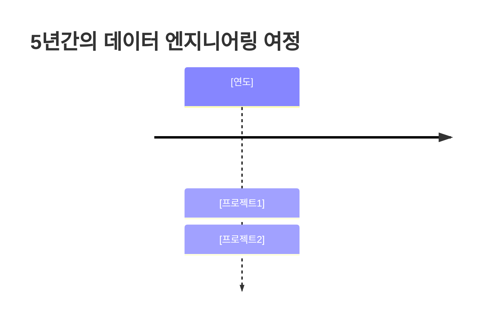
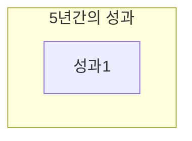

# [이름] 이력서

## 기본 정보

**이름**: [이름]
**현 소속**: [소속]
**총 경력**: [경력]
**핵심 역량**: [job keywords 중심]

---

## 한눈에 보는 경력 (2020-2025)



---

## 지원 동기

[Soonryong 스타일 - 회사 목표 + 본인 경험 연결]

---

## 핵심 역량 맵

```mermaid
mindmap
  root((Data Engineer<br/>[경력]))
    [역량 카테고리 1]
      [세부 기술]
```

---

## 핵심 역량

### [역량 1 - job essential]

[Soonryong 스타일 설명 + 구체적 프로젝트 + 정량적 성과]

---

## 프로젝트 관계도

```mermaid
graph TB
    subgraph "핵심 프로젝트"
        [Project1]
    end
```

---

## 경력 개요

### [회사명] ([기간])
**직급**: [직급]
**주요 업무**:
- [업무]

**성과**:
- [성과]

---

## 주요 프로젝트 경험

### 1. [프로젝트명] - [역할]

**기간**: [기간]
**발주처**: [발주처]
**역할**: [역할]

**핵심 성과**:
- ✅ **[성과1]**: [설명]

---

## 기술 스택

### Programming Languages
- **[언어]**: [경력] ([세부])

---

## 성과 대시보드



---

## 학력

**[학교명] [학과]** ([기간])

---

## 자격증

**[자격증명]** ([취득일])

---

## 핵심 철학

> "[철학]"

[간단한 설명]
