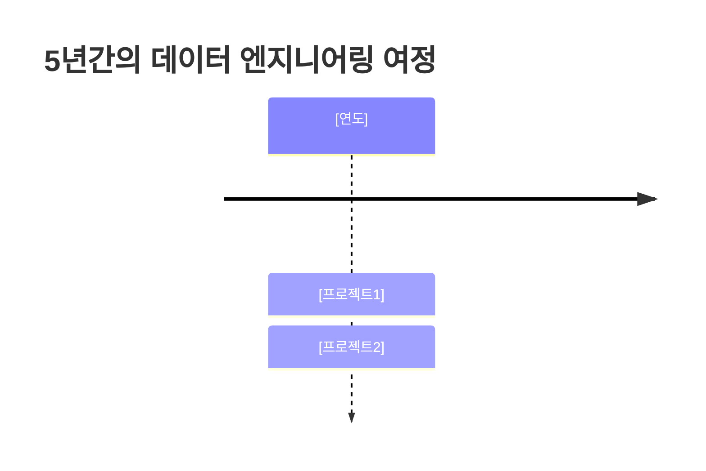

# [이름] 이력서

## 작성 가이드

⚠️ **중요 사항**:
- 취소선(`~~텍스트~~`) 문법 사용 금지
- 모든 내용은 최종 버전만 작성
- 삭제된 내용이나 수정 전 내용을 표현하지 않음
- 하나의 연속된 문서로 작성 (페이지 구분 없음)

---

## 기본 정보

**이름**: [이름]
**현 소속**: [소속]
**총 경력**: [경력]
**핵심 역량**: [job keywords 중심]

---

## 한눈에 보는 경력 (2020-2025)

```mermaid
timeline
    title 5년간의 데이터 엔지니어링 여정
    [연도] : [프로젝트1]
           : [프로젝트2]
```

---

## 지원 동기

[Soonryong 스타일 - 회사 목표 + 본인 경험 연결]

---

## 핵심 역량 맵

```mermaid
mindmap
  root((Data Engineer<br/>[경력]))
    [역량 카테고리 1]
      [세부 기술]
```

---

## 핵심 역량

### [역량 1 - job essential]

[Soonryong 스타일 설명 + 구체적 프로젝트 + 정량적 성과]

---

## 프로젝트 관계도

```mermaid
graph TB
    subgraph "핵심 프로젝트"
        [Project1]
    end
```

---

## 경력 개요

### [회사명] ([기간])
**직급**: [직급]
**주요 업무**:
- [업무]

**성과**:
- [성과]

---

## 주요 프로젝트 경험

### 1. [프로젝트명] - [역할]

**기간**: [기간]
**발주처**: [발주처]
**역할**: [역할]

**핵심 성과**:
- ✅ **[성과1]**: [설명]

---

## 기술 스택

### Programming Languages
- **[언어]**: [경력] ([세부])

---

## 성과 대시보드

```mermaid
graph TB
    subgraph "5년간의 성과"
        A[성과1]
    end
```

---

## 학력

**[학교명] [학과]** ([기간])

---

## 자격증

**[자격증명]** ([취득일])

---

## 핵심 철학

> "[철학]"

[간단한 설명]

---

## 자기소개서

**⚠️ 조건부 섹션**: `job_description_analysis.json`의 `cover_letter_sections.required`가 `true`인 경우에만 생성

### 지원동기

[순룡 페르소나 스타일로 작성, max_length 이내]

**작성 가이드**:
- 회사/팀 목표와 본인 경험 연결
- relevance_score 높은 프로젝트 구체적 언급
- 기술 스택 매칭 강조
- 순룡 페르소나 스타일: 격식있지만 따뜻한 어조, 두괄식 구조, 비즈니스/기술 도메인에 맞는 비유

### 경력기술(경력목표 포함)

[순룡 페르소나 스타일로 작성, max_length 이내]

**작성 가이드**:
- 5년간의 주요 프로젝트 경험 요약
- 핵심 역량 및 전문성 강조
- 경력목표: 단기 목표 및 장기 목표 명시
- 순룡 페르소나 스타일: 구체적 경험 중심, 정량적 성과 포함

### 입사 후 기여방안

[순룡 페르소나 스타일로 작성, max_length 이내]

**작성 가이드**:
- 보험 현업 AI Agent 개발 기여 방안
- AI 모델 학습/평가 기여 방안
- RAG 시스템 구축 기여 방안
- 최신 AI 트렌드 적용 및 협업 기여 방안
- 순룡 페르소나 스타일: 구체적이고 실행 가능한 계획 제시