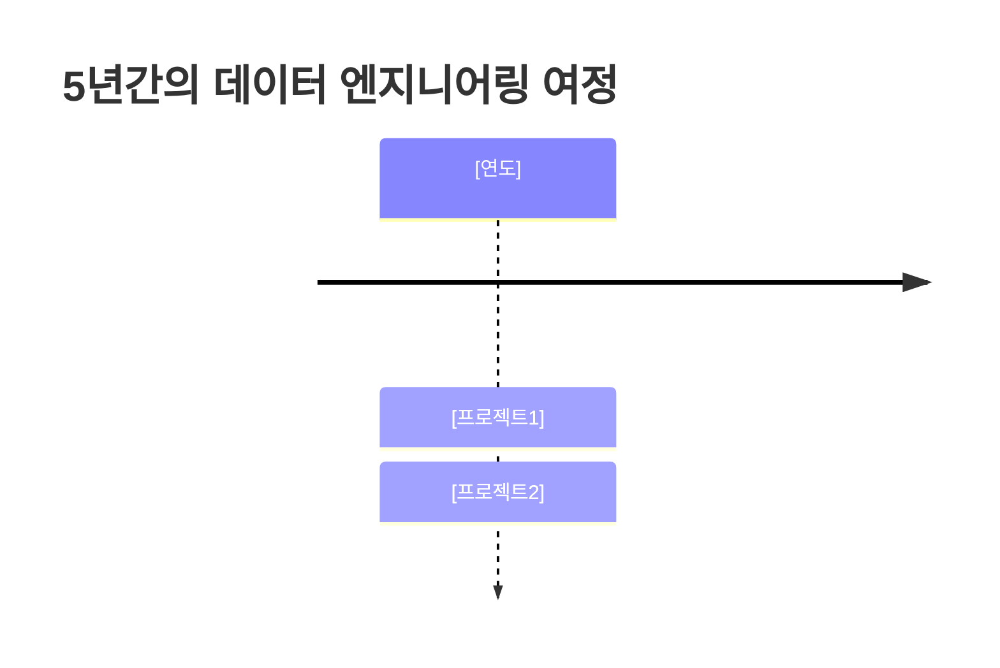

# [이름] 이력서

## 작성 가이드

⚠️ **중요 사항**:
- 취소선(`~~텍스트~~`) 문법 사용 금지
- 모든 내용은 최종 버전만 작성
- 삭제된 내용이나 수정 전 내용을 표현하지 않음
- 하나의 연속된 문서로 작성 (페이지 구분 없음)

---

## 기본 정보

**이름**: [이름]
**현 소속**: [소속]
**총 경력**: [경력]
**핵심 역량**: [job keywords 중심]

---

## 한눈에 보는 경력 (2020-2025)

```mermaid
timeline
    title 5년간의 데이터 엔지니어링 여정
    [연도] : [프로젝트1]
           : [프로젝트2]
```

---

## 지원 동기

[Soonryong 스타일 - 회사 목표 + 본인 경험 연결]

---

## 핵심 역량 맵

```mermaid
mindmap
  root((Data Engineer<br/>[경력]))
    [역량 카테고리 1]
      [세부 기술]
```

---

## 핵심 역량

### [역량 1 - job essential]

[Soonryong 스타일 설명 + 구체적 프로젝트 + 정량적 성과]

---

## 프로젝트 관계도

```mermaid
graph TB
    subgraph "핵심 프로젝트"
        [Project1]
    end
```

---

## 경력 개요

### [회사명] ([기간])
**직급**: [직급]
**주요 업무**:
- [업무]

**성과**:
- [성과]

---

## 주요 프로젝트 경험

### 1. [프로젝트명] - [역할]

**기간**: [기간]
**발주처**: [발주처]
**역할**: [역할]

**핵심 성과**:
- ✅ **[성과1]**: [설명]

---

## 기술 스택

### Programming Languages
- **[언어]**: [경력] ([세부])

---

## 성과 대시보드

```mermaid
graph TB
    subgraph "[기간]간의 성과 ([기간])"
        subgraph "인증 및 지식 자산"
            A1[GS 인증 1등급 [수]개<br/>[프로젝트명] [연도]<br/>[프로젝트명] [연도]]
            A2[특허 출원/등록<br/>[수]건 [등록결정 완료]건 등록결정 완료<br/>지식 자산 전환]
            A3[학술 논문 발표 [수]편<br/>[기간]<br/>[분야] 분야]
        end
        
        subgraph "프로젝트 성과"
            A4[프로젝트 [수]개+<br/>[수]대 영역<br/>[영역명] 등]
            A5[총괄 PM [수]개<br/>[프로젝트명] 등]
            A6[컨설팅 프로젝트 [수]개<br/>[프로젝트명] 등]
        end
        
        subgraph "기술 성과"
            A7[이상 탐지 [수]%<br/>베이지안 네트워크<br/>[프로젝트명] 시스템]
            A8[에너지 효율 [수]% 향상<br/>클린룸 최적화]
            A9[Python 모듈 [수]개<br/>[모듈명] 등]
            A10[설계 문서 [수]개+<br/>ID 기반 온톨로지 맵]
        end
        
        subgraph "납품 실적"
            A11[정식 납품 [수]곳+<br/>[프로젝트명]<br/>[프로젝트명] 등]
        end
        
        subgraph "AI Agent 성과"
            A12[Multi-Agent [수]개<br/>FMEA 자동화<br/>Sub-Agent 협업]
            A13[MCP 서버 [수]개<br/>PM Agent<br/>기술 자산 관리]
            A14[프롬프트 평가 [수]개+<br/>AI Gatekeeper<br/>전수 평가 시스템]
        end
    end
    
    style A1 fill:#e74c3c,color:#fff,stroke-width:2px
    style A2 fill:#3498db,color:#fff,stroke-width:2px
    style A3 fill:#9b59b6,color:#fff,stroke-width:2px
    style A7 fill:#e67e22,color:#fff,stroke-width:2px
    style A11 fill:#27ae60,color:#fff,stroke-width:2px
    style A12 fill:#f39c12,color:#fff,stroke-width:2px
```

### 정량적 성과 요약

| 분류 | 지표 | 수치 | 세부 내용 |
|:---|---:|:---|:---|
| **인증 및 지식 자산** | GS 인증 1등급 | [수]개 | [프로젝트명] ([연도]), [프로젝트명] ([연도]) |
| | 특허 | [수]건 | [등록결정 완료]건 등록결정 완료, [심사 진행 중]건 심사 진행 중 (총 청구항 [수]개) |
| | 학술 논문 | [수]편 | [기간], [분야] 분야 |
| **프로젝트 성과** | 총 프로젝트 수 | [수]개+ | [수]대 영역 ([영역명] 등) |
| | 총괄 PM | [수]개 | [프로젝트명] 등 |
| | 컨설팅 | [수]개 | [프로젝트명] 등 |
| **기술 성과** | 이상 탐지 정확도 | [수]% | 베이지안 네트워크 기반 ([프로젝트명]) |
| | 에너지 효율 향상 | [수]% | 클린룸 최적화 |
| | Python 모듈 | [수]개 | [모듈명] 등 |
| | 설계 문서 | [수]개+ | ID 기반 온톨로지 맵 시스템 |
| **납품 실적** | 정식 납품 | [수]곳+ | [프로젝트명] 등 |
| **AI Agent 성과** | Multi-Agent 시스템 | [수]개 Sub-Agent | FMEA 자동화 |
| | MCP 서버 | [수]개 | PM Agent 기반 |
| | 프롬프트 평가 | [수]개+ | AI Gatekeeper 전수 평가 시스템 |

---

## 특허 출원/등록 현황

> [!NOTE] **조건부 섹션**: `04_Academic_Publications.md`에 특허 정보가 있는 경우에만 생성

### 특허 현황 요약

| 출원일 | 특허명 | 상태 | 발명자 | 핵심 기술 |
| :--- | :--- | :--- | :--- | :--- |
| [출원일] | [특허명] | [상태] | [발명자] | [핵심 기술] |

### 국가연구개발사업 지원 현황

- **[특허명]**: [국가연구개발사업명], 과제번호 [과제번호] ([연구기간])

### 특허의 실무 적용 가치

- **[프로젝트명]**: [특허 기술 적용] → [성과]

---

## 학력

**[학교명] [학과]** ([기간])

---

## 자격증

**[자격증명]** ([취득일])

---

## 핵심 철학

> "[철학]"

[간단한 설명]

---

## 자기소개서

**⚠️ 조건부 섹션**: `job_description_analysis.json`의 `cover_letter_sections.required`가 `true`인 경우에만 생성

### 지원동기

[순룡 페르소나 스타일로 작성, max_length 이내]

**작성 가이드**:
- 회사/팀 목표와 본인 경험 연결
- relevance_score 높은 프로젝트 구체적 언급
- 기술 스택 매칭 강조
- 순룡 페르소나 스타일: 격식있지만 따뜻한 어조, 두괄식 구조, 비즈니스/기술 도메인에 맞는 비유

### 경력기술(경력목표 포함)

[순룡 페르소나 스타일로 작성, max_length 이내]

**작성 가이드**:
- 5년간의 주요 프로젝트 경험 요약
- 핵심 역량 및 전문성 강조
- 경력목표: 단기 목표 및 장기 목표 명시
- 순룡 페르소나 스타일: 구체적 경험 중심, 정량적 성과 포함

### 입사 후 기여방안

[순룡 페르소나 스타일로 작성, max_length 이내]

**작성 가이드**:
- 보험 현업 AI Agent 개발 기여 방안
- AI 모델 학습/평가 기여 방안
- RAG 시스템 구축 기여 방안
- 최신 AI 트렌드 적용 및 협업 기여 방안
- 순룡 페르소나 스타일: 구체적이고 실행 가능한 계획 제시