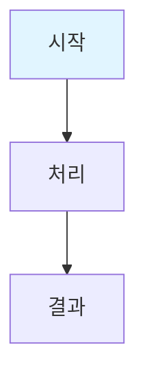

# 문서 작성 템플릿

**문서 ID**: `page.[module].[name]`  
**작성일**: YYYY-MM-DD  
**작성자**: [작성자명]  
**최종 수정일**: YYYY-MM-DD

---

## 문서 메타데이터

```yaml
id: page.[module].[name]
title: [문서 제목]
type: page
module: [module]
name: [name]
related_documents:
  - page.portfolio.index
  - [관련 문서 ID]
```

---

## 문서 개요

> [!NOTE] 문서 목적
> [이 문서의 목적과 대상 독자를 명시합니다.]

---

## 주요 내용

### 섹션 1: [섹션명]

[섹션 내용]

**관련 ID**:
- `[관련 ID 1]`
- `[관련 ID 2]`

### 섹션 2: [섹션명]

[섹션 내용]

---

## 다이어그램 (해당 시)



---

## 관련 문서

- [[00_Portfolio_Index|포트폴리오 인덱스]] (`page.portfolio.index`)
- [[00_ID_System_Guide|ID 시스템 가이드]] (`guide.id.system`)

---

## ID 참조

- **문서 ID**: `page.[module].[name]`
- **관련 Phase**: `phase.*`
- **관련 프로젝트**: `project.*`

---

## 체크리스트

### 문서 작성 체크리스트

- [ ] 문서 ID 부여 (`page.[module].[name]`)
- [ ] 메타데이터 작성
- [ ] 관련 문서 링크 추가
- [ ] ID 참조 명시
- [ ] 관계 맵 업데이트

---

> [!NOTE] 작성 가이드
> - 모든 문서는 ID를 가져야 함
> - 관련 문서는 ID를 명시하여 참조
> - 관계 맵에 문서 추가 필요

