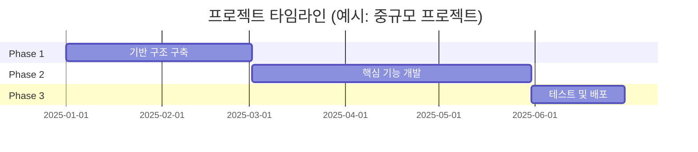

# 프로젝트 요약 템플릿

**프로젝트 ID**: `project.[name]`  
**작성일**: YYYY-MM-DD  
**작성자**: [작성자명]

---

## 프로젝트 기본 정보

| 항목 | 내용 |
|------|------|
| **프로젝트명** | [프로젝트명] |
| **프로젝트 ID** | `project.[name]` |
| **프로젝트 유형** | [AI/Analytics, Digital Platform, Smart Sensor, Energy/Safety] |
| **기간** | [시작일] ~ [종료일] |
| **PM 역할** | [총 사업관리 PM / 개발 PM] |
| **팀 규모** | [인원 수] |
| **예산 규모** | [예산 정보] (선택 사항) |

---

## 프로젝트 목표

### 핵심 목표

1. **[목표 1]**: [1-2문장 설명]
2. **[목표 2]**: [1-2문장 설명]
3. **[목표 3]**: [1-2문장 설명]

### 성공 지표

| 지표 | 목표 | 실제 달성 |
|------|------|----------|
| [지표 1] | [목표값] | [실제값] |
| [지표 2] | [목표값] | [실제값] |

---

## 기술 스택

### 핵심 기술

| 카테고리 | 기술 | 버전 | 선택 이유 |
|---------|------|------|----------|
| [카테고리] | [기술명] | [버전] | [선택 이유] |

### 아키텍처

- **아키텍처 유형**: [마이크로서비스, 모놀리식, 서버리스 등]
- **주요 컴포넌트**: [컴포넌트 목록]
- **데이터베이스**: [DB 종류 및 용도]

---

## 주요 성과

### 개발 성과

- [성과 1]
- [성과 2]
- [성과 3]

### 비즈니스 성과

- [비즈니스 성과 1]
- [비즈니스 성과 2]

### 학술 성과

- [논문 발표] (해당 시)
- [특허/인증] (해당 시)

---

## 프로젝트 타임라인

> [!NOTE] 프로젝트 유형별 기간 참고
> - 데이터 바우처 (MM): 약 30일
> - 데이터 바우처 (AI 실증): 약 2개월
> - 연구과제: 4-6개월 (전체는 2-3년 이상)
> - 납품 프로젝트: 3-6개월
> - 장기 개발 프로젝트: 1년 이상
> 
> 자세한 내용은 [[templates/Project_Timeline_Template|프로젝트 타임라인 템플릿]] 참조

---

## 관련 문서

- [[Architecture_Overview|아키텍처 개요]] (`page.portfolio.architecture`)
- [[Testing_Context|테스트 컨텍스트]] (`page.portfolio.testing`)
- [[02_Projects_Overview|프로젝트 개요]] (`page.portfolio.projects`)

---

## ID 참조

- **프로젝트 ID**: `project.[name]`
- **관련 Phase**: `phase.*`
- **관련 문서**: `page.portfolio.*`

---

> [!NOTE] 작성 가이드
> - 프로젝트 ID는 `project.[name]` 형식으로 작성
> - 관련 문서는 ID를 명시하여 참조
> - 타임라인은 실제 일정에 맞게 수정
> - 프로젝트 유형별 기간 가이드를 참고하여 현실적인 일정 수립

