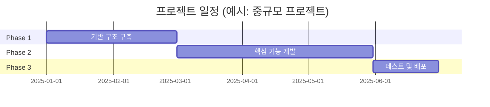

# 프로젝트 타임라인 템플릿

**프로젝트 ID**: `project.[name]`  
**작성일**: YYYY-MM-DD

---

## 프로젝트 기본 정보

| 항목 | 내용 |
|------|------|
| **프로젝트명** | [프로젝트명] |
| **프로젝트 ID** | `project.[name]` |
| **기간** | [시작일] ~ [종료일] |
| **PM 역할** | [총 사업관리 PM / 개발 PM] |
| **팀 규모** | [인원 수] |
| **예산 규모** | [예산 정보] (선택 사항) |

---

## PM 역할 구분

### 총 사업관리 PM

**역할**: 전체 프로젝트 관리 (일정, 예산, 고객 관리 등)

**담당 프로젝트 예시**:
- 2025년 데이터 바우처 2건
- 포미아 AMS+DPS 플랫폼 납품 1건 (2025년)
- 세아특수강 DPS 납품 1건 (2025년)

### 개발 PM

**역할**: 기술 개발 및 구현 관리

**담당 프로젝트**: 나머지 모든 프로젝트

---

## 프로젝트 일정

### 전체 일정 (예시: 중규모 프로젝트)

### 프로젝트 유형별 기간 가이드

> [!NOTE] 현실적인 프로젝트 기간
> 설계 툴, 디버깅 툴, 개발 툴이 있어도 실제 개발 작업은 최소 2-3일은 소요됩니다.

#### 데이터 바우처 (MM 수행)
- **총 기간**: 약 30일
- Phase 1 (기반 구조): 약 10일
- Phase 2 (핵심 기능): 약 15일
- Phase 3 (테스트 및 배포): 약 5일

#### 데이터 바우처 (AI 실증)
- **총 기간**: 약 2개월 (60일)
- Phase 1 (기반 구조): 약 20일
- Phase 2 (핵심 기능): 약 30일
- Phase 3 (테스트 및 배포): 약 10일

#### 연구과제 (실제 수행 기간)
- **총 기간**: 4-6개월 (120-180일)
- Phase 1 (기반 구조): 약 60일
- Phase 2 (핵심 기능): 약 90일
- Phase 3 (테스트 및 배포): 약 30일
- **참고**: 전체 연구과제 기간은 2-3년 이상 (장기 프로젝트)

#### 납품 프로젝트 (포미아, 세아특수강 등)
- **총 기간**: 3-6개월 (90-180일)
- Phase 1 (기반 구조): 약 60일
- Phase 2 (핵심 기능): 약 90일
- Phase 3 (테스트 및 배포): 약 30일

#### 장기 개발 프로젝트 (AMS, DPS 등)
- **총 기간**: 1년 이상
- Phase별 기간은 프로젝트 규모에 따라 조정
- 지속적인 개발 및 개선이 이루어지는 장기 프로젝트

### 마일스톤

| 마일스톤 | 날짜 | 완료 조건 | 상태 |
|---------|------|----------|------|
| [마일스톤 1] | YYYY-MM-DD | [조건] | [완료/진행중/예정] |
| [마일스톤 2] | YYYY-MM-DD | [조건] | [완료/진행중/예정] |

---

## 팀 구성

### 팀 규모

- **총 인원**: [인원 수]
- **PM**: [인원 수] (총 사업관리 PM: [인원], 개발 PM: [인원])
- **개발자**: [인원 수]
- **기타**: [인원 수]

### 역할 분담

| 역할 | 인원 | 담당 업무 |
|------|------|----------|
| [역할 1] | [인원] | [업무] |
| [역할 2] | [인원] | [업무] |

---

## 예산 관리

### 예산 계획

| 항목 | 예산 | 실제 | 차이 |
|------|------|------|------|
| [항목 1] | [금액] | [금액] | [차이] |
| [항목 2] | [금액] | [금액] | [차이] |

### 비용 최적화

- [최적화 사례 1]
- [최적화 사례 2]

---

## 개발 작업 복잡도 정의

> [!WARNING] 현실적인 시간 추정
> **핵심 원칙**: 설계 툴, 디버깅 툴, 개발 툴이 있어도 최소 2-3일은 걸립니다.

### 작업 단위별 복잡도

| 복잡도 | 소요 시간 | 설명 | 예시 |
|--------|----------|------|------|
| **Low** | 2-3일 | 최소 소요 시간 설계 툴이 있어도 디버깅, 테스트, 통합에 2-3일 필요 | 단순 CRUD, UI 컴포넌트, 기본 API |
| **Medium** | 1-2주 (5-10일) | 비즈니스 로직 포함, API 연동, 데이터 처리 설계 툴로 설계는 빠르지만 구현과 검증에 시간 소요 | 비즈니스 로직 포함 기능, API 연동, 데이터 처리 |
| **High** | 2-4주 (10-20일) | 복잡한 상태 관리, 외부 시스템 연동, 알고리즘 구현 설계 툴로 설계는 가능하나 구현 복잡도가 높아 시간 소요 | 복잡한 상태 관리, 외부 시스템 연동, 알고리즘 구현 |

### 프로젝트 전체 기간 (참고)

- **소규모 프로젝트**: 1-3개월
- **중규모 프로젝트**: 3-6개월
- **대규모 프로젝트**: 6개월-1년
- **장기 프로젝트**: 1년 이상

## 일정 관리

### 일정 준수율

- **계획 일정**: [일수]일
- **실제 일정**: [일수]일
- **일정 준수율**: [XX]%

### 지연 사유 (해당 시)

- [지연 사유 1]
- [지연 사유 2]

---

## 관련 문서

- [[templates/Project_Summary_Template|프로젝트 요약 템플릿]] (`template.project.summary`)
- [[02_Projects_Overview|프로젝트 개요]] (`page.portfolio.projects`)

---

## ID 참조

- **프로젝트 ID**: `project.[name]`
- **관련 Phase**: `phase.*`
- **관련 문서**: `page.portfolio.*`

---

> [!NOTE] 작성 가이드
> - PM 역할은 명확히 구분하여 작성
> - 일정은 실제 일정에 맞게 수정
> - 프로젝트 유형별 기간 가이드를 참고하여 현실적인 일정 수립
> - 내용은 나중에 채울 예정이므로 플레이스홀더만 제공 가능

> [!WARNING] 시간 추정 현실성
> **핵심 원칙**: 설계 툴, 디버깅 툴, 개발 툴이 있어도 최소 2-3일은 걸립니다.
> - 단순한 작업도 디버깅, 테스트, 통합에 시간이 필요합니다.
> - 실제 프로젝트 경험을 바탕으로 현실적인 시간을 추정하세요.

