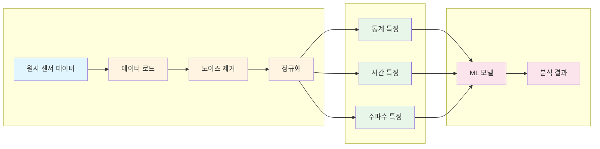
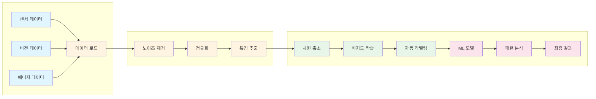

# 전처리 및 라벨링 기술 기반 스마트 제조 데이터 분석 플랫폼 개발 사업계획서

**작성일**: 2025년  
**작성기관**: (주)한솔코에버  
**사업명**: 제조업 데이터 전처리 및 자동 라벨링 기술 개발

---

## 목차

1. [사업 개요](#1-사업-개요)
2. [연구 목적 및 필요성](#2-연구-목적-및-필요성)
3. [연구 내용 및 방법론](#3-연구-내용-및-방법론)
   - 3.1 전처리 기술
   - 3.2 라벨링 기술
4. [연구 수행 계획](#4-연구-수행-계획)
5. [기대 효과](#5-기대-효과)
6. [연구 수행 능력](#6-연구-수행-능력)
7. [사업화 계획](#7-사업화-계획)

---

## 1. 사업 개요

### 1.1 사업 배경

제조업의 디지털 전환(DX)이 가속화되면서, 공장에서 생성되는 대량의 센서 데이터와 이미지 데이터를 효과적으로 분석하여 품질 향상, 불량 예방, 에너지 효율화를 달성하는 것이 핵심 과제로 부상하고 있습니다. 특히 제조 현장에서는 다음과 같은 기술적 한계에 직면해 있습니다:

- **데이터 품질 문제**: 원시 센서 데이터의 노이즈, 결측값, 이상치로 인한 분석 정확도 저하
- **라벨링 비용**: 수동 라벨링에 소요되는 시간과 비용이 과도하며, 전문가 의존도가 높음
- **시계열 데이터 처리**: 복잡한 시계열 패턴을 효과적으로 전처리하고 특징을 추출하는 기술 부족
- **통합 분석 플랫폼 부재**: 전처리와 라벨링을 통합한 일관된 데이터 분석 파이프라인 부재

### 1.2 연구 목표

본 사업은 제조업 데이터의 전처리 및 자동 라벨링 기술을 개발하여, 다음과 같은 목표를 달성하고자 합니다:

1. **고품질 데이터 전처리 기술 개발**: 시계열 센서 데이터의 노이즈 제거, 정규화, 특징 추출 기술 개발
2. **자동 라벨링 시스템 구축**: 비지도 학습 기반 이상 탐지 및 자동 라벨링 기술 개발
3. **통합 데이터 분석 플랫폼**: 전처리와 라벨링을 통합한 일관된 파이프라인 구축
4. **실제 제조 현장 적용**: 대기업 납품 실적을 통한 기술 검증 및 산업화

### 1.3 연구 범위

- **전처리 기술**: 시계열 데이터 정규화, 노이즈 제거, 특징 추출, 차원 축소
- **라벨링 기술**: 비지도 학습 기반 자동 라벨링, Vision 기반 라벨링, 패턴 분석
- **통합 플랫폼**: 전처리-라벨링-분석 통합 파이프라인
- **검증 및 실증**: 실제 제조 현장 적용 및 성능 검증

---

## 2. 연구 목적 및 필요성

### 2.1 제조업 데이터의 복잡성과 전처리 필요성

제조 현장에서 수집되는 데이터는 다음과 같은 특성을 가집니다:

- **다양한 센서 데이터**: 온도, 압력, 진동, 전류 등 다양한 물리량 측정
- **시계열 특성**: 시간에 따른 연속적인 변화 패턴 분석 필요
- **노이즈 및 이상치**: 공정 환경의 영향으로 노이즈와 이상치 포함
- **고차원 데이터**: 수백 개의 센서로부터 생성되는 다차원 데이터

이러한 복잡성을 해결하기 위해서는 체계적인 전처리 과정이 필수적입니다. 한솔코에버는 AMS(분석관리시스템) 프로젝트에서 **93.7%의 이상 탐지율**을 달성한 경험을 바탕으로, 효과적인 전처리 기술을 개발하고 검증했습니다.

### 2.2 수동 라벨링의 한계와 자동화 필요성

기존 라벨링 방식의 문제점:

- **시간 소모**: 전문가가 수동으로 데이터를 검토하고 라벨을 부여하는 데 상당한 시간 소요
- **비용 증가**: 대량의 데이터를 처리하기 위한 인력 비용이 과도함
- **일관성 부족**: 라벨러 간 주관적 판단으로 인한 라벨링 일관성 저하
- **확장성 제한**: 새로운 데이터가 지속적으로 생성되는 환경에서 수동 라벨링의 확장성 부족

자동 라벨링 기술은 이러한 문제를 해결하고, 비지도 학습 기반 이상 탐지를 통해 **이상 징후 구간에 자동으로 라벨(0/1)을 부여**하는 방식으로 효율성을 크게 향상시킬 수 있습니다.

### 2.3 기존 기술의 문제점 및 개선 방향

**기존 기술의 한계**:
- 전처리와 라벨링이 분리되어 있어 데이터 흐름의 일관성 부족
- 범용 도구의 한계로 제조업 특화 최적화 부족
- 실시간 처리 능력 부족

**개선 방향**:
- 전처리와 라벨링을 통합한 일관된 파이프라인 구축
- 제조업 도메인 특화 알고리즘 개발
- 모듈화된 구조로 확장성 및 재사용성 확보

---

## 3. 연구 내용 및 방법론

### 3.1 전처리 기술

#### 3.1.1 시계열 데이터 전처리 방법론

한솔코에버는 MLS(머신러닝 서비스) 시스템을 통해 시계열 데이터 전처리 기술을 개발했습니다. MLS 시스템은 데이터 수집부터 특징 추출까지 체계적인 파이프라인으로 구성되어 있으며, 각 계층별로 최적화된 모듈을 포함하고 있습니다.

**MLS 시스템 구조 및 핵심 모듈**:

1. **데이터 수집 계층**: 원시 센서 데이터 수집 및 로드 모듈
   - 다양한 센서(온도, 압력, 진동, 전류 등)로부터 데이터 수집
   - CSV/JSON 형식의 데이터 파싱 및 로드
   - 데이터 형식 변환 및 통합

2. **전처리 계층**: 데이터 전처리 엔진
   - 노이즈 제거 및 이상치 처리 모듈
   - 데이터 정규화 및 스케일링 모듈
   - 데이터 품질 검증 모듈

3. **특징 추출 계층**: 특징 추출 엔진
   - 통계적 특징 추출 모듈 (평균, 분산, 최대값, 최소값 등)
   - 시간 도메인 특징 추출 모듈 (자기상관, 부분 자기상관)
   - 주파수 도메인 특징 추출 모듈 (FFT 주파수 성분)
   - 시계열 패턴 분석 모듈

4. **머신러닝 계층**: 모델 학습 및 추론 모듈
   - 전처리된 데이터를 기반으로 머신러닝 모델 학습
   - 이상 탐지 및 예측 수행

**전처리 프로세스**:

#### 3.1.2 노이즈 제거 및 정규화 기법

**노이즈 제거**:
- 이동 평균 필터링: 시계열 데이터의 단기 변동 완화
- 이상치 탐지 및 제거: 통계적 방법(IQR, Z-score)을 통한 이상치 식별
- 스무딩 기법: 로컬 가중 회귀를 통한 데이터 스무딩

**정규화 기법**:
- Min-Max 정규화: 데이터를 0-1 범위로 스케일링
- Z-score 정규화: 평균 0, 표준편차 1로 표준화
- Robust 정규화: 이상치에 강건한 정규화 방법

#### 3.1.3 특징 추출 및 차원 축소

**특징 추출**:
- 통계적 특징: 평균, 분산, 왜도, 첨도, 최대값, 최소값
- 시간 도메인 특징: 자기상관, 부분 자기상관
- 주파수 도메인 특징: FFT를 통한 주파수 성분 추출
- 도메인 특화 특징: 제조 공정별 특성에 맞는 특징 설계

**차원 축소**:
- **특징 선택 계층**: 상관관계 분석 모듈을 통한 불필요한 특징 제거
- **차원 축소 계층**: 주성분 분석(PCA) 모듈을 통한 고차원 데이터의 주요 성분 추출
- **핵심 인자 선택 계층**: 차원 축소 모듈을 통한 불량과 연관성 높은 핵심 인자 추출

#### 3.1.4 모듈화된 전처리 프로세스

**CoCTK(컨설팅 도구 키트) 시스템 구조**:

CoCTK 시스템은 데이터 분석 및 비용 최적화를 위한 통합 플랫폼으로, 다음과 같은 계층 구조로 구성됩니다:

1. **데이터 수집 계층**: 다양한 소스로부터 데이터 수집 모듈
   - CSV/JSON 기반 데이터 흐름 관리
   - 데이터 형식 변환 및 통합

2. **전처리 계층**: 데이터 전처리 및 정제 모듈
   - 데이터 전처리 엔진: 노이즈 제거, 이상치 처리, 정규화
   - 데이터 품질 검증 모듈

3. **분석 계층**: 상관관계 분석 및 비용 최적화 모듈
   - **상관관계 분석 모듈**: 변수 간 상관관계 분석 및 시각화
   - **비용 최적화 모듈**: 분석 결과를 기반으로 한 비용 최적화 방안 도출
   - **통합 분석 도구**: 전처리-분석-최적화 통합 파이프라인

**CoCTK 프로젝트 성과**:
- GS 1등급 인증 획득 (2024)
- 모듈화된 전처리 프로세스로 재사용성 및 확장성 확보
- 다양한 제조업체에 적용 가능한 범용 분석 도구 구축

**전처리-라벨링 통합 파이프라인**:

### 3.2 라벨링 기술

#### 3.2.1 비지도 학습 기반 자동 라벨링

**자동 라벨링 시스템 구조**:

자동 라벨링 시스템은 AMS(분석관리시스템) 플랫폼의 라벨링 계층에 구현되어 있으며, 다음과 같은 계층 구조로 구성됩니다:

1. **입력 데이터 계층**: 시계열/Vision 데이터 수집 모듈
   - 다양한 소스로부터 데이터 수집 및 통합
   - 데이터 형식 표준화

2. **차원 축소 계층**: 고차원 데이터 처리 모듈
   - **특징 선택 모듈**: 수백 개의 비전 특징 중 핵심 인자 추출
   - **주성분 분석 모듈**: 불량과 가장 연관성 높은 주요 성분(주성분) 선택
   - **차원 최적화 모듈**: 효율적인 라벨링을 위한 데이터 차원 최적화

3. **비지도 학습 계층**: 이상 탐지 및 패턴 인식 모듈
   - **클러스터링 모듈**: K-means, DBSCAN 등을 통한 이상 클러스터 탐지
   - **이상 탐지 모듈**: 정상 패턴과의 비교를 통한 이상 구간 식별
   - **패턴 식별 모듈**: 다양한 이상 유형에 대한 분류

4. **라벨링 계층**: 자동 라벨 부여 모듈
   - **자동 라벨링 엔진**: 이상 징후 구간에 자동으로 라벨 부여 (0:정상, 1:이상)
   - **라벨 검증 모듈**: 라벨링 일관성 확인 및 검증

**라벨링 프로세스**:

```mermaid
flowchart LR
    subgraph Row1[" "]
        InputData[입력 데이터] --> FeatureSelection[특징 선택]
        FeatureSelection --> PCA[주성분 분석]
        PCA --> DimensionOptimize[차원 최적화]
    end
    
    subgraph Row2[" "]
        DimensionOptimize --> Clustering[클러스터링]
        Clustering --> AnomalyDetect[이상 탐지]
        AnomalyDetect --> PatternIdentify[패턴 식별]
    end
    
    subgraph Row3[" "]
        PatternIdentify --> AutoLabel[자동 라벨]
        AutoLabel --> LabelValidation[라벨 검증]
        LabelValidation --> PatternAnalysis[패턴 분석]
        PatternAnalysis --> Result[최종 결과]
    end
    
    style InputData fill:#e1f5ff
    style FeatureSelection fill:#fff4e1
    style PCA fill:#fff4e1
    style DimensionOptimize fill:#fff4e1
    style Clustering fill:#e8f5e9
    style AnomalyDetect fill:#e8f5e9
    style PatternIdentify fill:#e8f5e9
    style AutoLabel fill:#f3e5f5
    style LabelValidation fill:#f3e5f5
    style PatternAnalysis fill:#fce4ec
    style Result fill:#fce4ec
```

#### 3.2.2 이상 탐지 및 패턴 인식

**이상 탐지 방법**:
- 클러스터링 기반: K-means, DBSCAN 등을 통한 이상 클러스터 탐지
- 통계적 방법: 정상 분포로부터 벗어난 데이터 포인트 식별
- 시계열 패턴 분석: 시간적 변화 패턴을 통한 이상 구간 탐지

**패턴 인식**:
- 정상 패턴 학습: 정상 상태의 데이터 패턴 학습
- 이상 패턴 식별: 학습된 정상 패턴과의 차이를 통한 이상 탐지
- 패턴 분류: 다양한 이상 유형에 대한 분류 및 라벨링

#### 3.2.3 Vision 기반 라벨링 시스템

**Image_Labeling_Platform 구조**:

Image_Labeling_Platform은 DPS(데이터수집시스템)의 비전 처리 계층에 구현된 Halcon 기반 비전 시스템입니다. 이 플랫폼은 다음과 같은 계층 구조로 구성됩니다:

1. **이미지 수집 계층**: 산업용 카메라 및 이미지 스트림 모듈
   - 실시간 이미지 수집 및 스트림 관리
   - 연속 촬영 및 이미지 버퍼링

2. **비전 처리 계층**: Halcon 엔진 및 딥러닝 모듈
   - **Halcon 엔진**: MVTec Halcon 라이브러리를 직접 임베딩한 C# 플랫폼
   - **Pipeline JSON 모듈**: 동적 파이프라인 구성 및 관리
   - **딥러닝 추론 모듈**: 엣지 컴퓨팅 환경에서 실시간 추론 수행

3. **특징 추출 계층**: 비전 특징 추출 모듈
   - **비전 특징 추출 모듈**: 이미지에서 불꽃 면적(Spark_Area), 크랙 길이(Crack_Len) 등 수치 추출
   - **특징 정규화 모듈**: 추출된 특징의 노이즈 제거 및 정규화
   - **시계열 변환 모듈**: 비전 특징을 시계열 데이터로 재가공

4. **라벨링 계층**: 비전 기반 자동 라벨링 모듈
   - **자동 라벨링 모듈**: 추출된 특징을 기반으로 자동 라벨 부여
   - **라벨 검증 모듈**: 라벨링 일관성 확인

5. **통합 분석 계층**: 비전-시계열 통합 모듈
   - **데이터 융합 모듈**: 비전과 시계열 데이터의 통합 분석
   - **패턴 분석 모듈**: 이상 원인 분석 및 결과 도출

**Vision 기반 라벨링 프로세스**:

```mermaid
flowchart LR
    subgraph Row1[" "]
        Camera[산업용 카메라] --> ImageStream[이미지 스트림]
        ImageStream --> HalconEngine[Halcon 엔진]
        HalconEngine --> PipelineJSON[Pipeline JSON]
        PipelineJSON --> DLModel[딥러닝 모델]
    end
    
    subgraph Row2[" "]
        DLModel --> VisionFeature[비전 특징 추출]
        VisionFeature --> FeatureNormalize[특징 정규화]
        FeatureNormalize --> TimeSeriesConvert[시계열 변환]
    end
    
    subgraph Row3[" "]
        TimeSeriesConvert --> AutoLabelVision[자동 라벨링]
        AutoLabelVision --> LabelValidation[라벨 검증]
        LabelValidation --> VisionTimeSeries[비전-시계열 통합]
        VisionTimeSeries --> PatternAnalysis[패턴 분석]
        PatternAnalysis --> Result[최종 결과]
    end
    
    style Camera fill:#e1f5ff
    style ImageStream fill:#e1f5ff
    style HalconEngine fill:#fff4e1
    style PipelineJSON fill:#fff4e1
    style DLModel fill:#fff4e1
    style VisionFeature fill:#e8f5e9
    style FeatureNormalize fill:#e8f5e9
    style TimeSeriesConvert fill:#e8f5e9
    style AutoLabelVision fill:#f3e5f5
    style LabelValidation fill:#f3e5f5
    style VisionTimeSeries fill:#fce4ec
    style PatternAnalysis fill:#fce4ec
    style Result fill:#fce4ec
```

#### 3.2.4 에너지 데이터 패턴 분석

**생산공정 에너지 데이터 패턴 분석 시스템 구조** (2023):

생산공정 에너지 데이터 패턴 분석 시스템은 에너지 효율화를 위한 통합 분석 플랫폼으로, 다음과 같은 계층 구조로 구성됩니다:

1. **데이터 수집 계층**: 에너지 데이터 수집 모듈
   - 설비 상태 데이터 수집
   - 전력 소비 데이터 수집
   - 시간대별, 공정별 데이터 통합

2. **전처리 계층**: 에너지 데이터 전처리 모듈
   - 데이터 정제 및 정규화
   - 노이즈 제거 및 이상치 처리

3. **패턴 분석 계층**: 에너지 패턴 분석 모듈
   - **에너지 소비 패턴 분석 모듈**: 시간대별, 공정별 에너지 소비 패턴 분석
   - **이상 소비 탐지 모듈**: 정상 에너지 소비 패턴과의 차이를 통한 이상 탐지
   - **패턴 분류 모듈**: 다양한 에너지 소비 패턴 분류

4. **라벨링 계층**: 에너지 데이터 라벨링 모듈
   - **자동 라벨링 모듈**: 에너지 소비 패턴에 대한 자동 라벨 부여
   - **라벨 검증 모듈**: 라벨링 일관성 확인

5. **효율화 계층**: 에너지 효율화 방안 도출 모듈
   - **효율화 분석 모듈**: 분석 결과를 바탕으로 에너지 효율화 방안 도출
   - **최적화 제안 모듈**: 구체적인 에너지 절감 방안 제시

**프로젝트 성과**:
- 설비 상태 데이터 패턴 분석 시스템 구축
- 라벨링 시스템 구축 완료
- 에너지 효율화 기반 구축 및 검증

---

## 4. 연구 수행 계획

### 4.1 연구 기간 및 단계별 계획

**총 연구 기간**: 3년 (36개월)

#### 1단계: 기반 기술 개발 (12개월)

**목표**: 전처리 및 라벨링 핵심 기술 개발

**주요 과제**:
- 시계열 데이터 전처리 알고리즘 고도화
- 비지도 학습 기반 자동 라벨링 알고리즘 개발
- Vision 기반 라벨링 시스템 통합
- 모듈화된 파이프라인 구조 설계

**마일스톤**:
- 전처리 모듈 프로토타입 완성 (6개월)
- 자동 라벨링 모듈 프로토타입 완성 (9개월)
- 통합 파이프라인 1차 버전 완성 (12개월)

#### 2단계: 통합 플랫폼 개발 (12개월)

**목표**: 전처리-라벨링-분석 통합 플랫폼 구축

**주요 과제**:
- 전처리와 라벨링 모듈 통합
- 실시간 데이터 처리 파이프라인 구축
- 사용자 인터페이스 개발
- 성능 최적화 및 안정성 향상

**마일스톤**:
- 통합 플랫폼 베타 버전 완성 (18개월)
- 실증 테스트 완료 (21개월)
- 플랫폼 안정화 및 최적화 (24개월)

#### 3단계: 실증 및 사업화 (12개월)

**목표**: 실제 제조 현장 적용 및 사업화

**주요 과제**:
- 대기업 제조 현장 실증
- 성능 검증 및 개선
- 기술 이전 및 사업화 준비
- 시장 확대 전략 수립

**마일스톤**:
- 실증 완료 및 성능 검증 (30개월)
- 기술 이전 완료 (33개월)
- 사업화 준비 완료 (36개월)

### 4.2 예산 및 인력 계획

**예산 구성**:
- 인건비: 연구원 인건비 (60%)
- 연구개발비: 알고리즘 개발, 실증 테스트 (30%)
- 기타: 장비, 소프트웨어 라이선스 등 (10%)

**인력 구성**:
- 연구책임자: 1명
- 전처리 기술 연구원: 2명
- 라벨링 기술 연구원: 2명
- 통합 플랫폼 개발 연구원: 2명
- 실증 및 검증 연구원: 1명

---

## 5. 기대 효과

### 5.1 기술적 기대 효과

1. **데이터 품질 향상**: 체계적인 전처리를 통한 분석 정확도 향상
2. **라벨링 효율성**: 자동 라벨링을 통한 시간 및 비용 절감 (예상 80% 이상)
3. **실시간 처리**: 실시간 데이터 처리 파이프라인 구축
4. **확장성**: 모듈화된 구조로 다양한 제조 공정에 적용 가능

### 5.2 산업적 파급 효과

1. **제조업 디지털 전환 가속**: 데이터 기반 의사결정 체계 구축
2. **품질 향상**: 이상 탐지 및 예방을 통한 품질 개선
3. **에너지 효율화**: 에너지 패턴 분석을 통한 효율 향상 (예상 20% 이상)
4. **비용 절감**: 불량률 감소 및 생산 효율 향상을 통한 비용 절감

### 5.3 경제적 효과

**직접적 효과**:
- 라벨링 비용 절감: 연간 수억 원 규모 비용 절감 가능
- 품질 개선: 불량률 감소를 통한 손실 방지 (연간 수십억 원 규모)
- 에너지 절감: 에너지 효율 향상을 통한 비용 절감 (예상 20% 이상)

**간접적 효과**:
- 제조업 경쟁력 강화
- 일자리 창출 (고급 기술 인력)
- 기술 수출 기회 확대

---

## 6. 연구 수행 능력

### 6.1 회사 개요 및 사업 분야

**회사명**: (주)한솔코에버  
**소속**: 한솔그룹 자회사  
**사업 분야**: EMS, MES, AI, 3D 프린팅, 스마트 팩토리 전문 기업  
**전문 영역**: 제조 및 에너지 IT 전문  
**설립/운영**: 2020년부터 AI 및 스마트 팩토리 솔루션 개발

### 6.2 관련 프로젝트 수행 경험 및 성과

#### 6.2.1 AMS (분석관리시스템) 프로젝트

**기간**: 2024.07 ~ 2025.03  
**발주처**: 한국산업기술진흥원  
**역할**: AI 종합 플랫폼 개발 총괄 PM

**핵심 성과**:
- 데이터 전처리 파이프라인 설계 및 구축
- 이상 탐지율 **93.7%** 달성 (실질적 정확도 60~70%, 데이터 한계 고려)
- 확률 최적화(경사하강법 이용)를 통한 이상상황 확률 네트워크 구축
- 시계열 분석에 대한 정보 온톨로지 output 생성
- **GS 1등급 (PDS 명칭)** 인증 획득
- 특허 등록
- **세아특수강/포미아 정식 납품** 완료
- **논문 발표** (2025, 2024)

#### 6.2.2 CoCTK (컨설팅 도구 키트) 프로젝트

**기간**: 2022.03 ~ 2024  
**발주처**: 중소기업기술정보진흥원  
**역할**: 엔진 총괄 설계 & 화면설계 개발 총괄 PM

**핵심 성과**:
- 데이터 전처리, 상관관계 분석 도구 개발
- 비용 최적화 통합 분석 도구 구축
- **GS 1등급** 인증 획득 (2024)
- **논문 발표** (2023)

#### 6.2.3 생산공정 에너지 데이터 패턴 분석 프로젝트

**기간**: 2023  
**역할**: 메인 수행

**핵심 성과**:
- 라벨링 시스템 구축
- 설비 상태 데이터 패턴 분석
- 에너지 효율화 기반 구축

#### 6.2.4 자동 전처리 플랫폼 개발

**상태**: 백단 기술적 설계 완료

**핵심 내용**:
- 모듈화된 전처리 프로세스 설계
- 데이터 수집 및 전처리 파이프라인 구조 설계

### 6.3 기술 인증 및 성과

**GS 인증 1등급 2개**:
- CoCTK: 소프트웨어 품질 인증 최고 등급 (2024)
- AMS(PDS): 소프트웨어 품질 인증 최고 등급 (2025)

**특허 출원/등록**:
- 피쉬본 관리 시스템 등 (한솔코에버 명의)

**논문 발표**:
- 관련 연구 논문 다수 게재
- AMS 관련 논문 (2025, 2024)
- CoCTK 관련 논문 (2023)
- 에너지 최적화 관련 논문 (2023)

### 6.4 납품 실적 및 고객 사례

**실 납품 실적**:
- **세아특수강**: 정식 납품 완료 (2025)
- **포미아(포항소재산업진흥원)**: 정식 납품 완료 (2025)
- **일본 글로벌 기업**: 전사 DX 시스템 구축 (2020~2024)

**고객 사례**:
- AMS 시스템을 통한 이상 탐지율 93.7% 달성
- 에너지 효율 20% 향상 (클린룸 에너지 최적화 프로젝트)
- 불량률 감소 및 생산 효율 향상

### 6.5 보유 기술 스택 및 아키텍처

**핵심 기술 스택**:
- **Python**: 데이터 분석, 머신러닝/딥러닝, 파이프라인 구축 (5년 경력)
- **시계열 분석**: 시계열 데이터 처리 전문성
- **비지도 학습**: 이상 탐지, 클러스터링, 자동 라벨링
- **Vision 시스템**: Halcon 기반 이미지 분석 및 라벨링
- **데이터베이스**: Neo4j (그래프 DB), MSSQL, PostgreSQL

**아키텍처 경험**:
- 5층 아키텍처 설계 (DPS 프로젝트)
- Microservices 아키텍처
- 모듈화된 파이프라인 구조
- 실시간 데이터 처리 시스템

---

## 7. 사업화 계획

### 7.1 기술 이전 방안

**단계별 기술 이전**:
1. **1단계**: 전처리 및 라벨링 핵심 기술 이전
2. **2단계**: 통합 플랫폼 구축 기술 이전
3. **3단계**: 실증 및 검증 방법론 이전

**이전 방식**:
- 기술 문서화 및 매뉴얼 제공
- 기술 교육 및 세미나
- 현장 지원 및 컨설팅

### 7.2 시장 진입 전략

**타겟 시장**:
- 대기업 제조업체 (철강, 자동차, 전자 등)
- 중소기업 제조업체 (스마트 팩토리 구축 기업)
- 시스템 통합 업체

**진입 전략**:
- 기존 고객사(세아특수강, 포미아) 확대 적용
- 제조업 클러스터 및 협회를 통한 마케팅
- 기술 세미나 및 전시회 참가

### 7.3 파트너십 및 협력 방안

**협력 파트너**:
- 제조업체: 기술 검증 및 실증 파트너
- 시스템 통합 업체: 플랫폼 통합 및 판매 파트너
- 연구기관: 공동 연구 및 기술 개발

**협력 방안**:
- 공동 연구 개발
- 기술 라이선싱
- OEM/ODM 파트너십

---

## 부록

### A. 참고 문헌

- AMS 프로젝트 기술 문서
- CoCTK 프로젝트 기술 문서
- 생산공정 에너지 데이터 패턴 분석 보고서
- 관련 학술 논문

### B. 용어 정의

- **전처리**: 원시 데이터를 분석 가능한 형태로 변환하는 과정
- **라벨링**: 데이터에 의미 있는 태그나 분류를 부여하는 과정
- **비지도 학습**: 라벨 없이 데이터의 패턴을 학습하는 방법
- **시계열 데이터**: 시간에 따라 순차적으로 기록된 데이터
- **이상 탐지**: 정상 패턴과 다른 이상 패턴을 찾아내는 기술

---

**문서 버전**: 1.0  
**최종 수정일**: 2025년

