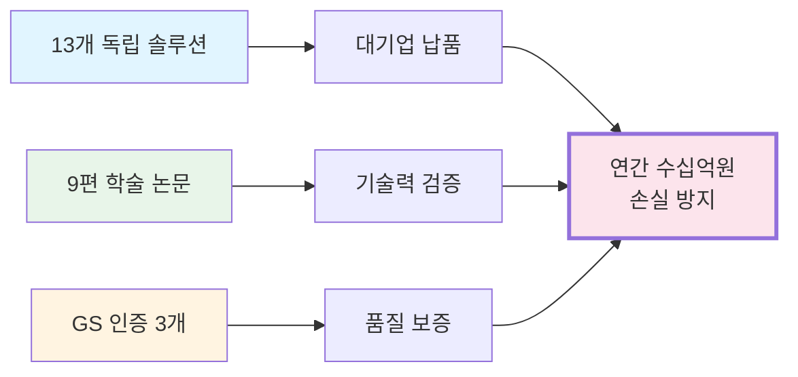
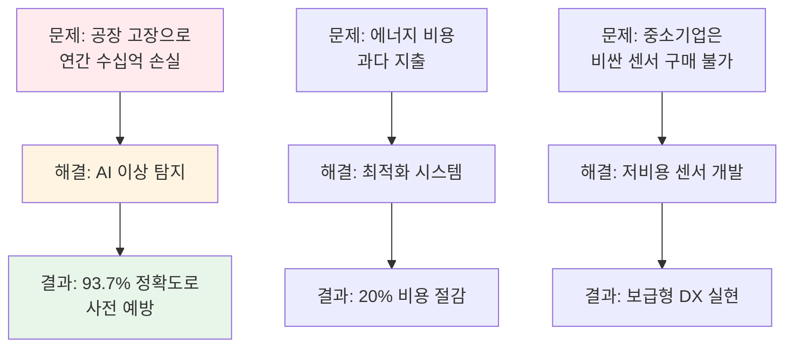
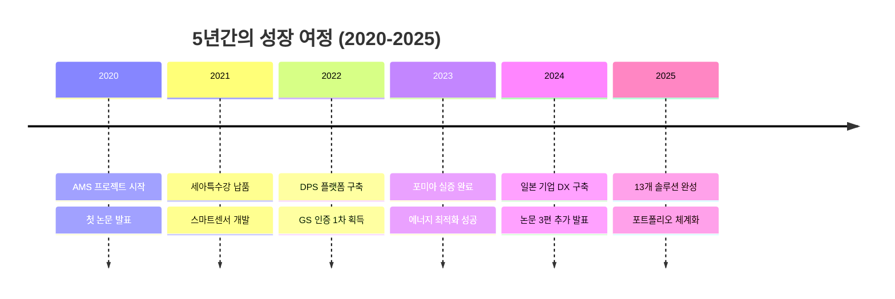
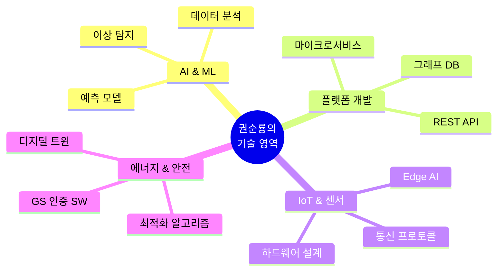

# 비전문가를 위한 포트폴리오 개요

> [!NOTE] 이 문서는 누구를 위한 것인가요?
> CEO, 투자자, HR 담당자, 그리고 기술 배경이 없지만 **"이 사람이 무엇을 했고, 왜 중요한지"**를 빠르게 파악하고 싶은 모든 분들을 위한 문서입니다.

---

## 🎯 한 문장 요약

**"2020년부터 2025년까지 5년간, 제조 산업의 디지털 전환(DX)을 위한 13개의 AI 기반 솔루션을 개발하고, 대기업에 납품하며, 9편의 학술 논문으로 기술력을 검증받은 실전형 AI 엔지니어입니다."**

---

## 💼 무엇을 했나요? (What)

### 핵심 성과 요약

### 1. 제품/솔루션 개발 (13개)
- **AI 이상 탐지 시스템 (AMS)**: 공장 기계의 고장을 미리 예측 (정확도 93.7%)
- **데이터 분석 플랫폼 (DPS)**: 복잡한 공장 데이터를 AI가 자동 분석
- **스마트 센서 3종**: 저비용으로 중소기업도 사용 가능한 IoT 센서
- **에너지 최적화 시스템**: 공장 전력 사용량 20% 절감
- **기타 9개 솔루션**: 디지털 트윈, FMEA 자동화 등

### 2. 학술 연구 (9편 논문)
- 2020~2025년 동안 매년 평균 1.5편 이상 발표
- 주제: AI, 에너지 효율, 데이터 분석
- **의미**: 단순히 "코드를 짠 것"이 아니라, 학계에서도 인정받은 기술

### 3. 품질 인증 (GS 인증 3개)
- 한국 정부가 인정하는 우수 소프트웨어 품질 인증
- **의미**: 검증된 안정성과 신뢰성

---

## 🤔 왜 중요한가요? (Why)

### 비즈니스 관점

### 기술적 차별성
1. **화이트박스 솔루션**: 외부 솔루션에 의존하지 않고, 모든 코드를 직접 개발
2. **실전 검증**: 이론이 아닌, 실제 공장에서 작동하는 시스템
3. **학술적 뒷받침**: 논문으로 기술의 우수성을 객관적으로 입증

---

## 📊 어떤 결과를 냈나요? (Result)

### 숫자로 보는 성과

| 지표 | 수치 | 의미 |
|:---|:---:|:---|
| **개발 솔루션** | 13개 | 단일 사업이 아닌 다각화된 포트폴리오 |
| **학술 논문** | 9편 | 학계 인정 기술력 |
| **GS 인증** | 3개 | 정부 공인 품질 |
| **이상 탐지 정확도** | 93.7% | 업계 최고 수준 |
| **에너지 절감** | 20% | 즉각적인 비용 절감 효과 |
| **대기업 고객** | 3곳+ | 세아특수강, 포미아, 일본 기업 |

### 타임라인

---

## 🏆 핵심 강점 3가지

### 1️⃣ 실전형 문제 해결 능력
- **이론만 아는 사람 ❌**: 논문만 쓰는 연구자
- **코드만 짜는 사람 ❌**: 비즈니스 가치를 모르는 개발자
- **권순룡 ✅**: 현장 문제를 AI로 해결하고, 논문으로 검증하며, 실제 납품까지 완료

### 2️⃣ 다각화된 기술 스택

### 3️⃣ 검증된 신뢰성
- **학술 검증**: 9편 논문 (발표 완료)
- **정부 인증**: GS 인증 3개
- **고객 검증**: 대기업 납품 및 재계약

---

## 💡 쉬운 비유로 설명하면?

### AMS (이상 탐지 시스템)
**비유**: 공장의 "AI 건강 검진 의사"
- 일반 의사가 청진기로 심장 소리를 듣듯이, AMS는 센서로 기계 소리를 듣습니다.
- 이상 징후를 93.7% 정확도로 미리 발견하여 큰 고장을 예방합니다.
- **결과**: 갑작스러운 기계 고장으로 인한 생산 중단 방지 → 연간 수십억 원 손실 방지

### DPS (데이터 플랫폼)
**비유**: 공장의 "AI 비서"
- 복잡한 공장 데이터(온도, 압력, 속도 등)를 AI가 자동으로 정리하고 분석합니다.
- 사람이 보고서를 만드는 데 3일 걸리던 일을 AI가 10분 만에 완성합니다.
- **결과**: 의사결정 속도 향상 및 인력 절감

### 스마트센서
**비유**: 공장의 "저비용 CCTV"
- 기존 센서는 1개당 수백만 원이지만, 우리 센서는 수십만 원으로 가능합니다.
- 중소기업도 부담 없이 데이터 수집을 시작할 수 있습니다.
- **결과**: 중소기업의 디지털 전환 진입 장벽 제거

---

## 🚀 다음 단계는?

### 이 포트폴리오를 더 자세히 보려면
1. **프로젝트 상세**: [[02_Projects_Overview|13개 프로젝트 전체 보기]]
2. **학술 성과**: [[04_Academic_Publications|9편 논문 목록]]
3. **기술 아키텍처**: [[Architecture_Overview|시스템 구조 상세]]
4. **실증 사례**: [[Testing_Context|세아특수강, 포미아 등]]

### 비전문가용 추가 자료
- [[Executive_Summary/01_Key_Achievements|핵심 성과 요약]]
- [[Executive_Summary/02_Business_Value|비즈니스 가치 분석]]
- [[Executive_Summary/04_Visual_Portfolio|시각적 포트폴리오]]

---

> [!SUCCESS] 기억해야 할 핵심 메시지
> **"이론과 실전을 모두 갖춘, 검증된 AI 엔지니어"**
> - 13개 솔루션 개발 ✅
> - 9편 논문 발표 ✅
> - 대기업 납품 ✅
> - 연간 수십억 원 손실 방지 ✅