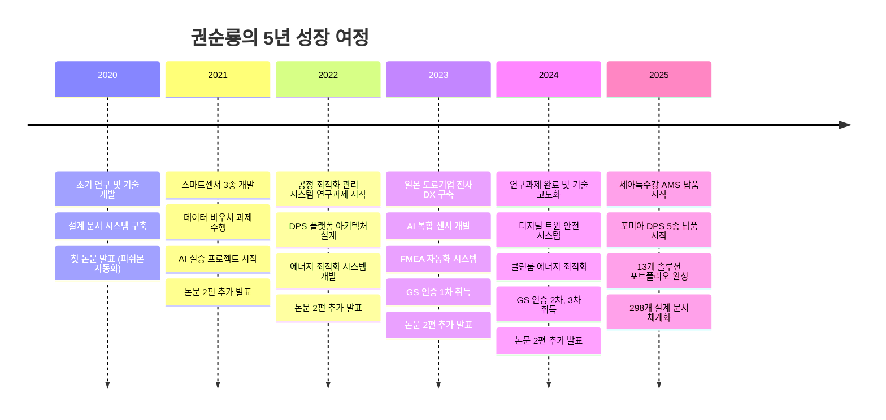
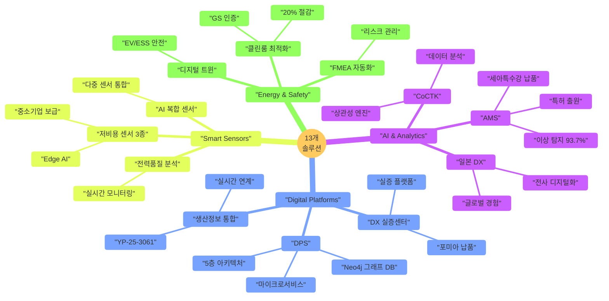
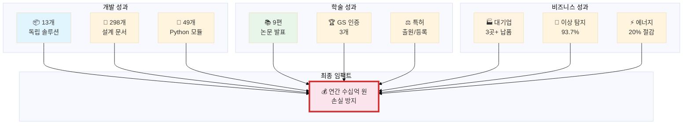
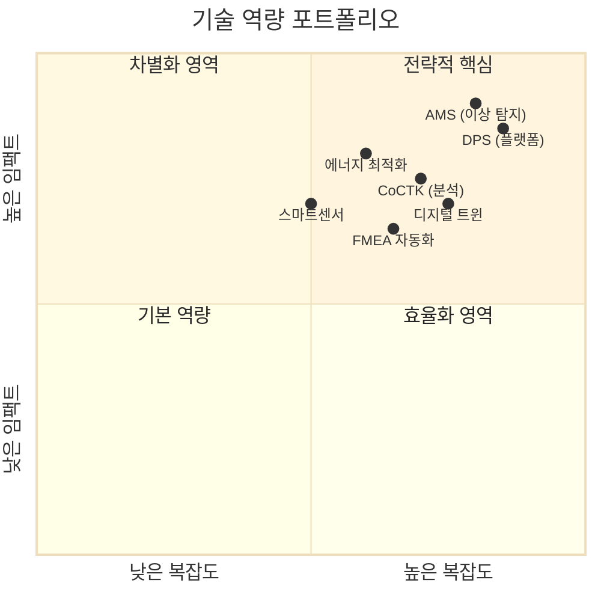
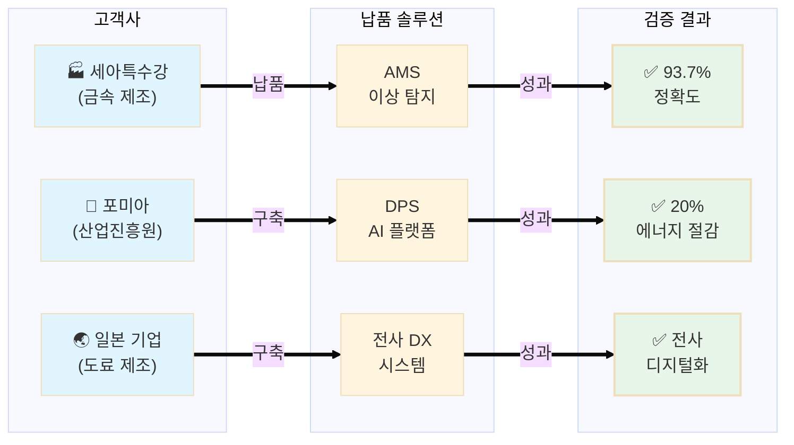
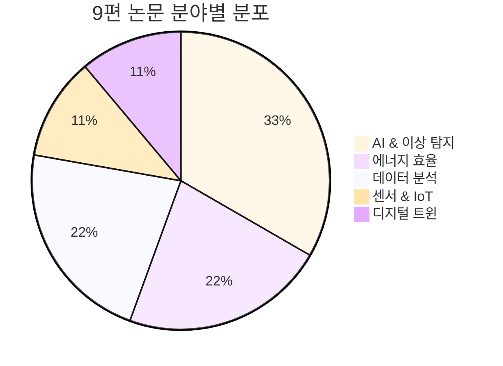
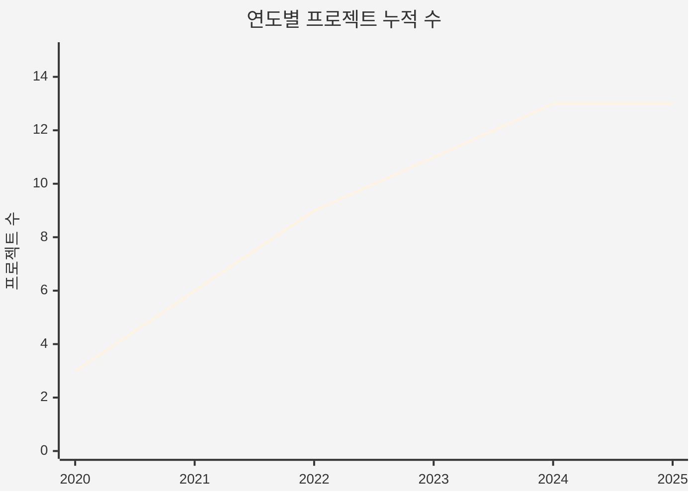
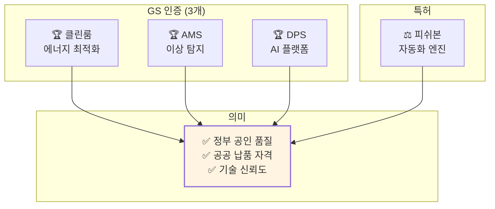
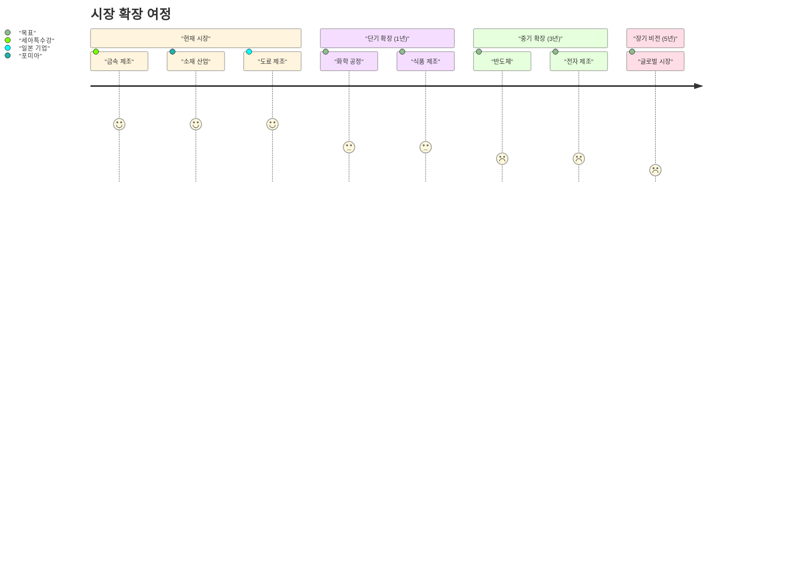
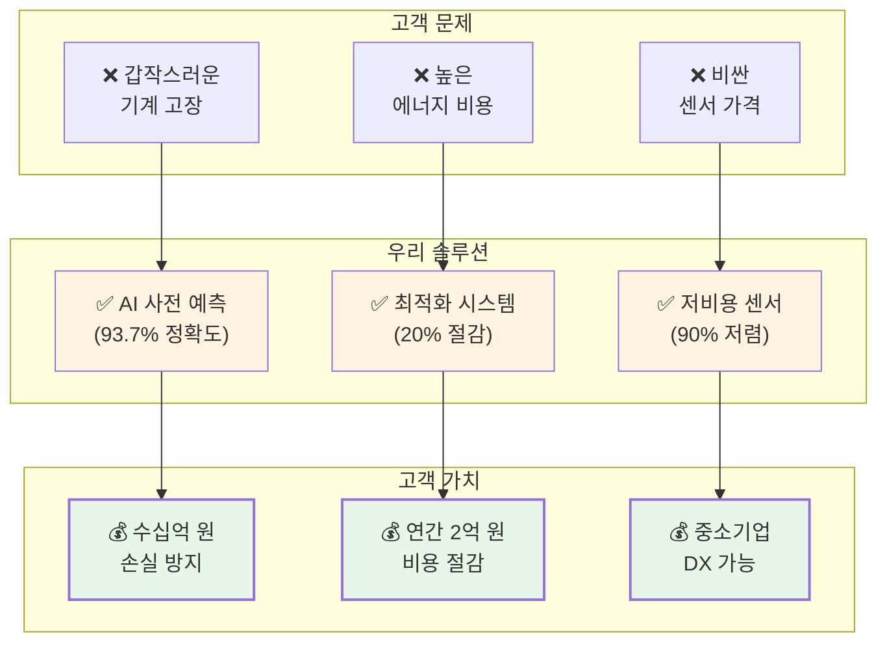

# 시각적 포트폴리오 (Visual Portfolio)

> [!INFO] 한눈에 보는 5년간의 여정
> 타임라인, 인포그래픽, 프로젝트 맵으로 구성된 시각 중심 포트폴리오입니다.

---

## 📅 5년 타임라인 (2020-2025)



---

## 🗺️ 13개 솔루션 프로젝트 맵



---

## 📊 성과 대시보드

### 핵심 지표 한눈에 보기



---

## 🎯 4대 핵심 영역



---

## 🏆 고객사 & 납품 현황



---

## 📚 학술 성과 분포



---

## 💰 비즈니스 임팩트 플로우

```mermaid
%%{init: {'theme':'base'}}%%
sankey-beta
"R&D","AMS 개발",30
"R&D","DPS 개발",25
"R&D","센서 개발",20
"R&D","에너지 시스템",15
"R&D","기타 솔루션",10
"AMS 개발","이상 탐지 93.7%",30
"DPS 개발","에너지 20% 절감",25
"센서 개발","중소기업 보급",20
"에너지 시스템","GS 인증 3개",15
"기타 솔루션","특허 & 논문",10
"이상 탐지 93.7%","손실 방지",30
"에너지 20% 절감","비용 절감",25
"중소기업 보급","시장 확대",20
"GS 인증 3개","신뢰도 향상",15
"특허 & 논문","IP 자산",10
```

---

## 🚀 기술 스택 레이더 차트

```mermaid
%%{init: {'theme':'base'}}%%
---
config:
  themeVariables:
    xyChart:
      backgroundColor: "transparent"
---
xychart-beta
    title "기술 역량 분포 (1-10 척도)"
    x-axis [AI/ML, 플랫폼, IoT, 에너지, 데이터, 제조]
    y-axis "역량 수준" 0 --> 10
    bar [9, 8, 8, 7, 9, 8]
```

---

## 📈 5년간 성장 곡선



---

## 🎓 GS 인증 & 특허 현황



---

## 🌍 시장 확장 로드맵



---

## 💡 핵심 가치 제안



---

## 🔗 관련 문서

### 상세 정보
- [[02_Projects_Overview|13개 프로젝트 상세]]
- [[04_Academic_Publications|9편 논문 목록]]
- [[Architecture_Overview|기술 아키텍처]]
- [[Testing_Context|실증 사례]]

### 비전문가용
- [[Executive_Summary/00_Overview_For_Non_Technical|전체 개요]]
- [[Executive_Summary/01_Key_Achievements|핵심 성과]]
- [[Executive_Summary/02_Business_Value|비즈니스 가치]]
- [[Executive_Summary/03_Technology_Simplified|기술 쉽게 설명]]

---

> [!SUCCESS] 시각적 요약
> **"한눈에 보는 5년간의 성과"**
> - 📦 13개 솔루션
> - 📚 9편 논문
> - 🏆 GS 인증 3개
> - 💰 수십억 원 손실 방지
> - 🌏 대기업 3곳+ 납품