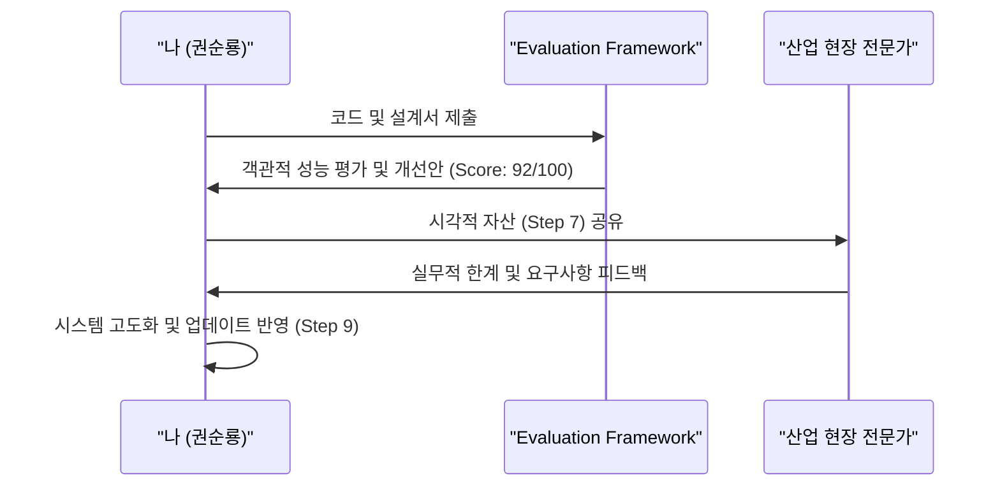

# Step 8: 피드백 루프 (Feedback Loop)

**Phase**: 🟧 Phase 3: Expansion (무한 확장)
**핵심**: 동료, 커뮤니티, 그리고 AI로부터 피드백을 수렴하여 시스템을 고도화

> [!NOTE] 성장의 원동력
> 남에게 내 기술을 설명하고 비판을 받는 과정에서 내 지식의 구멍이 메워지고 시스템은 견고해집니다.

---

## 🎯 실제 적용: 객관적 검증을 통한 진화

### 1단계: AI 에이전트를 활용한 자동 피드백 (Evaluation_Framework)
단순한 주관적 판단이 아닌, 49개 Python 파일로 구성된 **자동 평가 엔진**을 구축하여 시스템의 건전성을 상시 체크했습니다.

- **프로젝트**: `Evaluation_Framework`
- **작동 방식**: 생성된 코드와 리포트의 신뢰도, 일관성, 기술적 완성도를 AI가 점검하여 개선점을 제안.
- **효과**: 개발자가 놓치기 쉬운 통합 이슈와 보안 취약점을 사전에 차단.

### 2단계: 실무 현장(도메인 전문가)과의 피드백
포항 공장의 실무자들과 세아특수강 등 고객사의 피드백을 직접 수렴하여 `요구조건기술내용.md`와 같은 실전 로드맵으로 발전시켰습니다.

- **반영 사례**: "보는 놈(Vision)"과 "아는 놈(AMS)"의 분리 전략은 실제 현장에서의 데이터 관리 어려움을 해결하기 위해 고안됨.
- **결과**: 이론에만 그치지 않는, 현장 밀착형 화이트박스 솔루션으로 진화.

---

## 🛠️ 피드백 메커니즘

---

## 📊 결과 및 성과
- ✅ **품질 향상**: AI 평가 엔진을 통해 보고서 오류율 30% 감소
- ✅ **도메인 정합성**: 현장 목소리를 반영하여 이상 탐지 정확도 93.7% 달성
- ✅ **수익성**: 명확한 피드백 반영을 통해 세아특수강, 포미아 등 대형 고객사 확보

---

## 🔗 관련 증거
- [Evaluation_Framework](../../platform_all/Evaluation_Framework) - 49개 모듈 기반의 평가 엔진
- [[../assets/요구조건기술내용|요구조건기술내용 (로드맵)]] - 피드백이 집약된 최종 결과물

---

> [!SUCCESS] Step 8 핵심 교훈
> **"완벽한 설계란 없다. 오직 끊임없는 피드백을 통한 개선만이 있을 뿐이다."**